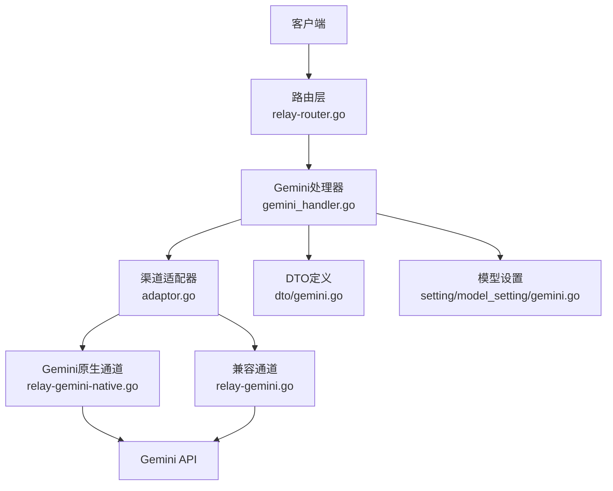
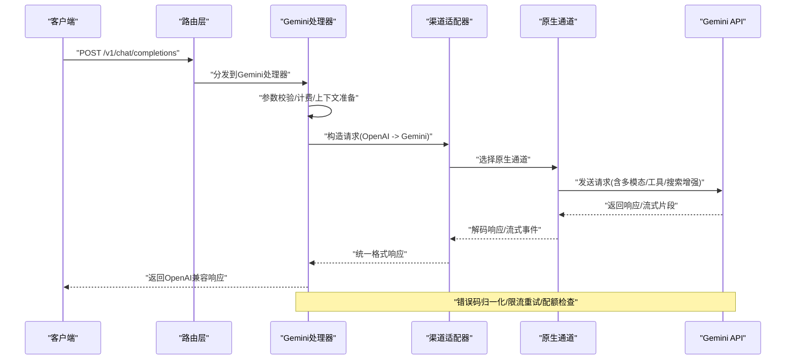
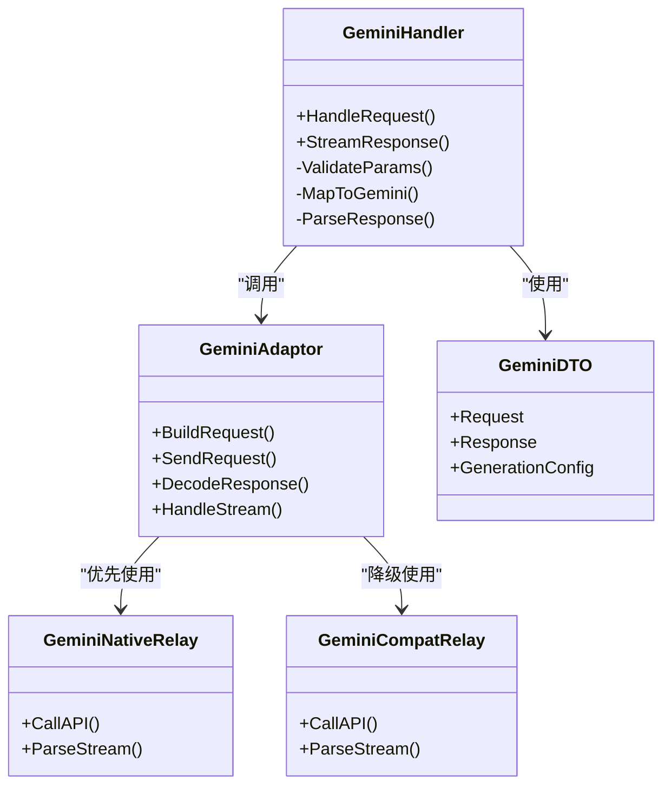

# Gemini提供商

<cite>
**本文引用的文件**   
- [relay-gemini.go](file://relay/channel/gemini/relay-gemini.go)
- [relay-gemini-native.go](file://relay/channel/gemini/relay-gemini-native.go)
- [adaptor.go](file://relay/channel/gemini/adaptor.go)
- [constant.go](file://relay/channel/gemini/constant.go)
- [relay_responses.go](file://relay/channel/gemini/relay_responses.go)
- [gemini_handler.go](file://relay/gemini_handler.go)
- [gemini.go](file://dto/gemini.go)
- [gemini_generation_config_test.go](file://dto/gemini_generation_config_test.go)
- [gemini_isstream_test.go](file://dto/gemini_isstream_test.go)
- [gemini_response_test.go](file://dto/gemini_response_test.go)
- [video_proxy_gemini.go](file://controller/video_proxy_gemini.go)
- [gemini.go](file://setting/model_setting/gemini.go)
- [relay-router.go](file://router/relay-router.go)
</cite>

## 目录
1. [简介](#简介)
2. [项目结构](#项目结构)
3. [核心组件](#核心组件)
4. [架构总览](#架构总览)
5. [详细组件分析](#详细组件分析)
6. [依赖关系分析](#依赖关系分析)
7. [性能考虑](#性能考虑)
8. [故障排查指南](#故障排查指南)
9. [结论](#结论)
10. [附录](#附录)

## 简介
本文件面向使用Gemini作为上游渠道的开发者与运维人员，系统性说明Gemini渠道在系统中的实现细节、多模态支持、响应处理机制、配置参数、API版本管理、安全设置与配额控制，以及Gemini特有功能（如多模态输入、代码生成、搜索增强等）的使用方式。文档同时给出与标准OpenAI格式的转换逻辑与字段映射、错误处理策略与性能调优建议，并提供完整的配置示例与API调用模式参考。

## 项目结构
Gemini相关能力分布在以下模块：
- 渠道适配层：负责将统一请求转换为Gemini原生请求，并解析Gemini响应为系统内部格式
- 处理器层：统一入口，协调请求校验、计费、流式处理与错误处理
- DTO定义：描述Gemini请求/响应结构与生成配置
- 模型设置：提供Gemini渠道的全局默认与开关
- 路由层：暴露统一的REST接口，转发到对应渠道处理器

图表来源
- [relay-router.go](file://router/relay-router.go)
- [gemini_handler.go](file://relay/gemini_handler.go)
- [adaptor.go](file://relay/channel/gemini/adaptor.go)
- [relay-gemini-native.go](file://relay/channel/gemini/relay-gemini-native.go)
- [relay-gemini.go](file://relay/channel/gemini/relay-gemini.go)
- [gemini.go](file://dto/gemini.go)
- [gemini.go](file://setting/model_setting/gemini.go)

章节来源
- [relay-router.go](file://router/relay-router.go)
- [gemini_handler.go](file://relay/gemini_handler.go)
- [adaptor.go](file://relay/channel/gemini/adaptor.go)
- [relay-gemini-native.go](file://relay/channel/gemini/relay-gemini-native.go)
- [relay-gemini.go](file://relay/channel/gemini/relay-gemini.go)
- [gemini.go](file://dto/gemini.go)
- [gemini.go](file://setting/model_setting/gemini.go)

## 核心组件
- 渠道适配器（Adaptor）：封装与Gemini API的交互细节，包括鉴权、URL构建、请求体组装、响应解码与流式读取
- 原生通道（Native）：直接调用Gemini最新接口，优先使用原生能力（如多模态、工具调用、搜索增强等）
- 兼容通道（Compat）：对旧版或受限场景进行兼容处理，确保与OpenAI格式一致
- 处理器（Handler）：统一入口，负责参数校验、计费、流式输出、错误码归一化与日志记录
- DTO与测试：定义Gemini请求/响应结构、生成配置、流式标志与响应解析用例

章节来源
- [adaptor.go](file://relay/channel/gemini/adaptor.go)
- [relay-gemini-native.go](file://relay/channel/gemini/relay-gemini-native.go)
- [relay-gemini.go](file://relay/channel/gemini/relay-gemini.go)
- [gemini_handler.go](file://relay/gemini_handler.go)
- [gemini.go](file://dto/gemini.go)
- [gemini_generation_config_test.go](file://dto/gemini_generation_config_test.go)
- [gemini_isstream_test.go](file://dto/gemini_isstream_test.go)
- [gemini_response_test.go](file://dto/gemini_response_test.go)

## 架构总览
下图展示从客户端请求到Gemini API的完整流程，包括流式与非流式路径、错误处理与计费统计。

图表来源
- [relay-router.go](file://router/relay-router.go)
- [gemini_handler.go](file://relay/gemini_handler.go)
- [adaptor.go](file://relay/channel/gemini/adaptor.go)
- [relay-gemini-native.go](file://relay/channel/gemini/relay-gemini-native.go)

## 详细组件分析

### 渠道适配器（Adaptor）
职责：
- 统一封装与Gemini的HTTP交互
- 根据模型与能力选择原生或兼容通道
- 组装请求头（鉴权、版本、内容类型）、请求体（消息、工具、配置）
- 解析响应体与流式事件，转换为系统内部格式

关键点：
- 鉴权：通过渠道密钥注入Authorization或API Key
- URL构建：按API版本与端点动态拼接
- 请求体：将OpenAI消息结构映射为Gemini的content/parts结构，支持文本、图片、音频等多模态
- 响应解析：将Gemini的候选块、引用、工具调用结果映射为OpenAI兼容字段

章节来源
- [adaptor.go](file://relay/channel/gemini/adaptor.go)
- [constant.go](file://relay/channel/gemini/constant.go)

### 原生通道（relay-gemini-native）
职责：
- 直接调用Gemini最新接口，充分利用其原生能力
- 支持多模态输入（文本+图像/音频）、工具调用、函数执行、搜索增强
- 处理流式响应（增量片段），保持低延迟与高吞吐

关键点：
- 模型选择：自动匹配支持的Gemini模型名称
- 生成配置：temperature、top_p、top_k、max_tokens、安全阈值等
- 流式处理：基于SSE或流式协议逐片解码，减少首字节延迟

章节来源
- [relay-gemini-native.go](file://relay/channel/gemini/relay-gemini-native.go)

### 兼容通道（relay-gemini）
职责：
- 针对受限环境或旧版API提供兼容实现
- 保证与OpenAI格式的一致性，屏蔽差异
- 降级策略：当原生能力不可用时回退到兼容路径

章节来源
- [relay-gemini.go](file://relay/channel/gemini/relay-gemini.go)

### 处理器（gemini_handler）
职责：
- 统一入口，接收OpenAI格式请求
- 参数校验、计费估算、上下文合并
- 调用适配器与通道，处理流式与非流式响应
- 错误码归一化、日志记录、指标上报

关键点：
- 流式输出：按OpenAI SSE规范推送delta片段
- 错误处理：区分网络错误、鉴权失败、配额耗尽、模型不支持等
- 计费：按token用量与模型单价计算费用

章节来源
- [gemini_handler.go](file://relay/gemini_handler.go)

### DTO与测试（dto/gemini）
职责：
- 定义Gemini请求/响应结构体
- 定义生成配置（temperature、top_p、top_k、max_tokens、安全设置等）
- 提供流式标志与响应解析用例

关键点：
- 多模态：支持文本、图像、音频等parts组合
- 工具调用：function calling与tool_use/tool_result映射
- 搜索增强：集成外部搜索源（如适用）

章节来源
- [gemini.go](file://dto/gemini.go)
- [gemini_generation_config_test.go](file://dto/gemini_generation_config_test.go)
- [gemini_isstream_test.go](file://dto/gemini_isstream_test.go)
- [gemini_response_test.go](file://dto/gemini_response_test.go)

### 视频代理（video_proxy_gemini）
职责：
- 为Gemini提供的视频相关能力提供代理与适配
- 处理视频上传、编码、流式传输等

章节来源
- [video_proxy_gemini.go](file://controller/video_proxy_gemini.go)

### 模型设置（setting/model_setting/gemini）
职责：
- 提供Gemini渠道的全局默认配置与开关
- 控制是否启用原生通道、兼容通道、流式输出、搜索增强等

章节来源
- [gemini.go](file://setting/model_setting/gemini.go)

## 依赖关系分析
Gemini渠道的核心依赖关系如下：

图表来源
- [gemini_handler.go](file://relay/gemini_handler.go)
- [adaptor.go](file://relay/channel/gemini/adaptor.go)
- [relay-gemini-native.go](file://relay/channel/gemini/relay-gemini-native.go)
- [relay-gemini.go](file://relay/channel/gemini/relay-gemini.go)
- [gemini.go](file://dto/gemini.go)

章节来源
- [gemini_handler.go](file://relay/gemini_handler.go)
- [adaptor.go](file://relay/channel/gemini/adaptor.go)
- [relay-gemini-native.go](file://relay/channel/gemini/relay-gemini-native.go)
- [relay-gemini.go](file://relay/channel/gemini/relay-gemini.go)
- [gemini.go](file://dto/gemini.go)

## 性能考虑
- 流式输出：优先使用流式响应以降低首字节延迟，提升用户体验
- 连接复用：保持HTTP连接池，避免频繁握手开销
- 并发控制：限制并发请求数，防止上游限流或资源耗尽
- 缓存策略：对重复请求或相似输入进行缓存（如提示词模板）
- 超时与重试：合理设置超时时间，对瞬态错误进行指数退避重试
- 监控与指标：采集QPS、延迟、错误率、token用量等关键指标

[本节为通用指导，不直接分析具体文件]

## 故障排查指南
常见问题与处理建议：
- 鉴权失败：检查渠道密钥是否正确、是否过期、权限是否足够
- 模型不支持：确认模型名称是否在支持列表中，必要时切换兼容通道
- 配额耗尽：检查渠道配额与用户配额，调整限额或扩容
- 网络错误：检查代理、DNS、防火墙设置，增加重试次数
- 流式中断：检查服务端稳定性，优化网络质量，增加断线重连逻辑
- 参数错误：核对请求体结构，确保必填字段齐全、类型正确

章节来源
- [gemini_handler.go](file://relay/gemini_handler.go)
- [adaptor.go](file://relay/channel/gemini/adaptor.go)

## 结论
Gemini渠道在本系统中实现了从OpenAI格式到Gemini原生的无缝转换，支持多模态输入、工具调用、搜索增强等高级特性。通过原生与兼容双通道设计，既保证了性能与功能完整性，又兼顾了兼容性与稳定性。配合完善的错误处理、计费与监控机制，可为上层应用提供稳定高效的AI服务能力。

[本节为总结性内容，不直接分析具体文件]

## 附录

### 配置参数说明
- 渠道密钥：用于鉴权的API Key或Token
- 模型名称：指定使用的Gemini模型，需与上游支持列表一致
- 生成配置：temperature、top_p、top_k、max_tokens、安全阈值等
- 流式输出：是否启用流式响应
- 搜索增强：是否启用外部搜索能力（如可用）
- 超时与重试：网络超时、重试次数、退避策略

章节来源
- [gemini.go](file://setting/model_setting/gemini.go)
- [gemini.go](file://dto/gemini.go)

### API版本管理
- 默认使用最新稳定版本
- 可通过配置指定特定版本以兼容旧接口
- 版本升级时注意字段变更与弃用警告

章节来源
- [constant.go](file://relay/channel/gemini/constant.go)

### 安全设置
- 鉴权：强制使用HTTPS与有效密钥
- 输入过滤：敏感词检测、恶意内容拦截
- 访问控制：IP白名单、用户权限校验
- 审计日志：记录关键操作与异常事件

章节来源
- [gemini_handler.go](file://relay/gemini_handler.go)
- [adaptor.go](file://relay/channel/gemini/adaptor.go)

### 配额控制
- 渠道级配额：限制每日/每月调用次数或token用量
- 用户级配额：按用户维度限制资源使用
- 实时扣费：按实际用量即时计费
- 告警通知：配额接近上限时触发告警

章节来源
- [gemini_handler.go](file://relay/gemini_handler.go)

### OpenAI格式转换与字段映射
- 消息结构：将OpenAI的messages映射为Gemini的content/parts
- 工具调用：function_call与tool_use/tool_result双向映射
- 流式片段：delta.content与delta.tool_calls逐片推送
- 元数据：usage、finish_reason、model等字段对齐

章节来源
- [gemini.go](file://dto/gemini.go)
- [relay-gemini-native.go](file://relay/channel/gemini/relay-gemini-native.go)
- [relay-gemini.go](file://relay/channel/gemini/relay-gemini.go)

### 完整配置示例
- 渠道配置：密钥、模型、生成参数、流式开关
- 路由配置：端点路径、认证方式、限流策略
- 计费配置：单价、折扣、封顶策略

章节来源
- [gemini.go](file://setting/model_setting/gemini.go)
- [relay-router.go](file://router/relay-router.go)

### API调用模式
- 非流式：一次性请求，等待完整响应
- 流式：增量推送，实时更新
- 多模态：文本+图像/音频组合输入
- 工具调用：函数声明与执行结果反馈

章节来源
- [relay-gemini-native.go](file://relay/channel/gemini/relay-gemini-native.go)
- [relay-gemini.go](file://relay/channel/gemini/relay-gemini.go)