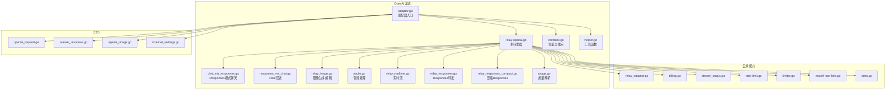
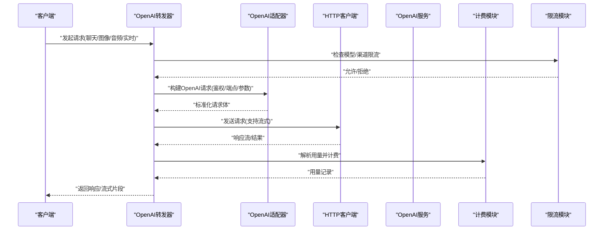
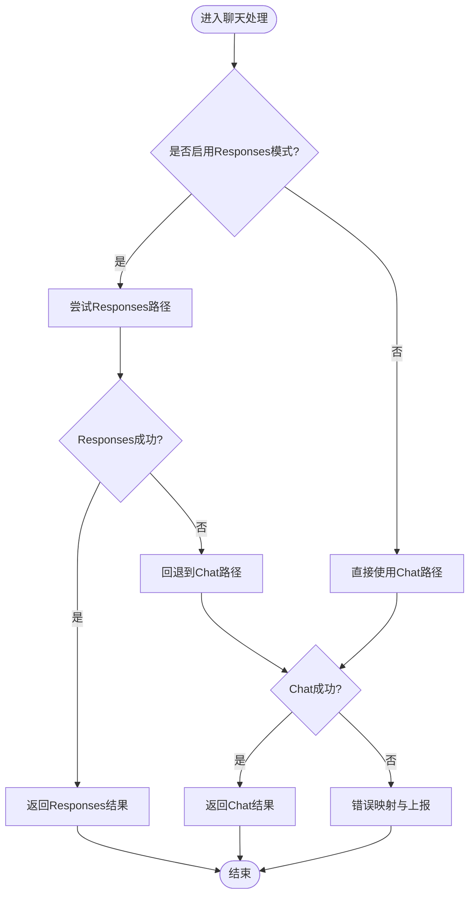
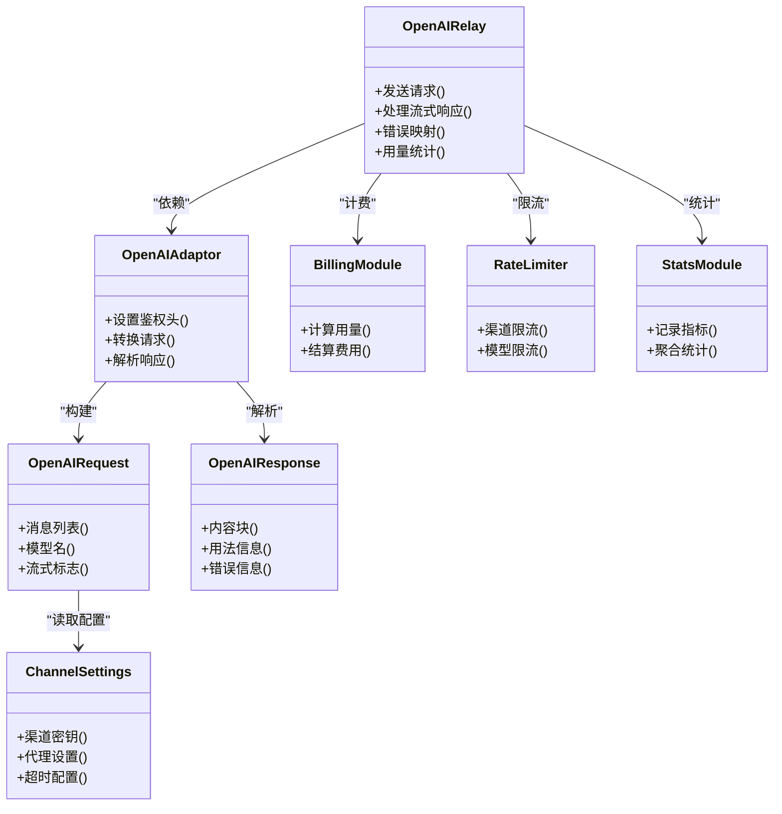

# OpenAI提供商

<cite>
**本文引用的文件**   
- [relay-openai.go](file://relay/channel/openai/relay-openai.go)
- [adaptor.go](file://relay/channel/openai/adaptor.go)
- [constant.go](file://relay/channel/openai/constant.go)
- [audio.go](file://relay/channel/openai/audio.go)
- [image_stream_test.go](file://relay/channel/openai/image_stream_test.go)
- [image_edit_test.go](file://relay/channel/openai/image_edit_test.go)
- [chat_via_responses.go](file://relay/channel/openai/chat_via_responses.go)
- [responses_via_chat.go](file://relay/channel/openai/responses_via_chat.go)
- [relay_image.go](file://relay/channel/openai/relay_image.go)
- [relay_realtime.go](file://relay/channel/openai/relay_realtime.go)
- [relay_responses.go](file://relay/channel/openai/relay_responses.go)
- [relay_responses_compact.go](file://relay/channel/openai/relay_responses_compact.go)
- [usage.go](file://relay/channel/openai/usage.go)
- [helper.go](file://relay/channel/openai/helper.go)
- [openai_request.go](file://dto/openai_request.go)
- [openai_response.go](file://dto/openai_response.go)
- [openai_image.go](file://dto/openai_image.go)
- [channel_settings.go](file://dto/channel_settings.go)
- [relay_adaptor.go](file://relay/relay_adaptor.go)
- [billing.go](file://relay/common/billing.go)
- [stream_status.go](file://relay/common/stream_status.go)
- [rate-limit.go](file://common/rate-limit.go)
- [limiter.go](file://common/limiter/limiter.go)
- [model-rate-limit.go](file://middleware/model-rate-limit.go)
- [stats.go](file://middleware/stats.go)
- [pricing.go](file://model/pricing.go)
- [channel.go](file://model/channel.go)
</cite>

## 目录
1. [简介](#简介)
2. [项目结构](#项目结构)
3. [核心组件](#核心组件)
4. [架构总览](#架构总览)
5. [详细组件分析](#详细组件分析)
6. [依赖关系分析](#依赖关系分析)
7. [性能考量](#性能考量)
8. [故障排除指南](#故障排除指南)
9. [结论](#结论)
10. [附录](#附录)

## 简介
本文件面向OpenAI提供商的集成与使用，系统性阐述渠道实现、API适配器、请求转换逻辑、配置参数、认证方式、模型映射、错误处理机制，以及聊天补全、图像生成、音频处理、实时流等功能的接入方式。同时给出计费、限流与监控的集成说明，并提供常见配置问题与排障方法。

## 项目结构
OpenAI相关代码主要位于 relay/channel/openai 目录，围绕“适配器+转发器”模式组织：
- 适配器层：负责将内部统一请求转换为OpenAI API请求，并解析响应为内部统一格式
- 转发器层：封装HTTP调用、流式传输、重试与错误映射
- DTO层：定义OpenAI请求/响应数据结构及图像、音频等扩展类型
- 公共能力：计费、流状态、限流、统计等通用模块

图表来源 
- [adaptor.go](file://relay/channel/openai/adaptor.go)
- [relay-openai.go](file://relay/channel/openai/relay-openai.go)
- [constant.go](file://relay/channel/openai/constant.go)
- [helper.go](file://relay/channel/openai/helper.go)
- [chat_via_responses.go](file://relay/channel/openai/chat_via_responses.go)
- [responses_via_chat.go](file://relay/channel/openai/responses_via_chat.go)
- [relay_image.go](file://relay/channel/openai/relay_image.go)
- [audio.go](file://relay/channel/openai/audio.go)
- [relay_realtime.go](file://relay/channel/openai/relay_realtime.go)
- [relay_responses.go](file://relay/channel/openai/relay_responses.go)
- [relay_responses_compact.go](file://relay/channel/openai/relay_responses_compact.go)
- [usage.go](file://relay/channel/openai/usage.go)
- [openai_request.go](file://dto/openai_request.go)
- [openai_response.go](file://dto/openai_response.go)
- [openai_image.go](file://dto/openai_image.go)
- [channel_settings.go](file://dto/channel_settings.go)
- [relay_adaptor.go](file://relay/relay_adaptor.go)
- [billing.go](file://relay/common/billing.go)
- [stream_status.go](file://relay/common/stream_status.go)
- [rate-limit.go](file://common/rate-limit.go)
- [limiter.go](file://common/limiter/limiter.go)
- [model-rate-limit.go](file://middleware/model-rate-limit.go)
- [stats.go](file://middleware/stats.go)

章节来源
- [relay-openai.go](file://relay/channel/openai/relay-openai.go)
- [adaptor.go](file://relay/channel/openai/adaptor.go)
- [constant.go](file://relay/channel/openai/constant.go)

## 核心组件
- 适配器（Adaptor）：定义OpenAI渠道的能力、端点、鉴权头注入、请求/响应转换策略
- 转发器（Relay）：封装HTTP客户端、流式读取、错误码映射、重试策略、用量统计
- DTO：统一描述OpenAI请求体、响应体、图像/音频等扩展字段
- 计费与限流：基于渠道与模型的计费表达式、令牌桶/滑动窗口限流、模型级速率限制
- 监控与统计：请求耗时、成功率、错误分类、流状态追踪

章节来源
- [relay_adaptor.go](file://relay/relay_adaptor.go)
- [billing.go](file://relay/common/billing.go)
- [stream_status.go](file://relay/common/stream_status.go)
- [rate-limit.go](file://common/rate-limit.go)
- [limiter.go](file://common/limiter/limiter.go)
- [model-rate-limit.go](file://middleware/model-rate-limit.go)
- [stats.go](file://middleware/stats.go)

## 架构总览
OpenAI渠道通过统一的适配器接口接入，转发器根据请求类型（聊天、图像、音频、实时）选择对应处理路径，完成请求转换、鉴权、网络调用、流式返回与用量统计。

图表来源 
- [relay-openai.go](file://relay/channel/openai/relay-openai.go)
- [adaptor.go](file://relay/channel/openai/adaptor.go)
- [billing.go](file://relay/common/billing.go)
- [rate-limit.go](file://common/rate-limit.go)
- [limiter.go](file://common/limiter/limiter.go)

## 详细组件分析

### 适配器与常量
- 适配器负责声明OpenAI渠道支持的端点、鉴权方式（如Bearer Token）、请求头注入规则、默认参数覆盖
- 常量集中管理OpenAI端点路径、模型命名空间、错误码映射表

章节来源
- [adaptor.go](file://relay/channel/openai/adaptor.go)
- [constant.go](file://relay/channel/openai/constant.go)

### 聊天补全（Chat Completions）
- 支持标准聊天补全与Responses模式两种路径
- Responses模式优先，失败时自动回退到Chat路径
- 支持系统消息、工具调用、多轮对话、流式输出

图表来源 
- [chat_via_responses.go](file://relay/channel/openai/chat_via_responses.go)
- [responses_via_chat.go](file://relay/channel/openai/responses_via_chat.go)
- [relay_responses.go](file://relay/channel/openai/relay_responses.go)

章节来源
- [chat_via_responses.go](file://relay/channel/openai/chat_via_responses.go)
- [responses_via_chat.go](file://relay/channel/openai/responses_via_chat.go)
- [relay_responses.go](file://relay/channel/openai/relay_responses.go)

### 图像生成与编辑
- 支持文本转图像、图像编辑、批量生成
- 提供流式与非流式两种返回方式
- 测试用例覆盖流式与编辑场景

章节来源
- [relay_image.go](file://relay/channel/openai/relay_image.go)
- [image_stream_test.go](file://relay/channel/openai/image_stream_test.go)
- [image_edit_test.go](file://relay/channel/openai/image_edit_test.go)
- [openai_image.go](file://dto/openai_image.go)

### 音频处理
- 支持语音转文本、文本转语音等常见音频能力
- 统一音频请求/响应结构与媒体上传流程

章节来源
- [audio.go](file://relay/channel/openai/audio.go)

### 实时流（Realtime）
- 支持WebSocket或SSE实时交互通道
- 用于低延迟对话或事件驱动场景

章节来源
- [relay_realtime.go](file://relay/channel/openai/relay_realtime.go)

### 用量与计费
- 从响应中解析token用量、图片数量、音频时长等
- 结合定价策略进行计费结算

章节来源
- [usage.go](file://relay/channel/openai/usage.go)
- [billing.go](file://relay/common/billing.go)
- [pricing.go](file://model/pricing.go)

### 工具函数
- 提供参数校验、URL拼接、头部构造、错误码归一化等辅助能力

章节来源
- [helper.go](file://relay/channel/openai/helper.go)

## 依赖关系分析
OpenAI渠道依赖DTO定义、公共计费与限流模块、中间件统计与模型级限流、渠道与定价模型元数据。

图表来源 
- [adaptor.go](file://relay/channel/openai/adaptor.go)
- [relay-openai.go](file://relay/channel/openai/relay-openai.go)
- [openai_request.go](file://dto/openai_request.go)
- [openai_response.go](file://dto/openai_response.go)
- [channel_settings.go](file://dto/channel_settings.go)
- [billing.go](file://relay/common/billing.go)
- [rate-limit.go](file://common/rate-limit.go)
- [limiter.go](file://common/limiter/limiter.go)
- [model-rate-limit.go](file://middleware/model-rate-limit.go)
- [stats.go](file://middleware/stats.go)

章节来源
- [relay-adaptor.go](file://relay/relay_adaptor.go)
- [channel.go](file://model/channel.go)
- [pricing.go](file://model/pricing.go)

## 性能考量
- 流式传输：优先使用流式响应降低首字节延迟与内存占用
- 连接池与超时：合理设置HTTP客户端连接池大小与读写超时
- 重试策略：对可重试错误（如网络抖动）实施指数退避
- 缓存与压缩：对静态配置与模型元数据进行缓存；必要时启用响应压缩
- 限流与背压：在渠道与模型维度实施限流，避免上游过载

[本节为通用指导，不直接分析具体文件]

## 故障排除指南
- 鉴权失败：检查渠道密钥是否正确注入、Bearer Token是否过期
- 模型不存在：确认模型名称映射与渠道可用模型列表一致
- 请求被限流：查看渠道与模型级限流阈值，调整配额或扩容
- 流中断：检查网络稳定性与服务端流式支持，增加超时与重试
- 用量异常：核对响应中的usage字段解析逻辑与计费表达式

章节来源
- [rate-limit.go](file://common/rate-limit.go)
- [limiter.go](file://common/limiter/limiter.go)
- [model-rate-limit.go](file://middleware/model-rate-limit.go)
- [stats.go](file://middleware/stats.go)
- [usage.go](file://relay/channel/openai/usage.go)

## 结论
OpenAI渠道以适配器与转发器为核心，配合DTO与公共能力模块，实现了聊天、图像、音频、实时等多模态能力的统一接入。通过灵活的配置、完善的错误映射与计费限流机制，能够稳定对接OpenAI API并满足生产环境的可靠性与可观测性要求。

[本节为总结性内容，不直接分析具体文件]

## 附录

### 配置参数与认证方式
- 渠道密钥：用于鉴权的API Key或Bearer Token
- 代理设置：可选HTTP/HTTPS代理，用于网络访问控制
- 超时配置：连接、读、写超时时间
- 模型映射：本地模型名到OpenAI模型名的映射表
- 功能开关：Responses模式、流式输出、重试策略等

章节来源
- [channel_settings.go](file://dto/channel_settings.go)
- [constant.go](file://relay/channel/openai/constant.go)
- [adaptor.go](file://relay/channel/openai/adaptor.go)

### 支持的API功能
- 聊天补全：标准Chat与Responses模式，支持工具调用与流式输出
- 图像生成：文本转图像、图像编辑、批量生成
- 音频处理：语音转文本、文本转语音
- 实时流：WebSocket/SSE实时交互

章节来源
- [chat_via_responses.go](file://relay/channel/openai/chat_via_responses.go)
- [responses_via_chat.go](file://relay/channel/openai/responses_via_chat.go)
- [relay_image.go](file://relay/channel/openai/relay_image.go)
- [audio.go](file://relay/channel/openai/audio.go)
- [relay_realtime.go](file://relay/channel/openai/relay_realtime.go)

### 完整配置示例与使用模式
- 基础聊天：指定模型、消息列表、是否流式
- 图像生成：输入提示词、尺寸、数量、风格参数
- 音频处理：输入音频文件或文本、目标语言、采样率
- 实时对话：建立实时会话、发送事件、接收增量更新

章节来源
- [openai_request.go](file://dto/openai_request.go)
- [openai_response.go](file://dto/openai_response.go)
- [openai_image.go](file://dto/openai_image.go)

### 与系统其他组件的集成
- 计费：基于用量与定价表达式进行结算
- 限流：渠道与模型维度的令牌桶/滑动窗口限流
- 监控：请求指标、错误分类、流状态追踪

章节来源
- [billing.go](file://relay/common/billing.go)
- [rate-limit.go](file://common/rate-limit.go)
- [limiter.go](file://common/limiter/limiter.go)
- [model-rate-limit.go](file://middleware/model-rate-limit.go)
- [stats.go](file://middleware/stats.go)