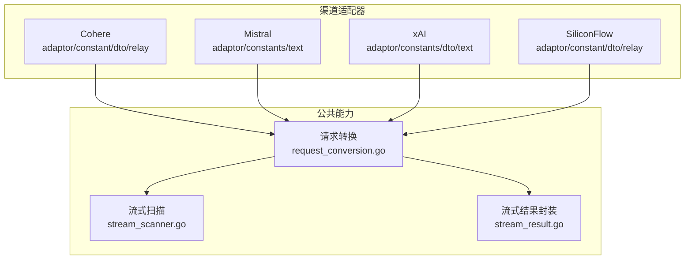
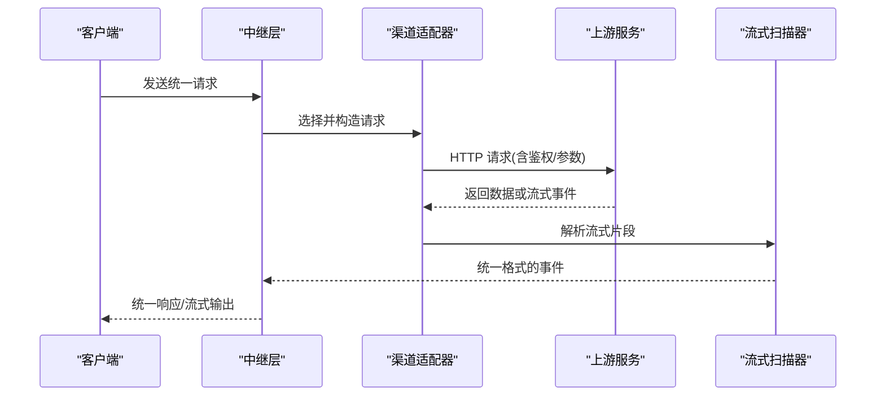
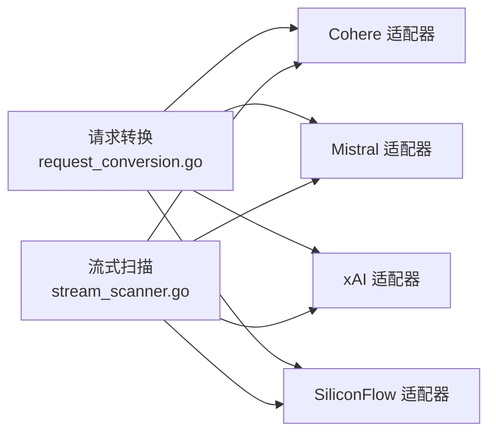

# 其他提供商

<cite>
**本文引用的文件**   
- [relay/channel/cohere/adaptor.go](file://relay/channel/cohere/adaptor.go)
- [relay/channel/cohere/constant.go](file://relay/channel/cohere/constant.go)
- [relay/channel/cohere/dto.go](file://relay/channel/cohere/dto.go)
- [relay/channel/cohere/relay-cohere.go](file://relay/channel/cohere/relay-cohere.go)
- [relay/channel/mistral/adaptor.go](file://relay/channel/mistral/adaptor.go)
- [relay/channel/mistral/constants.go](file://relay/channel/mistral/constants.go)
- [relay/channel/mistral/text.go](file://relay/channel/mistral/text.go)
- [relay/channel/xai/adaptor.go](file://relay/channel/xai/adaptor.go)
- [relay/channel/xai/constants.go](file://relay/channel/xai/constants.go)
- [relay/channel/xai/dto.go](file://relay/channel/xai/dto.go)
- [relay/channel/xai/text.go](file://relay/channel/xai/text.go)
- [relay/channel/siliconflow/adaptor.go](file://relay/channel/siliconflow/adaptor.go)
- [relay/channel/siliconflow/constant.go](file://relay/channel/siliconflow/constant.go)
- [relay/channel/siliconflow/dto.go](file://relay/channel/siliconflow/dto.go)
- [relay/channel/siliconflow/relay-siliconflow.go](file://relay/channel/siliconflow/relay-siliconflow.go)
- [relay/common/request_conversion.go](file://relay/common/request_conversion.go)
- [relay/helper/stream_scanner.go](file://relay/helper/stream_scanner.go)
- [relay/helper/stream_result.go](file://relay/helper/stream_result.go)
- [setting/model_setting/groq.go](file://setting/model_setting/groq.go)
- [setting/model_setting/global.go](file://setting/model_setting/global.go)
- [model/channel.go](file://model/channel.go)
- [common/performance_config.go](file://common/performance_config.go)
</cite>

## 目录
1. [简介](#简介)
2. [项目结构](#项目结构)
3. [核心组件](#核心组件)
4. [架构总览](#架构总览)
5. [详细组件分析](#详细组件分析)
6. [依赖关系分析](#依赖关系分析)
7. [性能考量](#性能考量)
8. [故障排除指南](#故障排除指南)
9. [结论](#结论)
10. [附录](#附录)

## 简介
本文件面向需要接入 Cohere、Mistral、xAI、SiliconFlow 等第三方 AI 服务提供商的开发者与运维人员，提供统一的配置模式、API 差异说明、功能特性对比、最佳实践、常见问题排查与性能优化建议。文档基于代码库中对应 channel 适配器的实现进行总结，确保内容与实际行为一致。

## 项目结构
本项目采用“按渠道（channel）拆分适配器”的组织方式，每个提供商在 relay/channel/<provider> 目录下拥有独立的 adaptor、常量、DTO 与转发逻辑。统一请求转换与流式处理位于公共模块中，便于跨渠道复用。

图表来源
- [relay/channel/cohere/adaptor.go](file://relay/channel/cohere/adaptor.go)
- [relay/channel/mistral/adaptor.go](file://relay/channel/mistral/adaptor.go)
- [relay/channel/xai/adaptor.go](file://relay/channel/xai/adaptor.go)
- [relay/channel/siliconflow/adaptor.go](file://relay/channel/siliconflow/adaptor.go)
- [relay/common/request_conversion.go](file://relay/common/request_conversion.go)
- [relay/helper/stream_scanner.go](file://relay/helper/stream_scanner.go)
- [relay/helper/stream_result.go](file://relay/helper/stream_result.go)

章节来源
- [relay/channel/cohere/adaptor.go](file://relay/channel/cohere/adaptor.go)
- [relay/channel/mistral/adaptor.go](file://relay/channel/mistral/adaptor.go)
- [relay/channel/xai/adaptor.go](file://relay/channel/xai/adaptor.go)
- [relay/channel/siliconflow/adaptor.go](file://relay/channel/siliconflow/adaptor.go)
- [relay/common/request_conversion.go](file://relay/common/request_conversion.go)

## 核心组件
- 渠道适配器（Adaptor）：负责鉴权、URL 构建、请求/响应映射、错误码归一化、计费字段填充等。
- 常量定义（constants/constant）：声明端点路径、模型名、默认参数、错误码映射等。
- DTO 定义：描述上游 API 的请求/响应结构体，用于 JSON 编解码。
- 文本/流式处理：将内部统一请求转换为各渠道特定格式，并将上游流式事件解析为统一输出。
- 请求转换与流式扫描：公共模块，屏蔽不同渠道的差异，提供一致的调用体验。

章节来源
- [relay/common/request_conversion.go](file://relay/common/request_conversion.go)
- [relay/helper/stream_scanner.go](file://relay/helper/stream_scanner.go)
- [relay/helper/stream_result.go](file://relay/helper/stream_result.go)

## 架构总览
下图展示了从统一入口到具体渠道适配器的调用链路，以及流式响应的处理流程。

图表来源
- [relay/common/request_conversion.go](file://relay/common/request_conversion.go)
- [relay/helper/stream_scanner.go](file://relay/helper/stream_scanner.go)

## 详细组件分析

### Cohere 渠道
- 关键文件
  - [relay/channel/cohere/adaptor.go](file://relay/channel/cohere/adaptor.go)
  - [relay/channel/cohere/constant.go](file://relay/channel/cohere/constant.go)
  - [relay/channel/cohere/dto.go](file://relay/channel/cohere/dto.go)
  - [relay/channel/cohere/relay-cohere.go](file://relay/channel/cohere/relay-cohere.go)
- 配置要点
  - 通过渠道设置注入 API Key 与 Base URL（如有自定义代理）。
  - 模型名称需与上游保持一致或在常量中映射。
- API 差异与特性
  - 支持文本生成与可能的嵌入/重排序能力（由 DTO 与常量体现）。
  - 流式输出通过统一扫描器解析上游 SSE/流式片段。
- 使用建议
  - 合理设置超时与重试策略，避免上游限流导致失败。
  - 对长上下文场景开启必要的压缩或分块策略（如上游支持）。

章节来源
- [relay/channel/cohere/adaptor.go](file://relay/channel/cohere/adaptor.go)
- [relay/channel/cohere/constant.go](file://relay/channel/cohere/constant.go)
- [relay/channel/cohere/dto.go](file://relay/channel/cohere/dto.go)
- [relay/channel/cohere/relay-cohere.go](file://relay/channel/cohere/relay-cohere.go)

### Mistral 渠道
- 关键文件
  - [relay/channel/mistral/adaptor.go](file://relay/channel/mistral/adaptor.go)
  - [relay/channel/mistral/constants.go](file://relay/channel/mistral/constants.go)
  - [relay/channel/mistral/text.go](file://relay/channel/mistral/text.go)
- 配置要点
  - 配置 API Key；如需代理可设置 Base URL。
  - 模型名需在常量或映射表中存在。
- API 差异与特性
  - 主要面向文本对话与补全，遵循其官方接口规范。
  - 流式响应通过统一扫描器处理。
- 使用建议
  - 控制 max_tokens 与 temperature 以平衡质量与成本。
  - 结合系统提示词与工具调用（若上游支持）提升效果。

章节来源
- [relay/channel/mistral/adaptor.go](file://relay/channel/mistral/adaptor.go)
- [relay/channel/mistral/constants.go](file://relay/channel/mistral/constants.go)
- [relay/channel/mistral/text.go](file://relay/channel/mistral/text.go)

### xAI 渠道
- 关键文件
  - [relay/channel/xai/adaptor.go](file://relay/channel/xai/adaptor.go)
  - [relay/channel/xai/constants.go](file://relay/channel/xai/constants.go)
  - [relay/channel/xai/dto.go](file://relay/channel/xai/dto.go)
  - [relay/channel/xai/text.go](file://relay/channel/xai/text.go)
- 配置要点
  - 配置 API Key；Base URL 按需设置。
  - 模型名需与上游一致或在常量中映射。
- API 差异与特性
  - 文本生成能力，遵循其官方接口约定。
  - 流式输出由统一扫描器解析。
- 使用建议
  - 根据任务类型选择合适的模型与参数组合。
  - 注意速率限制与配额管理，避免触发限流。

章节来源
- [relay/channel/xai/adaptor.go](file://relay/channel/xai/adaptor.go)
- [relay/channel/xai/constants.go](file://relay/channel/xai/constants.go)
- [relay/channel/xai/dto.go](file://relay/channel/xai/dto.go)
- [relay/channel/xai/text.go](file://relay/channel/xai/text.go)

### SiliconFlow 渠道
- 关键文件
  - [relay/channel/siliconflow/adaptor.go](file://relay/channel/siliconflow/adaptor.go)
  - [relay/channel/siliconflow/constant.go](file://relay/channel/siliconflow/constant.go)
  - [relay/channel/siliconflow/dto.go](file://relay/channel/siliconflow/dto.go)
  - [relay/channel/siliconflow/relay-siliconflow.go](file://relay/channel/siliconflow/relay-siliconflow.go)
- 配置要点
  - 配置 API Key；Base URL 可按需设置。
  - 模型名需与上游一致或在常量中映射。
- API 差异与特性
  - 文本生成与可能的其他能力（由 DTO 与常量体现）。
  - 流式输出由统一扫描器解析。
- 使用建议
  - 针对高并发场景调整连接池与超时。
  - 结合缓存与降级策略提高稳定性。

章节来源
- [relay/channel/siliconflow/adaptor.go](file://relay/channel/siliconflow/adaptor.go)
- [relay/channel/siliconflow/constant.go](file://relay/channel/siliconflow/constant.go)
- [relay/channel/siliconflow/dto.go](file://relay/channel/siliconflow/dto.go)
- [relay/channel/siliconflow/relay-siliconflow.go](file://relay/channel/siliconflow/relay-siliconflow.go)

### 统一请求转换与流式处理
- 请求转换
  - 将内部统一请求结构转换为各渠道特定的 JSON 结构，处理字段映射、默认值与校验。
- 流式扫描
  - 统一解析上游流式事件，提取增量内容、元数据与结束信号，封装为标准事件流。
- 适用性
  - 所有渠道共享同一套转换与扫描逻辑，降低重复实现与维护成本。

章节来源
- [relay/common/request_conversion.go](file://relay/common/request_conversion.go)
- [relay/helper/stream_scanner.go](file://relay/helper/stream_scanner.go)
- [relay/helper/stream_result.go](file://relay/helper/stream_result.go)

## 依赖关系分析
各渠道适配器均依赖公共的请求转换与流式处理模块，形成低耦合、高内聚的结构。渠道间相互独立，新增渠道只需实现适配器与 DTO，即可复用通用能力。

图表来源
- [relay/common/request_conversion.go](file://relay/common/request_conversion.go)
- [relay/helper/stream_scanner.go](file://relay/helper/stream_scanner.go)
- [relay/channel/cohere/adaptor.go](file://relay/channel/cohere/adaptor.go)
- [relay/channel/mistral/adaptor.go](file://relay/channel/mistral/adaptor.go)
- [relay/channel/xai/adaptor.go](file://relay/channel/xai/adaptor.go)
- [relay/channel/siliconflow/adaptor.go](file://relay/channel/siliconflow/adaptor.go)

## 性能考量
- 连接与超时
  - 合理设置 HTTP 连接池大小、读写超时与重试次数，避免上游拥塞时雪崩。
- 流式处理
  - 使用流式扫描器逐段处理，减少内存占用与首字节延迟。
- 参数调优
  - 控制 max_tokens、temperature、top_p 等参数，平衡质量与吞吐。
- 监控与指标
  - 关注 QPS、P95/P99 延迟、错误率与配额使用情况，及时扩容或降级。

[本节为通用指导，不直接分析具体文件]

## 故障排除指南
- 鉴权失败
  - 检查 API Key 是否正确、是否过期、权限是否足够。
- 模型不存在
  - 确认模型名与上游一致，或在常量/映射中正确配置。
- 流式中断
  - 检查网络稳定性与上游限流；适当增加重试与退避策略。
- 参数不兼容
  - 核对上游支持的参数集合，移除不支持的字段或设置默认值。
- 日志定位
  - 查看渠道适配器日志与上游返回的错误码，对照常量中的错误映射进行归因。

章节来源
- [relay/channel/cohere/adaptor.go](file://relay/channel/cohere/adaptor.go)
- [relay/channel/mistral/adaptor.go](file://relay/channel/mistral/adaptor.go)
- [relay/channel/xai/adaptor.go](file://relay/channel/xai/adaptor.go)
- [relay/channel/siliconflow/adaptor.go](file://relay/channel/siliconflow/adaptor.go)

## 结论
通过统一的请求转换与流式处理框架，Cohere、Mistral、xAI、SiliconFlow 等渠道能够以最小改动接入，获得一致的调用体验与稳定的性能表现。建议在部署前完成参数调优与监控告警配置，并结合业务场景选择合适的模型与渠道组合。

[本节为总结性内容，不直接分析具体文件]

## 附录
- 配置模式
  - 每个渠道均需配置 API Key 与可选 Base URL；模型名需与上游一致或在常量中映射。
- 最佳实践
  - 启用流式输出以降低延迟；设置合理的超时与重试；对高频请求实施缓存与降级。
- 对比与选型建议
  - 根据模型能力、价格、延迟与可用性综合评估；多通道冗余以提升鲁棒性。
- 常见场景
  - 文本对话、摘要生成、翻译、代码补全、检索增强生成（RAG）等。

[本节为通用指导，不直接分析具体文件]