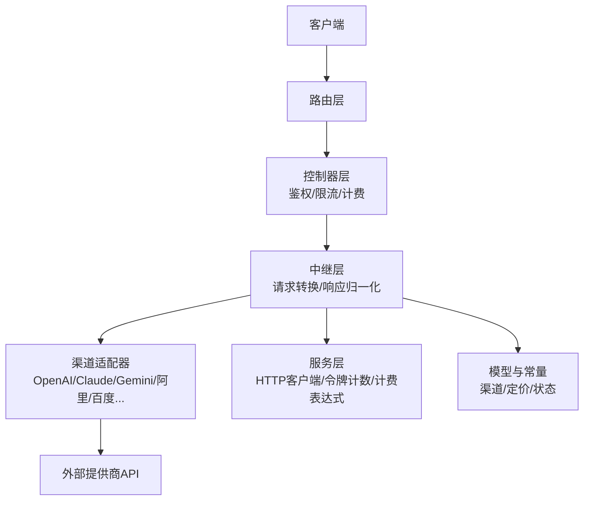
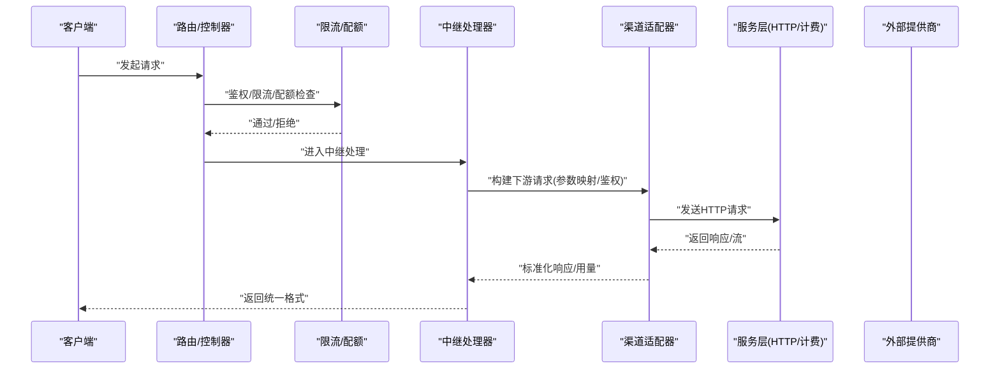
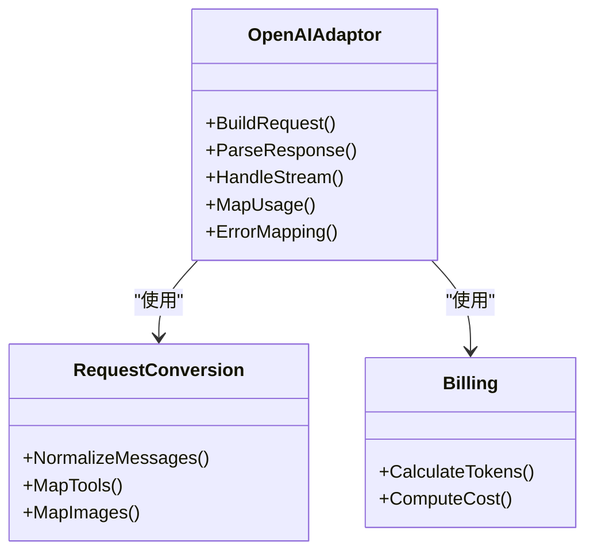
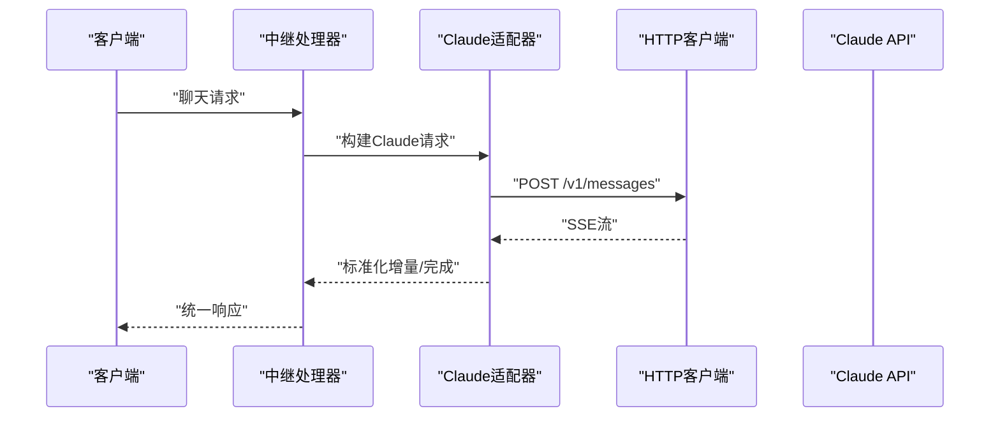
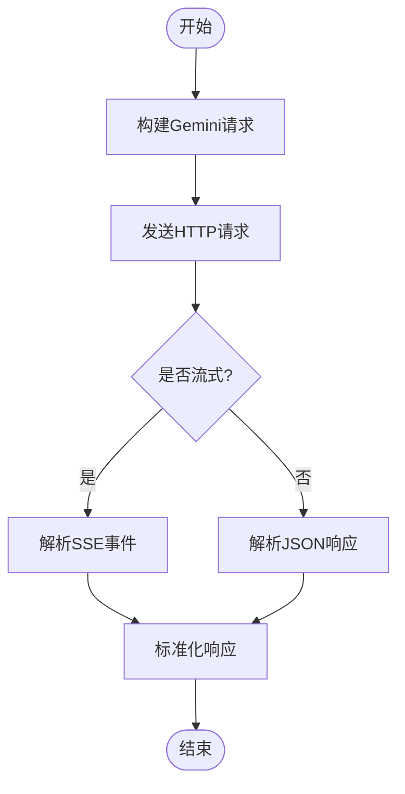
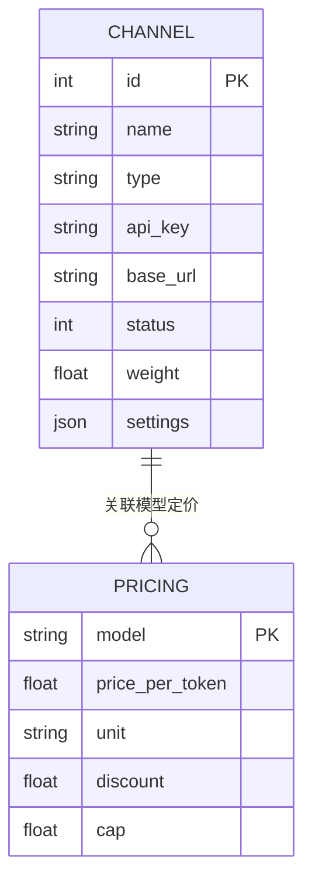
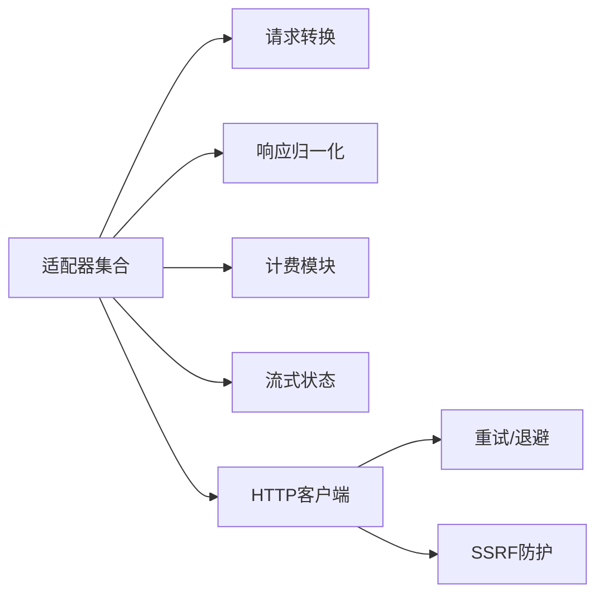

# 支持的提供商

<cite>
**本文引用的文件**   
- [main.go](file://main.go)
- [relay_adaptor.go](file://relay/relay_adaptor.go)
- [api_request.go](file://relay/channel/api_request.go)
- [openai/adaptor.go](file://relay/channel/openai/adaptor.go)
- [openai/relay-openai.go](file://relay/channel/openai/relay-openai.go)
- [claude/adaptor.go](file://relay/channel/claude/adaptor.go)
- [claude/relay-claude.go](file://relay/channel/claude/relay-claude.go)
- [gemini/adaptor.go](file://relay/channel/gemini/adaptor.go)
- [gemini/relay-gemini.go](file://relay/channel/gemini/relay-gemini.go)
- [ali/adaptor.go](file://relay/channel/ali/adaptor.go)
- [baidu/adaptor.go](file://relay/channel/baidu/adaptor.go)
- [channel.go](file://model/channel.go)
- [pricing_default.go](file://model/pricing_default.go)
- [request_conversion.go](file://relay/common/request_conversion.go)
- [billing.go](file://relay/common/billing.go)
- [stream_status.go](file://relay/common/stream_status.go)
- [relay_utils.go](file://relay/common/relay_utils.go)
- [http_client.go](file://service/http_client.go)
- [rate-limit.go](file://common/rate-limit.go)
- [quota.go](file://common/quota.go)
- [env.go](file://common/env.go)
</cite>

## 目录
1. [简介](#简介)
2. [项目结构](#项目结构)
3. [核心组件](#核心组件)
4. [架构总览](#架构总览)
5. [详细组件分析](#详细组件分析)
6. [依赖关系分析](#依赖关系分析)
7. [性能考量](#性能考量)
8. [故障排查指南](#故障排查指南)
9. [结论](#结论)
10. [附录](#附录)

## 简介
本文件面向“AI API 网关”中已支持的 AI 服务提供商，系统性梳理各提供商的实现细节、调用关系、接口与领域模型、配置参数与返回值约定、使用模式以及与系统其他组件的关系。覆盖 OpenAI、Claude、Gemini、阿里云、百度等主流提供商，并提供可操作的排错建议与最佳实践，既适合初学者快速上手，也为资深开发者提供足够的技术深度。

## 项目结构
本项目采用分层与按功能域组织相结合的结构：
- 路由层：统一入口与路由分发
- 控制器层：请求校验、鉴权、计费、限流等横切关注点
- 中继层（Relay）：将标准内部请求转换为各提供商的特定协议，并处理响应与流式输出
- 渠道适配层（Channel Adapters）：每个提供商一个适配器，封装其 HTTP 接口、鉴权、参数映射与错误码转换
- 服务层：HTTP 客户端、令牌计数、计费表达式、配额控制等通用能力
- 模型与常量：渠道元数据、定价、任务状态、上下文键等

**图示来源** 
- [main.go:1-200](file://main.go#L1-L200)
- [relay_adaptor.go:1-120](file://relay/relay_adaptor.go#L1-L120)
- [api_request.go:1-120](file://relay/channel/api_request.go#L1-L120)

**章节来源**
- [main.go:1-200](file://main.go#L1-L200)
- [relay_adaptor.go:1-120](file://relay/relay_adaptor.go#L1-L120)

## 核心组件
- 渠道适配器抽象：定义统一的请求/响应转换、流式处理、错误映射、用量统计等接口，各提供商实现具体逻辑
- 请求转换与响应归一化：将上游标准请求转为下游特定格式，并将不同返回统一为内部模型
- 计费与配额：基于模型与渠道的定价策略计算用量与费用，结合配额限制进行拦截或放行
- 流式状态管理：维护 SSE/流式响应的状态机，确保断线重连与异常恢复
- HTTP 客户端与重试：统一出站请求、超时、代理、SSRF 防护、重试与退避

**章节来源**
- [relay_adaptor.go:1-120](file://relay/relay_adaptor.go#L1-L120)
- [request_conversion.go:1-120](file://relay/common/request_conversion.go#L1-L120)
- [billing.go:1-120](file://relay/common/billing.go#L1-L120)
- [stream_status.go:1-120](file://relay/common/stream_status.go#L1-L120)
- [http_client.go:1-120](file://service/http_client.go#L1-L120)

## 架构总览
下图展示从客户端到外部提供商的端到端调用流程，以及关键中间件与服务的作用。

**图示来源** 
- [relay_adaptor.go:1-120](file://relay/relay_adaptor.go#L1-L120)
- [api_request.go:1-120](file://relay/channel/api_request.go#L1-L120)
- [http_client.go:1-120](file://service/http_client.go#L1-L120)

## 详细组件分析

### OpenAI 适配器
- 职责：将内部聊天/图像/音频等请求转换为 OpenAI 兼容格式，处理 Responses/Chat 两种模式，统一返回结构与用量统计
- 关键实现要点：
  - 请求转换：消息体、工具调用、压缩、图像输入等字段映射
  - 响应归一化：文本、图片、音频、工具调用结果、usage 字段统一
  - 流式处理：SSE 事件解析与合并，错误透传
  - 计费：基于 token 数与模型定价计算用量
- 典型调用链：
  - 控制器 -> 中继 -> OpenAI 适配器 -> HTTP 客户端 -> OpenAI API
- 配置项参考：
  - 渠道密钥、基础 URL、模型映射、是否启用 Responses 模式、超时与重试策略
- 常见参数与返回：
  - 输入：messages、tools、max_tokens、temperature、stream 等
  - 输出：choices、usage、finish_reason、data 等

**图示来源** 
- [openai/adaptor.go:1-200](file://relay/channel/openai/adaptor.go#L1-L200)
- [openai/relay-openai.go:1-200](file://relay/channel/openai/relay-openai.go#L1-L200)
- [request_conversion.go:1-120](file://relay/common/request_conversion.go#L1-L120)
- [billing.go:1-120](file://relay/common/billing.go#L1-L120)

**章节来源**
- [openai/adaptor.go:1-200](file://relay/channel/openai/adaptor.go#L1-L200)
- [openai/relay-openai.go:1-200](file://relay/channel/openai/relay-openai.go#L1-L200)

### Claude 适配器
- 职责：将内部请求转换为 Anthropic Claude 的消息格式，支持多模态与工具调用，统一返回结构与用量统计
- 关键实现要点：
  - 请求转换：system prompt、messages、tools、images、audio 等字段映射
  - 响应归一化：content blocks、tool_use、usage 字段统一
  - 流式处理：事件类型识别与增量拼接
  - 计费：按提示与生成 token 分别计价
- 典型调用链：
  - 控制器 -> 中继 -> Claude 适配器 -> HTTP 客户端 -> Claude API
- 配置项参考：
  - 渠道密钥、基础 URL、模型映射、并发与重试、超时设置
- 常见参数与返回：
  - 输入：messages、system、tools、max_tokens、stream
  - 输出：content、stop_reason、usage、error

**图示来源** 
- [claude/adaptor.go:1-200](file://relay/channel/claude/adaptor.go#L1-L200)
- [claude/relay-claude.go:1-200](file://relay/channel/claude/relay-claude.go#L1-L200)

**章节来源**
- [claude/adaptor.go:1-200](file://relay/channel/claude/adaptor.go#L1-L200)
- [claude/relay-claude.go:1-200](file://relay/channel/claude/relay-claude.go#L1-L200)

### Gemini 适配器
- 职责：将内部请求转换为 Google Gemini 的请求格式，支持文本、图像、视频等多模态输入，统一返回结构与用量统计
- 关键实现要点：
  - 请求转换：contents、generationConfig、safetySettings、tools 等字段映射
  - 响应归一化：candidates、usageMetadata、error 字段统一
  - 流式处理：SSE 事件解析与增量拼接
  - 计费：按输入与输出 token 计价
- 典型调用链：
  - 控制器 -> 中继 -> Gemini 适配器 -> HTTP 客户端 -> Gemini API
- 配置项参考：
  - 渠道密钥、基础 URL、模型映射、并发与重试、超时设置
- 常见参数与返回：
  - 输入：contents、generationConfig、tools、stream
  - 输出：candidates、usageMetadata、promptFeedback

**图示来源** 
- [gemini/adaptor.go:1-200](file://relay/channel/gemini/adaptor.go#L1-L200)
- [gemini/relay-gemini.go:1-200](file://relay/channel/gemini/relay-gemini.go#L1-L200)

**章节来源**
- [gemini/adaptor.go:1-200](file://relay/channel/gemini/adaptor.go#L1-L200)
- [gemini/relay-gemini.go:1-200](file://relay/channel/gemini/relay-gemini.go#L1-L200)

### 阿里云适配器
- 职责：将内部请求转换为阿里云百炼/通义千问等模型的请求格式，支持文本、图像、音频等能力，统一返回结构与用量统计
- 关键实现要点：
  - 请求转换：model、input、parameters、messages 等字段映射
  - 响应归一化：output、usage、error 字段统一
  - 流式处理：SSE 事件解析与增量拼接
  - 计费：按模型与 token 数计价
- 典型调用链：
  - 控制器 -> 中继 -> 阿里云适配器 -> HTTP 客户端 -> 阿里云 API
- 配置项参考：
  - AK/SK、Endpoint、模型映射、并发与重试、超时设置
- 常见参数与返回：
  - 输入：model、input、parameters、messages
  - 输出：output、usage、error

**章节来源**
- [ali/adaptor.go:1-200](file://relay/channel/ali/adaptor.go#L1-L200)

### 百度适配器
- 职责：将内部请求转换为百度文心一言等模型的请求格式，支持文本、图像、音频等能力，统一返回结构与用量统计
- 关键实现要点：
  - 请求转换：model、input、parameters、messages 等字段映射
  - 响应归一化：result、usage、error 字段统一
  - 流式处理：SSE 事件解析与增量拼接
  - 计费：按模型与 token 数计价
- 典型调用链：
  - 控制器 -> 中继 -> 百度适配器 -> HTTP 客户端 -> 百度 API
- 配置项参考：
  - AK/SK、Endpoint、模型映射、并发与重试、超时设置
- 常见参数与返回：
  - 输入：model、input、parameters、messages
  - 输出：result、usage、error

**章节来源**
- [baidu/adaptor.go:1-200](file://relay/channel/baidu/adaptor.go#L1-L200)

### 渠道与定价模型
- 渠道模型：存储渠道 ID、名称、类型、密钥、基础 URL、状态、权重、亲和性、限额等
- 定价模型：按模型维度定义单价、计费单位、折扣、封顶等
- 关系：渠道选择时考虑权重、亲和性与可用性；计费时根据模型与渠道组合计算用量与费用

**图示来源** 
- [channel.go:1-200](file://model/channel.go#L1-L200)
- [pricing_default.go:1-200](file://model/pricing_default.go#L1-L200)

**章节来源**
- [channel.go:1-200](file://model/channel.go#L1-L200)
- [pricing_default.go:1-200](file://model/pricing_default.go#L1-L200)

## 依赖关系分析
- 适配器与转换层：所有适配器均依赖请求转换与响应归一化模块，保证跨提供商一致性
- 计费与配额：适配器在请求前检查配额，在响应后计算用量并更新计费
- 流式状态：适配器与中继层共同维护流式状态，确保中断恢复与错误上报
- HTTP 客户端：统一处理连接池、超时、重试、代理、SSRF 防护

**图示来源** 
- [relay_adaptor.go:1-120](file://relay/relay_adaptor.go#L1-L120)
- [request_conversion.go:1-120](file://relay/common/request_conversion.go#L1-L120)
- [billing.go:1-120](file://relay/common/billing.go#L1-L120)
- [stream_status.go:1-120](file://relay/common/stream_status.go#L1-L120)
- [http_client.go:1-120](file://service/http_client.go#L1-L120)

**章节来源**
- [relay_adaptor.go:1-120](file://relay/relay_adaptor.go#L1-L120)
- [request_conversion.go:1-120](file://relay/common/request_conversion.go#L1-L120)
- [billing.go:1-120](file://relay/common/billing.go#L1-L120)
- [stream_status.go:1-120](file://relay/common/stream_status.go#L1-L120)
- [http_client.go:1-120](file://service/http_client.go#L1-L120)

## 性能考量
- 连接复用与池化：HTTP 客户端应复用连接，减少握手开销
- 超时与重试：合理设置超时与指数退避，避免雪崩
- 流式处理：优先使用流式传输，降低内存占用与首字节延迟
- 令牌计数：精确统计 token，避免重复计算
- 缓存与亲和性：对热点模型与渠道做亲和性分配与缓存，提升命中率

[本节为通用指导，不直接分析具体文件]

## 故障排查指南
- 鉴权失败：检查渠道密钥、基础 URL、签名算法与时间戳
- 限流/配额不足：查看限流规则与配额阈值，调整并发与上限
- 网络异常：检查代理、SSRF 防护、DNS 解析与证书
- 流式中断：确认服务端是否支持 SSE，客户端是否正确处理事件
- 计费差异：核对模型定价、token 计数与折扣策略

**章节来源**
- [rate-limit.go:1-120](file://common/rate-limit.go#L1-L120)
- [quota.go:1-120](file://common/quota.go#L1-L120)
- [env.go:1-120](file://common/env.go#L1-L120)

## 结论
本项目通过统一的适配器抽象与转换层，将多个 AI 提供商的异构接口收敛为标准内部模型，实现了高内聚、低耦合的可扩展架构。开发者可按需新增提供商，仅需实现适配器与映射逻辑即可无缝接入。同时，计费、配额、流式状态与 HTTP 客户端等通用能力为稳定性与性能提供了坚实保障。

## 附录
- 配置与环境变量：渠道密钥、基础 URL、模型映射、并发与重试、超时等
- 使用模式：聊天、图像、音频、工具调用、流式输出
- 最佳实践：合理设置超时与重试、启用流式传输、监控用量与成本

[本节为通用指导，不直接分析具体文件]