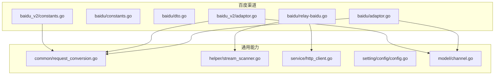
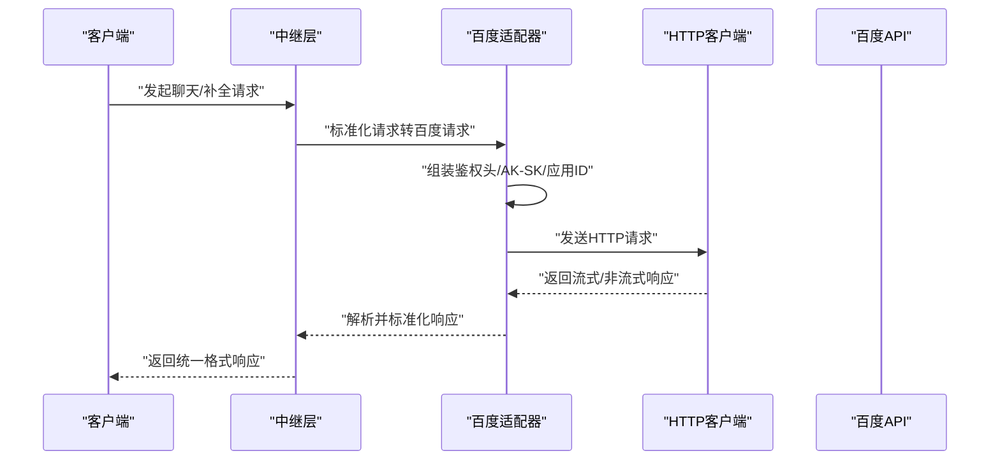
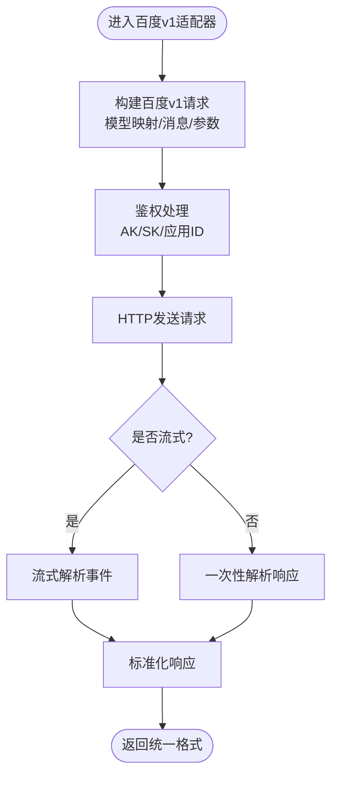
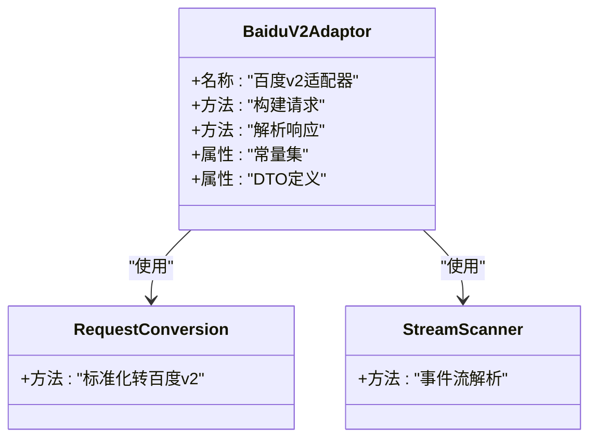
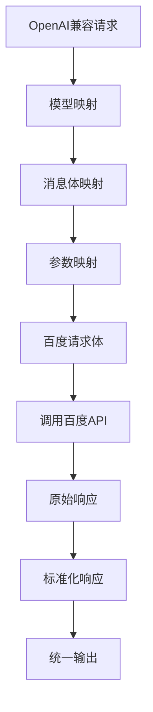
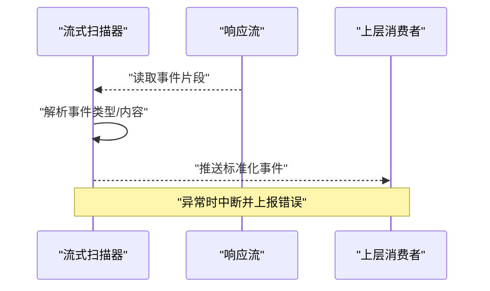
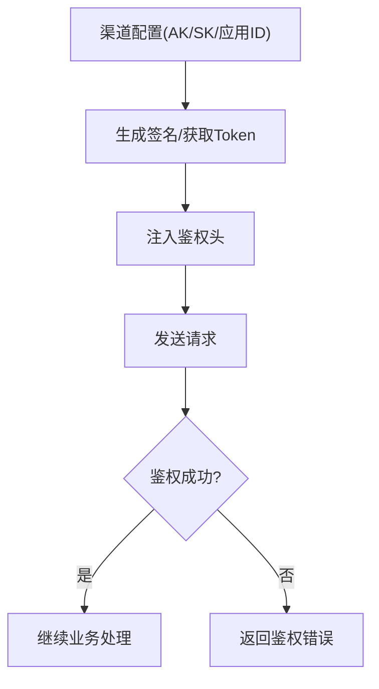
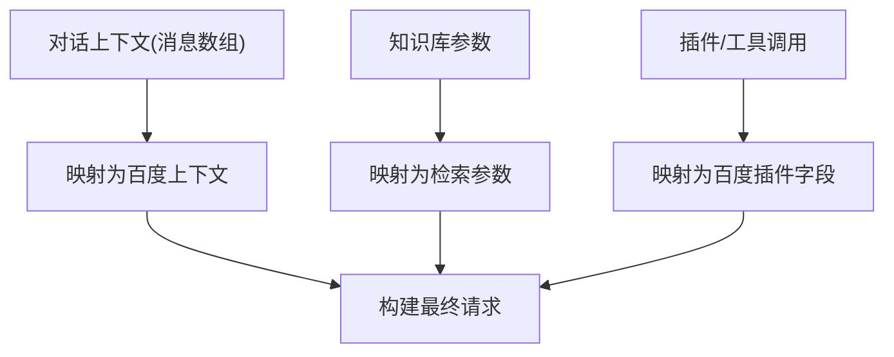
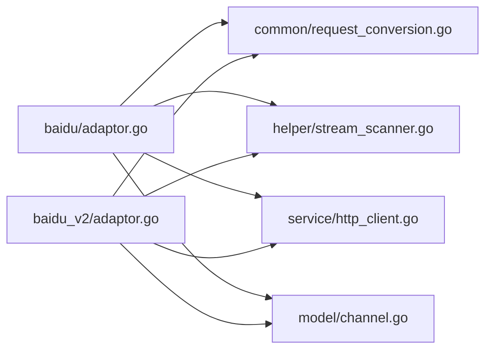

# 百度提供商

<cite>
**本文引用的文件**   
- [relay/channel/baidu/adaptor.go](file://relay/channel/baidu/adaptor.go)
- [relay/channel/baidu/constants.go](file://relay/channel/baidu/constants.go)
- [relay/channel/baidu/dto.go](file://relay/channel/baidu/dto.go)
- [relay/channel/baidu/relay-baidu.go](file://relay/channel/baidu/relay-baidu.go)
- [relay/channel/baidu_v2/adaptor.go](file://relay/channel/baidu_v2/adaptor.go)
- [relay/channel/baidu_v2/constants.go](file://relay/channel/baidu_v2/constants.go)
- [relay/common/request_conversion.go](file://relay/common/request_conversion.go)
- [relay/helper/stream_scanner.go](file://relay/helper/stream_scanner.go)
- [service/http_client.go](file://service/http_client.go)
- [setting/config/config.go](file://setting/config/config.go)
- [model/channel.go](file://model/channel.go)
</cite>

## 目录
1. [简介](#简介)
2. [项目结构](#项目结构)
3. [核心组件](#核心组件)
4. [架构总览](#架构总览)
5. [详细组件分析](#详细组件分析)
6. [依赖关系分析](#依赖关系分析)
7. [性能考虑](#性能考虑)
8. [故障排查指南](#故障排查指南)
9. [结论](#结论)
10. [附录](#附录)

## 简介
本文件面向“百度”提供商的集成与使用，聚焦以下目标：
- 详细说明百度渠道的实现细节、文心一言API适配与认证机制
- 给出配置参数说明（AK/SK、应用ID等）、权限管理与最佳实践
- 记录百度特有功能：对话上下文、知识库集成、插件系统等在系统中的映射方式
- 提供完整的配置示例与API调用模式
- 解释与标准格式（OpenAI兼容）的转换逻辑与数据映射
- 覆盖错误处理、重试策略与性能优化建议

## 项目结构
百度相关实现位于 relay/channel 下的 baidu 与 baidu_v2 两个子模块，分别对应不同版本的百度接口适配。通用请求转换、流式响应扫描、HTTP客户端与配置模型分布在 common、helper、service、setting、model 等包中。

图表来源
- [relay/channel/baidu/adaptor.go](file://relay/channel/baidu/adaptor.go)
- [relay/channel/baidu/constants.go](file://relay/channel/baidu/constants.go)
- [relay/channel/baidu/dto.go](file://relay/channel/baidu/dto.go)
- [relay/channel/baidu/relay-baidu.go](file://relay/channel/baidu/relay-baidu.go)
- [relay/channel/baidu_v2/adaptor.go](file://relay/channel/baidu_v2/adaptor.go)
- [relay/channel/baidu_v2/constants.go](file://relay/channel/baidu_v2/constants.go)
- [relay/common/request_conversion.go](file://relay/common/request_conversion.go)
- [relay/helper/stream_scanner.go](file://relay/helper/stream_scanner.go)
- [service/http_client.go](file://service/http_client.go)
- [setting/config/config.go](file://setting/config/config.go)
- [model/channel.go](file://model/channel.go)

章节来源
- [relay/channel/baidu/adaptor.go](file://relay/channel/baidu/adaptor.go)
- [relay/channel/baidu/relay-baidu.go](file://relay/channel/baidu/relay-baidu.go)
- [relay/channel/baidu_v2/adaptor.go](file://relay/channel/baidu_v2/adaptor.go)
- [relay/common/request_conversion.go](file://relay/common/request_conversion.go)
- [relay/helper/stream_scanner.go](file://relay/helper/stream_scanner.go)
- [service/http_client.go](file://service/http_client.go)
- [setting/config/config.go](file://setting/config/config.go)
- [model/channel.go](file://model/channel.go)

## 核心组件
- 适配器（Adaptor）：负责将统一请求转换为百度特定请求，并解析返回结果。baidu 与 baidu_v2 各自维护常量与DTO定义。
- 请求转换（Request Conversion）：将OpenAI兼容的请求体映射为百度SDK/HTTP请求所需字段，包括模型名、消息、参数等。
- 流式扫描（Stream Scanner）：对SSE或分块响应进行增量解析，支持逐条事件消费。
- HTTP客户端（HTTP Client）：封装网络请求、超时、重试、代理、鉴权头等通用能力。
- 配置与通道模型（Config & Channel Model）：管理渠道密钥、基础URL、并发、限流等设置。

章节来源
- [relay/channel/baidu/adaptor.go](file://relay/channel/baidu/adaptor.go)
- [relay/channel/baidu/dto.go](file://relay/channel/baidu/dto.go)
- [relay/channel/baidu/constants.go](file://relay/channel/baidu/constants.go)
- [relay/channel/baidu_v2/adaptor.go](file://relay/channel/baidu_v2/adaptor.go)
- [relay/channel/baidu_v2/constants.go](file://relay/channel/baidu_v2/constants.go)
- [relay/common/request_conversion.go](file://relay/common/request_conversion.go)
- [relay/helper/stream_scanner.go](file://relay/helper/stream_scanner.go)
- [service/http_client.go](file://service/http_client.go)
- [setting/config/config.go](file://setting/config/config.go)
- [model/channel.go](file://model/channel.go)

## 架构总览
下图展示从统一入口到百度上游的完整链路，包含请求转换、鉴权、发送与流式响应处理。

图表来源
- [relay/channel/baidu/relay-baidu.go](file://relay/channel/baidu/relay-baidu.go)
- [relay/channel/baidu/adaptor.go](file://relay/channel/baidu/adaptor.go)
- [relay/common/request_conversion.go](file://relay/common/request_conversion.go)
- [service/http_client.go](file://service/http_client.go)

## 详细组件分析

### 百度 v1 渠道（baidu）
- 职责
  - 定义百度v1接口的常量、DTO与适配器
  - 将OpenAI兼容请求转换为百度v1请求
  - 处理流式与非流式响应
- 关键流程
  - 构建请求：模型映射、消息体构造、参数透传
  - 鉴权：通过AK/SK生成签名或注入Token
  - 发送：经HTTP客户端发出，支持超时与重试
  - 解析：按事件流解析内容片段，聚合为最终结果

图表来源
- [relay/channel/baidu/adaptor.go](file://relay/channel/baidu/adaptor.go)
- [relay/channel/baidu/dto.go](file://relay/channel/baidu/dto.go)
- [relay/channel/baidu/constants.go](file://relay/channel/baidu/constants.go)
- [relay/common/request_conversion.go](file://relay/common/request_conversion.go)

章节来源
- [relay/channel/baidu/adaptor.go](file://relay/channel/baidu/adaptor.go)
- [relay/channel/baidu/dto.go](file://relay/channel/baidu/dto.go)
- [relay/channel/baidu/constants.go](file://relay/channel/baidu/constants.go)
- [relay/channel/baidu/relay-baidu.go](file://relay/channel/baidu/relay-baidu.go)

### 百度 v2 渠道（baidu_v2）
- 职责
  - 针对百度新接口版本（如文心大模型新版本）的适配
  - 常量与DTO独立维护，避免与v1耦合
  - 复用通用请求转换与流式扫描能力
- 差异点
  - 端点路径、鉴权方式、字段命名可能不同
  - 参数映射需遵循v2文档约定

图表来源
- [relay/channel/baidu_v2/adaptor.go](file://relay/channel/baidu_v2/adaptor.go)
- [relay/channel/baidu_v2/constants.go](file://relay/channel/baidu_v2/constants.go)
- [relay/common/request_conversion.go](file://relay/common/request_conversion.go)
- [relay/helper/stream_scanner.go](file://relay/helper/stream_scanner.go)

章节来源
- [relay/channel/baidu_v2/adaptor.go](file://relay/channel/baidu_v2/adaptor.go)
- [relay/channel/baidu_v2/constants.go](file://relay/channel/baidu_v2/constants.go)

### 请求转换与数据映射
- OpenAI兼容请求字段到百度字段的映射规则
  - 模型名：根据渠道常量表进行映射
  - 消息体：系统提示、用户/助手消息、工具调用等
  - 参数：温度、最大生成长度、停止词等
- 响应标准化
  - 文本片段、用法统计、完成原因等统一格式

图表来源
- [relay/common/request_conversion.go](file://relay/common/request_conversion.go)
- [relay/channel/baidu/dto.go](file://relay/channel/baidu/dto.go)
- [relay/channel/baidu_v2/constants.go](file://relay/channel/baidu_v2/constants.go)

章节来源
- [relay/common/request_conversion.go](file://relay/common/request_conversion.go)
- [relay/channel/baidu/dto.go](file://relay/channel/baidu/dto.go)
- [relay/channel/baidu_v2/constants.go](file://relay/channel/baidu_v2/constants.go)

### 流式响应处理
- 基于事件流的增量解析，降低内存占用与首字节延迟
- 支持错误中断与状态上报

图表来源
- [relay/helper/stream_scanner.go](file://relay/helper/stream_scanner.go)

章节来源
- [relay/helper/stream_scanner.go](file://relay/helper/stream_scanner.go)

### 认证机制与权限管理
- 认证方式
  - AK/SK：用于签名或换取访问令牌
  - 应用ID：标识具体应用实例
- 权限管理
  - 渠道级权限控制，限制可用模型与端点
  - 结合系统角色与资源授权策略

图表来源
- [relay/channel/baidu/adaptor.go](file://relay/channel/baidu/adaptor.go)
- [relay/channel/baidu_v2/adaptor.go](file://relay/channel/baidu_v2/adaptor.go)
- [model/channel.go](file://model/channel.go)

章节来源
- [relay/channel/baidu/adaptor.go](file://relay/channel/baidu/adaptor.go)
- [relay/channel/baidu_v2/adaptor.go](file://relay/channel/baidu_v2/adaptor.go)
- [model/channel.go](file://model/channel.go)

### 对话上下文、知识库与插件
- 对话上下文
  - 通过消息数组维护历史对话，适配器将其映射为百度的上下文格式
- 知识库集成
  - 若百度侧支持检索增强，可通过扩展字段注入知识库ID或检索参数
- 插件系统
  - 工具调用/函数调用参数映射至百度插件接口字段

图表来源
- [relay/common/request_conversion.go](file://relay/common/request_conversion.go)
- [relay/channel/baidu/dto.go](file://relay/channel/baidu/dto.go)

章节来源
- [relay/common/request_conversion.go](file://relay/common/request_conversion.go)
- [relay/channel/baidu/dto.go](file://relay/channel/baidu/dto.go)

## 依赖关系分析
- 百度适配器依赖通用请求转换与流式扫描
- 所有渠道共享HTTP客户端与配置模型
- 常量与DTO在各渠道内独立维护，减少耦合

图表来源
- [relay/channel/baidu/adaptor.go](file://relay/channel/baidu/adaptor.go)
- [relay/channel/baidu_v2/adaptor.go](file://relay/channel/baidu_v2/adaptor.go)
- [relay/common/request_conversion.go](file://relay/common/request_conversion.go)
- [relay/helper/stream_scanner.go](file://relay/helper/stream_scanner.go)
- [service/http_client.go](file://service/http_client.go)
- [model/channel.go](file://model/channel.go)

章节来源
- [relay/channel/baidu/adaptor.go](file://relay/channel/baidu/adaptor.go)
- [relay/channel/baidu_v2/adaptor.go](file://relay/channel/baidu_v2/adaptor.go)
- [relay/common/request_conversion.go](file://relay/common/request_conversion.go)
- [relay/helper/stream_scanner.go](file://relay/helper/stream_scanner.go)
- [service/http_client.go](file://service/http_client.go)
- [model/channel.go](file://model/channel.go)

## 性能考虑
- 连接池与并发
  - 合理设置HTTP客户端连接池大小与并发上限，避免上游限流
- 流式优先
  - 优先使用流式接口，降低内存峰值与首字节延迟
- 缓存与重试
  - 对可缓存的元数据（如模型列表）做短期缓存
  - 对瞬时错误实施指数退避重试，避免雪崩
- 参数调优
  - 控制最大生成长度与温度，减少无效计算
  - 合理使用停止词，提前结束生成

[本节为通用指导，不直接分析具体文件]

## 故障排查指南
- 鉴权失败
  - 检查AK/SK是否正确、应用ID是否匹配、权限是否开通
  - 查看鉴权头注入与签名生成过程
- 模型不可用
  - 确认模型映射是否正确，渠道是否启用该模型
- 流式中断
  - 检查网络稳定性与上游限流，关注事件流状态码
- 日志定位
  - 开启详细日志，捕获请求/响应与错误堆栈

章节来源
- [relay/channel/baidu/adaptor.go](file://relay/channel/baidu/adaptor.go)
- [relay/channel/baidu_v2/adaptor.go](file://relay/channel/baidu_v2/adaptor.go)
- [service/http_client.go](file://service/http_client.go)

## 结论
本文件系统化梳理了百度渠道在系统中的实现与使用要点，涵盖适配器设计、请求转换、流式处理、鉴权与权限、以及性能与排错建议。通过统一的适配层与通用能力，百度渠道能够稳定对接文心一言API，并提供良好的可扩展性与可维护性。

[本节为总结性内容，不直接分析具体文件]

## 附录

### 配置参数与示例
- 渠道配置项（示例键名）
  - 基础信息：渠道名称、类型（百度）
  - 鉴权：API密钥（AK）、私钥（SK）、应用ID
  - 端点：基础URL、版本选择（v1/v2）
  - 行为：超时、重试次数、并发数、限流阈值
- 环境变量与配置文件
  - 通过系统配置中心或环境变量注入上述参数
  - 渠道模型白名单与价格策略可在控制台配置

章节来源
- [setting/config/config.go](file://setting/config/config.go)
- [model/channel.go](file://model/channel.go)

### API调用模式
- 非流式调用
  - 构建请求 -> 鉴权 -> 发送 -> 解析 -> 返回统一响应
- 流式调用
  - 构建请求 -> 鉴权 -> 发送 -> 事件流解析 -> 逐步返回

章节来源
- [relay/channel/baidu/relay-baidu.go](file://relay/channel/baidu/relay-baidu.go)
- [relay/helper/stream_scanner.go](file://relay/helper/stream_scanner.go)