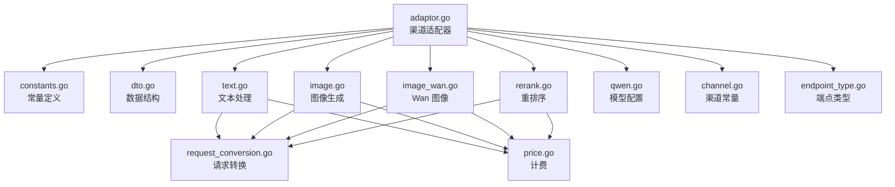
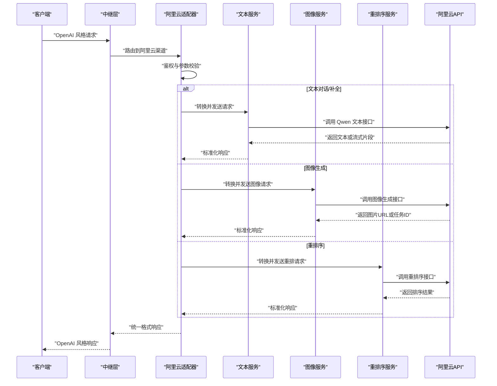
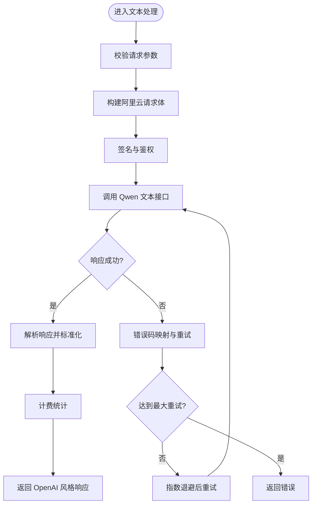
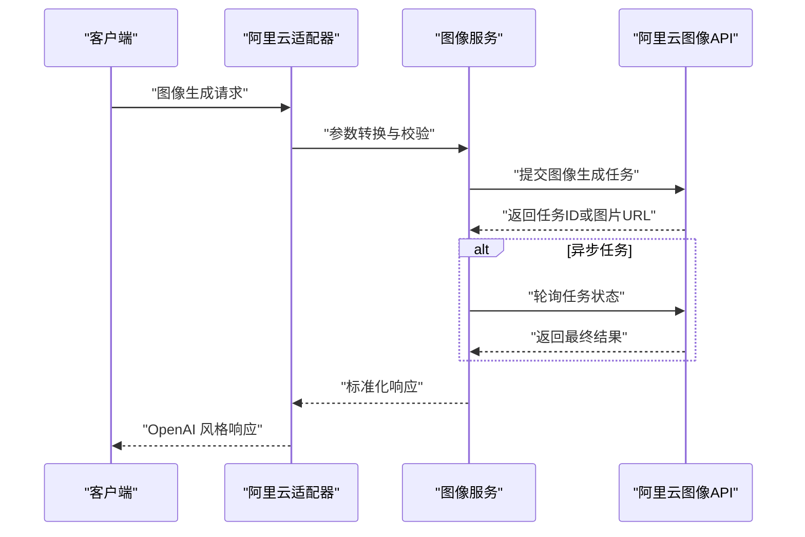
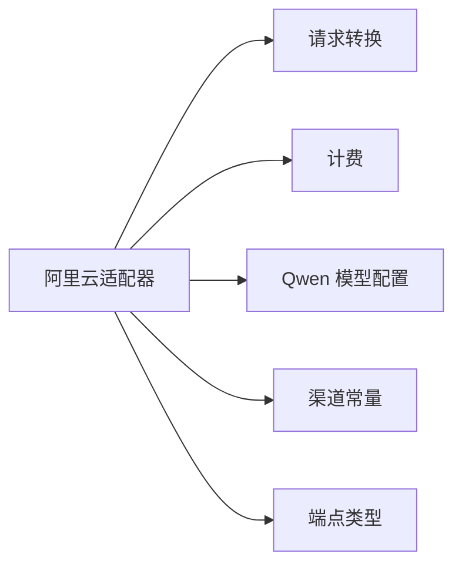

# 阿里云提供商

<cite>
**本文引用的文件**   
- [relay/channel/ali/adaptor.go](file://relay/channel/ali/adaptor.go)
- [relay/channel/ali/constants.go](file://relay/channel/ali/constants.go)
- [relay/channel/ali/dto.go](file://relay/channel/ali/dto.go)
- [relay/channel/ali/text.go](file://relay/channel/ali/text.go)
- [relay/channel/ali/image.go](file://relay/channel/ali/image.go)
- [relay/channel/ali/image_wan.go](file://relay/channel/ali/image_wan.go)
- [relay/channel/ali/rerank.go](file://relay/channel/ali/rerank.go)
- [relay/common/request_conversion.go](file://relay/common/request_conversion.go)
- [relay/helper/price.go](file://relay/helper/price.go)
- [setting/model_setting/qwen.go](file://setting/model_setting/qwen.go)
- [constant/channel.go](file://constant/channel.go)
- [common/endpoint_type.go](file://common/endpoint_type.go)
</cite>

## 目录
1. [简介](#简介)
2. [项目结构](#项目结构)
3. [核心组件](#核心组件)
4. [架构总览](#架构总览)
5. [详细组件分析](#详细组件分析)
6. [依赖关系分析](#依赖关系分析)
7. [性能与限流](#性能与限流)
8. [故障排查指南](#故障排查指南)
9. [结论](#结论)
10. [附录：配置与调用示例](#附录配置与调用示例)

## 简介
本章节面向使用阿里云作为上游渠道的开发者，系统性说明在该项目中“阿里云”渠道的实现方式、文本处理与图像生成能力、配置项与鉴权设置、区域与版本管理、与标准 OpenAI 格式的兼容映射、以及限流重试与错误码处理策略。文档同时覆盖通义千问（Qwen）文本服务、图像生成（含通用图像与 Wan 系列）、以及重排序（Rerank）等能力。

## 项目结构
阿里云渠道代码位于 relay/channel/ali 目录下，采用按能力拆分的模块化组织：
- adaptor.go：渠道适配器入口，负责注册、路由与统一生命周期管理
- constants.go：常量定义（模型名、端点类型、能力标识等）
- dto.go：与阿里云 API 交互的数据结构定义
- text.go：文本对话/补全相关实现
- image.go：图像生成相关实现
- image_wan.go：Wan 系列图像生成适配
- rerank.go：重排序能力适配

此外，还涉及以下公共模块：
- relay/common/request_conversion.go：请求转换与字段映射
- relay/helper/price.go：计费与价格计算
- setting/model_setting/qwen.go：通义千问模型配置
- constant/channel.go：渠道常量
- common/endpoint_type.go：端点类型枚举

**图表来源** 
- [relay/channel/ali/adaptor.go](file://relay/channel/ali/adaptor.go)
- [relay/channel/ali/constants.go](file://relay/channel/ali/constants.go)
- [relay/channel/ali/dto.go](file://relay/channel/ali/dto.go)
- [relay/channel/ali/text.go](file://relay/channel/ali/text.go)
- [relay/channel/ali/image.go](file://relay/channel/ali/image.go)
- [relay/channel/ali/image_wan.go](file://relay/channel/ali/image_wan.go)
- [relay/channel/ali/rerank.go](file://relay/channel/ali/rerank.go)
- [relay/common/request_conversion.go](file://relay/common/request_conversion.go)
- [relay/helper/price.go](file://relay/helper/price.go)
- [setting/model_setting/qwen.go](file://setting/model_setting/qwen.go)
- [constant/channel.go](file://constant/channel.go)
- [common/endpoint_type.go](file://common/endpoint_type.go)

**章节来源**
- [relay/channel/ali/adaptor.go](file://relay/channel/ali/adaptor.go)
- [relay/channel/ali/constants.go](file://relay/channel/ali/constants.go)
- [relay/channel/ali/dto.go](file://relay/channel/ali/dto.go)
- [relay/channel/ali/text.go](file://relay/channel/ali/text.go)
- [relay/channel/ali/image.go](file://relay/channel/ali/image.go)
- [relay/channel/ali/image_wan.go](file://relay/channel/ali/image_wan.go)
- [relay/channel/ali/rerank.go](file://relay/channel/ali/rerank.go)
- [relay/common/request_conversion.go](file://relay/common/request_conversion.go)
- [relay/helper/price.go](file://relay/helper/price.go)
- [setting/model_setting/qwen.go](file://setting/model_setting/qwen.go)
- [constant/channel.go](file://constant/channel.go)
- [common/endpoint_type.go](file://common/endpoint_type.go)

## 核心组件
- 渠道适配器（Adaptor）：统一接入阿里云各能力，完成鉴权、URL 构建、请求转发、响应解析与计费统计。
- 文本处理（Text）：将标准 OpenAI 聊天/补全请求转换为阿里云 Qwen 文本接口格式，并处理流式与非流式响应。
- 图像生成（Image）：支持通用图像生成与 Wan 系列图像生成，包含参数校验、任务提交与结果拉取。
- 重排序（Rerank）：将标准 Rerank 请求映射到阿里云对应接口，返回排序后的文档列表。
- DTO 与常量：集中定义与阿里云交互的数据结构与常量，确保字段一致性与可维护性。
- 请求转换与计费：标准化字段映射与计费指标采集，保证跨渠道一致性。

**章节来源**
- [relay/channel/ali/adaptor.go](file://relay/channel/ali/adaptor.go)
- [relay/channel/ali/text.go](file://relay/channel/ali/text.go)
- [relay/channel/ali/image.go](file://relay/channel/ali/image.go)
- [relay/channel/ali/image_wan.go](file://relay/channel/ali/image_wan.go)
- [relay/channel/ali/rerank.go](file://relay/channel/ali/rerank.go)
- [relay/common/request_conversion.go](file://relay/common/request_conversion.go)
- [relay/helper/price.go](file://relay/helper/price.go)

## 架构总览
下图展示了从客户端请求到阿里云上游的完整流程，包括请求转换、鉴权、调用与响应回传。

**图表来源** 
- [relay/channel/ali/adaptor.go](file://relay/channel/ali/adaptor.go)
- [relay/channel/ali/text.go](file://relay/channel/ali/text.go)
- [relay/channel/ali/image.go](file://relay/channel/ali/image.go)
- [relay/channel/ali/image_wan.go](file://relay/channel/ali/image_wan.go)
- [relay/channel/ali/rerank.go](file://relay/channel/ali/rerank.go)

## 详细组件分析

### 文本处理（通义千问）
- 功能要点
  - 将 OpenAI 风格的聊天/补全请求转换为阿里云 Qwen 文本接口所需格式
  - 支持流式与非流式响应，统一封装为 OpenAI 风格输出
  - 自动注入系统提示、工具调用、多模态输入（如适用）
  - 计费统计：根据 token 用量与模型定价计算费用
- 关键流程
  - 参数校验与默认值填充
  - 请求体构造与签名（AccessKey/SecretKey）
  - 调用上游接口并解析响应
  - 错误码映射与重试策略（依据上游状态码与业务码）
- 字段映射规则
  - 模型名称映射：OpenAI 模型名 -> 阿里云 Qwen 模型名
  - 消息内容映射：role/content -> 阿里云消息结构
  - 生成参数映射：temperature/top_p/max_tokens -> 阿里云对应参数
  - 工具/函数调用映射：function/tool -> 阿里云 function_call 或 tool_use
- 限流与重试
  - 基于上游速率限制（如 429）进行指数退避重试
  - 失败时记录错误码与上下文，便于定位问题

**图表来源** 
- [relay/channel/ali/text.go](file://relay/channel/ali/text.go)
- [relay/common/request_conversion.go](file://relay/common/request_conversion.go)
- [relay/helper/price.go](file://relay/helper/price.go)

**章节来源**
- [relay/channel/ali/text.go](file://relay/channel/ali/text.go)
- [relay/common/request_conversion.go](file://relay/common/request_conversion.go)
- [relay/helper/price.go](file://relay/helper/price.go)

### 图像生成（通用与 Wan 系列）
- 功能要点
  - 支持通用图像生成与 Wan 系列图像生成
  - 参数校验：尺寸、风格、数量、安全过滤等
  - 异步任务模式：提交任务 -> 轮询结果 -> 返回图片 URL 或二进制数据
- 关键流程
  - 参数转换：OpenAI 图像请求 -> 阿里云图像接口参数
  - 鉴权与签名
  - 调用上游接口并处理响应（同步或异步）
  - 错误处理与重试（网络异常、业务错误码）
- 字段映射规则
  - prompt -> 阿里云 prompt
  - size/style/negative_prompt -> 阿里云对应参数
  - model -> 阿里云图像模型名映射
  - response_format -> 返回格式（URL/Base64）

**图表来源** 
- [relay/channel/ali/image.go](file://relay/channel/ali/image.go)
- [relay/channel/ali/image_wan.go](file://relay/channel/ali/image_wan.go)

**章节来源**
- [relay/channel/ali/image.go](file://relay/channel/ali/image.go)
- [relay/channel/ali/image_wan.go](file://relay/channel/ali/image_wan.go)

### 重排序（Rerank）
- 功能要点
  - 将标准 Rerank 请求转换为阿里云重排序接口格式
  - 支持批量文档重排序，返回排序后的索引与分数
- 关键流程
  - 参数校验与转换
  - 调用上游重排序接口
  - 解析响应并映射为标准格式
- 字段映射规则
  - query/documents -> 阿里云 query/documents
  - top_n -> 阿里云 top_n
  - model -> 阿里云重排序模型名映射

**章节来源**
- [relay/channel/ali/rerank.go](file://relay/channel/ali/rerank.go)

### 适配器与常量
- 适配器职责
  - 统一注册阿里云渠道，提供能力路由
  - 管理鉴权信息（AccessKey/SecretKey）
  - 构建请求 URL 与签名
  - 统一错误处理与日志记录
- 常量定义
  - 模型名、端点类型、能力标识等常量集中管理
  - 便于扩展与维护

**章节来源**
- [relay/channel/ali/adaptor.go](file://relay/channel/ali/adaptor.go)
- [relay/channel/ali/constants.go](file://relay/channel/ali/constants.go)

### DTO 与数据结构
- 作用
  - 定义与阿里云 API 交互的请求与响应结构
  - 确保字段命名与类型的一致性
- 设计原则
  - 与上游 API 严格对齐
  - 提供必要的校验与默认值

**章节来源**
- [relay/channel/ali/dto.go](file://relay/channel/ali/dto.go)

## 依赖关系分析
阿里云渠道依赖以下公共模块：
- 请求转换：用于将标准 OpenAI 请求转换为阿里云格式
- 计费模块：用于统计 token 用量与费用计算
- 模型配置：通义千问模型相关配置
- 渠道常量与端点类型：用于路由与能力识别

**图表来源** 
- [relay/channel/ali/adaptor.go](file://relay/channel/ali/adaptor.go)
- [relay/common/request_conversion.go](file://relay/common/request_conversion.go)
- [relay/helper/price.go](file://relay/helper/price.go)
- [setting/model_setting/qwen.go](file://setting/model_setting/qwen.go)
- [constant/channel.go](file://constant/channel.go)
- [common/endpoint_type.go](file://common/endpoint_type.go)

**章节来源**
- [relay/channel/ali/adaptor.go](file://relay/channel/ali/adaptor.go)
- [relay/common/request_conversion.go](file://relay/common/request_conversion.go)
- [relay/helper/price.go](file://relay/helper/price.go)
- [setting/model_setting/qwen.go](file://setting/model_setting/qwen.go)
- [constant/channel.go](file://constant/channel.go)
- [common/endpoint_type.go](file://common/endpoint_type.go)

## 性能与限流
- 限流策略
  - 基于上游速率限制（如 HTTP 429）进行指数退避重试
  - 支持并发控制与队列管理，避免上游过载
- 重试机制
  - 针对网络异常与临时错误进行自动重试
  - 可配置最大重试次数与退避间隔
- 错误码处理
  - 将上游错误码映射为标准错误格式
  - 记录详细错误上下文，便于问题定位

**章节来源**
- [relay/channel/ali/text.go](file://relay/channel/ali/text.go)
- [relay/channel/ali/image.go](file://relay/channel/ali/image.go)
- [relay/channel/ali/rerank.go](file://relay/channel/ali/rerank.go)

## 故障排查指南
- 常见问题
  - 鉴权失败：检查 AccessKey/SecretKey 是否正确
  - 模型不存在：确认模型名映射是否正确
  - 参数错误：检查必填字段与取值范围
  - 速率限制：观察上游限流错误码并调整重试策略
- 调试建议
  - 启用详细日志，记录请求与响应
  - 使用测试工具验证上游接口可用性
  - 逐步缩小问题范围，定位具体环节

**章节来源**
- [relay/channel/ali/adaptor.go](file://relay/channel/ali/adaptor.go)
- [relay/channel/ali/text.go](file://relay/channel/ali/text.go)
- [relay/channel/ali/image.go](file://relay/channel/ali/image.go)
- [relay/channel/ali/rerank.go](file://relay/channel/ali/rerank.go)

## 结论
阿里云渠道通过统一的适配器与模块化设计，实现了文本、图像与重排序能力的标准化接入。通过严格的字段映射、计费统计与错误处理，确保了与 OpenAI 风格的兼容性。合理的限流与重试机制提升了系统的稳定性与可靠性。

## 附录：配置与调用示例
- 配置选项
  - AccessKey/SecretKey：用于鉴权
  - 区域选择：指定阿里云服务区域
  - API 版本：选择对应的 API 版本
  - 模型映射：配置 OpenAI 模型名到阿里云模型名的映射
- 调用方法
  - 文本对话：使用 OpenAI 聊天接口，自动路由到阿里云 Qwen
  - 图像生成：使用 OpenAI 图像接口，自动路由到阿里云图像服务
  - 重排序：使用标准 Rerank 接口，自动路由到阿里云重排序服务

**章节来源**
- [setting/model_setting/qwen.go](file://setting/model_setting/qwen.go)
- [relay/channel/ali/constants.go](file://relay/channel/ali/constants.go)
- [relay/common/request_conversion.go](file://relay/common/request_conversion.go)