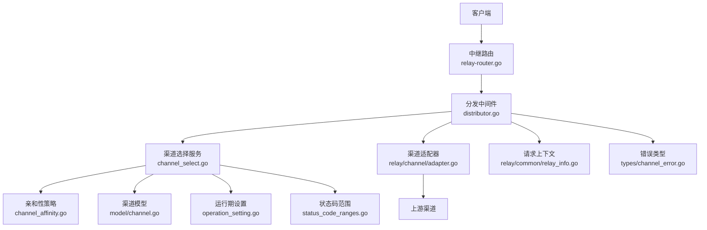
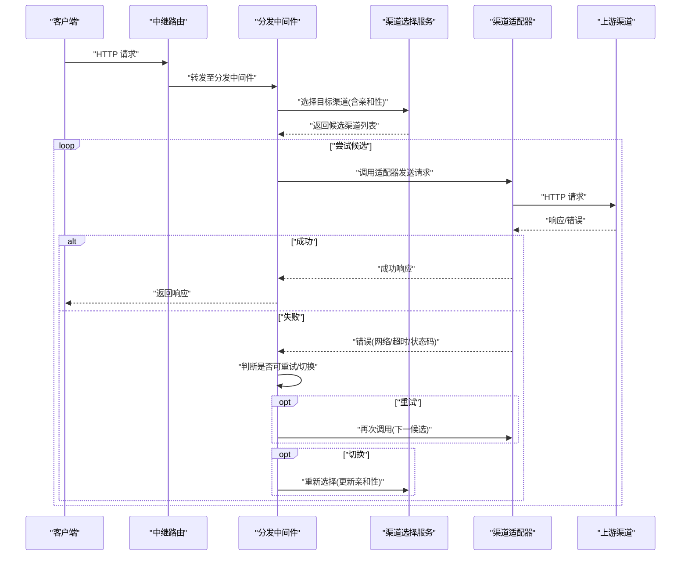
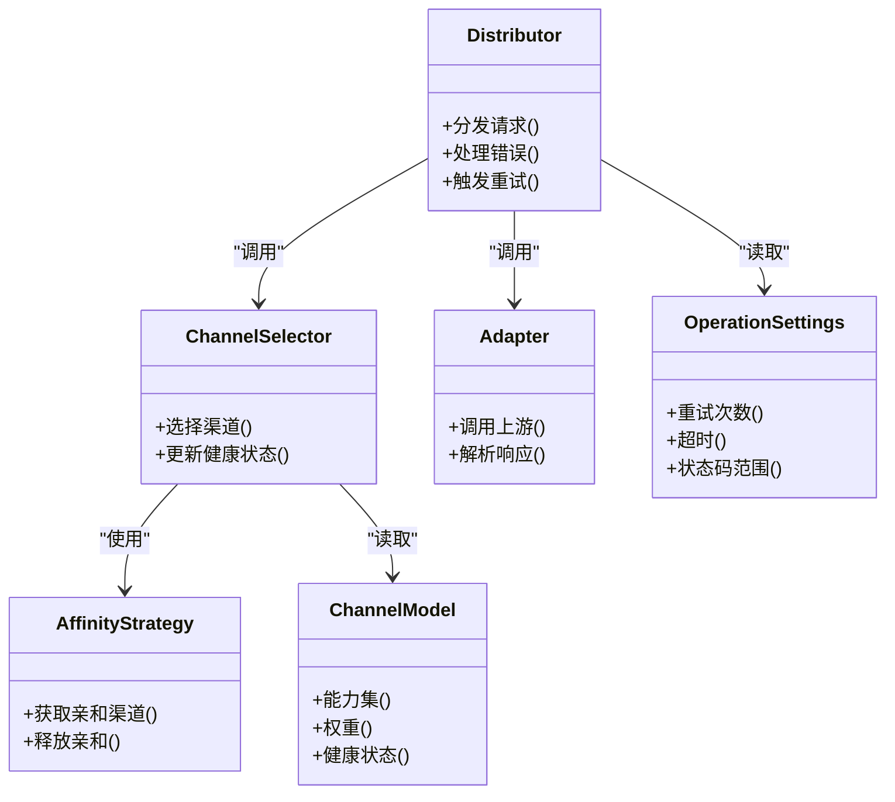

# 故障转移

<cite>
**本文引用的文件**   
- [main.go](file://main.go)
- [relay/router/relay-router.go](file://router/relay-router.go)
- [middleware/distributor.go](file://middleware/distributor.go)
- [service/channel_select.go](file://service/channel_select.go)
- [service/channel_affinity.go](file://service/channel_affinity.go)
- [model/channel.go](file://model/channel.go)
- [setting/operation_setting/operation_setting.go](file://setting/operation_setting/operation_setting.go)
- [setting/operation_setting/channel_affinity_setting.go](file://setting/operation_setting/channel_affinity_setting.go)
- [setting/operation_setting/status_code_ranges.go](file://setting/operation_setting/status_code_ranges.go)
- [relay/channel/adapter.go](file://relay/channel/adapter.go)
- [relay/common/relay_info.go](file://relay/common/relay_info.go)
- [types/channel_error.go](file://types/channel_error.go)
- [common/constants.go](file://common/constants.go)
</cite>

## 目录
1. [简介](#简介)
2. [项目结构](#项目结构)
3. [核心组件](#核心组件)
4. [架构总览](#架构总览)
5. [详细组件分析](#详细组件分析)
6. [依赖关系分析](#依赖关系分析)
7. [性能考量](#性能考量)
8. [故障排查指南](#故障排查指南)
9. [结论](#结论)
10. [附录](#附录)

## 简介
本文件面向“渠道故障转移机制”的完整说明，覆盖实现细节、调用关系、接口与领域模型、配置项与参数、与其他组件的关系、健康检查、自动切换、重试策略与错误处理。文档既适合初学者理解整体流程，也为有经验的开发者提供足够的技术深度与可操作建议。

## 项目结构
与故障转移相关的代码主要分布在以下模块：
- 路由层：请求进入后由中继路由分发到中间件进行调度
- 中间件层：负责选择具体渠道、执行转发、处理失败与重试
- 服务层：渠道选择算法、亲和性（粘性）策略、健康状态维护
- 模型层：渠道实体、错误类型定义
- 设置层：故障转移相关开关、阈值、状态码范围等配置
- 适配层：各上游渠道的具体适配器实现

图表来源
- [relay/router/relay-router.go](file://router/relay-router.go)
- [middleware/distributor.go](file://middleware/distributor.go)
- [service/channel_select.go](file://service/channel_select.go)
- [service/channel_affinity.go](file://service/channel_affinity.go)
- [model/channel.go](file://model/channel.go)
- [setting/operation_setting/operation_setting.go](file://setting/operation_setting/operation_setting.go)
- [setting/operation_setting/status_code_ranges.go](file://setting/operation_setting/status_code_ranges.go)
- [relay/channel/adapter.go](file://relay/channel/adapter.go)
- [relay/common/relay_info.go](file://relay/common/relay_info.go)
- [types/channel_error.go](file://types/channel_error.go)

章节来源
- [main.go](file://main.go)
- [relay/router/relay-router.go](file://router/relay-router.go)
- [middleware/distributor.go](file://middleware/distributor.go)
- [service/channel_select.go](file://service/channel_select.go)
- [service/channel_affinity.go](file://service/channel_affinity.go)
- [model/channel.go](file://model/channel.go)
- [setting/operation_setting/operation_setting.go](file://setting/operation_setting/operation_setting.go)
- [setting/operation_setting/status_code_ranges.go](file://setting/operation_setting/status_code_ranges.go)
- [relay/channel/adapter.go](file://relay/channel/adapter.go)
- [relay/common/relay_info.go](file://relay/common/relay_info.go)
- [types/channel_error.go](file://types/channel_error.go)

## 核心组件
- 分发中间件（distributor）
  - 职责：接收请求、构造上下文、选择渠道、发起调用、处理结果与错误、触发重试与故障转移
  - 关键行为：记录请求信息、统计与指标、根据策略决定重试与切换
- 渠道选择服务（channel_select）
  - 职责：基于模型匹配、权重、亲和性与健康状态选择目标渠道；支持多候选与回退
- 亲和性策略（channel_affinity）
  - 职责：维持用户或会话到渠道的粘性映射，减少不必要的切换
- 渠道模型（model/channel）
  - 职责：描述渠道元数据、能力、配额、健康状态、权重等
- 运行期设置（operation_setting）
  - 职责：暴露故障转移相关开关、阈值、超时、重试次数、状态码判定范围等
- 状态码范围（status_code_ranges）
  - 职责：定义哪些HTTP状态码应被视为可重试或需切换
- 渠道适配器（relay/channel/adapter）
  - 职责：封装对上游渠道的HTTP调用、流式处理、鉴权与参数转换
- 请求上下文（relay/common/relay_info）
  - 职责：承载请求ID、模型名、渠道选择结果、错误信息等

章节来源
- [middleware/distributor.go](file://middleware/distributor.go)
- [service/channel_select.go](file://service/channel_select.go)
- [service/channel_affinity.go](file://service/channel_affinity.go)
- [model/channel.go](file://model/channel.go)
- [setting/operation_setting/operation_setting.go](file://setting/operation_setting/operation_setting.go)
- [setting/operation_setting/status_code_ranges.go](file://setting/operation_setting/status_code_ranges.go)
- [relay/channel/adapter.go](file://relay/channel/adapter.go)
- [relay/common/relay_info.go](file://relay/common/relay_info.go)

## 架构总览
下图展示了从请求进入到故障转移的端到端流程，包括健康检查、自动切换与重试的关键节点。

图表来源
- [relay/router/relay-router.go](file://router/relay-router.go)
- [middleware/distributor.go](file://middleware/distributor.go)
- [service/channel_select.go](file://service/channel_select.go)
- [relay/channel/adapter.go](file://relay/channel/adapter.go)
- [relay/common/relay_info.go](file://relay/common/relay_info.go)

## 详细组件分析

### 分发中间件（distributor）
- 功能要点
  - 构建并注入请求上下文（请求ID、模型、租户、渠道选择结果等）
  - 协调渠道选择与适配器调用
  - 统一错误分类与上报
  - 控制重试与切换策略（受运行期设置驱动）
- 关键交互
  - 读取运行期设置（如最大重试次数、超时、状态码范围）
  - 调用渠道选择服务获取候选
  - 调用适配器执行请求，捕获异常并决策
- 错误处理
  - 区分网络错误、超时、业务错误与状态码错误
  - 依据状态码范围决定是否重试或切换
  - 记录日志与指标，便于排障

章节来源
- [middleware/distributor.go](file://middleware/distributor.go)
- [setting/operation_setting/operation_setting.go](file://setting/operation_setting/operation_setting.go)
- [setting/operation_setting/status_code_ranges.go](file://setting/operation_setting/status_code_ranges.go)
- [relay/common/relay_info.go](file://relay/common/relay_info.go)
- [types/channel_error.go](file://types/channel_error.go)

### 渠道选择服务（channel_select）
- 功能要点
  - 基于模型能力筛选可用渠道
  - 结合权重、健康状态、亲和性计算优先级
  - 返回有序候选列表，供分发中间件依次尝试
- 健康检查
  - 维护渠道健康状态（在线/离线/降级）
  - 动态更新（基于最近成功率、延迟、错误率）
- 亲和性
  - 将特定用户/会话固定到某渠道，降低抖动
  - 在渠道不可用时按策略释放亲和性

章节来源
- [service/channel_select.go](file://service/channel_select.go)
- [service/channel_affinity.go](file://service/channel_affinity.go)
- [model/channel.go](file://model/channel.go)

### 亲和性策略（channel_affinity）
- 功能要点
  - 维护键值映射（如用户ID/会话ID -> 渠道ID）
  - 支持过期与失效策略
  - 与选择服务联动，优先命中亲和渠道，失败时回退

章节来源
- [service/channel_affinity.go](file://service/channel_affinity.go)
- [service/channel_select.go](file://service/channel_select.go)

### 渠道模型（model/channel）
- 字段与作用
  - 标识、名称、类型、能力集、权重、配额、健康状态、亲和性标记等
- 与选择逻辑的关系
  - 能力集用于模型匹配
  - 权重与健康状态影响排序
  - 配额限制使用上限

章节来源
- [model/channel.go](file://model/channel.go)

### 运行期设置（operation_setting）
- 关键配置项（示例类别）
  - 故障转移开关、最大重试次数、单次请求超时
  - 健康检查周期、阈值（错误率、延迟）
  - 亲和性开关、亲和键策略、过期时间
  - 状态码范围（哪些状态码触发重试/切换）
- 作用域
  - 全局与渠道级可覆盖
  - 热更新生效（避免重启）

章节来源
- [setting/operation_setting/operation_setting.go](file://setting/operation_setting/operation_setting.go)
- [setting/operation_setting/channel_affinity_setting.go](file://setting/operation_setting/channel_affinity_setting.go)
- [setting/operation_setting/status_code_ranges.go](file://setting/operation_setting/status_code_ranges.go)

### 渠道适配器（relay/channel/adapter）
- 功能要点
  - 封装对上游渠道的HTTP调用、鉴权、参数转换
  - 支持流式响应与断点续传
  - 统一错误包装，便于上层识别与处理
- 与故障转移的关系
  - 向上抛出结构化错误（网络、超时、状态码、业务码）
  - 配合分发中间件完成重试与切换

章节来源
- [relay/channel/adapter.go](file://relay/channel/adapter.go)
- [relay/common/relay_info.go](file://relay/common/relay_info.go)
- [types/channel_error.go](file://types/channel_error.go)

### 请求上下文（relay/common/relay_info）
- 内容
  - 请求ID、模型名、渠道选择结果、错误信息、耗时、计费信息等
- 作用
  - 贯穿整个调用链，支撑日志、监控与审计

章节来源
- [relay/common/relay_info.go](file://relay/common/relay_info.go)

## 依赖关系分析
- 低耦合高内聚
  - 分发中间件仅依赖选择服务与适配器接口，不关心具体上游实现
  - 选择服务依赖渠道模型与亲和性策略，屏蔽底层差异
- 外部依赖
  - HTTP客户端（通过适配器）
  - 配置中心（运行期设置）
  - 缓存/存储（亲和性映射与健康状态）
- 潜在循环依赖
  - 通过接口与分层隔离避免循环引用

图表来源
- [middleware/distributor.go](file://middleware/distributor.go)
- [service/channel_select.go](file://service/channel_select.go)
- [service/channel_affinity.go](file://service/channel_affinity.go)
- [model/channel.go](file://model/channel.go)
- [relay/channel/adapter.go](file://relay/channel/adapter.go)
- [setting/operation_setting/operation_setting.go](file://setting/operation_setting/operation_setting.go)

章节来源
- [middleware/distributor.go](file://middleware/distributor.go)
- [service/channel_select.go](file://service/channel_select.go)
- [service/channel_affinity.go](file://service/channel_affinity.go)
- [model/channel.go](file://model/channel.go)
- [relay/channel/adapter.go](file://relay/channel/adapter.go)
- [setting/operation_setting/operation_setting.go](file://setting/operation_setting/operation_setting.go)

## 性能考量
- 选择算法复杂度
  - 候选排序通常为 O(n log n)，n为候选渠道数量
- 亲和性查找
  - 哈希表O(1)访问，注意并发安全与过期清理
- 重试与切换
  - 合理设置最大重试次数与超时，避免雪崩
- 健康检查
  - 异步周期性检测，避免阻塞主流程
- 资源占用
  - 连接池、缓冲与流式处理优化内存与带宽

[本节为通用指导，不直接分析具体文件]

## 故障排查指南
- 常见问题
  - 频繁切换：检查亲和性配置与阈值，确认是否存在抖动
  - 重试风暴：调整重试次数与退避策略，观察错误率
  - 健康状态误判：校准错误率与延迟阈值，查看最近指标
  - 状态码误判：核对状态码范围配置，确保符合上游语义
- 定位步骤
  - 查看请求上下文中的渠道选择结果与错误信息
  - 检查运行期设置是否被正确加载
  - 核对适配器日志与上游响应
  - 关注健康状态变化趋势
- 常用手段
  - 临时关闭亲和性以验证问题是否与绑定有关
  - 降低重试次数快速止血
  - 扩大状态码范围以覆盖上游特殊错误码

章节来源
- [relay/common/relay_info.go](file://relay/common/relay_info.go)
- [setting/operation_setting/status_code_ranges.go](file://setting/operation_setting/status_code_ranges.go)
- [types/channel_error.go](file://types/channel_error.go)
- [middleware/distributor.go](file://middleware/distributor.go)

## 结论
该故障转移机制通过“选择服务+亲和性+适配器”的分层设计，实现了健壮、可配置、可扩展的自动切换与重试能力。合理的健康检查与状态码范围配置是稳定性的关键。建议在上线前充分压测与灰度，持续观测指标并调优阈值。

[本节为总结性内容，不直接分析具体文件]

## 附录
- 术语
  - 渠道：上游API提供方实例
  - 亲和性：将请求固定到某渠道以减少切换
  - 健康检查：周期性评估渠道可用性
  - 状态码范围：用于判定是否需要重试或切换的HTTP状态码集合
- 最佳实践
  - 分阶段启用故障转移，先只读再写
  - 建立完善的监控与告警
  - 定期审查与更新状态码范围
  - 对关键渠道设置独立的重试与超时策略

[本节为补充信息，不直接分析具体文件]