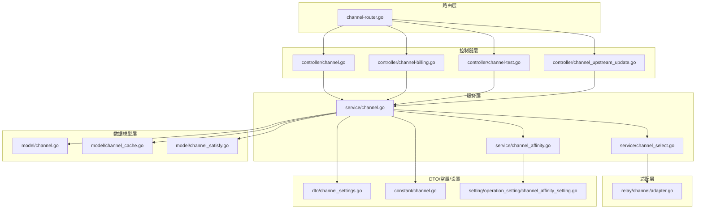
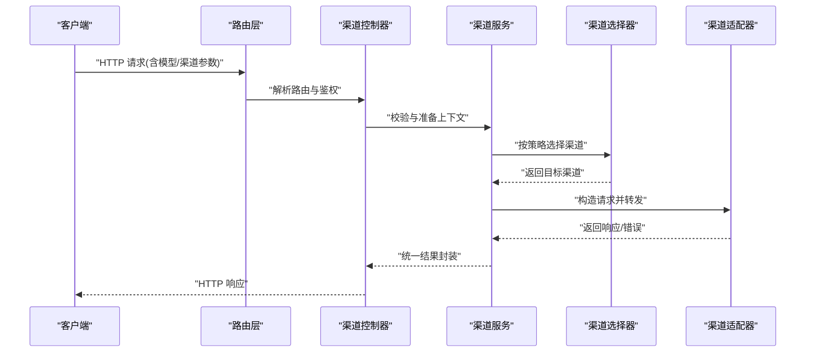
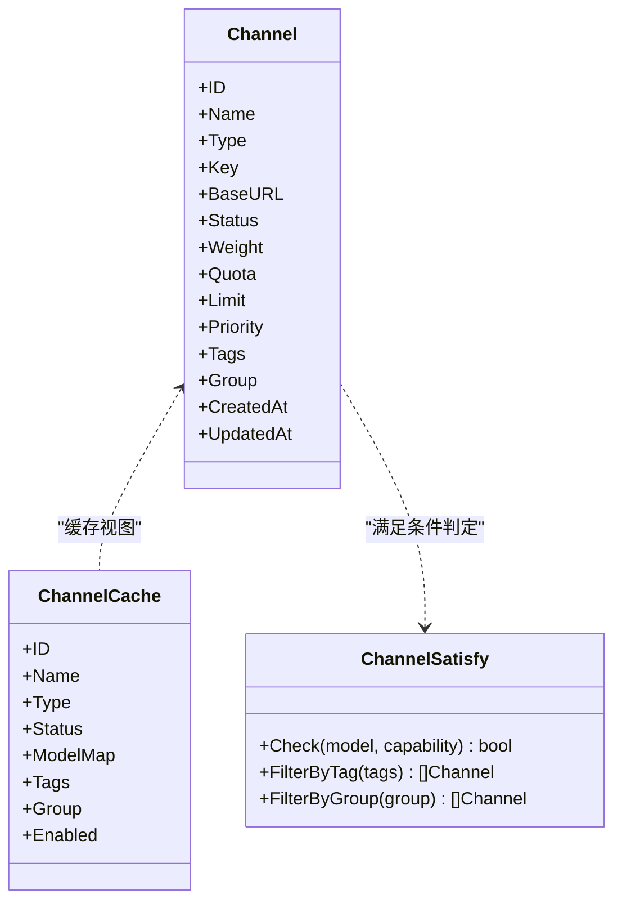
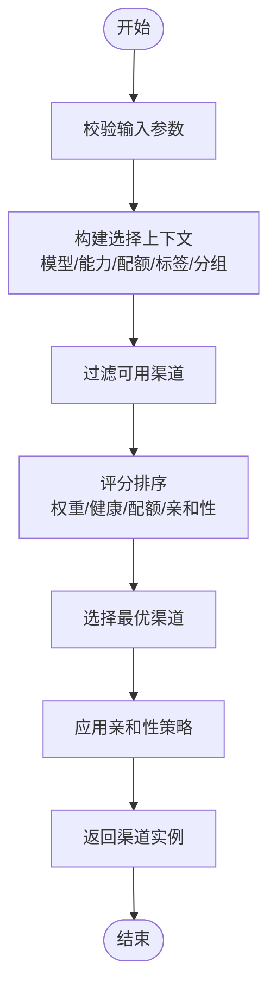
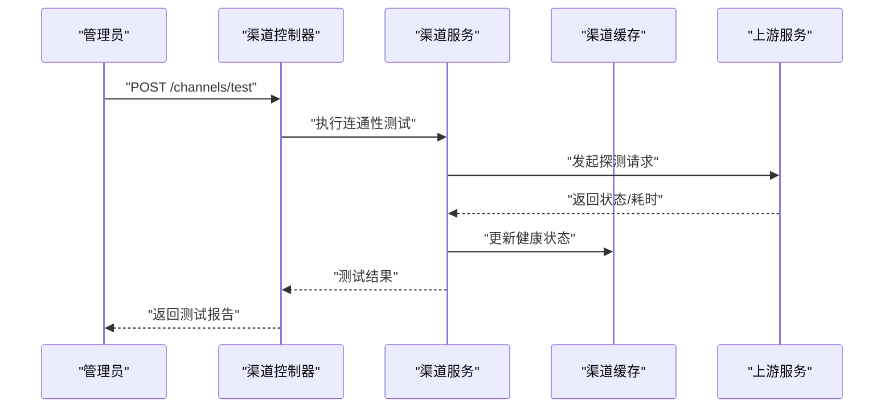
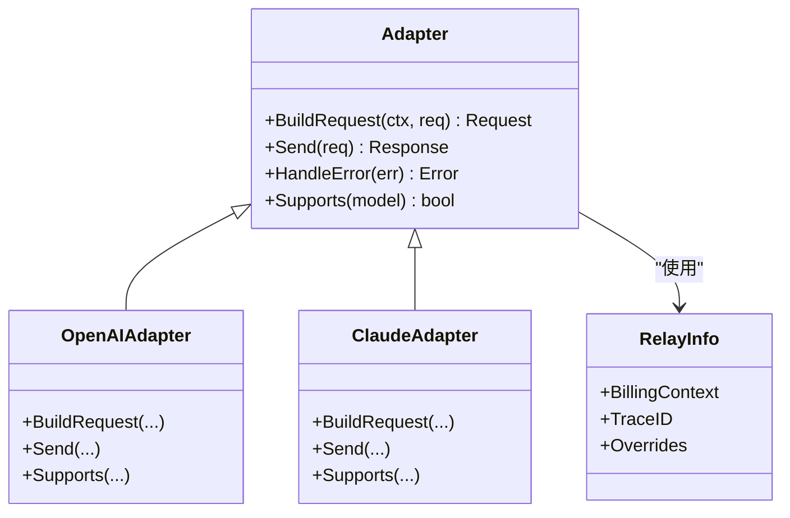
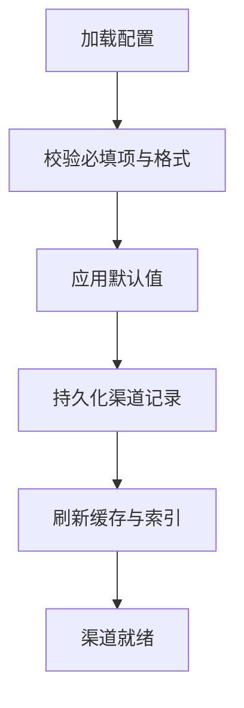
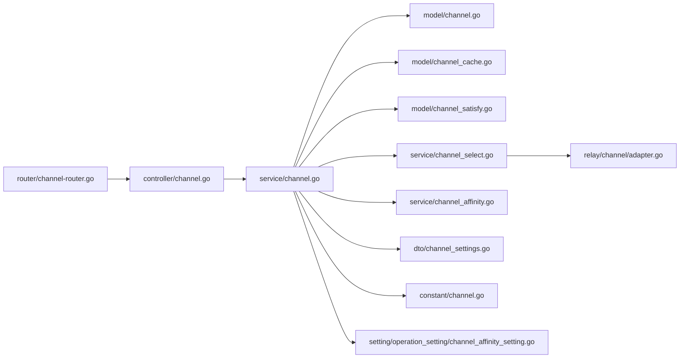

# 渠道概览

<cite>
**本文引用的文件**   
- [main.go](file://main.go)
- [router/channel-router.go](file://router/channel-router.go)
- [controller/channel.go](file://controller/channel.go)
- [controller/channel-billing.go](file://controller/channel-billing.go)
- [controller/channel-test.go](file://controller/channel-test.go)
- [controller/channel_upstream_update.go](file://controller/channel_upstream_update.go)
- [model/channel.go](file://model/channel.go)
- [model/channel_cache.go](file://model/channel_cache.go)
- [model/channel_satisfy.go](file://model/channel_satisfy.go)
- [service/channel.go](file://service/channel.go)
- [service/channel_select.go](file://service/channel_select.go)
- [service/channel_affinity.go](file://service/channel_affinity.go)
- [relay/channel/adapter.go](file://relay/channel/adapter.go)
- [relay/common/relay_info.go](file://relay/common/relay_info.go)
- [dto/channel_settings.go](file://dto/channel_settings.go)
- [setting/operation_setting/channel_affinity_setting.go](file://setting/operation_setting/channel_affinity_setting.go)
- [constant/channel.go](file://constant/channel.go)
</cite>

## 目录
1. [简介](#简介)
2. [项目结构](#项目结构)
3. [核心组件](#核心组件)
4. [架构总览](#架构总览)
5. [详细组件分析](#详细组件分析)
6. [依赖关系分析](#依赖关系分析)
7. [性能考量](#性能考量)
8. [故障排查指南](#故障排查指南)
9. [结论](#结论)
10. [附录](#附录)

## 简介
本章节面向“渠道管理”模块，提供从概念到实现的全景说明。渠道系统用于统一管理多个上游模型服务（如 OpenAI、Claude、Gemini 等），通过统一的接口与路由将请求分发至合适的渠道，并负责鉴权、计费、限流、缓存、亲和性选择与上游更新等能力。对初学者，本节以通俗语言解释渠道是什么、为什么需要它；对经验丰富的开发者，后续章节给出代码级结构与调用链、配置项与扩展点。

## 项目结构
渠道相关代码分布在以下层次：
- 路由层：定义渠道相关的 HTTP 路由与权限控制
- 控制器层：处理渠道的增删改查、测试连通性、计费统计、上游同步等
- 服务层：封装渠道选择、亲和性策略、缓存与业务编排
- 数据模型层：渠道实体、缓存视图、满足条件判断
- 适配层：各上游厂商的适配器实现，统一对外协议
- DTO/常量/设置：数据传输对象、常量枚举、运行期配置

图表来源
- [router/channel-router.go](file://router/channel-router.go)
- [controller/channel.go](file://controller/channel.go)
- [controller/channel-billing.go](file://controller/channel-billing.go)
- [controller/channel-test.go](file://controller/channel-test.go)
- [controller/channel_upstream_update.go](file://controller/channel_upstream_update.go)
- [service/channel.go](file://service/channel.go)
- [service/channel_select.go](file://service/channel_select.go)
- [service/channel_affinity.go](file://service/channel_affinity.go)
- [model/channel.go](file://model/channel.go)
- [model/channel_cache.go](file://model/channel_cache.go)
- [model/channel_satisfy.go](file://model/channel_satisfy.go)
- [relay/channel/adapter.go](file://relay/channel/adapter.go)
- [dto/channel_settings.go](file://dto/channel_settings.go)
- [constant/channel.go](file://constant/channel.go)
- [setting/operation_setting/channel_affinity_setting.go](file://setting/operation_setting/channel_affinity_setting.go)

章节来源
- [router/channel-router.go](file://router/channel-router.go)
- [controller/channel.go](file://controller/channel.go)
- [service/channel.go](file://service/channel.go)
- [model/channel.go](file://model/channel.go)

## 核心组件
- 渠道路由与控制器：暴露渠道管理的 RESTful 接口，包括列表、详情、创建、更新、删除、启用/禁用、测试连通性、计费统计、上游同步等。
- 渠道服务：聚合渠道的业务逻辑，负责校验、持久化、缓存、选择策略与亲和性计算。
- 渠道选择器：根据模型、配额、权重、健康状态等维度选择具体渠道实例。
- 渠道亲和性：基于用户或会话维度的粘性策略，提升稳定性与命中率。
- 渠道模型与缓存：数据库实体、内存缓存视图与满足条件判定。
- 渠道适配器：对接各上游厂商的统一抽象，屏蔽差异。

章节来源
- [controller/channel.go](file://controller/channel.go)
- [controller/channel-test.go](file://controller/channel-test.go)
- [controller/channel-billing.go](file://controller/channel-billing.go)
- [controller/channel_upstream_update.go](file://controller/channel_upstream_update.go)
- [service/channel.go](file://service/channel.go)
- [service/channel_select.go](file://service/channel_select.go)
- [service/channel_affinity.go](file://service/channel_affinity.go)
- [model/channel.go](file://model/channel.go)
- [model/channel_cache.go](file://model/channel_cache.go)
- [model/channel_satisfy.go](file://model/channel_satisfy.go)
- [relay/channel/adapter.go](file://relay/channel/adapter.go)

## 架构总览
下图展示一次典型“渠道选择与转发”的调用序列，体现路由、控制器、服务、选择器与适配器的协作关系。

图表来源
- [router/channel-router.go](file://router/channel-router.go)
- [controller/channel.go](file://controller/channel.go)
- [service/channel.go](file://service/channel.go)
- [service/channel_select.go](file://service/channel_select.go)
- [relay/channel/adapter.go](file://relay/channel/adapter.go)

## 详细组件分析

### 渠道数据模型与缓存
- 渠道实体：包含标识、名称、类型、密钥、基础 URL、状态、权重、配额、限额、优先级、标签、分组等字段，以及审计字段。
- 渠道缓存视图：为高频查询优化，提供快速匹配与过滤能力。
- 满足条件：用于判定某渠道是否支持特定模型/能力，结合标签、分组、模型映射等规则。

图表来源
- [model/channel.go](file://model/channel.go)
- [model/channel_cache.go](file://model/channel_cache.go)
- [model/channel_satisfy.go](file://model/channel_satisfy.go)

章节来源
- [model/channel.go](file://model/channel.go)
- [model/channel_cache.go](file://model/channel_cache.go)
- [model/channel_satisfy.go](file://model/channel_satisfy.go)

### 渠道服务与选择策略
- 渠道服务：负责渠道的 CRUD、状态切换、批量操作、校验、缓存刷新、统计与任务调度。
- 渠道选择器：依据模型、配额剩余、权重、健康检查、亲和性等维度进行决策，支持多策略组合。
- 渠道亲和性：基于用户/会话维度绑定稳定渠道，降低抖动与失败率。

图表来源
- [service/channel.go](file://service/channel.go)
- [service/channel_select.go](file://service/channel_select.go)
- [service/channel_affinity.go](file://service/channel_affinity.go)

章节来源
- [service/channel.go](file://service/channel.go)
- [service/channel_select.go](file://service/channel_select.go)
- [service/channel_affinity.go](file://service/channel_affinity.go)

### 渠道控制器与 API
- 列表与详情：分页查询、筛选、排序、导出。
- 创建与更新：参数校验、唯一性检查、敏感信息加密存储。
- 启用/禁用：状态切换与缓存失效。
- 测试连通性：异步探测上游可达性与延迟。
- 计费统计：用量汇总、账单明细、对账。
- 上游同步：拉取模型列表、价格、能力元数据。

图表来源
- [controller/channel-test.go](file://controller/channel-test.go)
- [service/channel.go](file://service/channel.go)
- [model/channel_cache.go](file://model/channel_cache.go)

章节来源
- [controller/channel.go](file://controller/channel.go)
- [controller/channel-test.go](file://controller/channel-test.go)
- [controller/channel-billing.go](file://controller/channel-billing.go)
- [controller/channel_upstream_update.go](file://controller/channel_upstream_update.go)

### 渠道适配器与统一协议
- 适配器抽象：定义统一的请求/响应转换、鉴权、重试、超时、流式处理等能力。
- 厂商实现：OpenAI、Claude、Gemini、Azure、Baidu、Tencent 等各自实现细节不同，但对外暴露一致接口。
- 中继信息：在转发过程中携带计费、追踪、覆盖参数等上下文。

图表来源
- [relay/channel/adapter.go](file://relay/channel/adapter.go)
- [relay/common/relay_info.go](file://relay/common/relay_info.go)

章节来源
- [relay/channel/adapter.go](file://relay/channel/adapter.go)
- [relay/common/relay_info.go](file://relay/common/relay_info.go)

### 配置选项与使用模式
- 渠道设置 DTO：描述渠道创建/更新时的可配置项，如类型、密钥、基础 URL、模型映射、标签、分组、权重、配额、限额、优先级、开关等。
- 亲和性设置：定义亲和性策略、阈值、过期时间、缓存键等。
- 常量：渠道类型、状态码、能力枚举等。

图表来源
- [dto/channel_settings.go](file://dto/channel_settings.go)
- [setting/operation_setting/channel_affinity_setting.go](file://setting/operation_setting/channel_affinity_setting.go)
- [constant/channel.go](file://constant/channel.go)

章节来源
- [dto/channel_settings.go](file://dto/channel_settings.go)
- [setting/operation_setting/channel_affinity_setting.go](file://setting/operation_setting/channel_affinity_setting.go)
- [constant/channel.go](file://constant/channel.go)

## 依赖关系分析
- 路由依赖控制器，控制器依赖服务，服务依赖模型与缓存，选择器依赖适配器与常量，设置影响选择与亲和性策略。
- 外部依赖：上游厂商 API、数据库、缓存、监控与日志。

图表来源
- [router/channel-router.go](file://router/channel-router.go)
- [controller/channel.go](file://controller/channel.go)
- [service/channel.go](file://service/channel.go)
- [model/channel.go](file://model/channel.go)
- [model/channel_cache.go](file://model/channel_cache.go)
- [model/channel_satisfy.go](file://model/channel_satisfy.go)
- [service/channel_select.go](file://service/channel_select.go)
- [service/channel_affinity.go](file://service/channel_affinity.go)
- [relay/channel/adapter.go](file://relay/channel/adapter.go)
- [dto/channel_settings.go](file://dto/channel_settings.go)
- [constant/channel.go](file://constant/channel.go)
- [setting/operation_setting/channel_affinity_setting.go](file://setting/operation_setting/channel_affinity_setting.go)

章节来源
- [router/channel-router.go](file://router/channel-router.go)
- [controller/channel.go](file://controller/channel.go)
- [service/channel.go](file://service/channel.go)

## 性能考量
- 缓存优先：渠道列表与满足条件查询走缓存视图，减少数据库压力。
- 选择算法：加权随机/健康度/配额剩余等多因子评分，避免热点单点。
- 亲和性：用户/会话级别绑定，降低抖动与重连成本。
- 并发与限流：配合全局限流与模型级限流，保护上游与系统资源。
- 异步任务：测试连通性、上游同步、统计结算采用异步队列，避免阻塞主流程。

[本节为通用指导，不直接分析具体文件]

## 故障排查指南
- 连通性失败：检查基础 URL、密钥、网络代理、证书与端口；查看测试报告中的状态码与耗时。
- 选择不到渠道：确认模型映射、标签与分组是否正确；检查渠道状态与配额上限。
- 亲和性异常：检查亲和性策略配置、过期时间与缓存键冲突。
- 计费偏差：核对用量采集、汇率与定价策略；查看账单明细与对账差异。
- 上游同步失败：检查认证、速率限制与元数据格式；查看同步任务日志。

章节来源
- [controller/channel-test.go](file://controller/channel-test.go)
- [controller/channel-billing.go](file://controller/channel-billing.go)
- [controller/channel_upstream_update.go](file://controller/channel_upstream_update.go)
- [service/channel.go](file://service/channel.go)

## 结论
渠道系统通过统一抽象与分层设计，将复杂的多上游接入简化为一致的接口与流程。借助缓存、选择策略与亲和性机制，系统在可用性、可扩展性与性能方面具备良好表现。建议在生产环境中合理配置权重与亲和性，持续监控健康与用量，定期同步上游元数据以保证模型与价格的准确性。

[本节为总结性内容，不直接分析具体文件]

## 附录
- 常见用例
  - 新增一个 OpenAI 渠道：填写类型、密钥、基础 URL、模型映射与标签，保存后自动刷新缓存。
  - 测试渠道连通性：提交测试请求，观察状态码、延迟与错误信息。
  - 调整权重与亲和性：根据负载与健康度动态调优，提升整体成功率。
  - 同步上游模型：定时拉取最新模型与价格，确保计费准确。
- 公共接口要点
  - 列表/详情：支持分页、筛选、排序与导出。
  - 创建/更新：必填项校验、唯一性检查、敏感信息加密。
  - 启用/禁用：状态切换与缓存失效。
  - 测试连通性：异步探测，返回状态与耗时。
  - 计费统计：用量汇总、账单明细、对账。
  - 上游同步：模型、价格、能力元数据拉取。

[本节为概念性补充，不直接分析具体文件]