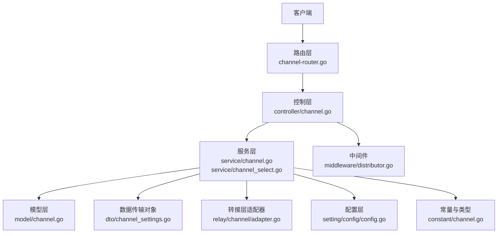
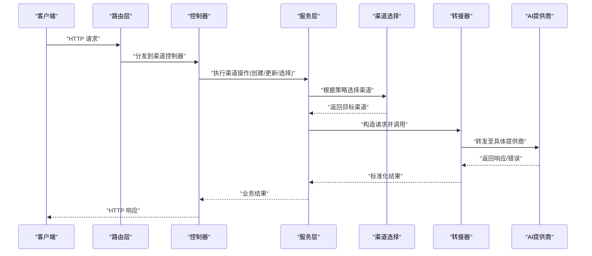
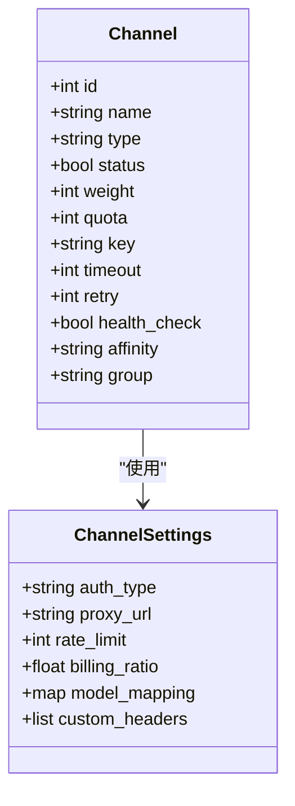
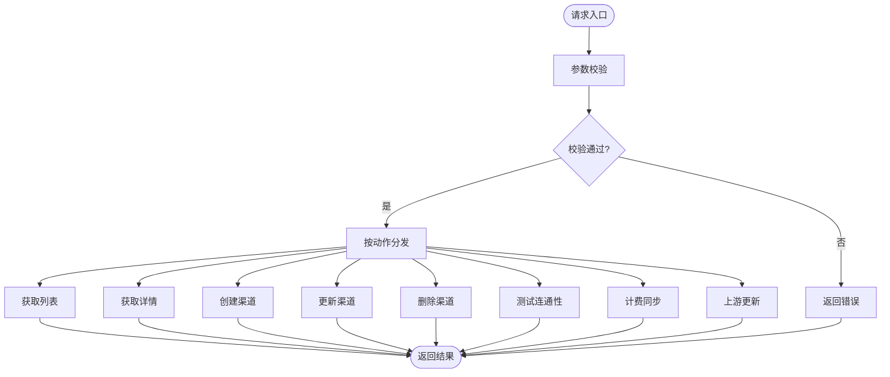
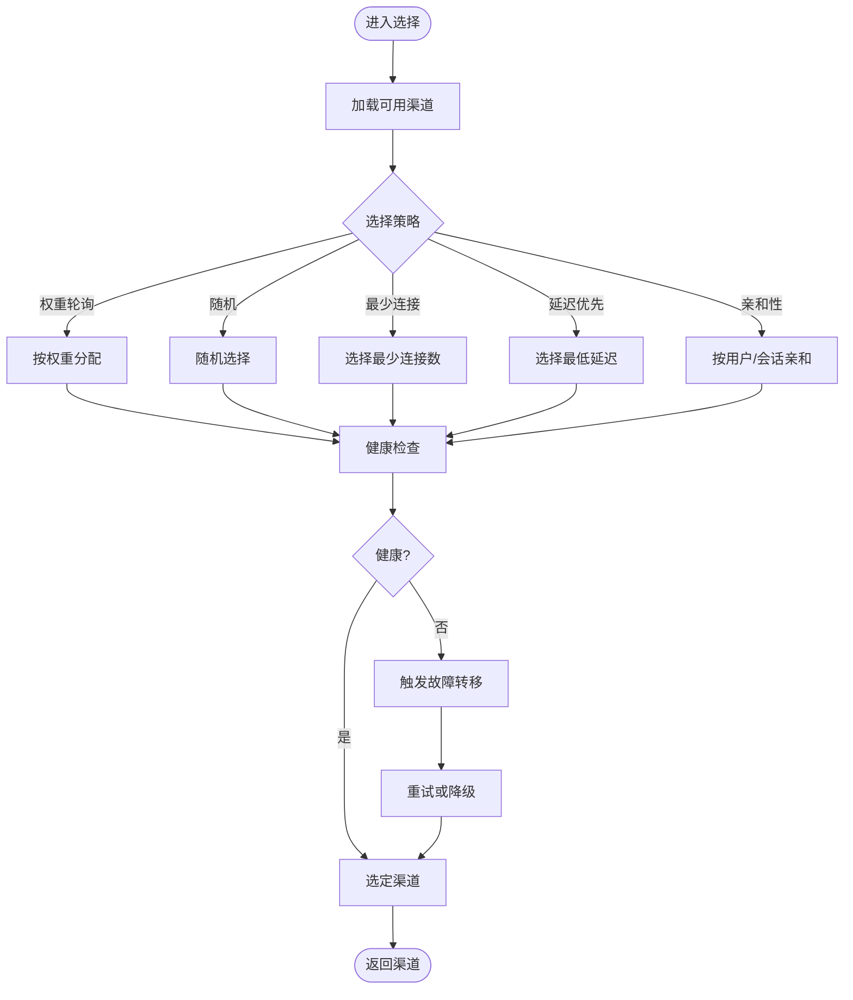
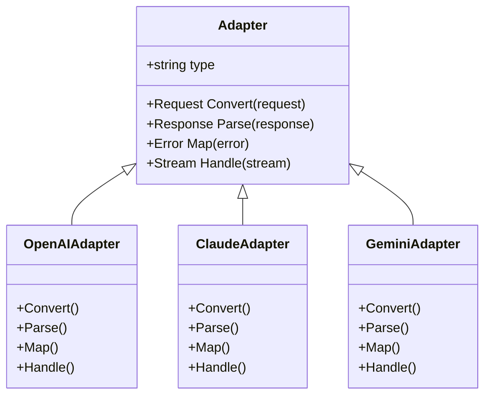
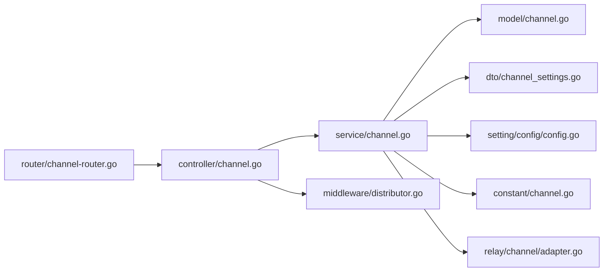

# 渠道管理

<cite>
**本文引用的文件**   
- [main.go](file://main.go)
- [router/channel-router.go](file://router/channel-router.go)
- [controller/channel.go](file://controller/channel.go)
- [controller/channel-billing.go](file://controller/channel-billing.go)
- [controller/channel-test.go](file://controller/channel-test.go)
- [controller/channel_upstream_update.go](file://controller/channel_upstream_update.go)
- [service/channel.go](file://service/channel.go)
- [service/channel_select.go](file://service/channel_select.go)
- [model/channel.go](file://model/channel.go)
- [dto/channel_settings.go](file://dto/channel_settings.go)
- [relay/channel/adapter.go](file://relay/channel/adapter.go)
- [relay/common/relay_info.go](file://relay/common/relay_info.go)
- [setting/config/config.go](file://setting/config/config.go)
- [constant/channel.go](file://constant/channel.go)
- [middleware/distributor.go](file://middleware/distributor.go)
</cite>

## 目录
1. [简介](#简介)
2. [项目结构](#项目结构)
3. [核心组件](#核心组件)
4. [架构总览](#架构总览)
5. [详细组件分析](#详细组件分析)
6. [依赖关系分析](#依赖关系分析)
7. [性能考量](#性能考量)
8. [故障排查指南](#故障排查指南)
9. [结论](#结论)
10. [附录](#附录)

## 简介
本文件为“渠道管理系统”的权威技术文档，面向初学者与资深开发者。内容涵盖：
- 系统架构与组件职责
- 领域模型、数据流与处理逻辑
- 接口定义、配置项、参数与返回值说明
- 与其他模块（路由、中间件、计费、转接层）的关系
- 常见问题与解决方案
- 扩展指南：新增AI服务提供商支持、渠道配置、负载均衡策略与故障转移机制

## 项目结构
渠道管理涉及路由、控制器、服务、模型、DTO、转接器与配置等模块，整体分层清晰：
- 路由层：对外暴露渠道管理的HTTP接口
- 控制层：请求校验、权限与业务编排
- 服务层：渠道选择、负载均衡、故障转移、配额与计费
- 模型与DTO：持久化结构与传输对象
- 转接层：适配不同AI提供商的协议与数据结构
- 配置层：全局与运行时配置

图表来源
- [router/channel-router.go](file://router/channel-router.go)
- [controller/channel.go](file://controller/channel.go)
- [service/channel.go](file://service/channel.go)
- [service/channel_select.go](file://service/channel_select.go)
- [model/channel.go](file://model/channel.go)
- [dto/channel_settings.go](file://dto/channel_settings.go)
- [relay/channel/adapter.go](file://relay/channel/adapter.go)
- [setting/config/config.go](file://setting/config/config.go)
- [constant/channel.go](file://constant/channel.go)
- [middleware/distributor.go](file://middleware/distributor.go)

章节来源
- [router/channel-router.go](file://router/channel-router.go)
- [controller/channel.go](file://controller/channel.go)
- [service/channel.go](file://service/channel.go)
- [model/channel.go](file://model/channel.go)
- [dto/channel_settings.go](file://dto/channel_settings.go)
- [relay/channel/adapter.go](file://relay/channel/adapter.go)
- [setting/config/config.go](file://setting/config/config.go)
- [constant/channel.go](file://constant/channel.go)
- [middleware/distributor.go](file://middleware/distributor.go)

## 核心组件
- 路由与控制器
  - 提供渠道CRUD、测试连通性、计费信息同步、上游更新等能力
- 服务层
  - 负责渠道选择策略、负载均衡、故障转移、配额与计费联动
- 模型与DTO
  - 渠道实体、设置项、校验规则与序列化
- 转接器
  - 统一抽象各AI提供商的请求/响应转换与调用
- 配置与常量
  - 全局开关、默认值、渠道类型枚举与行为常量

章节来源
- [controller/channel.go](file://controller/channel.go)
- [controller/channel-billing.go](file://controller/channel-billing.go)
- [controller/channel-test.go](file://controller/channel-test.go)
- [controller/channel_upstream_update.go](file://controller/channel_upstream_update.go)
- [service/channel.go](file://service/channel.go)
- [service/channel_select.go](file://service/channel_select.go)
- [model/channel.go](file://model/channel.go)
- [dto/channel_settings.go](file://dto/channel_settings.go)
- [relay/channel/adapter.go](file://relay/channel/adapter.go)
- [setting/config/config.go](file://setting/config/config.go)
- [constant/channel.go](file://constant/channel.go)

## 架构总览
渠道管理在请求进入后，经过路由分发到控制器，再由服务层进行渠道选择与调度，最终通过转接器调用具体AI提供商。关键流程如下：

图表来源
- [router/channel-router.go](file://router/channel-router.go)
- [controller/channel.go](file://controller/channel.go)
- [service/channel.go](file://service/channel.go)
- [service/channel_select.go](file://service/channel_select.go)
- [relay/channel/adapter.go](file://relay/channel/adapter.go)

章节来源
- [router/channel-router.go](file://router/channel-router.go)
- [controller/channel.go](file://controller/channel.go)
- [service/channel.go](file://service/channel.go)
- [service/channel_select.go](file://service/channel_select.go)
- [relay/channel/adapter.go](file://relay/channel/adapter.go)

## 详细组件分析

### 渠道模型与数据传输对象
- 渠道模型
  - 标识、名称、类型、状态、权重、限额、密钥、超时、重试策略、健康检查、亲和性、分组等
- 渠道设置DTO
  - 结构化配置项，包含鉴权、代理、限流、计费、模型映射、自定义头部等
- 校验与默认值
  - 字段合法性、必填项、范围限制、默认值填充

图表来源
- [model/channel.go](file://model/channel.go)
- [dto/channel_settings.go](file://dto/channel_settings.go)

章节来源
- [model/channel.go](file://model/channel.go)
- [dto/channel_settings.go](file://dto/channel_settings.go)

### 渠道控制器与接口
- 主要能力
  - 渠道列表、详情、创建、更新、删除
  - 渠道测试连通性
  - 渠道计费信息同步
  - 渠道上游配置批量更新
- 典型接口
  - GET /channels
  - POST /channels
  - PUT /channels/:id
  - DELETE /channels/:id
  - POST /channels/:id/test
  - POST /channels/billing/sync
  - POST /channels/upstream/update

图表来源
- [controller/channel.go](file://controller/channel.go)
- [controller/channel-test.go](file://controller/channel-test.go)
- [controller/channel-billing.go](file://controller/channel-billing.go)
- [controller/channel_upstream_update.go](file://controller/channel_upstream_update.go)

章节来源
- [controller/channel.go](file://controller/channel.go)
- [controller/channel-test.go](file://controller/channel-test.go)
- [controller/channel-billing.go](file://controller/channel-billing.go)
- [controller/channel_upstream_update.go](file://controller/channel_upstream_update.go)

### 服务层：渠道选择、负载均衡与故障转移
- 渠道选择策略
  - 权重轮询、随机、最少连接、延迟优先、亲和性绑定
- 负载均衡
  - 基于权重与实时健康状态的动态分配
- 故障转移
  - 失败重试、降级到备用渠道、熔断与退避
- 配额与计费联动
  - 额度扣减、用量统计、价格计算

图表来源
- [service/channel_select.go](file://service/channel_select.go)
- [service/channel.go](file://service/channel.go)
- [constant/channel.go](file://constant/channel.go)

章节来源
- [service/channel_select.go](file://service/channel_select.go)
- [service/channel.go](file://service/channel.go)
- [constant/channel.go](file://constant/channel.go)

### 转接器：统一调用与协议适配
- 适配器抽象
  - 统一的请求构造、响应解析、错误映射、流式处理
- 提供商实现
  - OpenAI、Claude、Gemini、Azure、Baidu、Ali、Tencent、Vertex、Xunfei、Zhipu等
- 上下文与计费
  - 请求元数据、模型映射、用量统计、价格计算

图表来源
- [relay/channel/adapter.go](file://relay/channel/adapter.go)
- [relay/common/relay_info.go](file://relay/common/relay_info.go)

章节来源
- [relay/channel/adapter.go](file://relay/channel/adapter.go)
- [relay/common/relay_info.go](file://relay/common/relay_info.go)

### 配置与常量
- 全局配置
  - 渠道默认权重、超时、重试次数、健康检查间隔、负载均衡算法、故障转移阈值
- 渠道类型常量
  - 提供商类型枚举、协议版本、鉴权方式
- 运行时开关
  - 是否启用亲和性、是否开启计费、是否启用缓存

章节来源
- [setting/config/config.go](file://setting/config/config.go)
- [constant/channel.go](file://constant/channel.go)

## 依赖关系分析
- 路由依赖控制器，控制器依赖服务
- 服务依赖模型、DTO、配置与常量
- 服务通过转接器调用外部提供商
- 中间件参与请求分发与限流

图表来源
- [router/channel-router.go](file://router/channel-router.go)
- [controller/channel.go](file://controller/channel.go)
- [service/channel.go](file://service/channel.go)
- [model/channel.go](file://model/channel.go)
- [dto/channel_settings.go](file://dto/channel_settings.go)
- [setting/config/config.go](file://setting/config/config.go)
- [constant/channel.go](file://constant/channel.go)
- [relay/channel/adapter.go](file://relay/channel/adapter.go)
- [middleware/distributor.go](file://middleware/distributor.go)

章节来源
- [router/channel-router.go](file://router/channel-router.go)
- [controller/channel.go](file://controller/channel.go)
- [service/channel.go](file://service/channel.go)
- [model/channel.go](file://model/channel.go)
- [dto/channel_settings.go](file://dto/channel_settings.go)
- [setting/config/config.go](file://setting/config/config.go)
- [constant/channel.go](file://constant/channel.go)
- [relay/channel/adapter.go](file://relay/channel/adapter.go)
- [middleware/distributor.go](file://middleware/distributor.go)

## 性能考量
- 选择策略优化
  - 权重与实时健康状态结合，避免热点与拥塞
- 并发与池化
  - 连接池、请求队列、异步重试
- 缓存与命中
  - 模型映射、定价、配额缓存
- 监控与指标
  - 延迟、成功率、错误码分布、吞吐量

[本节为通用指导，不直接分析具体文件]

## 故障排查指南
- 常见错误
  - 鉴权失败：检查密钥、鉴权头、令牌有效期
  - 超时与连接失败：检查网络、代理、超时配置
  - 配额不足：检查渠道额度、用户配额、计费规则
  - 模型不支持：检查模型映射与提供商能力
- 诊断步骤
  - 查看渠道健康状态与日志
  - 使用测试接口验证连通性
  - 检查配置项与常量定义
  - 分析选择策略与负载均衡效果

章节来源
- [controller/channel-test.go](file://controller/channel-test.go)
- [controller/channel.go](file://controller/channel.go)
- [setting/config/config.go](file://setting/config/config.go)
- [constant/channel.go](file://constant/channel.go)

## 结论
渠道管理系统通过清晰的分层与模块化设计，实现了多AI提供商的统一接入、灵活的选择策略与健壮的故障转移。借助适配器模式与配置驱动，系统具备良好的可扩展性与可维护性。建议在生产环境中结合监控与告警，持续优化选择策略与资源配置。

[本节为总结，不直接分析具体文件]

## 附录

### 如何添加新的AI服务提供商支持
- 步骤概览
  - 定义新提供商类型与常量
  - 实现适配器：请求转换、响应解析、错误映射、流式处理
  - 注册适配器到转接器工厂
  - 配置渠道类型与默认值
  - 编写单元测试与集成测试
- 关键点
  - 保持适配器接口一致
  - 正确处理鉴权与签名
  - 完善错误映射与日志
  - 覆盖流式与非流式场景

章节来源
- [relay/channel/adapter.go](file://relay/channel/adapter.go)
- [constant/channel.go](file://constant/channel.go)
- [setting/config/config.go](file://setting/config/config.go)

### 渠道配置要点
- 必填项
  - 名称、类型、密钥、状态
- 可选项
  - 权重、超时、重试、代理、限流、计费比率、模型映射、自定义头部
- 校验规则
  - 非空、格式、范围、依赖关系

章节来源
- [dto/channel_settings.go](file://dto/channel_settings.go)
- [model/channel.go](file://model/channel.go)

### 负载均衡策略与故障转移机制
- 策略
  - 权重轮询、随机、最少连接、延迟优先、亲和性
- 故障转移
  - 重试、降级、熔断、退避
- 健康检查
  - 周期性探测、快速失败、恢复检测

章节来源
- [service/channel_select.go](file://service/channel_select.go)
- [service/channel.go](file://service/channel.go)
- [constant/channel.go](file://constant/channel.go)

### 接口参考（示例）
- 渠道列表
  - 方法：GET
  - 路径：/channels
  - 参数：分页、过滤、排序
  - 返回：渠道集合
- 渠道详情
  - 方法：GET
  - 路径：/channels/:id
  - 返回：渠道详情
- 创建渠道
  - 方法：POST
  - 路径：/channels
  - 请求体：渠道设置DTO
  - 返回：创建结果
- 更新渠道
  - 方法：PUT
  - 路径：/channels/:id
  - 请求体：渠道设置DTO
  - 返回：更新结果
- 删除渠道
  - 方法：DELETE
  - 路径：/channels/:id
  - 返回：删除结果
- 测试连通性
  - 方法：POST
  - 路径：/channels/:id/test
  - 返回：测试结果
- 计费同步
  - 方法：POST
  - 路径：/channels/billing/sync
  - 返回：同步结果
- 上游更新
  - 方法：POST
  - 路径：/channels/upstream/update
  - 请求体：批量更新参数
  - 返回：更新结果

章节来源
- [controller/channel.go](file://controller/channel.go)
- [controller/channel-test.go](file://controller/channel-test.go)
- [controller/channel-billing.go](file://controller/channel-billing.go)
- [controller/channel_upstream_update.go](file://controller/channel_upstream_update.go)