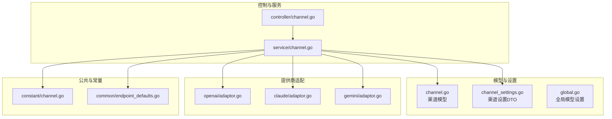
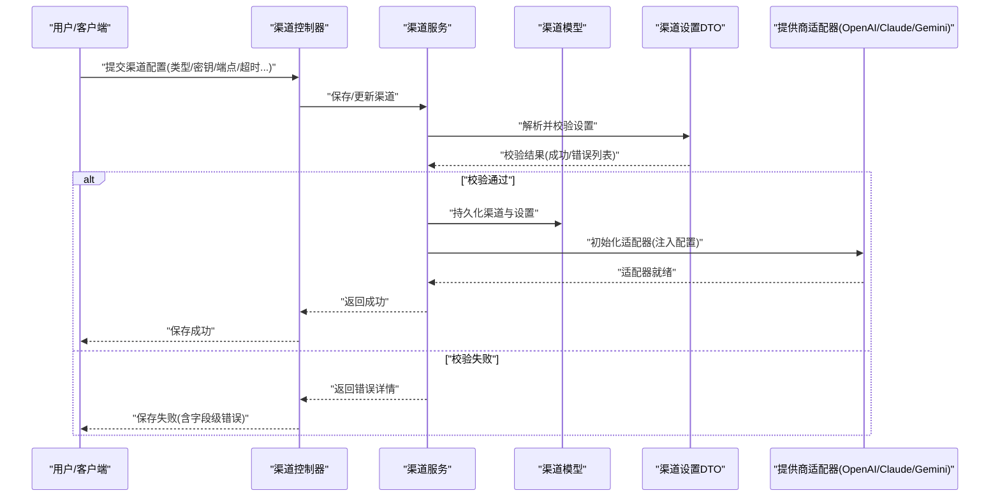
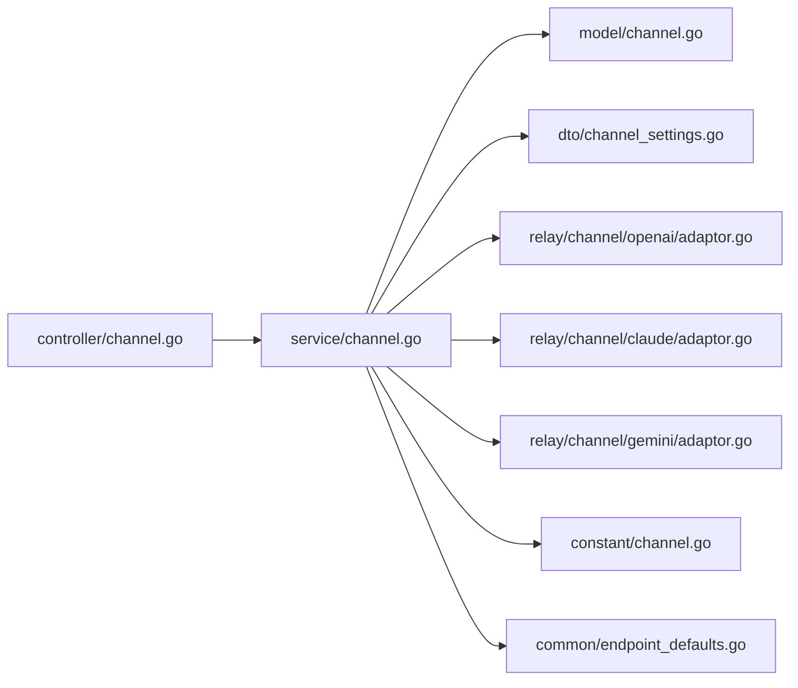

# 基础配置

<cite>
**本文引用的文件**   
- [model/channel.go](file://model/channel.go)
- [dto/channel_settings.go](file://dto/channel_settings.go)
- [setting/model_setting/global.go](file://setting/model_setting/global.go)
- [relay/channel/openai/adaptor.go](file://relay/channel/openai/adaptor.go)
- [relay/channel/claude/adaptor.go](file://relay/channel/claude/adaptor.go)
- [relay/channel/gemini/adaptor.go](file://relay/channel/gemini/adaptor.go)
- [controller/channel.go](file://controller/channel.go)
- [service/channel.go](file://service/channel.go)
- [common/endpoint_defaults.go](file://common/endpoint_defaults.go)
- [constant/channel.go](file://constant/channel.go)
</cite>

## 目录
1. [简介](#简介)
2. [项目结构](#项目结构)
3. [核心组件](#核心组件)
4. [架构总览](#架构总览)
5. [详细组件分析](#详细组件分析)
6. [依赖关系分析](#依赖关系分析)
7. [性能考虑](#性能考虑)
8. [故障排查指南](#故障排查指南)
9. [结论](#结论)
10. [附录](#附录)

## 简介
本章节面向渠道基础配置，系统性说明如何为不同大模型提供商（如 OpenAI、Claude、Gemini 等）完成连接参数设置。内容涵盖：
- 通用配置项：提供商类型选择、API 密钥、端点 URL、请求超时、代理与重试等
- 各提供商特定要求：鉴权方式、端点差异、特有字段
- 配置验证规则、默认值与最佳实践
- 配置项之间的依赖关系与冲突处理机制
- 来自代码库的实际示例路径，便于对照实现

## 项目结构
围绕“渠道基础配置”的关键代码分布在以下模块：
- 数据模型与校验：channel 模型定义、渠道设置 DTO、全局模型设置
- 提供商适配层：OpenAI、Claude、Gemini 的 adaptor 实现
- 控制器与服务层：渠道创建/更新/测试流程、服务层校验与持久化
- 公共常量与默认端点：渠道类型常量、默认端点映射

图表来源
- [model/channel.go](file://model/channel.go)
- [dto/channel_settings.go](file://dto/channel_settings.go)
- [setting/model_setting/global.go](file://setting/model_setting/global.go)
- [relay/channel/openai/adaptor.go](file://relay/channel/openai/adaptor.go)
- [relay/channel/claude/adaptor.go](file://relay/channel/claude/adaptor.go)
- [relay/channel/gemini/adaptor.go](file://relay/channel/gemini/adaptor.go)
- [controller/channel.go](file://controller/channel.go)
- [service/channel.go](file://service/channel.go)
- [constant/channel.go](file://constant/channel.go)
- [common/endpoint_defaults.go](file://common/endpoint_defaults.go)

章节来源
- [model/channel.go](file://model/channel.go)
- [dto/channel_settings.go](file://dto/channel_settings.go)
- [setting/model_setting/global.go](file://setting/model_setting/global.go)
- [constant/channel.go](file://constant/channel.go)
- [common/endpoint_defaults.go](file://common/endpoint_defaults.go)

## 核心组件
- 渠道模型与设置
  - 渠道模型负责持久化渠道基本信息（名称、类型、状态、权重等）
  - 渠道设置 DTO 承载具体连接参数（如 API Key、Base URL、超时、代理、自定义头部等），并提供校验逻辑
  - 全局模型设置提供系统级默认值与开关，影响渠道行为（如默认超时、是否启用流式响应等）
- 提供商适配器
  - OpenAI/Claude/Gemini 等适配器将统一请求转换为各自协议所需的格式，并读取渠道设置中的鉴权与端点信息
- 控制器与服务
  - 控制器暴露渠道管理接口（创建、更新、测试连通性）
  - 服务层执行配置校验、默认值填充、依赖检查、错误聚合与持久化

章节来源
- [model/channel.go](file://model/channel.go)
- [dto/channel_settings.go](file://dto/channel_settings.go)
- [setting/model_setting/global.go](file://setting/model_setting/global.go)
- [controller/channel.go](file://controller/channel.go)
- [service/channel.go](file://service/channel.go)

## 架构总览
下图展示了从用户界面到渠道适配器的整体调用链，以及配置在其中的流转过程。

图表来源
- [controller/channel.go](file://controller/channel.go)
- [service/channel.go](file://service/channel.go)
- [dto/channel_settings.go](file://dto/channel_settings.go)
- [model/channel.go](file://model/channel.go)
- [relay/channel/openai/adaptor.go](file://relay/channel/openai/adaptor.go)
- [relay/channel/claude/adaptor.go](file://relay/channel/claude/adaptor.go)
- [relay/channel/gemini/adaptor.go](file://relay/channel/gemini/adaptor.go)

## 详细组件分析

### 渠道模型与设置（通用配置项）
- 提供商类型选择
  - 由渠道类型常量决定，常见包括 OpenAI、Claude、Gemini 等
  - 类型决定后续校验规则、必填字段与默认端点
- API 密钥配置
  - 通常为必填；不同提供商对密钥前缀或格式有特定要求
  - 支持多密钥模式时，需遵循相应策略（轮询/随机/按模型路由）
- 端点 URL 设置
  - Base URL 可覆盖默认端点；部分提供商需要完整路径（如 /v1/chat/completions）
  - 若未显式设置，则使用默认端点映射
- 请求超时配置
  - 包含连接超时、读超时、写超时；建议根据网络与模型响应特性调整
  - 未设置时回退到全局默认值
- 代理与网络
  - 支持 HTTP/HTTPS 代理；企业环境常需配置代理以访问外部 API
- 自定义头部与重写
  - 允许添加/覆盖请求头（如 Authorization、X-Custom-Header）
  - 可对请求体进行字段级覆盖（如 temperature、max_tokens）

章节来源
- [constant/channel.go](file://constant/channel.go)
- [dto/channel_settings.go](file://dto/channel_settings.go)
- [common/endpoint_defaults.go](file://common/endpoint_defaults.go)
- [setting/model_setting/global.go](file://setting/model_setting/global.go)

### OpenAI 提供商特定配置
- 鉴权
  - 通常使用 Bearer Token（Authorization: Bearer <key>）
  - 某些场景下支持组织 ID 或自定义域名
- 端点
  - 默认端点指向官方 /v1/*；私有部署时可替换 Base URL
- 特有参数
  - 可能涉及 stream、response_format、tool_choice 等；由上层请求决定
- 注意事项
  - 确保 Base URL 与模型命名空间一致
  - 多密钥模式下注意配额与速率限制

章节来源
- [relay/channel/openai/adaptor.go](file://relay/channel/openai/adaptor.go)
- [common/endpoint_defaults.go](file://common/endpoint_defaults.go)

### Claude 提供商特定配置
- 鉴权
  - 使用 API Key 作为 Bearer Token
- 端点
  - 默认端点指向官方 /v1/messages 或对应版本路径
- 特有参数
  - 消息格式、工具调用、系统提示等由适配器转换
- 注意事项
  - 严格遵循消息结构与工具定义规范
  - 流式输出需开启相应标志

章节来源
- [relay/channel/claude/adaptor.go](file://relay/channel/claude/adaptor.go)
- [common/endpoint_defaults.go](file://common/endpoint_defaults.go)

### Gemini 提供商特定配置
- 鉴权
  - 使用 API Key 或 OAuth（取决于部署）
- 端点
  - 默认端点指向官方生成接口；可按版本切换
- 特有参数
  - generation_config、safety_settings、stream 等
- 注意事项
  - 安全设置与内容过滤需合理配置
  - 长上下文与压缩策略需结合模型能力

章节来源
- [relay/channel/gemini/adaptor.go](file://relay/channel/gemini/adaptor.go)
- [common/endpoint_defaults.go](file://common/endpoint_defaults.go)

### 配置验证规则与默认值
- 必填校验
  - 提供商类型、API Key、Base URL（当非默认）为必填
- 格式校验
  - URL 必须合法；Key 长度与前缀符合提供商规范
- 依赖校验
  - 启用代理时必须填写代理地址与端口
  - 多密钥模式需至少一个有效密钥
- 默认值
  - 未设置超时则采用全局默认
  - 未设置 Base URL 则采用提供商默认端点映射
- 冲突处理
  - 若同时存在全局与渠道级设置，渠道级优先
  - 重复键名以最后写入为准

章节来源
- [dto/channel_settings.go](file://dto/channel_settings.go)
- [setting/model_setting/global.go](file://setting/model_setting/global.go)
- [common/endpoint_defaults.go](file://common/endpoint_defaults.go)

### 配置项依赖与冲突处理机制
- 依赖关系
  - 提供商类型决定必填字段集与默认端点
  - 启用代理依赖代理地址与认证信息
  - 多密钥模式依赖密钥集合与调度策略
- 冲突处理
  - 优先级：渠道级 > 全局默认 > 硬编码默认
  - 冲突字段以渠道级为准，并在日志中记录覆盖行为

章节来源
- [dto/channel_settings.go](file://dto/channel_settings.go)
- [setting/model_setting/global.go](file://setting/model_setting/global.go)
- [common/endpoint_defaults.go](file://common/endpoint_defaults.go)

### 实际示例路径（来自代码库）
- OpenAI 渠道配置示例
  - 参考适配器中对鉴权与端点的处理方式
  - 路径：[relay/channel/openai/adaptor.go](file://relay/channel/openai/adaptor.go)
- Claude 渠道配置示例
  - 参考适配器中对消息与工具的转换
  - 路径：[relay/channel/claude/adaptor.go](file://relay/channel/claude/adaptor.go)
- Gemini 渠道配置示例
  - 参考适配器中对 generation_config 与安全设置的映射
  - 路径：[relay/channel/gemini/adaptor.go](file://relay/channel/gemini/adaptor.go)
- 渠道设置 DTO 与校验
  - 参考渠道设置的结构与校验函数
  - 路径：[dto/channel_settings.go](file://dto/channel_settings.go)
- 默认端点映射
  - 参考各提供商默认端点定义
  - 路径：[common/endpoint_defaults.go](file://common/endpoint_defaults.go)
- 渠道类型常量
  - 参考渠道类型枚举与描述
  - 路径：[constant/channel.go](file://constant/channel.go)

章节来源
- [relay/channel/openai/adaptor.go](file://relay/channel/openai/adaptor.go)
- [relay/channel/claude/adaptor.go](file://relay/channel/claude/adaptor.go)
- [relay/channel/gemini/adaptor.go](file://relay/channel/gemini/adaptor.go)
- [dto/channel_settings.go](file://dto/channel_settings.go)
- [common/endpoint_defaults.go](file://common/endpoint_defaults.go)
- [constant/channel.go](file://constant/channel.go)

## 依赖关系分析
- 控制器依赖服务层进行业务编排
- 服务层依赖模型与 DTO 进行数据持久化与校验
- 服务层依赖提供商适配器进行协议转换与请求发送
- 常量与默认端点为服务层与适配器提供基础配置

图表来源
- [controller/channel.go](file://controller/channel.go)
- [service/channel.go](file://service/channel.go)
- [model/channel.go](file://model/channel.go)
- [dto/channel_settings.go](file://dto/channel_settings.go)
- [relay/channel/openai/adaptor.go](file://relay/channel/openai/adaptor.go)
- [relay/channel/claude/adaptor.go](file://relay/channel/claude/adaptor.go)
- [relay/channel/gemini/adaptor.go](file://relay/channel/gemini/adaptor.go)
- [constant/channel.go](file://constant/channel.go)
- [common/endpoint_defaults.go](file://common/endpoint_defaults.go)

章节来源
- [controller/channel.go](file://controller/channel.go)
- [service/channel.go](file://service/channel.go)
- [model/channel.go](file://model/channel.go)
- [dto/channel_settings.go](file://dto/channel_settings.go)
- [relay/channel/openai/adaptor.go](file://relay/channel/openai/adaptor.go)
- [relay/channel/claude/adaptor.go](file://relay/channel/claude/adaptor.go)
- [relay/channel/gemini/adaptor.go](file://relay/channel/gemini/adaptor.go)
- [constant/channel.go](file://constant/channel.go)
- [common/endpoint_defaults.go](file://common/endpoint_defaults.go)

## 性能考虑
- 超时配置
  - 合理设置连接与读写超时，避免长时间阻塞
  - 针对流式响应适当放宽读超时
- 连接池与并发
  - 复用 HTTP 连接，减少握手开销
  - 控制并发请求数，防止触发提供商限流
- 缓存与重试
  - 对不可变资源（如模型元数据）启用缓存
  - 对瞬时错误实施指数退避重试
- 监控与指标
  - 记录请求耗时、错误率与配额使用情况
  - 基于指标动态调整超时与并发

## 故障排查指南
- 常见问题
  - 鉴权失败：检查 API Key 是否正确、是否包含多余空格或换行
  - 端点错误：确认 Base URL 与路径是否符合提供商规范
  - 超时错误：增大超时或优化网络；检查代理配置
  - 模型不存在：核对模型名称与提供商支持的模型列表
- 定位步骤
  - 查看渠道测试接口返回的错误详情
  - 检查服务层日志中的校验错误与适配器异常
  - 对比默认端点与实际端点差异
- 修复建议
  - 修正必填字段与格式
  - 调整超时与代理设置
  - 更新模型名称或启用相应功能开关

章节来源
- [dto/channel_settings.go](file://dto/channel_settings.go)
- [service/channel.go](file://service/channel.go)
- [controller/channel.go](file://controller/channel.go)

## 结论
渠道基础配置是连接不同大模型提供商的核心环节。通过统一的渠道模型与设置 DTO，结合各提供商适配器的差异化处理，系统实现了灵活、可扩展的连接管理。正确理解配置项的依赖关系、默认值与校验规则，有助于快速搭建稳定可靠的渠道连接。建议在上线前进行充分的连通性测试与性能调优，并结合监控指标持续优化。

## 附录
- 最佳实践清单
  - 始终明确提供商类型与端点
  - 使用环境变量管理敏感信息（如 API Key）
  - 为不同环境（开发/测试/生产）配置独立渠道
  - 启用必要的日志与监控
  - 定期轮换密钥并审计使用量
- 相关文档路径
  - 渠道设置 DTO 与校验：[dto/channel_settings.go](file://dto/channel_settings.go)
  - 默认端点映射：[common/endpoint_defaults.go](file://common/endpoint_defaults.go)
  - 提供商适配器：
    - OpenAI：[relay/channel/openai/adaptor.go](file://relay/channel/openai/adaptor.go)
    - Claude：[relay/channel/claude/adaptor.go](file://relay/channel/claude/adaptor.go)
    - Gemini：[relay/channel/gemini/adaptor.go](file://relay/channel/gemini/adaptor.go)