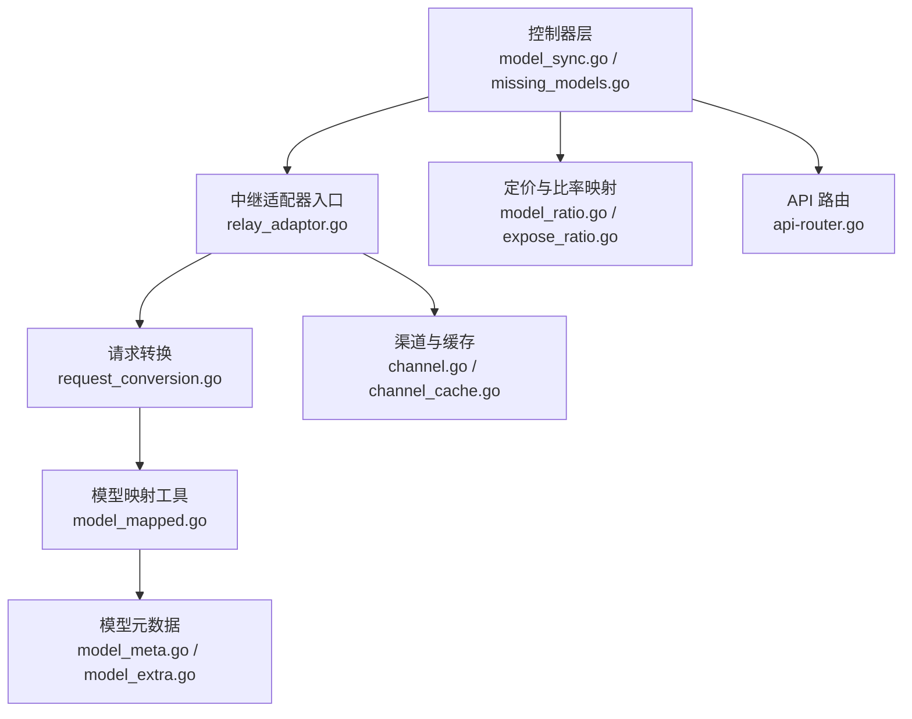
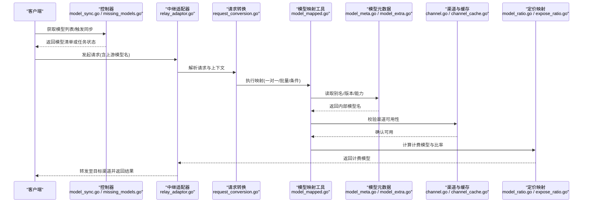
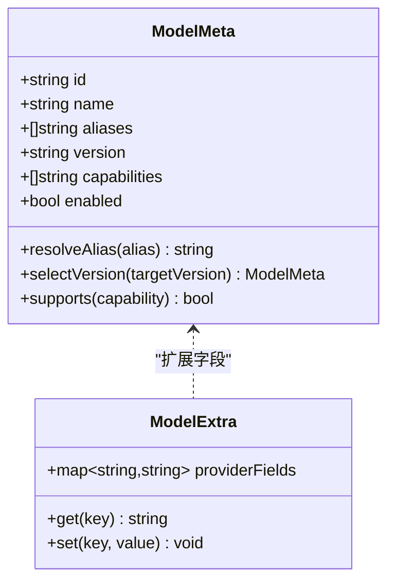
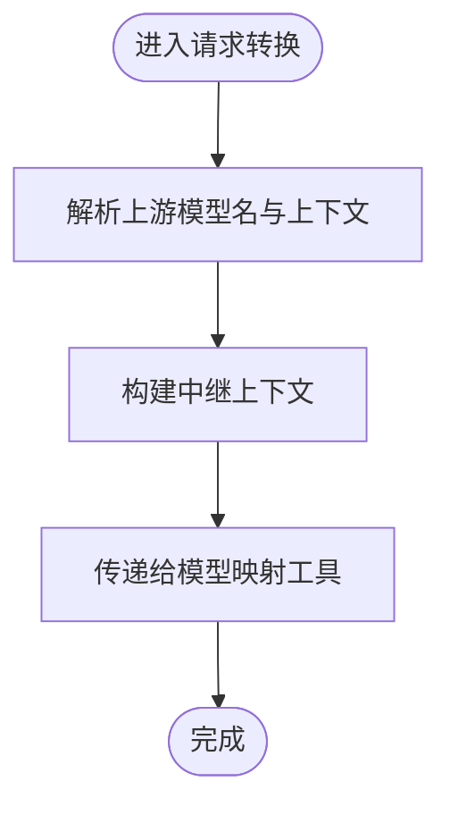
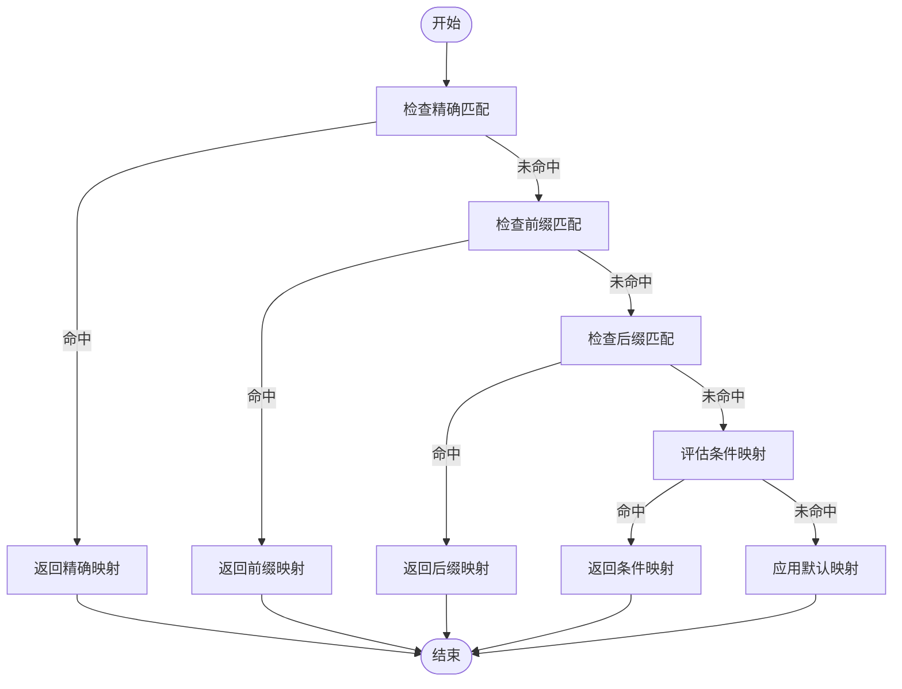
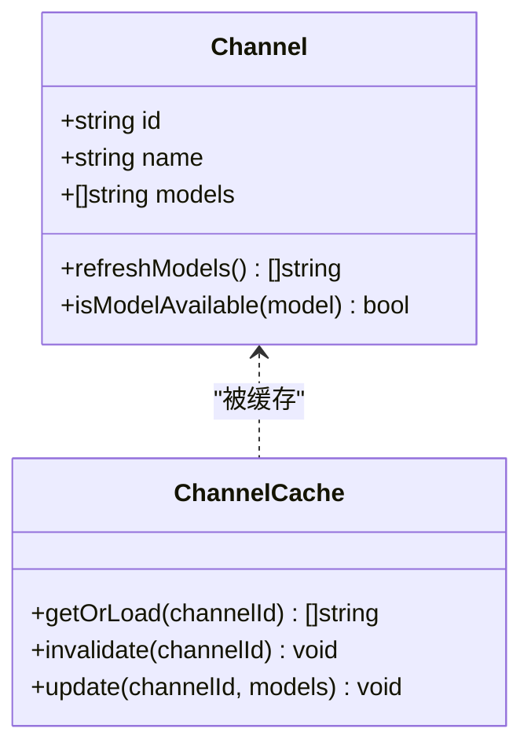
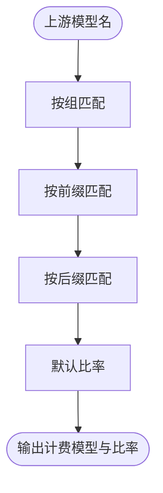
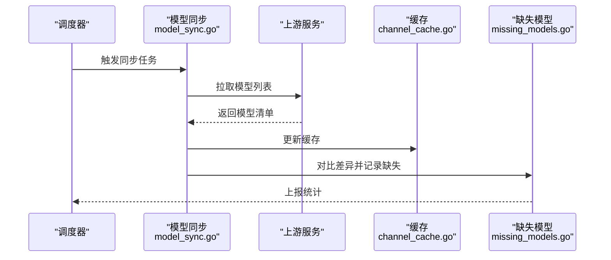
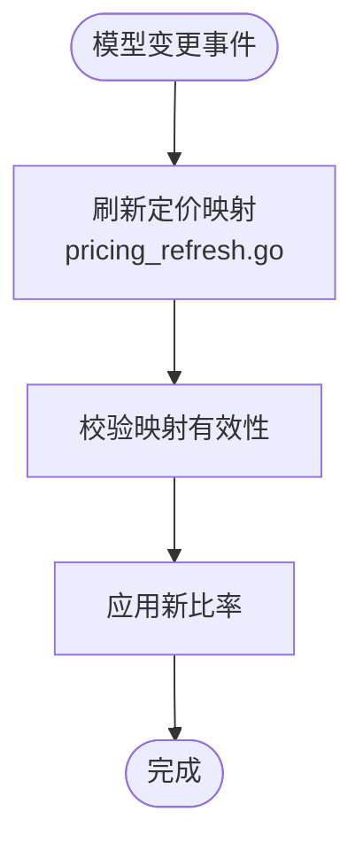
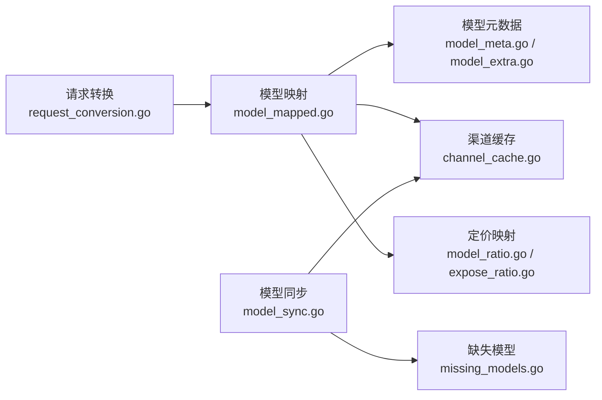

# 模型映射

<cite>
**本文引用的文件**   
- [model.go](file://common/model.go)
- [model_meta.go](file://model/model_meta.go)
- [model_extra.go](file://model/model_extra.go)
- [relay_info.go](file://relay/common/relay_info.go)
- [model_mapped.go](file://relay/helper/model_mapped.go)
- [request_conversion.go](file://relay/common/request_conversion.go)
- [relay_adaptor.go](file://relay/relay_adaptor.go)
- [channel.go](file://model/channel.go)
- [channel_cache.go](file://model/channel_cache.go)
- [api_router.go](file://router/api-router.go)
- [model_list_test.go](file://controller/model_list_test.go)
- [model_sync.go](file://controller/model_sync.go)
- [missing_models.go](file://controller/missing_models.go)
- [pricing_refresh.go](file://model/pricing_refresh.go)
- [ratio_config.go](file://setting/ratio_setting/model_ratio.go)
- [expose_ratio.go](file://setting/ratio_setting/expose_ratio.go)
- [relay_utils.go](file://relay/common/relay_utils.go)
</cite>

## 目录
1. [简介](#简介)
2. [项目结构](#项目结构)
3. [核心组件](#核心组件)
4. [架构总览](#架构总览)
5. [详细组件分析](#详细组件分析)
6. [依赖关系分析](#依赖关系分析)
7. [性能考量](#性能考量)
8. [故障排查指南](#故障排查指南)
9. [结论](#结论)
10. [附录](#附录)

## 简介
本文件面向“模型映射”能力，系统性说明如何将上游模型的名称映射到系统内部模型。内容覆盖：
- 一对一映射、批量映射与条件映射的实现思路与配置方式
- 模型别名配置、版本管理与兼容性处理
- 模型元数据同步、自动发现与更新机制
- 映射规则的执行顺序与优先级
- 来自实际代码库的示例路径与调用链，帮助快速定位实现与扩展点

该文档既适合运维与产品人员理解配置与行为，也适合开发者进行二次开发与问题定位。

## 项目结构
围绕“模型映射”的相关代码主要分布在以下模块：
- common/model.go：通用模型定义与基础能力
- model/model_meta.go、model/model_extra.go：模型元数据与扩展字段
- relay/common/relay_info.go、relay/common/request_conversion.go：请求转换与中继信息
- relay/helper/model_mapped.go：模型映射辅助工具
- relay/relay_adaptor.go：各渠道适配器的统一入口
- model/channel.go、model/channel_cache.go：渠道与缓存
- controller/model_sync.go、controller/missing_models.go：模型同步与缺失模型管理
- setting/ratio_setting/model_ratio.go、setting/ratio_setting/expose_ratio.go：定价与暴露比率的模型映射
- router/api-router.go：API 路由注册（用于对外暴露模型列表与同步接口）

图表来源
- [model_sync.go](file://controller/model_sync.go)
- [missing_models.go](file://controller/missing_models.go)
- [relay_adaptor.go](file://relay/relay_adaptor.go)
- [request_conversion.go](file://relay/common/request_conversion.go)
- [model_mapped.go](file://relay/helper/model_mapped.go)
- [model_meta.go](file://model/model_meta.go)
- [model_extra.go](file://model/model_extra.go)
- [channel.go](file://model/channel.go)
- [channel_cache.go](file://model/channel_cache.go)
- [model_ratio.go](file://setting/ratio_setting/model_ratio.go)
- [expose_ratio.go](file://setting/ratio_setting/expose_ratio.go)
- [api_router.go](file://router/api-router.go)

章节来源
- [model.go](file://common/model.go)
- [model_meta.go](file://model/model_meta.go)
- [model_extra.go](file://model/model_extra.go)
- [relay_info.go](file://relay/common/relay_info.go)
- [model_mapped.go](file://relay/helper/model_mapped.go)
- [request_conversion.go](file://relay/common/request_conversion.go)
- [relay_adaptor.go](file://relay/relay_adaptor.go)
- [channel.go](file://model/channel.go)
- [channel_cache.go](file://model/channel_cache.go)
- [model_ratio.go](file://setting/ratio_setting/model_ratio.go)
- [expose_ratio.go](file://setting/ratio_setting/expose_ratio.go)
- [api_router.go](file://router/api-router.go)

## 核心组件
- 模型元数据与扩展
  - 模型元数据集中管理模型标识、别名、版本、能力标签等，支撑别名解析与兼容性判断
  - 扩展字段用于承载渠道特定信息与运行时动态属性
- 请求转换与中继信息
  - 将上游请求中的模型名转换为系统内部模型名，并携带必要的上下文（如渠道、租户、计费单位）
- 模型映射工具
  - 提供一对一、批量、条件映射的统一入口与执行器
- 渠道与缓存
  - 维护渠道可用模型集合，结合缓存提升查询性能
- 定价与比率映射
  - 将上游模型名映射为内部计费模型，支持按组、前缀、后缀等策略
- API 路由与控制器
  - 暴露模型列表、同步、缺失模型管理等接口，驱动自动发现与更新

章节来源
- [model_meta.go](file://model/model_meta.go)
- [model_extra.go](file://model/model_extra.go)
- [relay_info.go](file://relay/common/relay_info.go)
- [request_conversion.go](file://relay/common/request_conversion.go)
- [model_mapped.go](file://relay/helper/model_mapped.go)
- [channel.go](file://model/channel.go)
- [channel_cache.go](file://model/channel_cache.go)
- [model_ratio.go](file://setting/ratio_setting/model_ratio.go)
- [expose_ratio.go](file://setting/ratio_setting/expose_ratio.go)

## 架构总览
下图展示了从上游请求到内部模型映射的关键流程，以及元数据同步与缓存的作用位置。

图表来源
- [model_sync.go](file://controller/model_sync.go)
- [missing_models.go](file://controller/missing_models.go)
- [relay_adaptor.go](file://relay/relay_adaptor.go)
- [request_conversion.go](file://relay/common/request_conversion.go)
- [model_mapped.go](file://relay/helper/model_mapped.go)
- [model_meta.go](file://model/model_meta.go)
- [model_extra.go](file://model/model_extra.go)
- [channel.go](file://model/channel.go)
- [channel_cache.go](file://model/channel_cache.go)
- [model_ratio.go](file://setting/ratio_setting/model_ratio.go)
- [expose_ratio.go](file://setting/ratio_setting/expose_ratio.go)

## 详细组件分析

### 模型元数据与别名管理
- 职责
  - 维护模型标识、别名、版本、能力标签、兼容信息等
  - 提供别名解析与版本选择逻辑
- 关键点
  - 别名表支持多对一映射，便于上游不同命名统一到内部模型
  - 版本字段用于控制兼容性与灰度发布
  - 能力标签用于过滤渠道是否支持某类功能（文本、图像、音频等）

图表来源
- [model_meta.go](file://model/model_meta.go)
- [model_extra.go](file://model/model_extra.go)

章节来源
- [model_meta.go](file://model/model_meta.go)
- [model_extra.go](file://model/model_extra.go)

### 请求转换与中继信息
- 职责
  - 解析上游请求中的模型名、渠道、租户等信息
  - 构造中继上下文，供后续映射与计费使用
- 关键点
  - 统一入口保证上下文一致性
  - 将上游模型名作为输入传递给映射工具

图表来源
- [request_conversion.go](file://relay/common/request_conversion.go)
- [relay_info.go](file://relay/common/relay_info.go)

章节来源
- [request_conversion.go](file://relay/common/request_conversion.go)
- [relay_info.go](file://relay/common/relay_info.go)

### 模型映射工具（一对一、批量、条件）
- 职责
  - 提供统一的映射执行器，支持：
    - 一对一映射：上游模型名直接映射到内部模型
    - 批量映射：根据规则集批量转换多个模型名
    - 条件映射：基于上下文（渠道、租户、时间、能力）选择映射策略
- 关键点
  - 规则优先级：精确匹配 > 前缀/后缀匹配 > 默认映射
  - 条件分支短路：首个命中即返回，避免多余计算
  - 可插拔：新增映射规则无需改动核心逻辑

图表来源
- [model_mapped.go](file://relay/helper/model_mapped.go)

章节来源
- [model_mapped.go](file://relay/helper/model_mapped.go)

### 渠道与缓存
- 职责
  - 维护渠道可用模型集合，结合缓存加速查询
- 关键点
  - 首次加载后缓存模型列表，减少远程调用
  - 支持失效与增量更新

图表来源
- [channel.go](file://model/channel.go)
- [channel_cache.go](file://model/channel_cache.go)

章节来源
- [channel.go](file://model/channel.go)
- [channel_cache.go](file://model/channel_cache.go)

### 定价与比率映射
- 职责
  - 将上游模型名映射为内部计费模型，支持按组、前缀、后缀等策略
- 关键点
  - 暴露比率用于对外展示与计费换算
  - 与模型映射解耦，但共享模型名解析结果

图表来源
- [model_ratio.go](file://setting/ratio_setting/model_ratio.go)
- [expose_ratio.go](file://setting/ratio_setting/expose_ratio.go)

章节来源
- [model_ratio.go](file://setting/ratio_setting/model_ratio.go)
- [expose_ratio.go](file://setting/ratio_setting/expose_ratio.go)

### 模型同步与自动发现
- 职责
  - 定时或按需拉取上游模型列表，更新本地元数据与缓存
  - 检测缺失模型并上报
- 关键点
  - 支持增量更新与全量刷新
  - 失败重试与降级策略

图表来源
- [model_sync.go](file://controller/model_sync.go)
- [missing_models.go](file://controller/missing_models.go)
- [channel_cache.go](file://model/channel_cache.go)

章节来源
- [model_sync.go](file://controller/model_sync.go)
- [missing_models.go](file://controller/missing_models.go)

### 定价刷新与模型映射联动
- 职责
  - 在模型变更时刷新定价与比率映射，确保计费一致
- 关键点
  - 事件驱动刷新，避免频繁全量计算

图表来源
- [pricing_refresh.go](file://model/pricing_refresh.go)

章节来源
- [pricing_refresh.go](file://model/pricing_refresh.go)

## 依赖关系分析
- 低耦合设计
  - 模型映射工具独立于渠道实现，通过统一接口接入
  - 定价映射与模型映射分离，便于独立演进
- 关键依赖
  - 请求转换依赖中继上下文
  - 模型映射依赖元数据与渠道缓存
  - 同步任务依赖上游服务与缓存

图表来源
- [request_conversion.go](file://relay/common/request_conversion.go)
- [model_mapped.go](file://relay/helper/model_mapped.go)
- [model_meta.go](file://model/model_meta.go)
- [model_extra.go](file://model/model_extra.go)
- [channel_cache.go](file://model/channel_cache.go)
- [model_ratio.go](file://setting/ratio_setting/model_ratio.go)
- [expose_ratio.go](file://setting/ratio_setting/expose_ratio.go)
- [model_sync.go](file://controller/model_sync.go)
- [missing_models.go](file://controller/missing_models.go)

章节来源
- [relay_utils.go](file://relay/common/relay_utils.go)

## 性能考量
- 缓存优先
  - 模型列表与映射结果应缓存，减少重复计算与远程调用
- 规则短路
  - 条件映射采用短路策略，命中即返回，降低复杂度
- 增量更新
  - 同步任务支持增量更新，避免全量刷新带来的开销
- 并发安全
  - 映射与缓存操作需保证线程安全，避免竞态条件

[本节为通用指导，不直接分析具体文件]

## 故障排查指南
- 常见问题
  - 模型名无法映射：检查别名配置与规则优先级
  - 渠道不可用：确认渠道模型缓存是否最新
  - 计费异常：核对定价映射与比率配置
- 定位步骤
  - 查看模型同步日志，确认上游模型列表是否正确拉取
  - 检查缺失模型报告，定位未覆盖的上游模型
  - 验证定价刷新事件是否触发

章节来源
- [model_sync.go](file://controller/model_sync.go)
- [missing_models.go](file://controller/missing_models.go)
- [pricing_refresh.go](file://model/pricing_refresh.go)

## 结论
模型映射是连接上游模型与系统内部模型的核心能力。通过清晰的元数据管理、灵活的映射策略、高效的缓存与同步机制，系统能够稳定地处理一对一、批量与条件映射场景。建议在生产环境中：
- 明确别名与版本策略，确保兼容性
- 定期同步与校验模型列表，及时修复缺失
- 监控定价映射与比率，保障计费准确

[本节为总结性内容，不直接分析具体文件]

## 附录
- 相关测试与示例
  - 模型列表测试：[model_list_test.go](file://controller/model_list_test.go)
  - 中继工具函数：[relay_utils.go](file://relay/common/relay_utils.go)

章节来源
- [model_list_test.go](file://controller/model_list_test.go)
- [relay_utils.go](file://relay/common/relay_utils.go)