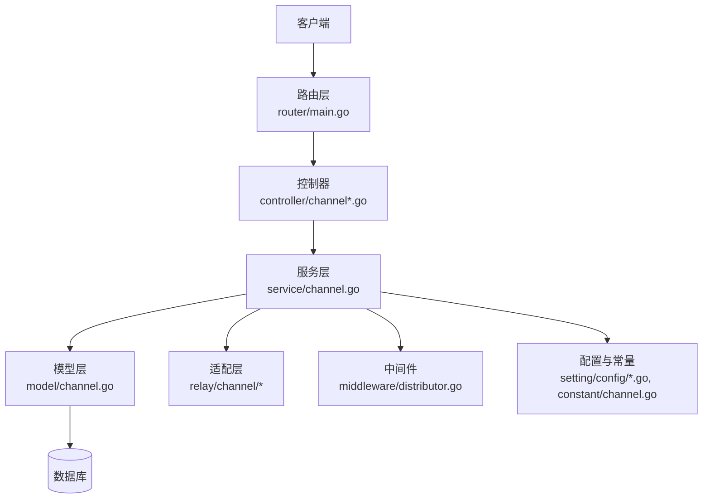
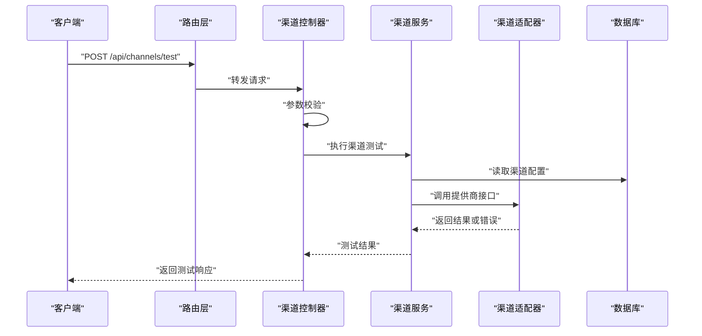
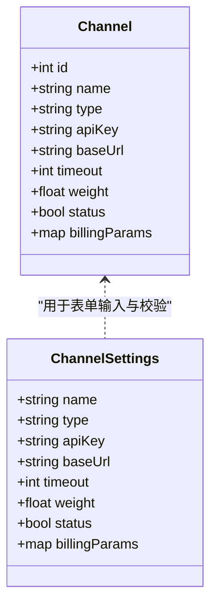
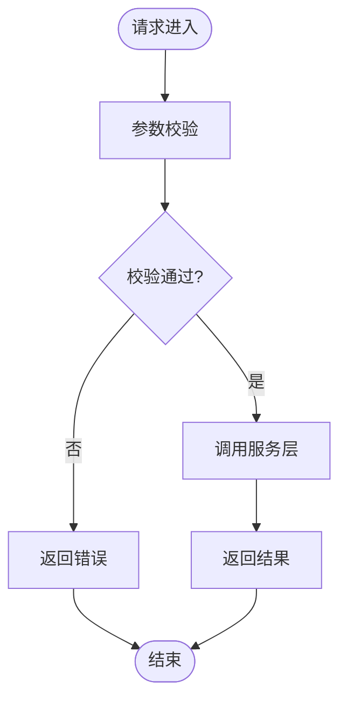
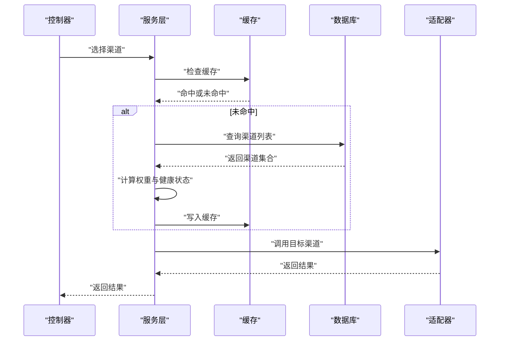
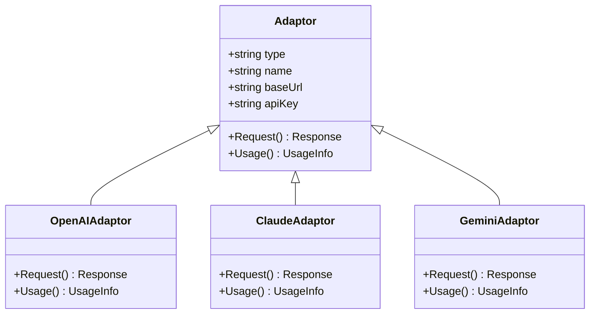
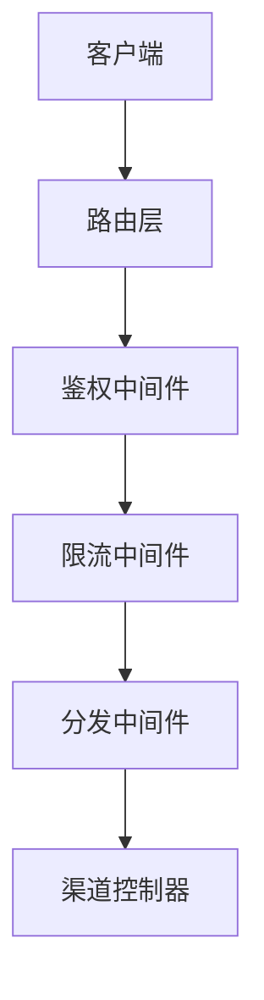
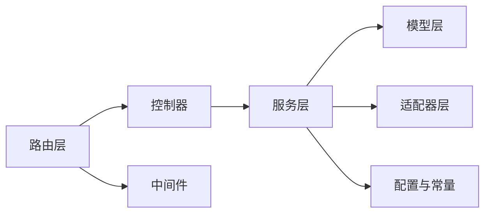

# 渠道配置

<cite>
**本文引用的文件**   
- [main.go](file://main.go)
- [router/main.go](file://router/main.go)
- [controller/channel.go](file://controller/channel.go)
- [controller/channel-billing.go](file://controller/channel-billing.go)
- [controller/channel-test.go](file://controller/channel-test.go)
- [model/channel.go](file://model/channel.go)
- [dto/channel_settings.go](file://dto/channel_settings.go)
- [relay/channel/adapter.go](file://relay/channel/adapter.go)
- [relay/common/relay_info.go](file://relay/common/relay_info.go)
- [service/channel.go](file://service/channel.go)
- [setting/config/config.go](file://setting/config/config.go)
- [constant/channel.go](file://constant/channel.go)
- [common/endpoint_defaults.go](file://common/endpoint_defaults.go)
- [middleware/distributor.go](file://middleware/distributor.go)
</cite>

## 目录
1. [简介](#简介)
2. [项目结构](#项目结构)
3. [核心组件](#核心组件)
4. [架构总览](#架构总览)
5. [详细组件分析](#详细组件分析)
6. [依赖关系分析](#依赖关系分析)
7. [性能考量](#性能考量)
8. [故障排查指南](#故障排查指南)
9. [结论](#结论)
10. [附录：各提供商配置示例与最佳实践](#附录各提供商配置示例与最佳实践)

## 简介
本文件面向“渠道配置系统”，系统性阐述其实现细节、调用关系、接口契约、领域模型与使用模式。文档覆盖以下关键主题：
- 渠道（Channel）的创建、校验、测试、计费与选择策略
- 不同提供商（OpenAI、Claude、Gemini、Azure、Vertex、阿里云、百度等）的API密钥、端点URL、请求限制与计费设置
- 与路由、中间件、服务层、持久化模型的交互流程
- 常见问题定位与解决方案
- 面向初学者的入门指引与面向资深开发者的技术深度说明

## 项目结构
渠道配置相关代码主要分布在以下模块：
- 控制器层：提供HTTP接口，处理渠道CRUD、测试连通性、计费信息获取等
- 模型层：定义渠道实体、字段约束与数据库映射
- DTO层：承载前端表单与接口入参出参的结构体
- 适配层：按不同提供商实现协议转换、鉴权、限流与计费统计
- 服务层：编排业务逻辑，如渠道选择、缓存、配额、计费结算
- 路由与中间件：注册路由、分发请求、鉴权、限流、审计
- 配置与常量：全局配置项、默认端点、渠道类型枚举等

图表来源
- [router/main.go:1-200](file://router/main.go#L1-L200)
- [controller/channel.go:1-300](file://controller/channel.go#L1-L300)
- [service/channel.go:1-300](file://service/channel.go#L1-L300)
- [model/channel.go:1-200](file://model/channel.go#L1-L200)
- [relay/channel/adapter.go:1-200](file://relay/channel/adapter.go#L1-L200)
- [middleware/distributor.go:1-200](file://middleware/distributor.go#L1-L200)
- [setting/config/config.go:1-200](file://setting/config/config.go#L1-L200)
- [constant/channel.go:1-100](file://constant/channel.go#L1-L100)

章节来源
- [router/main.go:1-200](file://router/main.go#L1-L200)
- [controller/channel.go:1-300](file://controller/channel.go#L1-L300)
- [service/channel.go:1-300](file://service/channel.go#L1-L300)
- [model/channel.go:1-200](file://model/channel.go#L1-L200)
- [relay/channel/adapter.go:1-200](file://relay/channel/adapter.go#L1-L200)
- [middleware/distributor.go:1-200](file://middleware/distributor.go#L1-L200)
- [setting/config/config.go:1-200](file://setting/config/config.go#L1-L200)
- [constant/channel.go:1-100](file://constant/channel.go#L1-L100)

## 核心组件
- 渠道模型（Channel）：描述一个外部提供商的连接与行为，包括类型、名称、密钥、基础URL、超时、权重、状态、计费参数等
- 渠道设置DTO（ChannelSettings）：用于前端表单提交与接口校验的参数结构
- 渠道适配器（Adaptor）：针对不同提供商的具体实现，负责请求构造、响应解析、错误映射、用量统计
- 渠道服务（ChannelService）：编排渠道生命周期管理、选择策略、缓存、配额与计费
- 渠道控制器（ChannelController）：暴露REST接口，处理渠道增删改查、测试连通性、计费查询
- 路由与中间件：注册渠道相关路由，并在请求进入时进行鉴权、限流、审计与分发

章节来源
- [model/channel.go:1-200](file://model/channel.go#L1-L200)
- [dto/channel_settings.go:1-200](file://dto/channel_settings.go#L1-L200)
- [relay/channel/adapter.go:1-200](file://relay/channel/adapter.go#L1-L200)
- [service/channel.go:1-300](file://service/channel.go#L1-L300)
- [controller/channel.go:1-300](file://controller/channel.go#L1-L300)
- [router/main.go:1-200](file://router/main.go#L1-L200)
- [middleware/distributor.go:1-200](file://middleware/distributor.go#L1-L200)

## 架构总览
渠道配置系统的整体架构遵循分层设计：
- 路由层：统一入口，注册渠道相关API
- 控制器层：接收请求，参数校验，调用服务层
- 服务层：业务编排，包含渠道选择、缓存、配额、计费、重试等
- 适配层：按提供商实现具体协议与鉴权
- 模型层：数据持久化与校验
- 配置与常量：集中管理全局配置、默认值与枚举

图表来源
- [router/main.go:1-200](file://router/main.go#L1-L200)
- [controller/channel.go:1-300](file://controller/channel.go#L1-L300)
- [service/channel.go:1-300](file://service/channel.go#L1-L300)
- [relay/channel/adapter.go:1-200](file://relay/channel/adapter.go#L1-L200)
- [model/channel.go:1-200](file://model/channel.go#L1-L200)

## 详细组件分析

### 渠道模型与设置
- 渠道模型定义了渠道的核心属性，包括类型、名称、密钥、基础URL、超时、权重、状态、计费参数等
- 渠道设置DTO用于前端表单提交与接口校验，确保必填字段、格式与范围正确

图表来源
- [model/channel.go:1-200](file://model/channel.go#L1-L200)
- [dto/channel_settings.go:1-200](file://dto/channel_settings.go#L1-L200)

章节来源
- [model/channel.go:1-200](file://model/channel.go#L1-L200)
- [dto/channel_settings.go:1-200](file://dto/channel_settings.go#L1-L200)

### 渠道控制器接口
- 提供渠道CRUD、测试连通性、计费信息查询等REST接口
- 典型接口包括：创建渠道、更新渠道、删除渠道、测试连通性、获取计费信息等
- 参数校验由控制器完成，错误信息标准化返回

图表来源
- [controller/channel.go:1-300](file://controller/channel.go#L1-L300)
- [controller/channel-test.go:1-200](file://controller/channel-test.go#L1-L200)
- [controller/channel-billing.go:1-200](file://controller/channel-billing.go#L1-L200)

章节来源
- [controller/channel.go:1-300](file://controller/channel.go#L1-L300)
- [controller/channel-test.go:1-200](file://controller/channel-test.go#L1-L200)
- [controller/channel-billing.go:1-200](file://controller/channel-billing.go#L1-L200)

### 渠道服务与选择策略
- 服务层负责渠道的生命周期管理、选择策略、缓存、配额与计费
- 选择策略支持基于权重、健康状态、配额剩余等维度动态选择
- 缓存层提升热点渠道配置的读取性能

图表来源
- [service/channel.go:1-300](file://service/channel.go#L1-L300)
- [relay/common/relay_info.go:1-200](file://relay/common/relay_info.go#L1-L200)

章节来源
- [service/channel.go:1-300](file://service/channel.go#L1-L300)
- [relay/common/relay_info.go:1-200](file://relay/common/relay_info.go#L1-L200)

### 渠道适配器与提供商实现
- 适配器层按不同提供商实现具体协议、鉴权、限流与计费统计
- 每个提供商有独立的常量、DTO与中继逻辑
- 适配器需实现统一的接口，便于服务层无差别调用

图表来源
- [relay/channel/adapter.go:1-200](file://relay/channel/adapter.go#L1-L200)
- [relay/channel/openai/adaptor.go:1-200](file://relay/channel/openai/adaptor.go#L1-L200)
- [relay/channel/claude/adaptor.go:1-200](file://relay/channel/claude/adaptor.go#L1-L200)
- [relay/channel/gemini/adaptor.go:1-200](file://relay/channel/gemini/adaptor.go#L1-L200)

章节来源
- [relay/channel/adapter.go:1-200](file://relay/channel/adapter.go#L1-L200)
- [relay/channel/openai/adaptor.go:1-200](file://relay/channel/openai/adaptor.go#L1-L200)
- [relay/channel/claude/adaptor.go:1-200](file://relay/channel/claude/adaptor.go#L1-L200)
- [relay/channel/gemini/adaptor.go:1-200](file://relay/channel/gemini/adaptor.go#L1-L200)

### 路由与中间件集成
- 路由层注册渠道相关API，中间件负责鉴权、限流、审计与分发
- 分发中间件根据请求元数据选择目标渠道
- 限流中间件保护上游提供商接口不被滥用

图表来源
- [router/main.go:1-200](file://router/main.go#L1-L200)
- [middleware/distributor.go:1-200](file://middleware/distributor.go#L1-L200)

章节来源
- [router/main.go:1-200](file://router/main.go#L1-L200)
- [middleware/distributor.go:1-200](file://middleware/distributor.go#L1-L200)

## 依赖关系分析
渠道配置系统的关键依赖关系如下：
- 控制器依赖服务层进行业务编排
- 服务层依赖模型层进行数据持久化
- 服务层依赖适配器层进行提供商调用
- 路由层依赖中间件进行通用功能增强
- 配置与常量被多处引用，确保一致性

图表来源
- [controller/channel.go:1-300](file://controller/channel.go#L1-L300)
- [service/channel.go:1-300](file://service/channel.go#L1-L300)
- [model/channel.go:1-200](file://model/channel.go#L1-L200)
- [relay/channel/adapter.go:1-200](file://relay/channel/adapter.go#L1-L200)
- [router/main.go:1-200](file://router/main.go#L1-L200)
- [middleware/distributor.go:1-200](file://middleware/distributor.go#L1-L200)
- [setting/config/config.go:1-200](file://setting/config/config.go#L1-L200)

章节来源
- [controller/channel.go:1-300](file://controller/channel.go#L1-L300)
- [service/channel.go:1-300](file://service/channel.go#L1-L300)
- [model/channel.go:1-200](file://model/channel.go#L1-L200)
- [relay/channel/adapter.go:1-200](file://relay/channel/adapter.go#L1-L200)
- [router/main.go:1-200](file://router/main.go#L1-L200)
- [middleware/distributor.go:1-200](file://middleware/distributor.go#L1-L200)
- [setting/config/config.go:1-200](file://setting/config/config.go#L1-L200)

## 性能考量
- 缓存热点渠道配置，减少数据库压力
- 合理设置超时与重试策略，避免上游阻塞
- 使用连接池与并发控制，提升吞吐量
- 监控与指标收集，及时发现瓶颈

## 故障排查指南
- 连通性测试失败：检查API密钥、基础URL、网络可达性与防火墙规则
- 计费信息为空：确认提供商是否启用计费统计，检查适配器是否正确解析用量
- 选择策略异常：检查权重、健康状态与配额剩余配置
- 限流触发：调整限流阈值或增加渠道数量

章节来源
- [controller/channel-test.go:1-200](file://controller/channel-test.go#L1-L200)
- [controller/channel-billing.go:1-200](file://controller/channel-billing.go#L1-L200)
- [service/channel.go:1-300](file://service/channel.go#L1-L300)

## 结论
渠道配置系统通过分层架构与适配器模式，实现了对多提供商的统一接入与管理。通过灵活的配置选项、健壮的容错机制与完善的监控体系，为上层应用提供了稳定可靠的渠道服务能力。

## 附录：各提供商配置示例与最佳实践
以下为常见提供商的配置要点与最佳实践，帮助快速上手与优化使用：

- OpenAI
  - API密钥：在渠道设置中填写有效的OpenAI密钥
  - 基础URL：默认官方端点，如需代理可自定义
  - 请求限制：根据账户等级设置合理的超时与重试
  - 计费设置：开启用量统计，确保账单准确

- Claude
  - API密钥：填写Anthropic提供的密钥
  - 基础URL：默认端点，企业用户可配置私有端点
  - 请求限制：注意速率限制，合理设置并发
  - 计费设置：启用用量采集，核对账单

- Gemini
  - API密钥：Google Cloud API密钥
  - 基础URL：默认端点，可按区域配置
  - 请求限制：注意配额与速率限制
  - 计费设置：启用用量统计，监控成本

- Azure OpenAI
  - API密钥：Azure门户生成的密钥
  - 基础URL：包含部署名与版本信息的完整端点
  - 请求限制：根据订阅级别设置限制
  - 计费设置：启用用量跟踪，核对账单

- Vertex AI
  - 认证方式：服务账号JSON或应用默认凭据
  - 基础URL：按区域配置的端点
  - 请求限制：根据项目配额设置
  - 计费设置：启用用量采集，监控成本

- 阿里云通义千问
  - API密钥：阿里云控制台生成
  - 基础URL：默认端点，可按地域配置
  - 请求限制：根据账户等级设置
  - 计费设置：启用用量统计，核对账单

- 百度文心一言
  - API密钥：百度智能云控制台生成
  - 基础URL：默认端点
  - 请求限制：根据账户等级设置
  - 计费设置：启用用量统计，核对账单

最佳实践建议：
- 多渠道冗余：为关键提供商配置多个渠道，提高可用性
- 权重分配：根据成本与性能动态调整权重
- 健康检查：定期测试渠道连通性，自动剔除故障节点
- 监控告警：设置关键指标告警，及时发现异常
- 成本控制：设置预算上限，防止意外高额费用

章节来源
- [constant/channel.go:1-100](file://constant/channel.go#L1-L100)
- [common/endpoint_defaults.go:1-100](file://common/endpoint_defaults.go#L1-L100)
- [setting/config/config.go:1-200](file://setting/config/config.go#L1-L200)