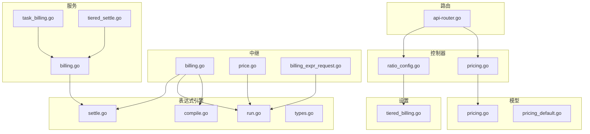
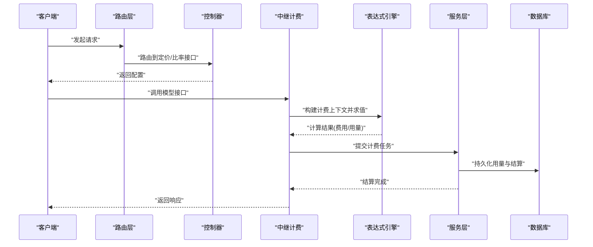
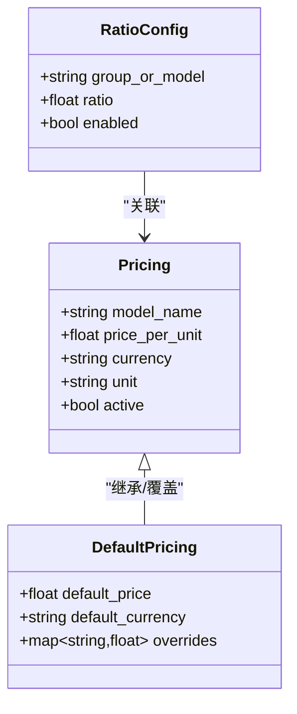
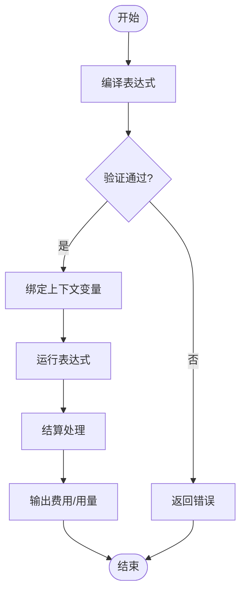
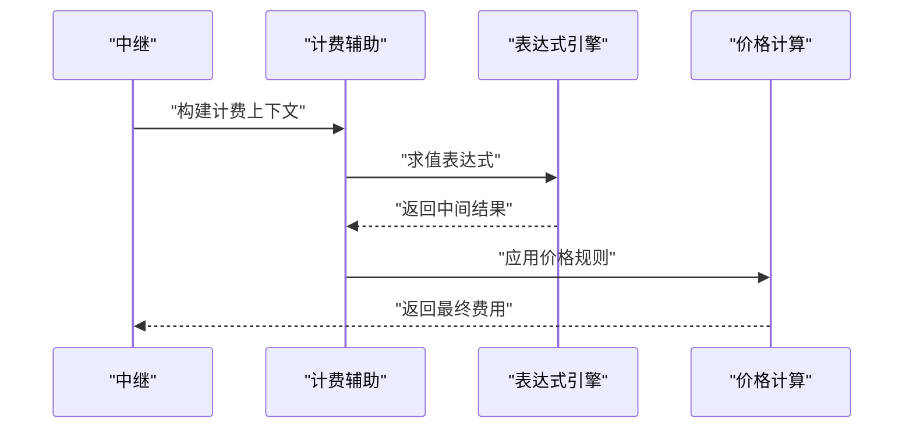
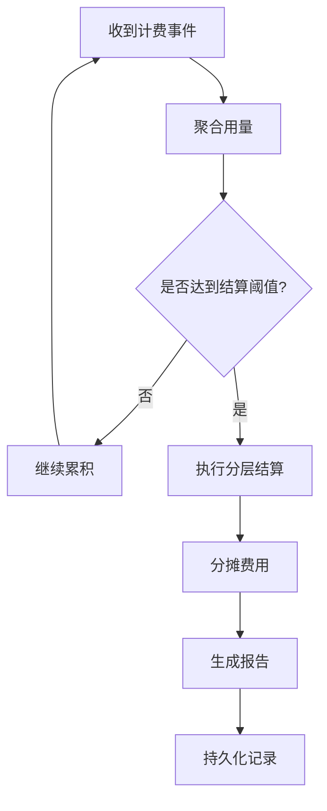
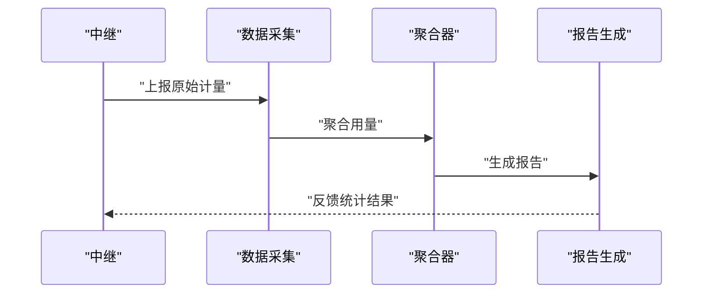
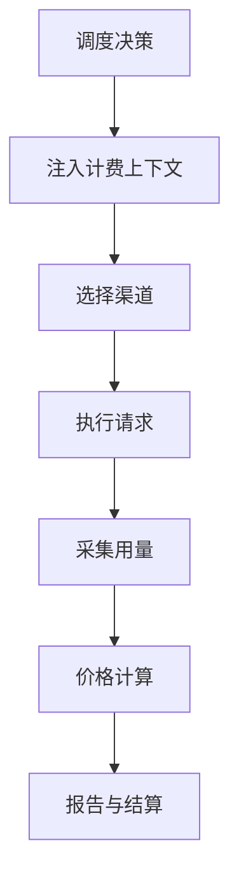
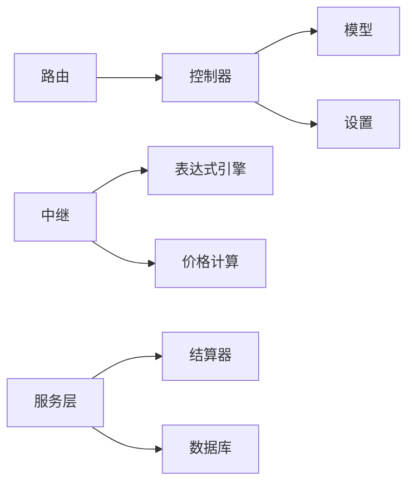

# 计费配置

<cite>
**本文档引用的文件**   
- [controller/pricing.go](file://controller/pricing.go)
- [controller/ratio_config.go](file://controller/ratio_config.go)
- [dto/pricing.go](file://dto/pricing.go)
- [model/pricing.go](file://model/pricing.go)
- [model/pricing_default.go](file://model/pricing_default.go)
- [setting/billing_setting/tiered_billing.go](file://setting/billing_setting/tiered_billing.go)
- [pkg/billingexpr/compile.go](file://pkg/billingexpr/compile.go)
- [pkg/billingexpr/run.go](file://pkg/billingexpr/run.go)
- [pkg/billingexpr/settle.go](file://pkg/billingexpr/settle.go)
- [pkg/billingexpr/types.go](file://pkg/billingexpr/types.go)
- [relay/common/billing.go](file://relay/common/billing.go)
- [relay/helper/price.go](file://relay/helper/price.go)
- [relay/helper/billing_expr_request.go](file://relay/helper/billing_expr_request.go)
- [service/billing.go](file://service/billing.go)
- [service/task_billing.go](file://service/task_billing.go)
- [service/tiered_settle.go](file://service/tiered_settle.go)
- [middleware/distributor.go](file://middleware/distributor.go)
- [router/api-router.go](file://router/api-router.go)
</cite>

## 目录
1. [简介](#简介)
2. [项目结构](#项目结构)
3. [核心组件](#核心组件)
4. [架构总览](#架构总览)
5. [详细组件分析](#详细组件分析)
6. [依赖关系分析](#依赖关系分析)
7. [性能考虑](#性能考虑)
8. [故障排查指南](#故障排查指南)
9. [结论](#结论)
10. [附录](#附录)

## 简介
本文件面向渠道计费配置，系统性说明如何为不同模型配置计费比率、价格计算规则与费用分摊策略；覆盖按 token、按请求、按时间等多种计费模式的配置方法；结合代码库中的实际实现，给出复杂计费场景的配置示例与最佳实践；并解释计费数据的采集、计算与报告流程，以及计费配置与渠道调度的联动关系。

## 项目结构
计费相关能力横跨控制器、数据模型、设置项、表达式引擎、中继计费辅助与服务层任务处理等模块：
- 控制器层：提供定价与比率配置的 API（如定价、比率同步等）
- 数据模型层：定义定价、默认定价、使用量等数据结构
- 设置层：分层计费、比率缓存与暴露等配置
- 表达式引擎：编译与运行计费表达式、结算逻辑
- 中继层：计费数据采集、价格计算、表达式求值
- 服务层：计费任务、分层结算、用量聚合与上报
- 路由层：API 路由注册

图表来源
- [controller/pricing.go](file://controller/pricing.go)
- [controller/ratio_config.go](file://controller/ratio_config.go)
- [model/pricing.go](file://model/pricing.go)
- [model/pricing_default.go](file://model/pricing_default.go)
- [setting/billing_setting/tiered_billing.go](file://setting/billing_setting/tiered_billing.go)
- [pkg/billingexpr/compile.go](file://pkg/billingexpr/compile.go)
- [pkg/billingexpr/run.go](file://pkg/billingexpr/run.go)
- [pkg/billingexpr/settle.go](file://pkg/billingexpr/settle.go)
- [pkg/billingexpr/types.go](file://pkg/billingexpr/types.go)
- [relay/common/billing.go](file://relay/common/billing.go)
- [relay/helper/price.go](file://relay/helper/price.go)
- [relay/helper/billing_expr_request.go](file://relay/helper/billing_expr_request.go)
- [service/billing.go](file://service/billing.go)
- [service/task_billing.go](file://service/task_billing.go)
- [service/tiered_settle.go](file://service/tiered_settle.go)
- [router/api-router.go](file://router/api-router.go)

章节来源
- [controller/pricing.go](file://controller/pricing.go)
- [controller/ratio_config.go](file://controller/ratio_config.go)
- [model/pricing.go](file://model/pricing.go)
- [model/pricing_default.go](file://model/pricing_default.go)
- [setting/billing_setting/tiered_billing.go](file://setting/billing_setting/tiered_billing.go)
- [pkg/billingexpr/compile.go](file://pkg/billingexpr/compile.go)
- [pkg/billingexpr/run.go](file://pkg/billingexpr/run.go)
- [pkg/billingexpr/settle.go](file://pkg/billingexpr/settle.go)
- [pkg/billingexpr/types.go](file://pkg/billingexpr/types.go)
- [relay/common/billing.go](file://relay/common/billing.go)
- [relay/helper/price.go](file://relay/helper/price.go)
- [relay/helper/billing_expr_request.go](file://relay/helper/billing_expr_request.go)
- [service/billing.go](file://service/billing.go)
- [service/task_billing.go](file://service/task_billing.go)
- [service/tiered_settle.go](file://service/tiered_settle.go)
- [router/api-router.go](file://router/api-router.go)

## 核心组件
- 定价与比率配置
  - 定价模型与默认定价：用于存储模型维度的单价、币种、单位换算等基础信息
  - 比率配置与同步：支持按模型或组别配置比率，便于统一对外展示与内部折算
- 计费表达式引擎
  - 表达式编译与运行：将用户定义的计费公式编译为可执行形式，并在请求上下文中求值
  - 结算器：根据表达式结果进行四舍五入、封顶、保底等结算处理
- 中继计费辅助
  - 计费上下文构建：从请求中提取 token、请求次数、时长等指标
  - 价格计算：基于表达式与上下文计算最终费用
- 服务层任务
  - 计费任务：异步处理用量聚合、结算与上报
  - 分层结算：支持阶梯式计费与费用分摊
- 调度联动
  - 渠道选择与计费策略联动：在分发阶段注入计费上下文，影响后续计费与报告

章节来源
- [model/pricing.go](file://model/pricing.go)
- [model/pricing_default.go](file://model/pricing_default.go)
- [controller/ratio_config.go](file://controller/ratio_config.go)
- [pkg/billingexpr/compile.go](file://pkg/billingexpr/compile.go)
- [pkg/billingexpr/run.go](file://pkg/billingexpr/run.go)
- [pkg/billingexpr/settle.go](file://pkg/billingexpr/settle.go)
- [relay/helper/price.go](file://relay/helper/price.go)
- [relay/helper/billing_expr_request.go](file://relay/helper/billing_expr_request.go)
- [service/task_billing.go](file://service/task_billing.go)
- [service/tiered_settle.go](file://service/tiered_settle.go)
- [middleware/distributor.go](file://middleware/distributor.go)

## 架构总览
计费系统以“表达式驱动”为核心，通过中继层采集请求上下文，由表达式引擎计算费用，再由服务层完成结算与上报。控制器提供配置入口，设置层管理分层计费策略，路由层暴露 API。

图表来源
- [router/api-router.go](file://router/api-router.go)
- [controller/pricing.go](file://controller/pricing.go)
- [relay/common/billing.go](file://relay/common/billing.go)
- [pkg/billingexpr/compile.go](file://pkg/billingexpr/compile.go)
- [pkg/billingexpr/run.go](file://pkg/billingexpr/run.go)
- [service/task_billing.go](file://service/task_billing.go)
- [service/billing.go](file://service/billing.go)

## 详细组件分析

### 定价与比率配置
- 定价模型
  - 字段维度：模型名、单价、币种、单位换算、生效范围等
  - 默认定价：提供全局默认值与覆盖机制
- 比率配置
  - 按模型/组别配置比率，支持缓存与暴露给前端展示
  - 比率同步：批量更新与一致性校验

图表来源
- [model/pricing.go](file://model/pricing.go)
- [model/pricing_default.go](file://model/pricing_default.go)
- [controller/ratio_config.go](file://controller/ratio_config.go)

章节来源
- [model/pricing.go](file://model/pricing.go)
- [model/pricing_default.go](file://model/pricing_default.go)
- [controller/ratio_config.go](file://controller/ratio_config.go)

### 计费表达式引擎
- 表达式编译
  - 将文本表达式编译为可执行对象，支持变量绑定与函数扩展
- 表达式运行
  - 在请求上下文中求值，输出费用、用量、折扣等中间结果
- 结算器
  - 对求值结果进行四舍五入、封顶、保底、取整等处理

图表来源
- [pkg/billingexpr/compile.go](file://pkg/billingexpr/compile.go)
- [pkg/billingexpr/run.go](file://pkg/billingexpr/run.go)
- [pkg/billingexpr/settle.go](file://pkg/billingexpr/settle.go)
- [pkg/billingexpr/types.go](file://pkg/billingexpr/types.go)

章节来源
- [pkg/billingexpr/compile.go](file://pkg/billingexpr/compile.go)
- [pkg/billingexpr/run.go](file://pkg/billingexpr/run.go)
- [pkg/billingexpr/settle.go](file://pkg/billingexpr/settle.go)
- [pkg/billingexpr/types.go](file://pkg/billingexpr/types.go)

### 中继计费辅助
- 计费上下文构建
  - 从请求中提取 token 数、请求次数、流式时长、图像尺寸等指标
- 价格计算
  - 基于表达式与上下文计算最终费用，支持多模式组合

图表来源
- [relay/helper/billing_expr_request.go](file://relay/helper/billing_expr_request.go)
- [relay/helper/price.go](file://relay/helper/price.go)
- [pkg/billingexpr/run.go](file://pkg/billingexpr/run.go)

章节来源
- [relay/helper/billing_expr_request.go](file://relay/helper/billing_expr_request.go)
- [relay/helper/price.go](file://relay/helper/price.go)
- [relay/common/billing.go](file://relay/common/billing.go)

### 服务层计费任务与分层结算
- 计费任务
  - 异步聚合用量、触发结算、生成报告
- 分层结算
  - 支持阶梯式计费与费用分摊，适用于高并发与多租户场景

图表来源
- [service/task_billing.go](file://service/task_billing.go)
- [service/tiered_settle.go](file://service/tiered_settle.go)
- [service/billing.go](file://service/billing.go)

章节来源
- [service/task_billing.go](file://service/task_billing.go)
- [service/tiered_settle.go](file://service/tiered_settle.go)
- [service/billing.go](file://service/billing.go)

### 计费数据流与报告
- 数据采集
  - 在中继层捕获请求与响应元数据，包括 token、时长、状态码等
- 计算与结算
  - 表达式求值后进入服务层进行聚合与结算
- 报告生成
  - 按日/周/月维度生成用量与费用报告，支持导出与可视化

图表来源
- [relay/common/billing.go](file://relay/common/billing.go)
- [service/billing.go](file://service/billing.go)

章节来源
- [relay/common/billing.go](file://relay/common/billing.go)
- [service/billing.go](file://service/billing.go)

### 计费配置与渠道调度关系
- 调度注入
  - 在渠道分发阶段注入计费上下文，确保后续计费与报告一致
- 策略联动
  - 根据模型与渠道的定价策略动态调整分发权重与回退策略

图表来源
- [middleware/distributor.go](file://middleware/distributor.go)
- [relay/common/billing.go](file://relay/common/billing.go)

章节来源
- [middleware/distributor.go](file://middleware/distributor.go)
- [relay/common/billing.go](file://relay/common/billing.go)

## 依赖关系分析
- 控制器依赖模型与设置，提供配置 API
- 中继依赖表达式引擎与价格计算辅助
- 服务层依赖表达式结算与数据库持久化
- 路由层统一注册 API 端点

图表来源
- [controller/pricing.go](file://controller/pricing.go)
- [model/pricing.go](file://model/pricing.go)
- [setting/billing_setting/tiered_billing.go](file://setting/billing_setting/tiered_billing.go)
- [relay/common/billing.go](file://relay/common/billing.go)
- [pkg/billingexpr/compile.go](file://pkg/billingexpr/compile.go)
- [pkg/billingexpr/settle.go](file://pkg/billingexpr/settle.go)
- [service/billing.go](file://service/billing.go)
- [router/api-router.go](file://router/api-router.go)

章节来源
- [controller/pricing.go](file://controller/pricing.go)
- [model/pricing.go](file://model/pricing.go)
- [setting/billing_setting/tiered_billing.go](file://setting/billing_setting/tiered_billing.go)
- [relay/common/billing.go](file://relay/common/billing.go)
- [pkg/billingexpr/compile.go](file://pkg/billingexpr/compile.go)
- [pkg/billingexpr/settle.go](file://pkg/billingexpr/settle.go)
- [service/billing.go](file://service/billing.go)
- [router/api-router.go](file://router/api-router.go)

## 性能考虑
- 表达式编译缓存：避免重复编译，提升求值性能
- 上下文复用：在中继层复用计费上下文，减少对象分配
- 异步结算：将结算与报告生成放入后台任务，降低主链路延迟
- 分层结算批处理：批量聚合用量，减少数据库写入频率

[本节为通用指导，不直接分析具体文件]

## 故障排查指南
- 表达式求值失败
  - 检查表达式语法与变量绑定是否正确
  - 查看日志中表达式编译与运行阶段的错误信息
- 价格计算异常
  - 确认上下文中的 token、时长等指标是否完整
  - 检查价格规则与单位换算配置
- 结算与报告不一致
  - 核对聚合阈值与批处理窗口
  - 检查分层结算策略与分摊比例

章节来源
- [pkg/billingexpr/compile.go](file://pkg/billingexpr/compile.go)
- [pkg/billingexpr/run.go](file://pkg/billingexpr/run.go)
- [relay/helper/price.go](file://relay/helper/price.go)
- [service/tiered_settle.go](file://service/tiered_settle.go)

## 结论
本计费配置体系以表达式为核心，结合中继采集、服务层结算与报告，形成端到端的计费闭环。通过灵活的定价与比率配置、多种计费模式支持与分层结算策略，能够满足复杂业务场景的需求。建议在生产环境中启用表达式编译缓存、异步结算与监控告警，以提升稳定性与可观测性。

[本节为总结性内容，不直接分析具体文件]

## 附录
- 常见计费模式配置要点
  - 按 token：确保 token 计数准确，单位换算合理
  - 按请求：明确请求边界与重试策略
  - 按时间：精确采集时长，处理流式与非流式差异
- 复杂场景示例
  - 多模型混合计费：按模型分组配置比率与默认定价
  - 阶梯计费：设置阈值区间与对应单价，启用分层结算
  - 费用分摊：在多租户或多渠道场景下按比例分摊

[本节为概念性内容，不直接分析具体文件]