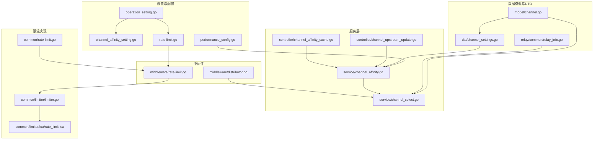
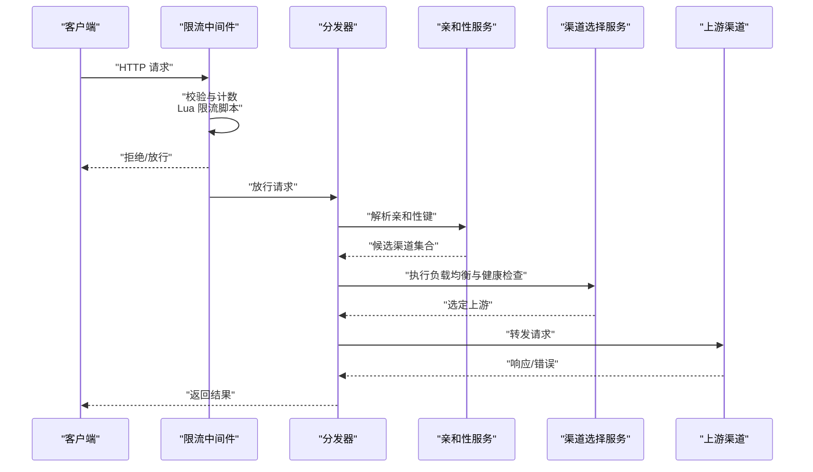
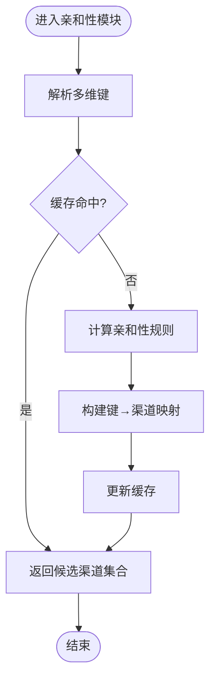
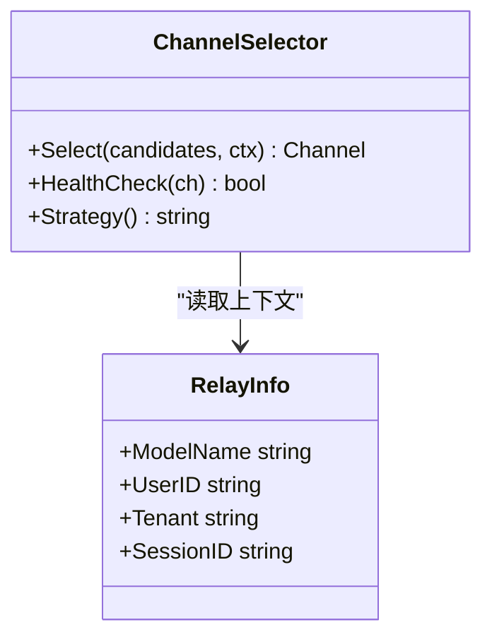
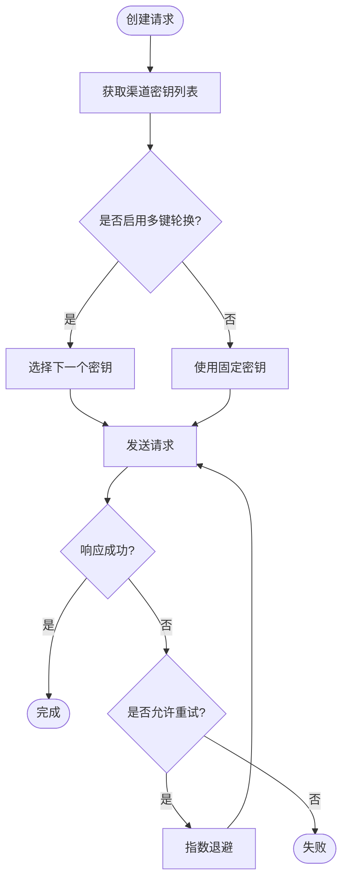
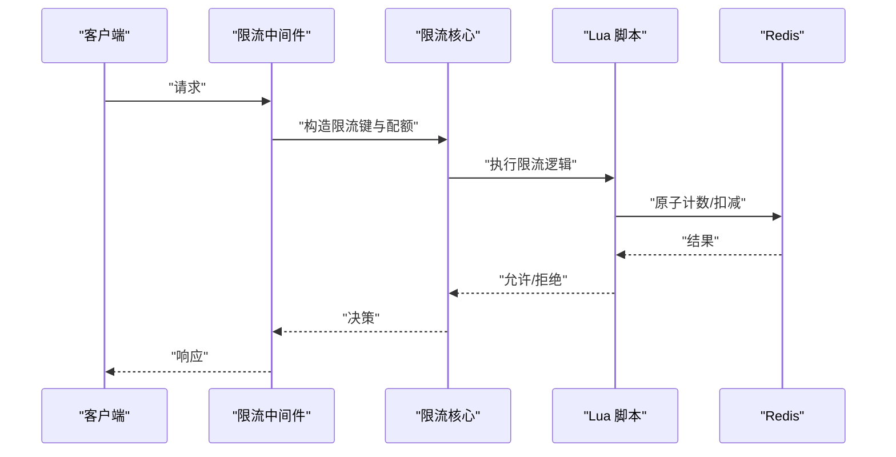
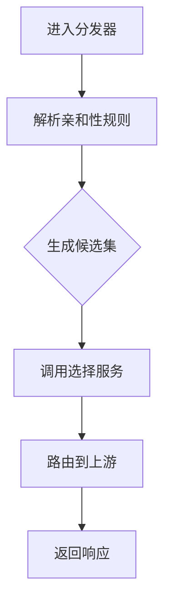
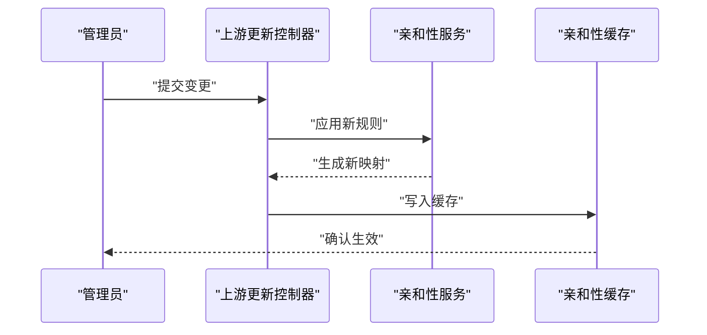
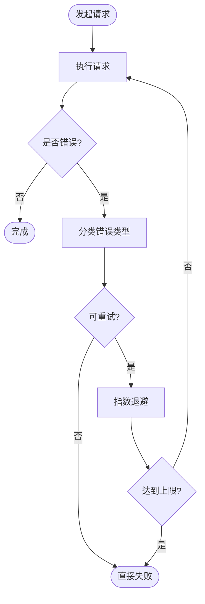
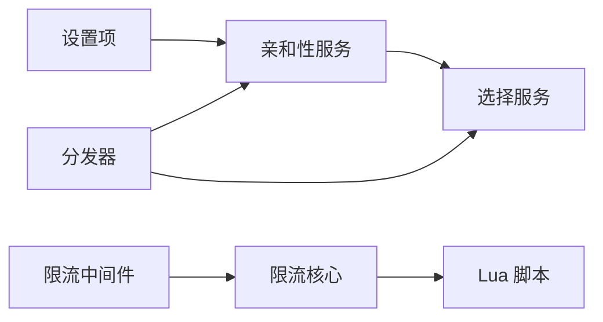

# 高级设置

<cite>
**本文引用的文件**   
- [channel_affinity.go](file://service/channel_affinity.go)
- [channel_select.go](file://service/channel_select.go)
- [channel_settings.go](file://dto/channel_settings.go)
- [channel.go](file://model/channel.go)
- [operation_setting.go](file://setting/operation_setting/operation_setting.go)
- [channel_affinity_setting.go](file://setting/operation_setting/channel_affinity_setting.go)
- [performance_config.go](file://common/performance_config.go)
- [rate-limit.go](file://common/rate-limit.go)
- [limiter.go](file://common/limiter/limiter.go)
- [rate_limit.lua](file://common/limiter/lua/rate_limit.lua)
- [distributor.go](file://middleware/distributor.go)
- [rate-limit.go](file://middleware/rate-limit.go)
- [channel_test_internal_test.go](file://controller/channel_test_internal_test.go)
- [channel_upstream_update.go](file://controller/channel_upstream_update.go)
- [channel_affinity_cache.go](file://controller/channel_affinity_cache.go)
- [relay_info.go](file://relay/common/relay_info.go)
- [error.go](file://types/error.go)
</cite>

## 目录
1. [简介](#简介)
2. [项目结构](#项目结构)
3. [核心组件](#核心组件)
4. [架构总览](#架构总览)
5. [详细组件分析](#详细组件分析)
6. [依赖关系分析](#依赖关系分析)
7. [性能考量](#性能考量)
8. [故障排查指南](#故障排查指南)
9. [结论](#结论)
10. [附录](#附录)

## 简介
本章节面向“渠道高级设置”的运维与开发者，系统性阐述以下能力：
- 渠道亲和性配置（Channel Affinity）：按用户、模型、租户等维度将请求稳定路由到指定渠道或组，提升命中率与一致性。
- 负载均衡策略：轮询、权重、健康检查、失败回退等。
- 请求限制与速率控制：全局与细粒度限流、令牌桶/漏桶实现、Lua 脚本加速。
- 多键模式（Multi-Key Mode）：同一渠道使用多个密钥轮换，提高吞吐与容错。
- 故障转移与重试：失败快速回退、指数退避、幂等与去重。
- 错误处理：统一错误码、可观测性与告警。
- 性能优化：缓存、连接池、并发度、内存与 GC 调优。
- 资源管理：超时、熔断、降级、背压。

## 项目结构
围绕“渠道高级设置”的关键代码分布在服务层、数据模型、DTO、设置项、中间件与控制器中：
- 服务层：亲和性选择、通道选择、上游更新、亲和性缓存。
- 模型与 DTO：渠道实体、渠道设置、多键模式、亲和性模板。
- 设置项：操作级设置（亲和性、状态码范围、配额）、性能配置、限流配置。
- 中间件：分发器、限流中间件。
- 控制器：亲和性缓存、上游更新、内部测试。

**图表来源** 
- [operation_setting.go](file://setting/operation_setting/operation_setting.go)
- [channel_affinity_setting.go](file://setting/operation_setting/channel_affinity_setting.go)
- [performance_config.go](file://common/performance_config.go)
- [rate-limit.go](file://common/rate-limit.go)
- [model/channel.go](file://model/channel.go)
- [dto/channel_settings.go](file://dto/channel_settings.go)
- [relay/common/relay_info.go](file://relay/common/relay_info.go)
- [service/channel_affinity.go](file://service/channel_affinity.go)
- [service/channel_select.go](file://service/channel_select.go)
- [controller/channel_upstream_update.go](file://controller/channel_upstream_update.go)
- [controller/channel_affinity_cache.go](file://controller/channel_affinity_cache.go)
- [middleware/distributor.go](file://middleware/distributor.go)
- [middleware/rate-limit.go](file://middleware/rate-limit.go)
- [common/limiter/limiter.go](file://common/limiter/limiter.go)
- [common/limiter/lua/rate_limit.lua](file://common/limiter/lua/rate_limit.lua)

**章节来源**
- [service/channel_affinity.go](file://service/channel_affinity.go)
- [service/channel_select.go](file://service/channel_select.go)
- [dto/channel_settings.go](file://dto/channel_settings.go)
- [model/channel.go](file://model/channel.go)
- [setting/operation_setting/operation_setting.go](file://setting/operation_setting/operation_setting.go)
- [setting/operation_setting/channel_affinity_setting.go](file://setting/operation_setting/channel_affinity_setting.go)
- [common/performance_config.go](file://common/performance_config.go)
- [common/rate-limit.go](file://common/rate-limit.go)
- [common/limiter/limiter.go](file://common/limiter/limiter.go)
- [common/limiter/lua/rate_limit.lua](file://common/limiter/lua/rate_limit.lua)
- [middleware/distributor.go](file://middleware/distributor.go)
- [middleware/rate-limit.go](file://middleware/rate-limit.go)

## 核心组件
- 渠道亲和性（Channel Affinity）
  - 作用：基于多维键（如用户ID、模型名、租户、会话ID）将请求稳定路由到特定渠道或组，减少抖动、提升缓存命中与计费准确性。
  - 关键文件：[service/channel_affinity.go](file://service/channel_affinity.go)、[setting/operation_setting/channel_affinity_setting.go](file://setting/operation_setting/channel_affinity_setting.go)。
- 渠道选择（Channel Selection）
  - 作用：在满足亲和性约束后，执行负载均衡与健康检查，选择最终上游。
  - 关键文件：[service/channel_select.go](file://service/channel_select.go)、[relay/common/relay_info.go](file://relay/common/relay_info.go)。
- 渠道设置（Channel Settings）
  - 作用：定义渠道级别的高级选项，包括多键模式、重试、超时、代理、鉴权等。
  - 关键文件：[dto/channel_settings.go](file://dto/channel_settings.go)、[model/channel.go](file://model/channel.go)。
- 亲和性缓存与上游更新
  - 作用：缓存亲和性映射、增量刷新上游拓扑，降低数据库压力并保证一致性。
  - 关键文件：[controller/channel_affinity_cache.go](file://controller/channel_affinity_cache.go)、[controller/channel_upstream_update.go](file://controller/channel_upstream_update.go)。
- 限流与速率控制
  - 作用：全局与细粒度限流，支持 Lua 脚本与令牌桶/漏桶算法。
  - 关键文件：[middleware/rate-limit.go](file://middleware/rate-limit.go)、[common/limiter/limiter.go](file://common/limiter/limiter.go)、[common/limiter/lua/rate_limit.lua](file://common/limiter/lua/rate_limit.lua)、[common/rate-limit.go](file://common/rate-limit.go)。
- 分发器（Distributor）
  - 作用：在中间件层进行请求分发，结合亲和性与负载均衡策略。
  - 关键文件：[middleware/distributor.go](file://middleware/distributor.go)。

**章节来源**
- [service/channel_affinity.go](file://service/channel_affinity.go)
- [service/channel_select.go](file://service/channel_select.go)
- [dto/channel_settings.go](file://dto/channel_settings.go)
- [model/channel.go](file://model/channel.go)
- [controller/channel_affinity_cache.go](file://controller/channel_affinity_cache.go)
- [controller/channel_upstream_update.go](file://controller/channel_upstream_update.go)
- [middleware/rate-limit.go](file://middleware/rate-limit.go)
- [common/limiter/limiter.go](file://common/limiter/limiter.go)
- [common/limiter/lua/rate_limit.lua](file://common/limiter/lua/rate_limit.lua)
- [common/rate-limit.go](file://common/rate-limit.go)
- [middleware/distributor.go](file://middleware/distributor.go)

## 架构总览
下图展示从请求进入网关到最终选择上游渠道的完整流程，包含亲和性、负载均衡、限流与错误处理。

**图表来源** 
- [middleware/rate-limit.go](file://middleware/rate-limit.go)
- [common/limiter/limiter.go](file://common/limiter/limiter.go)
- [common/limiter/lua/rate_limit.lua](file://common/limiter/lua/rate_limit.lua)
- [middleware/distributor.go](file://middleware/distributor.go)
- [service/channel_affinity.go](file://service/channel_affinity.go)
- [service/channel_select.go](file://service/channel_select.go)

## 详细组件分析

### 渠道亲和性（Channel Affinity）
- 设计要点
  - 多维键：用户、模型、租户、会话等组合键，确保同一路径下的请求稳定路由。
  - 模板与规则：通过设置项定义亲和性模板，支持动态更新与热加载。
  - 缓存：本地与分布式缓存结合，降低查询延迟。
- 关键路径
  - 亲和性计算与缓存读写：[service/channel_affinity.go](file://service/channel_affinity.go)
  - 亲和性设置项：[setting/operation_setting/channel_affinity_setting.go](file://setting/operation_setting/channel_affinity_setting.go)
  - 亲和性缓存控制器：[controller/channel_affinity_cache.go](file://controller/channel_affinity_cache.go)
- 复杂度与性能
  - 时间复杂度：O(1) 哈希查找（键→渠道映射），配合缓存接近常数级。
  - 空间复杂度：与活跃键数量线性增长，需定期清理过期键。
- 错误处理
  - 未命中时回退到默认策略；缓存不一致时触发重建。

**图表来源** 
- [service/channel_affinity.go](file://service/channel_affinity.go)
- [controller/channel_affinity_cache.go](file://controller/channel_affinity_cache.go)

**章节来源**
- [service/channel_affinity.go](file://service/channel_affinity.go)
- [setting/operation_setting/channel_affinity_setting.go](file://setting/operation_setting/channel_affinity_setting.go)
- [controller/channel_affinity_cache.go](file://controller/channel_affinity_cache.go)

### 渠道选择与负载均衡（Channel Selection & Load Balancing）
- 设计要点
  - 健康检查：基于最近成功率、延迟阈值、熔断状态筛选可用上游。
  - 负载策略：轮询、加权轮询、最少连接、随机等。
  - 失败回退：主备切换、就近优先、跨区回退。
- 关键路径
  - 选择逻辑：[service/channel_select.go](file://service/channel_select.go)
  - 请求上下文信息：[relay/common/relay_info.go](file://relay/common/relay_info.go)
- 复杂度与性能
  - 选择过程 O(n) 遍历候选集，n 为候选渠道数；可通过预排序与索引优化。
- 错误处理
  - 快速失败与重试：根据状态码与错误类型决定是否重试与回退。

**图表来源** 
- [service/channel_select.go](file://service/channel_select.go)
- [relay/common/relay_info.go](file://relay/common/relay_info.go)

**章节来源**
- [service/channel_select.go](file://service/channel_select.go)
- [relay/common/relay_info.go](file://relay/common/relay_info.go)

### 渠道设置与多键模式（Channel Settings & Multi-Key Mode）
- 设计要点
  - 多键模式：同一渠道维护多个密钥，按策略轮换（轮询、随机、按模型/租户分片）。
  - 重试与超时：请求级重试次数、退避策略、超时与熔断。
  - 鉴权与代理：自定义头部、签名、代理地址。
- 关键路径
  - 渠道设置 DTO：[dto/channel_settings.go](file://dto/channel_settings.go)
  - 渠道模型：[model/channel.go](file://model/channel.go)
- 复杂度与性能
  - 多键轮换 O(1) 取下一个密钥；重试增加延迟但提升可用性。
- 错误处理
  - 密钥失效自动剔除；重试达到上限返回错误。

**图表来源** 
- [dto/channel_settings.go](file://dto/channel_settings.go)
- [model/channel.go](file://model/channel.go)

**章节来源**
- [dto/channel_settings.go](file://dto/channel_settings.go)
- [model/channel.go](file://model/channel.go)

### 请求限制与速率控制（Rate Limiting）
- 设计要点
  - 多层限流：全局、用户、模型、渠道等多维度。
  - 算法：令牌桶、漏桶、滑动窗口；Lua 脚本在 Redis 侧执行以提升性能。
  - 配置：QPS、并发、队列长度、拒绝策略。
- 关键路径
  - 中间件限流：[middleware/rate-limit.go](file://middleware/rate-limit.go)
  - 限流核心：[common/limiter/limiter.go](file://common/limiter/limiter.go)
  - Lua 脚本：[common/limiter/lua/rate_limit.lua](file://common/limiter/lua/rate_limit.lua)
  - 通用限流工具：[common/rate-limit.go](file://common/rate-limit.go)
- 复杂度与性能
  - Lua 脚本 O(1) 原子操作；内存与网络开销低。
- 错误处理
  - 超限返回 429；记录审计日志与指标。

**图表来源** 
- [middleware/rate-limit.go](file://middleware/rate-limit.go)
- [common/limiter/limiter.go](file://common/limiter/limiter.go)
- [common/limiter/lua/rate_limit.lua](file://common/limiter/lua/rate_limit.lua)
- [common/rate-limit.go](file://common/rate-limit.go)

**章节来源**
- [middleware/rate-limit.go](file://middleware/rate-limit.go)
- [common/limiter/limiter.go](file://common/limiter/limiter.go)
- [common/limiter/lua/rate_limit.lua](file://common/limiter/lua/rate_limit.lua)
- [common/rate-limit.go](file://common/rate-limit.go)

### 分发器与亲和性集成（Distributor & Affinity Integration）
- 设计要点
  - 在中间件层完成亲和性解析与候选集生成，再交给选择服务执行负载均衡。
  - 支持灰度发布与流量切分。
- 关键路径
  - 分发器：[middleware/distributor.go](file://middleware/distributor.go)
  - 亲和性服务：[service/channel_affinity.go](file://service/channel_affinity.go)
- 复杂度与性能
  - 解析与匹配 O(k)，k 为亲和性规则数量；建议规则精简与索引化。
- 错误处理
  - 规则缺失回退默认；亲和性冲突时记录告警。

**图表来源** 
- [middleware/distributor.go](file://middleware/distributor.go)
- [service/channel_affinity.go](file://service/channel_affinity.go)

**章节来源**
- [middleware/distributor.go](file://middleware/distributor.go)
- [service/channel_affinity.go](file://service/channel_affinity.go)

### 亲和性缓存与上游更新（Affinity Cache & Upstream Update）
- 设计要点
  - 缓存亲和性映射，支持 TTL 与失效策略。
  - 增量更新上游拓扑，避免全量刷新带来的抖动。
- 关键路径
  - 亲和性缓存控制器：[controller/channel_affinity_cache.go](file://controller/channel_affinity_cache.go)
  - 上游更新控制器：[controller/channel_upstream_update.go](file://controller/channel_upstream_update.go)
- 复杂度与性能
  - 缓存命中 O(1)；增量更新 O(m)，m 为变更条目数。
- 错误处理
  - 更新失败重试与回滚；缓存损坏重建。

**图表来源** 
- [controller/channel_upstream_update.go](file://controller/channel_upstream_update.go)
- [controller/channel_affinity_cache.go](file://controller/channel_affinity_cache.go)
- [service/channel_affinity.go](file://service/channel_affinity.go)

**章节来源**
- [controller/channel_affinity_cache.go](file://controller/channel_affinity_cache.go)
- [controller/channel_upstream_update.go](file://controller/channel_upstream_update.go)

### 错误处理与重试策略（Error Handling & Retry Strategy）
- 设计要点
  - 统一错误码与消息，区分可重试与不可重试错误。
  - 指数退避、最大重试次数、幂等键去重。
- 关键路径
  - 错误类型定义：[types/error.go](file://types/error.go)
  - 渠道设置中的重试参数：[dto/channel_settings.go](file://dto/channel_settings.go)
- 复杂度与性能
  - 重试增加尾部延迟；幂等键占用存储需清理。
- 错误处理
  - 失败统计与熔断；告警与审计。

**图表来源** 
- [types/error.go](file://types/error.go)
- [dto/channel_settings.go](file://dto/channel_settings.go)

**章节来源**
- [types/error.go](file://types/error.go)
- [dto/channel_settings.go](file://dto/channel_settings.go)

## 依赖关系分析
- 组件耦合
  - 亲和性服务依赖设置项与缓存；选择服务依赖亲和性输出与上下文。
  - 限流中间件依赖限流核心与 Lua 脚本；分发器依赖亲和性与选择服务。
- 外部依赖
  - Redis（Lua 脚本与计数）、数据库（渠道与设置持久化）、上游 API。
- 循环依赖
  - 通过接口与分层避免循环；控制器仅协调服务层。

**图表来源** 
- [setting/operation_setting/operation_setting.go](file://setting/operation_setting/operation_setting.go)
- [service/channel_affinity.go](file://service/channel_affinity.go)
- [service/channel_select.go](file://service/channel_select.go)
- [middleware/distributor.go](file://middleware/distributor.go)
- [middleware/rate-limit.go](file://middleware/rate-limit.go)
- [common/limiter/limiter.go](file://common/limiter/limiter.go)
- [common/limiter/lua/rate_limit.lua](file://common/limiter/lua/rate_limit.lua)

**章节来源**
- [setting/operation_setting/operation_setting.go](file://setting/operation_setting/operation_setting.go)
- [service/channel_affinity.go](file://service/channel_affinity.go)
- [service/channel_select.go](file://service/channel_select.go)
- [middleware/distributor.go](file://middleware/distributor.go)
- [middleware/rate-limit.go](file://middleware/rate-limit.go)
- [common/limiter/limiter.go](file://common/limiter/limiter.go)
- [common/limiter/lua/rate_limit.lua](file://common/limiter/lua/rate_limit.lua)

## 性能考量
- 缓存策略
  - 亲和性映射缓存、上游拓扑缓存、热点键保护。
  - 合理 TTL 与失效策略，避免雪崩。
- 并发与资源
  - 连接池大小、goroutine 池、队列长度与背压。
  - CPU 与内存上限、GC 频率调优。
- 限流与削峰
  - 多级限流、突发容忍、排队与丢弃策略。
- 监控与可观测性
  - 指标采集（延迟、吞吐、错误率）、链路追踪、审计日志。

[本节为通用指导，不直接分析具体文件]

## 故障排查指南
- 常见问题
  - 亲和性未命中：检查键解析与缓存一致性。
  - 限流误杀：核对配额与 Lua 脚本逻辑。
  - 上游不稳定：查看健康检查与熔断状态。
- 定位步骤
  - 查看错误码与日志；检查设置项与缓存。
  - 回放请求链路，验证分发与选择逻辑。
- 恢复措施
  - 重置缓存、回滚设置、临时降级与扩容。

**章节来源**
- [controller/channel_test_internal_test.go](file://controller/channel_test_internal_test.go)

## 结论
通过亲和性、负载均衡、限流与错误处理的协同，系统可在复杂场景下提供高可用与高性能的渠道路由能力。合理的配置与监控是保障稳定性与性能的关键。

[本节为总结，不直接分析具体文件]

## 附录
- 最佳实践
  - 精简亲和性规则，避免过度分片。
  - 设置合理的重试与超时，避免放大故障。
  - 使用 Lua 限流与缓存预热，降低热点压力。
- 参考文件
  - 亲和性设置：[setting/operation_setting/channel_affinity_setting.go](file://setting/operation_setting/channel_affinity_setting.go)
  - 渠道设置 DTO：[dto/channel_settings.go](file://dto/channel_settings.go)
  - 限流实现：[common/limiter/limiter.go](file://common/limiter/limiter.go)、[common/limiter/lua/rate_limit.lua](file://common/limiter/lua/rate_limit.lua)

[本节为附录，不直接分析具体文件]