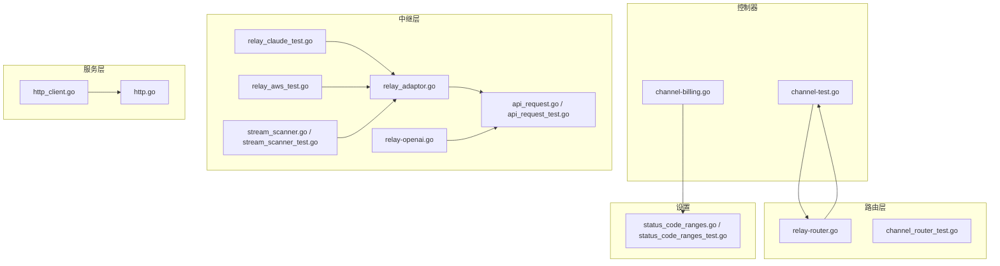
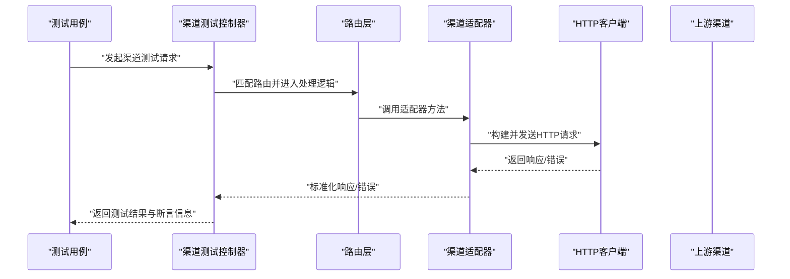
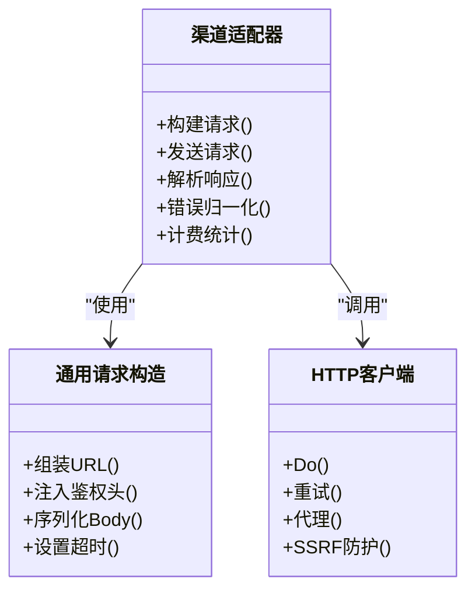
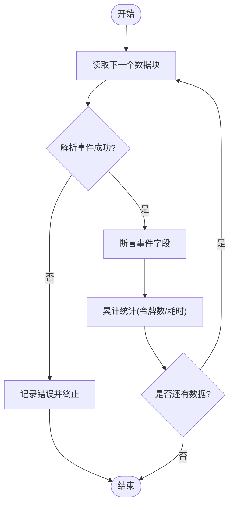
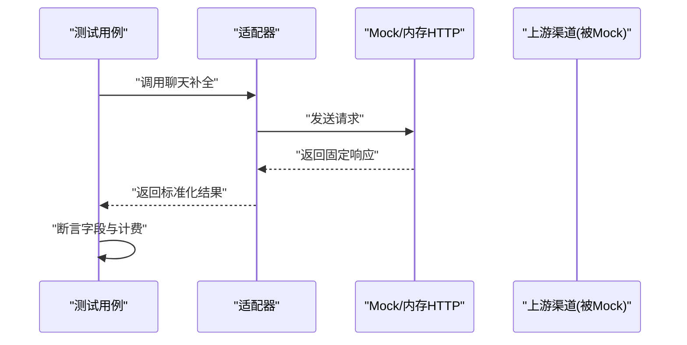
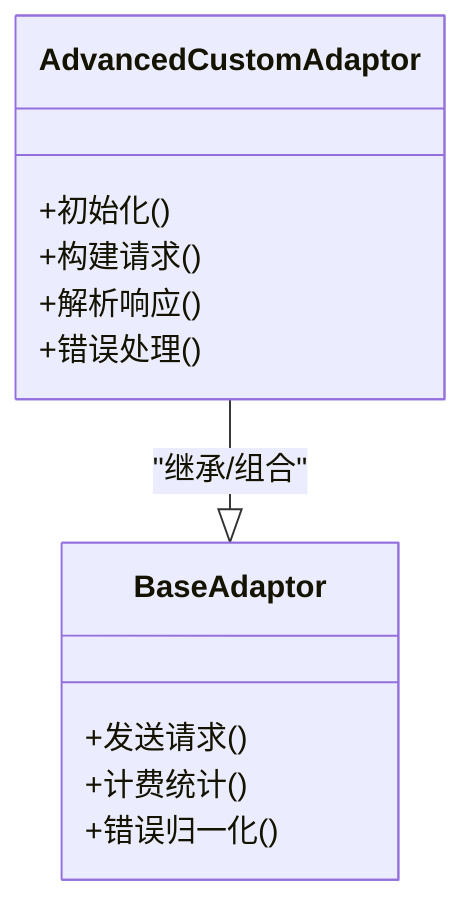
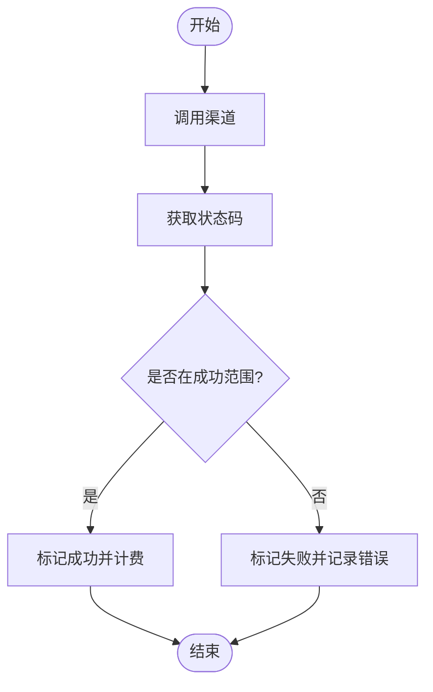
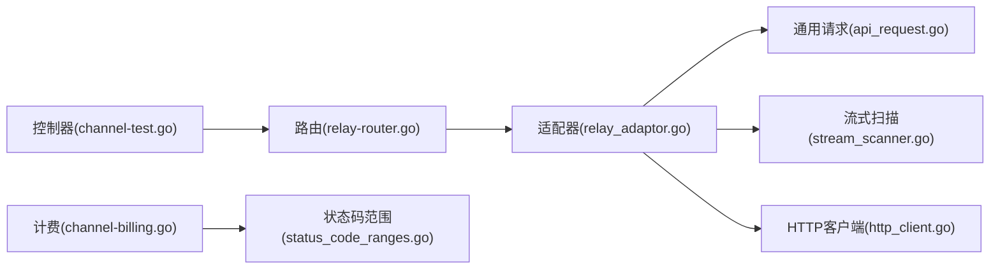
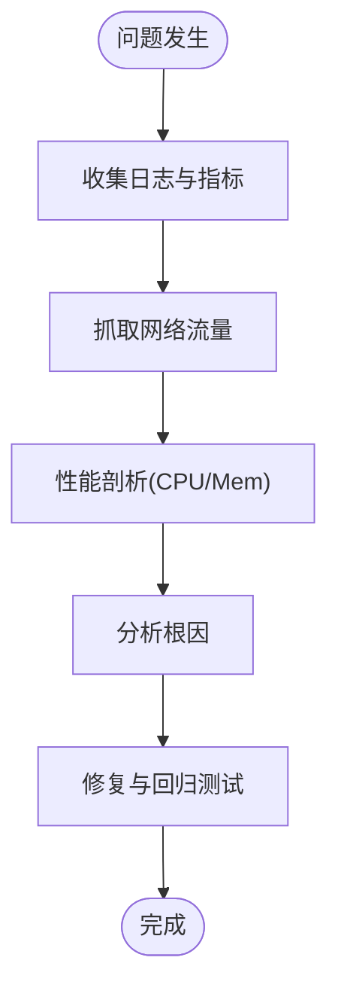

# 测试与调试

<cite>
**本文引用的文件**   
- [main.go](file://main.go)
- [channel-test.go](file://controller/channel-test.go)
- [relay_adaptor.go](file://relay/relay_adaptor.go)
- [api_request.go](file://relay/channel/api_request.go)
- [api_request_test.go](file://relay/channel/api_request_test.go)
- [adaptor.go](file://relay/channel/advancedcustom/adaptor.go)
- [adaptor_test.go](file://relay/channel/advancedcustom/adaptor_test.go)
- [relay-openai.go](file://relay/channel/openai/relay-openai.go)
- [relay_claude_test.go](file://relay/channel/claude/relay_claude_test.go)
- [relay_aws_test.go](file://relay/channel/aws/relay_aws_test.go)
- [stream_scanner.go](file://relay/helper/stream_scanner.go)
- [stream_scanner_test.go](file://relay/helper/stream_scanner_test.go)
- [http_client.go](file://service/http_client.go)
- [http.go](file://service/http.go)
- [logger.go](file://middleware/logger.go)
- [sys_log.go](file://common/sys_log.go)
- [pprof.go](file://common/pprof.go)
- [rate-limit.go](file://common/rate-limit.go)
- [ssrf_protection.go](file://common/ssrf_protection.go)
- [status_code_ranges.go](file://setting/operation_setting/status_code_ranges.go)
- [status_code_ranges_test.go](file://setting/operation_setting/status_code_ranges_test.go)
- [channel_router_test.go](file://router/channel_router_test.go)
- [relay-router.go](file://router/relay-router.go)
- [channel-billing.go](file://controller/channel-billing.go)
- [billing_usage.go](file://dto/billing_usage.go)
</cite>

## 目录
1. [简介](#简介)
2. [项目结构](#项目结构)
3. [核心组件](#核心组件)
4. [架构总览](#架构总览)
5. [详细组件分析](#详细组件分析)
6. [依赖关系分析](#依赖关系分析)
7. [性能考虑](#性能考虑)
8. [故障排查指南](#故障排查指南)
9. [结论](#结论)
10. [附录](#附录)

## 简介
本文件面向“自定义渠道”的测试与调试，目标是帮助开发者编写高质量的单元测试与集成测试，确保渠道适配器的正确性与稳定性。内容涵盖：
- 如何模拟HTTP请求与响应、如何进行断言与错误场景覆盖
- 调试技巧：日志分析、网络抓包、性能剖析
- 测试框架使用示例与常见测试模式
- 端到端测试与回归测试策略，保障渠道功能稳定

## 项目结构
本项目采用分层与按功能域组织的方式，测试相关代码主要分布在以下位置：
- 控制器层：提供渠道测试接口与计费校验等能力
- 中继层（relay）：各渠道适配器实现与通用请求构造、流式处理工具
- 服务层（service）：HTTP客户端封装、限流、SSRF保护等基础设施
- 路由层（router）：API路由与测试路由
- 设置与常量：状态码范围、操作配置等

图表来源
- [channel-test.go](file://controller/channel-test.go)
- [relay_adaptor.go](file://relay/relay_adaptor.go)
- [api_request.go](file://relay/channel/api_request.go)
- [api_request_test.go](file://relay/channel/api_request_test.go)
- [relay-openai.go](file://relay/channel/openai/relay-openai.go)
- [relay_claude_test.go](file://relay/channel/claude/relay_claude_test.go)
- [relay_aws_test.go](file://relay/channel/aws/relay_aws_test.go)
- [stream_scanner.go](file://relay/helper/stream_scanner.go)
- [stream_scanner_test.go](file://relay/helper/stream_scanner_test.go)
- [http_client.go](file://service/http_client.go)
- [http.go](file://service/http.go)
- [relay-router.go](file://router/relay-router.go)
- [channel_router_test.go](file://router/channel_router_test.go)
- [status_code_ranges.go](file://setting/operation_setting/status_code_ranges.go)
- [status_code_ranges_test.go](file://setting/operation_setting/status_code_ranges_test.go)

章节来源
- [main.go:1-200](file://main.go#L1-L200)
- [relay-router.go:1-200](file://router/relay-router.go#L1-L200)

## 核心组件
- 渠道适配器抽象与通用请求构造：用于统一发起HTTP请求、处理响应、流式数据解析与计费统计
- 渠道测试控制器：暴露测试入口，便于在集成测试中触发真实或模拟的渠道调用
- 流式扫描器：对服务端推送的流式数据进行分块解析，支撑流式断言与错误检测
- HTTP客户端与服务：封装底层HTTP行为，支持重试、超时、代理、SSRF防护等

章节来源
- [relay_adaptor.go:1-200](file://relay/relay_adaptor.go#L1-L200)
- [api_request.go:1-200](file://relay/channel/api_request.go#L1-L200)
- [channel-test.go:1-200](file://controller/channel-test.go#L1-L200)
- [stream_scanner.go:1-200](file://relay/helper/stream_scanner.go#L1-L200)
- [http_client.go:1-200](file://service/http_client.go#L1-L200)

## 架构总览
下图展示了从控制器到渠道适配器的典型调用链，以及测试时如何通过控制器触发并断言结果。

图表来源
- [channel-test.go:1-200](file://controller/channel-test.go#L1-L200)
- [relay-adaptor.go:1-200](file://relay/relay_adaptor.go#L1-L200)
- [api_request.go:1-200](file://relay/channel/api_request.go#L1-L200)
- [http_client.go:1-200](file://service/http_client.go#L1-L200)

## 详细组件分析

### 渠道适配器与通用请求构造
- 职责：统一封装请求构建、鉴权头注入、参数映射、响应解码、错误归一化、计费统计
- 关键点：
  - 请求构建：根据渠道协议组装URL、Headers、Body
  - 响应处理：区分JSON、流式、二进制等类型
  - 错误处理：将上游错误转换为内部错误模型，便于断言
  - 计费统计：记录token用量、耗时、状态码分布

图表来源
- [relay_adaptor.go:1-200](file://relay/relay_adaptor.go#L1-L200)
- [api_request.go:1-200](file://relay/channel/api_request.go#L1-L200)
- [http_client.go:1-200](file://service/http_client.go#L1-L200)

章节来源
- [relay_adaptor.go:1-200](file://relay/relay_adaptor.go#L1-L200)
- [api_request.go:1-200](file://relay/channel/api_request.go#L1-L200)

### 流式数据处理与断言
- 职责：对SSE/流式响应进行分块读取、事件解析、错误检测与计数
- 关键点：
  - 分块读取：避免一次性加载大响应
  - 事件解析：识别不同类型的事件（如文本、结束、错误）
  - 断言策略：逐条断言字段、累计统计、异常路径覆盖

图表来源
- [stream_scanner.go:1-200](file://relay/helper/stream_scanner.go#L1-L200)
- [stream_scanner_test.go:1-200](file://relay/helper/stream_scanner_test.go#L1-L200)

章节来源
- [stream_scanner.go:1-200](file://relay/helper/stream_scanner.go#L1-L200)
- [stream_scanner_test.go:1-200](file://relay/helper/stream_scanner_test.go#L1-L200)

### 单元测试最佳实践（以OpenAI与Claude为例）
- 目标：验证请求构造、响应解析、错误处理、计费统计的正确性
- 建议：
  - 使用内存HTTP服务器或Mock客户端隔离外部依赖
  - 构造边界输入（空消息、超长上下文、非法参数）
  - 断言状态码、错误码、错误消息、计费字段
  - 覆盖流式与非流式两种路径

图表来源
- [relay-openai.go:1-200](file://relay/channel/openai/relay-openai.go#L1-L200)
- [relay_claude_test.go:1-200](file://relay/channel/claude/relay_claude_test.go#L1-L200)
- [relay_aws_test.go:1-200](file://relay/channel/aws/relay_aws_test.go#L1-L200)

章节来源
- [relay-openai.go:1-200](file://relay/channel/openai/relay-openai.go#L1-L200)
- [relay_claude_test.go:1-200](file://relay/channel/claude/relay_claude_test.go#L1-L200)
- [relay_aws_test.go:1-200](file://relay/channel/aws/relay_aws_test.go#L1-L200)

### 自定义渠道适配器示例（AdvancedCustom）
- 目的：展示如何基于通用适配器快速实现一个自定义渠道
- 要点：
  - 定义适配器结构与初始化
  - 实现请求转换与响应解析
  - 注册到渠道列表以便路由选择

图表来源
- [adaptor.go:1-200](file://relay/channel/advancedcustom/adaptor.go#L1-L200)
- [adaptor_test.go:1-200](file://relay/channel/advancedcustom/adaptor_test.go#L1-L200)

章节来源
- [adaptor.go:1-200](file://relay/channel/advancedcustom/adaptor.go#L1-L200)
- [adaptor_test.go:1-200](file://relay/channel/advancedcustom/adaptor_test.go#L1-L200)

### 集成测试与端到端测试
- 集成测试：通过控制器暴露的测试接口，触发完整链路（路由→适配器→HTTP客户端→上游）
- 端到端测试：启动服务后，使用真实或沙箱环境的上游渠道进行调用，验证整体行为
- 建议：
  - 使用环境变量切换测试/生产上游地址
  - 准备稳定的测试数据集与期望输出
  - 对关键路径进行回归测试，确保变更不破坏既有行为

章节来源
- [channel-test.go:1-200](file://controller/channel-test.go#L1-L200)
- [channel_router_test.go:1-200](file://router/channel_router_test.go#L1-L200)
- [relay-router.go:1-200](file://router/relay-router.go#L1-L200)

### 计费与状态码范围断言
- 计费断言：验证token用量、价格计算、配额扣减是否符合预期
- 状态码范围：根据渠道返回的状态码判定成功/失败，并进行分类统计

图表来源
- [channel-billing.go:1-200](file://controller/channel-billing.go#L1-L200)
- [billing_usage.go:1-200](file://dto/billing_usage.go#L1-L200)
- [status_code_ranges.go:1-200](file://setting/operation_setting/status_code_ranges.go#L1-L200)
- [status_code_ranges_test.go:1-200](file://setting/operation_setting/status_code_ranges_test.go#L1-L200)

章节来源
- [channel-billing.go:1-200](file://controller/channel-billing.go#L1-L200)
- [billing_usage.go:1-200](file://dto/billing_usage.go#L1-L200)
- [status_code_ranges.go:1-200](file://setting/operation_setting/status_code_ranges.go#L1-L200)
- [status_code_ranges_test.go:1-200](file://setting/operation_setting/status_code_ranges_test.go#L1-L200)

## 依赖关系分析
- 控制器依赖路由与适配器，适配器依赖HTTP客户端与通用请求构造
- 流式处理依赖扫描器与适配器
- 计费模块依赖状态码范围配置与计费DTO

图表来源
- [channel-test.go:1-200](file://controller/channel-test.go#L1-L200)
- [relay-router.go:1-200](file://router/relay-router.go#L1-L200)
- [relay_adaptor.go:1-200](file://relay/relay_adaptor.go#L1-L200)
- [api_request.go:1-200](file://relay/channel/api_request.go#L1-L200)
- [stream_scanner.go:1-200](file://relay/helper/stream_scanner.go#L1-L200)
- [http_client.go:1-200](file://service/http_client.go#L1-L200)
- [channel-billing.go:1-200](file://controller/channel-billing.go#L1-L200)
- [status_code_ranges.go:1-200](file://setting/operation_setting/status_code_ranges.go#L1-L200)

章节来源
- [channel-test.go:1-200](file://controller/channel-test.go#L1-L200)
- [relay-router.go:1-200](file://router/relay-router.go#L1-L200)
- [relay_adaptor.go:1-200](file://relay/relay_adaptor.go#L1-L200)
- [api_request.go:1-200](file://relay/channel/api_request.go#L1-L200)
- [stream_scanner.go:1-200](file://relay/helper/stream_scanner.go#L1-L200)
- [http_client.go:1-200](file://service/http_client.go#L1-L200)
- [channel-billing.go:1-200](file://controller/channel-billing.go#L1-L200)
- [status_code_ranges.go:1-200](file://setting/operation_setting/status_code_ranges.go#L1-L200)

## 性能考虑
- 流式处理：优先使用流式读取降低内存占用，避免一次性加载大响应
- 连接复用：合理配置HTTP客户端的连接池与超时，减少握手开销
- 限流与熔断：结合限流与重试策略，防止上游抖动影响系统稳定性
- 监控与指标：采集延迟、吞吐、错误率等指标，辅助定位瓶颈

章节来源
- [stream_scanner.go:1-200](file://relay/helper/stream_scanner.go#L1-L200)
- [http_client.go:1-200](file://service/http_client.go#L1-L200)
- [rate-limit.go:1-200](file://common/rate-limit.go#L1-L200)

## 故障排查指南
- 日志分析：启用结构化日志，记录请求ID、上游地址、状态码、错误堆栈
- 网络抓包：使用抓包工具捕获HTTP流量，核对请求头、Body与响应体
- 性能剖析：开启性能分析接口，生成CPU/内存Profile，定位热点函数
- SSRF防护：检查白名单与域名解析，防止恶意重定向与内网访问

图表来源
- [logger.go:1-200](file://middleware/logger.go#L1-L200)
- [sys_log.go:1-200](file://common/sys_log.go#L1-L200)
- [pprof.go:1-200](file://common/pprof.go#L1-L200)
- [ssrf_protection.go:1-200](file://common/ssrf_protection.go#L1-L200)

章节来源
- [logger.go:1-200](file://middleware/logger.go#L1-L200)
- [sys_log.go:1-200](file://common/sys_log.go#L1-L200)
- [pprof.go:1-200](file://common/pprof.go#L1-L200)
- [ssrf_protection.go:1-200](file://common/ssrf_protection.go#L1-L200)

## 结论
通过统一的适配器抽象、完善的流式处理与计费统计、以及丰富的测试与调试手段，可以高效地开发与维护自定义渠道。建议在新增渠道时：
- 先写单元测试覆盖核心路径与边界条件
- 再进行集成测试验证端到端行为
- 最后通过性能剖析与日志分析持续优化

## 附录
- 常见测试模式：
  - Mock上游响应：固定返回成功/失败/流式数据
  - 参数边界测试：空值、超长、非法字符、超大文件
  - 错误恢复测试：网络超时、上游限流、认证失败
- 回归测试清单：
  - 所有已支持的渠道基础功能
  - 计费与配额扣减准确性
  - 流式响应完整性与时序正确性
  - 状态码范围与错误映射一致性