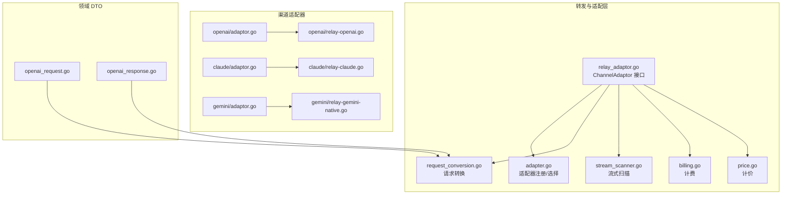
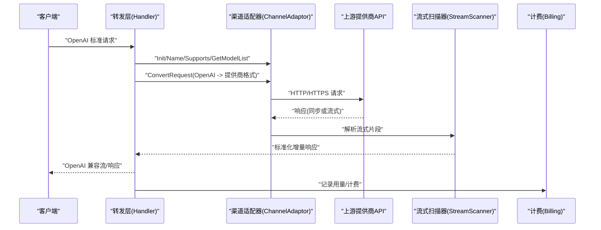
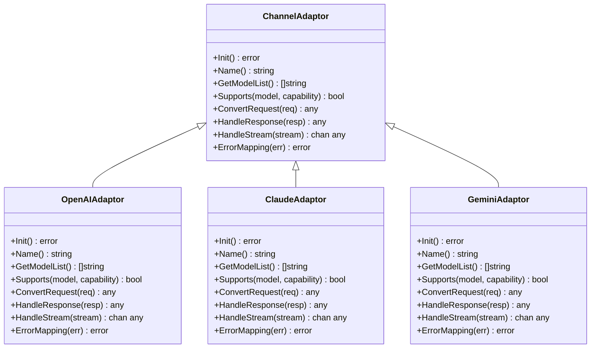
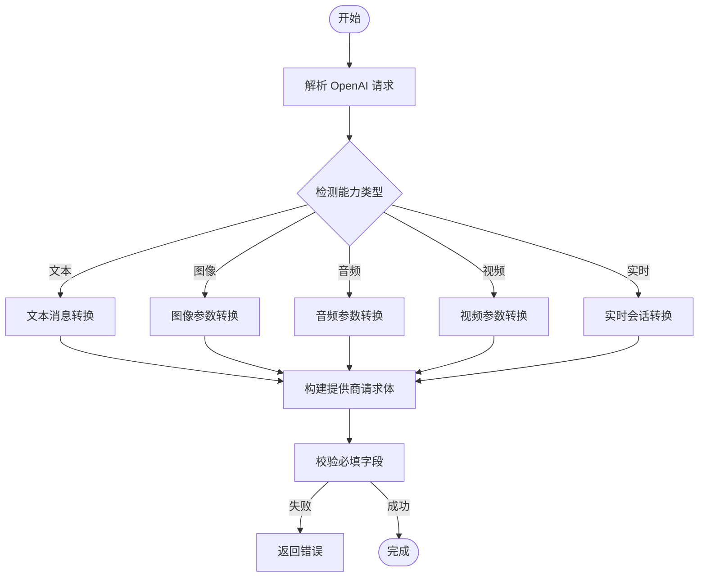
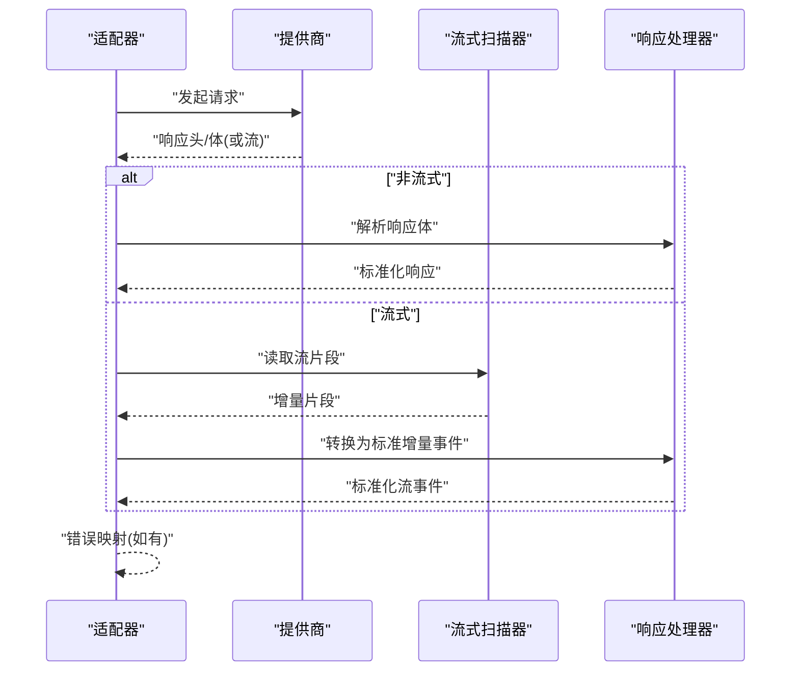
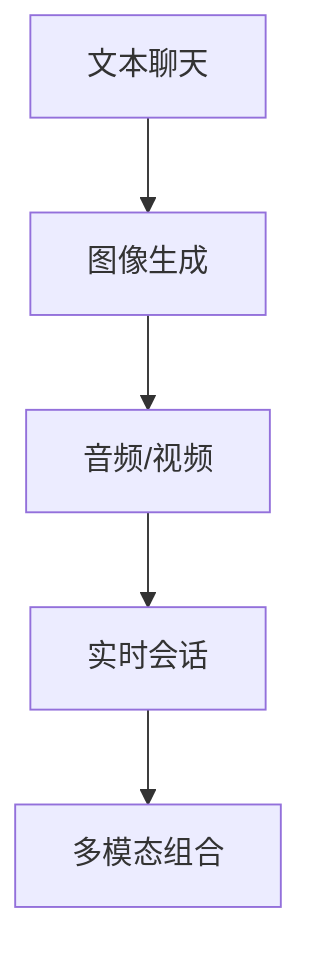
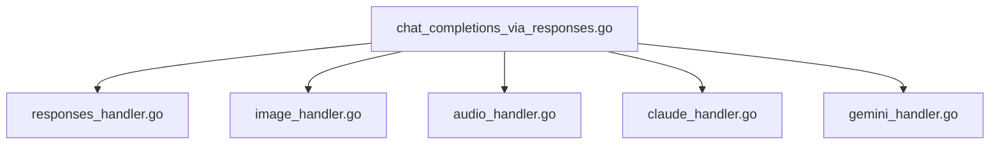
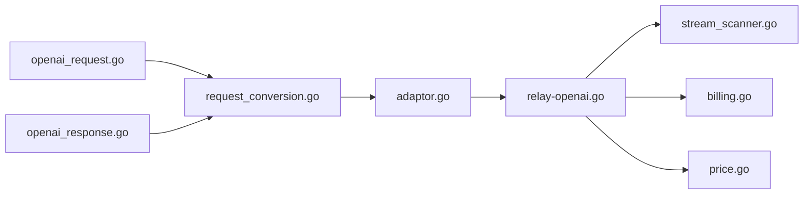

# 渠道适配器开发

<cite>
**本文引用的文件**   
- [relay_adaptor.go](file://relay/relay_adaptor.go)
- [adapter.go](file://relay/channel/adapter.go)
- [api_request.go](file://relay/channel/api_request.go)
- [relay_info.go](file://relay/common/relay_info.go)
- [stream_status.go](file://relay/common/stream_status.go)
- [stream_scanner.go](file://relay/helper/stream_scanner.go)
- [openai_request.go](file://dto/openai_request.go)
- [openai_response.go](file://dto/openai_response.go)
- [relay-openai.go](file://relay/channel/openai/relay-openai.go)
- [adaptor.go](file://relay/channel/openai/adaptor.go)
- [chat_via_responses.go](file://relay/chat_completions_via_responses.go)
- [responses_handler.go](file://relay/responses_handler.go)
- [image_handler.go](file://relay/image_handler.go)
- [audio_handler.go](file://relay/audio_handler.go)
- [claude_handler.go](file://relay/claude_handler.go)
- [gemini_handler.go](file://relay/gemini_handler.go)
- [relay-claude.go](file://relay/channel/claude/relay-claude.go)
- [relay-gemini-native.go](file://relay/channel/gemini/relay-gemini-native.go)
- [relay_gemini_usage_test.go](file://relay/channel/gemini/relay_gemini_usage_test.go)
- [relay_image.go](file://relay/channel/openai/relay_image.go)
- [relay_realtime.go](file://relay/channel/openai/relay_realtime.go)
- [relay_responses_compact.go](file://relay/channel/openai/relay_responses_compact.go)
- [relay_responses.go](file://relay/channel/openai/relay_responses.go)
- [usage.go](file://relay/channel/openai/usage.go)
- [request_conversion.go](file://relay/common/request_conversion.go)
- [billing.go](file://relay/common/billing.go)
- [price.go](file://relay/helper/price.go)
- [channel.go](file://model/channel.go)
- [channel_settings.go](file://dto/channel_settings.go)
</cite>

## 目录
1. [简介](#简介)
2. [项目结构](#项目结构)
3. [核心组件](#核心组件)
4. [架构总览](#架构总览)
5. [详细组件分析](#详细组件分析)
6. [依赖关系分析](#依赖关系分析)
7. [性能考虑](#性能考虑)
8. [故障排查指南](#故障排查指南)
9. [结论](#结论)
10. [附录](#附录)

## 简介
本文件面向“渠道适配器”开发者，系统性讲解如何在项目中实现 ChannelAdaptor 接口，覆盖初始化、模型列表、能力支持判定、请求转换（标准 OpenAI 格式到各提供商 API）、响应处理与流式输出、错误映射等关键主题。文档同时提供从简单文本聊天到复杂多模态（图像、音频、实时）的完整实现路径与最佳实践，并给出性能优化与调试方法。

## 项目结构
本项目采用按功能域分层与按渠道子模块组织相结合的结构：
- relay/ 为转发与适配的核心层，包含通用逻辑、处理器与各渠道适配器实现
- relay/channel/ 下每个子目录对应一个具体渠道（如 openai、claude、gemini 等），内含 adaptor、relay、DTO、常量等
- relay/common 与 relay/helper 提供通用工具（计费、流式扫描、请求转换等）
- dto/ 定义标准请求/响应结构与领域 DTO
- model/ 与 setting/ 负责数据模型与配置

图表来源 
- [relay_adaptor.go](file://relay/relay_adaptor.go)
- [adapter.go](file://relay/channel/adapter.go)
- [request_conversion.go](file://relay/common/request_conversion.go)
- [stream_scanner.go](file://relay/helper/stream_scanner.go)
- [billing.go](file://relay/common/billing.go)
- [price.go](file://relay/helper/price.go)
- [adaptor.go](file://relay/channel/openai/adaptor.go)
- [relay-openai.go](file://relay/channel/openai/relay-openai.go)
- [relay-claude.go](file://relay/channel/claude/relay-claude.go)
- [relay-gemini-native.go](file://relay/channel/gemini/relay-gemini-native.go)
- [openai_request.go](file://dto/openai_request.go)
- [openai_response.go](file://dto/openai_response.go)

章节来源
- [relay_adaptor.go](file://relay/relay_adaptor.go)
- [adapter.go](file://relay/channel/adapter.go)
- [request_conversion.go](file://relay/common/request_conversion.go)
- [stream_scanner.go](file://relay/helper/stream_scanner.go)
- [billing.go](file://relay/common/billing.go)
- [price.go](file://relay/helper/price.go)
- [openai_request.go](file://dto/openai_request.go)
- [openai_response.go](file://dto/openai_response.go)

## 核心组件
- ChannelAdaptor 接口：渠道适配器的统一抽象，要求实现 Init、Name、GetModelList、Supports 以及请求/响应处理相关方法（不同渠道可能扩展更多方法）。
- 适配器注册与选择：通过 adapter.go 完成渠道发现与选择，结合 channel 元数据决定路由。
- 请求转换：将标准 OpenAI 请求转换为各渠道特定格式，位于 request_conversion.go 及相关渠道 DTO。
- 流式处理：使用 stream_scanner 解析 SSE/流式片段，统一封装为 OpenAI 兼容流。
- 计费与价格：billing.go 与 price.go 负责用量统计与计价计算。

章节来源
- [relay_adaptor.go](file://relay/relay_adaptor.go)
- [adapter.go](file://relay/channel/adapter.go)
- [request_conversion.go](file://relay/common/request_conversion.go)
- [stream_scanner.go](file://relay/helper/stream_scanner.go)
- [billing.go](file://relay/common/billing.go)
- [price.go](file://relay/helper/price.go)

## 架构总览
下图展示了从客户端请求到渠道响应的整体流程，包括请求转换、渠道调用、流式返回与错误映射。

图表来源 
- [relay-openai.go](file://relay/channel/openai/relay-openai.go)
- [relay-claude.go](file://relay/channel/claude/relay-claude.go)
- [relay-gemini-native.go](file://relay/channel/gemini/relay-gemini-native.go)
- [stream_scanner.go](file://relay/helper/stream_scanner.go)
- [billing.go](file://relay/common/billing.go)

## 详细组件分析

### ChannelAdaptor 接口与实现要点
- 必需方法
  - Init：初始化渠道上下文（鉴权、连接池、超时等）
  - Name：返回渠道名称，用于日志与监控
  - GetModelList：返回该渠道支持的模型清单
  - Supports：判断是否支持某模型/能力（文本、图像、音频、视频、实时等）
- 可选/扩展方法
  - ConvertRequest：将 OpenAI 标准请求转为渠道特定格式
  - HandleResponse：处理非流式响应，映射为标准 OpenAI 响应
  - HandleStream：处理流式响应，逐块转换为标准格式
  - ErrorMapping：将上游错误码/消息映射为系统内部错误类型

图表来源 
- [relay_adaptor.go](file://relay/relay_adaptor.go)
- [adaptor.go](file://relay/channel/openai/adaptor.go)
- [relay-claude.go](file://relay/channel/claude/relay-claude.go)
- [relay-gemini-native.go](file://relay/channel/gemini/relay-gemini-native.go)

章节来源
- [relay_adaptor.go](file://relay/relay_adaptor.go)
- [adaptor.go](file://relay/channel/openai/adaptor.go)
- [relay-claude.go](file://relay/channel/claude/relay-claude.go)
- [relay-gemini-native.go](file://relay/channel/gemini/relay-gemini-native.go)

### 请求转换逻辑（OpenAI 标准到提供商格式）
- 输入：OpenAI 标准请求（消息、参数、附件等）
- 转换策略：
  - 文本对话：将 messages 映射为提供商的消息结构（角色、内容、工具调用等）
  - 图像生成：将 prompt、size、style 等映射为图像 API 参数
  - 音频/视频：将媒体 URL/Base64 与任务参数映射
  - 实时会话：将事件与通道配置映射
- 输出：渠道特定的请求体与头部（含鉴权、版本、端点）

图表来源 
- [request_conversion.go](file://relay/common/request_conversion.go)
- [openai_request.go](file://dto/openai_request.go)
- [relay-openai.go](file://relay/channel/openai/relay-openai.go)
- [relay-claude.go](file://relay/channel/claude/relay-claude.go)
- [relay-gemini-native.go](file://relay/channel/gemini/relay-gemini-native.go)

章节来源
- [request_conversion.go](file://relay/common/request_conversion.go)
- [openai_request.go](file://dto/openai_request.go)
- [relay-openai.go](file://relay/channel/openai/relay-openai.go)
- [relay-claude.go](file://relay/channel/claude/relay-claude.go)
- [relay-gemini-native.go](file://relay/channel/gemini/relay-gemini-native.go)

### 响应处理与流式支持
- 非流式响应：将提供商响应体映射为标准 OpenAI 响应结构（content、usage、finish_reason 等）
- 流式响应：使用流式扫描器解析 SSE/分块，转换为标准增量事件（delta、usage 汇总等）
- 错误映射：将上游 HTTP 状态码与错误信息映射为系统错误类型，便于前端展示与重试

图表来源 
- [stream_scanner.go](file://relay/helper/stream_scanner.go)
- [relay-openai.go](file://relay/channel/openai/relay-openai.go)
- [relay-claude.go](file://relay/channel/claude/relay-claude.go)
- [relay-gemini-native.go](file://relay/channel/gemini/relay-gemini-native.go)

章节来源
- [stream_scanner.go](file://relay/helper/stream_scanner.go)
- [relay-openai.go](file://relay/channel/openai/relay-openai.go)
- [relay-claude.go](file://relay/channel/claude/relay-claude.go)
- [relay-gemini-native.go](file://relay/channel/gemini/relay-gemini-native.go)

### 错误映射最佳实践
- 统一错误类型：区分网络错误、认证错误、限流错误、业务错误
- 状态码映射：将上游 HTTP 状态码映射为系统错误码
- 消息规范化：提取关键信息（错误码、提示、重试建议）
- 可观测性：记录请求 ID、模型名、渠道名、耗时、错误堆栈

章节来源
- [relay_openai.go](file://relay/channel/openai/relay-openai.go)
- [relay_claude.go](file://relay/channel/claude/relay-claude.go)
- [relay_gemini_native.go](file://relay/channel/gemini/relay-gemini-native.go)

### 完整示例：从简单文本聊天到多模态
- 文本聊天：实现基础 Init/Name/Supports/ConvertRequest/HandleResponse/HandleStream
- 图像生成：在 ConvertRequest 中处理图像参数，在 HandleResponse 中返回图片 URL/Base64
- 音频/视频：处理媒体上传与任务轮询或直出
- 实时会话：建立 WebSocket/SSE 通道，处理事件与状态

章节来源
- [relay-openai.go](file://relay/channel/openai/relay-openai.go)
- [relay_image.go](file://relay/channel/openai/relay_image.go)
- [relay_realtime.go](file://relay/channel/openai/relay_realtime.go)
- [relay-claude.go](file://relay/channel/claude/relay-claude.go)
- [relay-gemini-native.go](file://relay/channel/gemini/relay-gemini-native.go)

### 处理器与模式切换
- chat_completions_via_responses：在 Chat Completions 与 Responses 模式间兼容
- responses_handler：统一 Responses 模式处理
- image_handler、audio_handler、claude_handler、gemini_handler：按能力划分的处理器

图表来源 
- [chat_completions_via_responses.go](file://relay/chat_completions_via_responses.go)
- [responses_handler.go](file://relay/responses_handler.go)
- [image_handler.go](file://relay/image_handler.go)
- [audio_handler.go](file://relay/audio_handler.go)
- [claude_handler.go](file://relay/claude_handler.go)
- [gemini_handler.go](file://relay/gemini_handler.go)

章节来源
- [chat_completions_via_responses.go](file://relay/chat_completions_via_responses.go)
- [responses_handler.go](file://relay/responses_handler.go)
- [image_handler.go](file://relay/image_handler.go)
- [audio_handler.go](file://relay/audio_handler.go)
- [claude_handler.go](file://relay/claude_handler.go)
- [gemini_handler.go](file://relay/gemini_handler.go)

## 依赖关系分析
- 适配器与处理器：适配器负责与上游通信，处理器负责能力路由与格式转换
- 请求转换与 DTO：依赖 OpenAI 标准 DTO 进行解析与构造
- 流式扫描与计费：流式扫描器与计费模块贯穿整个响应处理链路

图表来源 
- [openai_request.go](file://dto/openai_request.go)
- [openai_response.go](file://dto/openai_response.go)
- [request_conversion.go](file://relay/common/request_conversion.go)
- [adapter.go](file://relay/channel/adapter.go)
- [relay-openai.go](file://relay/channel/openai/relay-openai.go)
- [stream_scanner.go](file://relay/helper/stream_scanner.go)
- [billing.go](file://relay/common/billing.go)
- [price.go](file://relay/helper/price.go)

章节来源
- [openai_request.go](file://dto/openai_request.go)
- [openai_response.go](file://dto/openai_response.go)
- [request_conversion.go](file://relay/common/request_conversion.go)
- [adapter.go](file://relay/channel/adapter.go)
- [relay-openai.go](file://relay/channel/openai/relay-openai.go)
- [stream_scanner.go](file://relay/helper/stream_scanner.go)
- [billing.go](file://relay/common/billing.go)
- [price.go](file://relay/helper/price.go)

## 性能考虑
- 连接复用与超时控制：合理设置 HTTP 客户端连接池、超时与重试策略
- 流式处理优化：避免不必要的缓冲与拷贝，使用零拷贝或最小化内存分配
- 并发与限流：对高并发场景启用 goroutine pool 与速率限制
- 缓存与降级：对模型列表、能力查询结果做短期缓存；上游异常时快速失败
- 计费与计量：增量更新用量，减少数据库写入频率

[本节为通用指导，不直接分析具体文件]

## 故障排查指南
- 常见问题
  - 模型不支持：检查 Supports 实现与模型映射
  - 请求格式错误：核对 ConvertRequest 字段映射与必填项
  - 流式中断：确认流式扫描器与上游协议一致性
  - 错误映射缺失：补充错误码映射与日志记录
- 调试技巧
  - 开启详细日志（请求/响应体、耗时、错误堆栈）
  - 使用测试用例验证转换与流式解析
  - 借助渠道测试工具模拟上游响应

章节来源
- [relay_openai.go](file://relay/channel/openai/relay-openai.go)
- [relay_claude.go](file://relay/channel/claude/relay-claude.go)
- [relay_gemini_native.go](file://relay/channel/gemini/relay-gemini-native.go)
- [relay_gemini_usage_test.go](file://relay/channel/gemini/relay_gemini_usage_test.go)

## 结论
实现 ChannelAdaptor 的关键在于清晰的职责划分与稳定的转换/映射逻辑。通过统一的接口与处理器，项目能够灵活接入多种提供商，并保持对外一致的 OpenAI 兼容体验。遵循本文的最佳实践，可在保证正确性的前提下提升性能与可维护性。

[本节为总结，不直接分析具体文件]

## 附录
- 参考实现路径
  - OpenAI 适配器：adaptor.go、relay-openai.go、relay_image.go、relay_realtime.go、relay_responses.go、relay_responses_compact.go、usage.go
  - Claude 适配器：relay-claude.go
  - Gemini 适配器：relay-gemini-native.go、relay_gemini_usage_test.go
- 相关 DTO 与工具
  - openai_request.go、openai_response.go、request_conversion.go、stream_scanner.go、billing.go、price.go

章节来源
- [adaptor.go](file://relay/channel/openai/adaptor.go)
- [relay-openai.go](file://relay/channel/openai/relay-openai.go)
- [relay_image.go](file://relay/channel/openai/relay_image.go)
- [relay_realtime.go](file://relay/channel/openai/relay_realtime.go)
- [relay_responses.go](file://relay/channel/openai/relay_responses.go)
- [relay_responses_compact.go](file://relay/channel/openai/relay_responses_compact.go)
- [usage.go](file://relay/channel/openai/usage.go)
- [relay-claude.go](file://relay/channel/claude/relay-claude.go)
- [relay-gemini-native.go](file://relay/channel/gemini/relay-gemini-native.go)
- [relay_gemini_usage_test.go](file://relay/channel/gemini/relay_gemini_usage_test.go)
- [openai_request.go](file://dto/openai_request.go)
- [openai_response.go](file://dto/openai_response.go)
- [request_conversion.go](file://relay/common/request_conversion.go)
- [stream_scanner.go](file://relay/helper/stream_scanner.go)
- [billing.go](file://relay/common/billing.go)
- [price.go](file://relay/helper/price.go)