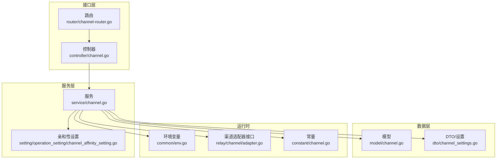
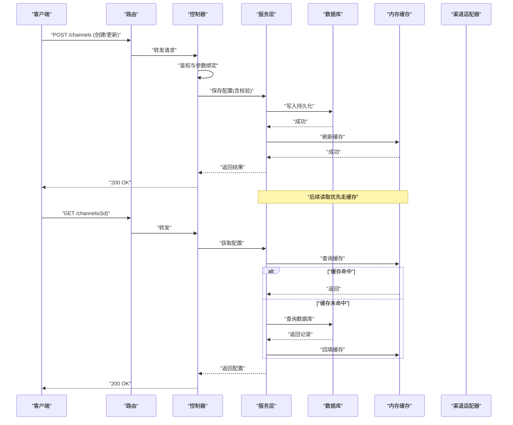
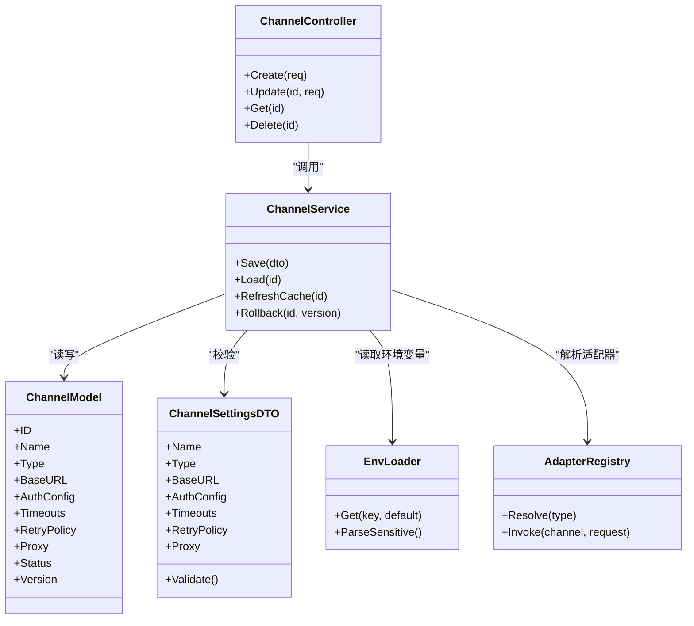

# 渠道配置管理

<cite>
**本文引用的文件**   
- [model/channel.go](file://model/channel.go)
- [dto/channel_settings.go](file://dto/channel_settings.go)
- [controller/channel.go](file://controller/channel.go)
- [service/channel.go](file://service/channel.go)
- [setting/operation_setting/channel_affinity_setting.go](file://setting/operation_setting/channel_affinity_setting.go)
- [common/env.go](file://common/env.go)
- [router/channel-router.go](file://router/channel-router.go)
- [relay/channel/adapter.go](file://relay/channel/adapter.go)
- [constant/channel.go](file://constant/channel.go)
</cite>

## 目录
1. [简介](#简介)
2. [项目结构](#项目结构)
3. [核心组件](#核心组件)
4. [架构总览](#架构总览)
5. [详细组件分析](#详细组件分析)
6. [依赖关系分析](#依赖关系分析)
7. [性能考虑](#性能考虑)
8. [故障排查指南](#故障排查指南)
9. [结论](#结论)
10. [附录](#附录)

## 简介
本文件面向“渠道配置管理”的完整说明，覆盖以下主题：
- 渠道配置的存储结构与数据模型
- 配置项定义与校验规则（认证信息、API端点、超时等）
- 动态更新机制与缓存策略
- 配置模板、环境变量注入与配置文件管理
- 新增渠道类型时的字段扩展与验证流程
- 安全考量（敏感信息加密存储、访问控制）

## 项目结构
围绕渠道配置的关键代码分布在以下模块：
- 数据模型与持久化：model/channel.go
- DTO与设置结构：dto/channel_settings.go
- 控制器与路由：controller/channel.go、router/channel-router.go
- 服务层与业务逻辑：service/channel.go
- 运行期设置与开关：setting/operation_setting/channel_affinity_setting.go
- 环境变量读取：common/env.go
- 渠道适配器接口：relay/channel/adapter.go
- 常量与枚举：constant/channel.go

图表来源 
- [router/channel-router.go](file://router/channel-router.go)
- [controller/channel.go](file://controller/channel.go)
- [service/channel.go](file://service/channel.go)
- [model/channel.go](file://model/channel.go)
- [dto/channel_settings.go](file://dto/channel_settings.go)
- [setting/operation_setting/channel_affinity_setting.go](file://setting/operation_setting/channel_affinity_setting.go)
- [common/env.go](file://common/env.go)
- [relay/channel/adapter.go](file://relay/channel/adapter.go)
- [constant/channel.go](file://constant/channel.go)

章节来源
- [model/channel.go](file://model/channel.go)
- [dto/channel_settings.go](file://dto/channel_settings.go)
- [controller/channel.go](file://controller/channel.go)
- [service/channel.go](file://service/channel.go)
- [setting/operation_setting/channel_affinity_setting.go](file://setting/operation_setting/channel_affinity_setting.go)
- [common/env.go](file://common/env.go)
- [router/channel-router.go](file://router/channel-router.go)
- [relay/channel/adapter.go](file://relay/channel/adapter.go)
- [constant/channel.go](file://constant/channel.go)

## 核心组件
- 渠道数据模型：定义渠道标识、类型、基础连接参数、鉴权凭据、请求超时、重试策略、代理与网络限制等。
- 渠道设置DTO：承载前端提交与后端校验的配置对象，包含必填项、格式校验、范围校验等。
- 控制器：接收HTTP请求，进行权限校验、参数绑定与调用服务层。
- 服务层：实现配置的CRUD、校验、持久化、缓存刷新、动态更新与回滚。
- 运行期设置：如亲和性、负载均衡、灰度策略等对渠道选择的影响。
- 环境变量：支持从环境变量注入密钥、端点、超时等敏感或环境相关配置。
- 渠道适配器：统一抽象不同上游渠道的请求构造、鉴权、流式处理等。
- 常量：渠道类型、状态码、错误码等枚举值。

章节来源
- [model/channel.go](file://model/channel.go)
- [dto/channel_settings.go](file://dto/channel_settings.go)
- [controller/channel.go](file://controller/channel.go)
- [service/channel.go](file://service/channel.go)
- [setting/operation_setting/channel_affinity_setting.go](file://setting/operation_setting/channel_affinity_setting.go)
- [common/env.go](file://common/env.go)
- [relay/channel/adapter.go](file://relay/channel/adapter.go)
- [constant/channel.go](file://constant/channel.go)

## 架构总览
渠道配置的生命周期包括：
- 创建/更新：通过控制器接收请求，服务层校验并持久化，同时刷新内存缓存。
- 读取：服务层优先读缓存，未命中则落库，再回填缓存。
- 动态更新：支持热更新，避免重启；失败时提供回滚与告警。
- 使用：调度器根据亲和性与权重选择具体渠道实例，调用适配器发起请求。

图表来源 
- [router/channel-router.go](file://router/channel-router.go)
- [controller/channel.go](file://controller/channel.go)
- [service/channel.go](file://service/channel.go)
- [model/channel.go](file://model/channel.go)
- [dto/channel_settings.go](file://dto/channel_settings.go)

## 详细组件分析

### 数据模型与存储结构
- 渠道主表字段建议包含：
  - 标识与元数据：ID、名称、描述、标签、分组、状态、版本
  - 渠道类型：OpenAI兼容、Claude、Gemini、Azure等
  - 连接参数：BaseURL、API版本、路径前缀、是否启用HTTPS
  - 鉴权信息：密钥、签名算法、OAuth配置、证书
  - 网络与超时：连接超时、读写超时、重试次数、退避策略、代理
  - 配额与限流：QPS、并发、令牌桶、速率限制
  - 高级选项：模型映射、请求头覆盖、响应压缩、调试开关
- 敏感字段（如密钥、证书）应加密存储，并在日志中脱敏。
- 版本控制：每次变更生成新版本，便于回滚与审计。

章节来源
- [model/channel.go](file://model/channel.go)

### DTO与校验规则
- 必填项：渠道类型、名称、至少一个鉴权字段或端点
- 格式校验：URL合法性、端口范围、JSON/YAML片段有效性
- 范围校验：超时毫秒数、重试次数、并发上限
- 关联校验：当类型为某类时，强制某些字段存在（如OAuth ClientId/Secret）
- 安全校验：禁止危险字符、长度限制、白名单域名

章节来源
- [dto/channel_settings.go](file://dto/channel_settings.go)

### 控制器与服务层
- 控制器职责：
  - 鉴权与授权检查
  - 请求体绑定与初步校验
  - 调用服务层执行CRUD
- 服务层职责：
  - 深度校验与默认值填充
  - 事务写入与并发控制
  - 缓存失效与预热
  - 动态更新与回滚
  - 审计日志与指标上报

章节来源
- [controller/channel.go](file://controller/channel.go)
- [service/channel.go](file://service/channel.go)

### 动态更新与缓存策略
- 缓存键设计：按渠道ID或全局Key命名空间隔离
- 更新流程：写库成功后立即失效旧缓存，异步重建新缓存
- 一致性：采用版本号或时间戳保证最终一致
- 降级：缓存不可用时回退到数据库直读

章节来源
- [service/channel.go](file://service/channel.go)

### 环境变量注入与配置文件管理
- 支持从环境变量注入：
  - 密钥与证书路径
  - BaseURL与超时默认值
  - 功能开关与调试级别
- 优先级：显式配置 > 环境变量 > 默认值
- 配置文件：集中管理非敏感配置，敏感配置仅保留路径引用

章节来源
- [common/env.go](file://common/env.go)

### 渠道适配器与运行时设置
- 适配器抽象：统一封装不同上游的鉴权、请求构造、流式处理
- 亲和性设置：基于地域、模型、用户分组的亲和路由
- 负载均衡：轮询、加权、健康检查、熔断与限流

章节来源
- [relay/channel/adapter.go](file://relay/channel/adapter.go)
- [setting/operation_setting/channel_affinity_setting.go](file://setting/operation_setting/channel_affinity_setting.go)

### 常量与枚举
- 渠道类型枚举：用于路由与适配器的分发
- 状态码与错误码：统一错误分类与提示

章节来源
- [constant/channel.go](file://constant/channel.go)

## 依赖关系分析

图表来源 
- [model/channel.go](file://model/channel.go)
- [dto/channel_settings.go](file://dto/channel_settings.go)
- [controller/channel.go](file://controller/channel.go)
- [service/channel.go](file://service/channel.go)
- [common/env.go](file://common/env.go)
- [relay/channel/adapter.go](file://relay/channel/adapter.go)

章节来源
- [model/channel.go](file://model/channel.go)
- [dto/channel_settings.go](file://dto/channel_settings.go)
- [controller/channel.go](file://controller/channel.go)
- [service/channel.go](file://service/channel.go)
- [common/env.go](file://common/env.go)
- [relay/channel/adapter.go](file://relay/channel/adapter.go)

## 性能考虑
- 缓存命中率：合理设置TTL与失效策略，减少数据库压力
- 批量操作：导入/导出时使用批量写入与异步任务
- 连接池：为上游HTTP客户端配置合理的连接池大小与复用
- 超时与重试：避免雪崩，采用指数退避与熔断
- 监控与指标：记录关键路径耗时、错误率与资源占用

[本节为通用指导，不直接分析具体文件]

## 故障排查指南
- 常见错误
  - 校验失败：检查必填项、格式与范围
  - 鉴权失败：确认密钥、签名算法与端点正确性
  - 超时/连接失败：检查网络、代理、超时设置与上游健康
  - 缓存不一致：查看缓存键与版本号，必要时手动刷新
- 定位方法
  - 开启调试日志与请求追踪
  - 使用测试接口验证配置可用性
  - 对比历史版本快速回滚

章节来源
- [service/channel.go](file://service/channel.go)
- [dto/channel_settings.go](file://dto/channel_settings.go)

## 结论
渠道配置管理通过清晰的模型、严格的校验、健壮的动态更新与缓存策略，以及安全的敏感信息管理，为多上游渠道的统一接入提供了稳定基础。建议在新增渠道类型时遵循既有模式，完善校验与安全控制，确保系统可扩展与可维护。

[本节为总结性内容，不直接分析具体文件]

## 附录

### 如何为新渠道类型添加配置字段与验证规则
- 步骤概览
  - 在DTO中新增字段与校验规则
  - 在模型中增加对应字段与迁移脚本
  - 在服务层补充默认值、校验与持久化逻辑
  - 在适配器中实现该渠道的请求构造与鉴权
  - 在常量中注册新的渠道类型
  - 在路由与控制器中暴露必要的接口
  - 编写单元测试与集成测试
- 示例要点
  - 新增字段需包含必填、格式、范围与关联校验
  - 敏感字段必须加密存储与脱敏输出
  - 动态更新需保证缓存一致性与可回滚

章节来源
- [dto/channel_settings.go](file://dto/channel_settings.go)
- [model/channel.go](file://model/channel.go)
- [service/channel.go](file://service/channel.go)
- [relay/channel/adapter.go](file://relay/channel/adapter.go)
- [constant/channel.go](file://constant/channel.go)
- [controller/channel.go](file://controller/channel.go)
- [router/channel-router.go](file://router/channel-router.go)

### 配置模板与环境变量注入
- 模板建议
  - 基础模板：包含通用字段与默认值
  - 渠道专属模板：针对特定上游的额外字段
- 环境变量注入
  - 密钥、证书路径、BaseURL、超时默认值
  - 功能开关与调试级别
- 优先级与合并
  - 显式配置 > 环境变量 > 模板默认值

章节来源
- [common/env.go](file://common/env.go)
- [dto/channel_settings.go](file://dto/channel_settings.go)

### 安全考虑
- 敏感信息加密存储
  - 使用强加密算法与密钥轮换
  - 最小权限原则与访问审计
- 访问控制
  - 角色与权限校验
  - 操作审计与变更记录
- 传输安全
  - HTTPS强制与证书校验
  - 防重放与签名校验

章节来源
- [controller/channel.go](file://controller/channel.go)
- [service/channel.go](file://service/channel.go)
- [common/env.go](file://common/env.go)