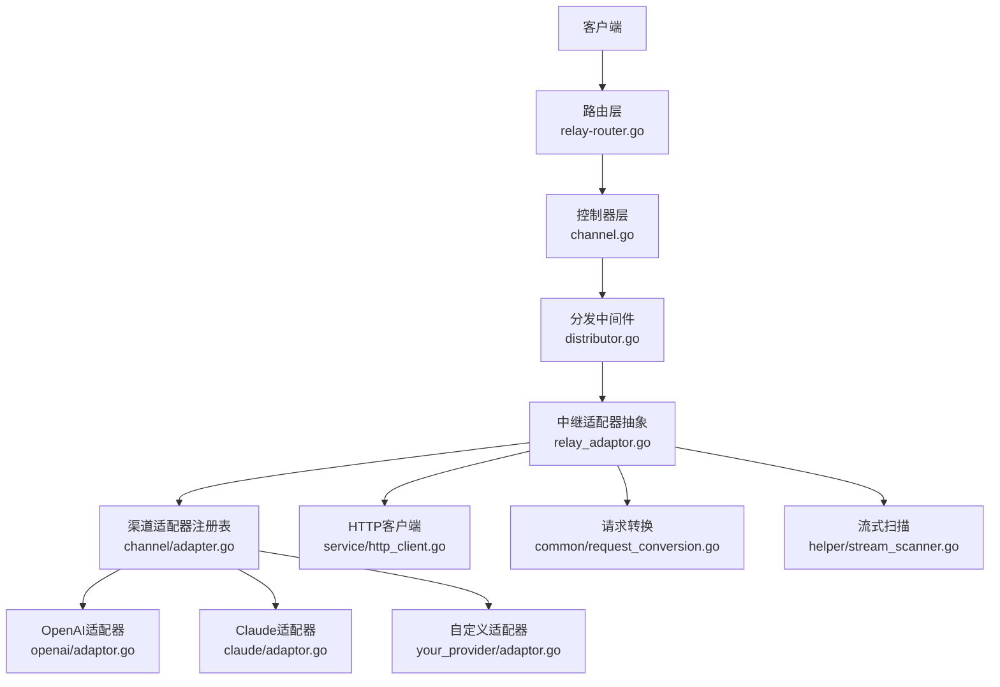
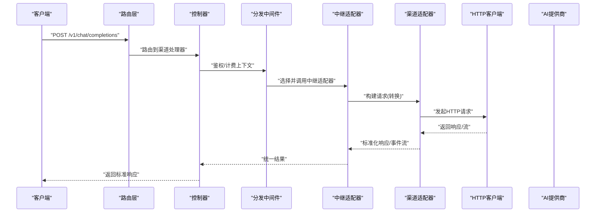
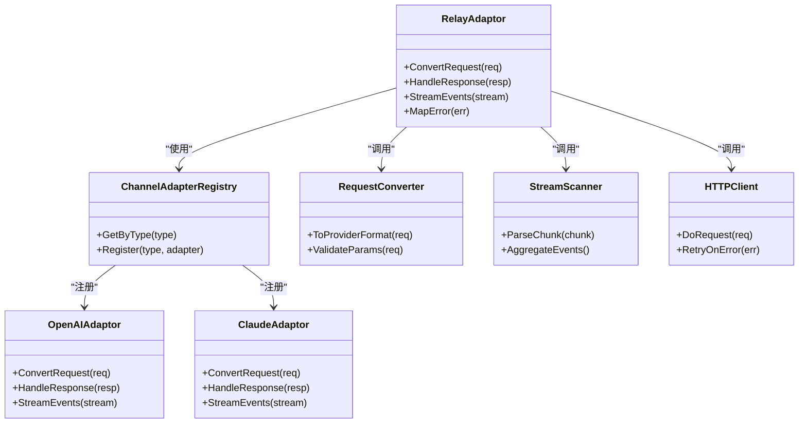

# 自定义渠道

<cite>
**本文引用的文件**   
- [main.go](file://main.go)
- [relay/relay_adaptor.go](file://relay/relay_adaptor.go)
- [relay/channel/adapter.go](file://relay/channel/adapter.go)
- [relay/channel/openai/adaptor.go](file://relay/channel/openai/adaptor.go)
- [relay/channel/claude/adaptor.go](file://relay/channel/claude/adaptor.go)
- [relay/common/request_conversion.go](file://relay/common/request_conversion.go)
- [relay/helper/stream_scanner.go](file://relay/helper/stream_scanner.go)
- [service/http_client.go](file://service/http_client.go)
- [model/channel.go](file://model/channel.go)
- [dto/channel_settings.go](file://dto/channel_settings.go)
- [constant/channel.go](file://constant/channel.go)
- [controller/channel.go](file://controller/channel.go)
- [router/relay-router.go](file://router/relay-router.go)
- [middleware/distributor.go](file://middleware/distributor.go)
</cite>

## 目录
1. [简介](#简介)
2. [项目结构](#项目结构)
3. [核心组件](#核心组件)
4. [架构总览](#架构总览)
5. [详细组件分析](#详细组件分析)
6. [依赖关系分析](#依赖关系分析)
7. [性能考量](#性能考量)
8. [故障排查指南](#故障排查指南)
9. [结论](#结论)
10. [附录：实现新AI提供商适配器步骤](#附录实现新ai提供商适配器步骤)

## 简介
本文件面向“自定义渠道”开发，目标是帮助开发者快速、正确地接入新的AI提供商。文档从系统架构、数据流、接口契约、领域模型到具体实现细节进行系统化说明，并提供可操作的步骤与常见问题解决方案。读者无需深入源码即可上手，同时为有经验的开发者提供足够的技术深度。

## 项目结构
本项目采用分层与按功能域组织相结合的结构：
- 路由层（router）：定义HTTP入口与转发规则
- 控制器层（controller）：请求校验、鉴权、计费上下文准备
- 中继层（relay）：渠道适配器的统一抽象与调度
- 渠道适配（relay/channel/*）：各AI提供商的具体实现
- 服务层（service）：HTTP客户端、计费、配额、错误处理等通用能力
- 模型与DTO（model, dto）：持久化结构与传输对象
- 常量与配置（constant, setting）：渠道类型、状态码范围、行为开关

图表来源
- [router/relay-router.go](file://router/relay-router.go)
- [controller/channel.go](file://controller/channel.go)
- [middleware/distributor.go](file://middleware/distributor.go)
- [relay/relay_adaptor.go](file://relay/relay_adaptor.go)
- [relay/channel/adapter.go](file://relay/channel/adapter.go)
- [relay/channel/openai/adaptor.go](file://relay/channel/openai/adaptor.go)
- [relay/channel/claude/adaptor.go](file://relay/channel/claude/adaptor.go)
- [service/http_client.go](file://service/http_client.go)
- [relay/common/request_conversion.go](file://relay/common/request_conversion.go)
- [relay/helper/stream_scanner.go](file://relay/helper/stream_scanner.go)

章节来源
- [main.go](file://main.go)
- [router/relay-router.go](file://router/relay-router.go)
- [controller/channel.go](file://controller/channel.go)
- [middleware/distributor.go](file://middleware/distributor.go)

## 核心组件
- 中继适配器抽象（Relay Adaptor）：定义统一的请求/响应转换、流式处理、错误映射与计费统计接口，屏蔽下游差异。
- 渠道适配器注册表（Channel Adapter Registry）：集中管理不同提供商的适配器实例，支持按渠道类型选择具体实现。
- 请求转换（Request Conversion）：将内部标准化请求转换为各提供商特定格式。
- 流式扫描（Stream Scanner）：解析SSE/流式响应片段，聚合为统一事件流。
- HTTP客户端（HTTP Client）：封装网络请求、重试、超时、SSRF防护、代理等能力。
- 渠道模型与设置（Channel Model & Settings）：描述渠道元数据、认证方式、限流策略、计费比率等。

章节来源
- [relay/relay_adaptor.go](file://relay/relay_adaptor.go)
- [relay/channel/adapter.go](file://relay/channel/adapter.go)
- [relay/common/request_conversion.go](file://relay/common/request_conversion.go)
- [relay/helper/stream_scanner.go](file://relay/helper/stream_scanner.go)
- [service/http_client.go](file://service/http_client.go)
- [model/channel.go](file://model/channel.go)
- [dto/channel_settings.go](file://dto/channel_settings.go)

## 架构总览
下图展示了从HTTP请求进入，到渠道适配器执行、下游调用、流式响应返回的整体流程。

图表来源
- [router/relay-router.go](file://router/relay-router.go)
- [controller/channel.go](file://controller/channel.go)
- [middleware/distributor.go](file://middleware/distributor.go)
- [relay/relay_adaptor.go](file://relay/relay_adaptor.go)
- [relay/channel/adapter.go](file://relay/channel/adapter.go)
- [service/http_client.go](file://service/http_client.go)

## 详细组件分析

### 中继适配器抽象（Relay Adaptor）
- 职责
  - 统一对外暴露的请求/响应转换接口
  - 流式响应的扫描与聚合
  - 错误码映射与计费统计
- 关键方法
  - 请求转换：将内部标准化请求转为下游格式
  - 响应处理：将下游响应转为内部标准格式
  - 流式处理：逐块读取并转换为统一事件
  - 错误映射：将下游错误码映射为系统错误
- 设计要点
  - 通过注册表按渠道类型选择实现
  - 与HTTP客户端解耦，便于替换或增强
  - 与计费/配额模块协作，记录用量

章节来源
- [relay/relay_adaptor.go](file://relay/relay_adaptor.go)
- [relay/channel/adapter.go](file://relay/channel/adapter.go)

### 渠道适配器注册表（Channel Adapter Registry）
- 职责
  - 维护渠道类型到适配器实现的映射
  - 提供按渠道ID或类型获取适配器的能力
- 关键点
  - 新增渠道需在此注册
  - 支持多实例（同一渠道类型多个Key）
  - 与渠道模型联动，动态加载配置

章节来源
- [relay/channel/adapter.go](file://relay/channel/adapter.go)
- [constant/channel.go](file://constant/channel.go)

### OpenAI 适配器示例
- 角色
  - 演示如何把内部请求转换为OpenAI格式
  - 演示如何解析OpenAI的流式响应
- 实现要点
  - 字段映射：模型名、消息、工具、温度等
  - 流式事件：delta内容拼接、usage统计
  - 错误映射：OpenAI错误码到系统错误

章节来源
- [relay/channel/openai/adaptor.go](file://relay/channel/openai/adaptor.go)

### Claude 适配器示例
- 角色
  - 演示非OpenAI协议的适配器实现
  - 展示不同的请求体结构与流式协议
- 实现要点
  - 消息格式转换（system/content/工具）
  - 流式增量合并与结束标记处理
  - 错误码与重试策略

章节来源
- [relay/channel/claude/adaptor.go](file://relay/channel/claude/adaptor.go)

### 请求转换（Request Conversion）
- 职责
  - 将内部标准化请求转换为各提供商特定格式
  - 处理参数覆盖、默认值填充、字段校验
- 关键点
  - 支持多种模式（chat/completions、responses、embedding等）
  - 与渠道设置联动（如max_tokens、temperature）
  - 可扩展的转换器注册机制

章节来源
- [relay/common/request_conversion.go](file://relay/common/request_conversion.go)

### 流式扫描（Stream Scanner）
- 职责
  - 解析SSE/流式响应片段
  - 将碎片事件聚合为标准事件流
- 关键点
  - 支持不同分隔符与编码
  - 错误中断与恢复
  - 与下游适配器的事件模型对齐

章节来源
- [relay/helper/stream_scanner.go](file://relay/helper/stream_scanner.go)

### HTTP客户端（HTTP Client）
- 职责
  - 统一发起HTTP请求，处理超时、重试、代理、SSRF防护
- 关键点
  - 连接池与并发控制
  - 可观测性：请求耗时、失败率
  - 安全：白名单域名、证书校验

章节来源
- [service/http_client.go](file://service/http_client.go)

### 渠道模型与设置（Channel Model & Settings）
- 职责
  - 描述渠道元数据、认证信息、限流、计费比率、启用状态
- 关键点
  - 渠道类型枚举与常量
  - 渠道设置项（密钥、基础URL、超时、重试次数）
  - 与定价/配额模块集成

章节来源
- [model/channel.go](file://model/channel.go)
- [dto/channel_settings.go](file://dto/channel_settings.go)
- [constant/channel.go](file://constant/channel.go)

## 依赖关系分析
- 耦合与内聚
  - 中继适配器与渠道适配器之间通过接口解耦
  - 请求转换与流式扫描作为独立工具模块，被多个适配器复用
  - HTTP客户端作为基础设施，被所有适配器共享
- 外部依赖
  - AI提供商API（OpenAI、Claude等）
  - 数据库（渠道配置、计费、日志）
  - 缓存（可选，用于模型列表、配额快照）

图表来源
- [relay/relay_adaptor.go](file://relay/relay_adaptor.go)
- [relay/channel/adapter.go](file://relay/channel/adapter.go)
- [relay/channel/openai/adaptor.go](file://relay/channel/openai/adaptor.go)
- [relay/channel/claude/adaptor.go](file://relay/channel/claude/adaptor.go)
- [relay/common/request_conversion.go](file://relay/common/request_conversion.go)
- [relay/helper/stream_scanner.go](file://relay/helper/stream_scanner.go)
- [service/http_client.go](file://service/http_client.go)

章节来源
- [relay/relay_adaptor.go](file://relay/relay_adaptor.go)
- [relay/channel/adapter.go](file://relay/channel/adapter.go)

## 性能考量
- 连接复用与并发
  - 使用HTTP客户端的连接池，避免频繁握手
  - 合理设置并发限制，防止下游限流触发
- 流式处理优化
  - 边读边写，减少内存占用
  - 事件聚合时避免不必要的拷贝
- 错误重试与熔断
  - 针对瞬时错误的指数退避重试
  - 对持续失败的渠道快速降级
- 缓存与预热
  - 模型列表、价格配置等静态数据缓存
  - 热点渠道的认证令牌预刷新

[本节为通用指导，不直接分析具体文件]

## 故障排查指南
- 常见错误
  - 认证失败：检查渠道密钥、基础URL、签名算法
  - 参数不合法：核对请求字段映射与必填项
  - 流式中断：检查网络稳定性、下游SSE格式
  - 超时与限流：调整超时、重试策略与并发
- 定位方法
  - 查看渠道测试接口与日志
  - 开启调试模式，打印请求/响应摘要
  - 使用HTTP客户端的可观测指标（耗时、失败率）
- 解决建议
  - 修正渠道设置（密钥、URL、超时）
  - 调整请求转换逻辑（字段映射、默认值）
  - 增加重试与降级策略

章节来源
- [controller/channel.go](file://controller/channel.go)
- [service/http_client.go](file://service/http_client.go)

## 结论
通过统一的“中继适配器+渠道适配器注册表”架构，本项目实现了多渠道的统一接入与扩展。开发者只需遵循请求转换、响应处理、错误映射与流式处理的约定，即可快速接入新的AI提供商。结合HTTP客户端、计费与配额模块，系统具备良好的可观测性与可运维性。

[本节为总结，不直接分析具体文件]

## 附录：实现新AI提供商适配器步骤
- 步骤概览
  1. 定义渠道类型与常量
  2. 创建适配器实现（请求转换、响应处理、流式处理、错误映射）
  3. 在注册表中注册适配器
  4. 编写单元测试与集成测试
  5. 配置渠道信息与测试验证

- 详细步骤
  - 定义渠道类型与常量
    - 在渠道常量中新增类型标识
    - 确保与渠道模型一致
  - 创建适配器实现
    - 实现请求转换：将内部标准化请求转为下游格式
    - 实现响应处理：将下游响应转为内部标准格式
    - 实现流式处理：解析SSE/流式响应，聚合为标准事件
    - 实现错误映射：将下游错误码映射为系统错误
  - 注册适配器
    - 在渠道适配器注册表中注册新适配器
    - 确保按渠道类型正确选择实现
  - 编写测试
    - 单元测试：覆盖请求转换、响应解析、错误映射
    - 集成测试：对接真实下游，验证端到端流程
  - 配置与验证
    - 在渠道管理中新增渠道，填写密钥、基础URL等
    - 使用渠道测试接口验证连通性与基本功能

- 参考实现
  - OpenAI适配器：展示OpenAI协议的适配方式
  - Claude适配器：展示非OpenAI协议的适配方式

章节来源
- [constant/channel.go](file://constant/channel.go)
- [relay/channel/openai/adaptor.go](file://relay/channel/openai/adaptor.go)
- [relay/channel/claude/adaptor.go](file://relay/channel/claude/adaptor.go)
- [relay/channel/adapter.go](file://relay/channel/adapter.go)