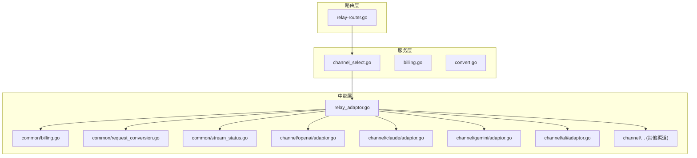
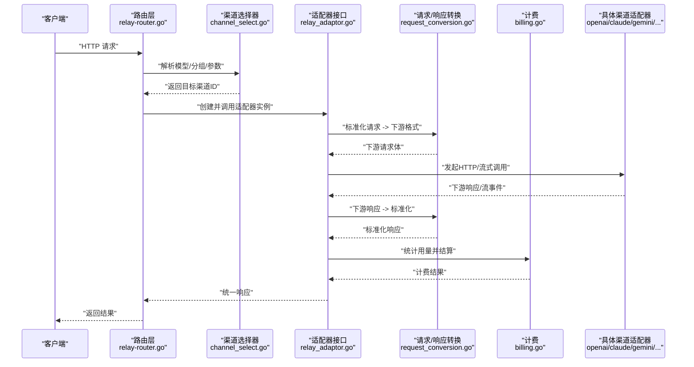
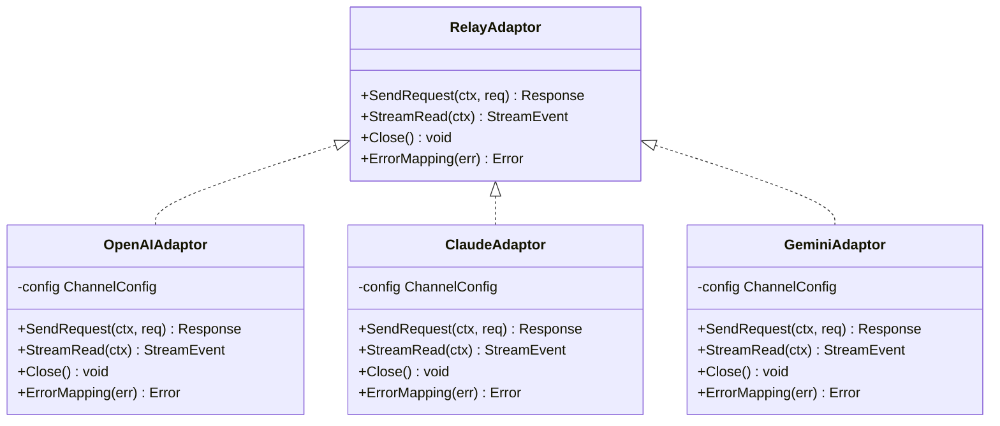
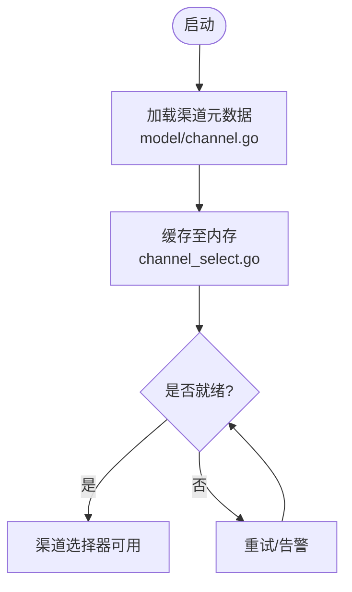
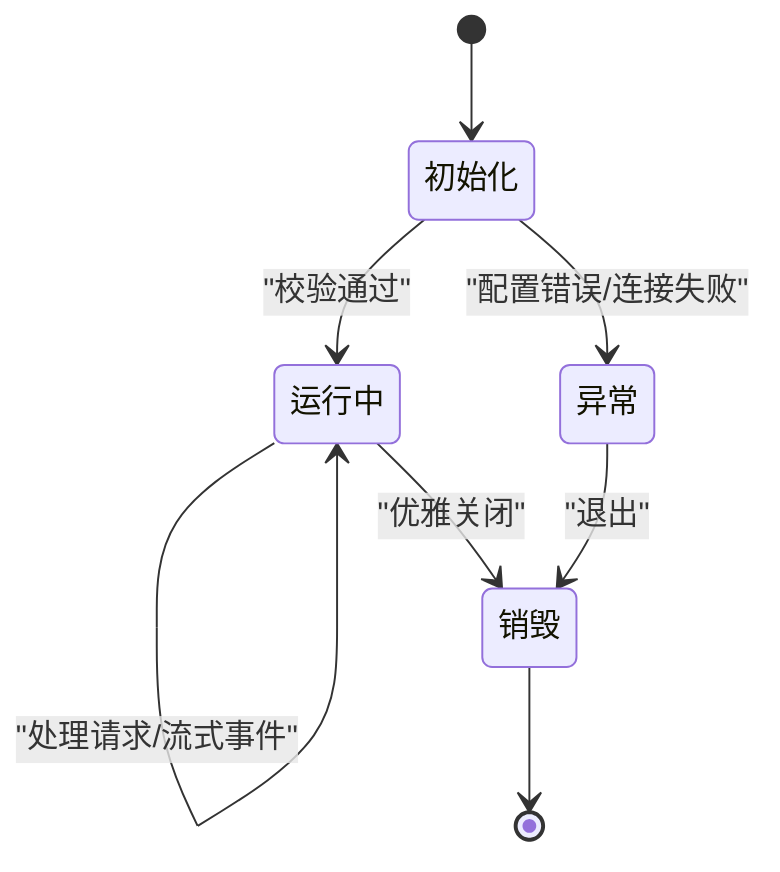
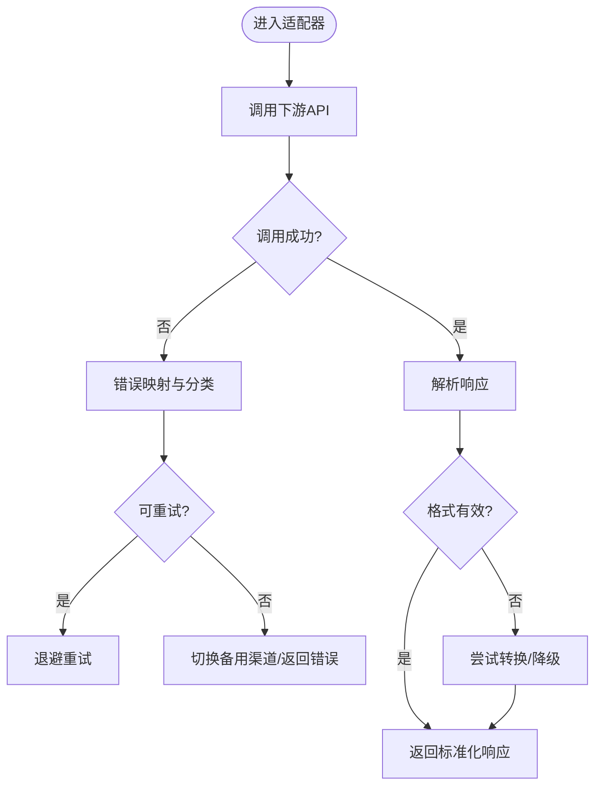
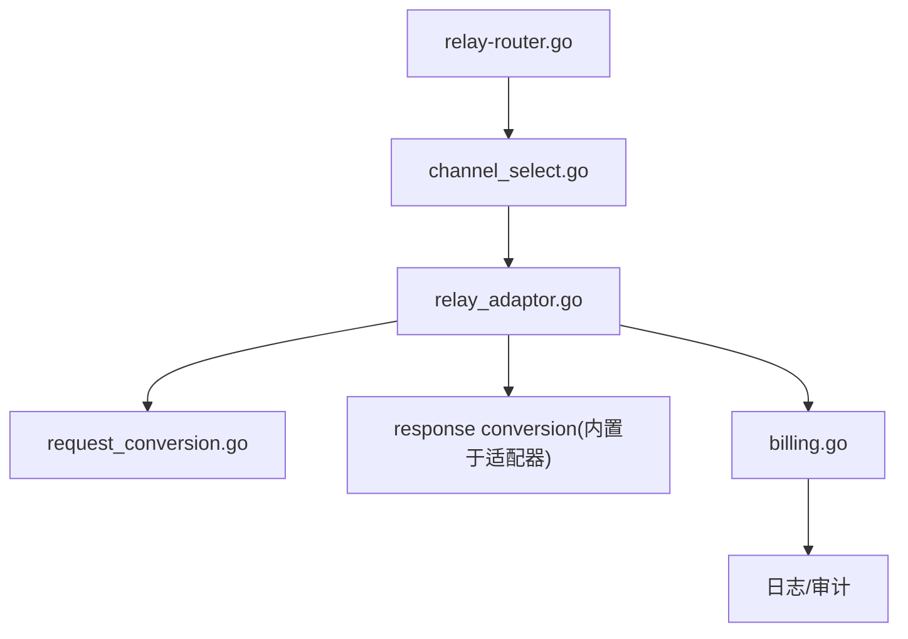
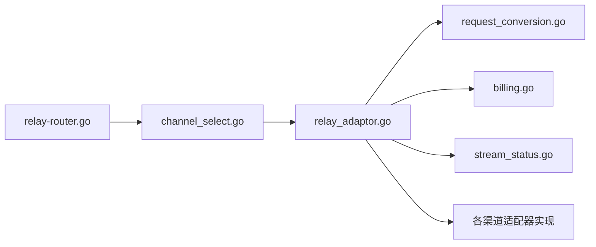

# 自定义渠道概述

<cite>
**本文引用的文件**   
- [relay_adaptor.go](file://relay/relay_adaptor.go)
- [adapter.go](file://relay/channel/adapter.go)
- [api_request.go](file://relay/channel/api_request.go)
- [billing.go](file://relay/common/billing.go)
- [request_conversion.go](file://relay/common/request_conversion.go)
- [stream_status.go](file://relay/common/stream_status.go)
- [channel.go](file://model/channel.go)
- [channel_select.go](file://service/channel_select.go)
- [relay-router.go](file://router/relay-router.go)
- [adaptor.go](file://relay/channel/openai/adaptor.go)
- [relay-openai.go](file://relay/channel/openai/relay-openai.go)
- [adaptor.go](file://relay/channel/claude/adaptor.go)
- [relay-claude.go](file://relay/channel/claude/relay-claude.go)
- [adaptor.go](file://relay/channel/gemini/adaptor.go)
- [relay-gemini.go](file://relay/channel/gemini/relay-gemini.go)
- [adaptor.go](file://relay/channel/ali/adaptor.go)
- [relay-baidu.go](file://relay/channel/baidu/relay-baidu.go)
- [adaptor.go](file://relay/channel/mistral/adaptor.go)
- [adaptor.go](file://relay/channel/xunfei/adaptor.go)
- [adaptor.go](file://relay/channel/zhipu/adaptor.go)
- [adaptor.go](file://relay/channel/vertex/adaptor.go)
- [adaptor.go](file://relay/channel/tencent/adaptor.go)
- [adaptor.go](file://relay/channel/volcengine/adaptor.go)
- [adaptor.go](file://relay/channel/xai/adaptor.go)
- [adaptor.go](file://relay/channel/cohere/adaptor.go)
- [adaptor.go](file://relay/channel/dify/adaptor.go)
- [adaptor.go](file://relay/channel/minimax/adaptor.go)
- [adaptor.go](file://relay/channel/moonshot/adaptor.go)
- [adaptor.go](file://relay/channel/jina/adaptor.go)
- [adaptor.go](file://relay/channel/siliconflow/adaptor.go)
- [adaptor.go](file://relay/channel/perplexity/adaptor.go)
- [adaptor.go](file://relay/channel/palm/adaptor.go)
- [adaptor.go](file://relay/channel/replicate/adaptor.go)
- [adaptor.go](file://relay/channel/submodel/adaptor.go)
- [adaptor.go](file://relay/channel/advancedcustom/adaptor.go)
</cite>

## 目录
1. [简介](#简介)
2. [项目结构](#项目结构)
3. [核心组件](#核心组件)
4. [架构总览](#架构总览)
5. [详细组件分析](#详细组件分析)
6. [依赖关系分析](#依赖关系分析)
7. [性能考虑](#性能考虑)
8. [故障排查指南](#故障排查指南)
9. [结论](#结论)
10. [附录](#附录)

## 简介
本章节面向希望扩展系统“自定义渠道”的开发者，系统性阐述自定义渠道的核心概念、适配器模式设计、注册与生命周期管理、错误处理策略，以及与请求路由、响应转换和计费系统的集成方式。通过阅读本章，你将理解如何在现有框架下实现一个新的AI提供商渠道适配器，并使其无缝融入统一网关。

## 项目结构
系统采用分层与按功能域组织相结合的结构：
- 入口与路由层：负责HTTP路由分发与中间件编排
- 服务层：负责渠道选择、认证、配额、计费、任务调度等
- 中继层（relay）：定义统一的适配器接口与通用能力，承载各具体渠道适配器的实现
- 模型与配置：持久化渠道元数据、定价、分组与运行期配置

图表来源
- [relay-router.go](file://router/relay-router.go)
- [channel_select.go](file://service/channel_select.go)
- [relay_adaptor.go](file://relay/relay_adaptor.go)
- [billing.go](file://relay/common/billing.go)
- [request_conversion.go](file://relay/common/request_conversion.go)
- [stream_status.go](file://relay/common/stream_status.go)
- [adaptor.go](file://relay/channel/openai/adaptor.go)
- [adaptor.go](file://relay/channel/claude/adaptor.go)
- [adaptor.go](file://relay/channel/gemini/adaptor.go)
- [adaptor.go](file://relay/channel/ali/adaptor.go)

章节来源
- [relay-router.go](file://router/relay-router.go)
- [channel_select.go](file://service/channel_select.go)
- [relay_adaptor.go](file://relay/relay_adaptor.go)

## 核心组件
- 适配器接口与基类：定义统一的请求/响应抽象、流式状态、计费与上下文传递
- 渠道选择器：根据模型、分组、权重、亲和性等策略选择目标渠道
- 请求转换器：将上游标准请求转换为下游各渠道特定格式
- 响应转换器：将下游响应标准化为统一格式，供上层计费与日志使用
- 计费模块：基于token、调用次数或自定义表达式进行计费结算
- 流式状态管理：维护SSE/流式传输的状态与中断语义

章节来源
- [relay_adaptor.go](file://relay/relay_adaptor.go)
- [channel_select.go](file://service/channel_select.go)
- [request_conversion.go](file://relay/common/request_conversion.go)
- [billing.go](file://relay/common/billing.go)
- [stream_status.go](file://relay/common/stream_status.go)

## 架构总览
下图展示了从HTTP请求到具体渠道适配器的完整链路，包括路由、渠道选择、请求转换、适配器执行、响应转换与计费。

图表来源
- [relay-router.go](file://router/relay-router.go)
- [channel_select.go](file://service/channel_select.go)
- [relay_adaptor.go](file://relay/relay_adaptor.go)
- [request_conversion.go](file://relay/common/request_conversion.go)
- [billing.go](file://relay/common/billing.go)
- [adaptor.go](file://relay/channel/openai/adaptor.go)
- [adaptor.go](file://relay/channel/claude/adaptor.go)
- [adaptor.go](file://relay/channel/gemini/adaptor.go)

## 详细组件分析

### 适配器模式与接口契约
- 适配器接口定义了统一的请求发送、流式读取、资源清理与错误上报方法
- 每个渠道适配器需实现该接口，完成鉴权、URL构建、请求封装、响应解码与错误映射
- 适配器通常持有渠道配置（如密钥、基础URL、超时）、上下文与日志记录器

图表来源
- [relay_adaptor.go](file://relay/relay_adaptor.go)
- [adaptor.go](file://relay/channel/openai/adaptor.go)
- [adaptor.go](file://relay/channel/claude/adaptor.go)
- [adaptor.go](file://relay/channel/gemini/adaptor.go)

章节来源
- [relay_adaptor.go](file://relay/relay_adaptor.go)
- [adaptor.go](file://relay/channel/openai/adaptor.go)
- [adaptor.go](file://relay/channel/claude/adaptor.go)
- [adaptor.go](file://relay/channel/gemini/adaptor.go)

### 渠道注册机制
- 渠道元数据在模型层持久化，包含类型、名称、权重、亲和性、可用模型列表等
- 运行时由服务层加载并缓存，渠道选择器依据策略动态挑选
- 新增渠道需在适配器包中提供实现，并在初始化阶段完成注册（若框架要求显式注册）

图表来源
- [channel.go](file://model/channel.go)
- [channel_select.go](file://service/channel_select.go)

章节来源
- [channel.go](file://model/channel.go)
- [channel_select.go](file://service/channel_select.go)

### 生命周期管理
- 初始化：校验配置、建立连接池、预热必要资源
- 运行期：处理并发请求、维护流式会话、监控健康状态
- 销毁：释放连接、关闭流、清理临时文件与缓存

章节来源
- [relay_adaptor.go](file://relay/relay_adaptor.go)
- [stream_status.go](file://relay/common/stream_status.go)

### 错误处理策略
- 网络错误：重试、熔断、降级到备用渠道
- 业务错误：映射为标准错误码与消息，便于前端展示
- 流式错误：及时中断流并上报，保证资源释放
- 计费错误：回滚或标记待人工核对

章节来源
- [relay_adaptor.go](file://relay/relay_adaptor.go)
- [stream_status.go](file://relay/common/stream_status.go)

### 与其他组件的集成
- 请求路由：根据路径与模型匹配选择渠道，支持多租户与权限控制
- 响应转换：统一输出OpenAI兼容格式或其他约定格式
- 计费系统：基于token计数、调用次数或表达式计算费用，支持分层计价与封顶

图表来源
- [relay-router.go](file://router/relay-router.go)
- [channel_select.go](file://service/channel_select.go)
- [relay_adaptor.go](file://relay/relay_adaptor.go)
- [request_conversion.go](file://relay/common/request_conversion.go)
- [billing.go](file://relay/common/billing.go)

章节来源
- [relay-router.go](file://router/relay-router.go)
- [channel_select.go](file://service/channel_select.go)
- [request_conversion.go](file://relay/common/request_conversion.go)
- [billing.go](file://relay/common/billing.go)

### 如何创建一个基本的自定义渠道适配器
步骤概览：
- 定义适配器结构体，嵌入或实现统一适配器接口
- 实现请求构造：鉴权头、URL拼接、请求体序列化
- 实现响应解析：区分文本、图片、音频等类型，统一字段映射
- 实现流式读取：逐块读取并转换为标准事件
- 实现错误映射：将下游错误码映射为系统标准错误
- 注册与配置：在渠道元数据中添加新渠道类型，确保选择器能识别

参考示例路径（仅用于定位，不展示代码内容）：
- 适配器接口与基类：[relay_adaptor.go](file://relay/relay_adaptor.go)
- 请求转换工具：[request_conversion.go](file://relay/common/request_conversion.go)
- 计费工具：[billing.go](file://relay/common/billing.go)
- 流式状态：[stream_status.go](file://relay/common/stream_status.go)
- 已有渠道实现参考：
  - [adaptor.go](file://relay/channel/openai/adaptor.go)
  - [relay-openai.go](file://relay/channel/openai/relay-openai.go)
  - [adaptor.go](file://relay/channel/claude/adaptor.go)
  - [relay-claude.go](file://relay/channel/claude/relay-claude.go)
  - [adaptor.go](file://relay/channel/gemini/adaptor.go)
  - [relay-gemini.go](file://relay/channel/gemini/relay-gemini.go)
  - [adaptor.go](file://relay/channel/ali/adaptor.go)
  - [relay-baidu.go](file://relay/channel/baidu/relay-baidu.go)
  - [adaptor.go](file://relay/channel/mistral/adaptor.go)
  - [adaptor.go](file://relay/channel/xunfei/adaptor.go)
  - [adaptor.go](file://relay/channel/zhipu/adaptor.go)
  - [adaptor.go](file://relay/channel/vertex/adaptor.go)
  - [adaptor.go](file://relay/channel/tencent/adaptor.go)
  - [adaptor.go](file://relay/channel/volcengine/adaptor.go)
  - [adaptor.go](file://relay/channel/xai/adaptor.go)
  - [adaptor.go](file://relay/channel/cohere/adaptor.go)
  - [adaptor.go](file://relay/channel/dify/adaptor.go)
  - [adaptor.go](file://relay/channel/minimax/adaptor.go)
  - [adaptor.go](file://relay/channel/moonshot/adaptor.go)
  - [adaptor.go](file://relay/channel/jina/adaptor.go)
  - [adaptor.go](file://relay/channel/siliconflow/adaptor.go)
  - [adaptor.go](file://relay/channel/perplexity/adaptor.go)
  - [adaptor.go](file://relay/channel/palm/adaptor.go)
  - [adaptor.go](file://relay/channel/replicate/adaptor.go)
  - [adaptor.go](file://relay/channel/submodel/adaptor.go)
  - [adaptor.go](file://relay/channel/advancedcustom/adaptor.go)

章节来源
- [relay_adaptor.go](file://relay/relay_adaptor.go)
- [request_conversion.go](file://relay/common/request_conversion.go)
- [billing.go](file://relay/common/billing.go)
- [stream_status.go](file://relay/common/stream_status.go)
- [adaptor.go](file://relay/channel/openai/adaptor.go)
- [relay-openai.go](file://relay/channel/openai/relay-openai.go)
- [adaptor.go](file://relay/channel/claude/adaptor.go)
- [relay-claude.go](file://relay/channel/claude/relay-claude.go)
- [adaptor.go](file://relay/channel/gemini/adaptor.go)
- [relay-gemini.go](file://relay/channel/gemini/relay-gemini.go)
- [adaptor.go](file://relay/channel/ali/adaptor.go)
- [relay-baidu.go](file://relay/channel/baidu/relay-baidu.go)
- [adaptor.go](file://relay/channel/mistral/adaptor.go)
- [adaptor.go](file://relay/channel/xunfei/adaptor.go)
- [adaptor.go](file://relay/channel/zhipu/adaptor.go)
- [adaptor.go](file://relay/channel/vertex/adaptor.go)
- [adaptor.go](file://relay/channel/tencent/adaptor.go)
- [adaptor.go](file://relay/channel/volcengine/adaptor.go)
- [adaptor.go](file://relay/channel/xai/adaptor.go)
- [adaptor.go](file://relay/channel/cohere/adaptor.go)
- [adaptor.go](file://relay/channel/dify/adaptor.go)
- [adaptor.go](file://relay/channel/minimax/adaptor.go)
- [adaptor.go](file://relay/channel/moonshot/adaptor.go)
- [adaptor.go](file://relay/channel/jina/adaptor.go)
- [adaptor.go](file://relay/channel/siliconflow/adaptor.go)
- [adaptor.go](file://relay/channel/perplexity/adaptor.go)
- [adaptor.go](file://relay/channel/palm/adaptor.go)
- [adaptor.go](file://relay/channel/replicate/adaptor.go)
- [adaptor.go](file://relay/channel/submodel/adaptor.go)
- [adaptor.go](file://relay/channel/advancedcustom/adaptor.go)

## 依赖关系分析
- 低耦合：适配器接口隔离了具体渠道差异，服务层仅依赖接口
- 高内聚：每个渠道适配器内部封装了鉴权、编解码、错误映射等细节
- 可扩展：新增渠道只需实现接口，无需改动核心逻辑
- 外部依赖：HTTP客户端、JSON编解码、流式协议库、计费表达式引擎

图表来源
- [relay-router.go](file://router/relay-router.go)
- [channel_select.go](file://service/channel_select.go)
- [relay_adaptor.go](file://relay/relay_adaptor.go)
- [request_conversion.go](file://relay/common/request_conversion.go)
- [billing.go](file://relay/common/billing.go)
- [stream_status.go](file://relay/common/stream_status.go)

章节来源
- [relay-router.go](file://router/relay-router.go)
- [channel_select.go](file://service/channel_select.go)
- [relay_adaptor.go](file://relay/relay_adaptor.go)

## 性能考虑
- 连接复用：使用HTTP连接池减少握手开销
- 流式处理：避免全量缓冲，降低内存峰值
- 并发控制：限制并发数与队列长度，防止雪崩
- 缓存策略：对模型列表、价格表等进行短期缓存
- 指标采集：关键路径埋点，监控延迟与错误率

## 故障排查指南
- 渠道不可用：检查配置、网络连通性与证书；查看健康检查与熔断状态
- 响应格式异常：对比下游API文档，确认字段映射与版本兼容性
- 计费偏差：核对token计数规则与表达式配置，检查边界用例
- 流式中断：检查服务端超时、代理设置与客户端取消信号传播

章节来源
- [relay_adaptor.go](file://relay/relay_adaptor.go)
- [stream_status.go](file://relay/common/stream_status.go)
- [billing.go](file://relay/common/billing.go)

## 结论
通过统一的适配器接口与完善的转换、计费与流式管理能力，系统能够以最小成本接入新的AI提供商渠道。遵循本文档的设计原则与实践建议，你可以快速实现一个稳定、可观测且易于维护的自定义渠道适配器。

## 附录
- 常用渠道适配器参考实现路径见“如何创建一个基本的自定义渠道适配器”一节
- 如需进一步定制，可在请求/响应转换层扩展字段映射与类型支持