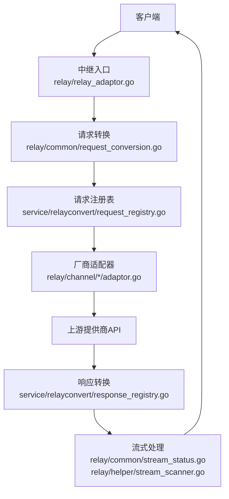
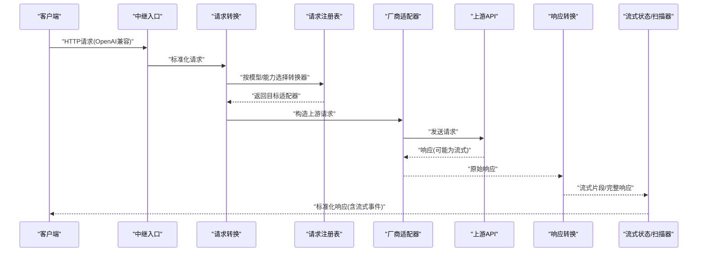
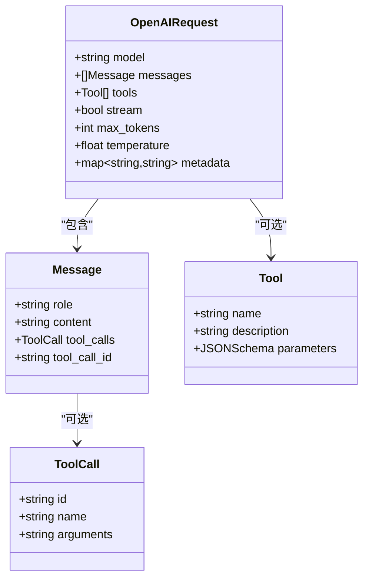
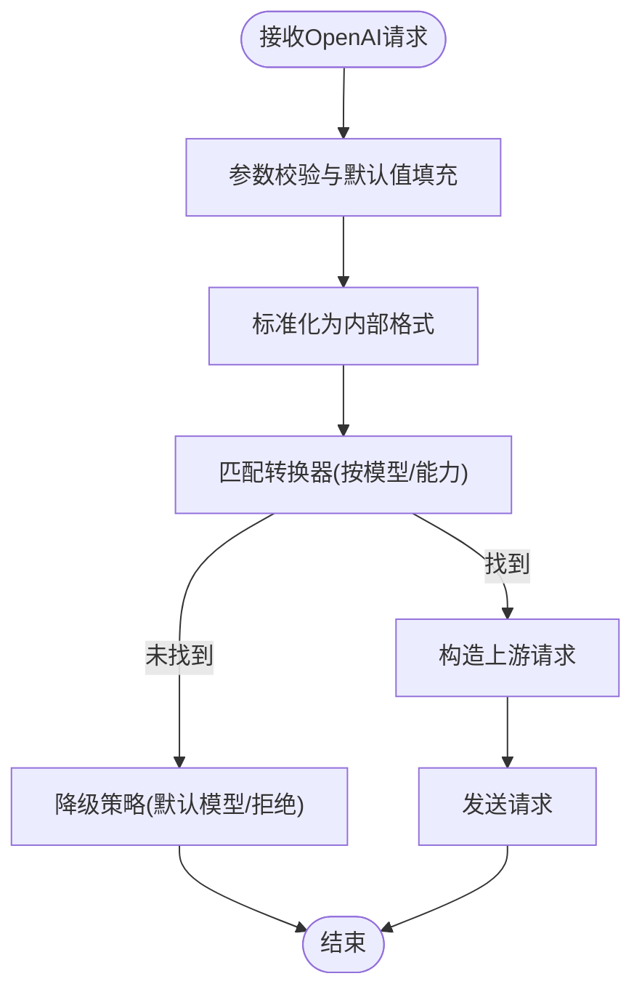
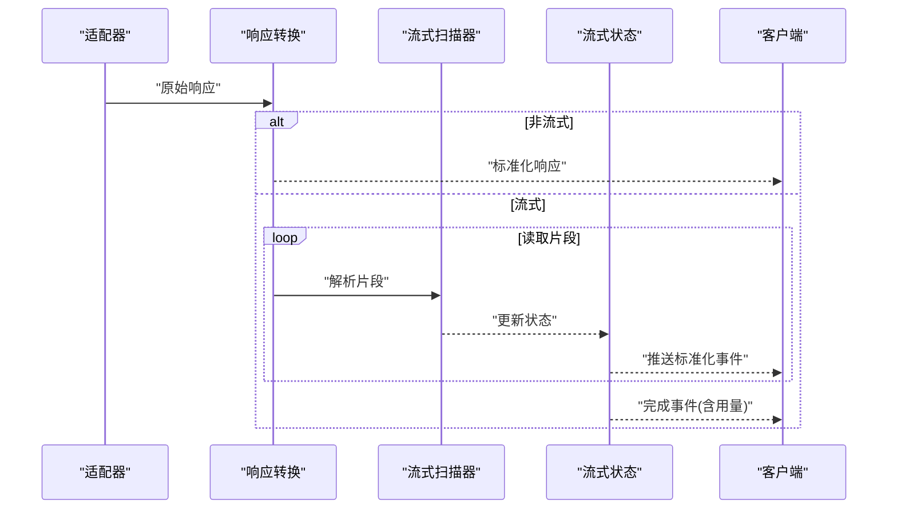
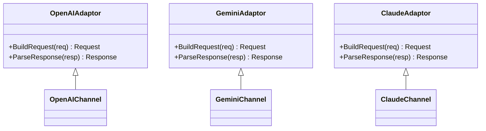
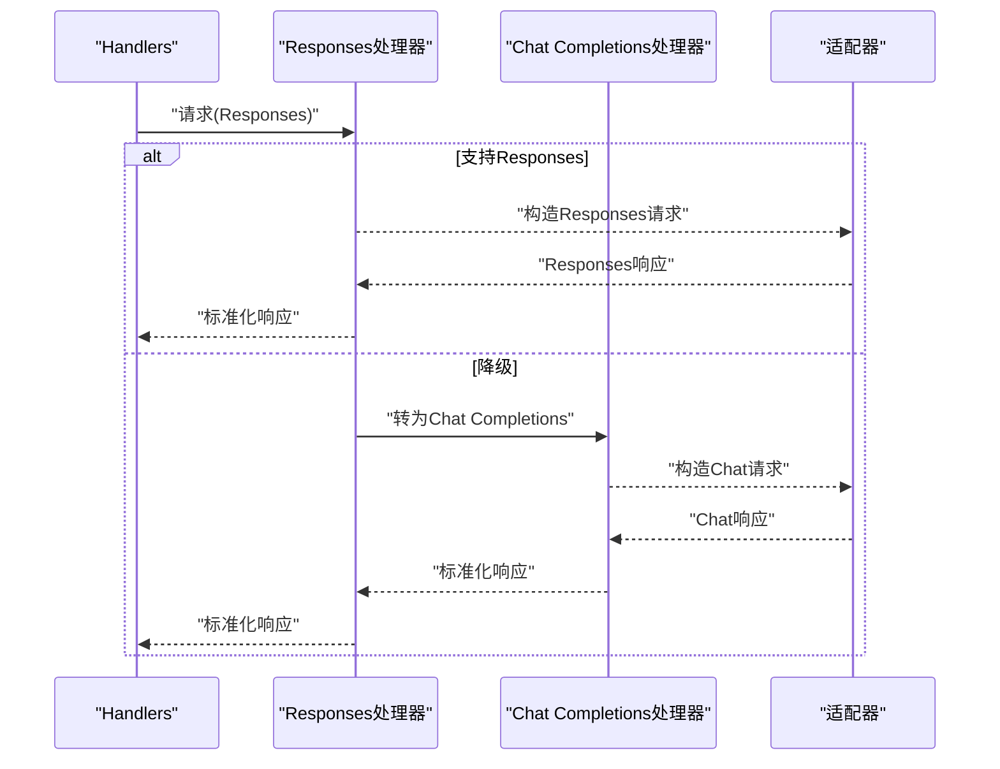
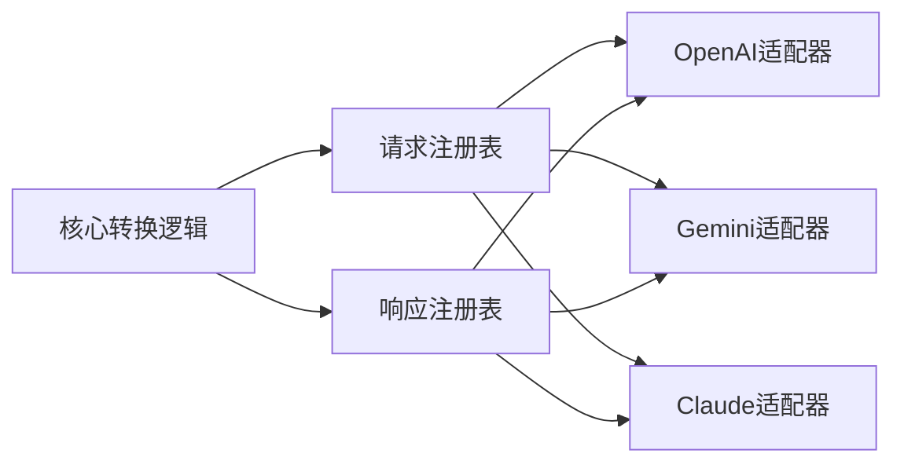

# 请求响应转换

<cite>
**本文档引用的文件**   
- [relay_adaptor.go](file://relay/relay_adaptor.go)
- [request_conversion.go](file://relay/common/request_conversion.go)
- [stream_status.go](file://relay/common/stream_status.go)
- [openai_request.go](file://dto/openai_request.go)
- [openai_response.go](file://dto/openai_response.go)
- [responses_handler.go](file://relay/responses_handler.go)
- [chat_completions_via_responses.go](file://relay/chat_completions_via_responses.go)
- [relay-openai.go](file://relay/channel/openai/relay-openai.go)
- [adaptor.go](file://relay/channel/openai/adaptor.go)
- [relay-gemini-native.go](file://relay/channel/gemini/relay-gemini-native.go)
- [adaptor.go](file://relay/channel/gemini/adaptor.go)
- [relay-claude.go](file://relay/channel/claude/relay-claude.go)
- [adaptor.go](file://relay/channel/claude/adaptor.go)
- [text_converter_registry.go](file://service/relayconvert/text_converter_registry.go)
- [response_registry.go](file://service/relayconvert/response_registry.go)
- [request_registry.go](file://service/relayconvert/request_registry.go)
- [media.go](file://service/relayconvert/media.go)
- [request_compat.go](file://service/relayconvert/request_compat.go)
- [response_compat.go](file://service/relayconvert/response_compat.go)
- [relay_info.go](file://relay/common/relay_info.go)
- [billing.go](file://relay/common/billing.go)
- [valid_request.go](file://relay/helper/valid_request.go)
- [stream_scanner.go](file://relay/helper/stream_scanner.go)
- [error.go](file://dto/error.go)
</cite>

## 目录
1. [简介](#简介)
2. [项目结构](#项目结构)
3. [核心组件](#核心组件)
4. [架构总览](#架构总览)
5. [详细组件分析](#详细组件分析)
6. [依赖关系分析](#依赖关系分析)
7. [性能考量](#性能考量)
8. [故障排查指南](#故障排查指南)
9. [结论](#结论)
10. [附录](#附录)

## 简介
本文件系统性阐述“请求-响应转换机制”，聚焦于将内部标准格式与多种AI提供商的特定格式进行双向转换。重点覆盖：
- OpenAI兼容格式的解析与生成（消息结构、工具调用、流式响应等）
- 参数映射规则、默认值处理与校验逻辑
- 不同提供商特殊字段与限制的适配示例
- 转换过程中的错误处理与降级策略

该机制通过统一的适配器与转换器，屏蔽上游OpenAI风格接口与下游各厂商协议差异，实现一致的调用体验与计费统计。

## 项目结构
转换相关代码主要分布在以下模块：
- relay层：统一入口、通道适配与转发、流式状态管理
- dto层：OpenAI兼容的请求/响应数据结构定义
- service/relayconvert：通用文本/媒体请求与响应的注册表与兼容性转换
- channel/*：具体厂商适配器的实现（OpenAI、Gemini、Claude等）
- helper：流式扫描、请求校验、计费辅助等工具

图表来源
- [relay_adaptor.go](file://relay/relay_adaptor.go)
- [request_conversion.go](file://relay/common/request_conversion.go)
- [request_registry.go](file://service/relayconvert/request_registry.go)
- [response_registry.go](file://service/relayconvert/response_registry.go)
- [stream_status.go](file://relay/common/stream_status.go)
- [stream_scanner.go](file://relay/helper/stream_scanner.go)

章节来源
- [relay_adaptor.go](file://relay/relay_adaptor.go)
- [request_conversion.go](file://relay/common/request_conversion.go)
- [stream_status.go](file://relay/common/stream_status.go)

## 核心组件
- 统一适配器接口与调度：负责选择具体厂商适配器并执行请求/响应转换
- OpenAI兼容DTO：标准化消息、工具调用、流式事件等结构
- 请求/响应注册表：按模型或能力路由到对应转换器
- 流式状态与扫描器：维护SSE/流式片段的状态机与增量解析
- 校验与默认值：对输入参数进行合法性检查与缺省填充
- 计费与元数据：记录用量、成本与上下文信息

章节来源
- [relay_adaptor.go](file://relay/relay_adaptor.go)
- [openai_request.go](file://dto/openai_request.go)
- [openai_response.go](file://dto/openai_response.go)
- [request_registry.go](file://service/relayconvert/request_registry.go)
- [response_registry.go](file://service/relayconvert/response_registry.go)
- [stream_status.go](file://relay/common/stream_status.go)
- [stream_scanner.go](file://relay/helper/stream_scanner.go)
- [valid_request.go](file://relay/helper/valid_request.go)
- [billing.go](file://relay/common/billing.go)

## 架构总览
整体流程分为“入站请求标准化”、“厂商适配”、“出站响应规范化”三阶段，支持同步与流式两种模式。

图表来源
- [relay_adaptor.go](file://relay/relay_adaptor.go)
- [request_conversion.go](file://relay/common/request_conversion.go)
- [request_registry.go](file://service/relayconvert/request_registry.go)
- [response_registry.go](file://service/relayconvert/response_registry.go)
- [stream_status.go](file://relay/common/stream_status.go)
- [stream_scanner.go](file://relay/helper/stream_scanner.go)

## 详细组件分析

### OpenAI兼容格式解析与生成
- 消息结构：系统/用户/助手/工具消息的统一表示，支持多模态内容块
- 工具调用：函数声明、调用ID、结果回传的标准字段映射
- 流式响应：增量片段、完成标志、使用量统计的标准化封装
- 默认值与校验：缺失字段补全、类型校验、范围限制

图表来源
- [openai_request.go](file://dto/openai_request.go)
- [openai_response.go](file://dto/openai_response.go)

章节来源
- [openai_request.go](file://dto/openai_request.go)
- [openai_response.go](file://dto/openai_response.go)

### 请求转换与注册表
- 请求转换：将OpenAI兼容请求转换为内部标准格式，补齐默认值并进行校验
- 注册表：根据模型名、能力标签选择对应的文本/媒体转换器
- 兼容性层：对不同版本/变体的OpenAI格式进行兼容处理

图表来源
- [request_conversion.go](file://relay/common/request_conversion.go)
- [request_registry.go](file://service/relayconvert/request_registry.go)
- [request_compat.go](file://service/relayconvert/request_compat.go)
- [valid_request.go](file://relay/helper/valid_request.go)

章节来源
- [request_conversion.go](file://relay/common/request_conversion.go)
- [request_registry.go](file://service/relayconvert/request_registry.go)
- [request_compat.go](file://service/relayconvert/request_compat.go)
- [valid_request.go](file://relay/helper/valid_request.go)

### 响应转换与流式处理
- 响应转换：将上游响应标准化为OpenAI兼容格式，包括非流式与流式
- 流式状态：维护SSE事件顺序、增量拼接、完成信号与使用量汇总
- 扫描器：逐字节/分片解析流式数据，降低内存占用

图表来源
- [response_registry.go](file://service/relayconvert/response_registry.go)
- [stream_scanner.go](file://relay/helper/stream_scanner.go)
- [stream_status.go](file://relay/common/stream_status.go)

章节来源
- [response_registry.go](file://service/relayconvert/response_registry.go)
- [stream_scanner.go](file://relay/helper/stream_scanner.go)
- [stream_status.go](file://relay/common/stream_status.go)

### 具体厂商适配器示例
- OpenAI适配器：直接透传OpenAI兼容格式，必要时做字段裁剪与补充
- Gemini适配器：将OpenAI消息映射为Gemini的content/part结构，处理工具调用与系统提示
- Claude适配器：将消息序列转换为Claude的消息数组，处理工具调用与系统消息

图表来源
- [adaptor.go](file://relay/channel/openai/adaptor.go)
- [relay-openai.go](file://relay/channel/openai/relay-openai.go)
- [adaptor.go](file://relay/channel/gemini/adaptor.go)
- [relay-gemini-native.go](file://relay/channel/gemini/relay-gemini-native.go)
- [adaptor.go](file://relay/channel/claude/adaptor.go)
- [relay-claude.go](file://relay/channel/claude/relay-claude.go)

章节来源
- [adaptor.go](file://relay/channel/openai/adaptor.go)
- [relay-openai.go](file://relay/channel/openai/relay-openai.go)
- [adaptor.go](file://relay/channel/gemini/adaptor.go)
- [relay-gemini-native.go](file://relay/channel/gemini/relay-gemini-native.go)
- [adaptor.go](file://relay/channel/claude/adaptor.go)
- [relay-claude.go](file://relay/channel/claude/relay-claude.go)

### Responses模式与Chat Completions互转
- Responses模式：基于新的Responses API语义进行请求/响应转换
- Chat Completions互转：在Responses与Chat Completions之间进行双向兼容

图表来源
- [responses_handler.go](file://relay/responses_handler.go)
- [chat_completions_via_responses.go](file://relay/chat_completions_via_responses.go)

章节来源
- [responses_handler.go](file://relay/responses_handler.go)
- [chat_completions_via_responses.go](file://relay/chat_completions_via_responses.go)

### 媒体与文本转换器
- 文本转换器：针对纯文本对话场景的轻量转换
- 媒体转换器：图像/音频/视频等多模态内容的字段映射与编码处理

章节来源
- [text_converter_registry.go](file://service/relayconvert/text_converter_registry.go)
- [media.go](file://service/relayconvert/media.go)

## 依赖关系分析
- 低耦合：适配器与转换器通过注册表解耦，新增厂商只需实现适配器并注册
- 高内聚：每个适配器集中处理特定厂商的字段映射与限制
- 外部依赖：上游API协议差异由适配器隔离，避免污染核心转换逻辑

图表来源
- [request_registry.go](file://service/relayconvert/request_registry.go)
- [response_registry.go](file://service/relayconvert/response_registry.go)
- [adaptor.go](file://relay/channel/openai/adaptor.go)
- [adaptor.go](file://relay/channel/gemini/adaptor.go)
- [adaptor.go](file://relay/channel/claude/adaptor.go)

章节来源
- [request_registry.go](file://service/relayconvert/request_registry.go)
- [response_registry.go](file://service/relayconvert/response_registry.go)

## 性能考量
- 流式处理：采用增量解析与状态机，减少内存峰值与首字节延迟
- 零拷贝优化：在可能的情况下复用缓冲区，避免重复分配
- 并发控制：限制并发请求数与速率，防止上游限流
- 缓存策略：对模型元数据、价格配置等进行短期缓存

[本节为通用指导，不直接分析具体文件]

## 故障排查指南
- 常见错误类型：参数非法、模型不存在、上游限流、流式中断
- 错误码映射：将上游错误码映射为标准错误结构，便于前端展示
- 降级策略：当某适配器不可用时，尝试其他适配器或默认模型
- 日志与追踪：记录关键路径的输入输出摘要，便于定位问题

章节来源
- [error.go](file://dto/error.go)
- [relay_info.go](file://relay/common/relay_info.go)

## 结论
本转换机制通过统一的适配器与注册表，实现了OpenAI兼容格式与多厂商协议的无缝对接。其设计强调可维护性、可扩展性与高性能，同时提供完善的错误处理与降级策略，确保在不同网络与上游条件下稳定运行。

## 附录
- 参数映射规则：详见各适配器实现中的字段映射逻辑
- 默认值处理：在请求转换阶段进行缺省填充
- 校验逻辑：基于正则、范围与业务规则进行综合验证
- 示例：参考各channel下的测试用例与文档

[本节为概念性说明，不直接分析具体文件]