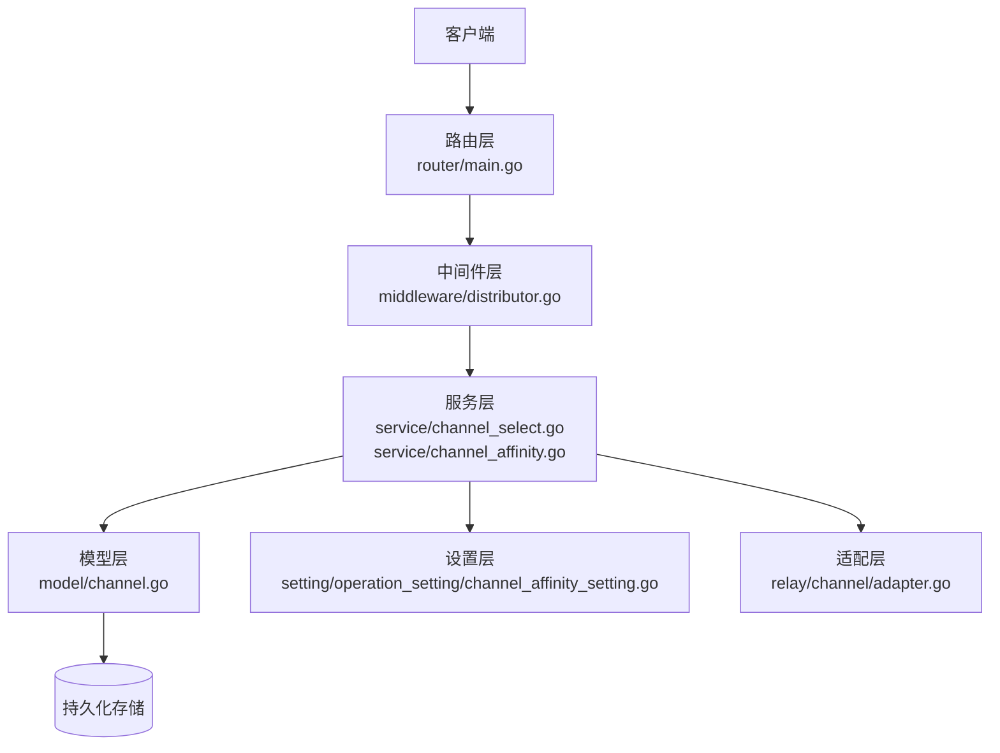
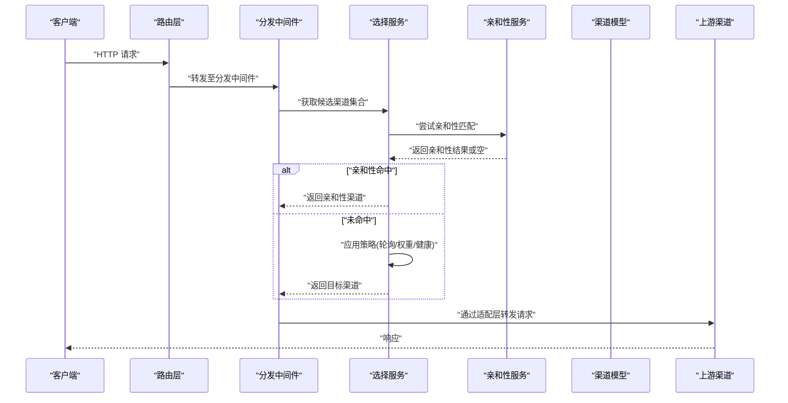
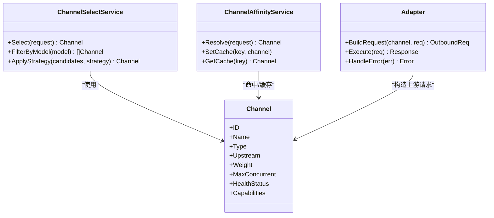
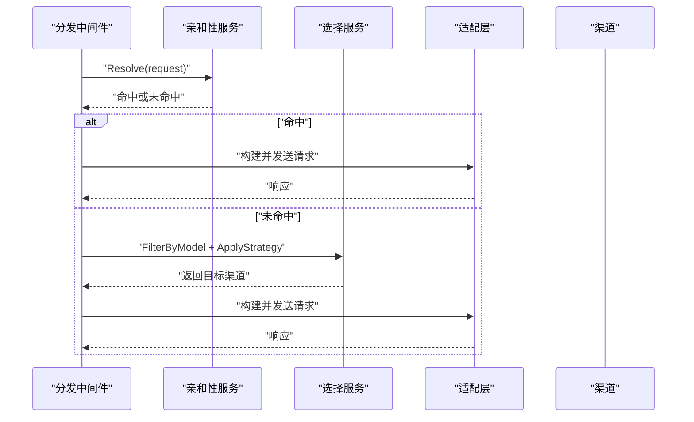
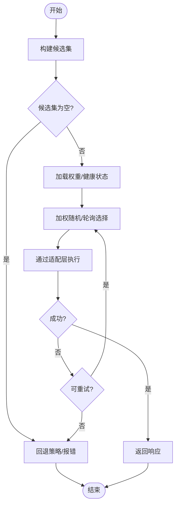
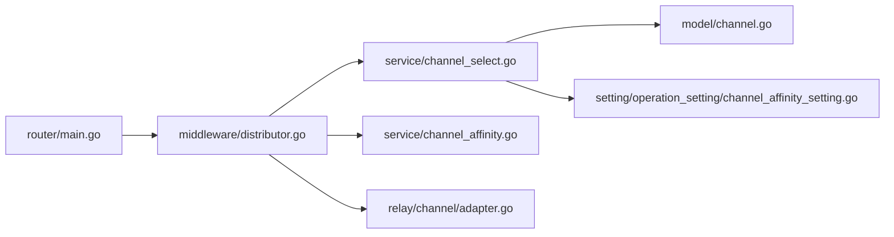

# 负载均衡

<cite>
**本文引用的文件**   
- [main.go](file://main.go)
- [router/main.go](file://router/main.go)
- [middleware/distributor.go](file://middleware/distributor.go)
- [service/channel_select.go](file://service/channel_select.go)
- [service/channel_affinity.go](file://service/channel_affinity.go)
- [setting/operation_setting/channel_affinity_setting.go](file://setting/operation_setting/channel_affinity_setting.go)
- [model/channel.go](file://model/channel.go)
- [relay/channel/adapter.go](file://relay/channel/adapter.go)
- [controller/channel.go](file://controller/channel.go)
- [dto/channel_settings.go](file://dto/channel_settings.go)
- [constant/channel.go](file://constant/channel.go)
</cite>

## 目录
1. [简介](#简介)
2. [项目结构](#项目结构)
3. [核心组件](#核心组件)
4. [架构总览](#架构总览)
5. [详细组件分析](#详细组件分析)
6. [依赖关系分析](#依赖关系分析)
7. [性能考量](#性能考量)
8. [故障排查指南](#故障排查指南)
9. [结论](#结论)
10. [附录](#附录)

## 简介
本文件面向“渠道负载均衡系统”的开发者与运维人员，系统性阐述该系统的实现细节、调用关系、接口契约、领域模型与使用模式。内容覆盖负载均衡策略（如轮询、权重、亲和性）、权重分配机制、亲和性规则、配置项与参数说明、返回值约定、与其他组件的关系，以及常见问题与解决方案。文档既适合初学者快速上手，也为有经验的开发者提供足够的技术深度。

## 项目结构
负载均衡能力贯穿路由、中间件、服务层与模型层：
- 路由层负责将请求分发到中间件处理链
- 中间件层承担请求分流与调度决策
- 服务层封装具体的选择算法、亲和性与缓存
- 模型层定义渠道实体与元数据
- DTO/常量用于传输与枚举

图表来源
- [router/main.go:1-200](file://router/main.go#L1-L200)
- [middleware/distributor.go:1-200](file://middleware/distributor.go#L1-L200)
- [service/channel_select.go:1-200](file://service/channel_select.go#L1-L200)
- [service/channel_affinity.go:1-200](file://service/channel_affinity.go#L1-L200)
- [model/channel.go:1-200](file://model/channel.go#L1-L200)
- [setting/operation_setting/channel_affinity_setting.go:1-200](file://setting/operation_setting/channel_affinity_setting.go#L1-L200)
- [relay/channel/adapter.go:1-200](file://relay/channel/adapter.go#L1-L200)

章节来源
- [router/main.go:1-200](file://router/main.go#L1-L200)
- [main.go:1-200](file://main.go#L1-L200)

## 核心组件
- 路由入口：注册并挂载中继与渠道相关路由，进入统一处理链路
- 分发中间件：解析请求上下文，决定走何种负载均衡策略
- 选择服务：实现具体策略（轮询、权重、亲和性等），维护候选集与状态
- 亲和性服务：基于用户/会话/模型等维度进行亲和性匹配与缓存
- 渠道模型：描述渠道能力、权重、健康状态、上游地址等
- 适配层：将内部请求转换为各上游渠道所需的格式并执行

章节来源
- [middleware/distributor.go:1-200](file://middleware/distributor.go#L1-L200)
- [service/channel_select.go:1-200](file://service/channel_select.go#L1-L200)
- [service/channel_affinity.go:1-200](file://service/channel_affinity.go#L1-L200)
- [model/channel.go:1-200](file://model/channel.go#L1-L200)
- [relay/channel/adapter.go:1-200](file://relay/channel/adapter.go#L1-L200)

## 架构总览
下图展示了从请求进入到渠道选择的整体流程，包括策略选择、亲和性命中、最终选择与回退逻辑。

图表来源
- [router/main.go:1-200](file://router/main.go#L1-L200)
- [middleware/distributor.go:1-200](file://middleware/distributor.go#L1-L200)
- [service/channel_select.go:1-200](file://service/channel_select.go#L1-L200)
- [service/channel_affinity.go:1-200](file://service/channel_affinity.go#L1-L200)
- [relay/channel/adapter.go:1-200](file://relay/channel/adapter.go#L1-L200)

## 详细组件分析

### 分发中间件（请求分流）
职责
- 解析请求上下文（用户、模型、租户等）
- 确定是否启用亲和性
- 调用选择服务完成渠道挑选
- 将目标渠道注入后续处理链

关键点
- 对异常与超时进行保护，避免阻塞主链路
- 支持可插拔的策略开关与降级路径

章节来源
- [middleware/distributor.go:1-200](file://middleware/distributor.go#L1-L200)

### 选择服务（负载均衡策略）
职责
- 维护候选渠道集合（按模型/分组过滤）
- 实现多种策略：轮询、加权轮询、最少活跃、健康优先
- 结合亲和性结果进行二次筛选
- 失败回退与重试策略

数据结构与复杂度
- 候选集通常以数组/切片表示，O(n) 扫描；加权策略可使用前缀和或堆优化
- 健康检查与熔断状态需并发安全访问

章节来源
- [service/channel_select.go:1-200](file://service/channel_select.go#L1-L200)

### 亲和性服务（会话/用户/模型亲和）
职责
- 根据键空间（用户ID、会话ID、模型名等）计算亲和性哈希
- 命中则直接返回对应渠道；未命中则回退到全局策略
- 维护亲和性缓存，降低热点键抖动

配置项
- 亲和性开关、过期时间、键空间优先级、回退策略

章节来源
- [service/channel_affinity.go:1-200](file://service/channel_affinity.go#L1-L200)
- [setting/operation_setting/channel_affinity_setting.go:1-200](file://setting/operation_setting/channel_affinity_setting.go#L1-L200)

### 渠道模型（领域实体）
字段要点
- 标识、名称、类型、上游地址、鉴权信息
- 权重、最大并发、健康状态、能力标签（支持的模型/功能）
- 配额、限流、灰度/白名单、亲和性绑定

约束
- 同一模型下多渠道路由需保证能力一致
- 权重与健康状态变更需原子更新

章节来源
- [model/channel.go:1-200](file://model/channel.go#L1-L200)
- [constant/channel.go:1-200](file://constant/channel.go#L1-L200)

### 适配层（协议转换与转发）
职责
- 将内部请求标准化为上游渠道所需格式
- 处理鉴权头、签名、重试、超时、流式响应
- 错误码映射与统一包装

章节来源
- [relay/channel/adapter.go:1-200](file://relay/channel/adapter.go#L1-L200)

### 控制器与设置（管理面）
职责
- 渠道增删改查、权重调整、健康探测、测试连通
- 亲和性模板与策略配置下发

章节来源
- [controller/channel.go:1-200](file://controller/channel.go#L1-L200)
- [dto/channel_settings.go:1-200](file://dto/channel_settings.go#L1-L200)

#### 类图（代码级关系）

图表来源
- [model/channel.go:1-200](file://model/channel.go#L1-L200)
- [service/channel_select.go:1-200](file://service/channel_select.go#L1-L200)
- [service/channel_affinity.go:1-200](file://service/channel_affinity.go#L1-L200)
- [relay/channel/adapter.go:1-200](file://relay/channel/adapter.go#L1-L200)

#### 序列图（一次带亲和性的选择流程）

图表来源
- [middleware/distributor.go:1-200](file://middleware/distributor.go#L1-L200)
- [service/channel_affinity.go:1-200](file://service/channel_affinity.go#L1-L200)
- [service/channel_select.go:1-200](file://service/channel_select.go#L1-L200)
- [relay/channel/adapter.go:1-200](file://relay/channel/adapter.go#L1-L200)

#### 流程图（加权轮询策略）

图表来源
- [service/channel_select.go:1-200](file://service/channel_select.go#L1-L200)

## 依赖关系分析
- 路由依赖中间件，中间件依赖选择与亲和性服务
- 选择服务依赖渠道模型与设置
- 适配层依赖渠道上游协议实现
- 控制器与DTO用于管理面配置与校验

图表来源
- [router/main.go:1-200](file://router/main.go#L1-L200)
- [middleware/distributor.go:1-200](file://middleware/distributor.go#L1-L200)
- [service/channel_select.go:1-200](file://service/channel_select.go#L1-L200)
- [service/channel_affinity.go:1-200](file://service/channel_affinity.go#L1-L200)
- [model/channel.go:1-200](file://model/channel.go#L1-L200)
- [setting/operation_setting/channel_affinity_setting.go:1-200](file://setting/operation_setting/channel_affinity_setting.go#L1-L200)
- [relay/channel/adapter.go:1-200](file://relay/channel/adapter.go#L1-L200)

章节来源
- [router/main.go:1-200](file://router/main.go#L1-L200)
- [middleware/distributor.go:1-200](file://middleware/distributor.go#L1-L200)

## 性能考量
- 候选集过滤与排序尽量在内存中完成，避免频繁IO
- 亲和性缓存应设置合理TTL与容量上限，防止热点键放大
- 加权选择可采用增量更新与前缀和，减少每次计算开销
- 并发安全：选择与亲和性操作需无锁或细粒度锁
- 超时与熔断：上游不可用时快速失败，避免雪崩
- 连接复用与池化：保持长连接，减少握手成本

## 故障排查指南
常见问题
- 亲和性不生效：检查键空间配置、缓存命中率、键生成一致性
- 权重不生效：确认权重更新已同步到内存视图，健康状态未置零
- 单点过载：查看并发限制与队列长度，适当扩容或调优权重
- 上游错误增多：检查健康探测阈值、熔断策略、重试次数
- 路由错配：核对模型能力标签与渠道能力是否匹配

定位步骤
- 查看中间件日志中的候选集与选择结果
- 检查亲和性缓存命中情况与键分布
- 验证渠道健康状态与权重快照
- 追踪适配层错误码与上游响应

章节来源
- [middleware/distributor.go:1-200](file://middleware/distributor.go#L1-L200)
- [service/channel_affinity.go:1-200](file://service/channel_affinity.go#L1-L200)
- [service/channel_select.go:1-200](file://service/channel_select.go#L1-L200)

## 结论
本负载均衡系统通过“中间件+服务层”的分层设计，实现了高内聚、低耦合的渠道选择与亲和性控制。配合灵活的权重与策略配置，能够在多上游、多模型的复杂场景下提供稳定高效的流量分发。建议在生产环境开启健康探测、亲和性缓存与熔断保护，并结合监控指标持续优化策略参数。

## 附录

### 配置选项与参数
- 亲和性
  - 开关：启用/禁用亲和性
  - 键空间：用户ID、会话ID、模型名等
  - TTL：缓存过期时间
  - 回退：未命中时的策略
- 策略
  - 轮询：均匀分配
  - 加权轮询：按权重分配
  - 最少活跃：优先选择负载低的渠道
  - 健康优先：仅选择健康渠道
- 渠道属性
  - 权重、最大并发、健康状态、能力标签、配额与限流

章节来源
- [setting/operation_setting/channel_affinity_setting.go:1-200](file://setting/operation_setting/channel_affinity_setting.go#L1-L200)
- [dto/channel_settings.go:1-200](file://dto/channel_settings.go#L1-L200)
- [model/channel.go:1-200](file://model/channel.go#L1-L200)

### 接口与返回值约定
- 选择接口
  - 输入：请求上下文（用户、模型、租户等）
  - 输出：目标渠道对象
  - 异常：无可用渠道、策略不可用
- 亲和性接口
  - 输入：键空间值
  - 输出：渠道或空
  - 异常：缓存不可用、键无效
- 适配层接口
  - 输入：渠道与标准化请求
  - 输出：上游响应或错误
  - 异常：超时、鉴权失败、上游错误

章节来源
- [service/channel_select.go:1-200](file://service/channel_select.go#L1-L200)
- [service/channel_affinity.go:1-200](file://service/channel_affinity.go#L1-L200)
- [relay/channel/adapter.go:1-200](file://relay/channel/adapter.go#L1-L200)

### 使用模式示例
- 基础轮询：适用于同质渠道，简单公平
- 加权轮询：按渠道能力与价格分配权重
- 亲和性优先：保障会话连续性，降低跨节点切换
- 健康优先：自动剔除异常渠道，提升可用性
- 混合策略：先亲和性命中，再按权重选择

章节来源
- [middleware/distributor.go:1-200](file://middleware/distributor.go#L1-L200)
- [service/channel_select.go:1-200](file://service/channel_select.go#L1-L200)
- [service/channel_affinity.go:1-200](file://service/channel_affinity.go#L1-L200)