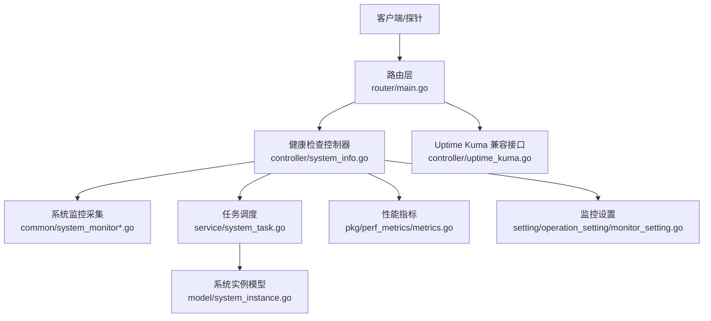
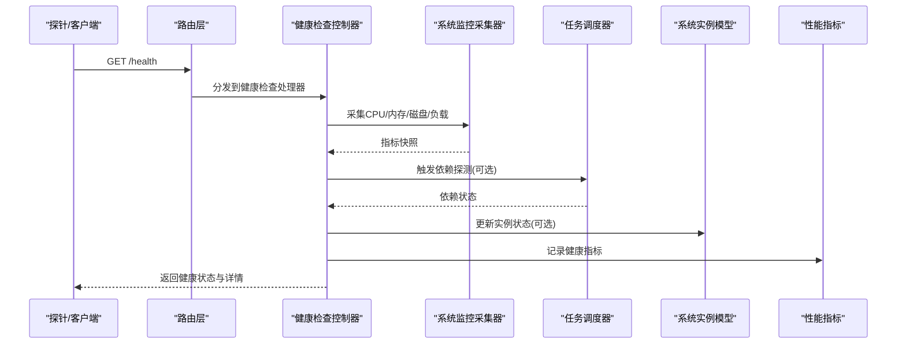
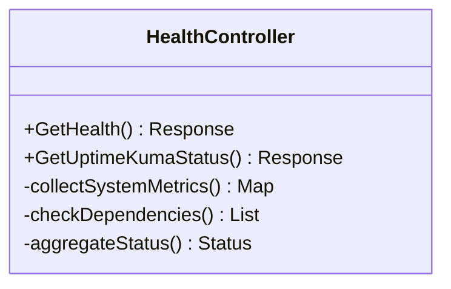
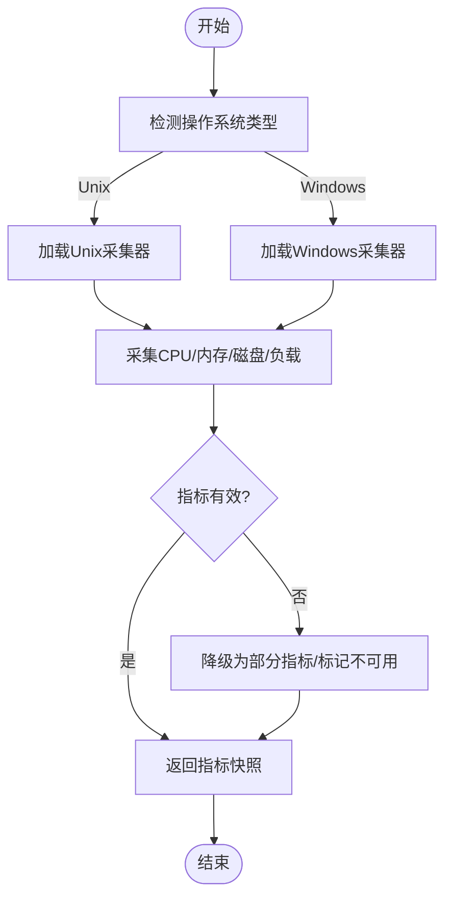
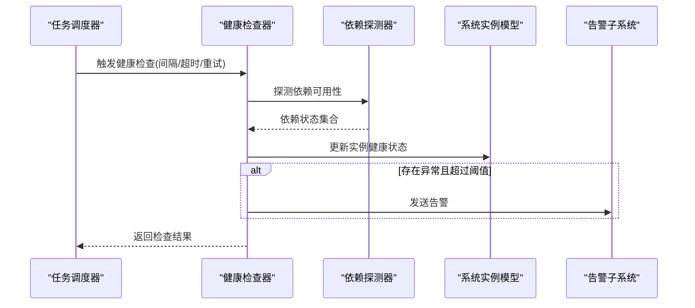
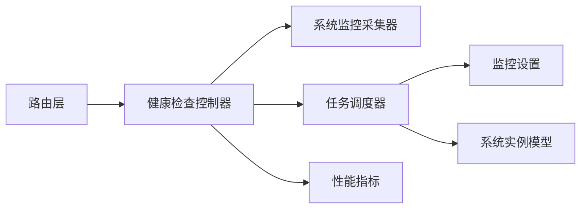

# 健康检查

<cite>
**本文引用的文件**   
- [main.go](file://main.go)
- [router/main.go](file://router/main.go)
- [controller/system_info.go](file://controller/system_info.go)
- [controller/uptime_kuma.go](file://controller/uptime_kuma.go)
- [common/system_monitor.go](file://common/system_monitor.go)
- [common/system_monitor_unix.go](file://common/system_monitor_unix.go)
- [common/system_monitor_windows.go](file://common/system_monitor_windows.go)
- [setting/operation_setting/monitor_setting.go](file://setting/operation_setting/monitor_setting.go)
- [service/system_task.go](file://service/system_task.go)
- [model/system_instance.go](file://model/system_instance.go)
- [pkg/perf_metrics/metrics.go](file://pkg/perf_metrics/metrics.go)
</cite>

## 目录
1. [简介](#简介)
2. [项目结构](#项目结构)
3. [核心组件](#核心组件)
4. [架构总览](#架构总览)
5. [详细组件分析](#详细组件分析)
6. [依赖关系分析](#依赖关系分析)
7. [性能考量](#性能考量)
8. [故障排查指南](#故障排查指南)
9. [结论](#结论)
10. [附录](#附录)

## 简介
本章节面向系统健康检查能力，覆盖服务状态检测、依赖服务可用性检查、故障自动恢复机制、检查间隔与超时配置、重试策略、结果聚合与展示、多实例环境下的状态同步与负载均衡、告警触发条件与通知机制，以及自定义扩展点与最佳实践。文档基于代码库中的实际实现进行说明，并给出可追溯的文件来源与图示。

## 项目结构
健康检查相关能力主要分布在以下模块：
- Web 路由与控制器：暴露健康检查接口（如 /health、Uptime Kuma 兼容端点）
- 系统监控采集：CPU、内存、磁盘、进程等指标采集
- 任务调度：周期性执行健康检查与上报
- 设置项：监控与检查的开关、阈值、间隔、超时等
- 模型层：系统实例信息持久化
- 性能指标：统一指标收集与导出

图表来源
- [router/main.go](file://router/main.go)
- [controller/system_info.go](file://controller/system_info.go)
- [controller/uptime_kuma.go](file://controller/uptime_kuma.go)
- [common/system_monitor.go](file://common/system_monitor.go)
- [common/system_monitor_unix.go](file://common/system_monitor_unix.go)
- [common/system_monitor_windows.go](file://common/system_monitor_windows.go)
- [service/system_task.go](file://service/system_task.go)
- [model/system_instance.go](file://model/system_instance.go)
- [pkg/perf_metrics/metrics.go](file://pkg/perf_metrics/metrics.go)
- [setting/operation_setting/monitor_setting.go](file://setting/operation_setting/monitor_setting.go)

章节来源
- [router/main.go](file://router/main.go)
- [controller/system_info.go](file://controller/system_info.go)
- [controller/uptime_kuma.go](file://controller/uptime_kuma.go)
- [common/system_monitor.go](file://common/system_monitor.go)
- [setting/operation_setting/monitor_setting.go](file://setting/operation_setting/monitor_setting.go)

## 核心组件
- 健康检查控制器：提供 HTTP 接口用于外部探针与健康中心查询服务状态
- 系统监控采集器：跨平台采集 CPU、内存、磁盘、负载等基础指标
- 任务调度器：定时触发健康检查、依赖探测、状态上报与恢复动作
- 监控设置：控制检查频率、超时、阈值、是否启用等
- 系统实例模型：存储实例标识、版本、运行态等元数据
- 性能指标：统一指标收集与导出，便于集成 Prometheus/Grafana

章节来源
- [controller/system_info.go](file://controller/system_info.go)
- [controller/uptime_kuma.go](file://controller/uptime_kuma.go)
- [common/system_monitor.go](file://common/system_monitor.go)
- [service/system_task.go](file://service/system_task.go)
- [setting/operation_setting/monitor_setting.go](file://setting/operation_setting/monitor_setting.go)
- [model/system_instance.go](file://model/system_instance.go)
- [pkg/perf_metrics/metrics.go](file://pkg/perf_metrics/metrics.go)

## 架构总览
健康检查的整体流程如下：
- 外部探针或控制台通过 HTTP 请求访问健康接口
- 控制器调用系统监控采集器获取当前实例指标
- 任务调度器按配置周期执行依赖探测与状态更新
- 检查结果聚合后返回给调用方，并可写入实例模型与指标系统
- 当检测到异常时，根据策略触发告警与自动恢复

图表来源
- [controller/system_info.go](file://controller/system_info.go)
- [common/system_monitor.go](file://common/system_monitor.go)
- [service/system_task.go](file://service/system_task.go)
- [model/system_instance.go](file://model/system_instance.go)
- [pkg/perf_metrics/metrics.go](file://pkg/perf_metrics/metrics.go)

## 详细组件分析

### 健康检查控制器
- 职责：对外暴露健康检查接口，聚合系统指标与依赖状态，返回统一格式
- 输入：HTTP 请求（路径、查询参数）
- 输出：健康状态、指标摘要、依赖列表及状态
- 关键点：
  - 支持快速健康检查（仅存活）与深度健康检查（含依赖探测）
  - 支持 Uptime Kuma 兼容响应格式
  - 将关键指标写入性能指标系统以便可视化

章节来源
- [controller/system_info.go](file://controller/system_info.go)
- [controller/uptime_kuma.go](file://controller/uptime_kuma.go)

#### 类图（健康检查控制器）

图表来源
- [controller/system_info.go](file://controller/system_info.go)
- [controller/uptime_kuma.go](file://controller/uptime_kuma.go)

### 系统监控采集器
- 职责：跨平台采集系统级指标（CPU、内存、磁盘、负载、进程数等）
- 实现要点：
  - Unix 与 Windows 分别实现适配层，保证一致性
  - 提供轻量级快照接口，避免阻塞主流程
  - 错误处理：采集失败时降级为部分指标或标记不可用

章节来源
- [common/system_monitor.go](file://common/system_monitor.go)
- [common/system_monitor_unix.go](file://common/system_monitor_unix.go)
- [common/system_monitor_windows.go](file://common/system_monitor_windows.go)

#### 流程图（系统监控采集）

图表来源
- [common/system_monitor.go](file://common/system_monitor.go)
- [common/system_monitor_unix.go](file://common/system_monitor_unix.go)
- [common/system_monitor_windows.go](file://common/system_monitor_windows.go)

### 任务调度器（健康检查与依赖探测）
- 职责：周期性执行健康检查、依赖探测、状态上报与恢复动作
- 配置项：检查间隔、超时、重试次数、失败阈值
- 行为：
  - 定时触发健康检查任务
  - 对关键依赖（数据库、缓存、上游服务等）发起可用性探测
  - 根据结果更新实例状态，必要时触发告警或自动恢复

章节来源
- [service/system_task.go](file://service/system_task.go)
- [setting/operation_setting/monitor_setting.go](file://setting/operation_setting/monitor_setting.go)

#### 序列图（健康检查任务）

图表来源
- [service/system_task.go](file://service/system_task.go)
- [model/system_instance.go](file://model/system_instance.go)

### 监控设置（检查间隔、超时、重试）
- 检查间隔：定义健康检查与依赖探测的执行周期
- 超时设置：单次检查的最大等待时间
- 重试策略：失败后的重试次数与退避策略
- 阈值配置：触发告警或进入不健康状态的阈值

章节来源
- [setting/operation_setting/monitor_setting.go](file://setting/operation_setting/monitor_setting.go)

### 系统实例模型（状态持久化）
- 字段：实例ID、版本、运行状态、最后检查时间、健康标签等
- 用途：供控制台展示、负载均衡决策、多实例协调

章节来源
- [model/system_instance.go](file://model/system_instance.go)

### 性能指标（统一指标收集）
- 指标类别：系统资源、健康状态、依赖可用性、任务执行耗时
- 导出方式：Prometheus 文本格式或内部指标总线

章节来源
- [pkg/perf_metrics/metrics.go](file://pkg/perf_metrics/metrics.go)

## 依赖关系分析
健康检查模块与系统其他部分的耦合关系如下：
- 控制器依赖监控采集器与任务调度器
- 任务调度器依赖监控设置与实例模型
- 控制器将指标写入性能指标系统
- 路由层负责将健康接口暴露给外部

图表来源
- [router/main.go](file://router/main.go)
- [controller/system_info.go](file://controller/system_info.go)
- [common/system_monitor.go](file://common/system_monitor.go)
- [service/system_task.go](file://service/system_task.go)
- [setting/operation_setting/monitor_setting.go](file://setting/operation_setting/monitor_setting.go)
- [model/system_instance.go](file://model/system_instance.go)
- [pkg/perf_metrics/metrics.go](file://pkg/perf_metrics/metrics.go)

章节来源
- [router/main.go](file://router/main.go)
- [controller/system_info.go](file://controller/system_info.go)
- [service/system_task.go](file://service/system_task.go)
- [setting/operation_setting/monitor_setting.go](file://setting/operation_setting/monitor_setting.go)

## 性能考量
- 采集器应使用轻量级接口，避免在健康检查中引入额外延迟
- 依赖探测需设置合理超时与并发限制，防止雪崩
- 指标写入采用异步或批处理方式，降低对主流程影响
- 在多实例环境下，建议通过共享存储或消息队列同步健康状态

[本节为通用指导，无需具体文件引用]

## 故障排查指南
常见问题与定位方法：
- 健康检查超时：检查网络连通性、依赖服务响应时间、超时配置是否过短
- 依赖探测失败：确认依赖服务地址、认证、防火墙策略；查看依赖探测日志
- 指标缺失：验证指标采集权限与路径；检查性能指标导出是否正常
- 多实例状态不一致：检查实例间状态同步机制（共享存储/注册中心）与负载均衡策略

章节来源
- [controller/system_info.go](file://controller/system_info.go)
- [service/system_task.go](file://service/system_task.go)
- [pkg/perf_metrics/metrics.go](file://pkg/perf_metrics/metrics.go)

## 结论
健康检查功能通过控制器、监控采集器、任务调度器与设置项协同工作，实现了服务状态检测、依赖可用性检查与故障自动恢复的基础能力。结合性能指标与实例模型，可在控制台与外部监控系统中进行可视化与自动化运维。建议在多实例环境中完善状态同步与负载均衡策略，并持续优化检查间隔、超时与重试策略以提升稳定性与可观测性。

[本节为总结性内容，无需具体文件引用]

## 附录
- 自定义扩展点：
  - 新增依赖探测器：实现统一的探测接口，注册到任务调度器
  - 自定义指标：在性能指标系统中添加新的指标类别与采集逻辑
  - 告警规则：基于阈值与事件流配置告警策略与通知渠道
- 最佳实践：
  - 分层健康检查：存活检查、就绪检查、依赖检查分离
  - 渐进式恢复：失败后指数退避重试，避免抖动
  - 可观测性：统一指标、日志与追踪，便于问题定位

[本节为概念性内容，无需具体文件引用]