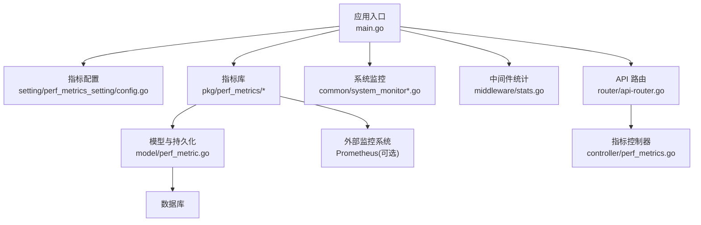
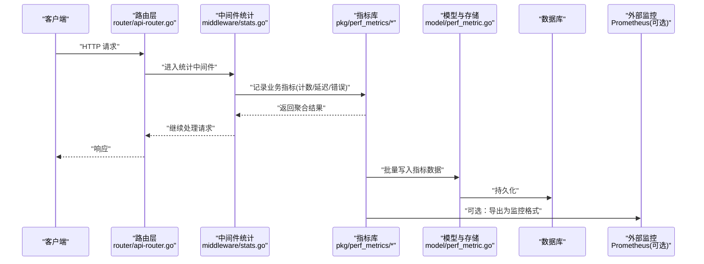
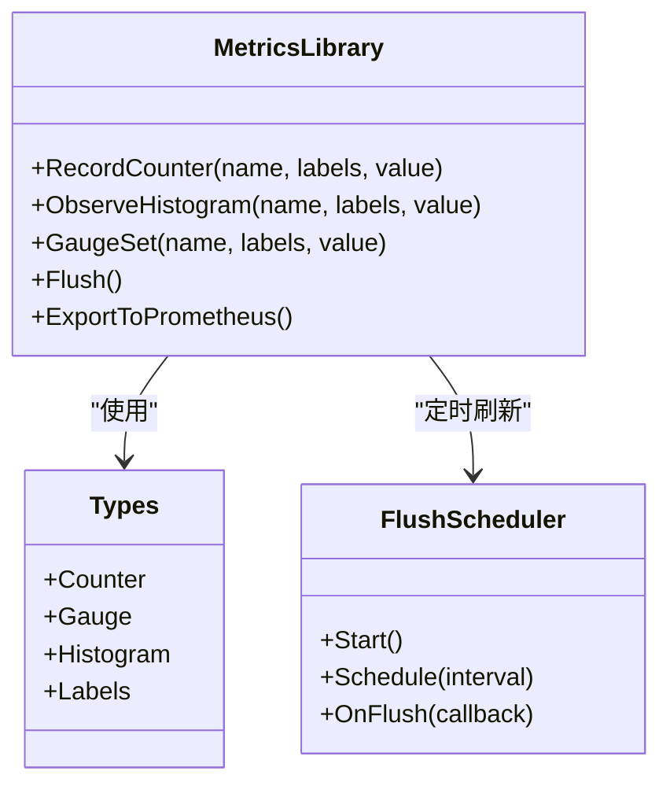
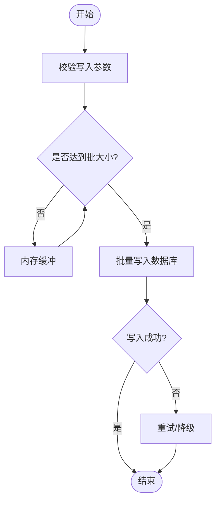
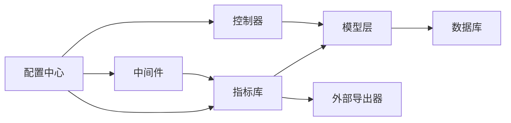

# 性能指标

<cite>
**本文引用的文件**   
- [main.go](file://main.go)
- [perf_metrics_setting/config.go](file://setting/perf_metrics_setting/config.go)
- [pkg/perf_metrics/metrics.go](file://pkg/perf_metrics/metrics.go)
- [pkg/perf_metrics/flush.go](file://pkg/perf_metrics/flush.go)
- [pkg/perf_metrics/types.go](file://pkg/perf_metrics/types.go)
- [model/perf_metric.go](file://model/perf_metric.go)
- [controller/perf_metrics.go](file://controller/perf_metrics.go)
- [router/api-router.go](file://router/api-router.go)
- [common/system_monitor.go](file://common/system_monitor.go)
- [common/system_monitor_unix.go](file://common/system_monitor_unix.go)
- [common/system_monitor_windows.go](file://common/system_monitor_windows.go)
- [middleware/stats.go](file://middleware/stats.go)
- [common/performance_config.go](file://common/performance_config.go)
</cite>

## 目录
1. [简介](#简介)
2. [项目结构](#项目结构)
3. [核心组件](#核心组件)
4. [架构总览](#架构总览)
5. [详细组件分析](#详细组件分析)
6. [依赖关系分析](#依赖关系分析)
7. [性能考量](#性能考量)
8. [故障排查指南](#故障排查指南)
9. [结论](#结论)
10. [附录](#附录)

## 简介
本文件面向“性能指标收集系统”的开发者与运维人员，系统性阐述自定义指标定义、采集机制、数据聚合与持久化存储的实现细节。文档涵盖指标类型、标签体系、查询语法、与 Prometheus 等监控系统的集成方式，以及高并发写入优化、导出备份清理策略、基准测试与最佳实践。内容基于仓库中的实际代码结构与实现进行归纳，确保可追溯、可落地。

## 项目结构
性能指标相关能力主要分布在以下模块：
- 配置层：性能指标开关与参数（setting/perf_metrics_setting）
- 指标库：指标定义、类型、标签、批量刷新（pkg/perf_metrics）
- 模型与存储：指标数据模型与数据库持久化（model/perf_metric.go）
- 控制器与路由：对外暴露指标查询与管理接口（controller/perf_metrics.go, router/api-router.go）
- 系统监控：操作系统级指标采集（common/system_monitor*.go）
- 中间件：请求级统计与埋点（middleware/stats.go）
- 启动入口：服务初始化与指标子系统装配（main.go）

图表来源 
- [main.go](file://main.go)
- [setting/perf_metrics_setting/config.go](file://setting/perf_metrics_setting/config.go)
- [pkg/perf_metrics/metrics.go](file://pkg/perf_metrics/metrics.go)
- [pkg/perf_metrics/flush.go](file://pkg/perf_metrics/flush.go)
- [pkg/perf_metrics/types.go](file://pkg/perf_metrics/types.go)
- [model/perf_metric.go](file://model/perf_metric.go)
- [controller/perf_metrics.go](file://controller/perf_metrics.go)
- [router/api-router.go](file://router/api-router.go)
- [common/system_monitor.go](file://common/system_monitor.go)

章节来源
- [main.go](file://main.go)
- [setting/perf_metrics_setting/config.go](file://setting/perf_metrics_setting/config.go)
- [pkg/perf_metrics/metrics.go](file://pkg/perf_metrics/metrics.go)
- [pkg/perf_metrics/flush.go](file://pkg/perf_metrics/flush.go)
- [pkg/perf_metrics/types.go](file://pkg/perf_metrics/types.go)
- [model/perf_metric.go](file://model/perf_metric.go)
- [controller/perf_metrics.go](file://controller/perf_metrics.go)
- [router/api-router.go](file://router/api-router.go)
- [common/system_monitor.go](file://common/system_monitor.go)

## 核心组件
- 指标配置中心
  - 负责加载并管理性能指标的开关、采样率、批大小、刷新周期等参数。
  - 提供全局访问入口，供指标库与中间件读取。
- 指标库（pkg/perf_metrics）
  - 定义指标类型（计数器、仪表盘、直方图等）、标签键值、维度组合。
  - 提供记录、聚合、批量刷新到存储或外部系统的接口。
- 模型与持久化（model/perf_metric.go）
  - 定义指标数据的表结构、索引、分区策略（如按时间）。
  - 封装增删改查与批量写入方法。
- 系统监控（common/system_monitor*.go）
  - 采集 CPU、内存、磁盘、网络等系统级指标。
  - 适配不同操作系统平台。
- 中间件统计（middleware/stats.go）
  - 在请求链路中埋点，记录 QPS、延迟、错误率等业务指标。
- API 控制器与路由（controller/perf_metrics.go, router/api-router.go）
  - 暴露指标查询、导出、清理等 RESTful 接口。
  - 统一鉴权与限流。

章节来源
- [setting/perf_metrics_setting/config.go](file://setting/perf_metrics_setting/config.go)
- [pkg/perf_metrics/metrics.go](file://pkg/perf_metrics/metrics.go)
- [pkg/perf_metrics/types.go](file://pkg/perf_metrics/types.go)
- [pkg/perf_metrics/flush.go](file://pkg/perf_metrics/flush.go)
- [model/perf_metric.go](file://model/perf_metric.go)
- [common/system_monitor.go](file://common/system_monitor.go)
- [middleware/stats.go](file://middleware/stats.go)
- [controller/perf_metrics.go](file://controller/perf_metrics.go)
- [router/api-router.go](file://router/api-router.go)

## 架构总览
下图展示了从请求进入、指标采集、聚合到持久化的完整流程，以及与外部监控系统的集成点。

图表来源 
- [router/api-router.go](file://router/api-router.go)
- [middleware/stats.go](file://middleware/stats.go)
- [pkg/perf_metrics/metrics.go](file://pkg/perf_metrics/metrics.go)
- [pkg/perf_metrics/flush.go](file://pkg/perf_metrics/flush.go)
- [model/perf_metric.go](file://model/perf_metric.go)

章节来源
- [router/api-router.go](file://router/api-router.go)
- [middleware/stats.go](file://middleware/stats.go)
- [pkg/perf_metrics/metrics.go](file://pkg/perf_metrics/metrics.go)
- [pkg/perf_metrics/flush.go](file://pkg/perf_metrics/flush.go)
- [model/perf_metric.go](file://model/perf_metric.go)

## 详细组件分析

### 指标库与类型（pkg/perf_metrics）
- 指标类型
  - 计数器：用于累计事件次数（如请求数、错误数）。
  - 仪表盘：反映当前瞬时值（如活跃连接数）。
  - 直方图：统计分布（如延迟分位）。
- 标签系统
  - 支持多维标签（如 service、method、status_code、region），用于细粒度聚合与查询。
  - 标签键值需遵循命名规范，避免高基数导致存储膨胀。
- 批量刷新
  - 通过定时任务将内存中的指标聚合后批量写入数据库或外部系统，降低 IO 压力。
  - 支持退避重试与失败隔离。

图表来源 
- [pkg/perf_metrics/metrics.go](file://pkg/perf_metrics/metrics.go)
- [pkg/perf_metrics/types.go](file://pkg/perf_metrics/types.go)
- [pkg/perf_metrics/flush.go](file://pkg/perf_metrics/flush.go)

章节来源
- [pkg/perf_metrics/metrics.go](file://pkg/perf_metrics/metrics.go)
- [pkg/perf_metrics/types.go](file://pkg/perf_metrics/types.go)
- [pkg/perf_metrics/flush.go](file://pkg/perf_metrics/flush.go)

### 模型与持久化（model/perf_metric.go）
- 数据模型
  - 包含指标名称、标签、数值、时间戳、来源节点等字段。
  - 设计复合索引以加速常见查询（如按时间范围与标签过滤）。
- 写入策略
  - 批量插入、事务包裹、失败回滚。
  - 分区表或按时间分片，便于历史数据清理。
- 查询接口
  - 提供按时间窗口、标签维度、聚合函数（sum、avg、p95）的查询方法。

图表来源 
- [model/perf_metric.go](file://model/perf_metric.go)

章节来源
- [model/perf_metric.go](file://model/perf_metric.go)

### 系统监控（common/system_monitor*.go）
- 采集项
  - CPU 使用率、内存占用、磁盘 I/O、网络吞吐、进程状态。
- 平台适配
  - Unix/Linux 与 Windows 分别实现底层调用。
- 输出格式
  - 转换为指标库统一格式，便于与其他业务指标一致化处理。

章节来源
- [common/system_monitor.go](file://common/system_monitor.go)
- [common/system_monitor_unix.go](file://common/system_monitor_unix.go)
- [common/system_monitor_windows.go](file://common/system_monitor_windows.go)

### 中间件统计（middleware/stats.go）
- 埋点位置
  - 请求进入与退出时记录耗时、状态码、错误信息。
- 指标维度
  - 按路由、方法、用户、租户等维度打标签。
- 性能影响
  - 采用无锁原子操作与异步落盘，最小化对主链路的阻塞。

章节来源
- [middleware/stats.go](file://middleware/stats.go)

### API 控制器与路由（controller/perf_metrics.go, router/api-router.go）
- 功能
  - 指标查询、导出、清理、健康检查。
- 安全
  - 鉴权、审计日志、速率限制。
- 路由注册
  - 集中式路由配置，便于扩展与维护。

章节来源
- [controller/perf_metrics.go](file://controller/perf_metrics.go)
- [router/api-router.go](file://router/api-router.go)

### 配置与启动（setting/perf_metrics_setting/config.go, common/performance_config.go, main.go）
- 配置项
  - 开关、采样率、批大小、刷新间隔、存储后端选择。
- 启动流程
  - 初始化配置、启动指标库、注册中间件、启动定时任务。

章节来源
- [setting/perf_metrics_setting/config.go](file://setting/perf_metrics_setting/config.go)
- [common/performance_config.go](file://common/performance_config.go)
- [main.go](file://main.go)

## 依赖关系分析
- 松耦合设计
  - 指标库与存储解耦，可通过适配器切换后端（数据库、时序库、Prometheus）。
- 关键依赖
  - 配置中心被指标库、中间件、控制器共同依赖。
  - 模型层依赖数据库驱动与连接池。
- 潜在循环依赖
  - 通过接口抽象与依赖注入避免循环引用。

图表来源 
- [setting/perf_metrics_setting/config.go](file://setting/perf_metrics_setting/config.go)
- [pkg/perf_metrics/metrics.go](file://pkg/perf_metrics/metrics.go)
- [middleware/stats.go](file://middleware/stats.go)
- [controller/perf_metrics.go](file://controller/perf_metrics.go)
- [model/perf_metric.go](file://model/perf_metric.go)

章节来源
- [setting/perf_metrics_setting/config.go](file://setting/perf_metrics_setting/config.go)
- [pkg/perf_metrics/metrics.go](file://pkg/perf_metrics/metrics.go)
- [middleware/stats.go](file://middleware/stats.go)
- [controller/perf_metrics.go](file://controller/perf_metrics.go)
- [model/perf_metric.go](file://model/perf_metric.go)

## 性能考量
- 高并发写入优化
  - 使用内存缓冲与批量提交，减少数据库往返。
  - 异步写入与背压控制，防止雪崩。
  - 标签基数控制，避免高基数导致的存储与查询退化。
- 聚合与查询优化
  - 预聚合与时序降采样，缩短查询路径。
  - 合理索引与分区，提升范围查询效率。
- 资源隔离
  - 指标子系统独立线程池与连接池，避免与业务争抢资源。
- 监控与告警
  - 对指标写入延迟、失败率、队列长度设置阈值告警。

[本节为通用指导，不直接分析具体文件]

## 故障排查指南
- 常见问题
  - 指标丢失：检查批量写入失败重试与降级策略。
  - 查询缓慢：确认索引命中与分区裁剪是否生效。
  - 内存增长：评估标签基数与缓冲大小。
- 诊断手段
  - 启用调试日志，观察指标记录与刷新过程。
  - 使用 pprof 定位热点与 GC 压力。
  - 导出部分指标样本进行离线分析。

章节来源
- [pkg/perf_metrics/flush.go](file://pkg/perf_metrics/flush.go)
- [model/perf_metric.go](file://model/perf_metric.go)
- [common/performance_config.go](file://common/performance_config.go)

## 结论
本性能指标收集系统通过清晰的模块化设计与高性能写入策略，实现了从采集、聚合到持久化的全链路闭环。结合标签系统与灵活的导出能力，能够无缝对接 Prometheus 等监控生态。建议在生产环境中严格管控标签基数、合理配置批大小与刷新周期，并建立完善的监控与告警机制，以确保稳定性与可观测性。

[本节为总结性内容，不直接分析具体文件]

## 附录
- 指标类型与标签规范
  - 计数器：适合累计事件，注意单调递增。
  - 仪表盘：适合瞬时值，避免频繁更新。
  - 直方图：适合延迟分布，关注分位点。
  - 标签键命名：小写、下划线分隔，避免特殊字符。
- 查询语法建议
  - 时间窗口过滤优先，再叠加标签维度。
  - 使用聚合函数减少返回量，分页查询避免大结果集。
- 与 Prometheus 集成
  - 暴露 /metrics 端点，按需选择拉取或推送模式。
  - 合理设置 scrape 间隔与保留策略。
- 导出、备份与清理
  - 定期导出为 CSV/Parquet，归档至对象存储。
  - 按时间分区清理历史数据，保留策略可配置。
- 基准测试与最佳实践
  - 压测写入吞吐与延迟，验证批大小与并发度。
  - 监控 GC 与 CPU 使用，调整缓冲区与线程池。
  - 灰度发布指标变更，逐步放量。

[本节为通用指导，不直接分析具体文件]