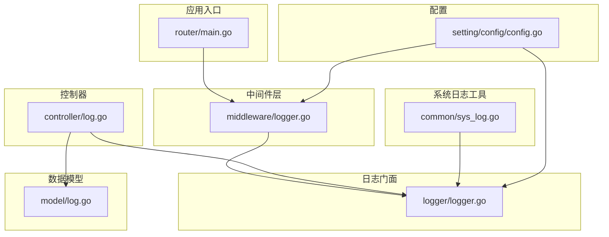
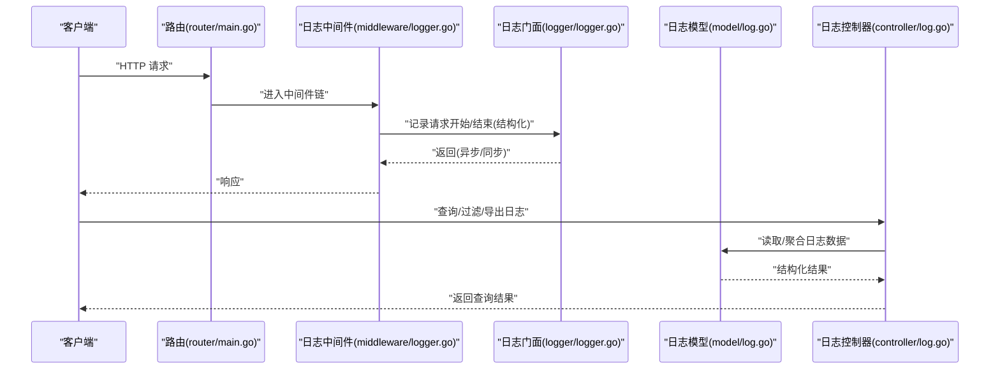
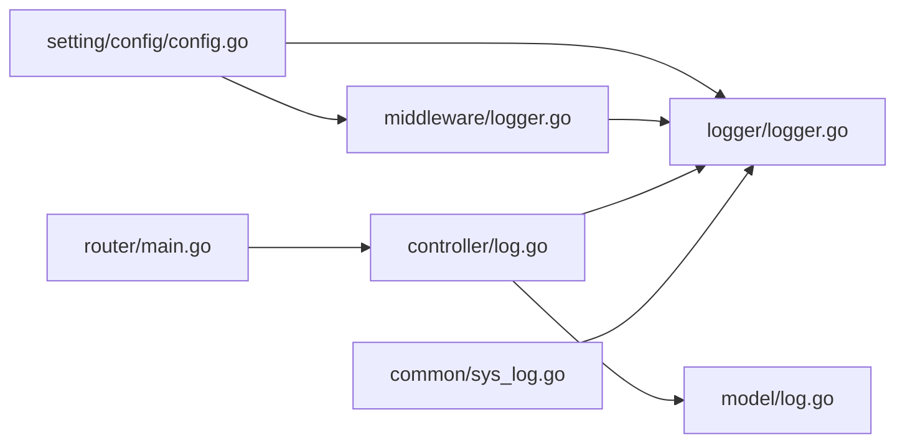

# 日志管理

<cite>
**本文档引用的文件**   
- [logger.go](file://logger/logger.go)
- [middleware/logger.go](file://middleware/logger.go)
- [model/log.go](file://model/log.go)
- [controller/log.go](file://controller/log.go)
- [common/sys_log.go](file://common/sys_log.go)
- [router/main.go](file://router/main.go)
- [setting/config/config.go](file://setting/config/config.go)
</cite>

## 目录
1. [简介](#简介)
2. [项目结构](#项目结构)
3. [核心组件](#核心组件)
4. [架构总览](#架构总览)
5. [详细组件分析](#详细组件分析)
6. [依赖关系分析](#依赖关系分析)
7. [性能考虑](#性能考虑)
8. [故障排查指南](#故障排查指南)
9. [结论](#结论)
10. [附录](#附录)

## 简介
本文件面向“日志管理系统”的完整实现与使用，覆盖结构化日志记录、日志级别控制、日志轮转与存储策略、输出目标与过滤规则、异步处理与批量写入、搜索查询与分析、安全与合规（敏感信息脱敏）、清理策略与存储空间管理等主题。文档基于代码库中的实际实现进行说明，并提供可视化图示帮助理解系统结构与数据流。

## 项目结构
日志相关能力分布在以下模块：
- 日志门面与初始化：logger/logger.go
- 中间件层请求级日志：middleware/logger.go
- 持久化模型与格式：model/log.go
- 控制器接口（查询/导出）：controller/log.go
- 系统日志工具：common/sys_log.go
- 路由注册：router/main.go
- 配置中心：setting/config/config.go

图表来源
- [router/main.go](file://router/main.go)
- [middleware/logger.go](file://middleware/logger.go)
- [logger/logger.go](file://logger/logger.go)
- [model/log.go](file://model/log.go)
- [controller/log.go](file://controller/log.go)
- [common/sys_log.go](file://common/sys_log.go)
- [setting/config/config.go](file://setting/config/config.go)

章节来源
- [router/main.go](file://router/main.go)
- [middleware/logger.go](file://middleware/logger.go)
- [logger/logger.go](file://logger/logger.go)
- [model/log.go](file://model/log.go)
- [controller/log.go](file://controller/log.go)
- [common/sys_log.go](file://common/sys_log.go)
- [setting/config/config.go](file://setting/config/config.go)

## 核心组件
- 日志门面 logger/logger.go：提供统一日志接口、级别控制、格式化与输出目标选择，支持异步与批量化配置。
- 请求级中间件 middleware/logger.go：在HTTP请求生命周期内采集上下文（如请求ID、耗时、状态码），并生成结构化日志。
- 日志模型 model/log.go：定义日志条目结构、字段约束与序列化格式，便于持久化与检索。
- 控制器 controller/log.go：暴露查询、过滤、分页与导出等API，用于日志检索与分析。
- 系统日志 common/sys_log.go：封装系统级事件（启动、错误、告警）的日志记录。
- 路由 router/main.go：将日志查询API挂载到Web服务。
- 配置 setting/config/config.go：集中管理日志级别、输出目标、轮转策略、异步队列大小等开关。

章节来源
- [logger/logger.go](file://logger/logger.go)
- [middleware/logger.go](file://middleware/logger.go)
- [model/log.go](file://model/log.go)
- [controller/log.go](file://controller/log.go)
- [common/sys_log.go](file://common/sys_log.go)
- [router/main.go](file://router/main.go)
- [setting/config/config.go](file://setting/config/config.go)

## 架构总览
整体采用“中间件采集 + 门面抽象 + 模型持久化 + 控制器查询”的分层架构。中间件负责结构化入参与响应元数据的收集；门面负责级别过滤、格式化与异步落盘；模型负责数据结构与序列化的稳定性；控制器提供对外查询与分析能力。

图表来源
- [router/main.go](file://router/main.go)
- [middleware/logger.go](file://middleware/logger.go)
- [logger/logger.go](file://logger/logger.go)
- [model/log.go](file://model/log.go)
- [controller/log.go](file://controller/log.go)

## 详细组件分析

### 日志门面（logger/logger.go）
- 职责
  - 统一日志接口：提供不同级别的记录方法（如调试、信息、警告、错误）。
  - 级别控制：根据全局或上下文级别过滤低优先级日志。
  - 格式化：支持JSON结构化输出，便于下游解析与索引。
  - 输出目标：控制台、文件、外部系统（可扩展）。
  - 异步与批处理：通过缓冲通道与定时刷新降低I/O阻塞。
- 关键设计点
  - 级别阈值比较：仅当日志级别大于等于当前阈值时才写入。
  - 结构化字段：包含时间戳、级别、请求ID、模块、消息、键值对等。
  - 异步写入：高吞吐场景下启用缓冲队列，避免阻塞主流程。
  - 轮转策略：按大小或时间切分文件，保留历史数量上限。
- 适用场景
  - 业务链路追踪、错误定位、审计与合规报表。

章节来源
- [logger/logger.go](file://logger/logger.go)

### 请求级日志中间件（middleware/logger.go）
- 职责
  - 在请求进入与离开时记录结构化日志。
  - 采集上下文：请求ID、方法、路径、参数摘要、耗时、状态码、用户标识等。
  - 过滤敏感字段：对密码、令牌等敏感信息进行脱敏。
- 关键设计点
  - 请求ID透传：确保跨调用链可关联。
  - 延迟计算：精确统计端到端耗时。
  - 条件记录：根据级别与白名单决定是否记录请求体/响应体摘要。
- 适用场景
  - API网关式审计、慢请求分析、异常定位。

章节来源
- [middleware/logger.go](file://middleware/logger.go)

### 日志模型与格式（model/log.go）
- 职责
  - 定义日志条目结构：字段类型、必填项、默认值。
  - 序列化/反序列化：保证与存储后端兼容。
  - 校验与规范化：统一时间格式、级别枚举、字段长度限制。
- 关键设计点
  - 字段稳定：向后兼容的演进策略。
  - 索引友好：为高频查询字段预留索引语义（如时间、级别、请求ID）。
- 适用场景
  - 数据库/对象存储/搜索引擎的持久化与检索。

章节来源
- [model/log.go](file://model/log.go)

### 日志控制器（controller/log.go）
- 职责
  - 提供查询接口：按时间范围、级别、模块、请求ID等过滤。
  - 分页与排序：支持高效翻页与多字段排序。
  - 导出功能：CSV/JSON导出，便于离线分析。
- 关键设计点
  - 权限控制：仅授权角色可访问。
  - 限流保护：防止滥用导致资源耗尽。
  - 结果裁剪：避免超大响应影响网络与前端渲染。
- 适用场景
  - 运维看板、问题排查、合规审计。

章节来源
- [controller/log.go](file://controller/log.go)

### 系统日志工具（common/sys_log.go）
- 职责
  - 记录系统级事件：启动、关闭、配置变更、错误告警。
  - 标准化输出：统一格式与级别，便于集中采集。
- 关键设计点
  - 幂等性：重复触发不产生重复日志。
  - 降级策略：底层不可用时不影响主流程。
- 适用场景
  - 平台稳定性监控、故障自愈、容量规划。

章节来源
- [common/sys_log.go](file://common/sys_log.go)

### 路由注册（router/main.go）
- 职责
  - 将日志查询API挂载到Web服务。
  - 统一鉴权与中间件注入。
- 关键设计点
  - 分组管理：按模块划分路由组。
  - 版本化：为API演进预留空间。
- 适用场景
  - Web控制台集成、第三方系统集成。

章节来源
- [router/main.go](file://router/main.go)

### 配置中心（setting/config/config.go）
- 职责
  - 集中管理日志相关配置：级别、输出目标、轮转策略、异步队列大小、保留天数等。
  - 动态更新：支持运行时调整部分参数。
- 关键设计点
  - 配置校验：启动时校验必填项与取值范围。
  - 环境隔离：区分开发/测试/生产环境。
- 适用场景
  - 多环境部署、灰度发布、弹性伸缩。

章节来源
- [setting/config/config.go](file://setting/config/config.go)

## 依赖关系分析
- 中间件依赖门面：middleware/logger.go 调用 logger/logger.go 完成记录。
- 控制器依赖模型：controller/log.go 通过 model/log.go 获取结构化数据。
- 系统日志依赖门面：common/sys_log.go 通过 logger/logger.go 输出。
- 路由依赖控制器：router/main.go 将 controller/log.go 暴露为HTTP接口。
- 配置驱动：setting/config/config.go 影响门面与中间件行为。

图表来源
- [setting/config/config.go](file://setting/config/config.go)
- [logger/logger.go](file://logger/logger.go)
- [middleware/logger.go](file://middleware/logger.go)
- [model/log.go](file://model/log.go)
- [controller/log.go](file://controller/log.go)
- [common/sys_log.go](file://common/sys_log.go)
- [router/main.go](file://router/main.go)

章节来源
- [setting/config/config.go](file://setting/config/config.go)
- [logger/logger.go](file://logger/logger.go)
- [middleware/logger.go](file://middleware/logger.go)
- [model/log.go](file://model/log.go)
- [controller/log.go](file://controller/log.go)
- [common/sys_log.go](file://common/sys_log.go)
- [router/main.go](file://router/main.go)

## 性能考虑
- 异步写入
  - 使用缓冲通道减少同步I/O开销，提高吞吐。
  - 合理设置队列大小与丢弃策略，避免内存膨胀。
- 批量写入
  - 合并多条日志为一次写操作，降低磁盘/网络压力。
  - 定时刷新与阈值触发双机制，平衡实时性与性能。
- 级别过滤
  - 在记录前进行级别判断，减少不必要的格式化与序列化。
- 结构化输出
  - JSON格式便于下游解析与索引，但需控制字段体积。
- 轮转策略
  - 按大小/时间切分，限制历史文件数量，避免磁盘占满。
- 监控与调优
  - 观察队列长度、丢弃率、写入延迟，动态调整参数。

[本节为通用指导，不直接分析具体文件]

## 故障排查指南
- 常见问题
  - 日志丢失：检查异步队列是否溢出、丢弃策略是否过激。
  - 写入缓慢：确认磁盘IO瓶颈、轮转频率、批量大小。
  - 级别无效：核对配置加载顺序与运行时覆盖。
  - 敏感信息泄露：审查中间件脱敏规则与字段白名单。
- 诊断步骤
  - 查看系统日志：common/sys_log.go 输出的启动与错误事件。
  - 检查中间件日志：middleware/logger.go 的请求摘要与耗时。
  - 验证模型序列化：model/log.go 的字段完整性与兼容性。
  - 复核控制器权限与限流：controller/log.go 的访问控制。
  - 核对配置：setting/config/config.go 的级别、输出、轮转设置。
- 恢复建议
  - 临时提升级别以捕获更多上下文。
  - 扩大队列与批量大小，缓解瞬时峰值。
  - 增加轮转频率与保留上限，释放磁盘空间。

章节来源
- [common/sys_log.go](file://common/sys_log.go)
- [middleware/logger.go](file://middleware/logger.go)
- [model/log.go](file://model/log.go)
- [controller/log.go](file://controller/log.go)
- [setting/config/config.go](file://setting/config/config.go)

## 结论
该日志管理系统通过分层设计与配置驱动，实现了结构化记录、级别控制、异步批处理与轮转存储，配合控制器提供的查询与分析能力，满足运维与合规需求。建议在大规模部署中重点关注异步队列、批量写入与轮转策略的参数调优，并持续完善敏感信息脱敏与权限控制。

[本节为总结性内容，不直接分析具体文件]

## 附录
- 结构化日志字段建议
  - 时间戳、级别、请求ID、模块、消息、键值对（用户、渠道、模型、耗时、状态码等）。
- 输出目标示例
  - 本地文件（按天/大小轮转）、标准输出（容器化采集）、外部系统（日志平台）。
- 过滤规则示例
  - 按级别、模块、请求ID、用户、路径前缀过滤。
- 安全与合规
  - 敏感字段脱敏（密码、令牌、身份证号等）。
  - 访问控制（仅管理员可查询/导出）。
  - 保留策略（最小化留存、到期清理）。
- 清理策略与存储管理
  - 按时间与大小轮转，限制历史文件数量。
  - 定期归档与压缩，迁移冷数据至低成本存储。
  - 监控磁盘使用率，自动扩容或告警。

[本节为概念性内容，不直接分析具体文件]