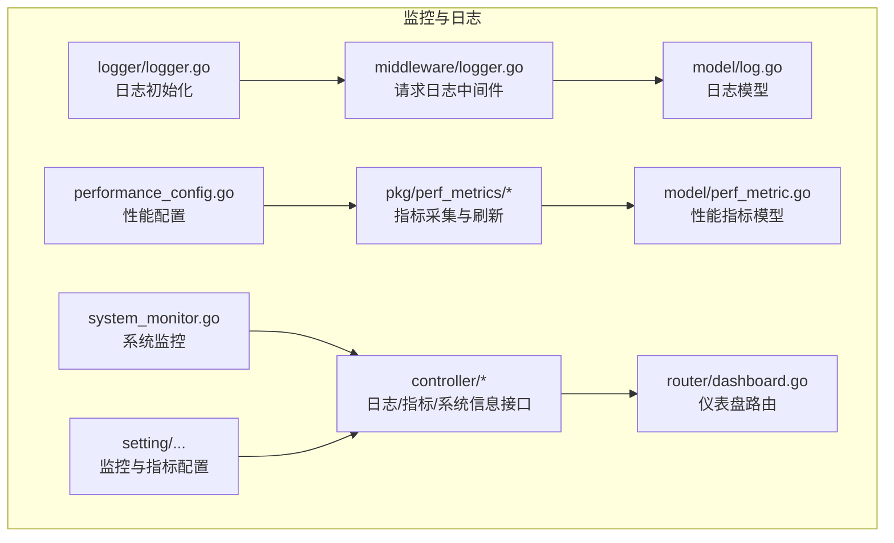
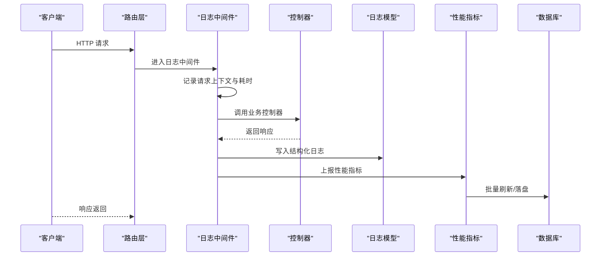
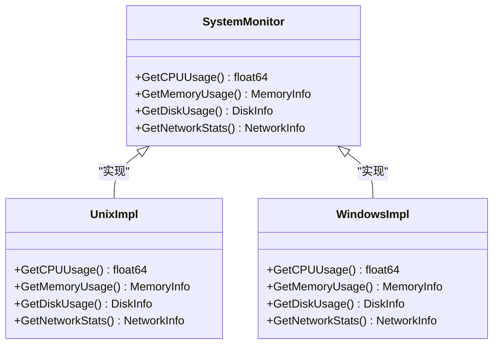
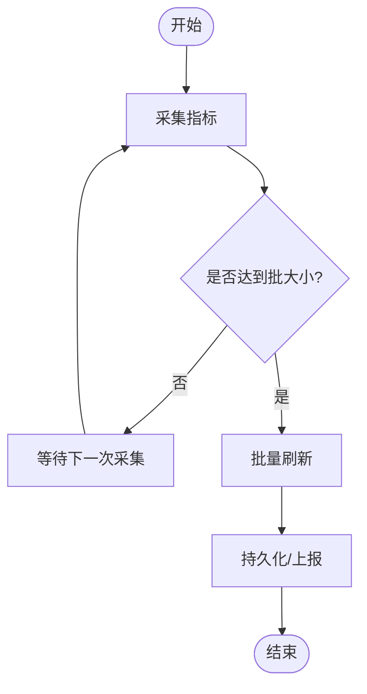
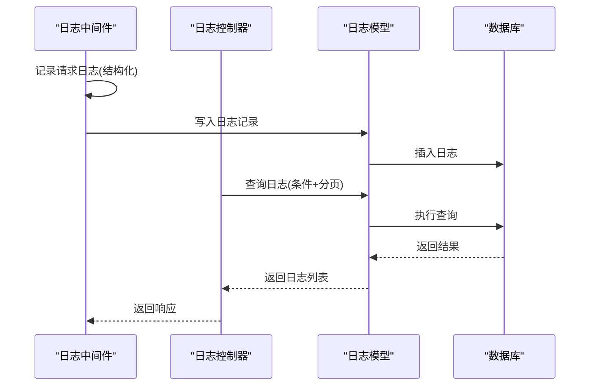
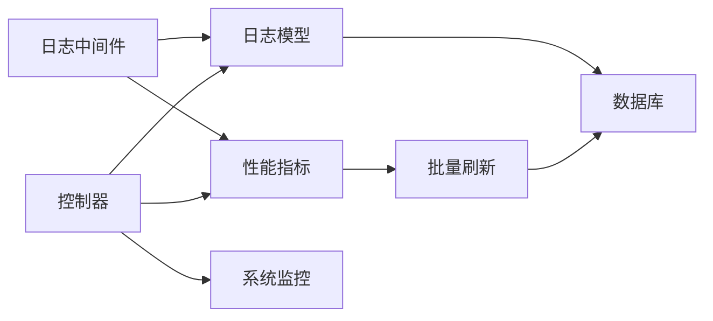

# 监控与日志

<cite>
**本文档引用的文件**   
- [common/system_monitor.go](file://common/system_monitor.go)
- [common/system_monitor_unix.go](file://common/system_monitor_unix.go)
- [common/system_monitor_windows.go](file://common/system_monitor_windows.go)
- [common/performance_config.go](file://common/performance_config.go)
- [logger/logger.go](file://logger/logger.go)
- [middleware/logger.go](file://middleware/logger.go)
- [controller/log.go](file://controller/log.go)
- [model/log.go](file://model/log.go)
- [model/perf_metric.go](file://model/perf_metric.go)
- [pkg/perf_metrics/metrics.go](file://pkg/perf_metrics/metrics.go)
- [pkg/perf_metrics/flush.go](file://pkg/perf_metrics/flush.go)
- [setting/operation_setting/monitor_setting.go](file://setting/operation_setting/monitor_setting.go)
- [setting/perf_metrics_setting/config.go](file://setting/perf_metrics_setting/config.go)
- [router/dashboard.go](file://router/dashboard.go)
- [controller/perf_metrics.go](file://controller/perf_metrics.go)
- [controller/system_info.go](file://controller/system_info.go)
</cite>

## 目录
1. [简介](#简介)
2. [项目结构](#项目结构)
3. [核心组件](#核心组件)
4. [架构总览](#架构总览)
5. [详细组件分析](#详细组件分析)
6. [依赖关系分析](#依赖关系分析)
7. [性能考量](#性能考量)
8. [故障排查指南](#故障排查指南)
9. [结论](#结论)
10. [附录](#附录)

## 简介
本章节面向“监控与日志系统”的文档，覆盖系统监控、性能指标收集、日志记录与分析的实现细节。内容基于代码库中的实际实现，包括：
- 系统级健康检查（CPU、内存、磁盘、网络等）
- 性能指标采集与聚合（请求耗时、吞吐、错误率等）
- 结构化日志记录与查询
- 配置项与参数说明
- 与其他模块（路由、控制器、模型、设置）的关系
- 常见问题与解决方案
- 可视化仪表板与告警机制的使用建议

## 项目结构
监控与日志相关代码分布在以下目录：
- common：系统监控、性能配置、工具函数
- logger：日志初始化与基础能力
- middleware：请求级日志中间件、性能统计中间件
- controller：日志查询接口、性能指标接口、系统信息接口
- model：日志与性能指标的持久化模型
- pkg/perf_metrics：性能指标定义、采集与批量刷新
- setting：监控与性能指标的配置管理
- router：仪表盘路由

图表来源
- [common/system_monitor.go](file://common/system_monitor.go)
- [common/performance_config.go](file://common/performance_config.go)
- [logger/logger.go](file://logger/logger.go)
- [middleware/logger.go](file://middleware/logger.go)
- [pkg/perf_metrics/metrics.go](file://pkg/perf_metrics/metrics.go)
- [pkg/perf_metrics/flush.go](file://pkg/perf_metrics/flush.go)
- [model/log.go](file://model/log.go)
- [model/perf_metric.go](file://model/perf_metric.go)
- [setting/operation_setting/monitor_setting.go](file://setting/operation_setting/monitor_setting.go)
- [setting/perf_metrics_setting/config.go](file://setting/perf_metrics_setting/config.go)
- [controller/log.go](file://controller/log.go)
- [controller/perf_metrics.go](file://controller/perf_metrics.go)
- [controller/system_info.go](file://controller/system_info.go)
- [router/dashboard.go](file://router/dashboard.go)

章节来源
- [common/system_monitor.go](file://common/system_monitor.go)
- [common/performance_config.go](file://common/performance_config.go)
- [logger/logger.go](file://logger/logger.go)
- [middleware/logger.go](file://middleware/logger.go)
- [pkg/perf_metrics/metrics.go](file://pkg/perf_metrics/metrics.go)
- [pkg/perf_metrics/flush.go](file://pkg/perf_metrics/flush.go)
- [model/log.go](file://model/log.go)
- [model/perf_metric.go](file://model/perf_metric.go)
- [setting/operation_setting/monitor_setting.go](file://setting/operation_setting/monitor_setting.go)
- [setting/perf_metrics_setting/config.go](file://setting/perf_metrics_setting/config.go)
- [controller/log.go](file://controller/log.go)
- [controller/perf_metrics.go](file://controller/perf_metrics.go)
- [controller/system_info.go](file://controller/system_info.go)
- [router/dashboard.go](file://router/dashboard.go)

## 核心组件
- 系统监控：提供跨平台的系统资源使用信息采集（CPU、内存、磁盘、网络等），用于健康检查与告警。
- 性能指标：定义指标类型、采集点与批量刷新策略，支持高吞吐场景下的低开销上报。
- 日志子系统：统一日志初始化、请求级结构化日志、持久化存储与查询接口。
- 配置管理：集中管理监控开关、采样率、刷新周期、存储策略等关键参数。
- 控制器与路由：暴露日志查询、指标查询、系统信息接口，支撑前端仪表盘展示。

章节来源
- [common/system_monitor.go](file://common/system_monitor.go)
- [common/system_monitor_unix.go](file://common/system_monitor_unix.go)
- [common/system_monitor_windows.go](file://common/system_monitor_windows.go)
- [pkg/perf_metrics/metrics.go](file://pkg/perf_metrics/metrics.go)
- [pkg/perf_metrics/flush.go](file://pkg/perf_metrics/flush.go)
- [logger/logger.go](file://logger/logger.go)
- [middleware/logger.go](file://middleware/logger.go)
- [setting/operation_setting/monitor_setting.go](file://setting/operation_setting/monitor_setting.go)
- [setting/perf_metrics_setting/config.go](file://setting/perf_metrics_setting/config.go)

## 架构总览
下图展示了从请求进入、日志记录、指标采集到持久化与查询的整体流程。

图表来源
- [middleware/logger.go](file://middleware/logger.go)
- [controller/log.go](file://controller/log.go)
- [controller/perf_metrics.go](file://controller/perf_metrics.go)
- [model/log.go](file://model/log.go)
- [model/perf_metric.go](file://model/perf_metric.go)
- [pkg/perf_metrics/flush.go](file://pkg/perf_metrics/flush.go)

## 详细组件分析

### 系统监控（健康检查）
- 功能要点
  - 跨平台采集 CPU、内存、磁盘、网络等指标
  - 提供健康检查数据，供仪表盘或外部监控系统消费
  - 支持按平台差异进行适配（Unix/Windows）
- 关键路径
  - 系统监控实现：[common/system_monitor.go](file://common/system_monitor.go)
  - Unix 平台适配：[common/system_monitor_unix.go](file://common/system_monitor_unix.go)
  - Windows 平台适配：[common/system_monitor_windows.go](file://common/system_monitor_windows.go)
- 典型用法
  - 在控制器中读取系统状态并返回给前端
  - 结合告警规则触发阈值告警

图表来源
- [common/system_monitor.go](file://common/system_monitor.go)
- [common/system_monitor_unix.go](file://common/system_monitor_unix.go)
- [common/system_monitor_windows.go](file://common/system_monitor_windows.go)

章节来源
- [common/system_monitor.go](file://common/system_monitor.go)
- [common/system_monitor_unix.go](file://common/system_monitor_unix.go)
- [common/system_monitor_windows.go](file://common/system_monitor_windows.go)
- [controller/system_info.go](file://controller/system_info.go)

### 性能指标（采集与刷新）
- 功能要点
  - 定义指标类型与维度（如请求耗时、吞吐、错误率）
  - 支持批量采集与定时刷新，降低高频上报开销
  - 可配置刷新间隔与批大小
- 关键路径
  - 指标定义与采集：[pkg/perf_metrics/metrics.go](file://pkg/perf_metrics/metrics.go)
  - 批量刷新逻辑：[pkg/perf_metrics/flush.go](file://pkg/perf_metrics/flush.go)
  - 性能配置：[common/performance_config.go](file://common/performance_config.go)
  - 指标设置：[setting/perf_metrics_setting/config.go](file://setting/perf_metrics_setting/config.go)
- 数据流
  - 中间件或控制器在关键路径上报指标
  - 后台任务周期性将指标批量写入数据库或外部系统

图表来源
- [pkg/perf_metrics/metrics.go](file://pkg/perf_metrics/metrics.go)
- [pkg/perf_metrics/flush.go](file://pkg/perf_metrics/flush.go)
- [common/performance_config.go](file://common/performance_config.go)
- [setting/perf_metrics_setting/config.go](file://setting/perf_metrics_setting/config.go)

章节来源
- [pkg/perf_metrics/metrics.go](file://pkg/perf_metrics/metrics.go)
- [pkg/perf_metrics/flush.go](file://pkg/perf_metrics/flush.go)
- [common/performance_config.go](file://common/performance_config.go)
- [setting/perf_metrics_setting/config.go](file://setting/perf_metrics_setting/config.go)

### 日志子系统（记录与查询）
- 功能要点
  - 统一日志初始化与输出格式
  - 请求级结构化日志（包含请求ID、耗时、状态码、用户信息等）
  - 日志持久化与分页查询接口
- 关键路径
  - 日志初始化：[logger/logger.go](file://logger/logger.go)
  - 请求日志中间件：[middleware/logger.go](file://middleware/logger.go)
  - 日志模型：[model/log.go](file://model/log.go)
  - 日志查询控制器：[controller/log.go](file://controller/log.go)
- 典型流程
  - 中间件捕获请求上下文，记录入参/出参摘要与耗时
  - 控制器提供查询接口，支持时间范围、关键字、分页过滤

图表来源
- [middleware/logger.go](file://middleware/logger.go)
- [controller/log.go](file://controller/log.go)
- [model/log.go](file://model/log.go)

章节来源
- [logger/logger.go](file://logger/logger.go)
- [middleware/logger.go](file://middleware/logger.go)
- [model/log.go](file://model/log.go)
- [controller/log.go](file://controller/log.go)

### 监控与指标配置
- 功能要点
  - 监控开关、采样率、刷新周期、批大小等关键参数
  - 不同环境（开发/生产）差异化配置
- 关键路径
  - 监控设置：[setting/operation_setting/monitor_setting.go](file://setting/operation_setting/monitor_setting.go)
  - 性能指标设置：[setting/perf_metrics_setting/config.go](file://setting/perf_metrics_setting/config.go)
  - 性能配置：[common/performance_config.go](file://common/performance_config.go)

章节来源
- [setting/operation_setting/monitor_setting.go](file://setting/operation_setting/monitor_setting.go)
- [setting/perf_metrics_setting/config.go](file://setting/perf_metrics_setting/config.go)
- [common/performance_config.go](file://common/performance_config.go)

### 仪表盘与可视化
- 功能要点
  - 提供系统信息与指标查询接口，支撑前端仪表盘展示
  - 路由注册与页面集成
- 关键路径
  - 仪表盘路由：[router/dashboard.go](file://router/dashboard.go)
  - 系统信息控制器：[controller/system_info.go](file://controller/system_info.go)
  - 性能指标控制器：[controller/perf_metrics.go](file://controller/perf_metrics.go)

章节来源
- [router/dashboard.go](file://router/dashboard.go)
- [controller/system_info.go](file://controller/system_info.go)
- [controller/perf_metrics.go](file://controller/perf_metrics.go)

## 依赖关系分析
- 组件耦合
  - 中间件依赖日志模型与性能指标模块
  - 控制器依赖模型与设置模块
  - 系统监控为控制器提供健康数据
- 外部依赖
  - 数据库用于日志与指标持久化
  - 可选的外部监控系统（通过刷新逻辑扩展）

图表来源
- [middleware/logger.go](file://middleware/logger.go)
- [controller/log.go](file://controller/log.go)
- [controller/perf_metrics.go](file://controller/perf_metrics.go)
- [controller/system_info.go](file://controller/system_info.go)
- [model/log.go](file://model/log.go)
- [model/perf_metric.go](file://model/perf_metric.go)
- [pkg/perf_metrics/flush.go](file://pkg/perf_metrics/flush.go)
- [common/system_monitor.go](file://common/system_monitor.go)

章节来源
- [middleware/logger.go](file://middleware/logger.go)
- [controller/log.go](file://controller/log.go)
- [controller/perf_metrics.go](file://controller/perf_metrics.go)
- [controller/system_info.go](file://controller/system_info.go)
- [model/log.go](file://model/log.go)
- [model/perf_metric.go](file://model/perf_metric.go)
- [pkg/perf_metrics/flush.go](file://pkg/perf_metrics/flush.go)
- [common/system_monitor.go](file://common/system_monitor.go)

## 性能考量
- 指标采集
  - 使用批量刷新减少频繁 IO
  - 合理设置批大小与刷新周期，平衡实时性与开销
- 日志记录
  - 避免在高并发路径上记录过大字段
  - 使用异步写入或缓冲队列降低阻塞
- 系统监控
  - 控制采集频率，避免影响主业务线程
  - 在不同平台选择轻量级采集方式

## 故障排查指南
- 日志缺失或不完整
  - 检查中间件是否启用与正确挂载
  - 确认日志模型写入成功与数据库连接正常
  - 查看日志查询接口的过滤条件是否正确
- 指标未更新
  - 核对刷新任务是否运行
  - 检查批大小与刷新周期配置
  - 验证数据库写入权限与表结构
- 健康检查异常
  - 确认系统监控实现与平台适配
  - 检查资源限制（CPU、内存、磁盘）是否触顶
  - 查看控制器返回的数据结构与前端解析

章节来源
- [middleware/logger.go](file://middleware/logger.go)
- [model/log.go](file://model/log.go)
- [controller/log.go](file://controller/log.go)
- [pkg/perf_metrics/flush.go](file://pkg/perf_metrics/flush.go)
- [setting/perf_metrics_setting/config.go](file://setting/perf_metrics_setting/config.go)
- [common/system_monitor.go](file://common/system_monitor.go)
- [controller/system_info.go](file://controller/system_info.go)

## 结论
本监控与日志系统通过模块化设计实现了健康检查、指标采集、结构化日志与可视化展示。借助配置化管理与批量刷新策略，系统在保持低开销的同时提供了可靠的运维能力。建议在生产环境中结合外部监控系统与告警平台，形成完整的可观测性闭环。

## 附录
- 配置项参考
  - 监控开关与采样率：[setting/operation_setting/monitor_setting.go](file://setting/operation_setting/monitor_setting.go)
  - 性能指标刷新与批大小：[setting/perf_metrics_setting/config.go](file://setting/perf_metrics_setting/config.go)
  - 通用性能配置：[common/performance_config.go](file://common/performance_config.go)
- 接口参考
  - 日志查询：[controller/log.go](file://controller/log.go)
  - 性能指标查询：[controller/perf_metrics.go](file://controller/perf_metrics.go)
  - 系统信息与健康检查：[controller/system_info.go](file://controller/system_info.go)
- 数据模型参考
  - 日志模型：[model/log.go](file://model/log.go)
  - 性能指标模型：[model/perf_metric.go](file://model/perf_metric.go)