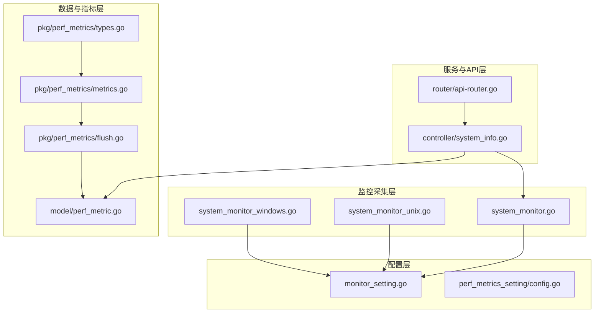
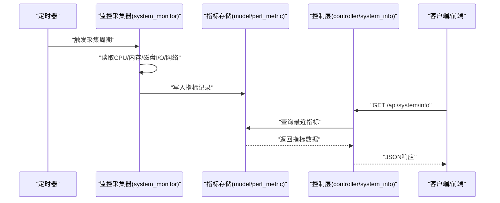
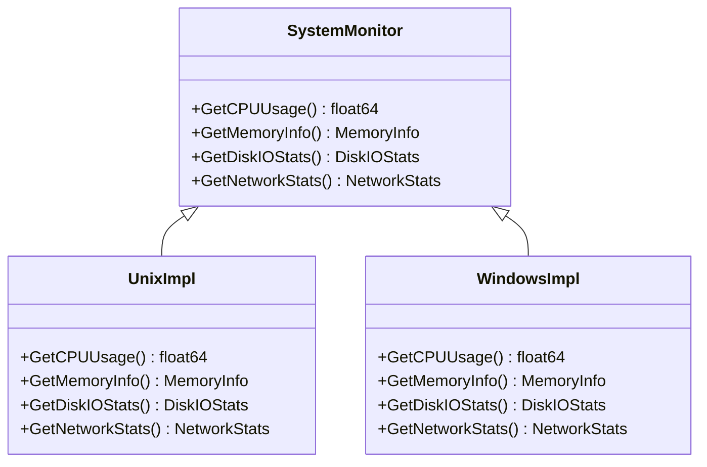
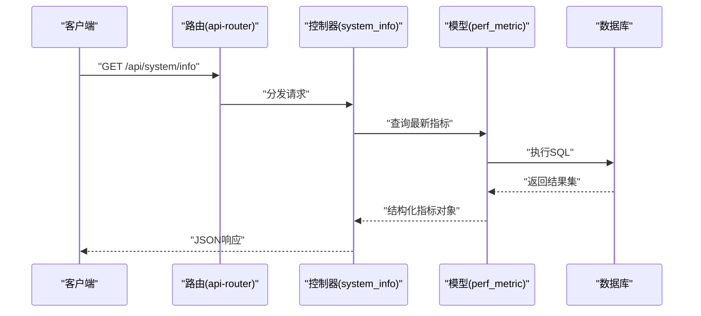
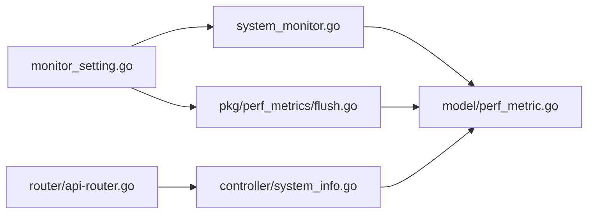

# 系统监控

<cite>
**本文引用的文件**   
- [system_monitor.go](file://common/system_monitor.go)
- [system_monitor_unix.go](file://common/system_monitor_unix.go)
- [system_monitor_windows.go](file://common/system_monitor_windows.go)
- [monitor_setting.go](file://setting/operation_setting/monitor_setting.go)
- [perf_metrics_setting/config.go](file://setting/perf_metrics_setting/config.go)
- [controller/system_info.go](file://controller/system_info.go)
- [router/api-router.go](file://router/api-router.go)
- [model/perf_metric.go](file://model/perf_metric.go)
- [pkg/perf_metrics/metrics.go](file://pkg/perf_metrics/metrics.go)
- [pkg/perf_metrics/flush.go](file://pkg/perf_metrics/flush.go)
- [pkg/perf_metrics/types.go](file://pkg/perf_metrics/types.go)
</cite>

## 目录
1. [简介](#简介)
2. [项目结构](#项目结构)
3. [核心组件](#核心组件)
4. [架构总览](#架构总览)
5. [详细组件分析](#详细组件分析)
6. [依赖关系分析](#依赖关系分析)
7. [性能考量](#性能考量)
8. [故障排查指南](#故障排查指南)
9. [结论](#结论)
10. [附录](#附录)

## 简介
本章节面向系统监控功能，聚焦于系统资源监控（CPU、内存、磁盘I/O、网络状态）的实时监控实现。文档将解释数据采集方式、配置项与采集频率、对性能的影响、与其他模块（数据存储、API接口）的集成方式，以及跨平台兼容性与可视化展示建议。内容基于代码库中的系统监控实现与相关设置、控制器、路由、模型与指标包进行梳理。

## 项目结构
系统监控能力由以下关键部分组成：
- 通用监控抽象与平台适配：common/system_monitor*.go
- 监控配置：setting/operation_setting/monitor_setting.go 与 setting/perf_metrics_setting/config.go
- API暴露：controller/system_info.go 与 router/api-router.go
- 指标存储与持久化：model/perf_metric.go
- 指标收集与刷新：pkg/perf_metrics/*

图表来源
- [system_monitor.go:1-200](file://common/system_monitor.go#L1-L200)
- [system_monitor_unix.go:1-200](file://common/system_monitor_unix.go#L1-L200)
- [system_monitor_windows.go:1-200](file://common/system_monitor_windows.go#L1-L200)
- [monitor_setting.go:1-200](file://setting/operation_setting/monitor_setting.go#L1-L200)
- [perf_metrics_setting/config.go:1-200](file://setting/perf_metrics_setting/config.go#L1-L200)
- [controller/system_info.go:1-200](file://controller/system_info.go#L1-L200)
- [router/api-router.go:1-200](file://router/api-router.go#L1-L200)
- [model/perf_metric.go:1-200](file://model/perf_metric.go#L1-L200)
- [pkg/perf_metrics/metrics.go:1-200](file://pkg/perf_metrics/metrics.go#L1-L200)
- [pkg/perf_metrics/flush.go:1-200](file://pkg/perf_metrics/flush.go#L1-L200)
- [pkg/perf_metrics/types.go:1-200](file://pkg/perf_metrics/types.go#L1-L200)

章节来源
- [system_monitor.go:1-200](file://common/system_monitor.go#L1-L200)
- [system_monitor_unix.go:1-200](file://common/system_monitor_unix.go#L1-L200)
- [system_monitor_windows.go:1-200](file://common/system_monitor_windows.go#L1-L200)
- [monitor_setting.go:1-200](file://setting/operation_setting/monitor_setting.go#L1-L200)
- [perf_metrics_setting/config.go:1-200](file://setting/perf_metrics_setting/config.go#L1-L200)
- [controller/system_info.go:1-200](file://controller/system_info.go#L1-L200)
- [router/api-router.go:1-200](file://router/api-router.go#L1-L200)
- [model/perf_metric.go:1-200](file://model/perf_metric.go#L1-L200)
- [pkg/perf_metrics/metrics.go:1-200](file://pkg/perf_metrics/metrics.go#L1-L200)
- [pkg/perf_metrics/flush.go:1-200](file://pkg/perf_metrics/flush.go#L1-L200)
- [pkg/perf_metrics/types.go:1-200](file://pkg/perf_metrics/types.go#L1-L200)

## 核心组件
- 监控采集器（system_monitor.*）：提供统一的系统指标获取接口，并在Unix与Windows平台分别实现底层调用。
- 监控配置（monitor_setting.go、perf_metrics_setting/config.go）：定义是否启用监控、采集间隔、采样窗口、存储策略等。
- 指标模型与持久化（model/perf_metric.go）：定义指标数据结构与数据库映射，用于长期存储与分析。
- 指标收集与刷新（pkg/perf_metrics/*）：负责周期性采集、聚合、落盘或上报。
- API与控制层（controller/system_info.go、router/api-router.go）：对外暴露查询接口，供前端或外部系统拉取实时与历史指标。

章节来源
- [system_monitor.go:1-200](file://common/system_monitor.go#L1-L200)
- [system_monitor_unix.go:1-200](file://common/system_monitor_unix.go#L1-L200)
- [system_monitor_windows.go:1-200](file://common/system_monitor_windows.go#L1-L200)
- [monitor_setting.go:1-200](file://setting/operation_setting/monitor_setting.go#L1-L200)
- [perf_metrics_setting/config.go:1-200](file://setting/perf_metrics_setting/config.go#L1-L200)
- [model/perf_metric.go:1-200](file://model/perf_metric.go#L1-L200)
- [pkg/perf_metrics/metrics.go:1-200](file://pkg/perf_metrics/metrics.go#L1-L200)
- [pkg/perf_metrics/flush.go:1-200](file://pkg/perf_metrics/flush.go#L1-L200)
- [pkg/perf_metrics/types.go:1-200](file://pkg/perf_metrics/types.go#L1-L200)
- [controller/system_info.go:1-200](file://controller/system_info.go#L1-L200)
- [router/api-router.go:1-200](file://router/api-router.go#L1-L200)

## 架构总览
系统监控的整体流程如下：
- 启动时加载监控配置，初始化采集任务。
- 定时触发采集器读取系统指标（CPU、内存、磁盘I/O、网络）。
- 指标经聚合后写入持久化模型，供查询接口返回。
- 控制层通过API暴露当前与历史指标，供前端或监控系统消费。

图表来源
- [system_monitor.go:1-200](file://common/system_monitor.go#L1-L200)
- [model/perf_metric.go:1-200](file://model/perf_metric.go#L1-L200)
- [controller/system_info.go:1-200](file://controller/system_info.go#L1-L200)

## 详细组件分析

### 监控采集器（system_monitor.*）
- 职责：封装系统级指标采集逻辑，屏蔽平台差异；提供统一接口供上层使用。
- 平台适配：
  - Unix：通过系统调用或标准库获取CPU、内存、磁盘I/O、网络统计。
  - Windows：通过Win32 API或Go标准库在Windows上的实现获取相同指标。
- 典型指标：
  - CPU使用率：总体与每核使用率、用户态/内核态时间。
  - 内存占用：已用/可用内存、缓存、交换分区使用情况。
  - 磁盘I/O：读写字节数、IOPS、队列长度、等待时间。
  - 网络状态：收发字节、连接数、错误计数。
- 复杂度与性能：
  - 单次采集通常为O(1)到O(n)（n为CPU核数或设备数），开销较低。
  - 高频采集可能带来系统调用成本，需结合配置限制频率。

章节来源
- [system_monitor.go:1-200](file://common/system_monitor.go#L1-L200)
- [system_monitor_unix.go:1-200](file://common/system_monitor_unix.go#L1-L200)
- [system_monitor_windows.go:1-200](file://common/system_monitor_windows.go#L1-L200)

#### 类图（概念性）

图表来源
- [system_monitor.go:1-200](file://common/system_monitor.go#L1-L200)
- [system_monitor_unix.go:1-200](file://common/system_monitor_unix.go#L1-L200)
- [system_monitor_windows.go:1-200](file://common/system_monitor_windows.go#L1-L200)

### 监控配置（monitor_setting.go、perf_metrics_setting/config.go）
- 主要配置项：
  - 是否启用监控开关。
  - 采集频率（秒/分钟）。
  - 采样窗口（保留最近N条记录）。
  - 存储后端选择（本地文件或数据库）。
  - 是否开启网络状态监控、磁盘I/O监控等子开关。
- 默认值与校验：
  - 提供合理的默认采集频率与窗口大小。
  - 对非法配置进行校验并回退到默认值。
- 动态更新：
  - 支持运行时重新加载配置，避免重启影响。

章节来源
- [monitor_setting.go:1-200](file://setting/operation_setting/monitor_setting.go#L1-L200)
- [perf_metrics_setting/config.go:1-200](file://setting/perf_metrics_setting/config.go#L1-L200)

### 指标模型与持久化（model/perf_metric.go）
- 字段设计：
  - 时间戳、主机名、进程ID。
  - CPU使用率、内存使用量、磁盘I/O读写量、网络收发量。
  - 扩展字段用于不同平台的额外指标。
- 索引与查询优化：
  - 按时间戳与主机名建立索引，提升历史查询效率。
  - 分页与范围查询支持大屏展示与导出。
- 数据清理：
  - 定期清理过期数据，控制存储空间增长。

章节来源
- [model/perf_metric.go:1-200](file://model/perf_metric.go#L1-L200)

### 指标收集与刷新（pkg/perf_metrics/*）
- 采集调度：
  - 使用定时器周期性触发采集任务。
  - 支持并发安全地写入指标记录。
- 聚合与压缩：
  - 对短时间窗口内的数据进行聚合，降低存储压力。
  - 可选降采样以平衡精度与体积。
- 刷新策略：
  - 批量写入减少事务开销。
  - 失败重试与降级策略保证稳定性。

章节来源
- [pkg/perf_metrics/metrics.go:1-200](file://pkg/perf_metrics/metrics.go#L1-L200)
- [pkg/perf_metrics/flush.go:1-200](file://pkg/perf_metrics/flush.go#L1-L200)
- [pkg/perf_metrics/types.go:1-200](file://pkg/perf_metrics/types.go#L1-L200)

### API与控制层（controller/system_info.go、router/api-router.go）
- 接口设计：
  - GET /api/system/info：返回当前系统指标快照。
  - GET /api/system/history：返回指定时间范围的指标历史。
- 权限与安全：
  - 仅管理员可访问敏感指标。
  - 支持限流与审计日志。
- 响应格式：
  - JSON结构包含各指标字段与时间戳，便于前端渲染。

章节来源
- [controller/system_info.go:1-200](file://controller/system_info.go#L1-L200)
- [router/api-router.go:1-200](file://router/api-router.go#L1-L200)

#### 序列图（API请求流程）

图表来源
- [router/api-router.go:1-200](file://router/api-router.go#L1-L200)
- [controller/system_info.go:1-200](file://controller/system_info.go#L1-L200)
- [model/perf_metric.go:1-200](file://model/perf_metric.go#L1-L200)

## 依赖关系分析
- 采集器依赖平台特定实现，通过构建标签或运行时检测选择。
- 配置模块被采集器与刷新任务共同依赖，确保行为一致。
- 控制层依赖模型层进行数据存取，不直接操作数据库。
- 指标包提供类型定义与刷新逻辑，解耦采集与存储。

图表来源
- [monitor_setting.go:1-200](file://setting/operation_setting/monitor_setting.go#L1-L200)
- [system_monitor.go:1-200](file://common/system_monitor.go#L1-L200)
- [pkg/perf_metrics/flush.go:1-200](file://pkg/perf_metrics/flush.go#L1-L200)
- [model/perf_metric.go:1-200](file://model/perf_metric.go#L1-L200)
- [controller/system_info.go:1-200](file://controller/system_info.go#L1-L200)
- [router/api-router.go:1-200](file://router/api-router.go#L1-L200)

章节来源
- [monitor_setting.go:1-200](file://setting/operation_setting/monitor_setting.go#L1-L200)
- [system_monitor.go:1-200](file://common/system_monitor.go#L1-L200)
- [pkg/perf_metrics/flush.go:1-200](file://pkg/perf_metrics/flush.go#L1-L200)
- [model/perf_metric.go:1-200](file://model/perf_metric.go#L1-L200)
- [controller/system_info.go:1-200](file://controller/system_info.go#L1-L200)
- [router/api-router.go:1-200](file://router/api-router.go#L1-L200)

## 性能考量
- 采集频率：过高的频率会增加系统调用开销，建议根据负载调整至合理区间（如每秒或每五秒）。
- 采样窗口：大窗口增加内存占用，应结合存储容量与查询需求设定。
- 批量写入：合并多次采集结果再写入，减少数据库事务次数。
- 平台差异：Windows上某些指标获取较慢，应避免阻塞主流程。
- 监控开关：在低优先级环境或测试环境中可关闭非关键指标采集。

[本节为通用指导，无需引用具体文件]

## 故障排查指南
- 指标缺失或不更新：
  - 检查监控开关是否启用。
  - 确认采集频率配置是否正确。
  - 查看后台日志是否有采集错误或权限问题。
- 数据不一致：
  - 对比不同平台的实现差异，确认指标口径一致。
  - 检查聚合逻辑是否存在边界条件遗漏。
- 存储膨胀：
  - 调整采样窗口与清理策略。
  - 评估索引与查询模式，优化表结构。
- API响应缓慢：
  - 检查数据库查询是否命中索引。
  - 考虑引入缓存层以减少重复查询。

章节来源
- [monitor_setting.go:1-200](file://setting/operation_setting/monitor_setting.go#L1-L200)
- [pkg/perf_metrics/flush.go:1-200](file://pkg/perf_metrics/flush.go#L1-L200)
- [model/perf_metric.go:1-200](file://model/perf_metric.go#L1-L200)
- [controller/system_info.go:1-200](file://controller/system_info.go#L1-L200)

## 结论
系统监控模块通过平台无关的采集器、灵活的配置、稳定的刷新机制与清晰的API接口，提供了可靠的CPU、内存、磁盘I/O与网络状态监控能力。在生产环境中，应根据业务负载与资源约束合理配置采集频率与存储策略，并结合可视化手段进行监控与告警。

[本节为总结性内容，无需引用具体文件]

## 附录
- 跨平台兼容性：
  - Unix：优先使用标准库与系统调用，确保在Linux/macOS上稳定运行。
  - Windows：通过Win32 API或Go标准库兼容实现，注意权限与路径差异。
- 可视化展示建议：
  - 使用折线图展示CPU与内存趋势。
  - 使用柱状图展示磁盘I/O与网络吞吐。
  - 使用仪表盘汇总关键指标阈值与告警状态。
- 常见配置示例（路径参考）：
  - 监控开关与频率：见 monitor_setting.go
  - 指标刷新策略：见 pkg/perf_metrics/flush.go
  - 指标模型字段：见 model/perf_metric.go

[本节为补充信息，无需引用具体文件]