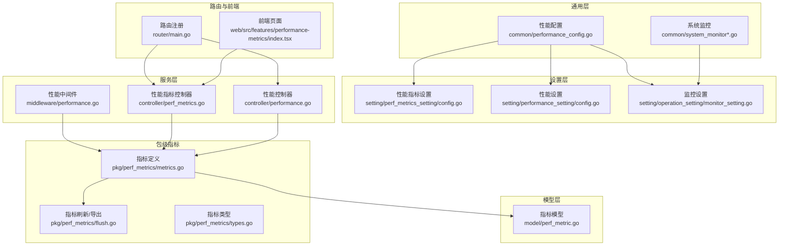
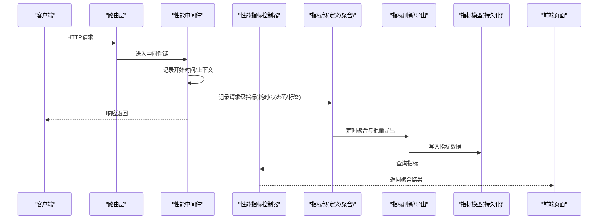
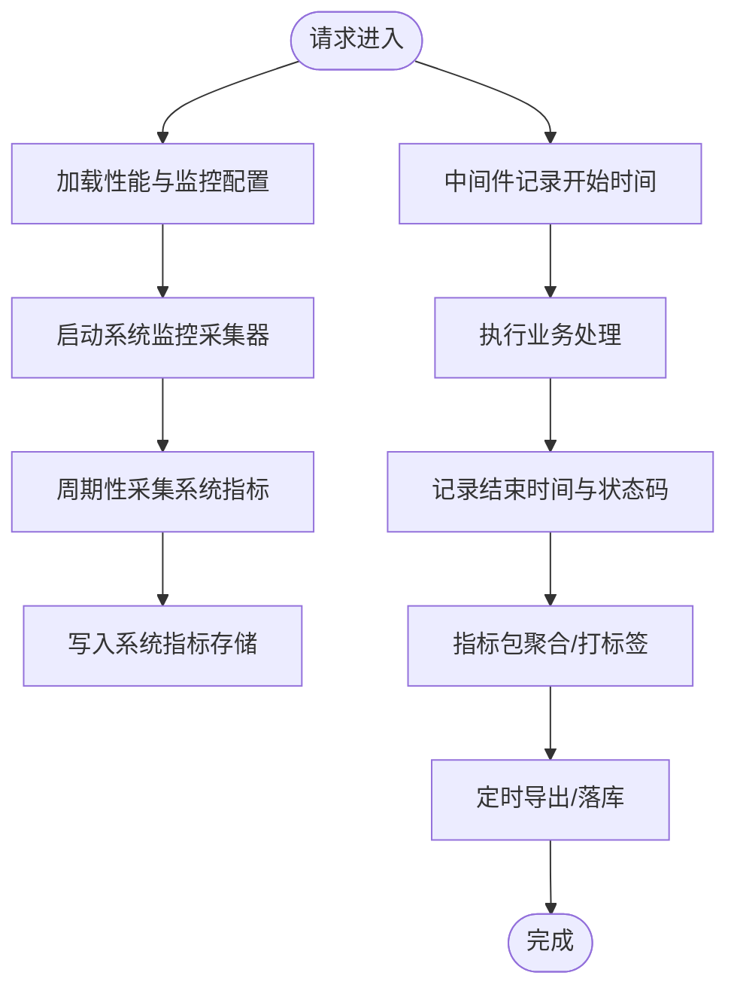
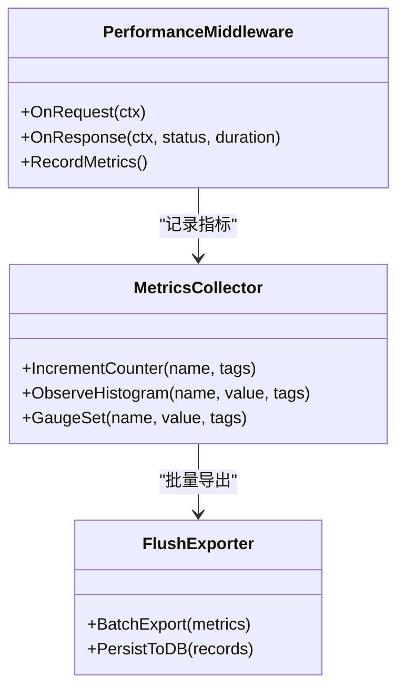
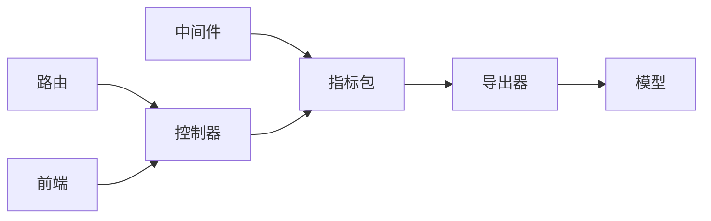

# 性能优化与监控

<cite>
**本文引用的文件**   
- [performance_config.go](file://common/performance_config.go)
- [system_monitor.go](file://common/system_monitor.go)
- [system_monitor_unix.go](file://common/system_monitor_unix.go)
- [system_monitor_windows.go](file://common/system_monitor_windows.go)
- [perf_metrics_setting/config.go](file://setting/perf_metrics_setting/config.go)
- [performance_setting/config.go](file://setting/performance_setting/config.go)
- [monitor_setting/monitor_setting.go](file://setting/operation_setting/monitor_setting.go)
- [controller/perf_metrics.go](file://controller/perf_metrics.go)
- [controller/performance.go](file://controller/performance.go)
- [middleware/performance.go](file://middleware/performance.go)
- [pkg/perf_metrics/metrics.go](file://pkg/perf_metrics/metrics.go)
- [pkg/perf_metrics/flush.go](file://pkg/perf_metrics/flush.go)
- [pkg/perf_metrics/types.go](file://pkg/perf_metrics/types.go)
- [model/perf_metric.go](file://model/perf_metric.go)
- [router/main.go](file://router/main.go)
- [web/src/features/performance-metrics/index.tsx](file://web/src/features/performance-metrics/index.tsx)
</cite>

## 目录
1. [简介](#简介)
2. [项目结构](#项目结构)
3. [核心组件](#核心组件)
4. [架构总览](#架构总览)
5. [详细组件分析](#详细组件分析)
6. [依赖关系分析](#依赖关系分析)
7. [性能考虑](#性能考虑)
8. [故障排查指南](#故障排查指南)
9. [结论](#结论)
10. [附录](#附录)

## 简介
本文件面向AI API网关的性能优化与监控系统，系统性说明性能配置参数的含义与调优建议（连接池、超时、资源限制），详述性能指标的采集、聚合与展示机制，给出关键瓶颈识别方法与优化策略，并提供压力测试、基准与容量规划指南。同时涵盖监控仪表板与告警规则配置，以及分布式追踪与链路分析的实现要点。

## 项目结构
本项目在通用层提供性能配置与系统监控能力，设置层暴露可配置的开关与阈值，控制器与中间件负责指标采集与接口暴露，包级metrics模块实现指标定义与落盘/上报，模型层持久化指标数据，路由层注册相关API，前端提供可视化页面。

**图表来源** 
- [performance_config.go:1-200](file://common/performance_config.go#L1-L200)
- [system_monitor.go:1-200](file://common/system_monitor.go#L1-L200)
- [perf_metrics_setting/config.go:1-200](file://setting/perf_metrics_setting/config.go#L1-L200)
- [performance_setting/config.go:1-200](file://setting/performance_setting/config.go#L1-L200)
- [monitor_setting/monitor_setting.go:1-200](file://setting/operation_setting/monitor_setting.go#L1-L200)
- [middleware/performance.go:1-200](file://middleware/performance.go#L1-L200)
- [controller/perf_metrics.go:1-200](file://controller/perf_metrics.go#L1-L200)
- [controller/performance.go:1-200](file://controller/performance.go#L1-L200)
- [pkg/perf_metrics/metrics.go:1-200](file://pkg/perf_metrics/metrics.go#L1-L200)
- [pkg/perf_metrics/flush.go:1-200](file://pkg/perf_metrics/flush.go#L1-L200)
- [pkg/perf_metrics/types.go:1-200](file://pkg/perf_metrics/types.go#L1-L200)
- [model/perf_metric.go:1-200](file://model/perf_metric.go#L1-L200)
- [router/main.go:1-200](file://router/main.go#L1-L200)
- [web/src/features/performance-metrics/index.tsx:1-200](file://web/src/features/performance-metrics/index.tsx#L1-L200)

**章节来源**
- [performance_config.go:1-200](file://common/performance_config.go#L1-L200)
- [system_monitor.go:1-200](file://common/system_monitor.go#L1-L200)
- [perf_metrics_setting/config.go:1-200](file://setting/perf_metrics_setting/config.go#L1-L200)
- [performance_setting/config.go:1-200](file://setting/performance_setting/config.go#L1-L200)
- [monitor_setting/monitor_setting.go:1-200](file://setting/operation_setting/monitor_setting.go#L1-L200)
- [middleware/performance.go:1-200](file://middleware/performance.go#L1-L200)
- [controller/perf_metrics.go:1-200](file://controller/perf_metrics.go#L1-L200)
- [controller/performance.go:1-200](file://controller/performance.go#L1-L200)
- [pkg/perf_metrics/metrics.go:1-200](file://pkg/perf_metrics/metrics.go#L1-L200)
- [pkg/perf_metrics/flush.go:1-200](file://pkg/perf_metrics/flush.go#L1-L200)
- [pkg/perf_metrics/types.go:1-200](file://pkg/perf_metrics/types.go#L1-L200)
- [model/perf_metric.go:1-200](file://model/perf_metric.go#L1-L200)
- [router/main.go:1-200](file://router/main.go#L1-L200)
- [web/src/features/performance-metrics/index.tsx:1-200](file://web/src/features/performance-metrics/index.tsx#L1-L200)

## 核心组件
- 性能配置：集中管理连接池大小、超时、并发与资源限制等参数，为网关与下游调用提供统一基线。
- 系统监控：采集CPU、内存、goroutine、磁盘与网络等系统级指标，支撑容量规划与异常定位。
- 指标设置：控制指标采集粒度、采样率、保留周期与导出目标。
- 中间件：请求级埋点，统计耗时、状态码、错误分类与流量特征。
- 指标包：定义指标类型、聚合逻辑与批量刷新/导出。
- 控制器：暴露查询接口，供前端或外部系统拉取。
- 模型：指标数据的持久化结构与存储。
- 路由：将控制器挂载到HTTP服务。
- 前端：性能指标可视化页面。

**章节来源**
- [performance_config.go:1-200](file://common/performance_config.go#L1-L200)
- [system_monitor.go:1-200](file://common/system_monitor.go#L1-L200)
- [perf_metrics_setting/config.go:1-200](file://setting/perf_metrics_setting/config.go#L1-L200)
- [performance_setting/config.go:1-200](file://setting/performance_setting/config.go#L1-L200)
- [monitor_setting/monitor_setting.go:1-200](file://setting/operation_setting/monitor_setting.go#L1-L200)
- [middleware/performance.go:1-200](file://middleware/performance.go#L1-L200)
- [pkg/perf_metrics/metrics.go:1-200](file://pkg/perf_metrics/metrics.go#L1-L200)
- [pkg/perf_metrics/flush.go:1-200](file://pkg/perf_metrics/flush.go#L1-L200)
- [pkg/perf_metrics/types.go:1-200](file://pkg/perf_metrics/types.go#L1-L200)
- [model/perf_metric.go:1-200](file://model/perf_metric.go#L1-L200)
- [controller/perf_metrics.go:1-200](file://controller/perf_metrics.go#L1-L200)
- [controller/performance.go:1-200](file://controller/performance.go#L1-L200)
- [router/main.go:1-200](file://router/main.go#L1-L200)
- [web/src/features/performance-metrics/index.tsx:1-200](file://web/src/features/performance-metrics/index.tsx#L1-L200)

## 架构总览
下图展示了从请求进入网关到指标采集、聚合、持久化与展示的完整链路。

**图表来源** 
- [middleware/performance.go:1-200](file://middleware/performance.go#L1-L200)
- [pkg/perf_metrics/metrics.go:1-200](file://pkg/perf_metrics/metrics.go#L1-L200)
- [pkg/perf_metrics/flush.go:1-200](file://pkg/perf_metrics/flush.go#L1-L200)
- [model/perf_metric.go:1-200](file://model/perf_metric.go#L1-L200)
- [controller/perf_metrics.go:1-200](file://controller/perf_metrics.go#L1-L200)
- [web/src/features/performance-metrics/index.tsx:1-200](file://web/src/features/performance-metrics/index.tsx#L1-L200)

## 详细组件分析

### 性能配置参数与优化建议
- 连接池大小
  - 含义：控制HTTP客户端/数据库/缓存等连接的复用数量，影响并发吞吐与资源占用。
  - 建议：根据CPU核数、下游QPS与RT分布设定；高并发短连接场景适当增大，避免频繁握手；长连接多路复用可适当降低。
- 超时设置
  - 含义：包括读超时、写超时、连接建立超时、整体请求超时等，防止慢请求拖垮系统。
  - 建议：按下游SLA分层设置；对非关键路径使用较短超时；结合重试与熔断策略。
- 资源限制
  - 含义：包括最大并发、队列长度、内存上限、goroutine上限、I/O限流等。
  - 建议：通过令牌桶/漏桶限流保护后端；设置背压与拒绝策略；监控资源水位并动态调整。

**章节来源**
- [performance_config.go:1-200](file://common/performance_config.go#L1-L200)
- [performance_setting/config.go:1-200](file://setting/performance_setting/config.go#L1-L200)

### 系统监控与指标采集
- 系统级指标
  - CPU使用率、内存占用、goroutine数量、磁盘IO、网络IO、进程句柄等。
  - 用于容量规划与异常预警。
- 应用级指标
  - QPS、延迟分位(P50/P90/P99)、错误率、状态码分布、上游调用耗时、失败原因分类。
  - 由中间件在请求生命周期内埋点，指标包进行聚合。

**图表来源** 
- [system_monitor.go:1-200](file://common/system_monitor.go#L1-L200)
- [system_monitor_unix.go:1-200](file://common/system_monitor_unix.go#L1-L200)
- [system_monitor_windows.go:1-200](file://common/system_monitor_windows.go#L1-L200)
- [middleware/performance.go:1-200](file://middleware/performance.go#L1-L200)
- [pkg/perf_metrics/metrics.go:1-200](file://pkg/perf_metrics/metrics.go#L1-L200)
- [pkg/perf_metrics/flush.go:1-200](file://pkg/perf_metrics/flush.go#L1-L200)

**章节来源**
- [system_monitor.go:1-200](file://common/system_monitor.go#L1-L200)
- [system_monitor_unix.go:1-200](file://common/system_monitor_unix.go#L1-L200)
- [system_monitor_windows.go:1-200](file://common/system_monitor_windows.go#L1-L200)
- [middleware/performance.go:1-200](file://middleware/performance.go#L1-L200)
- [pkg/perf_metrics/metrics.go:1-200](file://pkg/perf_metrics/metrics.go#L1-L200)
- [pkg/perf_metrics/flush.go:1-200](file://pkg/perf_metrics/flush.go#L1-L200)

### 指标设置与导出
- 采集粒度与采样率
  - 支持按维度（模型、渠道、用户）开启细粒度采集；在高负载下可通过采样率降低开销。
- 保留周期与滚动窗口
  - 配置短期与长期保留策略，平衡查询性能与历史回溯需求。
- 导出目标
  - 支持本地落库、远端推送或对接外部监控系统；批量导出减少锁竞争与IO抖动。

**章节来源**
- [perf_metrics_setting/config.go:1-200](file://setting/perf_metrics_setting/config.go#L1-L200)
- [pkg/perf_metrics/flush.go:1-200](file://pkg/perf_metrics/flush.go#L1-L200)

### 中间件埋点与请求级指标
- 埋点位置
  - 请求进入时记录开始时间、请求ID、来源IP、模型/渠道标签；响应返回时记录耗时、状态码、错误分类。
- 指标聚合
  - 按时间窗口与标签维度聚合，计算P50/P90/P99、错误率、QPS等。
- 性能隔离
  - 对慢请求与异常路径做快速失败与降级，避免雪崩。

**图表来源** 
- [middleware/performance.go:1-200](file://middleware/performance.go#L1-L200)
- [pkg/perf_metrics/metrics.go:1-200](file://pkg/perf_metrics/metrics.go#L1-L200)
- [pkg/perf_metrics/flush.go:1-200](file://pkg/perf_metrics/flush.go#L1-L200)

**章节来源**
- [middleware/performance.go:1-200](file://middleware/performance.go#L1-L200)
- [pkg/perf_metrics/metrics.go:1-200](file://pkg/perf_metrics/metrics.go#L1-L200)
- [pkg/perf_metrics/flush.go:1-200](file://pkg/perf_metrics/flush.go#L1-L200)

### 控制器与API暴露
- 指标查询接口
  - 提供按时间范围、维度过滤的查询接口，返回聚合后的指标数据。
- 性能诊断接口
  - 暴露运行时快照、热点路径、慢请求列表等诊断信息。

**章节来源**
- [controller/perf_metrics.go:1-200](file://controller/perf_metrics.go#L1-L200)
- [controller/performance.go:1-200](file://controller/performance.go#L1-L200)

### 模型与持久化
- 指标模型
  - 定义指标记录的结构、主键、索引与分区策略，支持高效查询与压缩存储。
- 写入策略
  - 批量写入、异步落盘、失败重试与幂等设计，保障高吞吐下的稳定性。

**章节来源**
- [model/perf_metric.go:1-200](file://model/perf_metric.go#L1-L200)

### 路由注册与前端展示
- 路由注册
  - 将指标查询与性能诊断接口挂载至HTTP服务。
- 前端页面
  - 提供性能指标可视化面板，支持多维度筛选、趋势图与告警提示。

**章节来源**
- [router/main.go:1-200](file://router/main.go#L1-L200)
- [web/src/features/performance-metrics/index.tsx:1-200](file://web/src/features/performance-metrics/index.tsx#L1-L200)

## 依赖关系分析
- 低耦合高内聚
  - 中间件仅负责埋点，指标包专注聚合与导出，控制器只负责接口编排，模型层关注持久化。
- 外部依赖
  - 系统监控依赖操作系统API；指标导出可能依赖数据库或消息队列。
- 潜在循环依赖
  - 通过接口抽象与事件驱动避免循环引用。

**图表来源** 
- [middleware/performance.go:1-200](file://middleware/performance.go#L1-L200)
- [pkg/perf_metrics/metrics.go:1-200](file://pkg/perf_metrics/metrics.go#L1-L200)
- [pkg/perf_metrics/flush.go:1-200](file://pkg/perf_metrics/flush.go#L1-L200)
- [model/perf_metric.go:1-200](file://model/perf_metric.go#L1-L200)
- [controller/perf_metrics.go:1-200](file://controller/perf_metrics.go#L1-L200)
- [router/main.go:1-200](file://router/main.go#L1-L200)

**章节来源**
- [middleware/performance.go:1-200](file://middleware/performance.go#L1-L200)
- [pkg/perf_metrics/metrics.go:1-200](file://pkg/perf_metrics/metrics.go#L1-L200)
- [pkg/perf_metrics/flush.go:1-200](file://pkg/perf_metrics/flush.go#L1-L200)
- [model/perf_metric.go:1-200](file://model/perf_metric.go#L1-L200)
- [controller/perf_metrics.go:1-200](file://controller/perf_metrics.go#L1-L200)
- [router/main.go:1-200](file://router/main.go#L1-L200)

## 性能考虑
- 连接池调优
  - 根据下游RT与错误率动态调整连接数；观察连接等待与复用率。
- 超时与重试
  - 合理设置超时与退避重试，避免放大下游抖动。
- 资源限制与背压
  - 使用限流与队列长度限制，防止过载；对慢请求快速失败。
- 采样与降采样
  - 高负载下启用采样，保证核心指标不丢失。
- 批量与异步
  - 指标导出采用批量与异步，降低锁竞争与IO抖动。
- 缓存与预热
  - 对热点配置与元数据进行缓存，减少冷启动开销。

[本节为通用指导，无需特定文件来源]

## 故障排查指南
- 常见症状
  - 延迟升高、错误率上升、连接耗尽、CPU飙升、内存泄漏。
- 定位步骤
  - 查看系统监控指标（CPU、内存、goroutine、磁盘、网络）。
  - 检查中间件记录的请求耗时与状态码分布。
  - 分析指标包的聚合结果，定位慢路径与错误分类。
  - 核对性能配置（连接池、超时、限流）是否合理。
- 恢复策略
  - 临时扩容或降级；缩短超时与提高采样率；重启释放资源。

**章节来源**
- [system_monitor.go:1-200](file://common/system_monitor.go#L1-L200)
- [middleware/performance.go:1-200](file://middleware/performance.go#L1-L200)
- [pkg/perf_metrics/metrics.go:1-200](file://pkg/perf_metrics/metrics.go#L1-L200)
- [perf_metrics_setting/config.go:1-200](file://setting/perf_metrics_setting/config.go#L1-L200)

## 结论
通过统一的性能配置、系统与应用级监控、中间件埋点与指标聚合导出，本网关实现了端到端的性能观测与优化闭环。结合合理的连接池、超时与资源限制策略，可有效提升吞吐与稳定性，并为容量规划与故障定位提供可靠依据。

[本节为总结性内容，无需特定文件来源]

## 附录

### 压力测试、性能基准与容量规划指南
- 压力测试
  - 使用工具模拟不同并发与负载模式，逐步加压直至出现瓶颈；记录QPS、延迟分位与错误率。
- 性能基准
  - 建立基准用例（典型请求体、模型与渠道组合），定期回归对比。
- 容量规划
  - 基于历史峰值与增长趋势，评估CPU、内存、连接数与带宽需求；预留安全冗余。

[本节为通用指导，无需特定文件来源]

### 监控仪表板与告警规则配置
- 仪表板
  - 展示QPS、延迟分位、错误率、系统资源水位、上游调用耗时等关键指标。
- 告警规则
  - 基于阈值（如P99>500ms、错误率>5%、CPU>80%）触发通知；支持分级与抑制。

**章节来源**
- [controller/perf_metrics.go:1-200](file://controller/perf_metrics.go#L1-L200)
- [web/src/features/performance-metrics/index.tsx:1-200](file://web/src/features/performance-metrics/index.tsx#L1-L200)
- [monitor_setting/monitor_setting.go:1-200](file://setting/operation_setting/monitor_setting.go#L1-L200)

### 分布式追踪与链路分析
- 链路标识
  - 为每个请求生成唯一TraceID，贯穿网关、上游与下游服务。
- 采样与传播
  - 在高负载下启用采样；确保TraceID在跨服务间正确传播。
- 分析与可视化
  - 汇聚各节点Span信息，构建调用拓扑与时序图，定位慢节点与错误路径。

[本节为通用指导，无需特定文件来源]