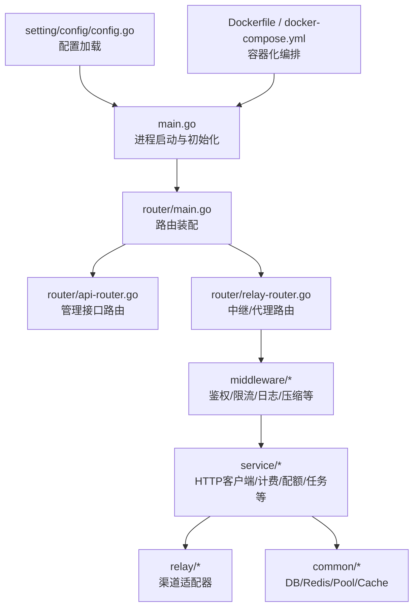
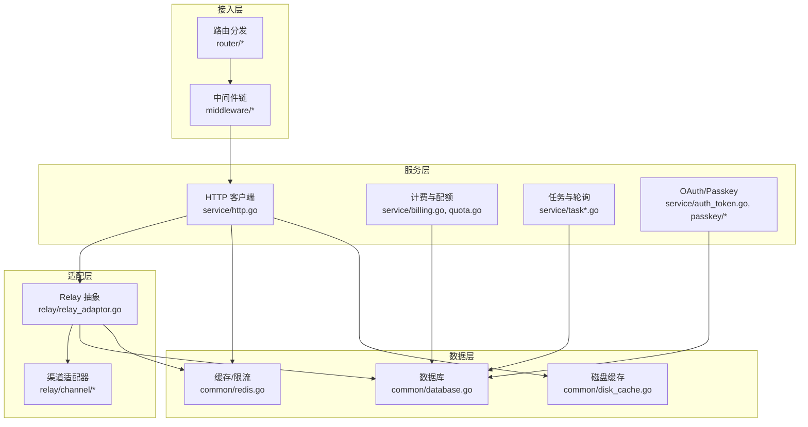
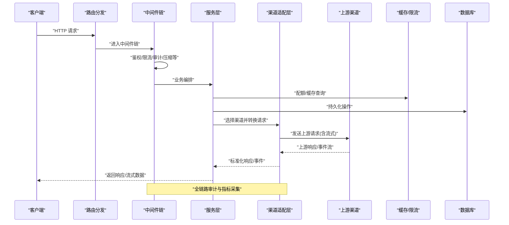
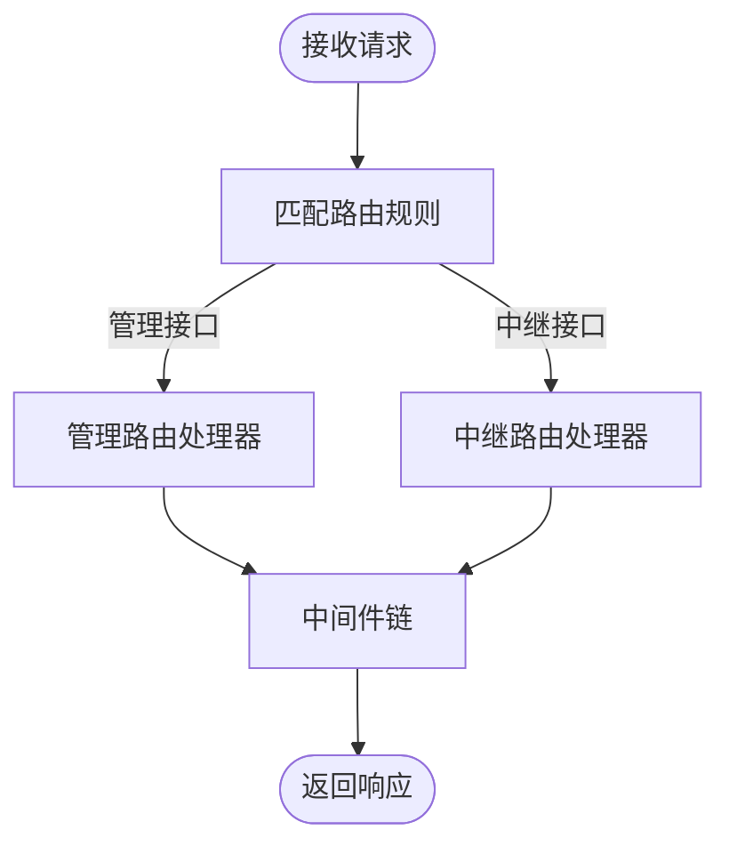
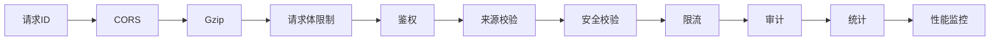
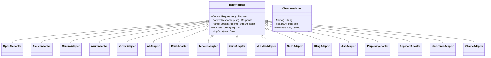
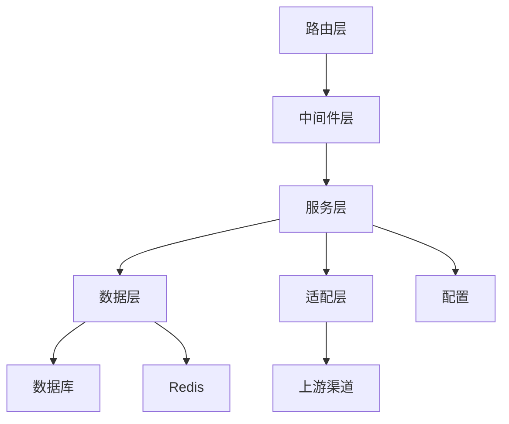
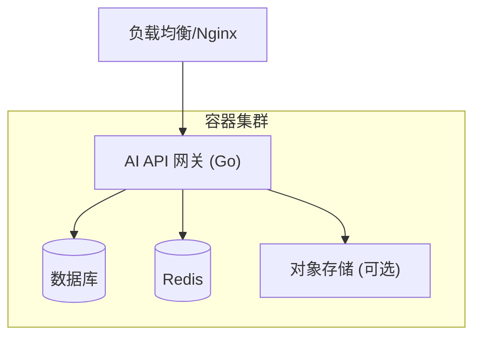

# 整体架构设计

<cite>
**本文引用的文件**   
- [main.go](file://main.go)
- [router/main.go](file://router/main.go)
- [router/api-router.go](file://router/api-router.go)
- [router/relay-router.go](file://router/relay-router.go)
- [middleware/auth.go](file://middleware/auth.go)
- [middleware/distributor.go](file://middleware/distributor.go)
- [middleware/rate-limit.go](file://middleware/rate-limit.go)
- [common/database.go](file://common/database.go)
- [common/redis.go](file://common/redis.go)
- [common/gopool.go](file://common/gopool.go)
- [service/http.go](file://service/http.go)
- [relay/relay_adaptor.go](file://relay/relay_adaptor.go)
- [relay/channel/adapter.go](file://relay/channel/adapter.go)
- [setting/config/config.go](file://setting/config/config.go)
- [Dockerfile](file://Dockerfile)
- [docker-compose.yml](file://docker-compose.yml)
</cite>

## 目录
1. [简介](#简介)
2. [项目结构](#项目结构)
3. [核心组件](#核心组件)
4. [架构总览](#架构总览)
5. [详细组件分析](#详细组件分析)
6. [依赖关系分析](#依赖关系分析)
7. [性能考量](#性能考量)
8. [故障排查指南](#故障排查指南)
9. [结论](#结论)
10. [附录](#附录)

## 简介
本文件为 AI API 网关系统的整体架构设计文档，面向系统架构师、后端工程师与运维人员。内容涵盖分层架构、核心组件与模块关系、请求处理生命周期（从 HTTP 进入至响应返回）、路由分发机制、中间件链与执行顺序、系统上下文图（外部依赖、数据库、缓存、第三方服务集成）、技术栈选择与权衡、部署架构图与容器化方案。

## 项目结构
系统采用 Go 语言实现，前后端分离：后端提供 REST/流式 API 与代理转发能力，前端基于 React 构建控制台与 Playground。后端按职责划分为入口与路由、中间件、业务服务、数据模型、渠道适配层、配置与设置等模块。

- 入口与路由
  - main.go：进程启动、初始化配置、注册路由、启动 HTTP 服务器
  - router/*：API 路由、Web 路由、中继路由等
- 中间件
  - middleware/*：鉴权、限流、日志、压缩、请求体限制、分发器、审计等
- 服务层
  - service/*：HTTP 客户端、计费、配额、任务、用户会话、认证令牌等
- 渠道适配层
  - relay/*：统一抽象与多厂商适配（OpenAI、Claude、Gemini、Azure、Vertex 等）
- 数据与缓存
  - common/*：数据库连接、Redis 客户端、Goroutine 池、磁盘缓存等
- 配置与设置
  - setting/*：运行时配置、性能指标、计费策略、通道亲和性等
- 前端
  - web/*：React 控制台与 Playground

**图表来源** 
- [main.go](file://main.go)
- [router/main.go](file://router/main.go)
- [router/api-router.go](file://router/api-router.go)
- [router/relay-router.go](file://router/relay-router.go)
- [middleware/auth.go](file://middleware/auth.go)
- [common/database.go](file://common/database.go)
- [common/redis.go](file://common/redis.go)
- [setting/config/config.go](file://setting/config/config.go)
- [Dockerfile](file://Dockerfile)
- [docker-compose.yml](file://docker-compose.yml)

**章节来源**
- [main.go](file://main.go)
- [router/main.go](file://router/main.go)
- [router/api-router.go](file://router/api-router.go)
- [router/relay-router.go](file://router/relay-router.go)
- [setting/config/config.go](file://setting/config/config.go)

## 核心组件
- 路由与控制器
  - 管理 API：用户、Token、渠道、计费、订阅、支付、仪表盘等
  - 中继 API：Chat Completions、Embedding、Images、Audio、Responses、Realtime 等
- 中间件链
  - 鉴权、来源校验、安全验证、限流、请求体限制、Gzip、CORS、审计、统计、性能监控等
- 服务层
  - HTTP 客户端封装、重试与超时、计费表达式计算、配额与用量统计、任务调度与轮询、OAuth/Passkey 认证、文件解码与下载
- 渠道适配层
  - 统一抽象 Adapter，支持多厂商协议转换、流式处理、计费与 Token 估算、错误映射
- 数据与缓存
  - 关系型数据库（MySQL/PostgreSQL）、Redis（缓存/限流/分布式锁）、磁盘缓存、对象存储（可选）
- 配置与可观测性
  - 动态配置、性能指标采集、PProf、结构化日志、审计日志

**章节来源**
- [router/api-router.go](file://router/api-router.go)
- [router/relay-router.go](file://router/relay-router.go)
- [middleware/auth.go](file://middleware/auth.go)
- [middleware/rate-limit.go](file://middleware/rate-limit.go)
- [service/http.go](file://service/http.go)
- [relay/relay_adaptor.go](file://relay/relay_adaptor.go)
- [common/database.go](file://common/database.go)
- [common/redis.go](file://common/redis.go)

## 架构总览
系统采用“网关 + 适配”的分层架构：
- 接入层：HTTP 服务器与路由分发
- 中间件层：鉴权、限流、审计、压缩、CORS、请求体限制、统计
- 服务层：业务编排（计费、配额、任务、OAuth、文件处理等）
- 适配层：多厂商渠道适配与协议转换
- 数据层：数据库、缓存、对象存储、消息队列（可选）

**图表来源** 
- [router/main.go](file://router/main.go)
- [middleware/auth.go](file://middleware/auth.go)
- [service/http.go](file://service/http.go)
- [relay/relay_adaptor.go](file://relay/relay_adaptor.go)
- [relay/channel/adapter.go](file://relay/channel/adapter.go)
- [common/database.go](file://common/database.go)
- [common/redis.go](file://common/redis.go)

## 详细组件分析

### 请求处理生命周期（HTTP 到响应）
- 入口与路由
  - 进程启动后加载配置并注册路由，区分管理 API 与中继 API
- 中间件链
  - 依次执行：请求 ID、CORS、Gzip、请求体限制、鉴权、来源校验、安全校验、限流、审计、统计、性能监控
- 服务编排
  - 计费表达式计算、配额检查、Token 估算、任务创建/轮询、OAuth/Passkey 流程
- 渠道适配
  - 根据模型/端点选择渠道，进行请求转换、流式读取、响应转换、错误映射与计费结算
- 响应返回
  - 统一错误码、审计记录、指标上报、缓存写入（可选）

**图表来源** 
- [router/api-router.go](file://router/api-router.go)
- [router/relay-router.go](file://router/relay-router.go)
- [middleware/auth.go](file://middleware/auth.go)
- [middleware/rate-limit.go](file://middleware/rate-limit.go)
- [service/http.go](file://service/http.go)
- [relay/relay_adaptor.go](file://relay/relay_adaptor.go)
- [common/redis.go](file://common/redis.go)
- [common/database.go](file://common/database.go)

**章节来源**
- [router/api-router.go](file://router/api-router.go)
- [router/relay-router.go](file://router/relay-router.go)
- [middleware/auth.go](file://middleware/auth.go)
- [middleware/rate-limit.go](file://middleware/rate-limit.go)
- [service/http.go](file://service/http.go)
- [relay/relay_adaptor.go](file://relay/relay_adaptor.go)

### 路由分发机制
- 管理路由：用户、Token、渠道、计费、订阅、支付、仪表盘、系统信息等
- 中继路由：OpenAI 兼容接口、Responses、Realtime、图像/音频/视频、Rerank、Embedding 等
- 路由规则：路径前缀、方法匹配、参数校验、动态模型映射

**图表来源** 
- [router/api-router.go](file://router/api-router.go)
- [router/relay-router.go](file://router/relay-router.go)

**章节来源**
- [router/api-router.go](file://router/api-router.go)
- [router/relay-router.go](file://router/relay-router.go)

### 中间件链与执行顺序
- 典型顺序：请求 ID → CORS → Gzip → 请求体限制 → 鉴权 → 来源校验 → 安全校验 → 限流 → 审计 → 统计 → 性能监控
- 可扩展：新增中间件通过路由装配注入，支持条件启用

**图表来源** 
- [middleware/auth.go](file://middleware/auth.go)
- [middleware/rate-limit.go](file://middleware/rate-limit.go)

**章节来源**
- [middleware/auth.go](file://middleware/auth.go)
- [middleware/rate-limit.go](file://middleware/rate-limit.go)

### 渠道适配层（Relay）
- 统一抽象：Adapter 定义请求/响应转换、流式处理、计费与 Token 估算、错误映射
- 多厂商支持：OpenAI、Claude、Gemini、Azure、Vertex、阿里云、百度、腾讯、智谱、MiniMax、Suno、Kling、Jina、Perplexity、Replicate、XInference、Ollama 等
- 选择策略：模型映射、权重、亲和性、健康检查、负载均衡

**图表来源** 
- [relay/relay_adaptor.go](file://relay/relay_adaptor.go)
- [relay/channel/adapter.go](file://relay/channel/adapter.go)

**章节来源**
- [relay/relay_adaptor.go](file://relay/relay_adaptor.go)
- [relay/channel/adapter.go](file://relay/channel/adapter.go)

### 系统上下文图（外部依赖与集成）
- 外部依赖：上游 AI 渠道（OpenAI、Claude、Gemini、Azure、Vertex、阿里云、百度、腾讯、智谱、MiniMax、Suno、Kling、Jina、Perplexity、Replicate、XInference、Ollama 等）
- 数据存储：关系型数据库（MySQL/PostgreSQL）、Redis（缓存/限流/分布式锁）、磁盘缓存、对象存储（可选）
- 第三方服务：邮件、支付（Stripe、Creem、Waffo）、OAuth/Passkey、验证码（Turnstile）、审计与监控（Prometheus/Grafana，可选）

```mermaid
graph TB
GW["AI API 网关"] --> DB["数据库"]
GW --> Redis["Redis"]
GW --> Disk["磁盘缓存"]
GW --> OA["OpenAI"]
GW --> CL["Claude"]
GW --> GE["Gemini"]
GW --> AZ["Azure"]
GW --> VE["Vertex"]
GW --> ALI["阿里云"]
GW --> BD["百度"]
GW --> TX["腾讯"]
GW --> ZP["智谱"]
GW --> MM["MiniMax"]
GW --> SN["Suno"]
GW --> KL["Kling"]
GW --> JN["Jina"]
GW --> PP["Perplexity"]
GW --> RP["Replicate"]
GW --> XI["XInference"]
GW --> OL["Ollama"]
GW --> Mail["邮件服务"]
GW --> Pay["支付服务"]
GW --> OAuth["OAuth/Passkey"]
GW --> Mon["监控/审计"]
```

**图表来源** 
- [common/database.go](file://common/database.go)
- [common/redis.go](file://common/redis.go)
- [service/http.go](file://service/http.go)
- [relay/channel/adapter.go](file://relay/channel/adapter.go)

**章节来源**
- [common/database.go](file://common/database.go)
- [common/redis.go](file://common/redis.go)
- [service/http.go](file://service/http.go)
- [relay/channel/adapter.go](file://relay/channel/adapter.go)

### 技术栈选择与权衡
- Go 语言：高并发、低内存占用、编译型二进制部署，适合网关与高吞吐场景
- Gin/Echo（路由框架）：轻量高效，中间件生态完善
- MySQL/PostgreSQL：成熟稳定，事务与复杂查询支持
- Redis：高性能缓存、分布式限流、会话与锁
- 流式处理：SSE/WS 原生支持，降低延迟提升用户体验
- 权衡：
  - 多厂商适配复杂度 vs 统一抽象收益
  - 缓存一致性 vs 性能
  - 限流粒度（全局/模型/用户）vs 资源保护
  - 计费精度 vs 计算开销

[本节为概念性说明，不直接分析具体文件]

## 依赖关系分析
- 模块耦合
  - 路由层依赖中间件与服务层
  - 服务层依赖数据层与适配层
  - 适配层依赖 HTTP 客户端与配置
- 外部依赖
  - 数据库、Redis、对象存储、上游渠道、支付与邮件服务
- 循环依赖
  - 通过接口抽象与依赖注入避免循环

**图表来源** 
- [router/main.go](file://router/main.go)
- [service/http.go](file://service/http.go)
- [relay/relay_adaptor.go](file://relay/relay_adaptor.go)
- [common/database.go](file://common/database.go)
- [common/redis.go](file://common/redis.go)
- [setting/config/config.go](file://setting/config/config.go)

**章节来源**
- [router/main.go](file://router/main.go)
- [service/http.go](file://service/http.go)
- [relay/relay_adaptor.go](file://relay/relay_adaptor.go)
- [common/database.go](file://common/database.go)
- [common/redis.go](file://common/redis.go)
- [setting/config/config.go](file://setting/config/config.go)

## 性能考量
- 并发与线程池
  - Goroutine 池与异步任务调度，避免阻塞
- 缓存策略
  - 多级缓存（内存/Redis/磁盘），热点数据优先命中
- 限流与背压
  - 全局/模型/用户维度限流，滑动窗口与令牌桶
- 流式传输
  - SSE/WS 流式响应，减少首字节延迟
- 连接池与超时
  - HTTP 客户端连接复用、超时与重试策略
- 监控与诊断
  - PProf、结构化日志、审计日志、指标采集

[本节为通用指导，不直接分析具体文件]

## 故障排查指南
- 常见问题
  - 鉴权失败：检查 Token、签名、来源白名单
  - 限流触发：查看限流配置与阈值
  - 上游超时/错误：检查渠道健康状态与网络连通性
  - 计费异常：核对计费表达式与 Token 估算
- 定位手段
  - 审计日志与请求 ID 追踪
  - PProf 快照与 CPU/Mem 分析
  - Redis/DB 慢查询与连接池监控
  - 渠道适配器错误映射与重试日志

**章节来源**
- [middleware/auth.go](file://middleware/auth.go)
- [middleware/rate-limit.go](file://middleware/rate-limit.go)
- [service/http.go](file://service/http.go)
- [relay/relay_adaptor.go](file://relay/relay_adaptor.go)

## 结论
本架构以“网关 + 适配”为核心，通过分层解耦与中间件链实现高内聚、低耦合的系统设计。统一的渠道适配层屏蔽多厂商差异，服务层负责计费、配额与任务编排，数据层提供可靠存储与缓存。配合完善的监控与限流策略，满足高并发、低延迟与可扩展的 AI API 网关需求。

[本节为总结性说明，不直接分析具体文件]

## 附录

### 部署架构图与容器化方案
- 容器镜像
  - 单二进制部署，最小化基础镜像，非 root 运行
- 编排
  - Docker Compose：应用、数据库、Redis、对象存储（可选）
  - Kubernetes：Deployment/Service/ConfigMap/Secret/HPA
- 环境变量与配置
  - 数据库连接、Redis 地址、渠道密钥、限流策略、计费策略
- 健康检查与滚动更新
  - Liveness/Readiness Probe，蓝绿/灰度发布

**图表来源** 
- [Dockerfile](file://Dockerfile)
- [docker-compose.yml](file://docker-compose.yml)

**章节来源**
- [Dockerfile](file://Dockerfile)
- [docker-compose.yml](file://docker-compose.yml)