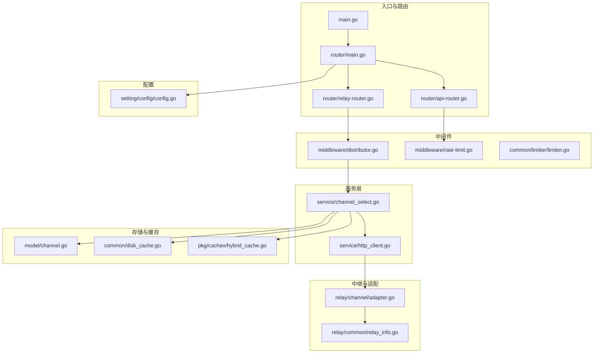
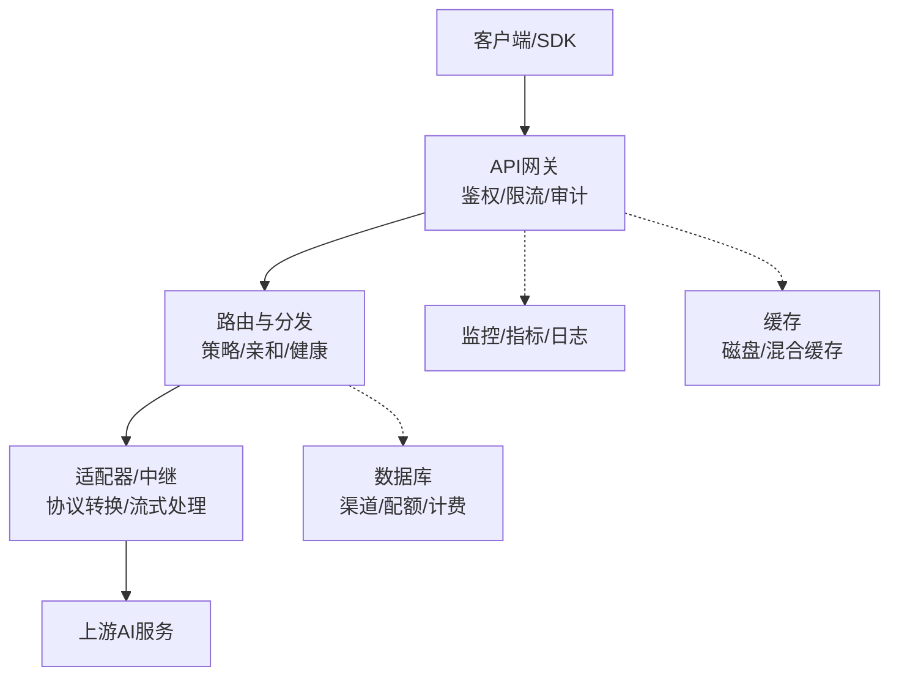
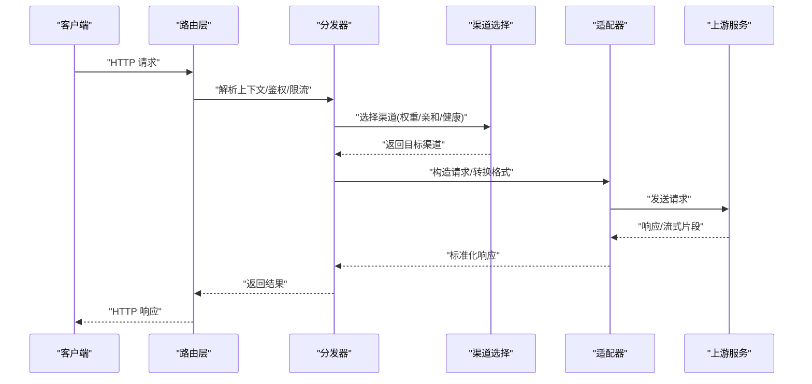
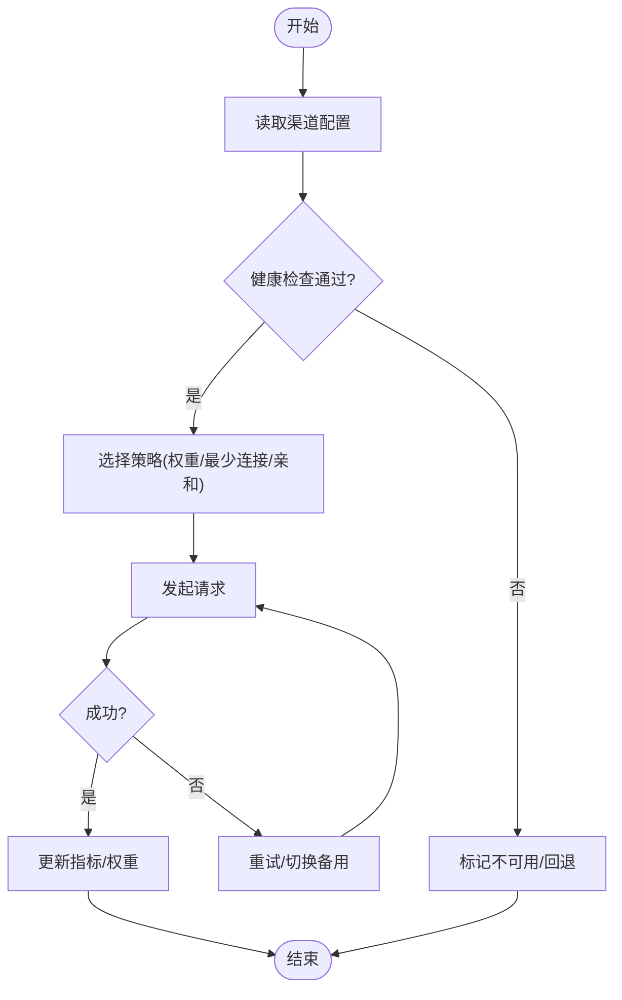
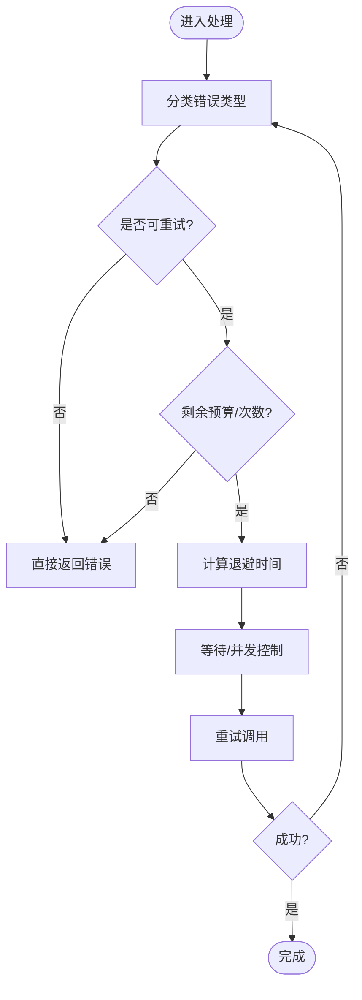
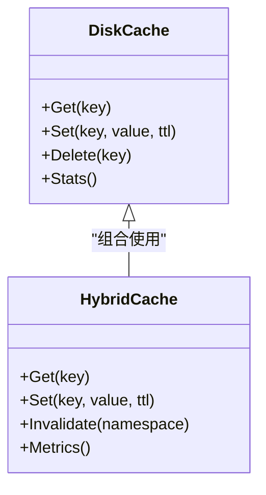
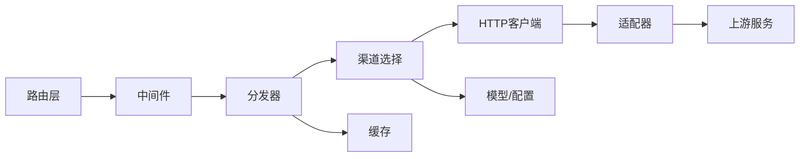
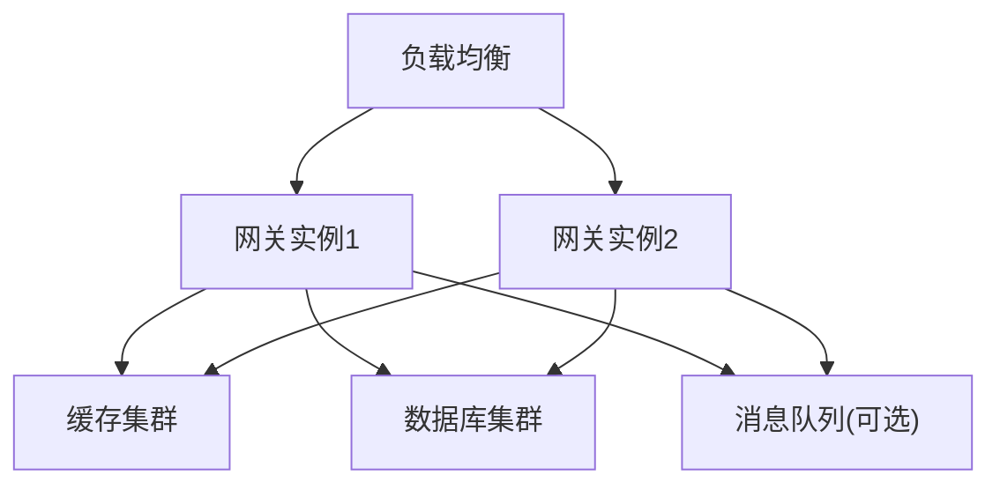

# 系统架构

<cite>
**本文引用的文件**   
- [main.go](file://main.go)
- [router/main.go](file://router/main.go)
- [router/api-router.go](file://router/api-router.go)
- [router/relay-router.go](file://router/relay-router.go)
- [middleware/distributor.go](file://middleware/distributor.go)
- [middleware/rate-limit.go](file://middleware/rate-limit.go)
- [common/limiter/limiter.go](file://common/limiter/limiter.go)
- [common/disk_cache.go](file://common/disk_cache.go)
- [pkg/cachex/hybrid_cache.go](file://pkg/cachex/hybrid_cache.go)
- [relay/channel/adapter.go](file://relay/channel/adapter.go)
- [relay/common/relay_info.go](file://relay/common/relay_info.go)
- [service/channel_select.go](file://service/channel_select.go)
- [service/http_client.go](file://service/http_client.go)
- [model/channel.go](file://model/channel.go)
- [setting/config/config.go](file://setting/config/config.go)
- [Dockerfile](file://Dockerfile)
- [docker-compose.yml](file://docker-compose.yml)
</cite>

## 目录
1. [简介](#简介)
2. [项目结构](#项目结构)
3. [核心组件](#核心组件)
4. [架构总览](#架构总览)
5. [详细组件分析](#详细组件分析)
6. [依赖关系分析](#依赖关系分析)
7. [性能考量](#性能考量)
8. [故障排查指南](#故障排查指南)
9. [结论](#结论)
10. [附录](#附录)

## 简介
本架构文档面向AI API网关系统，聚焦高层设计、架构模式与系统边界，详细说明组件交互、数据流与集成模式。重点覆盖请求路由机制、负载均衡策略、错误处理与缓存架构，并给出基础设施需求、可扩展性考虑与部署拓扑。同时记录横切关注点（安全性、监控、灾难恢复）、技术栈、第三方依赖与版本兼容性。

## 项目结构
系统采用分层与模块化组织：入口与路由层负责HTTP接入与分发；中间件层提供鉴权、限流、审计、压缩等横切能力；服务层实现渠道选择、计费、配额、任务调度等；模型层管理持久化实体；中继层对接多家上游AI厂商；配置与设置模块集中管理运行时参数；公共库封装通用工具与缓存、限流等能力。

图表来源
- [main.go](file://main.go)
- [router/main.go](file://router/main.go)
- [router/api-router.go](file://router/api-router.go)
- [router/relay-router.go](file://router/relay-router.go)
- [middleware/distributor.go](file://middleware/distributor.go)
- [middleware/rate-limit.go](file://middleware/rate-limit.go)
- [common/limiter/limiter.go](file://common/limiter/limiter.go)
- [service/channel_select.go](file://service/channel_select.go)
- [service/http_client.go](file://service/http_client.go)
- [relay/channel/adapter.go](file://relay/channel/adapter.go)
- [relay/common/relay_info.go](file://relay/common/relay_info.go)
- [model/channel.go](file://model/channel.go)
- [common/disk_cache.go](file://common/disk_cache.go)
- [pkg/cachex/hybrid_cache.go](file://pkg/cachex/hybrid_cache.go)
- [setting/config/config.go](file://setting/config/config.go)

章节来源
- [main.go](file://main.go)
- [router/main.go](file://router/main.go)
- [router/api-router.go](file://router/api-router.go)
- [router/relay-router.go](file://router/relay-router.go)

## 核心组件
- 入口与路由
  - 应用启动与监听端口、中间件装配、路由注册由入口与路由器完成。
  - API路由与中继路由分离，便于扩展不同协议与业务域。
- 中间件
  - 分发器根据请求上下文选择目标渠道或上游。
  - 限流器基于令牌桶/滑动窗口对全局、用户、模型维度进行限制。
- 服务层
  - 渠道选择策略支持权重、亲和、健康检查与失败回退。
  - HTTP客户端负责连接池、超时、重试与指标上报。
- 中继与适配
  - 统一适配器抽象各上游API差异，标准化请求/响应与流式处理。
  - 中继信息对象贯穿调用链，承载计费、追踪与诊断元数据。
- 存储与缓存
  - 磁盘缓存用于大对象或热数据持久化，降低上游压力。
  - 混合缓存（内存+外部）提供高吞吐低延迟的键值访问。
- 配置
  - 集中化管理运行参数、功能开关、比率与配额策略。

章节来源
- [router/main.go](file://router/main.go)
- [router/api-router.go](file://router/api-router.go)
- [router/relay-router.go](file://router/relay-router.go)
- [middleware/distributor.go](file://middleware/distributor.go)
- [middleware/rate-limit.go](file://middleware/rate-limit.go)
- [common/limiter/limiter.go](file://common/limiter/limiter.go)
- [service/channel_select.go](file://service/channel_select.go)
- [service/http_client.go](file://service/http_client.go)
- [relay/channel/adapter.go](file://relay/channel/adapter.go)
- [relay/common/relay_info.go](file://relay/common/relay_info.go)
- [common/disk_cache.go](file://common/disk_cache.go)
- [pkg/cachex/hybrid_cache.go](file://pkg/cachex/hybrid_cache.go)
- [setting/config/config.go](file://setting/config/config.go)

## 架构总览
系统采用“网关+适配器”的分层架构：
- 网关层：统一入口、鉴权、限流、审计、压缩、CORS、请求体限制等。
- 路由与分发层：按模型、租户、路径、头部等维度选择渠道。
- 适配与中继层：将内部请求转换为上游格式，处理流式与非流式响应。
- 可观测与治理：指标、日志、链路追踪、告警、熔断与降级。
- 缓存与存储：本地磁盘缓存与混合缓存，数据库持久化渠道与配额。

图表来源
- [router/main.go](file://router/main.go)
- [middleware/distributor.go](file://middleware/distributor.go)
- [relay/channel/adapter.go](file://relay/channel/adapter.go)
- [common/disk_cache.go](file://common/disk_cache.go)
- [pkg/cachex/hybrid_cache.go](file://pkg/cachex/hybrid_cache.go)
- [model/channel.go](file://model/channel.go)

## 详细组件分析

### 请求路由与分发机制
- 路由注册
  - API路由与中继路由分别定义，避免耦合。
- 分发策略
  - 基于模型映射、租户隔离、头部与查询参数决定目标渠道。
  - 支持权重轮询、最少连接、亲和绑定与健康检查。
- 失败回退
  - 自动切换备用渠道，统计失败率并动态降权。

图表来源
- [router/relay-router.go](file://router/relay-router.go)
- [middleware/distributor.go](file://middleware/distributor.go)
- [service/channel_select.go](file://service/channel_select.go)
- [relay/channel/adapter.go](file://relay/channel/adapter.go)

章节来源
- [router/relay-router.go](file://router/relay-router.go)
- [middleware/distributor.go](file://middleware/distributor.go)
- [service/channel_select.go](file://service/channel_select.go)

### 负载均衡与渠道选择
- 策略类型
  - 轮询、加权轮询、最少活跃连接、一致性哈希（按用户/模型）。
- 健康检查
  - 定期探测上游可用性，异常自动剔除，恢复后自动加入。
- 亲和与分组
  - 支持渠道亲和模板，减少跨地域/跨账号抖动。

图表来源
- [service/channel_select.go](file://service/channel_select.go)
- [model/channel.go](file://model/channel.go)

章节来源
- [service/channel_select.go](file://service/channel_select.go)
- [model/channel.go](file://model/channel.go)

### 错误处理与重试
- 错误分类
  - 网络错误、认证失败、速率限制、上游业务错误。
- 重试策略
  - 指数退避、最大重试次数、幂等性判断。
- 降级与熔断
  - 快速失败、短路保护、阈值触发熔断。

图表来源
- [service/http_client.go](file://service/http_client.go)
- [relay/common/relay_info.go](file://relay/common/relay_info.go)

章节来源
- [service/http_client.go](file://service/http_client.go)
- [relay/common/relay_info.go](file://relay/common/relay_info.go)

### 缓存架构
- 缓存层次
  - 本地磁盘缓存：大对象、媒体资源、频繁读热点。
  - 混合缓存：内存+外部（如Redis），兼顾吞吐与一致性。
- 键空间与命名空间
  - 按租户/模型/渠道划分命名空间，避免冲突。
- 失效与一致性
  - TTL、主动失效、版本号校验、写穿/旁路策略。

图表来源
- [common/disk_cache.go](file://common/disk_cache.go)
- [pkg/cachex/hybrid_cache.go](file://pkg/cachex/hybrid_cache.go)

章节来源
- [common/disk_cache.go](file://common/disk_cache.go)
- [pkg/cachex/hybrid_cache.go](file://pkg/cachex/hybrid_cache.go)

### 安全与鉴权
- 鉴权方式
  - Token/OAuth/Passkey/多因子认证。
- 授权模型
  - 基于角色的访问控制（RBAC）与资源级权限。
- 安全防护
  - CORS、SSRF防护、请求体大小限制、敏感信息脱敏。

章节来源
- [middleware/auth.go](file://middleware/auth.go)
- [service/auth_token.go](file://service/auth_token.go)
- [common/ssrf_protection.go](file://common/ssrf_protection.go)

### 监控与可观测性
- 指标
  - QPS、延迟分位、错误率、渠道健康、缓存命中率。
- 日志
  - 结构化日志、请求ID追踪、审计日志。
- 告警
  - 阈值告警、熔断告警、上游不可用告警。

章节来源
- [common/system_monitor.go](file://common/system_monitor.go)
- [logger/logger.go](file://logger/logger.go)

### 限流与配额
- 限流维度
  - 全局、用户、模型、渠道、IP。
- 配额策略
  - 按用量计费、阶梯定价、封顶与冻结。
- 实现
  - 令牌桶/滑动窗口，分布式计数。

章节来源
- [middleware/rate-limit.go](file://middleware/rate-limit.go)
- [common/limiter/limiter.go](file://common/limiter/limiter.go)
- [service/billing.go](file://service/billing.go)

## 依赖关系分析
- 组件耦合
  - 路由层依赖中间件；分发器依赖渠道选择；适配器依赖HTTP客户端。
- 外部依赖
  - 数据库、缓存（Redis）、消息队列（可选）、对象存储（可选）。
- 潜在循环依赖
  - 通过接口与事件解耦，避免服务间直接强引用。

图表来源
- [router/main.go](file://router/main.go)
- [middleware/distributor.go](file://middleware/distributor.go)
- [service/channel_select.go](file://service/channel_select.go)
- [service/http_client.go](file://service/http_client.go)
- [relay/channel/adapter.go](file://relay/channel/adapter.go)
- [model/channel.go](file://model/channel.go)
- [common/disk_cache.go](file://common/disk_cache.go)

章节来源
- [router/main.go](file://router/main.go)
- [middleware/distributor.go](file://middleware/distributor.go)
- [service/channel_select.go](file://service/channel_select.go)
- [service/http_client.go](file://service/http_client.go)
- [relay/channel/adapter.go](file://relay/channel/adapter.go)
- [model/channel.go](file://model/channel.go)
- [common/disk_cache.go](file://common/disk_cache.go)

## 性能考量
- 连接池与复用
  - HTTP客户端连接池、长连接、Keep-Alive优化。
- 并发与异步
  - 协程池、背压控制、非阻塞I/O。
- 缓存命中
  - 热点数据预取、多级缓存、批量写入。
- 序列化与压缩
  - JSON优化、Gzip/Brotli压缩、流式传输。
- 资源隔离
  - 按租户/模型隔离线程池与队列，防止雪崩。

[本节为通用指导，不直接分析具体文件]

## 故障排查指南
- 常见问题
  - 上游不可用、鉴权失败、限流触发、缓存不一致、超时与重试风暴。
- 定位方法
  - 查看请求ID与链路追踪、检查渠道健康状态、核对限流配额、验证缓存键与TTL。
- 恢复策略
  - 快速回滚配置、临时关闭缓存、降级到备用渠道、扩容与限流收紧。

章节来源
- [service/error.go](file://service/error.go)
- [relay/common/relay_info.go](file://relay/common/relay_info.go)
- [common/system_monitor.go](file://common/system_monitor.go)

## 结论
本网关以清晰的分层与适配器模式实现对多家上游的统一接入，结合灵活的渠道选择、健壮的缓存与限流体系，满足高可用与可扩展需求。通过完善的监控与错误处理，保障生产稳定性。建议在后续迭代中持续完善可观测性与自动化运维能力。

[本节为总结，不直接分析具体文件]

## 附录

### 基础设施需求
- 计算资源
  - CPU/内存按QPS与并发估算，建议水平扩展。
- 存储
  - 数据库（MySQL/PostgreSQL）、缓存（Redis）、对象存储（可选）。
- 网络
  - 低延迟、高带宽，支持IPv6与TLS。

[本节为通用指导，不直接分析具体文件]

### 可扩展性考虑
- 水平扩展
  - 无状态服务实例，配合负载均衡与发现。
- 垂直扩展
  - 提升单机CPU/内存与I/O能力。
- 插件化
  - 新增上游适配器与中间件无需改动核心。

[本节为通用指导，不直接分析具体文件]

### 部署拓扑
- 容器化
  - Docker镜像构建与编排。
- 集群
  - 多副本部署、滚动升级、灰度发布。
- 环境
  - 开发、测试、预发、生产隔离。

图表来源
- [Dockerfile](file://Dockerfile)
- [docker-compose.yml](file://docker-compose.yml)

章节来源
- [Dockerfile](file://Dockerfile)
- [docker-compose.yml](file://docker-compose.yml)

### 技术栈与兼容性
- 后端
  - Go语言、HTTP框架、ORM、缓存客户端。
- 前端
  - React/TypeScript、构建工具、包管理器。
- 运行时
  - Linux/Windows、容器运行时、操作系统内核参数调优。
- 第三方依赖
  - 上游API SDK、认证服务、支付与订阅服务。

[本节为通用指导，不直接分析具体文件]

### 版本兼容与迁移
- 向后兼容
  - API版本化、字段弃用策略、灰度切换。
- 数据迁移
  - 脚本化迁移、回滚方案、校验与补偿。

[本节为通用指导，不直接分析具体文件]