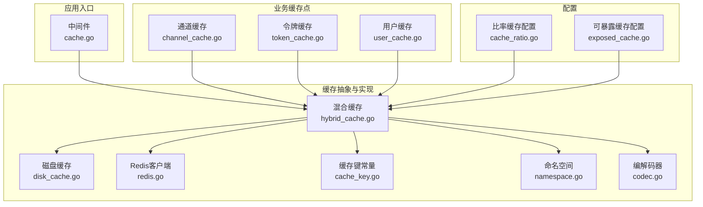
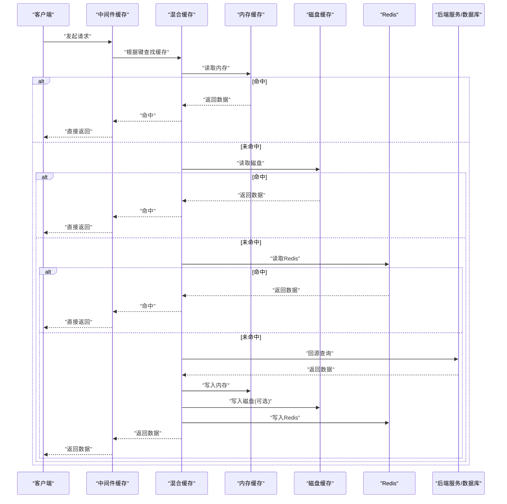
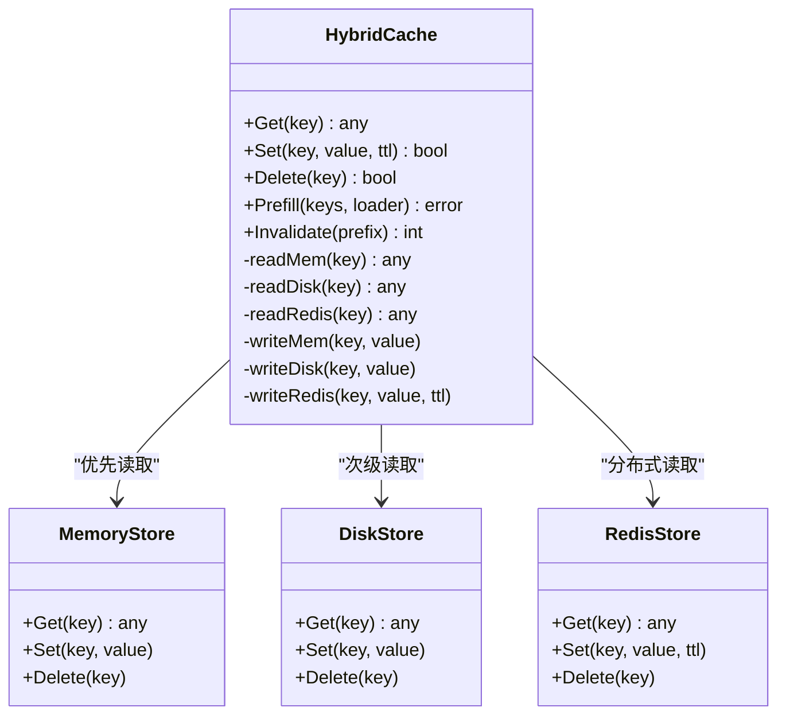
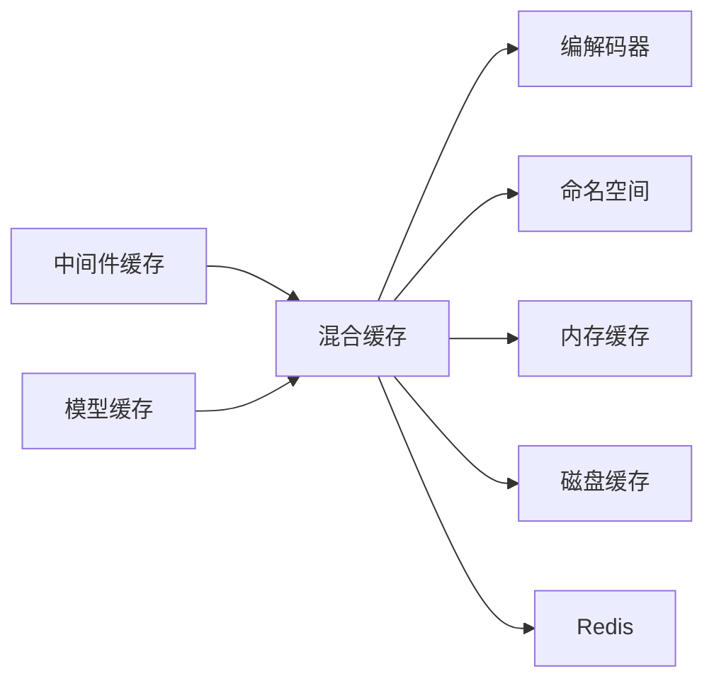

# 缓存架构与策略

<cite>
**本文引用的文件**   
- [common/disk_cache.go](file://common/disk_cache.go)
- [common/disk_cache_config.go](file://common/disk_cache_config.go)
- [common/redis.go](file://common/redis.go)
- [constant/cache_key.go](file://constant/cache_key.go)
- [pkg/cachex/hybrid_cache.go](file://pkg/cachex/hybrid_cache.go)
- [pkg/cachex/codec.go](file://pkg/cachex/codec.go)
- [pkg/cachex/namespace.go](file://pkg/cachex/namespace.go)
- [middleware/cache.go](file://middleware/cache.go)
- [model/channel_cache.go](file://model/channel_cache.go)
- [model/token_cache.go](file://model/token_cache.go)
- [model/user_cache.go](file://model/user_cache.go)
- [model/user_cache_auth_version_test.go](file://model/user_cache_auth_version_test.go)
- [setting/ratio_setting/cache_ratio.go](file://setting/ratio_setting/cache_ratio.go)
- [setting/ratio_setting/exposed_cache.go](file://setting/ratio_setting/exposed_cache.go)
</cite>

## 目录
1. [简介](#简介)
2. [项目结构](#项目结构)
3. [核心组件](#核心组件)
4. [架构总览](#架构总览)
5. [详细组件分析](#详细组件分析)
6. [依赖关系分析](#依赖关系分析)
7. [性能考虑](#性能考虑)
8. [故障排查指南](#故障排查指南)
9. [结论](#结论)
10. [附录](#附录)

## 简介
本文件面向AI API网关的缓存架构，系统性阐述多级缓存策略（内存、磁盘、分布式）的设计与使用场景，覆盖缓存键生成规则、过期策略、一致性保证、热点数据/查询结果/配置缓存的实现要点，以及缓存预热、失效与重建机制。同时提供性能监控与调优建议，并给出缓存穿透、雪崩、击穿等常见问题的防护方案。

## 项目结构
缓存相关能力分布在通用工具层、常量定义、中间件、模型层与专用缓存包中：
- 通用层：磁盘缓存实现与配置、Redis客户端封装
- 常量层：统一的缓存键前缀与命名规范
- 中间件层：HTTP请求级缓存控制
- 模型层：通道、令牌、用户等实体的缓存适配
- 专用包：混合缓存（Hybrid Cache）、编解码、命名空间管理
- 设置层：比率缓存与可暴露缓存的配置项

图表来源
- [middleware/cache.go](file://middleware/cache.go)
- [pkg/cachex/hybrid_cache.go](file://pkg/cachex/hybrid_cache.go)
- [common/disk_cache.go](file://common/disk_cache.go)
- [common/redis.go](file://common/redis.go)
- [constant/cache_key.go](file://constant/cache_key.go)
- [pkg/cachex/namespace.go](file://pkg/cachex/namespace.go)
- [pkg/cachex/codec.go](file://pkg/cachex/codec.go)
- [model/channel_cache.go](file://model/channel_cache.go)
- [model/token_cache.go](file://model/token_cache.go)
- [model/user_cache.go](file://model/user_cache.go)
- [setting/ratio_setting/cache_ratio.go](file://setting/ratio_setting/cache_ratio.go)
- [setting/ratio_setting/exposed_cache.go](file://setting/ratio_setting/exposed_cache.go)

章节来源
- [middleware/cache.go](file://middleware/cache.go)
- [pkg/cachex/hybrid_cache.go](file://pkg/cachex/hybrid_cache.go)
- [common/disk_cache.go](file://common/disk_cache.go)
- [common/redis.go](file://common/redis.go)
- [constant/cache_key.go](file://constant/cache_key.go)
- [pkg/cachex/namespace.go](file://pkg/cachex/namespace.go)
- [pkg/cachex/codec.go](file://pkg/cachex/codec.go)
- [model/channel_cache.go](file://model/channel_cache.go)
- [model/token_cache.go](file://model/token_cache.go)
- [model/user_cache.go](file://model/user_cache.go)
- [setting/ratio_setting/cache_ratio.go](file://setting/ratio_setting/cache_ratio.go)
- [setting/ratio_setting/exposed_cache.go](file://setting/ratio_setting/exposed_cache.go)

## 核心组件
- 混合缓存（Hybrid Cache）
  - 职责：统一封装内存、磁盘、分布式（Redis）三级缓存的读写路径，提供降级与回源逻辑。
  - 关键点：按命中率与延迟选择层级；失败时自动降级；支持TTL与版本化。
- 磁盘缓存
  - 职责：持久化缓存落盘，用于大对象或跨进程共享的热点数据。
  - 关键点：独立配置（容量、路径、清理策略），与内存/Redis协同。
- Redis客户端
  - 职责：连接池、序列化、超时与重试、键前缀隔离。
  - 关键点：与命名空间结合，避免键冲突；支持批量操作与管道。
- 缓存键常量
  - 职责：集中定义键前缀、分隔符、命名约定，确保全局唯一与可读性。
- 命名空间
  - 职责：为不同业务域提供键名前缀隔离，便于分环境部署与灰度。
- 编解码器
  - 职责：统一序列化/反序列化策略，兼容多格式与版本演进。
- 中间件缓存
  - 职责：在HTTP层对响应进行缓存，减少后端压力。
- 模型层缓存
  - 职责：针对通道、令牌、用户等实体提供缓存读写封装，配合版本号与失效策略。
- 配置层
  - 职责：比率缓存与可暴露缓存开关、阈值与策略。

章节来源
- [pkg/cachex/hybrid_cache.go](file://pkg/cachex/hybrid_cache.go)
- [common/disk_cache.go](file://common/disk_cache.go)
- [common/redis.go](file://common/redis.go)
- [constant/cache_key.go](file://constant/cache_key.go)
- [pkg/cachex/namespace.go](file://pkg/cachex/namespace.go)
- [pkg/cachex/codec.go](file://pkg/cachex/codec.go)
- [middleware/cache.go](file://middleware/cache.go)
- [model/channel_cache.go](file://model/channel_cache.go)
- [model/token_cache.go](file://model/token_cache.go)
- [model/user_cache.go](file://model/user_cache.go)
- [setting/ratio_setting/cache_ratio.go](file://setting/ratio_setting/cache_ratio.go)
- [setting/ratio_setting/exposed_cache.go](file://setting/ratio_setting/exposed_cache.go)

## 架构总览
下图展示了从HTTP请求到多级缓存的完整调用链，以及回源与写回流程。

图表来源
- [middleware/cache.go](file://middleware/cache.go)
- [pkg/cachex/hybrid_cache.go](file://pkg/cachex/hybrid_cache.go)
- [common/disk_cache.go](file://common/disk_cache.go)
- [common/redis.go](file://common/redis.go)

## 详细组件分析

### 混合缓存（Hybrid Cache）
- 设计要点
  - 多级读：内存→磁盘→Redis→后端，逐级降级。
  - 写策略：成功回源后按策略写入各层，支持异步落盘与批量写入。
  - TTL与版本：支持每层独立TTL，版本字段用于一致性校验与主动失效。
  - 错误处理：网络异常、序列化失败、权限拒绝等均有兜底与告警。
- 适用场景
  - 热点配置、模型元数据、渠道列表、鉴权令牌、用户会话片段。
- 关键接口与行为
  - Get/Set/Delete：统一签名，内部路由至对应层级。
  - Prefill：预热接口，支持批量预加载。
  - Invalidate：按前缀或精确键失效，支持广播式失效。

图表来源
- [pkg/cachex/hybrid_cache.go](file://pkg/cachex/hybrid_cache.go)
- [common/disk_cache.go](file://common/disk_cache.go)
- [common/redis.go](file://common/redis.go)

章节来源
- [pkg/cachex/hybrid_cache.go](file://pkg/cachex/hybrid_cache.go)

### 磁盘缓存
- 设计要点
  - 独立存储引擎，适合大对象与跨进程共享。
  - 支持容量上限、LRU淘汰、定期清理。
  - 与内存/Redis形成互补，降低远程IO压力。
- 配置项
  - 存储路径、最大大小、单文件大小限制、压缩开关、清理周期。

章节来源
- [common/disk_cache.go](file://common/disk_cache.go)
- [common/disk_cache_config.go](file://common/disk_cache_config.go)

### Redis客户端
- 设计要点
  - 连接池、超时、重试、熔断。
  - 键前缀与命名空间隔离，避免跨环境污染。
  - 序列化策略可插拔，兼容JSON、MessagePack等。
- 使用建议
  - 热点键加随机后缀防热key倾斜。
  - 批量操作使用Pipeline提升吞吐。

章节来源
- [common/redis.go](file://common/redis.go)
- [pkg/cachex/namespace.go](file://pkg/cachex/namespace.go)
- [pkg/cachex/codec.go](file://pkg/cachex/codec.go)

### 缓存键生成与命名规范
- 原则
  - 全局唯一、可读性强、包含必要维度（业务域、实体ID、版本）。
  - 使用前缀隔离（命名空间），避免冲突。
- 规则
  - 键结构：{命名空间}:{业务域}:{实体}:{标识}:{版本}
  - 分隔符固定，禁止动态拼接导致长度爆炸。
  - 敏感信息不直接入键，必要时哈希化处理。

章节来源
- [constant/cache_key.go](file://constant/cache_key.go)
- [pkg/cachex/namespace.go](file://pkg/cachex/namespace.go)

### 中间件缓存
- 功能
  - 基于请求特征生成缓存键，命中则直接返回响应体。
  - 支持白名单/黑名单、条件缓存（状态码、头部）。
- 注意事项
  - 避免缓存带用户态数据的响应。
  - 合理设置TTL，防止脏读。

章节来源
- [middleware/cache.go](file://middleware/cache.go)

### 模型层缓存（通道、令牌、用户）
- 通道缓存
  - 用途：渠道元数据、路由策略、健康状态。
  - 策略：短TTL+变更事件失效，保障高可用。
- 令牌缓存
  - 用途：鉴权令牌校验、配额计数。
  - 策略：版本化+短期TTL，写多读少场景优先Redis。
- 用户缓存
  - 用途：用户画像、权限、偏好设置。
  - 策略：热点用户本地缓存，非热点走Redis。

章节来源
- [model/channel_cache.go](file://model/channel_cache.go)
- [model/token_cache.go](file://model/token_cache.go)
- [model/user_cache.go](file://model/user_cache.go)
- [model/user_cache_auth_version_test.go](file://model/user_cache_auth_version_test.go)

### 配置层（比率缓存与可暴露缓存）
- 比率缓存
  - 用途：计费比率、汇率、权重等频繁读取的配置。
  - 策略：长TTL+主动刷新，变更时广播失效。
- 可暴露缓存
  - 用途：对外API的只读快照，降低上游压力。
  - 策略：定时拉取+增量更新，支持灰度发布。

章节来源
- [setting/ratio_setting/cache_ratio.go](file://setting/ratio_setting/cache_ratio.go)
- [setting/ratio_setting/exposed_cache.go](file://setting/ratio_setting/exposed_cache.go)

## 依赖关系分析
- 耦合关系
  - 混合缓存依赖编解码器与命名空间，屏蔽底层差异。
  - 模型层缓存通过混合缓存访问，解耦具体存储。
  - 中间件仅依赖混合缓存接口，保持轻量。
- 外部依赖
  - Redis作为分布式缓存，需关注连接池与超时。
  - 磁盘缓存依赖文件系统，需关注I/O与权限。

图表来源
- [middleware/cache.go](file://middleware/cache.go)
- [pkg/cachex/hybrid_cache.go](file://pkg/cachex/hybrid_cache.go)
- [pkg/cachex/codec.go](file://pkg/cachex/codec.go)
- [pkg/cachex/namespace.go](file://pkg/cachex/namespace.go)
- [common/disk_cache.go](file://common/disk_cache.go)
- [common/redis.go](file://common/redis.go)

章节来源
- [pkg/cachex/hybrid_cache.go](file://pkg/cachex/hybrid_cache.go)
- [common/disk_cache.go](file://common/disk_cache.go)
- [common/redis.go](file://common/redis.go)
- [middleware/cache.go](file://middleware/cache.go)

## 性能考虑
- 缓存命中率优化
  - 热点数据优先内存，冷数据下沉磁盘/Redis。
  - 合理设置TTL，避免过短导致抖动、过长导致脏读。
- 并发与锁
  - 使用互斥锁或分布式锁保护回源路径，避免缓存击穿。
  - 批量操作与流水线减少RTT。
- 序列化与体积
  - 选择高效编解码器，控制对象体积，避免大对象阻塞。
- 监控与指标
  - 记录各级缓存命中率、延迟、错误率、内存占用、磁盘使用。
  - 设置告警阈值，及时扩容或调整策略。

[本节为通用指导，无需特定文件引用]

## 故障排查指南
- 常见问题
  - 缓存穿透：空值缓存+布隆过滤器拦截非法键。
  - 缓存击穿：热点键加互斥锁，首次加载完成后释放。
  - 缓存雪崩：TTL加随机抖动，分层降级，限流熔断。
- 定位步骤
  - 检查键生成是否正确，是否存在命名空间污染。
  - 查看Redis连接池、超时与重试配置。
  - 核对磁盘缓存路径权限与容量限制。
  - 验证中间件是否误将用户态数据纳入缓存。
- 恢复策略
  - 主动失效指定前缀，触发重建。
  - 预热热点键，快速恢复服务能力。
  - 临时关闭缓存，降级到直连后端。

章节来源
- [middleware/cache.go](file://middleware/cache.go)
- [pkg/cachex/hybrid_cache.go](file://pkg/cachex/hybrid_cache.go)
- [common/redis.go](file://common/redis.go)
- [common/disk_cache.go](file://common/disk_cache.go)

## 结论
本缓存架构以混合缓存为核心，整合内存、磁盘与Redis三级存储，兼顾性能与可靠性。通过统一的键命名、版本化与失效策略，保障一致性与可维护性。结合监控与调优手段，可有效应对穿透、击穿、雪崩等风险，支撑AI API网关的高并发与低延迟需求。

[本节为总结性内容，无需特定文件引用]

## 附录
- 缓存预热
  - 启动阶段批量加载热点配置与模型元数据。
  - 支持增量预热与按需加载。
- 失效与重建
  - 基于版本号与事件驱动的失效机制。
  - 支持按前缀批量失效与灰度重建。
- 监控与调优
  - 采集命中率、延迟、错误率、资源使用。
  - 依据指标动态调整TTL、容量与层级策略。

[本节为补充说明，无需特定文件引用]