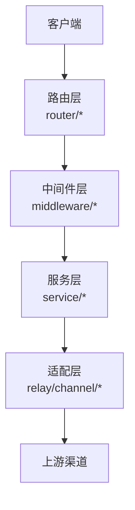
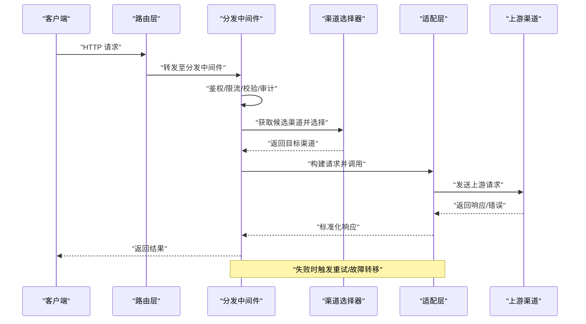
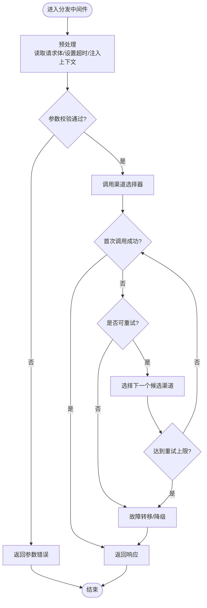
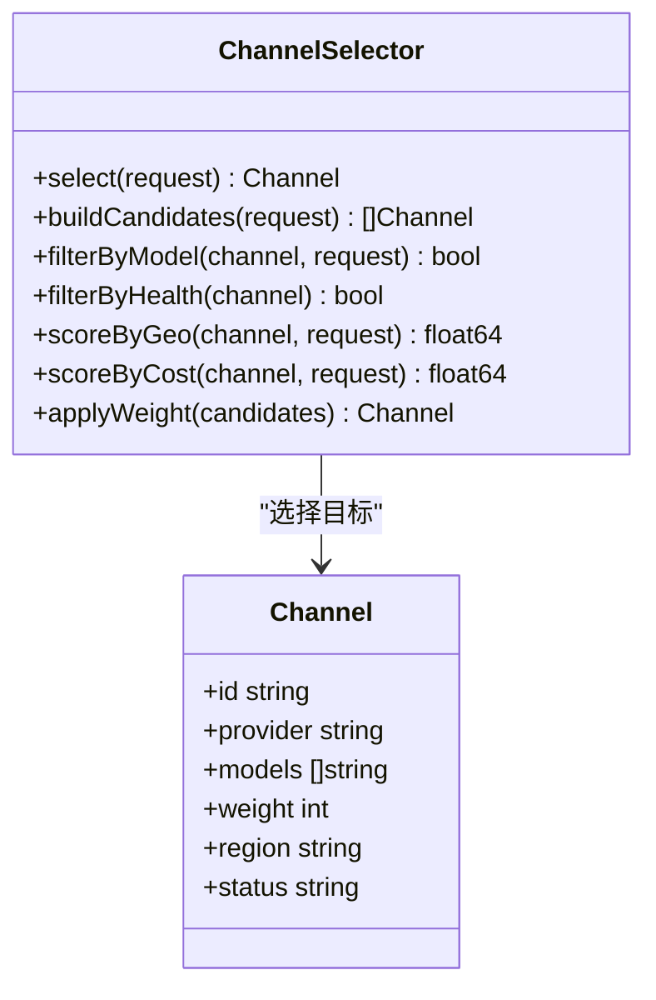
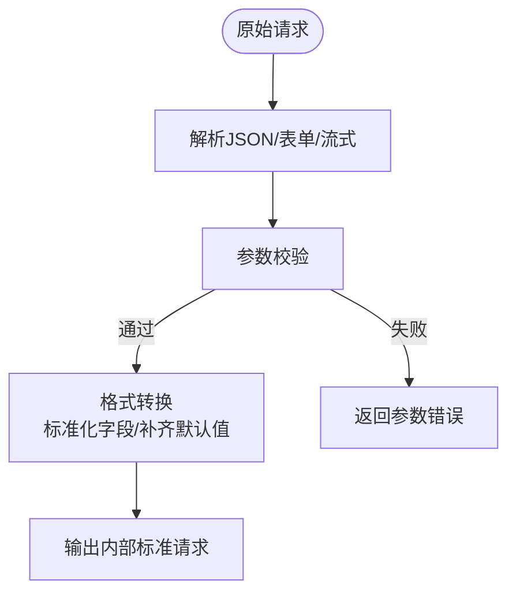
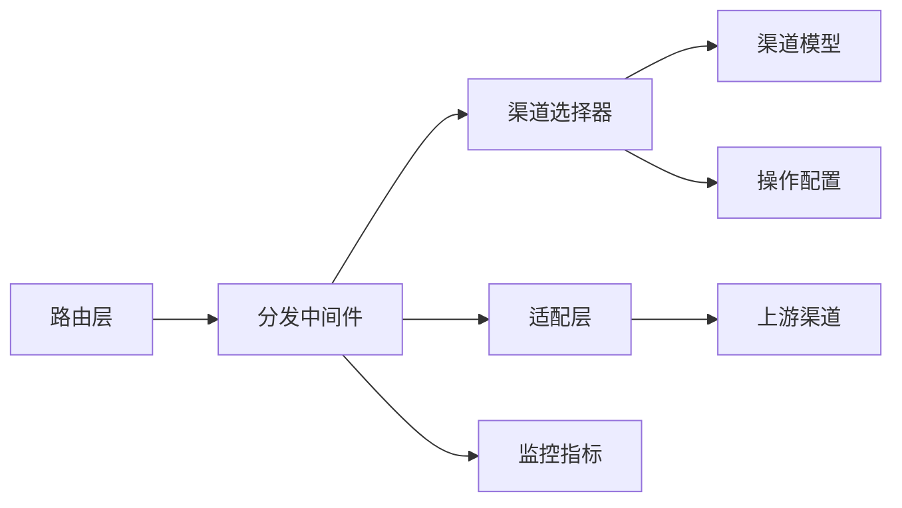

# 请求路由与分发

<cite>
**本文引用的文件**   
- [main.go](file://main.go)
- [router/main.go](file://router/main.go)
- [router/relay-router.go](file://router/relay-router.go)
- [middleware/distributor.go](file://middleware/distributor.go)
- [service/channel_select.go](file://service/channel_select.go)
- [relay/channel/api_request.go](file://relay/channel/api_request.go)
- [relay/common/request_conversion.go](file://relay/common/request_conversion.go)
- [relay/helper/valid_request.go](file://relay/helper/valid_request.go)
- [model/channel.go](file://model/channel.go)
- [setting/operation_setting/general_setting.go](file://setting/operation_setting/general_setting.go)
- [pkg/perf_metrics/metrics.go](file://pkg/perf_metrics/metrics.go)
</cite>

## 目录
1. [简介](#简介)
2. [项目结构](#项目结构)
3. [核心组件](#核心组件)
4. [架构总览](#架构总览)
5. [详细组件分析](#详细组件分析)
6. [依赖关系分析](#依赖关系分析)
7. [性能考量](#性能考量)
8. [故障排查指南](#故障排查指南)
9. [结论](#结论)
10. [附录](#附录)

## 简介
本文件聚焦于AI API网关的请求路由与分发机制，系统性阐述请求如何从入口进入、经过预处理与校验、被选择器按策略分配到具体渠道（channel），以及失败重试与错误处理流程。文档覆盖负载均衡算法、权重分配、故障转移、渠道选择器的多维度决策（模型匹配、地理位置、成本优化）、请求参数验证与格式转换、监控指标与性能优化建议等。

## 项目结构
整体采用“路由层 + 中间件 + 服务层 + 适配层”的分层设计：
- 路由层负责HTTP入口与路径分发
- 中间件层承担鉴权、限流、日志、请求体限制与分发编排
- 服务层实现渠道选择、配额计费、请求转换与转发
- 适配层对接各上游渠道（OpenAI、Claude、Gemini等）

**图示来源** 
- [router/main.go:1-200](file://router/main.go#L1-L200)
- [middleware/distributor.go:1-200](file://middleware/distributor.go#L1-L200)
- [service/channel_select.go:1-200](file://service/channel_select.go#L1-L200)
- [relay/channel/api_request.go:1-200](file://relay/channel/api_request.go#L1-L200)

**章节来源**
- [router/main.go:1-200](file://router/main.go#L1-L200)
- [router/relay-router.go:1-200](file://router/relay-router.go#L1-L200)

## 核心组件
- 路由与分发入口：统一注册中继路由，将API请求导向分发中间件
- 分发中间件：解析请求上下文、执行预处理与校验、调用渠道选择器、编排重试与回退
- 渠道选择器：基于模型能力、权重、健康状态、地理位置、成本等多维度进行候选集筛选与最终选择
- 请求转换与校验：标准化入参、补齐默认值、类型校验、安全校验
- 适配层：将内部请求转换为上游协议并发起调用，处理响应与流式数据
- 监控与指标：记录时延、吞吐、错误率、渠道命中率等关键指标

**章节来源**
- [router/relay-router.go:1-200](file://router/relay-router.go#L1-L200)
- [middleware/distributor.go:1-200](file://middleware/distributor.go#L1-L200)
- [service/channel_select.go:1-200](file://service/channel_select.go#L1-L200)
- [relay/common/request_conversion.go:1-200](file://relay/common/request_conversion.go#L1-L200)
- [relay/helper/valid_request.go:1-200](file://relay/helper/valid_request.go#L1-L200)

## 架构总览
请求从HTTP入口进入后，经路由匹配到中继处理器，随后进入分发中间件。分发中间件完成鉴权、限流、请求体限制、审计等通用逻辑后，调用渠道选择器生成候选渠道列表，并按策略选择一个目标渠道。若首次调用失败，依据重试策略在候选集中切换或降级。最终由适配层封装为上游协议并返回结果。

**图示来源** 
- [router/relay-router.go:1-200](file://router/relay-router.go#L1-L200)
- [middleware/distributor.go:1-200](file://middleware/distributor.go#L1-L200)
- [service/channel_select.go:1-200](file://service/channel_select.go#L1-L200)
- [relay/channel/api_request.go:1-200](file://relay/channel/api_request.go#L1-L200)

## 详细组件分析

### 路由与分发入口
- 路由注册：集中定义中继相关的路径与处理器，确保所有AI API请求进入统一的分发链路
- 上下文注入：在路由阶段注入用户、租户、模型组等上下文信息，供后续中间件与选择器使用
- 错误映射：对常见错误进行统一映射，便于前端展示与监控统计

**章节来源**
- [router/main.go:1-200](file://router/main.go#L1-L200)
- [router/relay-router.go:1-200](file://router/relay-router.go#L1-L200)

### 分发中间件（Distributor）
职责包括：
- 请求预处理：读取并缓存请求体、设置超时、压缩开关、请求ID追踪
- 参数校验：基础字段存在性、类型、长度、枚举值校验
- 安全控制：SSRF防护、IP白名单、速率限制、审计日志
- 分发编排：调用渠道选择器、管理重试与回退、聚合指标上报

**图示来源** 
- [middleware/distributor.go:1-200](file://middleware/distributor.go#L1-L200)

**章节来源**
- [middleware/distributor.go:1-200](file://middleware/distributor.go#L1-L200)

### 渠道选择器（Channel Selector）
选择器根据多维度策略生成候选集并选择最终渠道：
- 模型匹配：根据请求的模型名称、能力标签（文本/图像/音频/视频/任务）过滤支持该模型的渠道
- 权重分配：基于渠道配置的权重进行加权随机或轮询，保证流量均衡
- 健康检查：剔除处于熔断、高延迟、错误率超阈值的渠道
- 地理位置：优先选择低延迟或合规区域的上游
- 成本优化：在满足SLA前提下选择性价比更高的渠道
- 亲和性与缓存：结合用户/租户亲和配置与缓存命中情况做就近选择

**图示来源** 
- [service/channel_select.go:1-200](file://service/channel_select.go#L1-L200)
- [model/channel.go:1-200](file://model/channel.go#L1-L200)

**章节来源**
- [service/channel_select.go:1-200](file://service/channel_select.go#L1-L200)
- [model/channel.go:1-200](file://model/channel.go#L1-L200)

### 请求预处理、参数验证与格式转换
- 预处理：统一读取请求体、设置最大大小、注入请求元数据（如traceId、userAgent、来源IP）
- 参数验证：对必填字段、数值范围、枚举值进行校验，缺失或非法则快速失败
- 格式转换：将不同上游协议的请求统一转换为内部标准格式，再由适配层转回上游协议；同时处理流式与非流式差异

**图示来源** 
- [relay/common/request_conversion.go:1-200](file://relay/common/request_conversion.go#L1-L200)
- [relay/helper/valid_request.go:1-200](file://relay/helper/valid_request.go#L1-L200)

**章节来源**
- [relay/common/request_conversion.go:1-200](file://relay/common/request_conversion.go#L1-L200)
- [relay/helper/valid_request.go:1-200](file://relay/helper/valid_request.go#L1-L200)

### 适配层与上游调用
- 协议适配：将内部标准请求转换为上游特定协议（如OpenAI Chat Completions、Claude Messages、Gemini等）
- 流式处理：对SSE/流式响应进行分片扫描与合并，保证一致性
- 错误归一化：将上游错误码与消息统一映射为网关内部错误模型，便于前端展示与监控

**章节来源**
- [relay/channel/api_request.go:1-200](file://relay/channel/api_request.go#L1-L200)

### 负载均衡、权重与故障转移
- 负载均衡算法：支持加权轮询、加权随机、最少连接、延迟感知等策略，可通过配置动态调整
- 权重分配：每个渠道具备独立权重，影响选择概率；权重可随时间或健康状态动态更新
- 故障转移：当首选渠道失败时，自动切换到次优候选；支持多级降级（如从高质量渠道降级到低成本渠道）

**章节来源**
- [service/channel_select.go:1-200](file://service/channel_select.go#L1-L200)
- [setting/operation_setting/general_setting.go:1-200](file://setting/operation_setting/general_setting.go#L1-L200)

## 依赖关系分析
- 路由层依赖中间件链，中间件依赖服务层的渠道选择器
- 服务层依赖模型定义（渠道元数据、能力标签）与配置（权重、健康阈值、地理策略）
- 适配层依赖各上游渠道的具体实现，屏蔽协议差异
- 监控模块贯穿全链路，采集关键指标用于告警与优化

**图示来源** 
- [router/relay-router.go:1-200](file://router/relay-router.go#L1-L200)
- [middleware/distributor.go:1-200](file://middleware/distributor.go#L1-L200)
- [service/channel_select.go:1-200](file://service/channel_select.go#L1-L200)
- [model/channel.go:1-200](file://model/channel.go#L1-L200)
- [setting/operation_setting/general_setting.go:1-200](file://setting/operation_setting/general_setting.go#L1-L200)
- [pkg/perf_metrics/metrics.go:1-200](file://pkg/perf_metrics/metrics.go#L1-L200)

**章节来源**
- [router/relay-router.go:1-200](file://router/relay-router.go#L1-L200)
- [middleware/distributor.go:1-200](file://middleware/distributor.go#L1-L200)
- [service/channel_select.go:1-200](file://service/channel_select.go#L1-L200)
- [model/channel.go:1-200](file://model/channel.go#L1-L200)
- [setting/operation_setting/general_setting.go:1-200](file://setting/operation_setting/general_setting.go#L1-L200)
- [pkg/perf_metrics/metrics.go:1-200](file://pkg/perf_metrics/metrics.go#L1-L200)

## 性能考量
- 连接池与复用：对上游HTTP连接进行池化管理，减少握手开销
- 并发与异步：在高并发场景下使用协程池与异步I/O，避免阻塞
- 缓存策略：对模型元数据、定价、路由规则进行缓存，降低查询延迟
- 流式优化：对长响应进行分块传输，降低内存占用与首字节延迟
- 监控与观测：采集QPS、P95/P99延迟、错误率、渠道命中率、重试率等指标，支撑容量规划与调优

[本节为通用指导，不直接分析具体文件]

## 故障排查指南
- 参数错误：检查请求体结构与字段校验规则，确认必填项与类型正确
- 渠道不可用：查看渠道健康状态、熔断阈值、错误率与延迟指标
- 重试风暴：检查重试上限与退避策略，避免雪崩效应
- 成本异常：核对渠道权重与成本策略，确认是否符合预期
- 监控定位：通过指标面板与日志追踪定位瓶颈与异常点

**章节来源**
- [pkg/perf_metrics/metrics.go:1-200](file://pkg/perf_metrics/metrics.go#L1-L200)

## 结论
本网关通过分层架构与模块化设计，实现了灵活、可扩展的请求路由与分发机制。渠道选择器在多维权重与健康状态下做出智能决策，配合重试与故障转移保障可用性。完善的预处理、校验与转换流程提升了兼容性与稳定性。通过监控与性能优化建议，可在复杂多上游环境中保持高可用与高性价比。

[本节为总结性内容，不直接分析具体文件]

## 附录
- 术语表
  - 渠道（Channel）：指具体的上游AI服务提供商或实例
  - 适配层（Adapter）：将内部请求转换为上游协议并处理响应的组件
  - 亲和性（Affinity）：基于用户/租户/地域等因素的固定路由偏好
- 参考配置
  - 权重与阈值：在操作配置中设定渠道权重、健康阈值与重试策略
  - 模型能力：在渠道模型中声明支持的模型与能力标签

[本节为补充说明，不直接分析具体文件]