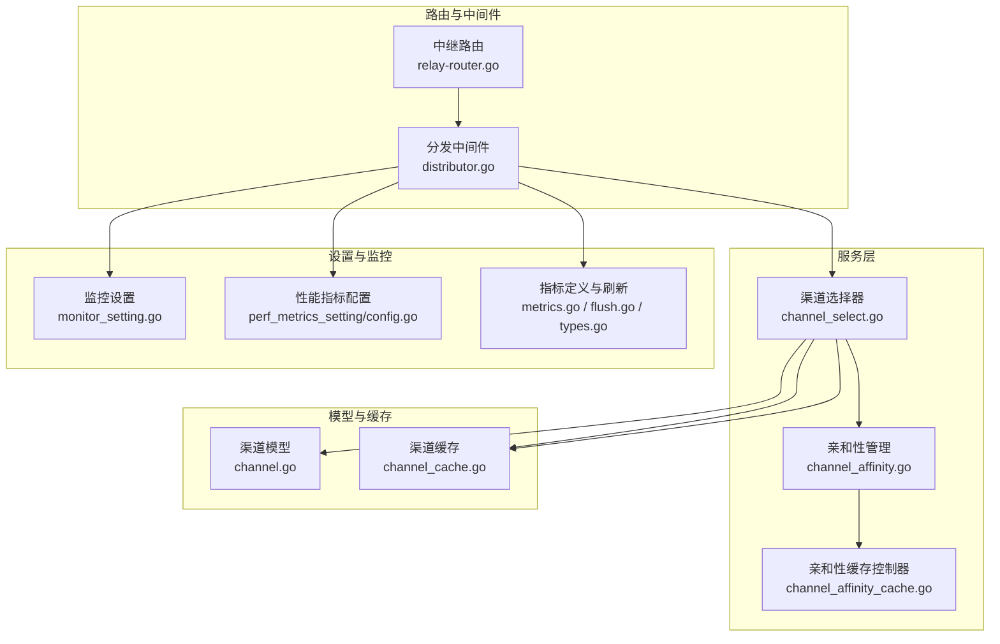
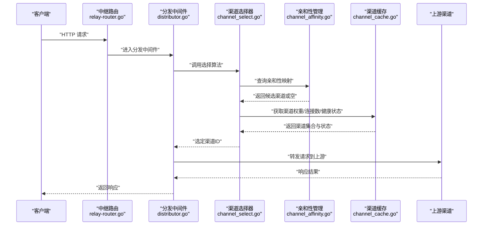
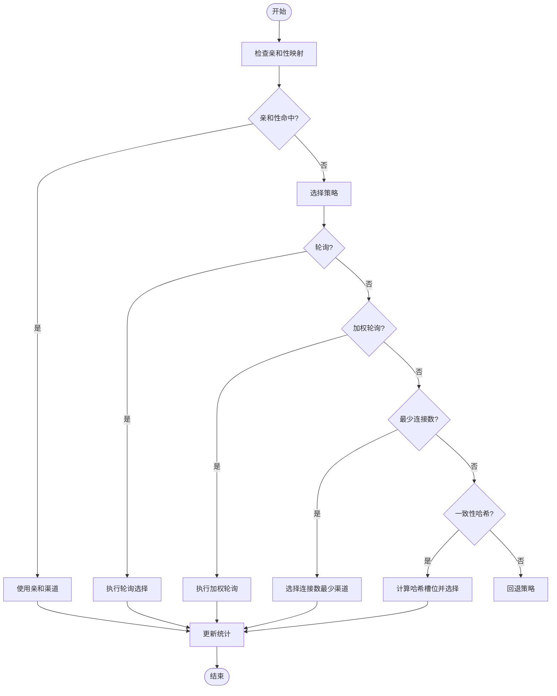
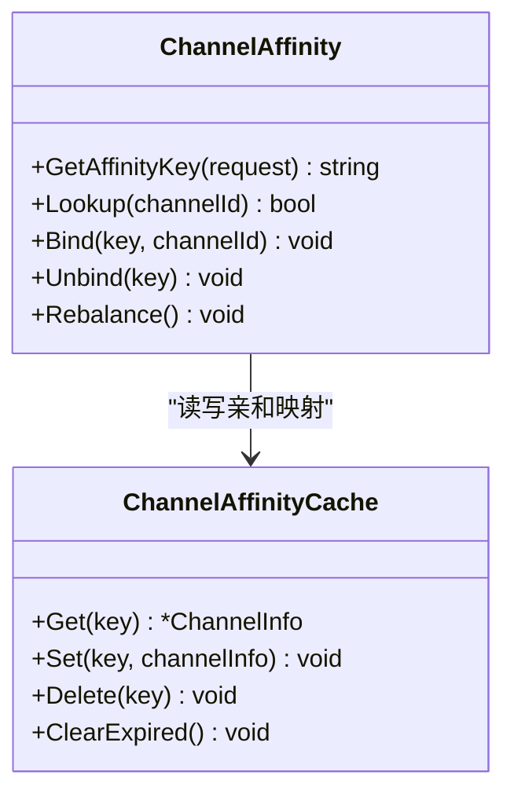
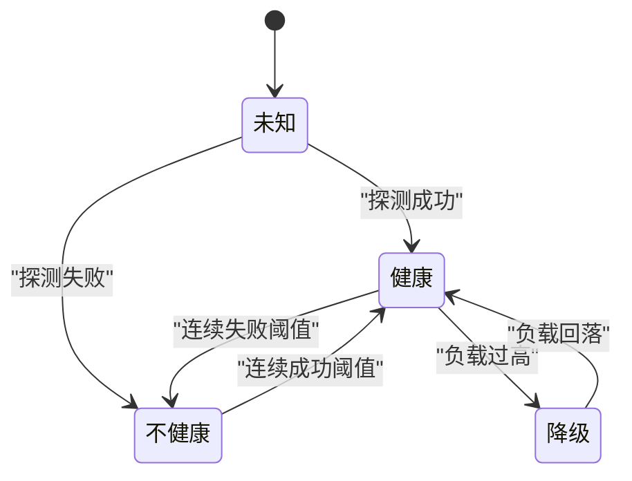
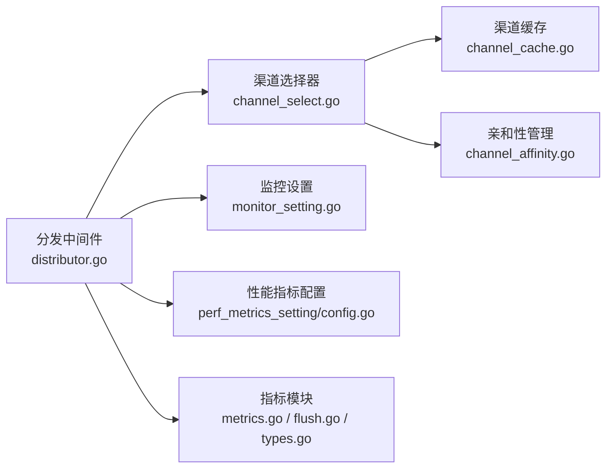

# 负载均衡机制

<cite>
**本文引用的文件**   
- [main.go](file://main.go)
- [channel_select.go](file://service/channel_select.go)
- [channel_affinity.go](file://service/channel_affinity.go)
- [channel_affinity_cache.go](file://controller/channel_affinity_cache.go)
- [channel_affinity_setting.go](file://setting/operation_setting/channel_affinity_setting.go)
- [distributor.go](file://middleware/distributor.go)
- [relay-router.go](file://router/relay-router.go)
- [api_router.go](file://router/api-router.go)
- [channel.go](file://model/channel.go)
- [channel_cache.go](file://model/channel_cache.go)
- [monitor_setting.go](file://setting/operation_setting/monitor_setting.go)
- [perf_metrics_setting.go](file://setting/perf_metrics_setting/config.go)
- [metrics.go](file://pkg/perf_metrics/metrics.go)
- [flush.go](file://pkg/perf_metrics/flush.go)
- [types.go](file://pkg/perf_metrics/types.go)
</cite>

## 目录
1. [简介](#简介)
2. [项目结构](#项目结构)
3. [核心组件](#核心组件)
4. [架构总览](#架构总览)
5. [详细组件分析](#详细组件分析)
6. [依赖关系分析](#依赖关系分析)
7. [性能考虑](#性能考虑)
8. [故障排查指南](#故障排查指南)
9. [结论](#结论)
10. [附录](#附录)

## 简介
本文件面向AI API网关的负载均衡机制，系统性阐述多渠道负载均衡算法、渠道亲和性（affinity）机制、健康检查与故障恢复、监控指标与性能调优，以及自定义负载均衡策略的开发指南。文档力求兼顾技术深度与可读性，帮助开发者快速理解并扩展网关的调度能力。

## 项目结构
与负载均衡相关的代码主要分布在以下模块：
- 路由层：负责将请求分发到中继处理流程，并在中间件阶段进行渠道选择。
- 服务层：实现具体的负载均衡算法、亲和性策略、缓存与配置读取。
- 模型与缓存：维护渠道元数据、可用性与状态信息。
- 设置与监控：提供监控开关、指标采集与导出配置。

图表来源
- [relay-router.go](file://router/relay-router.go)
- [distributor.go](file://middleware/distributor.go)
- [channel_select.go](file://service/channel_select.go)
- [channel_affinity.go](file://service/channel_affinity.go)
- [channel_affinity_cache.go](file://controller/channel_affinity_cache.go)
- [channel.go](file://model/channel.go)
- [channel_cache.go](file://model/channel_cache.go)
- [monitor_setting.go](file://setting/operation_setting/monitor_setting.go)
- [perf_metrics_setting/config.go](file://setting/perf_metrics_setting/config.go)
- [metrics.go](file://pkg/perf_metrics/metrics.go)
- [flush.go](file://pkg/perf_metrics/flush.go)
- [types.go](file://pkg/perf_metrics/types.go)

章节来源
- [relay-router.go](file://router/relay-router.go)
- [distributor.go](file://middleware/distributor.go)
- [channel_select.go](file://service/channel_select.go)
- [channel_affinity.go](file://service/channel_affinity.go)
- [channel_affinity_cache.go](file://controller/channel_affinity_cache.go)
- [channel.go](file://model/channel.go)
- [channel_cache.go](file://model/channel_cache.go)
- [monitor_setting.go](file://setting/operation_setting/monitor_setting.go)
- [perf_metrics_setting/config.go](file://setting/perf_metrics_setting/config.go)
- [metrics.go](file://pkg/perf_metrics/metrics.go)
- [flush.go](file://pkg/perf_metrics/flush.go)
- [types.go](file://pkg/perf_metrics/types.go)

## 核心组件
- 渠道选择器（Channel Selector）：实现轮询、加权轮询、最少连接数、一致性哈希等策略，决定具体上游渠道。
- 亲和性管理器（Affinity Manager）：基于用户或会话维度绑定渠道，确保同一用户的请求始终路由到相同渠道。
- 渠道缓存（Channel Cache）：维护渠道列表、权重、健康状态与连接计数等运行时数据。
- 监控与指标（Metrics）：暴露关键指标（如选择耗时、成功率、错误分布、亲和命中率），支持周期性刷新与导出。

章节来源
- [channel_select.go](file://service/channel_select.go)
- [channel_affinity.go](file://service/channel_affinity.go)
- [channel_cache.go](file://model/channel_cache.go)
- [metrics.go](file://pkg/perf_metrics/metrics.go)
- [flush.go](file://pkg/perf_metrics/flush.go)
- [types.go](file://pkg/perf_metrics/types.go)

## 架构总览
下图展示一次请求从路由进入，经分发中间件触发渠道选择，结合亲和性策略与渠道缓存，最终确定上游渠道并转发至下游的过程。

图表来源
- [relay-router.go](file://router/relay-router.go)
- [distributor.go](file://middleware/distributor.go)
- [channel_select.go](file://service/channel_select.go)
- [channel_affinity.go](file://service/channel_affinity.go)
- [channel_cache.go](file://model/channel_cache.go)

## 详细组件分析

### 渠道选择器（负载均衡算法）
- 轮询（Round Robin）：按顺序遍历可用渠道，保证公平分配。适用于各渠道能力相近的场景。
- 加权轮询（Weighted Round Robin）：根据渠道权重按比例分配流量，适合异构渠道组合。
- 最少连接数（Least Connections）：优先选择当前活跃连接最少的渠道，降低拥塞风险。
- 一致性哈希（Consistent Hashing）：基于请求特征（如用户ID、模型名）计算哈希槽位，提升缓存命中与亲和性。

图表来源
- [channel_select.go](file://service/channel_select.go)
- [channel_affinity.go](file://service/channel_affinity.go)

章节来源
- [channel_select.go](file://service/channel_select.go)

### 渠道亲和性（Affinity）机制
- 目标：确保特定用户或会话的请求始终路由到相同渠道，提高缓存命中与稳定性。
- 关键点：
  - 亲和键生成：通常基于用户ID、会话ID或请求头中的稳定标识。
  - 亲和映射存储：内存或缓存中维护“亲和键 -> 渠道ID”的映射。
  - 失效与重建：当渠道不可用或亲和键过期时，重新选择并更新映射。
  - 冲突解决：多亲和键竞争同一渠道时的再平衡策略。

图表来源
- [channel_affinity.go](file://service/channel_affinity.go)
- [channel_affinity_cache.go](file://controller/channel_affinity_cache.go)

章节来源
- [channel_affinity.go](file://service/channel_affinity.go)
- [channel_affinity_cache.go](file://controller/channel_affinity_cache.go)
- [channel_affinity_setting.go](file://setting/operation_setting/channel_affinity_setting.go)

### 健康检查与故障检测
- 健康检查：对上游渠道进行周期性探测（如HTTP探针、握手测试），标记健康/不健康状态。
- 故障检测：在请求失败或超时后，动态调整渠道权重或将其剔除出候选集。
- 自动恢复：当渠道健康恢复后，逐步恢复流量，避免雪崩效应。

[此图为概念性状态图，无需源码映射]

### 监控指标与性能调优
- 关键指标：
  - 选择延迟：渠道选择耗时分布（P50/P95/P99）。
  - 成功率与错误码分布：按渠道与策略维度统计。
  - 亲和命中率：亲和映射命中比例。
  - 连接数与队列长度：最少连接数策略下的实时负载。
  - 健康状态变化：渠道健康切换次数与持续时间。
- 性能建议：
  - 合理设置亲和键粒度，避免热点渠道过载。
  - 为高延迟渠道降低权重，减少尾延迟影响。
  - 开启指标采样与异步刷新，降低主路径开销。
  - 对一致性哈希的槽位数进行容量规划，避免重哈希抖动。

章节来源
- [monitor_setting.go](file://setting/operation_setting/monitor_setting.go)
- [perf_metrics_setting/config.go](file://setting/perf_metrics_setting/config.go)
- [metrics.go](file://pkg/perf_metrics/metrics.go)
- [flush.go](file://pkg/perf_metrics/flush.go)
- [types.go](file://pkg/perf_metrics/types.go)

### 自定义负载均衡策略开发指南
- 步骤概览：
  1. 定义策略接口：包含选择函数、初始化与销毁钩子。
  2. 实现策略逻辑：读取渠道缓存、计算候选集、应用策略规则。
  3. 注册策略：在策略工厂中注册新策略名称与实例化方法。
  4. 配置启用：通过设置项启用新策略，并提供参数校验。
  5. 监控接入：埋点关键指标（选择耗时、命中率、错误率）。
- 注意事项：
  - 线程安全：并发访问渠道缓存需加锁或使用无锁数据结构。
  - 幂等性：重复选择应返回一致结果（尤其一致性哈希）。
  - 可观测性：记录选择过程的关键变量，便于问题定位。
  - 回退机制：当策略异常时回退到默认策略，保障可用性。

[本节为通用开发指导，不直接分析具体文件]

## 依赖关系分析
渠道选择器依赖渠道缓存与亲和性管理；分发中间件协调路由与选择流程；监控设置与指标模块贯穿全链路。

图表来源
- [distributor.go](file://middleware/distributor.go)
- [channel_select.go](file://service/channel_select.go)
- [channel_cache.go](file://model/channel_cache.go)
- [channel_affinity.go](file://service/channel_affinity.go)
- [monitor_setting.go](file://setting/operation_setting/monitor_setting.go)
- [perf_metrics_setting/config.go](file://setting/perf_metrics_setting/config.go)
- [metrics.go](file://pkg/perf_metrics/metrics.go)
- [flush.go](file://pkg/perf_metrics/flush.go)
- [types.go](file://pkg/perf_metrics/types.go)

章节来源
- [distributor.go](file://middleware/distributor.go)
- [channel_select.go](file://service/channel_select.go)
- [channel_cache.go](file://model/channel_cache.go)
- [channel_affinity.go](file://service/channel_affinity.go)
- [monitor_setting.go](file://setting/operation_setting/monitor_setting.go)
- [perf_metrics_setting/config.go](file://setting/perf_metrics_setting/config.go)
- [metrics.go](file://pkg/perf_metrics/metrics.go)
- [flush.go](file://pkg/perf_metrics/flush.go)
- [types.go](file://pkg/perf_metrics/types.go)

## 性能考虑
- 选择算法复杂度：轮询与加权轮询为O(1)，最少连接数为O(log n)或O(1)取决于实现，一致性哈希为O(1)平均。
- 缓存与锁：尽量减少锁粒度，使用分片或无锁结构提升并发吞吐。
- 指标采集：采用增量聚合与异步落盘，避免阻塞主路径。
- 亲和性规模：控制亲和映射大小，定期清理过期键，防止内存膨胀。
- 通道池化：复用连接与缓冲，降低握手与序列化开销。

[本节为通用性能指导，不直接分析具体文件]

## 故障排查指南
- 常见问题：
  - 亲和性未命中：检查亲和键生成逻辑与缓存键过期策略。
  - 渠道频繁切换：确认健康检查阈值与权重调整是否过于敏感。
  - 选择延迟升高：查看指标分布，定位慢渠道或锁竞争热点。
  - 一致性哈希抖动：评估槽位数与节点变更频率，必要时引入虚拟节点。
- 诊断步骤：
  1. 打开详细日志，记录选择过程与渠道状态。
  2. 检查监控面板，关注错误率与延迟峰值。
  3. 验证配置项（权重、阈值、亲和键字段）是否符合预期。
  4. 复现问题并抓取快照，分析渠道缓存与亲和映射。

章节来源
- [channel_affinity.go](file://service/channel_affinity.go)
- [channel_cache.go](file://model/channel_cache.go)
- [monitor_setting.go](file://setting/operation_setting/monitor_setting.go)
- [metrics.go](file://pkg/perf_metrics/metrics.go)

## 结论
本网关的负载均衡机制以灵活的策略选择为核心，结合亲和性管理与完善的监控体系，能够在复杂的多渠道环境中提供稳定、高效且可观测的流量分发能力。通过合理的配置与持续的性能调优，可进一步提升系统吞吐与用户体验。

## 附录
- 相关入口与路由：
  - 中继路由：[relay-router.go](file://router/relay-router.go)
  - API路由：[api_router.go](file://router/api-router.go)
  - 主程序入口：[main.go](file://main.go)

章节来源
- [relay-router.go](file://router/relay-router.go)
- [api_router.go](file://router/api-router.go)
- [main.go](file://main.go)