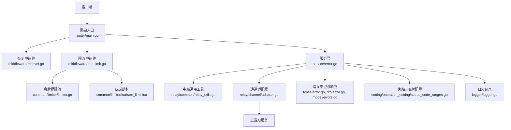
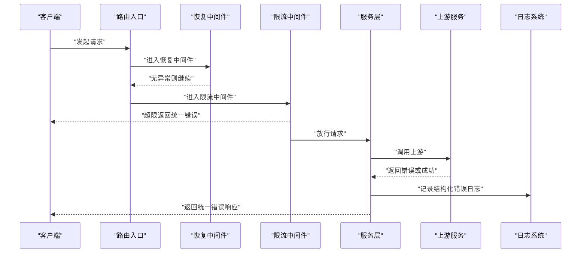
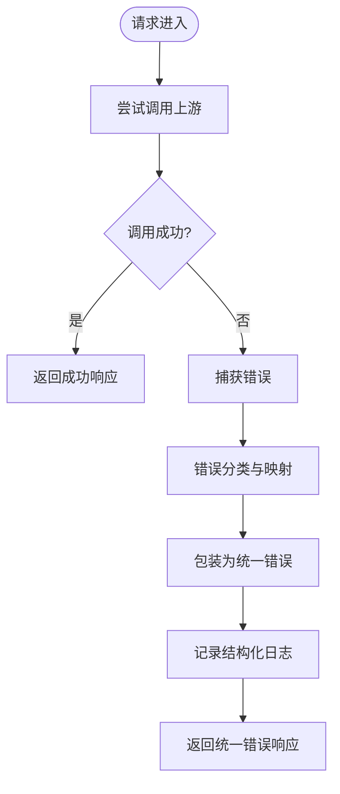
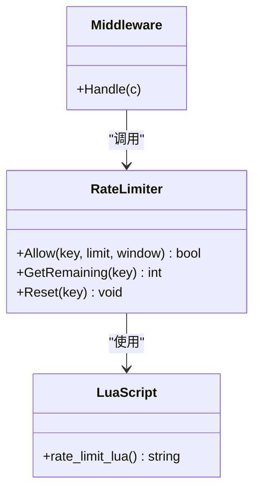
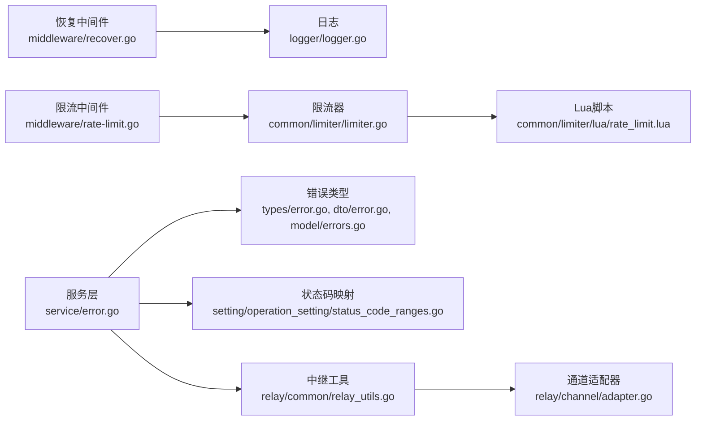

# 错误处理与容错

<cite>
**本文引用的文件**   
- [main.go](file://main.go)
- [middleware/recover.go](file://middleware/recover.go)
- [middleware/rate-limit.go](file://middleware/rate-limit.go)
- [common/limiter/limiter.go](file://common/limiter/limiter.go)
- [common/limiter/lua/rate_limit.lua](file://common/limiter/lua/rate_limit.lua)
- [service/error.go](file://service/error.go)
- [types/error.go](file://types/error.go)
- [dto/error.go](file://dto/error.go)
- [model/errors.go](file://model/errors.go)
- [setting/operation_setting/status_code_ranges.go](file://setting/operation_setting/status_code_ranges.go)
- [relay/common_handler/rerank.go](file://relay/common_handler/rerank.go)
- [relay/channel/adapter.go](file://relay/channel/adapter.go)
- [relay/common/relay_utils.go](file://relay/common/relay_utils.go)
- [router/main.go](file://router/main.go)
- [logger/logger.go](file://logger/logger.go)
</cite>

## 目录
1. [简介](#简介)
2. [项目结构](#项目结构)
3. [核心组件](#核心组件)
4. [架构总览](#架构总览)
5. [详细组件分析](#详细组件分析)
6. [依赖关系分析](#依赖关系分析)
7. [性能考量](#性能考量)
8. [故障排查指南](#故障排查指南)
9. [结论](#结论)
10. [附录](#附录)

## 简介
本文件面向AI API网关的错误处理与容错机制，系统化阐述统一的错误码体系、错误消息格式与分类；解释异常捕获、错误传播与降级策略；记录重试机制、熔断器与限流保护实现；覆盖错误日志记录、监控告警与故障排查；提供常见错误场景的处理方案与最佳实践；并说明分布式环境下的错误处理与事务一致性保证。

## 项目结构
本项目采用分层与模块化组织：入口路由与中间件负责请求接入、鉴权、限流与恢复；服务层封装业务逻辑与外部调用；通道适配层对接多家上游AI厂商；统一错误类型与响应在DTO/Types/Service中定义；配置中心管理状态码映射与运行参数；日志与监控贯穿全链路。

图表来源
- [router/main.go](file://router/main.go)
- [middleware/recover.go](file://middleware/recover.go)
- [middleware/rate-limit.go](file://middleware/rate-limit.go)
- [common/limiter/limiter.go](file://common/limiter/limiter.go)
- [common/limiter/lua/rate_limit.lua](file://common/limiter/lua/rate_limit.lua)
- [service/error.go](file://service/error.go)
- [relay/common/relay_utils.go](file://relay/common/relay_utils.go)
- [relay/channel/adapter.go](file://relay/channel/adapter.go)
- [types/error.go](file://types/error.go)
- [dto/error.go](file://dto/error.go)
- [model/errors.go](file://model/errors.go)
- [setting/operation_setting/status_code_ranges.go](file://setting/operation_setting/status_code_ranges.go)
- [logger/logger.go](file://logger/logger.go)

章节来源
- [main.go](file://main.go)
- [router/main.go](file://router/main.go)

## 核心组件
- 统一错误类型与响应
  - 定义标准错误结构、错误码、错误消息与HTTP状态码映射，确保前后端一致。
  - 关键位置：types/error.go、dto/error.go、model/errors.go、service/error.go。
- 中间件与恢复
  - recover中间件捕获panic并转化为标准错误响应，避免进程崩溃。
  - 关键位置：middleware/recover.go。
- 限流与令牌桶
  - 基于Redis的滑动窗口或令牌桶限流，支持Lua原子脚本，保障高并发下的一致性。
  - 关键位置：middleware/rate-limit.go、common/limiter/limiter.go、common/limiter/lua/rate_limit.lua。
- 状态码映射与分类
  - 通过配置将上游不同状态码归一化为网关统一错误码，便于前端展示与统计。
  - 关键位置：setting/operation_setting/status_code_ranges.go。
- 日志与监控
  - 结构化错误日志，包含请求ID、用户ID、模型名、渠道名、耗时、错误码等维度。
  - 关键位置：logger/logger.go。

章节来源
- [types/error.go](file://types/error.go)
- [dto/error.go](file://dto/error.go)
- [model/errors.go](file://model/errors.go)
- [service/error.go](file://service/error.go)
- [middleware/recover.go](file://middleware/recover.go)
- [middleware/rate-limit.go](file://middleware/rate-limit.go)
- [common/limiter/limiter.go](file://common/limiter/limiter.go)
- [common/limiter/lua/rate_limit.lua](file://common/limiter/lua/rate_limit.lua)
- [setting/operation_setting/status_code_ranges.go](file://setting/operation_setting/status_code_ranges.go)
- [logger/logger.go](file://logger/logger.go)

## 架构总览
网关错误处理与容错的关键路径如下：
- 请求进入后先经过恢复中间件，捕获任何未处理异常，转为标准错误响应。
- 随后进入限流中间件，按用户/模型/渠道维度进行速率限制，超限直接返回统一错误。
- 服务层根据配置进行上游调用，遇到错误时进行错误分类、重试（可配置）、降级（备用渠道或缓存）与熔断（快速失败）。
- 所有错误均记录结构化日志，并上报监控指标，便于告警与排障。

图表来源
- [router/main.go](file://router/main.go)
- [middleware/recover.go](file://middleware/recover.go)
- [middleware/rate-limit.go](file://middleware/rate-limit.go)
- [service/error.go](file://service/error.go)
- [logger/logger.go](file://logger/logger.go)

## 详细组件分析

### 统一错误码体系与消息格式
- 错误分类
  - 客户端错误：参数校验失败、权限不足、配额不足等。
  - 服务端错误：内部异常、资源不可用、超时等。
  - 上游错误：上游限流、认证失败、模型不存在、内容安全拦截等。
- 错误码设计
  - 使用三位或四位数字编码，前缀区分类别（如4xx客户端、5xx服务端、6xx上游）。
  - 每个错误码对应唯一语义，避免歧义。
- 消息格式
  - 统一JSON结构包含：错误码、错误消息、请求ID、时间戳、可选堆栈或详情。
  - 前端可按错误码进行友好提示与行为控制。

章节来源
- [types/error.go](file://types/error.go)
- [dto/error.go](file://dto/error.go)
- [model/errors.go](file://model/errors.go)
- [service/error.go](file://service/error.go)

### 异常捕获与错误传播
- 恢复中间件
  - 捕获panic，记录堆栈与上下文，转换为标准错误响应，避免服务崩溃。
- 错误传播
  - 服务层将上游错误包装为统一错误类型，携带必要上下文（渠道、模型、请求ID）。
  - 控制器/处理器不直接暴露底层异常，仅返回统一错误。

图表来源
- [middleware/recover.go](file://middleware/recover.go)
- [service/error.go](file://service/error.go)
- [logger/logger.go](file://logger/logger.go)

章节来源
- [middleware/recover.go](file://middleware/recover.go)
- [service/error.go](file://service/error.go)

### 重试机制
- 适用场景
  - 网络抖动、临时性5xx、上游限流（Retry-After）等可重试错误。
- 策略要点
  - 指数退避与抖动，避免雪崩。
  - 最大重试次数与超时控制。
  - 幂等性检查，避免重复提交。
- 实现位置
  - 服务层对上游调用进行重试封装，结合配置开关。

章节来源
- [service/error.go](file://service/error.go)
- [relay/common/relay_utils.go](file://relay/common/relay_utils.go)

### 熔断器与降级策略
- 熔断器
  - 当上游错误率或延迟超过阈值，触发熔断，快速失败，减少下游压力。
  - 半开探测：周期性试探上游可用性，恢复后自动闭合。
- 降级策略
  - 切换备用渠道或返回缓存结果。
  - 针对特定模型或渠道进行隔离与回退。
- 实现位置
  - 服务层与通道适配器协同，依据配置动态调整。

章节来源
- [service/error.go](file://service/error.go)
- [relay/channel/adapter.go](file://relay/channel/adapter.go)

### 限流保护
- 维度
  - 用户级、模型级、渠道级、IP级等多维限流。
- 算法
  - 令牌桶或滑动窗口，基于Redis与Lua脚本保证原子性与一致性。
- 响应
  - 超限返回统一错误码与消息，附带建议的重试间隔。

图表来源
- [common/limiter/limiter.go](file://common/limiter/limiter.go)
- [common/limiter/lua/rate_limit.lua](file://common/limiter/lua/rate_limit.lua)
- [middleware/rate-limit.go](file://middleware/rate-limit.go)

章节来源
- [middleware/rate-limit.go](file://middleware/rate-limit.go)
- [common/limiter/limiter.go](file://common/limiter/limiter.go)
- [common/limiter/lua/rate_limit.lua](file://common/limiter/lua/rate_limit.lua)

### 状态码映射与错误分类
- 目标
  - 将上游多种状态码归一化为网关统一错误码，简化前端处理。
- 方法
  - 配置驱动的状态码范围映射表，支持按渠道/模型定制。
- 示例
  - 上游429映射为网关限流错误码，上游503映射为服务不可用错误码。

章节来源
- [setting/operation_setting/status_code_ranges.go](file://setting/operation_setting/status_code_ranges.go)

### 日志记录与监控告警
- 结构化日志
  - 包含请求ID、用户ID、渠道、模型、耗时、错误码、错误摘要等。
- 监控指标
  - 错误率、延迟分位、限流命中、熔断触发次数等。
- 告警规则
  - 错误率突增、上游不可用、限流频繁触发等。

章节来源
- [logger/logger.go](file://logger/logger.go)
- [service/error.go](file://service/error.go)

### 常见错误场景与处理方案
- 参数校验失败
  - 返回客户端错误码，提示具体字段与原因。
- 认证失败
  - 返回鉴权错误码，引导重新登录或刷新Token。
- 配额不足
  - 返回配额错误码，提示充值或等待周期重置。
- 上游限流
  - 返回限流错误码，附带Retry-After，客户端指数退避重试。
- 上游不可用
  - 触发熔断与降级，切换备用渠道或返回缓存。
- 网络超时
  - 可重试错误，指数退避+抖动，达到上限后返回超时错误。

章节来源
- [types/error.go](file://types/error.go)
- [dto/error.go](file://dto/error.go)
- [service/error.go](file://service/error.go)

### 分布式环境下的错误处理与事务一致性
- 幂等性
  - 上游非幂等操作需客户端提供幂等键，网关去重与防重放。
- 补偿机制
  - 异步任务失败重试与死信队列，保证最终一致性。
- 分布式锁
  - 关键操作加锁，避免并发冲突。
- 数据一致性
  - 计费与用量统计采用可靠写入与对账，失败回滚或补偿。

章节来源
- [service/error.go](file://service/error.go)
- [logger/logger.go](file://logger/logger.go)

## 依赖关系分析
错误处理相关模块之间的依赖关系如下：

图表来源
- [middleware/recover.go](file://middleware/recover.go)
- [middleware/rate-limit.go](file://middleware/rate-limit.go)
- [common/limiter/limiter.go](file://common/limiter/limiter.go)
- [common/limiter/lua/rate_limit.lua](file://common/limiter/lua/rate_limit.lua)
- [service/error.go](file://service/error.go)
- [types/error.go](file://types/error.go)
- [dto/error.go](file://dto/error.go)
- [model/errors.go](file://model/errors.go)
- [setting/operation_setting/status_code_ranges.go](file://setting/operation_setting/status_code_ranges.go)
- [relay/common/relay_utils.go](file://relay/common/relay_utils.go)
- [relay/channel/adapter.go](file://relay/channel/adapter.go)
- [logger/logger.go](file://logger/logger.go)

章节来源
- [router/main.go](file://router/main.go)
- [service/error.go](file://service/error.go)

## 性能考量
- 限流算法选择
  - 令牌桶适合突发流量，滑动窗口更平滑；根据业务选择。
- Redis交互优化
  - 批量操作与连接池，减少RTT与序列化开销。
- 重试与熔断
  - 合理设置阈值与超时，避免放大错误与雪崩。
- 日志采样
  - 高频错误采样记录，降低IO压力。

[本节为通用指导，不直接分析具体文件]

## 故障排查指南
- 定位步骤
  - 通过请求ID检索结构化日志，查看错误码与堆栈。
  - 检查限流命中情况与上游状态码映射。
  - 确认重试次数与熔断状态。
- 常见问题
  - 限流误伤：检查维度与阈值配置。
  - 上游不稳定：观察错误率与延迟分位，调整熔断阈值。
  - 日志缺失：确认日志级别与采样策略。
- 工具与指标
  - 错误率、延迟P95/P99、限流命中率、熔断触发次数、重试成功率。

章节来源
- [logger/logger.go](file://logger/logger.go)
- [service/error.go](file://service/error.go)
- [setting/operation_setting/status_code_ranges.go](file://setting/operation_setting/status_code_ranges.go)

## 结论
本项目的错误处理与容错机制以统一错误类型为核心，结合恢复中间件、限流、重试、熔断与降级，形成端到端的健壮性保障。通过配置驱动的状态码映射与结构化日志，实现了可观测性与可维护性。建议在分布式环境中强化幂等性与补偿机制，持续优化限流与熔断参数，提升整体稳定性。

[本节为总结，不直接分析具体文件]

## 附录
- 最佳实践
  - 始终返回统一错误响应，避免泄露内部细节。
  - 错误码与消息保持国际化与可读性。
  - 限流与熔断参数随业务演进定期调优。
  - 日志脱敏与最小化原则。
  - 监控告警覆盖关键错误与SLA指标。

[本节为通用指导，不直接分析具体文件]