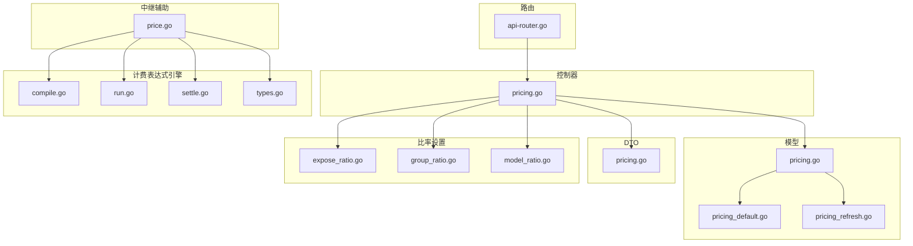
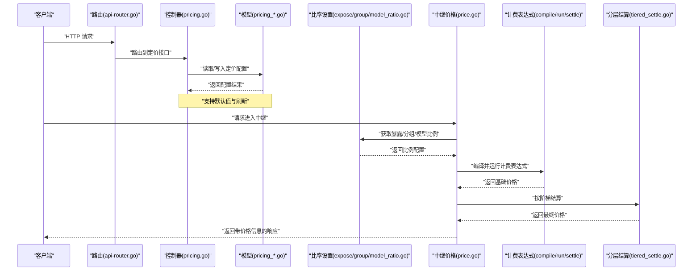
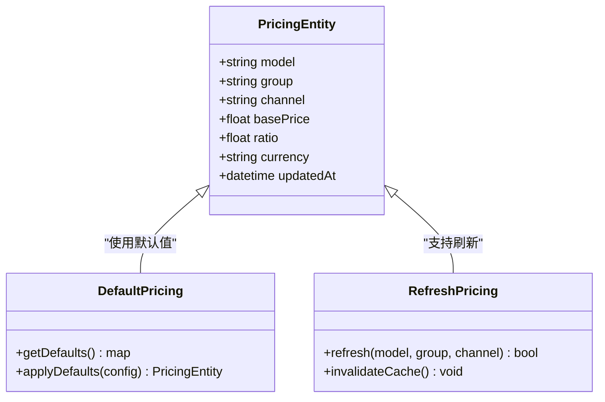
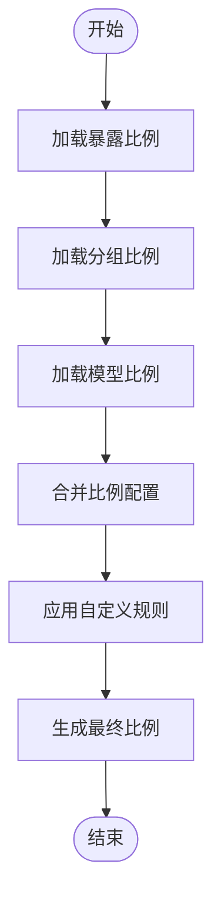
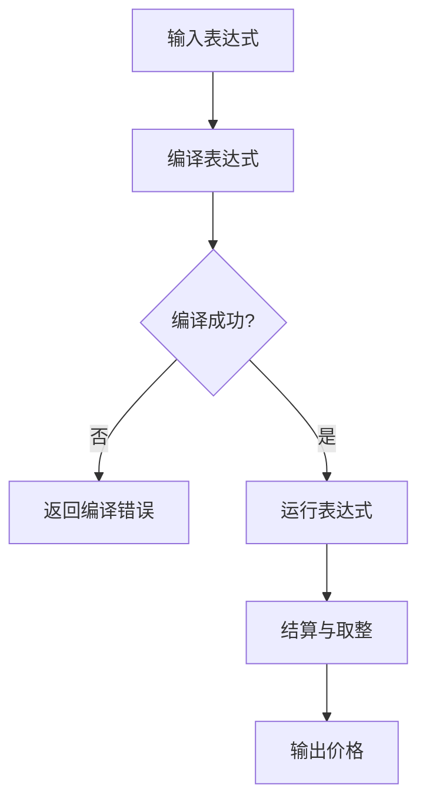
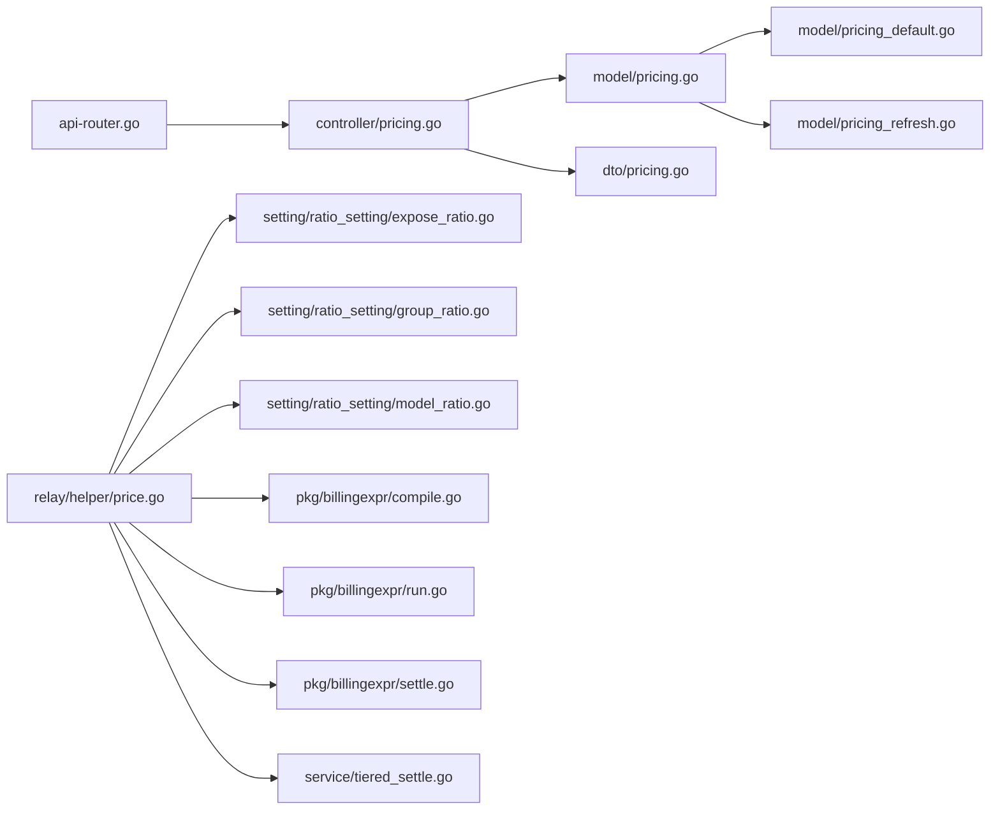

# 定价策略

<cite>
**本文引用的文件**   
- [controller/pricing.go](file://controller/pricing.go)
- [model/pricing.go](file://model/pricing.go)
- [model/pricing_default.go](file://model/pricing_default.go)
- [model/pricing_refresh.go](file://model/pricing_refresh.go)
- [dto/pricing.go](file://dto/pricing.go)
- [setting/ratio_setting/expose_ratio.go](file://setting/ratio_setting/expose_ratio.go)
- [setting/ratio_setting/group_ratio.go](file://setting/ratio_setting/group_ratio.go)
- [setting/ratio_setting/model_ratio.go](file://setting/ratio_setting/model_ratio.go)
- [pkg/billingexpr/compile.go](file://pkg/billingexpr/compile.go)
- [pkg/billingexpr/run.go](file://pkg/billingexpr/run.go)
- [pkg/billingexpr/settle.go](file://pkg/billingexpr/settle.go)
- [pkg/billingexpr/types.go](file://pkg/billingexpr/types.go)
- [relay/helper/price.go](file://relay/helper/price.go)
- [service/tiered_settle.go](file://service/tiered_settle.go)
- [router/api-router.go](file://router/api-router.go)
</cite>

## 目录
1. [简介](#简介)
2. [项目结构](#项目结构)
3. [核心组件](#核心组件)
4. [架构总览](#架构总览)
5. [详细组件分析](#详细组件分析)
6. [依赖关系分析](#依赖关系分析)
7. [性能考量](#性能考量)
8. [故障排查指南](#故障排查指南)
9. [结论](#结论)
10. [附录](#附录)

## 简介
本文件为“定价策略系统”的权威文档，聚焦动态定价模型、比例计算与价格暴露机制的实现细节。内容涵盖：
- 模型定价配置、分组定价、渠道定价与自定义定价规则
- 定价策略优先级、继承与覆盖机制
- 与渠道管理、用户组与权限系统的集成方式
- 实际代码路径示例与最佳实践
- 常见问题与解决方案

## 项目结构
定价相关能力由控制器、数据模型、DTO、比率设置、计费表达式引擎与中继侧辅助模块共同组成：
- 控制器层：对外提供定价配置与查询接口
- 模型层：持久化定价配置、默认值与刷新逻辑
- DTO层：请求/响应数据结构定义
- 比率设置层：暴露比例、分组比例、模型比例等配置
- 计费表达式引擎：编译与执行计费表达式，支持分层结算
- 中继辅助：在请求处理链路中计算并应用价格

**图表来源** 
- [controller/pricing.go](file://controller/pricing.go)
- [model/pricing.go](file://model/pricing.go)
- [model/pricing_default.go](file://model/pricing_default.go)
- [model/pricing_refresh.go](file://model/pricing_refresh.go)
- [dto/pricing.go](file://dto/pricing.go)
- [setting/ratio_setting/expose_ratio.go](file://setting/ratio_setting/expose_ratio.go)
- [setting/ratio_setting/group_ratio.go](file://setting/ratio_setting/group_ratio.go)
- [setting/ratio_setting/model_ratio.go](file://setting/ratio_setting/model_ratio.go)
- [pkg/billingexpr/compile.go](file://pkg/billingexpr/compile.go)
- [pkg/billingexpr/run.go](file://pkg/billingexpr/run.go)
- [pkg/billingexpr/settle.go](file://pkg/billingexpr/settle.go)
- [pkg/billingexpr/types.go](file://pkg/billingexpr/types.go)
- [relay/helper/price.go](file://relay/helper/price.go)
- [router/api-router.go](file://router/api-router.go)

**章节来源**
- [controller/pricing.go](file://controller/pricing.go)
- [model/pricing.go](file://model/pricing.go)
- [model/pricing_default.go](file://model/pricing_default.go)
- [model/pricing_refresh.go](file://model/pricing_refresh.go)
- [dto/pricing.go](file://dto/pricing.go)
- [setting/ratio_setting/expose_ratio.go](file://setting/ratio_setting/expose_ratio.go)
- [setting/ratio_setting/group_ratio.go](file://setting/ratio_setting/group_ratio.go)
- [setting/ratio_setting/model_ratio.go](file://setting/ratio_setting/model_ratio.go)
- [pkg/billingexpr/compile.go](file://pkg/billingexpr/compile.go)
- [pkg/billingexpr/run.go](file://pkg/billingexpr/run.go)
- [pkg/billingexpr/settle.go](file://pkg/billingexpr/settle.go)
- [pkg/billingexpr/types.go](file://pkg/billingexpr/types.go)
- [relay/helper/price.go](file://relay/helper/price.go)
- [router/api-router.go](file://router/api-router.go)

## 核心组件
- 控制器（定价）：提供定价配置的增删改查与批量更新接口，负责校验与返回统一结果
- 模型（定价）：定义定价实体、默认值与刷新流程，支撑多源配置合并
- DTO（定价）：定义请求参数与响应结构，确保前后端契约稳定
- 比率设置（暴露/分组/模型）：维护不同粒度的比例配置，用于价格暴露与计费
- 计费表达式引擎：编译与运行计费表达式，支持分层结算与四舍五入策略
- 中继辅助（价格）：在请求处理阶段计算最终价格，串联模型、分组、渠道与自定义规则

**章节来源**
- [controller/pricing.go](file://controller/pricing.go)
- [model/pricing.go](file://model/pricing.go)
- [model/pricing_default.go](file://model/pricing_default.go)
- [model/pricing_refresh.go](file://model/pricing_refresh.go)
- [dto/pricing.go](file://dto/pricing.go)
- [setting/ratio_setting/expose_ratio.go](file://setting/ratio_setting/expose_ratio.go)
- [setting/ratio_setting/group_ratio.go](file://setting/ratio_setting/group_ratio.go)
- [setting/ratio_setting/model_ratio.go](file://setting/ratio_setting/model_ratio.go)
- [pkg/billingexpr/compile.go](file://pkg/billingexpr/compile.go)
- [pkg/billingexpr/run.go](file://pkg/billingexpr/run.go)
- [pkg/billingexpr/settle.go](file://pkg/billingexpr/settle.go)
- [pkg/billingexpr/types.go](file://pkg/billingexpr/types.go)
- [relay/helper/price.go](file://relay/helper/price.go)

## 架构总览
定价系统在请求生命周期中的关键交互如下：
- 路由将请求分发至控制器
- 控制器读取或更新定价配置（模型/分组/渠道/自定义）
- 中继侧在请求处理时调用价格辅助模块
- 价格辅助模块依据模型、分组、渠道与自定义规则，结合计费表达式引擎计算最终价格
- 分层结算模块对复杂计费场景进行分段结算

**图表来源** 
- [router/api-router.go](file://router/api-router.go)
- [controller/pricing.go](file://controller/pricing.go)
- [model/pricing.go](file://model/pricing.go)
- [model/pricing_default.go](file://model/pricing_default.go)
- [model/pricing_refresh.go](file://model/pricing_refresh.go)
- [setting/ratio_setting/expose_ratio.go](file://setting/ratio_setting/expose_ratio.go)
- [setting/ratio_setting/group_ratio.go](file://setting/ratio_setting/group_ratio.go)
- [setting/ratio_setting/model_ratio.go](file://setting/ratio_setting/model_ratio.go)
- [relay/helper/price.go](file://relay/helper/price.go)
- [pkg/billingexpr/compile.go](file://pkg/billingexpr/compile.go)
- [pkg/billingexpr/run.go](file://pkg/billingexpr/run.go)
- [pkg/billingexpr/settle.go](file://pkg/billingexpr/settle.go)
- [service/tiered_settle.go](file://service/tiered_settle.go)

## 详细组件分析

### 控制器（定价）
- 职责：提供定价配置的CRUD、批量更新、校验与错误处理；与模型和DTO协作完成数据一致性
- 关键点：
  - 输入校验：字段完整性、范围限制、格式校验
  - 输出封装：统一响应结构与错误码
  - 事务性：批量更新需保证原子性与回滚

**章节来源**
- [controller/pricing.go](file://controller/pricing.go)
- [dto/pricing.go](file://dto/pricing.go)

### 模型（定价）
- 职责：定义定价实体、默认值策略与刷新机制；支撑多源配置合并与缓存
- 关键点：
  - 默认值：未显式配置时使用全局默认
  - 刷新：配置变更触发增量或全量刷新
  - 合并：模型级、分组级、渠道级与自定义规则的优先级合并

**图表来源** 
- [model/pricing.go](file://model/pricing.go)
- [model/pricing_default.go](file://model/pricing_default.go)
- [model/pricing_refresh.go](file://model/pricing_refresh.go)

**章节来源**
- [model/pricing.go](file://model/pricing.go)
- [model/pricing_default.go](file://model/pricing_default.go)
- [model/pricing_refresh.go](file://model/pricing_refresh.go)

### DTO（定价）
- 职责：定义请求与响应的数据结构，确保前后端契约一致
- 关键点：
  - 字段命名与类型约束
  - 必填项与可选项区分
  - 错误信息标准化

**章节来源**
- [dto/pricing.go](file://dto/pricing.go)

### 比率设置（暴露/分组/模型）
- 暴露比例：控制对外展示的价格比例，影响前端显示与账单明细
- 分组比例：按用户组维度调整比例，实现差异化定价
- 模型比例：按模型维度调整比例，支持不同模型的差异化定价

**图表来源** 
- [setting/ratio_setting/expose_ratio.go](file://setting/ratio_setting/expose_ratio.go)
- [setting/ratio_setting/group_ratio.go](file://setting/ratio_setting/group_ratio.go)
- [setting/ratio_setting/model_ratio.go](file://setting/ratio_setting/model_ratio.go)

**章节来源**
- [setting/ratio_setting/expose_ratio.go](file://setting/ratio_setting/expose_ratio.go)
- [setting/ratio_setting/group_ratio.go](file://setting/ratio_setting/group_ratio.go)
- [setting/ratio_setting/model_ratio.go](file://setting/ratio_setting/model_ratio.go)

### 计费表达式引擎
- 编译：将文本表达式编译为可执行结构
- 运行：基于上下文变量执行表达式，得到基础价格
- 结算：支持分层结算与四舍五入策略

**图表来源** 
- [pkg/billingexpr/compile.go](file://pkg/billingexpr/compile.go)
- [pkg/billingexpr/run.go](file://pkg/billingexpr/run.go)
- [pkg/billingexpr/settle.go](file://pkg/billingexpr/settle.go)
- [pkg/billingexpr/types.go](file://pkg/billingexpr/types.go)

**章节来源**
- [pkg/billingexpr/compile.go](file://pkg/billingexpr/compile.go)
- [pkg/billingexpr/run.go](file://pkg/billingexpr/run.go)
- [pkg/billingexpr/settle.go](file://pkg/billingexpr/settle.go)
- [pkg/billingexpr/types.go](file://pkg/billingexpr/types.go)

### 中继辅助（价格）
- 职责：在请求处理链路中计算最终价格，整合模型、分组、渠道与自定义规则
- 关键点：
  - 上下文构建：包含模型、用户组、渠道、用量等信息
  - 规则优先级：模型 > 分组 > 渠道 > 自定义规则
  - 错误处理：表达式失败时的降级策略

**章节来源**
- [relay/helper/price.go](file://relay/helper/price.go)

### 分层结算
- 职责：对复杂计费场景进行分段结算，支持阶梯价与封顶策略
- 关键点：
  - 分段阈值：定义各段用量区间与单价
  - 封顶策略：设置最高费用上限
  - 精度控制：小数位数与取整规则

**章节来源**
- [service/tiered_settle.go](file://service/tiered_settle.go)

## 依赖关系分析
- 控制器依赖模型与DTO，提供API入口
- 模型依赖默认值与刷新逻辑，确保配置一致性
- 比率设置模块被价格辅助模块引用，用于比例计算
- 计费表达式引擎被价格辅助模块调用，实现动态定价
- 分层结算模块作为价格计算的扩展，处理复杂场景

**图表来源** 
- [router/api-router.go](file://router/api-router.go)
- [controller/pricing.go](file://controller/pricing.go)
- [model/pricing.go](file://model/pricing.go)
- [model/pricing_default.go](file://model/pricing_default.go)
- [model/pricing_refresh.go](file://model/pricing_refresh.go)
- [dto/pricing.go](file://dto/pricing.go)
- [relay/helper/price.go](file://relay/helper/price.go)
- [setting/ratio_setting/expose_ratio.go](file://setting/ratio_setting/expose_ratio.go)
- [setting/ratio_setting/group_ratio.go](file://setting/ratio_setting/group_ratio.go)
- [setting/ratio_setting/model_ratio.go](file://setting/ratio_setting/model_ratio.go)
- [pkg/billingexpr/compile.go](file://pkg/billingexpr/compile.go)
- [pkg/billingexpr/run.go](file://pkg/billingexpr/run.go)
- [pkg/billingexpr/settle.go](file://pkg/billingexpr/settle.go)
- [service/tiered_settle.go](file://service/tiered_settle.go)

**章节来源**
- [router/api-router.go](file://router/api-router.go)
- [controller/pricing.go](file://controller/pricing.go)
- [model/pricing.go](file://model/pricing.go)
- [model/pricing_default.go](file://model/pricing_default.go)
- [model/pricing_refresh.go](file://model/pricing_refresh.go)
- [dto/pricing.go](file://dto/pricing.go)
- [relay/helper/price.go](file://relay/helper/price.go)
- [setting/ratio_setting/expose_ratio.go](file://setting/ratio_setting/expose_ratio.go)
- [setting/ratio_setting/group_ratio.go](file://setting/ratio_setting/group_ratio.go)
- [setting/ratio_setting/model_ratio.go](file://setting/ratio_setting/model_ratio.go)
- [pkg/billingexpr/compile.go](file://pkg/billingexpr/compile.go)
- [pkg/billingexpr/run.go](file://pkg/billingexpr/run.go)
- [pkg/billingexpr/settle.go](file://pkg/billingexpr/settle.go)
- [service/tiered_settle.go](file://service/tiered_settle.go)

## 性能考量
- 缓存策略：比率配置与定价结果应缓存，减少重复计算
- 表达式优化：避免复杂表达式导致运行时开销过大
- 分层结算：合理设置分段阈值，降低计算复杂度
- 并发安全：配置刷新与读取需保证线程安全

[本节为通用指导，不直接分析具体文件]

## 故障排查指南
- 表达式编译失败：检查语法与变量名是否正确
- 价格异常：确认模型、分组、渠道比例是否冲突
- 刷新失效：检查刷新任务是否正常运行
- 分层结算错误：核对阈值与封顶策略配置

**章节来源**
- [pkg/billingexpr/compile.go](file://pkg/billingexpr/compile.go)
- [pkg/billingexpr/run.go](file://pkg/billingexpr/run.go)
- [model/pricing_refresh.go](file://model/pricing_refresh.go)
- [service/tiered_settle.go](file://service/tiered_settle.go)

## 结论
定价策略系统通过模块化设计实现了灵活的动态定价能力。借助计费表达式引擎与分层结算，系统能够支持复杂的定价场景。建议在生产环境中充分测试表达式与比例配置，确保价格计算的准确性与稳定性。

[本节为总结性内容，不直接分析具体文件]

## 附录
- 最佳实践：
  - 明确优先级：模型 > 分组 > 渠道 > 自定义规则
  - 渐进式发布：先小范围灰度验证定价策略
  - 监控告警：对价格异常波动设置告警
- 常见问题：
  - 比例冲突：检查是否存在多重覆盖
  - 表达式错误：使用调试工具验证表达式
  - 刷新延迟：检查刷新任务队列状态

[本节为补充内容，不直接分析具体文件]