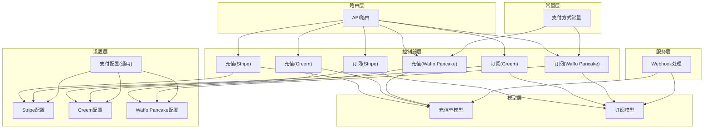
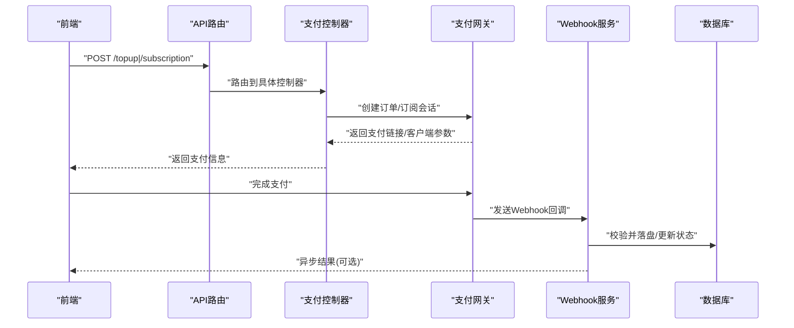
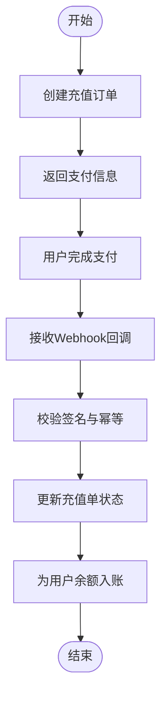
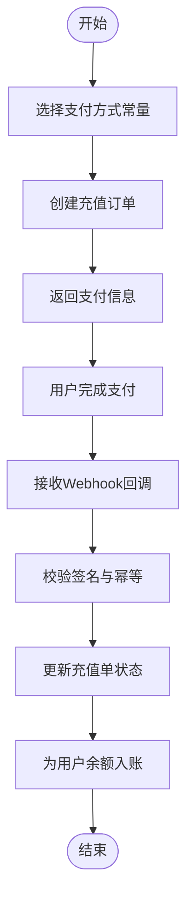
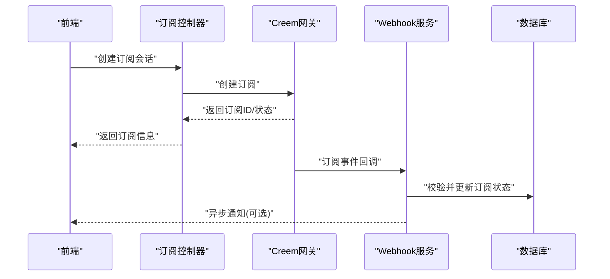
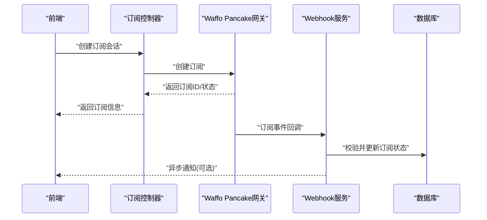
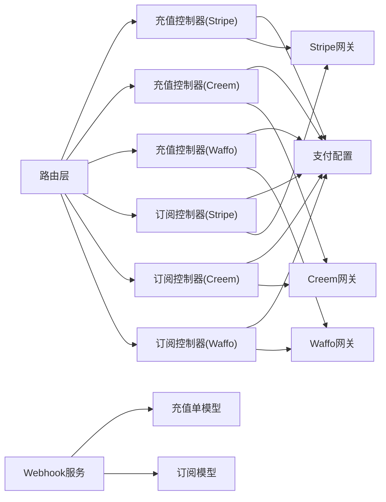

# 支付集成

<cite>
**本文引用的文件**   
- [controller/topup_stripe.go](file://controller/topup_stripe.go)
- [controller/topup_creem.go](file://controller/topup_creem.go)
- [controller/topup_waffo_pancake.go](file://controller/topup_waffo_pancake.go)
- [controller/subscription_payment_stripe.go](file://controller/subscription_payment_stripe.go)
- [controller/subscription_payment_creem.go](file://controller/subscription_payment_creem.go)
- [controller/subscription_payment_waffo_pancake.go](file://controller/subscription_payment_waffo_pancake.go)
- [setting/payment_setting.go](file://setting/operation_setting/payment_setting.go)
- [setting/payment_stripe.go](file://setting/payment_stripe.go)
- [setting/payment_creem.go](file://setting/payment_creem.go)
- [setting/payment_waffo_pancake.go](file://setting/payment_waffo_pancake.go)
- [model/topup.go](file://model/topup.go)
- [model/subscription.go](file://model/subscription.go)
- [service/webhook.go](file://service/webhook.go)
- [router/api-router.go](file://router/api-router.go)
- [constant/waffo_pay_method.go](file://constant/waffo_pay_method.go)
</cite>

## 目录
1. [简介](#简介)
2. [项目结构](#项目结构)
3. [核心组件](#核心组件)
4. [架构总览](#架构总览)
5. [详细组件分析](#详细组件分析)
6. [依赖关系分析](#依赖关系分析)
7. [性能考量](#性能考量)
8. [故障排除指南](#故障排除指南)
9. [结论](#结论)
10. [附录](#附录)

## 简介
本文件面向支付集成系统，系统性阐述多种支付渠道（Stripe、Creem、Waffo Pancake）的接入实现与业务流程。内容覆盖充值流程、订阅管理、支付回调处理机制、配置项与安全校验、错误处理与退款能力，以及与用户账户、余额管理和账单系统的集成关系。文档同时提供来自实际代码库的路径引用，帮助读者快速定位实现细节并进行二次开发或排障。

## 项目结构
支付相关功能主要分布在以下层次：
- 控制器层：对外暴露充值与订阅相关的 API，并对接各支付网关。
- 设置层：集中管理支付渠道的配置项（密钥、回调地址、货币等）。
- 模型层：持久化充值单、订阅记录等关键数据。
- 服务层：统一处理 Webhook、任务调度、计费结算等通用逻辑。
- 路由层：注册支付相关接口路径。
- 常量层：定义支付方式枚举等常量。

图表来源
- [router/api-router.go](file://router/api-router.go)
- [controller/topup_stripe.go](file://controller/topup_stripe.go)
- [controller/topup_creem.go](file://controller/topup_creem.go)
- [controller/topup_waffo_pancake.go](file://controller/topup_waffo_pancake.go)
- [controller/subscription_payment_stripe.go](file://controller/subscription_payment_stripe.go)
- [controller/subscription_payment_creem.go](file://controller/subscription_payment_creem.go)
- [controller/subscription_payment_waffo_pancake.go](file://controller/subscription_payment_waffo_pancake.go)
- [setting/payment_setting.go](file://setting/operation_setting/payment_setting.go)
- [setting/payment_stripe.go](file://setting/payment_stripe.go)
- [setting/payment_creem.go](file://setting/payment_creem.go)
- [setting/payment_waffo_pancake.go](file://setting/payment_waffo_pancake.go)
- [model/topup.go](file://model/topup.go)
- [model/subscription.go](file://model/subscription.go)
- [service/webhook.go](file://service/webhook.go)
- [constant/waffo_pay_method.go](file://constant/waffo_pay_method.go)

章节来源
- [router/api-router.go](file://router/api-router.go)
- [setting/payment_setting.go](file://setting/operation_setting/payment_setting.go)

## 核心组件
- 充值控制器（Stripe/Creem/Waffo Pancake）：负责创建充值订单、生成支付链接或客户端支付参数、返回前端所需信息。
- 订阅控制器（Stripe/Creem/Waffo Pancake）：负责创建订阅会话、处理订阅变更事件、维护订阅状态。
- 支付配置模块：集中管理各支付渠道的密钥、回调地址、币种、费率等配置。
- 模型层（充值单/订阅）：持久化交易与订阅生命周期数据，支撑对账与审计。
- Webhook 服务：统一接收并校验支付回调，触发余额入账、订阅生效等后续流程。
- 路由层：将外部请求分发到对应控制器。
- 常量层：定义支付方式标识，确保调用一致性。

章节来源
- [controller/topup_stripe.go](file://controller/topup_stripe.go)
- [controller/topup_creem.go](file://controller/topup_creem.go)
- [controller/topup_waffo_pancake.go](file://controller/topup_waffo_pancake.go)
- [controller/subscription_payment_stripe.go](file://controller/subscription_payment_stripe.go)
- [controller/subscription_payment_creem.go](file://controller/subscription_payment_creem.go)
- [controller/subscription_payment_waffo_pancake.go](file://controller/subscription_payment_waffo_pancake.go)
- [setting/payment_setting.go](file://setting/operation_setting/payment_setting.go)
- [model/topup.go](file://model/topup.go)
- [model/subscription.go](file://model/subscription.go)
- [service/webhook.go](file://service/webhook.go)
- [constant/waffo_pay_method.go](file://constant/waffo_pay_method.go)

## 架构总览
支付集成的整体交互流程如下：
- 前端发起充值或订阅请求至后端 API。
- 控制器根据所选支付渠道调用相应网关创建订单或订阅会话。
- 网关返回支付链接或客户端参数，前端完成支付。
- 支付成功后，网关通过 Webhook 通知后端。
- 后端校验签名与幂等性，更新充值单或订阅状态，并同步用户余额与账单。

图表来源
- [router/api-router.go](file://router/api-router.go)
- [controller/topup_stripe.go](file://controller/topup_stripe.go)
- [controller/topup_creem.go](file://controller/topup_creem.go)
- [controller/topup_waffo_pancake.go](file://controller/topup_waffo_pancake.go)
- [controller/subscription_payment_stripe.go](file://controller/subscription_payment_stripe.go)
- [controller/subscription_payment_creem.go](file://controller/subscription_payment_creem.go)
- [controller/subscription_payment_waffo_pancake.go](file://controller/subscription_payment_waffo_pancake.go)
- [service/webhook.go](file://service/webhook.go)

## 详细组件分析

### 充值流程（Stripe）
- 入口：充值控制器调用 Stripe SDK 创建订单或支付会话。
- 返回：支付链接或客户端参数供前端唤起支付。
- 回调：Webhook 服务接收并校验签名，更新充值单状态，增加用户余额。
- 幂等：基于订单号去重处理，避免重复入账。

图表来源
- [controller/topup_stripe.go](file://controller/topup_stripe.go)
- [service/webhook.go](file://service/webhook.go)
- [model/topup.go](file://model/topup.go)

章节来源
- [controller/topup_stripe.go](file://controller/topup_stripe.go)
- [service/webhook.go](file://service/webhook.go)
- [model/topup.go](file://model/topup.go)

### 充值流程（Creem）
- 入口：充值控制器调用 Creem 接口创建支付订单。
- 返回：支付链接或客户端参数。
- 回调：Webhook 服务校验并更新充值单，执行余额入账。
- 差异：不同网关的参数结构与回调字段存在差异，需按渠道适配。

图表来源
- [controller/topup_creem.go](file://controller/topup_creem.go)
- [service/webhook.go](file://service/webhook.go)
- [model/topup.go](file://model/topup.go)

章节来源
- [controller/topup_creem.go](file://controller/topup_creem.go)
- [service/webhook.go](file://service/webhook.go)
- [model/topup.go](file://model/topup.go)

### 充值流程（Waffo Pancake）
- 入口：充值控制器使用 Waffo Pancake 支付方式常量选择具体支付方法。
- 返回：支付链接或客户端参数。
- 回调：Webhook 服务校验并更新充值单，执行余额入账。
- 注意：支付方式常量用于区分不同支付通道，保证路由与处理一致。

图表来源
- [controller/topup_waffo_pancake.go](file://controller/topup_waffo_pancake.go)
- [constant/waffo_pay_method.go](file://constant/waffo_pay_method.go)
- [service/webhook.go](file://service/webhook.go)
- [model/topup.go](file://model/topup.go)

章节来源
- [controller/topup_waffo_pancake.go](file://controller/topup_waffo_pancake.go)
- [constant/waffo_pay_method.go](file://constant/waffo_pay_method.go)
- [service/webhook.go](file://service/webhook.go)
- [model/topup.go](file://model/topup.go)

### 订阅管理（Stripe）
- 入口：订阅控制器创建订阅会话，支持多周期与价格计划。
- 回调：Webhook 处理订阅创建、续费、取消、失败等事件。
- 状态：订阅模型记录当前状态、到期时间、下一期账单日期等。
- 安全：严格校验回调签名与事件类型，防止伪造事件。

图表来源
- [controller/subscription_payment_stripe.go](file://controller/subscription_payment_stripe.go)
- [service/webhook.go](file://service/webhook.go)
- [model/subscription.go](file://model/subscription.go)

章节来源
- [controller/subscription_payment_stripe.go](file://controller/subscription_payment_stripe.go)
- [service/webhook.go](file://service/webhook.go)
- [model/subscription.go](file://model/subscription.go)

### 订阅管理（Creem）
- 入口：订阅控制器调用 Creem 创建订阅会话。
- 回调：Webhook 处理订阅生命周期事件，更新订阅状态。
- 差异：不同渠道的事件结构与字段命名可能不同，需按渠道解析。

图表来源
- [controller/subscription_payment_creem.go](file://controller/subscription_payment_creem.go)
- [service/webhook.go](file://service/webhook.go)
- [model/subscription.go](file://model/subscription.go)

章节来源
- [controller/subscription_payment_creem.go](file://controller/subscription_payment_creem.go)
- [service/webhook.go](file://service/webhook.go)
- [model/subscription.go](file://model/subscription.go)

### 订阅管理（Waffo Pancake）
- 入口：订阅控制器使用 Waffo Pancake 支付方式常量创建订阅。
- 回调：Webhook 处理订阅事件，更新订阅状态。
- 注意：支付方式常量用于区分支付通道，确保回调路由正确。

图表来源
- [controller/subscription_payment_waffo_pancake.go](file://controller/subscription_payment_waffo_pancake.go)
- [constant/waffo_pay_method.go](file://constant/waffo_pay_method.go)
- [service/webhook.go](file://service/webhook.go)
- [model/subscription.go](file://model/subscription.go)

章节来源
- [controller/subscription_payment_waffo_pancake.go](file://controller/subscription_payment_waffo_pancake.go)
- [constant/waffo_pay_method.go](file://constant/waffo_pay_method.go)
- [service/webhook.go](file://service/webhook.go)
- [model/subscription.go](file://model/subscription.go)

### 支付配置与安全验证
- 配置项：包括各渠道的密钥、回调地址、币种、费率、超时等。
- 安全验证：
  - Webhook 签名校验：确保回调来源合法且未被篡改。
  - 幂等控制：基于订单号或事件 ID 去重，避免重复处理。
  - 白名单与限流：限制异常频率与来源 IP。
- 最佳实践：
  - 最小权限原则：仅授予必要权限。
  - 敏感信息加密存储：密钥与证书不落地明文。
  - 日志脱敏：避免记录敏感数据。

章节来源
- [setting/payment_setting.go](file://setting/operation_setting/payment_setting.go)
- [setting/payment_stripe.go](file://setting/payment_stripe.go)
- [setting/payment_creem.go](file://setting/payment_creem.go)
- [setting/payment_waffo_pancake.go](file://setting/payment_waffo_pancake.go)
- [service/webhook.go](file://service/webhook.go)

### 错误处理与退款
- 错误分类：网络错误、签名失败、业务校验失败、第三方网关错误。
- 处理策略：
  - 重试与退避：对瞬时错误进行有限次重试。
  - 降级与熔断：在持续失败时切换备用通道或关闭入口。
  - 告警与监控：记录错误码与上下文，触发告警。
- 退款能力：
  - 依据渠道支持的退款接口实现退款操作。
  - 记录退款流水与原因，保持可追溯。
  - 幂等与状态回滚：确保退款唯一性与一致性。

章节来源
- [service/webhook.go](file://service/webhook.go)
- [model/topup.go](file://model/topup.go)
- [model/subscription.go](file://model/subscription.go)

### 与用户账户、余额管理与账单系统的集成
- 用户账户：充值与订阅均关联用户 ID，确保资金归属明确。
- 余额管理：充值成功后按金额增加用户余额；订阅扣费从余额中扣除。
- 账单系统：记录每次交易明细，支持查询与导出；订阅周期性生成账单。
- 一致性：采用事务或补偿机制保证账务一致。

章节来源
- [model/topup.go](file://model/topup.go)
- [model/subscription.go](file://model/subscription.go)
- [service/webhook.go](file://service/webhook.go)

## 依赖关系分析
支付集成的依赖关系如下：
- 控制器依赖设置层获取渠道配置。
- 控制器调用第三方网关 SDK。
- Webhook 服务依赖模型层进行状态更新。
- 路由层将请求分发到控制器。
- 常量层为支付方式提供统一标识。

图表来源
- [router/api-router.go](file://router/api-router.go)
- [controller/topup_stripe.go](file://controller/topup_stripe.go)
- [controller/topup_creem.go](file://controller/topup_creem.go)
- [controller/topup_waffo_pancake.go](file://controller/topup_waffo_pancake.go)
- [controller/subscription_payment_stripe.go](file://controller/subscription_payment_stripe.go)
- [controller/subscription_payment_creem.go](file://controller/subscription_payment_creem.go)
- [controller/subscription_payment_waffo_pancake.go](file://controller/subscription_payment_waffo_pancake.go)
- [setting/payment_setting.go](file://setting/operation_setting/payment_setting.go)
- [service/webhook.go](file://service/webhook.go)
- [model/topup.go](file://model/topup.go)
- [model/subscription.go](file://model/subscription.go)

章节来源
- [router/api-router.go](file://router/api-router.go)
- [setting/payment_setting.go](file://setting/operation_setting/payment_setting.go)

## 性能考量
- 并发处理：Webhook 高并发场景下使用队列或线程池处理，避免阻塞。
- 缓存策略：对频繁读取的配置与汇率信息进行缓存。
- 连接池：对第三方网关的 HTTP 连接进行复用与限流。
- 异步化：非关键路径（如通知、报表）异步执行，降低主链路延迟。
- 监控与指标：采集成功率、延迟、错误率等关键指标。

[本节为通用指导，不直接分析具体文件]

## 故障排除指南
- 常见问题：
  - 回调签名失败：检查密钥、时间戳、签名算法与大小写。
  - 重复入账：确认幂等键是否唯一且持久化。
  - 订阅状态不一致：核对事件顺序与状态机转换。
  - 退款失败：检查渠道退款接口权限与订单状态。
- 排查步骤：
  - 查看 Webhook 日志与原始报文。
  - 校验签名与时间窗口。
  - 检查数据库记录与事务状态。
  - 复现并隔离问题环境。
- 恢复措施：
  - 重新投递失败的回调。
  - 手动修正不一致状态。
  - 升级或回滚版本以修复缺陷。

章节来源
- [service/webhook.go](file://service/webhook.go)
- [model/topup.go](file://model/topup.go)
- [model/subscription.go](file://model/subscription.go)

## 结论
本支付集成方案通过统一的控制器、配置与 Webhook 服务，实现了 Stripe、Creem、Waffo Pancake 等多渠道的充值与订阅管理。系统在安全、幂等、错误处理与性能方面具备完善设计，并与用户账户、余额与账单系统紧密集成。建议在生产环境中加强监控与审计，持续优化回调处理与对账流程。

[本节为总结性内容，不直接分析具体文件]

## 附录
- 配置示例路径：
  - 支付通用配置：[setting/operation_setting/payment_setting.go](file://setting/operation_setting/payment_setting.go)
  - Stripe 配置：[setting/payment_stripe.go](file://setting/payment_stripe.go)
  - Creem 配置：[setting/payment_creem.go](file://setting/payment_creem.go)
  - Waffo Pancake 配置：[setting/payment_waffo_pancake.go](file://setting/payment_waffo_pancake.go)
- 控制器示例路径：
  - 充值(Stripe)：[controller/topup_stripe.go](file://controller/topup_stripe.go)
  - 充值(Creem)：[controller/topup_creem.go](file://controller/topup_creem.go)
  - 充值(Waffo Pancake)：[controller/topup_waffo_pancake.go](file://controller/topup_waffo_pancake.go)
  - 订阅(Stripe)：[controller/subscription_payment_stripe.go](file://controller/subscription_payment_stripe.go)
  - 订阅(Creem)：[controller/subscription_payment_creem.go](file://controller/subscription_payment_creem.go)
  - 订阅(Waffo Pancake)：[controller/subscription_payment_waffo_pancake.go](file://controller/subscription_payment_waffo_pancake.go)
- 模型与服务示例路径：
  - 充值单模型：[model/topup.go](file://model/topup.go)
  - 订阅模型：[model/subscription.go](file://model/subscription.go)
  - Webhook 服务：[service/webhook.go](file://service/webhook.go)
- 路由与常量示例路径：
  - API 路由：[router/api-router.go](file://router/api-router.go)
  - 支付方式常量：[constant/waffo_pay_method.go](file://constant/waffo_pay_method.go)

[本节为参考索引，不直接分析具体文件]