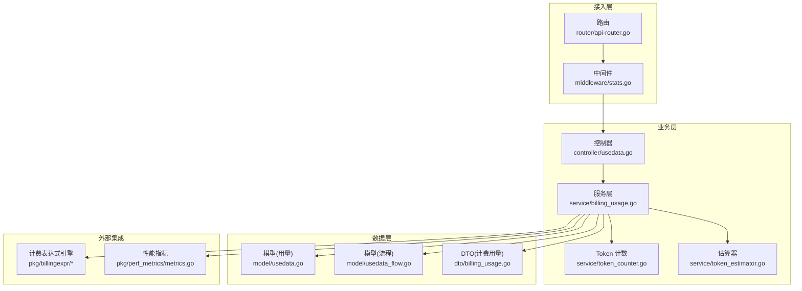
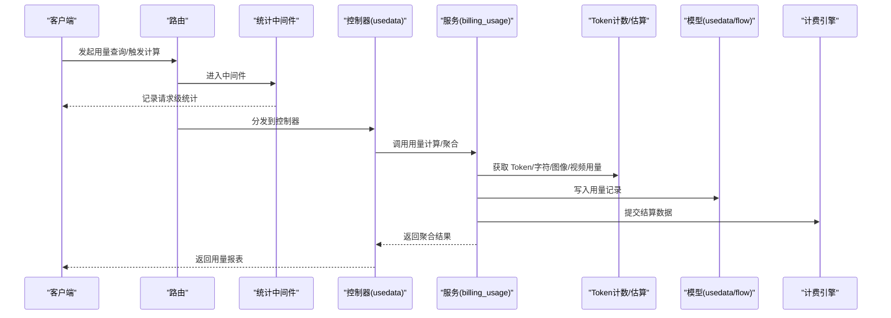
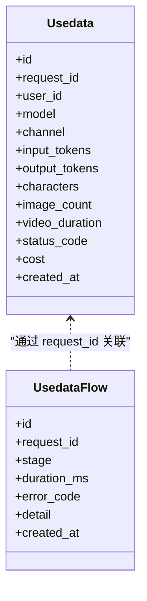
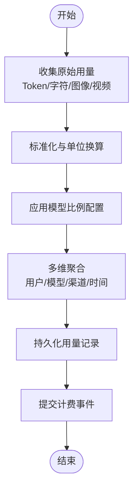
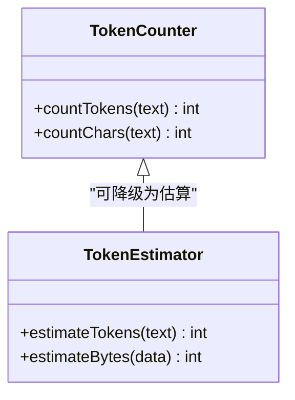
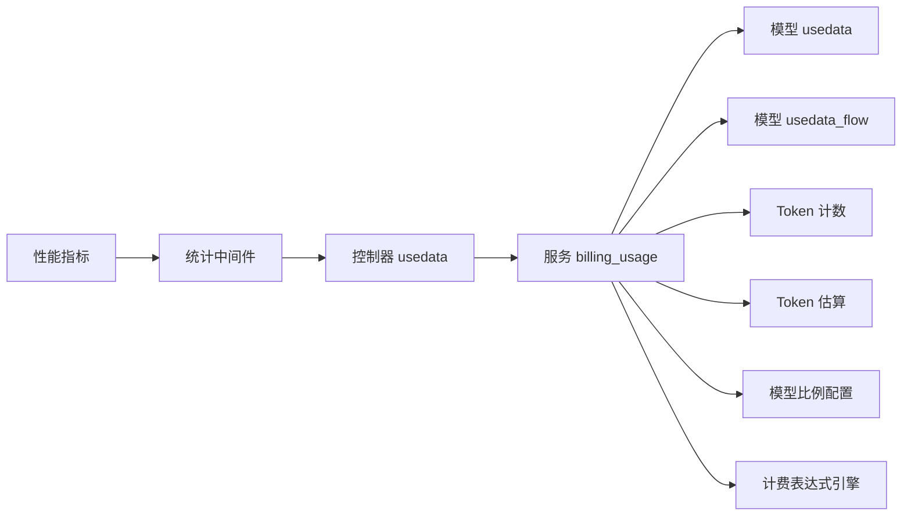

# 用量统计

<cite>
**本文引用的文件**   
- [main.go](file://main.go)
- [controller/usedata.go](file://controller/usedata.go)
- [model/usedata.go](file://model/usedata.go)
- [model/usedata_flow.go](file://model/usedata_flow.go)
- [service/billing_usage.go](file://service/billing_usage.go)
- [service/token_counter.go](file://service/token_counter.go)
- [service/token_estimator.go](file://service/token_estimator.go)
- [dto/billing_usage.go](file://dto/billing_usage.go)
- [relay/common/billing.go](file://relay/common/billing.go)
- [middleware/stats.go](file://middleware/stats.go)
- [pkg/perf_metrics/metrics.go](file://pkg/perf_metrics/metrics.go)
- [setting/ratio_setting/model_ratio.go](file://setting/ratio_setting/model_ratio.go)
- [router/api-router.go](file://router/api-router.go)
</cite>

## 目录
1. [简介](#简介)
2. [项目结构](#项目结构)
3. [核心组件](#核心组件)
4. [架构总览](#架构总览)
5. [详细组件分析](#详细组件分析)
6. [依赖关系分析](#依赖关系分析)
7. [性能考量](#性能考量)
8. [故障排查指南](#故障排查指南)
9. [结论](#结论)
10. [附录](#附录)

## 简介
本文件面向“用量统计系统”的完整实现与使用，覆盖请求用量计量、流量统计与使用数据分析。重点说明：
- Token 计数、字符统计、图像生成用量、视频处理用量的计算方法
- 用量数据的存储结构与查询接口
- 聚合分析与报表能力
- 与计费引擎、日志系统与报表生成的集成
- 监控、异常检测与容量规划建议

## 项目结构
用量统计相关代码分布在控制器、模型、服务层、DTO、中间件与路由等模块中，形成“采集—计算—存储—查询—报表”的闭环。

**图表来源** 
- [router/api-router.go](file://router/api-router.go)
- [middleware/stats.go](file://middleware/stats.go)
- [controller/usedata.go](file://controller/usedata.go)
- [service/billing_usage.go](file://service/billing_usage.go)
- [service/token_counter.go](file://service/token_counter.go)
- [service/token_estimator.go](file://service/token_estimator.go)
- [model/usedata.go](file://model/usedata.go)
- [model/usedata_flow.go](file://model/usedata_flow.go)
- [dto/billing_usage.go](file://dto/billing_usage.go)
- [pkg/perf_metrics/metrics.go](file://pkg/perf_metrics/metrics.go)

**章节来源**
- [main.go](file://main.go)
- [router/api-router.go](file://router/api-router.go)

## 核心组件
- 控制器 usedata：提供用量查询、聚合、导出等 HTTP 接口
- 模型 usedata/usedata_flow：用量记录与流程追踪的数据结构及持久化逻辑
- 服务 billing_usage：用量计算、聚合、报表生成与计费对接
- Token 计数与估算：token_counter、token_estimator 负责文本 Token 计数与估算
- 中间件 stats：请求级统计埋点（耗时、状态码、大小等）
- DTO billing_usage：用量数据传输对象，统一入参与出参结构
- 计费表达式引擎：基于表达式的计费结算与规则执行
- 性能指标：系统级指标采集与上报

**章节来源**
- [controller/usedata.go](file://controller/usedata.go)
- [model/usedata.go](file://model/usedata.go)
- [model/usedata_flow.go](file://model/usedata_flow.go)
- [service/billing_usage.go](file://service/billing_usage.go)
- [service/token_counter.go](file://service/token_counter.go)
- [service/token_estimator.go](file://service/token_estimator.go)
- [middleware/stats.go](file://middleware/stats.go)
- [dto/billing_usage.go](file://dto/billing_usage.go)
- [pkg/perf_metrics/metrics.go](file://pkg/perf_metrics/metrics.go)

## 架构总览
用量统计的整体流程如下：
- 请求进入后，中间件采集基础统计信息（请求大小、响应大小、耗时、状态码等）
- 控制器接收用量查询或触发用量计算任务
- 服务层调用 Token 计数/估算模块，结合模型比例配置，计算各维度用量
- 用量结果写入模型表，并同步至计费引擎进行结算
- 对外暴露聚合查询接口，供前端报表与审计使用

**图表来源** 
- [middleware/stats.go](file://middleware/stats.go)
- [controller/usedata.go](file://controller/usedata.go)
- [service/billing_usage.go](file://service/billing_usage.go)
- [service/token_counter.go](file://service/token_counter.go)
- [service/token_estimator.go](file://service/token_estimator.go)
- [model/usedata.go](file://model/usedata.go)
- [model/usedata_flow.go](file://model/usedata_flow.go)
- [pkg/perf_metrics/metrics.go](file://pkg/perf_metrics/metrics.go)

## 详细组件分析

### 控制器：用量查询与聚合接口
- 职责：接收用量查询参数，调用服务层完成聚合与导出
- 典型能力：按用户/模型/渠道/时间范围聚合；分页与排序；CSV/JSON 导出
- 错误处理：参数校验失败、权限不足、数据源不可用等

**章节来源**
- [controller/usedata.go](file://controller/usedata.go)

### 模型：用量数据与流程追踪
- 用量记录：包含请求标识、用户、模型、渠道、输入输出 Token、字符数、图像数量、视频时长等
- 流程追踪：记录请求生命周期关键节点（开始、结束、上游调用、重试、失败原因）
- 索引设计：按用户、模型、时间、渠道建立索引以支持高效聚合

**图表来源** 
- [model/usedata.go](file://model/usedata.go)
- [model/usedata_flow.go](file://model/usedata_flow.go)

**章节来源**
- [model/usedata.go](file://model/usedata.go)
- [model/usedata_flow.go](file://model/usedata_flow.go)

### 服务层：用量计算与计费对接
- 用量计算：整合 Token 计数、字符统计、图像生成用量、视频处理用量
- 聚合分析：按多维度（用户、模型、渠道、时间）聚合，支持累计、均值、分位数
- 计费对接：将用量转换为计费事件，交由表达式引擎结算

**图表来源** 
- [service/billing_usage.go](file://service/billing_usage.go)
- [service/token_counter.go](file://service/token_counter.go)
- [service/token_estimator.go](file://service/token_estimator.go)
- [setting/ratio_setting/model_ratio.go](file://setting/ratio_setting/model_ratio.go)

**章节来源**
- [service/billing_usage.go](file://service/billing_usage.go)
- [setting/ratio_setting/model_ratio.go](file://setting/ratio_setting/model_ratio.go)

### Token 计数与估算
- Token 计数：对文本输入/输出进行精确 Token 计数
- 字符统计：对非 Token 场景（如图片元数据、视频元数据）进行字符或字节统计
- 估算策略：在无法精确计数时采用估算方法（如按长度近似）

**图表来源** 
- [service/token_counter.go](file://service/token_counter.go)
- [service/token_estimator.go](file://service/token_estimator.go)

**章节来源**
- [service/token_counter.go](file://service/token_counter.go)
- [service/token_estimator.go](file://service/token_estimator.go)

### 中间件：请求级统计埋点
- 采集指标：请求大小、响应大小、耗时、状态码、上游调用耗时
- 异步上报：避免阻塞主流程，批量上报至指标系统
- 容错机制：上报失败不影响业务响应

**章节来源**
- [middleware/stats.go](file://middleware/stats.go)
- [pkg/perf_metrics/metrics.go](file://pkg/perf_metrics/metrics.go)

### DTO：计费用量数据结构
- 统一入参与出参：规范用量字段命名与类型
- 扩展性：支持新增字段与版本兼容

**章节来源**
- [dto/billing_usage.go](file://dto/billing_usage.go)

### 计费表达式引擎集成
- 表达式语言：支持复杂计费规则（阶梯价、折扣、封顶等）
- 结算流程：用量事件→表达式求值→结算结果

**章节来源**
- [relay/common/billing.go](file://relay/common/billing.go)

## 依赖关系分析
用量统计模块内部依赖清晰，外部依赖包括数据库、缓存、指标系统与计费引擎。

**图表来源** 
- [controller/usedata.go](file://controller/usedata.go)
- [service/billing_usage.go](file://service/billing_usage.go)
- [model/usedata.go](file://model/usedata.go)
- [model/usedata_flow.go](file://model/usedata_flow.go)
- [service/token_counter.go](file://service/token_counter.go)
- [service/token_estimator.go](file://service/token_estimator.go)
- [setting/ratio_setting/model_ratio.go](file://setting/ratio_setting/model_ratio.go)
- [middleware/stats.go](file://middleware/stats.go)
- [pkg/perf_metrics/metrics.go](file://pkg/perf_metrics/metrics.go)

**章节来源**
- [router/api-router.go](file://router/api-router.go)

## 性能考量
- 异步上报：用量与指标上报采用异步队列，降低主链路延迟
- 批量写入：聚合结果批量持久化，减少数据库压力
- 索引优化：按常用查询维度建立复合索引，提升聚合效率
- 缓存策略：热点聚合结果短期缓存，避免重复计算
- 限流保护：对高频查询接口实施限流，防止雪崩

[本节为通用指导，不直接分析具体文件]

## 故障排查指南
- 用量缺失：检查中间件埋点是否生效、上游响应是否包含用量字段
- Token 计数偏差：确认 Tokenizer 配置与模型映射是否正确
- 聚合结果不一致：核对比例配置与单位换算逻辑
- 计费结算异常：查看表达式引擎日志与结算事件完整性
- 指标上报失败：检查指标通道健康与重试策略

**章节来源**
- [middleware/stats.go](file://middleware/stats.go)
- [pkg/perf_metrics/metrics.go](file://pkg/perf_metrics/metrics.go)
- [service/billing_usage.go](file://service/billing_usage.go)

## 结论
用量统计系统通过“采集—计算—存储—查询—报表”的完整链路，实现对 Token、字符、图像与视频等多维用量的精准计量与分析。借助表达式引擎与指标系统，系统具备良好的扩展性与可观测性。建议在部署时关注索引设计与缓存策略，并结合监控告警实现异常检测与容量规划。

[本节为总结性内容，不直接分析具体文件]

## 附录
- 常见查询示例路径：控制器接口定义与参数说明
- 报表生成：聚合结果导出为 CSV/JSON 的路径与格式
- 计费规则：表达式语法与示例参考

[本节为补充说明，不直接分析具体文件]