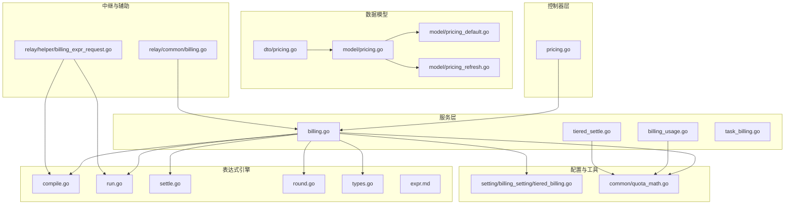
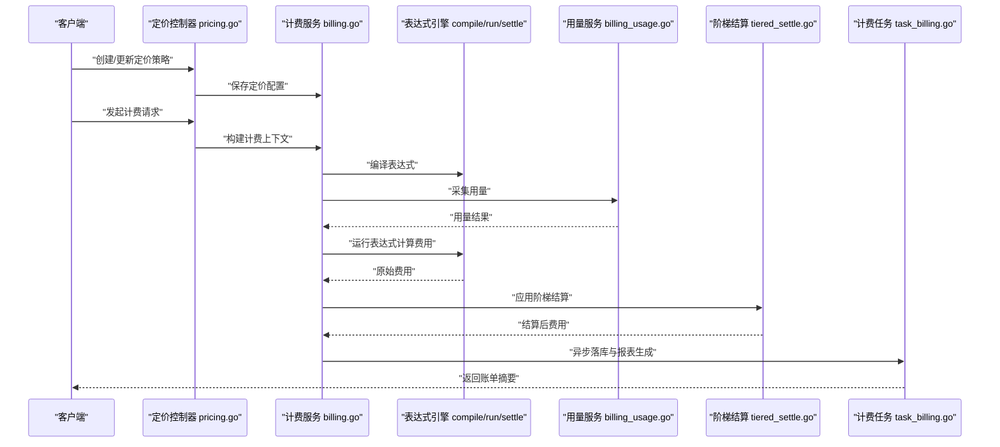
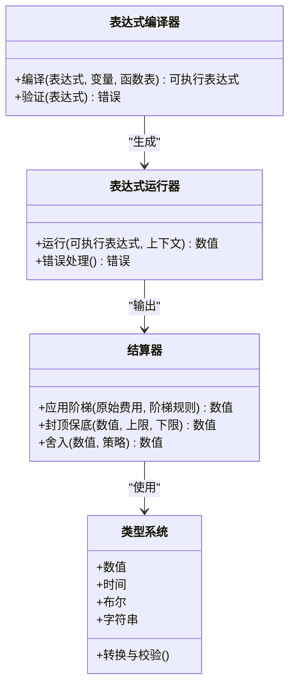
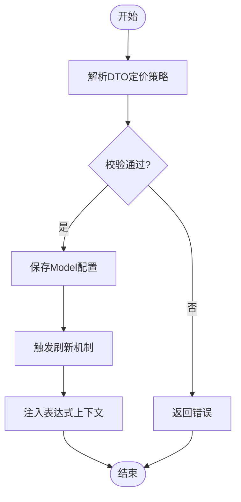
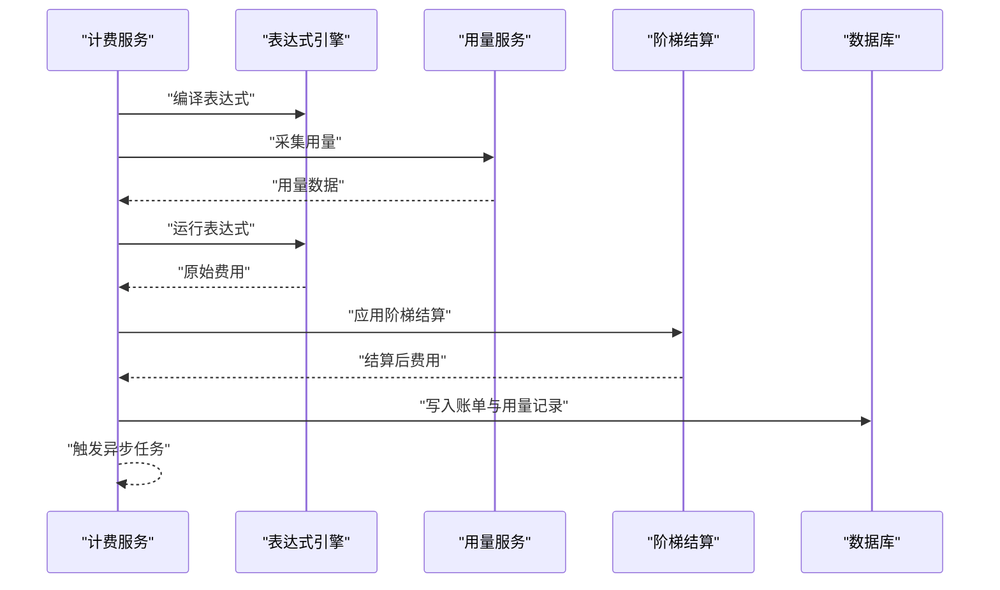
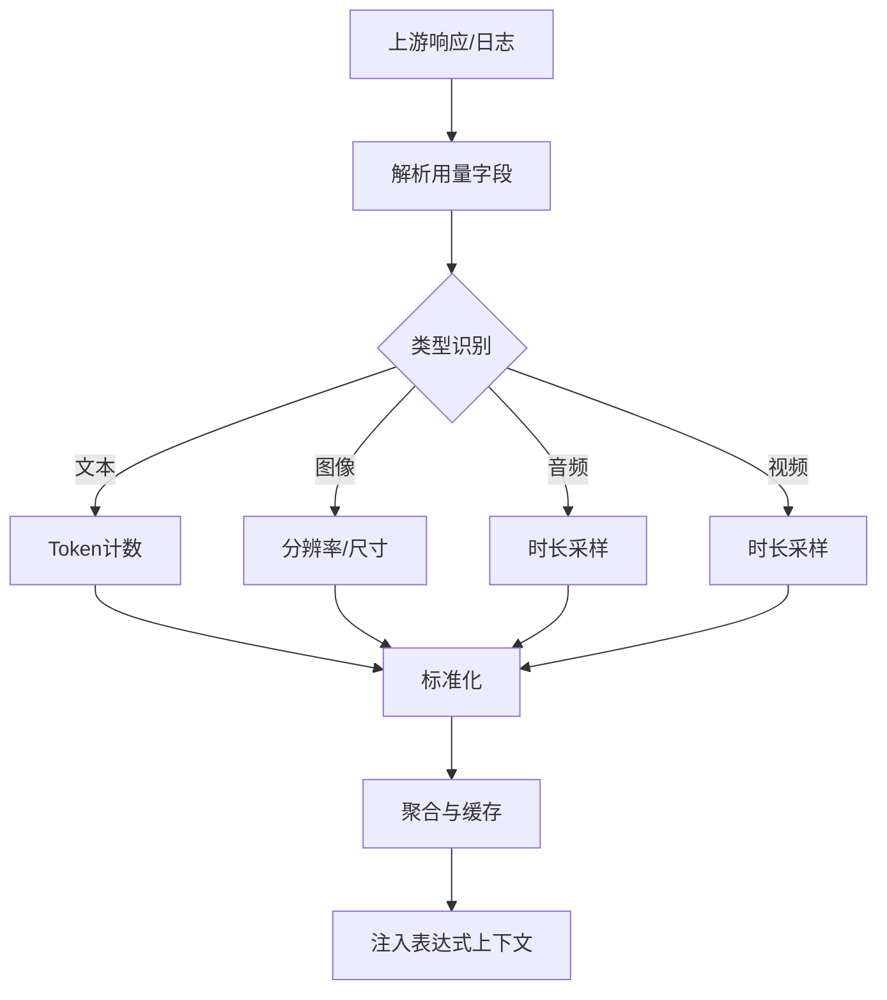
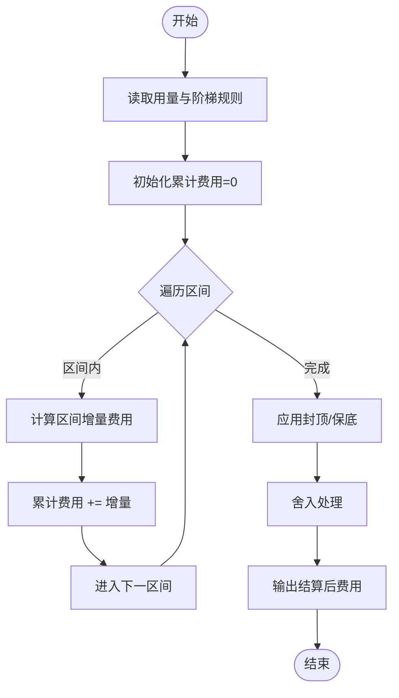
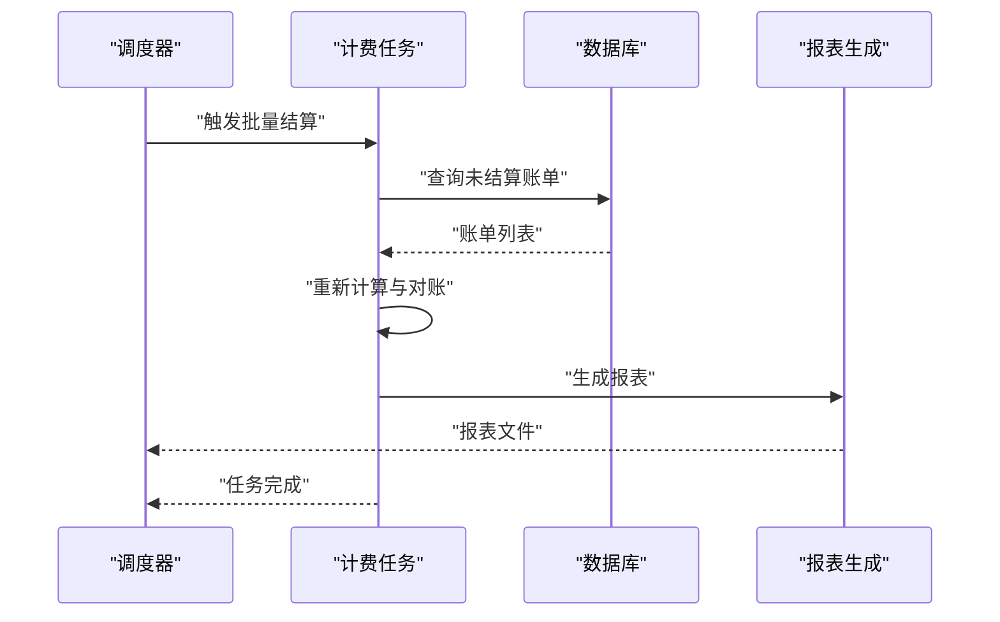
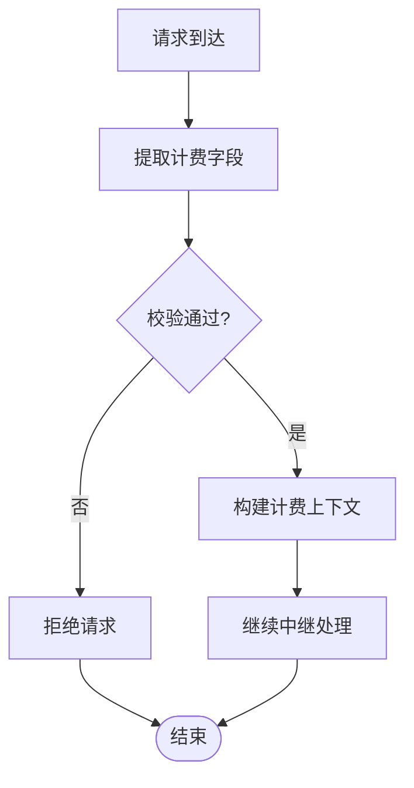
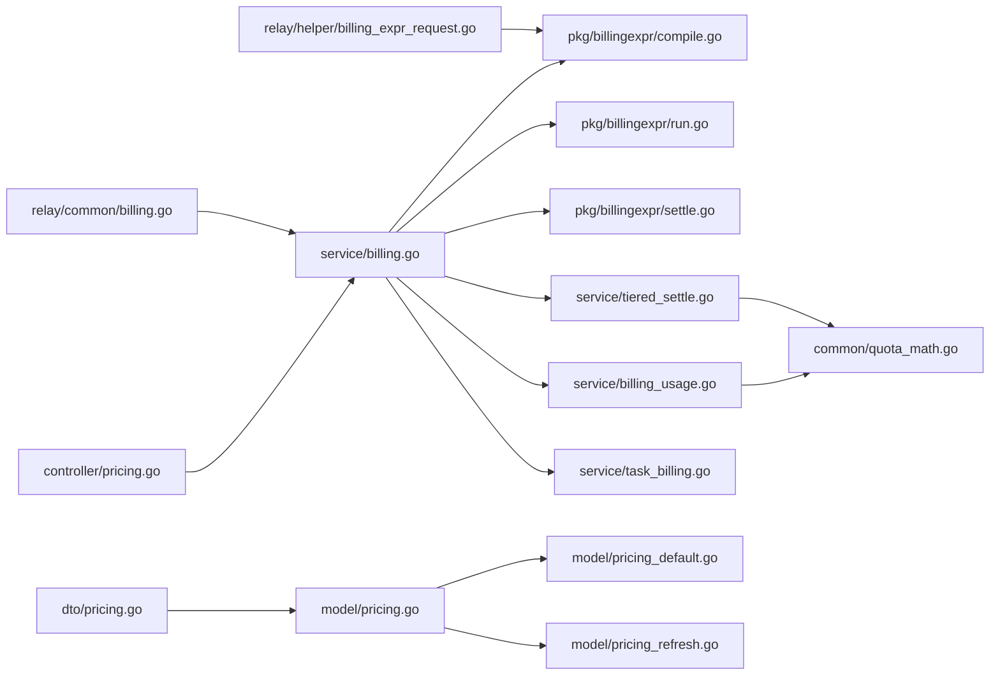

# 计费与定价

<cite>
**本文引用的文件**   
- [pkg/billingexpr/compile.go](file://pkg/billingexpr/compile.go)
- [pkg/billingexpr/run.go](file://pkg/billingexpr/run.go)
- [pkg/billingexpr/settle.go](file://pkg/billingexpr/settle.go)
- [pkg/billingexpr/types.go](file://pkg/billingexpr/types.go)
- [pkg/billingexpr/round.go](file://pkg/billingexpr/round.go)
- [pkg/billingexpr/expr.md](file://pkg/billingexpr/expr.md)
- [dto/pricing.go](file://dto/pricing.go)
- [model/pricing.go](file://model/pricing.go)
- [model/pricing_default.go](file://model/pricing_default.go)
- [model/pricing_refresh.go](file://model/pricing_refresh.go)
- [controller/pricing.go](file://controller/pricing.go)
- [service/billing.go](file://service/billing.go)
- [service/billing_usage.go](file://service/billing_usage.go)
- [service/tiered_settle.go](file://service/tiered_settle.go)
- [service/task_billing.go](file://service/task_billing.go)
- [relay/common/billing.go](file://relay/common/billing.go)
- [relay/helper/billing_expr_request.go](file://relay/helper/billing_expr_request.go)
- [setting/billing_setting/tiered_billing.go](file://setting/billing_setting/tiered_billing.go)
- [common/quota_math.go](file://common/quota_math.go)
</cite>

## 目录
1. [简介](#简介)
2. [项目结构](#项目结构)
3. [核心组件](#核心组件)
4. [架构总览](#架构总览)
5. [详细组件分析](#详细组件分析)
6. [依赖关系分析](#依赖关系分析)
7. [性能考量](#性能考量)
8. [故障排查指南](#故障排查指南)
9. [结论](#结论)
10. [附录](#附录)

## 简介
本文件面向计费与定价系统，系统性阐述基于表达式的计费引擎、动态定价策略、用量统计与账单生成的实现细节。文档覆盖表达式语法、定价模型、用量计量、支付集成与财务报表生成等关键能力，并提供来自代码库的具体示例路径与调用流程说明，帮助开发者快速理解并扩展计费能力。

## 项目结构
计费与定价相关代码主要分布在以下模块：
- 表达式引擎：pkg/billingexpr（编译、运行、结算、四舍五入、类型定义、语法说明）
- 定价数据模型与接口：dto/pricing.go、model/pricing.go、model/pricing_default.go、model/pricing_refresh.go
- 控制器层：controller/pricing.go（对外API）
- 服务层：service/billing.go、service/billing_usage.go、service/tiered_settle.go、service/task_billing.go
- 中继与请求处理：relay/common/billing.go、relay/helper/billing_expr_request.go
- 配置与设置：setting/billing_setting/tiered_billing.go
- 通用数学工具：common/quota_math.go

图表来源
- [controller/pricing.go](file://controller/pricing.go)
- [service/billing.go](file://service/billing.go)
- [service/billing_usage.go](file://service/billing_usage.go)
- [service/tiered_settle.go](file://service/tiered_settle.go)
- [service/task_billing.go](file://service/task_billing.go)
- [pkg/billingexpr/compile.go](file://pkg/billingexpr/compile.go)
- [pkg/billingexpr/run.go](file://pkg/billingexpr/run.go)
- [pkg/billingexpr/settle.go](file://pkg/billingexpr/settle.go)
- [pkg/billingexpr/round.go](file://pkg/billingexpr/round.go)
- [pkg/billingexpr/types.go](file://pkg/billingexpr/types.go)
- [pkg/billingexpr/expr.md](file://pkg/billingexpr/expr.md)
- [dto/pricing.go](file://dto/pricing.go)
- [model/pricing.go](file://model/pricing.go)
- [model/pricing_default.go](file://model/pricing_default.go)
- [model/pricing_refresh.go](file://model/pricing_refresh.go)
- [relay/common/billing.go](file://relay/common/billing.go)
- [relay/helper/billing_expr_request.go](file://relay/helper/billing_expr_request.go)
- [setting/billing_setting/tiered_billing.go](file://setting/billing_setting/tiered_billing.go)
- [common/quota_math.go](file://common/quota_math.go)

章节来源
- [pkg/billingexpr/compile.go](file://pkg/billingexpr/compile.go)
- [pkg/billingexpr/run.go](file://pkg/billingexpr/run.go)
- [pkg/billingexpr/settle.go](file://pkg/billingexpr/settle.go)
- [pkg/billingexpr/types.go](file://pkg/billingexpr/types.go)
- [pkg/billingexpr/round.go](file://pkg/billingexpr/round.go)
- [pkg/billingexpr/expr.md](file://pkg/billingexpr/expr.md)
- [dto/pricing.go](file://dto/pricing.go)
- [model/pricing.go](file://model/pricing.go)
- [model/pricing_default.go](file://model/pricing_default.go)
- [model/pricing_refresh.go](file://model/pricing_refresh.go)
- [controller/pricing.go](file://controller/pricing.go)
- [service/billing.go](file://service/billing.go)
- [service/billing_usage.go](file://service/billing_usage.go)
- [service/tiered_settle.go](file://service/tiered_settle.go)
- [service/task_billing.go](file://service/task_billing.go)
- [relay/common/billing.go](file://relay/common/billing.go)
- [relay/helper/billing_expr_request.go](file://relay/helper/billing_expr_request.go)
- [setting/billing_setting/tiered_billing.go](file://setting/billing_setting/tiered_billing.go)
- [common/quota_math.go](file://common/quota_math.go)

## 核心组件
- 表达式引擎（pkg/billingexpr）
  - 编译期：将计费表达式解析为可执行结构，支持变量绑定与函数注册。
  - 运行期：在给定上下文（用量、模型、渠道、用户等）下计算费用。
  - 结算期：按阶梯或固定规则进行最终结算，支持封顶与保底。
  - 四舍五入：统一金额精度与舍入策略。
  - 类型系统：定义数值、时间、字符串等基础类型及运算约束。
- 定价模型（dto/model）
  - DTO层提供外部接口数据结构（如模型单价、阶梯价格、折扣、货币单位）。
  - Model层持久化定价配置，支持默认值与刷新机制。
- 服务层（service）
  - billing.go：编排计费流程（解析表达式、计算用量、结算、落库）。
  - billing_usage.go：用量采集与聚合（token、图像、音频、视频等）。
  - tiered_settle.go：阶梯计费逻辑（分段累进、阈值判定）。
  - task_billing.go：异步任务（批量结算、对账、报表生成）。
- 中继与辅助（relay）
  - common/billing.go：计费上下文构建与传播。
  - helper/billing_expr_request.go：从请求中抽取计费所需字段（模型、参数、用量估算）。
- 配置与工具（setting/common）
  - setting/billing_setting/tiered_billing.go：阶梯计费全局配置。
  - common/quota_math.go：配额与用量计算的数学工具（精度、边界、误差控制）。

章节来源
- [pkg/billingexpr/compile.go](file://pkg/billingexpr/compile.go)
- [pkg/billingexpr/run.go](file://pkg/billingexpr/run.go)
- [pkg/billingexpr/settle.go](file://pkg/billingexpr/settle.go)
- [pkg/billingexpr/round.go](file://pkg/billingexpr/round.go)
- [pkg/billingexpr/types.go](file://pkg/billingexpr/types.go)
- [dto/pricing.go](file://dto/pricing.go)
- [model/pricing.go](file://model/pricing.go)
- [model/pricing_default.go](file://model/pricing_default.go)
- [model/pricing_refresh.go](file://model/pricing_refresh.go)
- [service/billing.go](file://service/billing.go)
- [service/billing_usage.go](file://service/billing_usage.go)
- [service/tiered_settle.go](file://service/tiered_settle.go)
- [service/task_billing.go](file://service/task_billing.go)
- [relay/common/billing.go](file://relay/common/billing.go)
- [relay/helper/billing_expr_request.go](file://relay/helper/billing_expr_request.go)
- [setting/billing_setting/tiered_billing.go](file://setting/billing_setting/tiered_billing.go)
- [common/quota_math.go](file://common/quota_math.go)

## 架构总览
计费系统采用分层设计：控制器暴露REST API；服务层编排计费流程；表达式引擎负责计算；数据模型持久化配置；中继层收集请求上下文与用量；配置模块驱动行为；工具模块保障数值精度与一致性。

图表来源
- [controller/pricing.go](file://controller/pricing.go)
- [service/billing.go](file://service/billing.go)
- [pkg/billingexpr/compile.go](file://pkg/billingexpr/compile.go)
- [pkg/billingexpr/run.go](file://pkg/billingexpr/run.go)
- [pkg/billingexpr/settle.go](file://pkg/billingexpr/settle.go)
- [service/billing_usage.go](file://service/billing_usage.go)
- [service/tiered_settle.go](file://service/tiered_settle.go)
- [service/task_billing.go](file://service/task_billing.go)

## 详细组件分析

### 表达式引擎（pkg/billingexpr）
- 编译阶段
  - 输入：计费表达式字符串、变量映射（模型、渠道、用户等级、用量等）、函数注册表。
  - 输出：可执行表达式对象，包含节点树与常量缓存。
- 运行阶段
  - 输入：运行时上下文（用量、时间、汇率、折扣等）。
  - 输出：原始费用（可能为多币种或多维度）。
- 结算阶段
  - 输入：原始费用、阶梯规则、封顶/保底、舍入策略。
  - 输出：最终结算金额。
- 四舍五入
  - 支持多种舍入模式（银行家舍入、向上/向下取整），保证财务一致性。
- 类型系统
  - 定义数值、时间、布尔、字符串等类型，以及类型转换与校验。

图表来源
- [pkg/billingexpr/compile.go](file://pkg/billingexpr/compile.go)
- [pkg/billingexpr/run.go](file://pkg/billingexpr/run.go)
- [pkg/billingexpr/settle.go](file://pkg/billingexpr/settle.go)
- [pkg/billingexpr/round.go](file://pkg/billingexpr/round.go)
- [pkg/billingexpr/types.go](file://pkg/billingexpr/types.go)

章节来源
- [pkg/billingexpr/compile.go](file://pkg/billingexpr/compile.go)
- [pkg/billingexpr/run.go](file://pkg/billingexpr/run.go)
- [pkg/billingexpr/settle.go](file://pkg/billingexpr/settle.go)
- [pkg/billingexpr/round.go](file://pkg/billingexpr/round.go)
- [pkg/billingexpr/types.go](file://pkg/billingexpr/types.go)
- [pkg/billingexpr/expr.md](file://pkg/billingexpr/expr.md)

### 定价模型与数据流（dto/model）
- DTO层
  - 定义定价策略的输入输出结构（模型ID、单价、阶梯、折扣、货币、有效期等）。
- Model层
  - 持久化定价配置，支持默认值与刷新机制（热更新、版本控制）。
- 数据流
  - 控制器接收DTO，转换为Model存储；服务层读取Model并注入到表达式上下文。

图表来源
- [dto/pricing.go](file://dto/pricing.go)
- [model/pricing.go](file://model/pricing.go)
- [model/pricing_default.go](file://model/pricing_default.go)
- [model/pricing_refresh.go](file://model/pricing_refresh.go)

章节来源
- [dto/pricing.go](file://dto/pricing.go)
- [model/pricing.go](file://model/pricing.go)
- [model/pricing_default.go](file://model/pricing_default.go)
- [model/pricing_refresh.go](file://model/pricing_refresh.go)

### 计费服务编排（service/billing.go）
- 职责
  - 编排计费流程：解析表达式、采集用量、计算费用、应用结算规则、落库与通知。
- 关键点
  - 上下文构建：整合用户、模型、渠道、用量、折扣、汇率等。
  - 错误处理：表达式编译失败、运行异常、结算错误。
  - 事务性：确保用量与账单的一致性。

图表来源
- [service/billing.go](file://service/billing.go)
- [pkg/billingexpr/compile.go](file://pkg/billingexpr/compile.go)
- [pkg/billingexpr/run.go](file://pkg/billingexpr/run.go)
- [service/billing_usage.go](file://service/billing_usage.go)
- [service/tiered_settle.go](file://service/tiered_settle.go)

章节来源
- [service/billing.go](file://service/billing.go)

### 用量统计（service/billing_usage.go）
- 功能
  - 采集各类型用量（文本token、图像分辨率、音频时长、视频时长等）。
  - 标准化与聚合：跨渠道统一计量口径。
  - 精度控制：避免浮点误差累积。
- 集成点
  - 中继层上报用量；服务层聚合并注入表达式上下文。

图表来源
- [service/billing_usage.go](file://service/billing_usage.go)
- [relay/common/billing.go](file://relay/common/billing.go)

章节来源
- [service/billing_usage.go](file://service/billing_usage.go)
- [relay/common/billing.go](file://relay/common/billing.go)

### 阶梯结算（service/tiered_settle.go）
- 功能
  - 分段累进：按用量区间应用不同单价。
  - 封顶/保底：限制最大/最小费用。
  - 舍入策略：统一金额精度。
- 算法要点
  - 阈值判定与区间匹配。
  - 增量计算与累计求和。
  - 边界条件处理（零用量、负值、溢出）。

图表来源
- [service/tiered_settle.go](file://service/tiered_settle.go)
- [common/quota_math.go](file://common/quota_math.go)

章节来源
- [service/tiered_settle.go](file://service/tiered_settle.go)
- [common/quota_math.go](file://common/quota_math.go)

### 计费任务与报表（service/task_billing.go）
- 功能
  - 异步结算：批量处理未结算账单。
  - 对账：核对用量与费用一致性。
  - 报表：生成财务对账文件（CSV/Excel）。
- 调度
  - 定时任务与事件驱动结合。
  - 失败重试与告警。

图表来源
- [service/task_billing.go](file://service/task_billing.go)

章节来源
- [service/task_billing.go](file://service/task_billing.go)

### 中继与请求处理（relay）
- relay/common/billing.go
  - 构建计费上下文（用户、模型、渠道、请求元数据）。
  - 传播计费标识与追踪ID。
- relay/helper/billing_expr_request.go
  - 从请求中提取计费字段（模型名称、参数、预估用量）。
  - 校验与规范化输入。

图表来源
- [relay/common/billing.go](file://relay/common/billing.go)
- [relay/helper/billing_expr_request.go](file://relay/helper/billing_expr_request.go)

章节来源
- [relay/common/billing.go](file://relay/common/billing.go)
- [relay/helper/billing_expr_request.go](file://relay/helper/billing_expr_request.go)

### 配置与设置（setting/billing_setting/tiered_billing.go）
- 内容
  - 阶梯计费全局开关、默认区间、舍入策略、封顶保底默认值。
- 作用
  - 驱动服务层与结算器的行为。
  - 支持热更新与灰度发布。

章节来源
- [setting/billing_setting/tiered_billing.go](file://setting/billing_setting/tiered_billing.go)

### 数学工具（common/quota_math.go）
- 功能
  - 高精度数值运算（避免浮点误差）。
  - 配额与用量的边界检查。
  - 舍入与格式化。

章节来源
- [common/quota_math.go](file://common/quota_math.go)

## 依赖关系分析
- 控制器依赖服务层，服务层依赖表达式引擎与用量服务。
- 表达式引擎独立于业务，仅依赖类型系统与工具。
- 数据模型与DTO解耦，便于迁移与版本管理。
- 中继层与服务层通过上下文契约交互。

图表来源
- [controller/pricing.go](file://controller/pricing.go)
- [service/billing.go](file://service/billing.go)
- [pkg/billingexpr/compile.go](file://pkg/billingexpr/compile.go)
- [pkg/billingexpr/run.go](file://pkg/billingexpr/run.go)
- [pkg/billingexpr/settle.go](file://pkg/billingexpr/settle.go)
- [service/billing_usage.go](file://service/billing_usage.go)
- [service/tiered_settle.go](file://service/tiered_settle.go)
- [service/task_billing.go](file://service/task_billing.go)
- [relay/helper/billing_expr_request.go](file://relay/helper/billing_expr_request.go)
- [relay/common/billing.go](file://relay/common/billing.go)
- [dto/pricing.go](file://dto/pricing.go)
- [model/pricing.go](file://model/pricing.go)
- [model/pricing_default.go](file://model/pricing_default.go)
- [model/pricing_refresh.go](file://model/pricing_refresh.go)
- [common/quota_math.go](file://common/quota_math.go)

章节来源
- [controller/pricing.go](file://controller/pricing.go)
- [service/billing.go](file://service/billing.go)
- [pkg/billingexpr/compile.go](file://pkg/billingexpr/compile.go)
- [pkg/billingexpr/run.go](file://pkg/billingexpr/run.go)
- [pkg/billingexpr/settle.go](file://pkg/billingexpr/settle.go)
- [service/billing_usage.go](file://service/billing_usage.go)
- [service/tiered_settle.go](file://service/tiered_settle.go)
- [service/task_billing.go](file://service/task_billing.go)
- [relay/helper/billing_expr_request.go](file://relay/helper/billing_expr_request.go)
- [relay/common/billing.go](file://relay/common/billing.go)
- [dto/pricing.go](file://dto/pricing.go)
- [model/pricing.go](file://model/pricing.go)
- [model/pricing_default.go](file://model/pricing_default.go)
- [model/pricing_refresh.go](file://model/pricing_refresh.go)
- [common/quota_math.go](file://common/quota_math.go)

## 性能考量
- 表达式编译缓存：预编译常用表达式，减少运行时开销。
- 用量聚合批处理：合并多次小用量为批次，降低数据库压力。
- 高精度计算优化：使用定点数或大整数避免浮点误差与频繁转换。
- 异步任务：结算与报表生成异步化，提升主链路吞吐。
- 缓存策略：定价配置与汇率缓存，减少远程依赖。

[本节为通用指导，不直接分析具体文件]

## 故障排查指南
- 表达式编译失败
  - 检查语法是否符合expr.md规范。
  - 确认变量与函数已正确注册。
- 运行期异常
  - 检查上下文是否完整（用量、模型、用户信息）。
  - 查看错误码与堆栈定位。
- 结算不一致
  - 核对阶梯规则与封顶保底配置。
  - 验证舍入策略与精度设置。
- 用量缺失或异常
  - 检查中继上报逻辑与字段映射。
  - 确认聚合与缓存一致性。
- 任务失败
  - 查看调度日志与重试策略。
  - 检查数据库锁与并发冲突。

章节来源
- [pkg/billingexpr/expr.md](file://pkg/billingexpr/expr.md)
- [service/billing.go](file://service/billing.go)
- [service/billing_usage.go](file://service/billing_usage.go)
- [service/tiered_settle.go](file://service/tiered_settle.go)
- [service/task_billing.go](file://service/task_billing.go)

## 结论
计费与定价系统通过表达式引擎实现灵活计费策略，结合用量统计与阶梯结算，形成完整的计费闭环。服务层编排清晰，数据模型与DTO解耦，中继层保障上下文完整性，配置与工具模块支撑高精度与一致性。建议在生产环境启用表达式缓存、用量批处理与异步任务，以提升性能与稳定性。

[本节为总结，不直接分析具体文件]

## 附录
- 表达式语法参考：pkg/billingexpr/expr.md
- 定价DTO结构：dto/pricing.go
- 定价模型与刷新：model/pricing.go、model/pricing_default.go、model/pricing_refresh.go
- 计费服务编排：service/billing.go
- 用量统计：service/billing_usage.go
- 阶梯结算：service/tiered_settle.go
- 计费任务：service/task_billing.go
- 中继上下文：relay/common/billing.go、relay/helper/billing_expr_request.go
- 配置与工具：setting/billing_setting/tiered_billing.go、common/quota_math.go

[本节为索引，不直接分析具体文件]