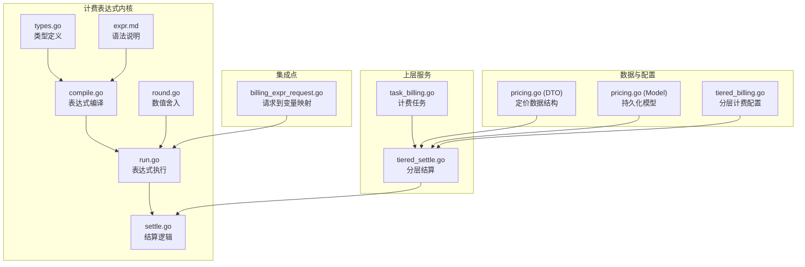
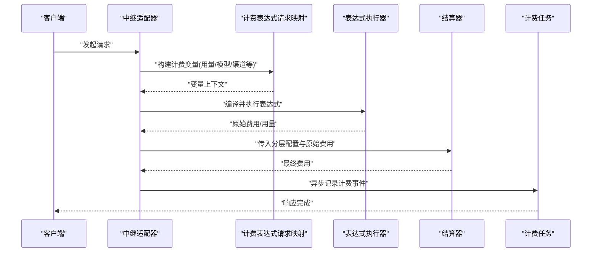
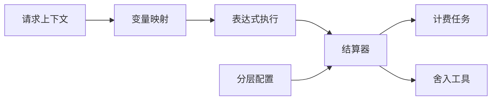

# 计费引擎

<cite>
**本文引用的文件**   
- [pkg/billingexpr/compile.go](file://pkg/billingexpr/compile.go)
- [pkg/billingexpr/run.go](file://pkg/billingexpr/run.go)
- [pkg/billingexpr/settle.go](file://pkg/billingexpr/settle.go)
- [pkg/billingexpr/types.go](file://pkg/billingexpr/types.go)
- [pkg/billingexpr/round.go](file://pkg/billingexpr/round.go)
- [pkg/billingexpr/billingexpr_test.go](file://pkg/billingexpr/billingexpr_test.go)
- [pkg/billingexpr/settle_clamp_test.go](file://pkg/billingexpr/settle_clamp_test.go)
- [pkg/billingexpr/expr.md](file://pkg/billingexpr/expr.md)
- [dto/pricing.go](file://dto/pricing.go)
- [model/pricing.go](file://model/pricing.go)
- [service/tiered_settle.go](file://service/tiered_settle.go)
- [service/task_billing.go](file://service/task_billing.go)
- [relay/helper/billing_expr_request.go](file://relay/helper/billing_expr_request.go)
- [setting/billing_setting/tiered_billing.go](file://setting/billing_setting/tiered_billing.go)
</cite>

## 目录
1. [简介](#简介)
2. [项目结构](#项目结构)
3. [核心组件](#核心组件)
4. [架构总览](#架构总览)
5. [详细组件分析](#详细组件分析)
6. [依赖关系分析](#依赖关系分析)
7. [性能考量](#性能考量)
8. [故障排查指南](#故障排查指南)
9. [结论](#结论)
10. [附录](#附录)

## 简介
本文件为“基于表达式的计费引擎”提供系统化、可操作的文档。内容覆盖表达式编译与执行、结算机制、语法与函数库、变量引用、规则配置与优先级、错误处理策略，以及与用量统计、渠道管理、用户配额系统的集成方式。同时给出性能优化建议与调试方法，并附带来自代码库的示例路径，帮助快速定位实现细节。

## 项目结构
计费引擎的核心位于 pkg/billingexpr 包，围绕“表达式语言”的编译、运行与结算展开；上层通过 service 层进行任务编排与分层结算；模型与 DTO 层负责持久化与接口数据；设置层提供分层计费配置；中继辅助模块将请求上下文映射到计费表达式所需变量。

图表来源
- [pkg/billingexpr/types.go](file://pkg/billingexpr/types.go)
- [pkg/billingexpr/compile.go](file://pkg/billingexpr/compile.go)
- [pkg/billingexpr/run.go](file://pkg/billingexpr/run.go)
- [pkg/billingexpr/settle.go](file://pkg/billingexpr/settle.go)
- [pkg/billingexpr/round.go](file://pkg/billingexpr/round.go)
- [pkg/billingexpr/expr.md](file://pkg/billingexpr/expr.md)
- [service/tiered_settle.go](file://service/tiered_settle.go)
- [service/task_billing.go](file://service/task_billing.go)
- [dto/pricing.go](file://dto/pricing.go)
- [model/pricing.go](file://model/pricing.go)
- [setting/billing_setting/tiered_billing.go](file://setting/billing_setting/tiered_billing.go)
- [relay/helper/billing_expr_request.go](file://relay/helper/billing_expr_request.go)

章节来源
- [pkg/billingexpr/types.go](file://pkg/billingexpr/types.go)
- [pkg/billingexpr/compile.go](file://pkg/billingexpr/compile.go)
- [pkg/billingexpr/run.go](file://pkg/billingexpr/run.go)
- [pkg/billingexpr/settle.go](file://pkg/billingexpr/settle.go)
- [pkg/billingexpr/round.go](file://pkg/billingexpr/round.go)
- [pkg/billingexpr/expr.md](file://pkg/billingexpr/expr.md)
- [service/tiered_settle.go](file://service/tiered_settle.go)
- [service/task_billing.go](file://service/task_billing.go)
- [dto/pricing.go](file://dto/pricing.go)
- [model/pricing.go](file://model/pricing.go)
- [setting/billing_setting/tiered_billing.go](file://setting/billing_setting/tiered_billing.go)
- [relay/helper/billing_expr_request.go](file://relay/helper/billing_expr_request.go)

## 核心组件
- 表达式类型与运行时环境：定义表达式 AST、变量表、函数集与执行上下文，确保编译期与运行期解耦。
- 表达式编译器：将文本表达式解析为可执行结构，支持操作符、函数调用与变量引用。
- 表达式执行器：在给定上下文中求值表达式，返回数值或错误。
- 结算器：基于表达式结果与分层配置计算最终费用，包含区间划分、封顶与舍入。
- 舍入工具：统一金额精度与舍入策略，保证财务一致性。
- 语法文档：描述表达式语法、内置函数与变量命名规范。

章节来源
- [pkg/billingexpr/types.go](file://pkg/billingexpr/types.go)
- [pkg/billingexpr/compile.go](file://pkg/billingexpr/compile.go)
- [pkg/billingexpr/run.go](file://pkg/billingexpr/run.go)
- [pkg/billingexpr/settle.go](file://pkg/billingexpr/settle.go)
- [pkg/billingexpr/round.go](file://pkg/billingexpr/round.go)
- [pkg/billingexpr/expr.md](file://pkg/billingexpr/expr.md)

## 架构总览
计费引擎采用“表达式即规则”的设计：业务侧以表达式描述计费逻辑，系统在请求链路中将其编译为可执行对象，在执行阶段结合用量与上下文求值，最后由结算器输出费用。分层结算与舍入策略保障复杂场景下的准确性与稳定性。

图表来源
- [relay/helper/billing_expr_request.go](file://relay/helper/billing_expr_request.go)
- [pkg/billingexpr/run.go](file://pkg/billingexpr/run.go)
- [pkg/billingexpr/settle.go](file://pkg/billingexpr/settle.go)
- [service/task_billing.go](file://service/task_billing.go)

## 详细组件分析

### 表达式类型与执行环境（types）
- 职责：定义表达式节点、变量表、函数注册表与执行上下文。
- 设计要点：
  - 变量表隔离不同作用域，避免污染。
  - 函数集按类别组织，便于扩展与维护。
  - 上下文携带请求元数据（模型、渠道、租户等），供表达式求值使用。

章节来源
- [pkg/billingexpr/types.go](file://pkg/billingexpr/types.go)

### 表达式编译（compile）
- 职责：将字符串表达式解析为 AST，校验语法与函数可用性。
- 关键点：
  - 词法分析与语法分析生成 AST。
  - 变量名与函数名规范化，防止歧义。
  - 编译期缓存已编译表达式，减少重复开销。

章节来源
- [pkg/billingexpr/compile.go](file://pkg/billingexpr/compile.go)

### 表达式执行（run）
- 职责：在给定上下文求值 AST，返回数值结果或错误。
- 关键点：
  - 支持算术、比较、逻辑、条件分支与函数调用。
  - 变量解析遵循作用域链，优先局部后全局。
  - 错误信息包含位置与原因，便于定位问题。

章节来源
- [pkg/billingexpr/run.go](file://pkg/billingexpr/run.go)

### 结算逻辑（settle）
- 职责：根据表达式结果与分层配置计算最终费用。
- 关键点：
  - 分层区间匹配与累进计费。
  - 封顶与保底控制，防止异常波动。
  - 与舍入策略联动，确保金额精度一致。

章节来源
- [pkg/billingexpr/settle.go](file://pkg/billingexpr/settle.go)

### 数值舍入（round）
- 职责：统一金额舍入策略，支持四舍五入、向上/向下取整等。
- 关键点：
  - 固定小数位与动态精度。
  - 银行家舍入与商业舍入可选。

章节来源
- [pkg/billingexpr/round.go](file://pkg/billingexpr/round.go)

### 语法与函数库（expr.md）
- 职责：描述表达式语法、操作符、内置函数与变量命名约定。
- 关键点：
  - 变量命名规范与可用列表。
  - 内置函数分类（数学、字符串、时间、计费相关）。
  - 示例表达式与常见模式。

章节来源
- [pkg/billingexpr/expr.md](file://pkg/billingexpr/expr.md)

### 分层结算（service/tiered_settle）
- 职责：将表达式结果与分层配置结合，计算各区间费用并汇总。
- 关键点：
  - 区间边界处理与重叠策略。
  - 权重与折扣叠加顺序。
  - 失败回退与默认值策略。

章节来源
- [service/tiered_settle.go](file://service/tiered_settle.go)

### 计费任务（service/task_billing）
- 职责：异步处理计费事件，落盘与指标上报。
- 关键点：
  - 幂等写入与重试机制。
  - 批量处理提升吞吐。
  - 监控与告警埋点。

章节来源
- [service/task_billing.go](file://service/task_billing.go)

### 请求到变量映射（relay/helper/billing_expr_request）
- 职责：将请求上下文转换为表达式可用的变量集合。
- 关键点：
  - 用量字段提取（如 token、图像尺寸、时长等）。
  - 渠道与模型元数据注入。
  - 安全过滤敏感字段。

章节来源
- [relay/helper/billing_expr_request.go](file://relay/helper/billing_expr_request.go)

### 定价数据结构与模型（dto/pricing, model/pricing）
- 职责：定义计费规则的 DTO 与持久化模型。
- 关键点：
  - 表达式字段与分层配置字段。
  - 版本管理与生效时间。
  - 校验与迁移脚本配合。

章节来源
- [dto/pricing.go](file://dto/pricing.go)
- [model/pricing.go](file://model/pricing.go)

### 分层计费配置（setting/billing_setting/tiered_billing）
- 职责：系统级分层计费参数与默认策略。
- 关键点：
  - 默认区间与阈值。
  - 全局舍入与封顶策略。
  - 与业务配置的覆盖机制。

章节来源
- [setting/billing_setting/tiered_billing.go](file://setting/billing_setting/tiered_billing.go)

### 单元测试与行为验证（billingexpr_test, settle_clamp_test）
- 职责：覆盖表达式编译、执行与结算的关键路径。
- 关键点：
  - 边界条件与异常输入。
  - 分层封顶与舍入一致性。
  - 回归测试保障稳定性。

章节来源
- [pkg/billingexpr/billingexpr_test.go](file://pkg/billingexpr/billingexpr_test.go)
- [pkg/billingexpr/settle_clamp_test.go](file://pkg/billingexpr/settle_clamp_test.go)

## 依赖关系分析
- 低耦合高内聚：表达式内核独立于上层服务，通过清晰的接口传递上下文与配置。
- 明确的数据流：请求→变量映射→表达式执行→结算→任务落盘。
- 可扩展性：函数集与变量表可按需扩展，不影响既有逻辑。

图表来源
- [relay/helper/billing_expr_request.go](file://relay/helper/billing_expr_request.go)
- [pkg/billingexpr/run.go](file://pkg/billingexpr/run.go)
- [pkg/billingexpr/settle.go](file://pkg/billingexpr/settle.go)
- [pkg/billingexpr/round.go](file://pkg/billingexpr/round.go)
- [service/tiered_settle.go](file://service/tiered_settle.go)
- [service/task_billing.go](file://service/task_billing.go)

章节来源
- [relay/helper/billing_expr_request.go](file://relay/helper/billing_expr_request.go)
- [pkg/billingexpr/run.go](file://pkg/billingexpr/run.go)
- [pkg/billingexpr/settle.go](file://pkg/billingexpr/settle.go)
- [pkg/billingexpr/round.go](file://pkg/billingexpr/round.go)
- [service/tiered_settle.go](file://service/tiered_settle.go)
- [service/task_billing.go](file://service/task_billing.go)

## 性能考量
- 表达式编译缓存：复用已编译 AST，降低 CPU 消耗。
- 变量映射批量化：合并多次映射为一次，减少分配与拷贝。
- 结算器无锁设计：纯函数式计算，避免竞争条件。
- 任务异步化：计费落盘与指标上报走异步队列，削峰填谷。
- 内存友好：避免大对象常驻，及时释放中间结果。

[本节为通用指导，不直接分析具体文件]

## 故障排查指南
- 表达式语法错误：检查 expr.md 中的语法与函数名拼写，确认变量存在且类型正确。
- 变量缺失或为空：核对 relay/helper/billing_expr_request 的映射逻辑，确保上游字段完整。
- 结算结果异常：查看 settle 的分层区间与封顶策略，确认配置与预期一致。
- 舍入不一致：检查 round 的策略与精度设置，统一财务口径。
- 性能抖动：启用慢查询日志，定位表达式复杂度高的规则，考虑拆分或缓存。

章节来源
- [pkg/billingexpr/expr.md](file://pkg/billingexpr/expr.md)
- [relay/helper/billing_expr_request.go](file://relay/helper/billing_expr_request.go)
- [pkg/billingexpr/settle.go](file://pkg/billingexpr/settle.go)
- [pkg/billingexpr/round.go](file://pkg/billingexpr/round.go)

## 结论
基于表达式的计费引擎以“规则即代码”的方式实现了灵活、可维护的计费体系。通过编译期与运行期的清晰分离、分层结算与统一舍入，系统在高并发与复杂场景下保持稳定与准确。借助完善的文档与测试，团队可快速迭代计费策略并保障质量。

[本节为总结，不直接分析具体文件]

## 附录

### 表达式语法与变量参考
- 语法要点：操作符优先级、函数调用形式、条件表达式与括号用法。
- 变量命名：模型、渠道、用量、租户等字段的命名约定。
- 内置函数：数学运算、字符串处理、时间转换、计费专用函数。

章节来源
- [pkg/billingexpr/expr.md](file://pkg/billingexpr/expr.md)

### 复杂计费逻辑示例路径
- 多模型加权与阶梯折扣：参考分层结算与表达式组合。
- 渠道差异化定价：结合渠道元数据与表达式条件分支。
- 用户配额限制与超额加价：在变量映射中注入配额状态并在表达式中判断。

章节来源
- [service/tiered_settle.go](file://service/tiered_settle.go)
- [relay/helper/billing_expr_request.go](file://relay/helper/billing_expr_request.go)
- [setting/billing_setting/tiered_billing.go](file://setting/billing_setting/tiered_billing.go)