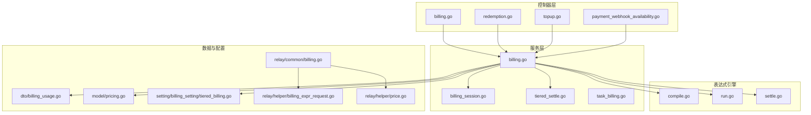
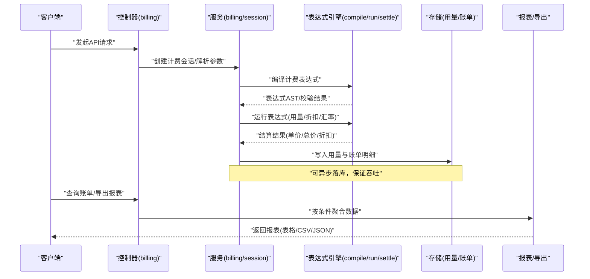
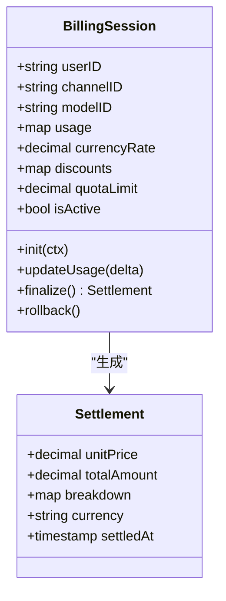
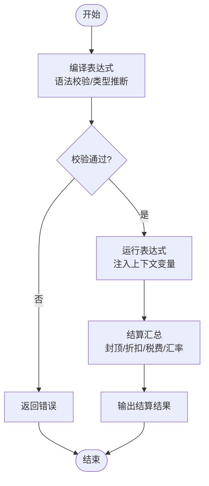
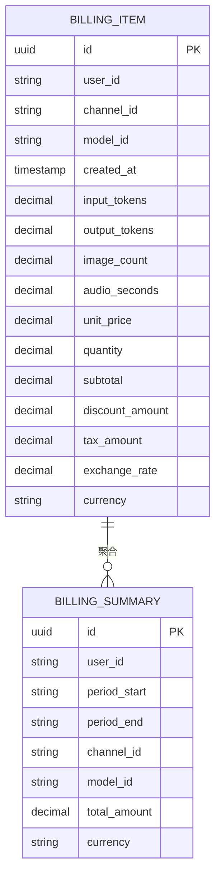
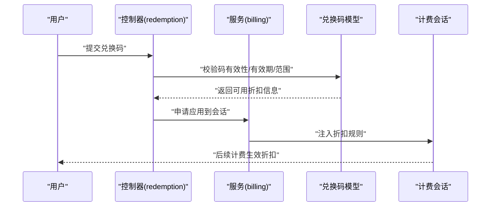
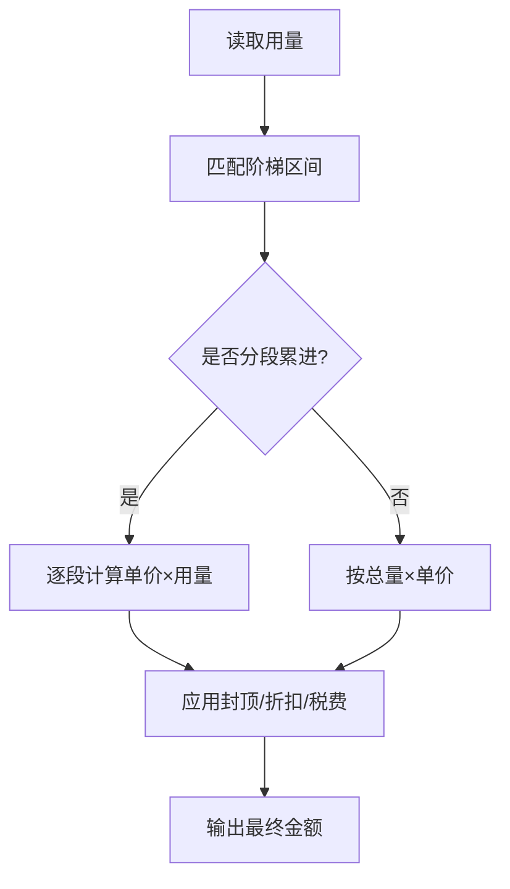
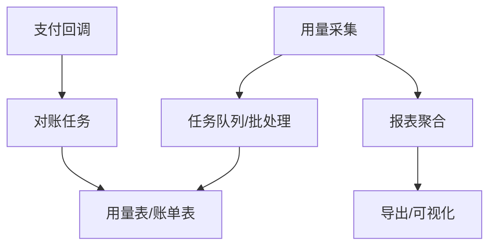
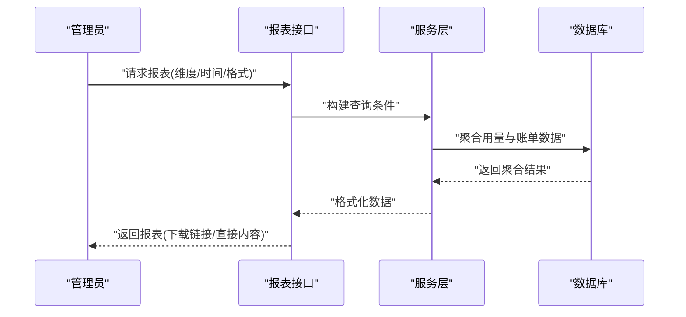
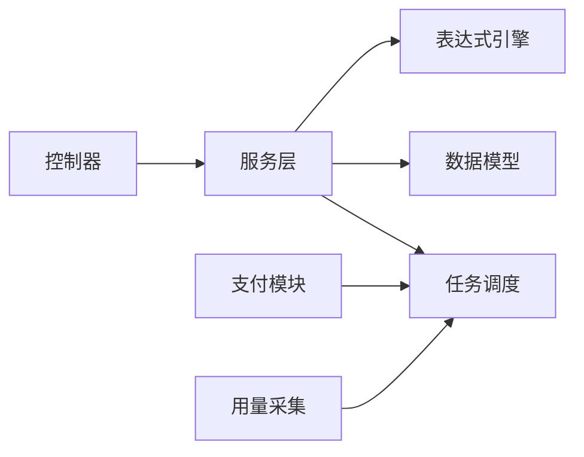

# 账单报表

<cite>
**本文引用的文件**   
- [controller/billing.go](file://controller/billing.go)
- [service/billing.go](file://service/billing.go)
- [service/billing_session.go](file://service/billing_session.go)
- [service/tiered_settle.go](file://service/tiered_settle.go)
- [pkg/billingexpr/compile.go](file://pkg/billingexpr/compile.go)
- [pkg/billingexpr/run.go](file://pkg/billingexpr/run.go)
- [pkg/billingexpr/settle.go](file://pkg/billingexpr/settle.go)
- [dto/billing_usage.go](file://dto/billing_usage.go)
- [model/pricing.go](file://model/pricing.go)
- [setting/billing_setting/tiered_billing.go](file://setting/billing_setting/tiered_billing.go)
- [relay/common/billing.go](file://relay/common/billing.go)
- [relay/helper/billing_expr_request.go](file://relay/helper/billing_expr_request.go)
- [relay/helper/price.go](file://relay/helper/price.go)
- [controller/redemption.go](file://controller/redemption.go)
- [model/redemption.go](file://model/redemption.go)
- [controller/topup.go](file://controller/topup.go)
- [controller/payment_webhook_availability.go](file://controller/payment_webhook_availability.go)
- [service/task_billing.go](file://service/task_billing.go)
- [model/usedata.go](file://model/usedata.go)
- [router/api-router.go](file://router/api-router.go)
</cite>

## 目录
1. [简介](#简介)
2. [项目结构](#项目结构)
3. [核心组件](#核心组件)
4. [架构总览](#架构总览)
5. [详细组件分析](#详细组件分析)
6. [依赖关系分析](#依赖关系分析)
7. [性能考量](#性能考量)
8. [故障排查指南](#故障排查指南)
9. [结论](#结论)
10. [附录](#附录)

## 简介
本文件面向“账单报表系统”，围绕以下目标展开：
- 深入解释账单生成、会话管理与分层结算的实现机制
- 详细说明账单数据结构、报表格式与导出能力
- 记录红码兑换、折扣计算与阶梯定价的处理逻辑
- 结合代码库中的实际模块，展示如何生成与分析账单报表
- 解释与用量统计、支付集成和用户管理的集成关系
- 提供财务报表定制、数据分析与审计追踪的实现指南

## 项目结构
账单相关能力横跨控制器、服务层、表达式引擎、数据模型与配置等模块。关键路径包括：
- 控制器层：对外暴露账单查询、报表导出、红码兑换、充值与支付回调等接口
- 服务层：封装计费会话、分层结算、任务化对账与批处理
- 表达式引擎：编译与执行计费表达式，支持复杂折扣与价格策略
- 数据模型：用量、定价、红码、订阅与使用记录
- 路由：将 HTTP 请求映射到具体控制器方法

图表来源
- [controller/billing.go](file://controller/billing.go)
- [service/billing.go](file://service/billing.go)
- [service/billing_session.go](file://service/billing_session.go)
- [service/tiered_settle.go](file://service/tiered_settle.go)
- [pkg/billingexpr/compile.go](file://pkg/billingexpr/compile.go)
- [pkg/billingexpr/run.go](file://pkg/billingexpr/run.go)
- [pkg/billingexpr/settle.go](file://pkg/billingexpr/settle.go)
- [dto/billing_usage.go](file://dto/billing_usage.go)
- [model/pricing.go](file://model/pricing.go)
- [setting/billing_setting/tiered_billing.go](file://setting/billing_setting/tiered_billing.go)
- [relay/common/billing.go](file://relay/common/billing.go)
- [relay/helper/billing_expr_request.go](file://relay/helper/billing_expr_request.go)
- [relay/helper/price.go](file://relay/helper/price.go)

章节来源
- [router/api-router.go](file://router/api-router.go)

## 核心组件
- 计费会话管理：维护一次调用或一批调用的上下文（用户、渠道、模型、配额、折扣、汇率等），贯穿请求生命周期
- 分层结算引擎：基于表达式与规则进行阶梯计价、封顶、折扣叠加与货币换算
- 账单数据模型：统一抽象用量、价格、折扣、税费、币种与时间戳，支撑报表聚合
- 报表与导出：按维度（用户、模型、渠道、时间段）聚合并输出结构化数据
- 红码与折扣：通过兑换码与促销策略影响最终结算金额
- 任务化对账：异步批量处理用量与账单，保障高吞吐场景下的稳定性

章节来源
- [service/billing_session.go](file://service/billing_session.go)
- [service/tiered_settle.go](file://service/tiered_settle.go)
- [dto/billing_usage.go](file://dto/billing_usage.go)
- [model/pricing.go](file://model/pricing.go)
- [setting/billing_setting/tiered_billing.go](file://setting/billing_setting/tiered_billing.go)

## 架构总览
整体流程从请求进入控制器开始，经由服务层完成会话初始化、用量采集、表达式计算与分层结算，最终落盘为用量与账单记录；报表服务按需聚合导出。

图表来源
- [controller/billing.go](file://controller/billing.go)
- [service/billing.go](file://service/billing.go)
- [service/billing_session.go](file://service/billing_session.go)
- [pkg/billingexpr/compile.go](file://pkg/billingexpr/compile.go)
- [pkg/billingexpr/run.go](file://pkg/billingexpr/run.go)
- [pkg/billingexpr/settle.go](file://pkg/billingexpr/settle.go)
- [dto/billing_usage.go](file://dto/billing_usage.go)

## 详细组件分析

### 计费会话与会话管理
- 职责：承载一次计费过程所需的全部上下文，包括用户标识、渠道、模型、用量、汇率、折扣、配额状态等
- 关键点：
  - 会话生命周期与请求绑定，支持跨中间件传递
  - 在流式响应中增量更新用量与费用
  - 失败回滚与补偿：异常时清理未结算的临时数据
- 典型用法：
  - 初始化会话：根据请求头与鉴权信息填充基础字段
  - 用量上报：每次分片或响应片段触发增量累加
  - 结算触发：在响应结束时统一计算最终费用

图表来源
- [service/billing_session.go](file://service/billing_session.go)
- [dto/billing_usage.go](file://dto/billing_usage.go)

章节来源
- [service/billing_session.go](file://service/billing_session.go)
- [dto/billing_usage.go](file://dto/billing_usage.go)

### 分层结算与表达式引擎
- 职责：将业务规则（阶梯价、封顶、折扣、税费、汇率）以表达式形式描述，并在运行时安全执行
- 关键点：
  - 编译阶段：语法检查、类型推断、常量折叠
  - 运行阶段：注入上下文变量（用量、配额、折扣、汇率）求值
  - 结算阶段：汇总各层级价格，应用封顶与折扣叠加，输出最终金额
- 适用场景：
  - 多模型差异化定价
  - 渠道加成/折扣
  - 用户等级折扣与活动券叠加
  - 汇率折算与税费附加

图表来源
- [pkg/billingexpr/compile.go](file://pkg/billingexpr/compile.go)
- [pkg/billingexpr/run.go](file://pkg/billingexpr/run.go)
- [pkg/billingexpr/settle.go](file://pkg/billingexpr/settle.go)

章节来源
- [pkg/billingexpr/compile.go](file://pkg/billingexpr/compile.go)
- [pkg/billingexpr/run.go](file://pkg/billingexpr/run.go)
- [pkg/billingexpr/settle.go](file://pkg/billingexpr/settle.go)

### 账单数据结构与报表格式
- 数据结构：
  - 用量项：模型、渠道、时间、输入/输出 token、图像分辨率、音频时长等
  - 价格项：单价、数量、小计、折扣、税费、汇率、币种
  - 汇总项：用户、时间段、渠道、模型维度的聚合金额
- 报表格式：
  - 行级明细：每条用量对应一条费用明细
  - 汇总视图：按维度聚合，支持分页与筛选
  - 导出格式：CSV/JSON 等结构化格式，便于外部系统对接

图表来源
- [dto/billing_usage.go](file://dto/billing_usage.go)
- [model/pricing.go](file://model/pricing.go)

章节来源
- [dto/billing_usage.go](file://dto/billing_usage.go)
- [model/pricing.go](file://model/pricing.go)

### 红码兑换与折扣计算
- 红码（兑换码）：用于发放额度或折扣，支持一次性/多次使用、有效期、适用范围（模型/渠道/用户组）
- 折扣计算：
  - 折扣类型：固定金额、比例折扣、阶梯折扣
  - 叠加规则：优先级、互斥、封顶限制
  - 与汇率/税费联动：先折后税或先税后折的策略选择
- 业务流程：
  - 兑换：校验码有效性、剩余次数、适用范围
  - 应用：将折扣注入计费会话，参与表达式求值
  - 审计：记录兑换与使用日志，支持追溯

图表来源
- [controller/redemption.go](file://controller/redemption.go)
- [model/redemption.go](file://model/redemption.go)
- [service/billing_session.go](file://service/billing_session.go)

章节来源
- [controller/redemption.go](file://controller/redemption.go)
- [model/redemption.go](file://model/redemption.go)
- [service/billing_session.go](file://service/billing_session.go)

### 阶梯定价与定价配置
- 阶梯定价：按用量区间设置不同单价，支持累计与分段计价
- 配置来源：
  - 模型/渠道级别默认定价
  - 用户/分组级别覆盖
  - 活动/促销临时覆盖
- 计算方式：
  - 分段累进：每段用量乘以对应单价
  - 封顶策略：单条或周期内最高费用上限
  - 折扣叠加：与红码、优惠券、会员等级折扣组合

图表来源
- [setting/billing_setting/tiered_billing.go](file://setting/billing_setting/tiered_billing.go)
- [model/pricing.go](file://model/pricing.go)

章节来源
- [setting/billing_setting/tiered_billing.go](file://setting/billing_setting/tiered_billing.go)
- [model/pricing.go](file://model/pricing.go)

### 与用量统计、支付集成和用户管理的集成
- 用量统计：
  - 实时采集：在响应流中增量统计 token/图像/音频等指标
  - 异步落盘：批量写入，降低主链路延迟
- 支付集成：
  - 充值：支持多种支付方式，回调后更新余额/额度
  - 对账：定时任务拉取支付平台账单，与内部用量核对
- 用户管理：
  - 配额控制：基于用户等级与套餐限制用量
  - 权限控制：模型/渠道访问权限影响计费策略

图表来源
- [model/usedata.go](file://model/usedata.go)
- [service/task_billing.go](file://service/task_billing.go)
- [controller/topup.go](file://controller/topup.go)
- [controller/payment_webhook_availability.go](file://controller/payment_webhook_availability.go)

章节来源
- [model/usedata.go](file://model/usedata.go)
- [service/task_billing.go](file://service/task_billing.go)
- [controller/topup.go](file://controller/topup.go)
- [controller/payment_webhook_availability.go](file://controller/payment_webhook_availability.go)

### 报表生成与分析
- 聚合维度：用户、模型、渠道、时间段、币种
- 过滤与排序：按金额、用量、时间范围筛选，支持分页
- 导出能力：CSV/JSON，便于财务系统与 BI 工具接入
- 审计追踪：记录报表生成时间与操作人，支持回溯

图表来源
- [controller/billing.go](file://controller/billing.go)
- [service/billing.go](file://service/billing.go)

章节来源
- [controller/billing.go](file://controller/billing.go)
- [service/billing.go](file://service/billing.go)

## 依赖关系分析
- 控制器依赖服务层，服务层依赖表达式引擎与数据模型
- 表达式引擎独立于业务，便于扩展新规则
- 用量与账单数据由服务层统一写入，避免重复逻辑
- 支付与充值模块通过回调与任务与账单系统解耦

图表来源
- [controller/billing.go](file://controller/billing.go)
- [service/billing.go](file://service/billing.go)
- [pkg/billingexpr/compile.go](file://pkg/billingexpr/compile.go)
- [model/pricing.go](file://model/pricing.go)
- [service/task_billing.go](file://service/task_billing.go)

章节来源
- [controller/billing.go](file://controller/billing.go)
- [service/billing.go](file://service/billing.go)
- [pkg/billingexpr/compile.go](file://pkg/billingexpr/compile.go)
- [model/pricing.go](file://model/pricing.go)
- [service/task_billing.go](file://service/task_billing.go)

## 性能考量
- 用量采集与账单写入采用异步批处理，降低主链路延迟
- 表达式编译缓存，避免重复 AST 构建
- 报表聚合使用物化视图或预聚合表，提升查询性能
- 高并发场景下，会话对象池与内存复用减少 GC 压力
- 数据库层面：合理索引（用户、时间、模型、渠道）与分区策略

[本节为通用指导，不直接分析具体文件]

## 故障排查指南
- 常见问题：
  - 表达式编译失败：检查语法与类型定义
  - 结算金额异常：核对阶梯定价与折扣叠加顺序
  - 用量不一致：确认流式采集与批处理一致性
  - 支付对账差异：核对回调幂等与重试机制
- 定位手段：
  - 启用审计日志，记录会话关键节点
  - 导出原始用量与账单明细进行比对
  - 使用测试用例验证表达式与定价规则

章节来源
- [service/billing.go](file://service/billing.go)
- [service/task_billing.go](file://service/task_billing.go)
- [controller/billing.go](file://controller/billing.go)

## 结论
本账单报表系统通过“会话+表达式+分层结算”的核心设计，实现了灵活、可扩展且高性能的计费与报表能力。配合用量统计、支付集成与用户管理，形成完整的商业化闭环。建议在生产环境中加强审计与监控，确保数据一致性与可追溯性。

[本节为总结，不直接分析具体文件]

## 附录
- 术语表：
  - 计费会话：一次计费过程的上下文载体
  - 表达式引擎：将业务规则编译并执行的计算引擎
  - 分层结算：按阶梯、封顶、折扣等多层规则计算最终费用
  - 红码：用于兑换额度或折扣的凭证
- 最佳实践：
  - 将复杂定价规则抽象为表达式，便于版本化管理
  - 对用量与账单数据进行幂等写入，避免重复计费
  - 报表导出前进行数据校验与脱敏

[本节为补充说明，不直接分析具体文件]