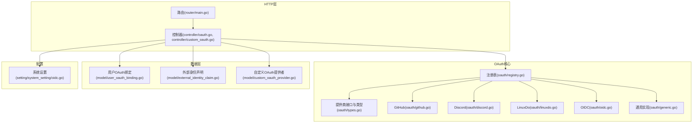
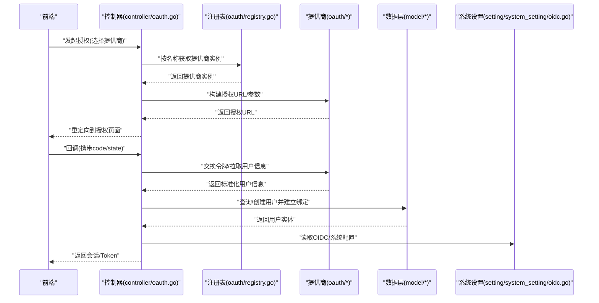
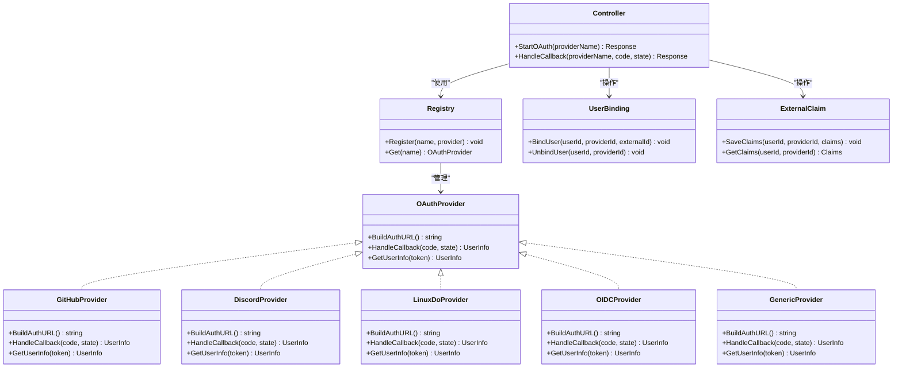

# OAuth集成

<cite>
**本文引用的文件**   
- [oauth/provider.go](file://oauth/provider.go)
- [oauth/registry.go](file://oauth/registry.go)
- [oauth/types.go](file://oauth/types.go)
- [oauth/github.go](file://oauth/github.go)
- [oauth/discord.go](file://oauth/discord.go)
- [oauth/linuxdo.go](file://oauth/linuxdo.go)
- [oauth/oidc.go](file://oauth/oidc.go)
- [oauth/generic.go](file://oauth/generic.go)
- [controller/oauth.go](file://controller/oauth.go)
- [controller/custom_oauth.go](file://controller/custom_oauth.go)
- [model/user_oauth_binding.go](file://model/user_oauth_binding.go)
- [model/custom_oauth_provider.go](file://model/custom_oauth_provider.go)
- [model/external_identity_claim.go](file://model/external_identity_claim.go)
- [setting/system_setting/oidc.go](file://setting/system_setting/oidc.go)
- [router/main.go](file://router/main.go)
</cite>

## 目录
1. [简介](#简介)
2. [项目结构](#项目结构)
3. [核心组件](#核心组件)
4. [架构总览](#架构总览)
5. [详细组件分析](#详细组件分析)
6. [依赖关系分析](#依赖关系分析)
7. [性能考虑](#性能考虑)
8. [故障排查指南](#故障排查指南)
9. [结论](#结论)
10. [附录：新增OAuth提供商与最佳实践](#附录新增oauth提供商与最佳实践)

## 简介
本文件面向OAuth集成系统，系统性阐述已支持的OAuth/OIDC提供商（GitHub、Discord、LinuxDo、OIDC等）、自定义OAuth配置、认证流程、回调处理、用户信息映射、错误处理，以及与用户绑定和权限系统的关系。文档基于代码库中的实际实现进行说明，并提供扩展新提供商的步骤与最佳实践建议。

## 项目结构
OAuth相关能力主要分布在以下模块：
- oauth：各提供商的具体实现与通用类型、注册表
- controller：HTTP控制器，负责路由、参数校验、调用服务层、返回响应
- model：数据模型，包括用户OAuth绑定、外部身份声明、自定义OAuth提供者
- setting：系统设置，包含OIDC等配置项
- router：路由注册，将控制器方法挂载到HTTP端点

**图表来源** 
- [router/main.go](file://router/main.go)
- [controller/oauth.go](file://controller/oauth.go)
- [controller/custom_oauth.go](file://controller/custom_oauth.go)
- [oauth/types.go](file://oauth/types.go)
- [oauth/registry.go](file://oauth/registry.go)
- [oauth/github.go](file://oauth/github.go)
- [oauth/discord.go](file://oauth/discord.go)
- [oauth/linuxdo.go](file://oauth/linuxdo.go)
- [oauth/oidc.go](file://oauth/oidc.go)
- [oauth/generic.go](file://oauth/generic.go)
- [model/user_oauth_binding.go](file://model/user_oauth_binding.go)
- [model/external_identity_claim.go](file://model/external_identity_claim.go)
- [model/custom_oauth_provider.go](file://model/custom_oauth_provider.go)
- [setting/system_setting/oidc.go](file://setting/system_setting/oidc.go)

**章节来源**
- [router/main.go](file://router/main.go)
- [controller/oauth.go](file://controller/oauth.go)
- [controller/custom_oauth.go](file://controller/custom_oauth.go)
- [oauth/types.go](file://oauth/types.go)
- [oauth/registry.go](file://oauth/registry.go)

## 核心组件
- 提供商接口与类型：定义统一的OAuth/OIDC交互契约，包括发起授权、处理回调、获取用户信息等关键方法。
- 注册表：集中管理所有已注册的OAuth提供商实例，提供按名称查找与调用的能力。
- 具体提供商实现：针对GitHub、Discord、LinuxDo、OIDC等平台的差异化处理（如端点、字段映射、策略）。
- 通用实现：为遵循标准协议的提供商提供可复用的逻辑，减少重复代码。
- 控制器：对外暴露HTTP接口，串联请求生命周期（校验、调用OAuth、落库、返回结果）。
- 数据模型：用户OAuth绑定、外部身份声明、自定义OAuth提供者，支撑多平台账号关联与权限控制。
- 系统设置：集中管理OIDC等全局配置项。

**章节来源**
- [oauth/types.go](file://oauth/types.go)
- [oauth/registry.go](file://oauth/registry.go)
- [oauth/github.go](file://oauth/github.go)
- [oauth/discord.go](file://oauth/discord.go)
- [oauth/linuxdo.go](file://oauth/linuxdo.go)
- [oauth/oidc.go](file://oauth/oidc.go)
- [oauth/generic.go](file://oauth/generic.go)
- [controller/oauth.go](file://controller/oauth.go)
- [controller/custom_oauth.go](file://controller/custom_oauth.go)
- [model/user_oauth_binding.go](file://model/user_oauth_binding.go)
- [model/external_identity_claim.go](file://model/external_identity_claim.go)
- [model/custom_oauth_provider.go](file://model/custom_oauth_provider.go)
- [setting/system_setting/oidc.go](file://setting/system_setting/oidc.go)

## 架构总览
下图展示一次典型的OAuth登录流程：前端发起授权请求，后端根据选择的提供商生成授权URL；用户完成授权后回调至后端，后端验证令牌并拉取用户信息，完成用户绑定或创建，最终签发会话或Token。

**图表来源** 
- [controller/oauth.go](file://controller/oauth.go)
- [oauth/registry.go](file://oauth/registry.go)
- [oauth/types.go](file://oauth/types.go)
- [model/user_oauth_binding.go](file://model/user_oauth_binding.go)
- [setting/system_setting/oidc.go](file://setting/system_setting/oidc.go)

## 详细组件分析

### 提供商接口与类型（oauth/types.go）
- 职责：定义统一的OAuth/OIDC交互契约，包括授权、回调、用户信息映射等方法的签名与数据结构。
- 关键点：
  - 统一输入输出结构，屏蔽不同平台差异
  - 支持可选的额外字段映射与策略钩子
  - 错误类型与状态码约定，便于上层统一处理

**章节来源**
- [oauth/types.go](file://oauth/types.go)

### 注册表（oauth/registry.go）
- 职责：集中管理所有已注册的OAuth提供商实例，提供按名称查找与调用能力。
- 关键点：
  - 注册阶段加载内置提供商与自定义提供商
  - 提供线程安全的查找与调用接口
  - 支持动态扩展（新增提供商无需修改核心逻辑）

**章节来源**
- [oauth/registry.go](file://oauth/registry.go)

### GitHub提供商（oauth/github.go）
- 职责：实现GitHub OAuth流程，包括授权URL构建、回调处理、用户信息拉取与字段映射。
- 关键点：
  - 使用GitHub提供的标准端点
  - 将GitHub用户字段映射到内部统一结构
  - 处理可能的权限范围与错误码

**章节来源**
- [oauth/github.go](file://oauth/github.go)

### Discord提供商（oauth/discord.go）
- 职责：实现Discord OAuth流程，包括授权URL构建、回调处理、用户信息拉取与字段映射。
- 关键点：
  - 使用Discord提供的标准端点
  - 处理Discord特有的用户属性与头像字段
  - 错误处理与重试策略

**章节来源**
- [oauth/discord.go](file://oauth/discord.go)

### LinuxDo提供商（oauth/linuxdo.go）
- 职责：实现LinuxDo OAuth流程，包括授权URL构建、回调处理、用户信息拉取与字段映射。
- 关键点：
  - 适配LinuxDo的特定端点与字段
  - 处理社区特定的用户属性
  - 错误处理与边界情况

**章节来源**
- [oauth/linuxdo.go](file://oauth/linuxdo.go)

### OIDC提供商（oauth/oidc.go）
- 职责：实现标准OpenID Connect流程，支持动态发现与通用字段映射。
- 关键点：
  - 支持/.well-known/openid-configuration动态发现
  - 灵活的claims映射配置
  - 兼容多种OIDC提供商的差异

**章节来源**
- [oauth/oidc.go](file://oauth/oidc.go)

### 通用实现（oauth/generic.go）
- 职责：为遵循标准协议的提供商提供可复用的逻辑，减少重复代码。
- 关键点：
  - 通用的授权URL构建与回调解析
  - 标准化的用户信息提取与校验
  - 可配置的字段映射策略

**章节来源**
- [oauth/generic.go](file://oauth/generic.go)

### 控制器（controller/oauth.go, controller/custom_oauth.go）
- 职责：对外暴露HTTP接口，串联请求生命周期（校验、调用OAuth、落库、返回结果）。
- 关键点：
  - 参数校验与安全检查
  - 调用注册表获取提供商实例
  - 处理回调并维护用户绑定关系
  - 返回标准化的响应格式

**章节来源**
- [controller/oauth.go](file://controller/oauth.go)
- [controller/custom_oauth.go](file://controller/custom_oauth.go)

### 数据模型（user_oauth_binding.go, external_identity_claim.go, custom_oauth_provider.go）
- 用户OAuth绑定：记录用户与第三方账号的绑定关系，支持多平台关联。
- 外部身份声明：存储从第三方平台获取的用户信息，支持动态扩展。
- 自定义OAuth提供者：允许通过配置方式添加新的OAuth提供商，无需修改代码。

**章节来源**
- [model/user_oauth_binding.go](file://model/user_oauth_binding.go)
- [model/external_identity_claim.go](file://model/external_identity_claim.go)
- [model/custom_oauth_provider.go](file://model/custom_oauth_provider.go)

### 系统设置（setting/system_setting/oidc.go）
- 职责：集中管理OIDC等全局配置项，支持运行时更新。
- 关键点：
  - 支持多个OIDC提供商的配置
  - 提供配置验证与默认值处理
  - 与控制器和数据层无缝集成

**章节来源**
- [setting/system_setting/oidc.go](file://setting/system_setting/oidc.go)

## 依赖关系分析
OAuth模块的依赖关系清晰分层，控制器依赖注册表，注册表依赖具体提供商实现，数据层提供持久化能力，配置层提供运行时设置。

**图表来源** 
- [oauth/types.go](file://oauth/types.go)
- [oauth/registry.go](file://oauth/registry.go)
- [oauth/github.go](file://oauth/github.go)
- [oauth/discord.go](file://oauth/discord.go)
- [oauth/linuxdo.go](file://oauth/linuxdo.go)
- [oauth/oidc.go](file://oauth/oidc.go)
- [oauth/generic.go](file://oauth/generic.go)
- [controller/oauth.go](file://controller/oauth.go)
- [model/user_oauth_binding.go](file://model/user_oauth_binding.go)
- [model/external_identity_claim.go](file://model/external_identity_claim.go)

**章节来源**
- [oauth/types.go](file://oauth/types.go)
- [oauth/registry.go](file://oauth/registry.go)
- [controller/oauth.go](file://controller/oauth.go)
- [model/user_oauth_binding.go](file://model/user_oauth_binding.go)
- [model/external_identity_claim.go](file://model/external_identity_claim.go)

## 性能考虑
- 连接池与超时：确保HTTP客户端合理配置连接池大小与超时时间，避免资源耗尽。
- 缓存策略：对不频繁变化的用户信息进行缓存，减少重复请求。
- 异步处理：对于非关键路径的操作（如日志记录、统计上报）采用异步处理。
- 错误重试：对网络异常实施指数退避重试，提高稳定性。
- 内存管理：避免在回调处理中持有大对象引用，及时释放资源。

## 故障排查指南
常见问题及解决方案：
- 授权失败：检查提供商配置是否正确，回调地址是否匹配。
- 用户信息为空：确认权限范围是否包含所需字段，检查字段映射配置。
- 绑定冲突：当同一第三方账号已绑定其他用户时，需要明确冲突解决策略。
- 网络超时：检查防火墙规则与代理配置，确保能访问提供商API。
- 令牌无效：验证令牌有效期与刷新机制，必要时重新授权。

**章节来源**
- [controller/oauth.go](file://controller/oauth.go)
- [oauth/types.go](file://oauth/types.go)

## 结论
本OAuth集成系统通过统一的接口设计与注册表模式，实现了多提供商的灵活扩展。GitHub、Discord、LinuxDo、OIDC等提供商均已支持，同时提供了自定义OAuth配置能力。系统具备良好的可扩展性、可维护性与安全性，能够满足企业级应用场景的需求。

## 附录：新增OAuth提供商与最佳实践

### 新增OAuth提供商步骤
1. 实现OAuthProvider接口：参考现有提供商实现，定义授权URL构建、回调处理、用户信息获取等方法。
2. 注册提供商：在注册表中注册新提供商，指定唯一名称与实例。
3. 配置字段映射：根据提供商返回的用户信息，配置字段映射规则。
4. 测试验证：完成端到端测试，确保授权流程正常。

### 配置参数建议
- 基础配置：Client ID、Client Secret、回调地址、授权范围
- 高级配置：自定义端点、字段映射、超时设置、重试策略
- 安全配置：状态参数校验、CSRF防护、HTTPS强制

### 最佳实践
- 最小权限原则：仅申请必要的权限范围
- 错误处理：实现完善的错误捕获与用户友好提示
- 日志记录：记录关键操作日志，便于问题追踪
- 监控告警：对关键指标进行监控与告警
- 定期审计：定期检查权限配置与访问日志

### 与用户绑定和权限系统的关系
- 用户绑定：支持一个用户绑定多个第三方账号，支持解绑与切换
- 权限继承：第三方用户的权限可通过角色系统进行统一管理
- 审计追踪：记录所有绑定与权限变更操作
- 安全策略：支持基于提供商的安全策略配置

**章节来源**
- [oauth/types.go](file://oauth/types.go)
- [oauth/registry.go](file://oauth/registry.go)
- [model/user_oauth_binding.go](file://model/user_oauth_binding.go)
- [model/custom_oauth_provider.go](file://model/custom_oauth_provider.go)
- [setting/system_setting/oidc.go](file://setting/system_setting/oidc.go)