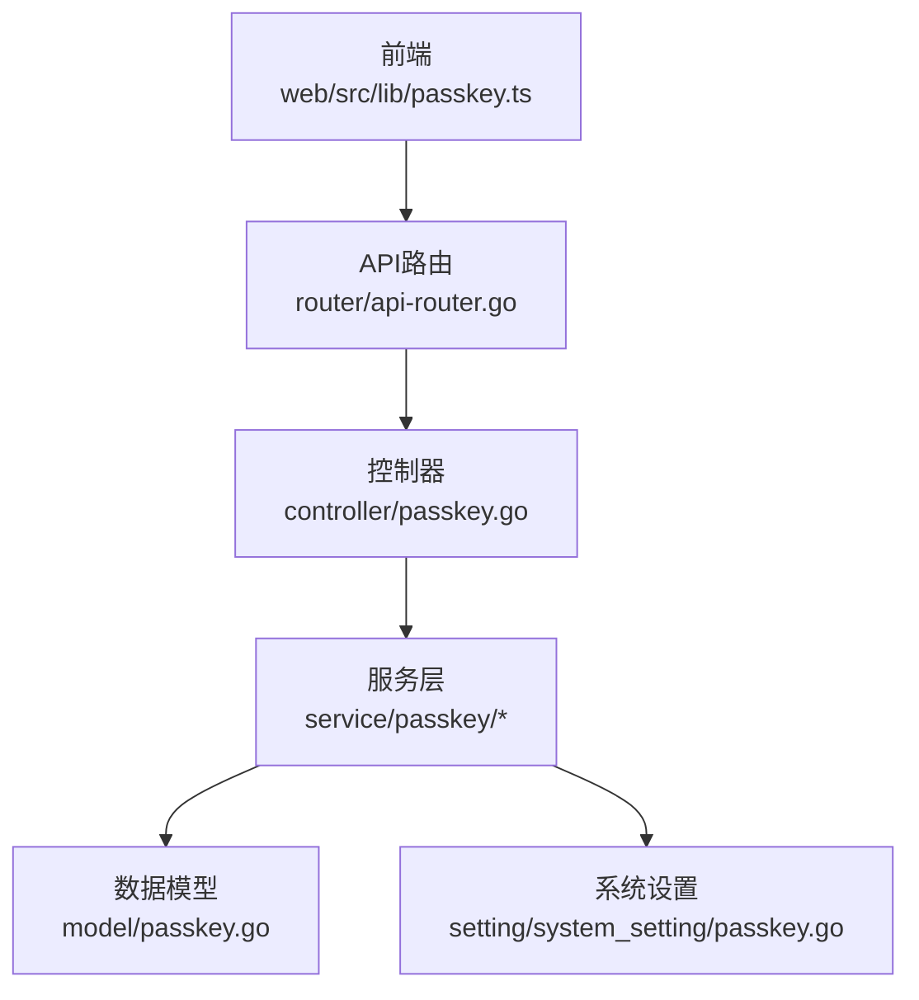
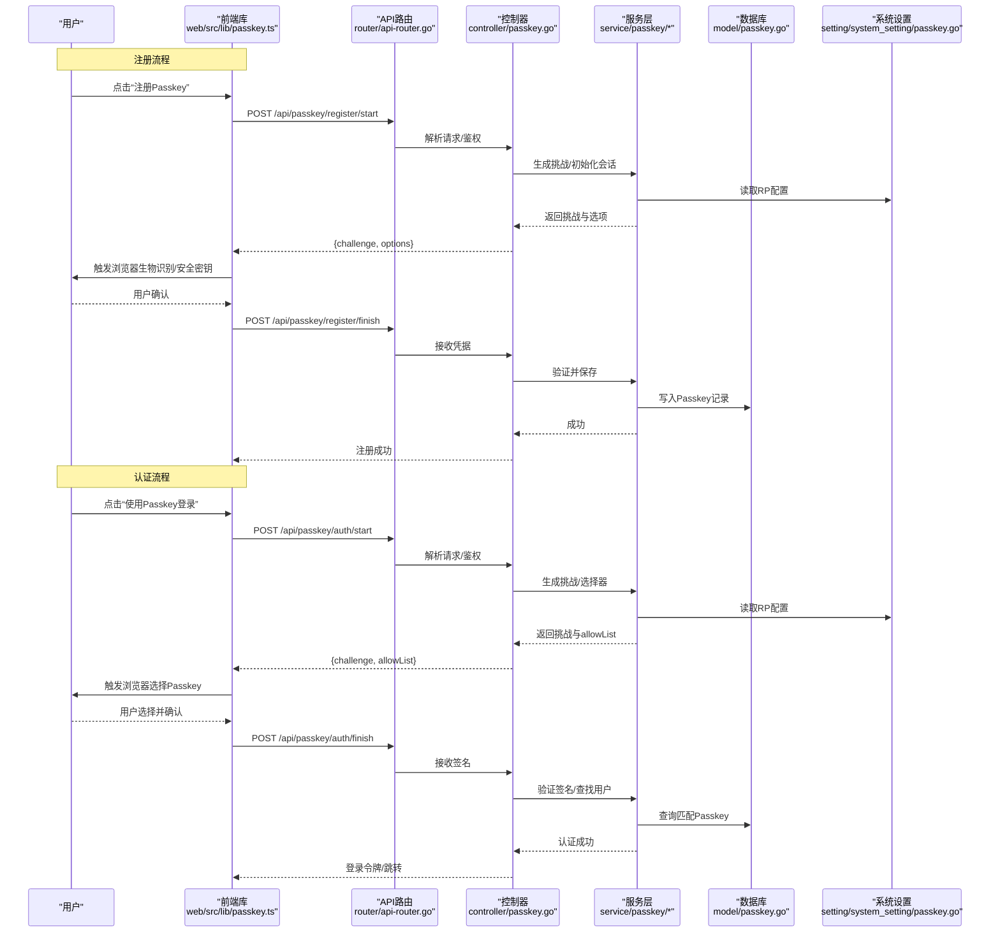
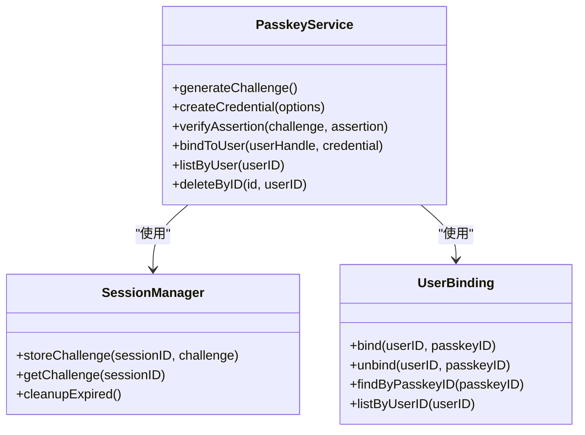
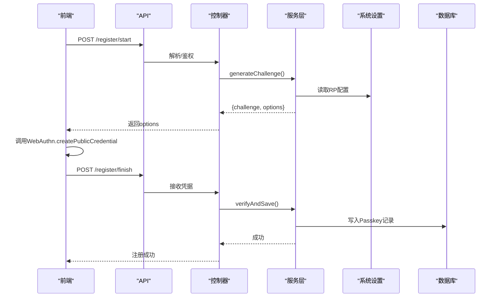
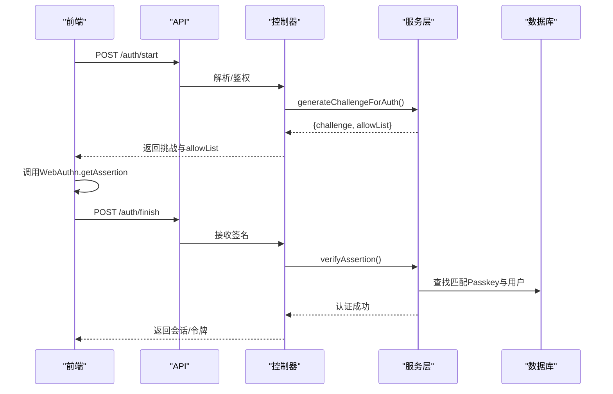
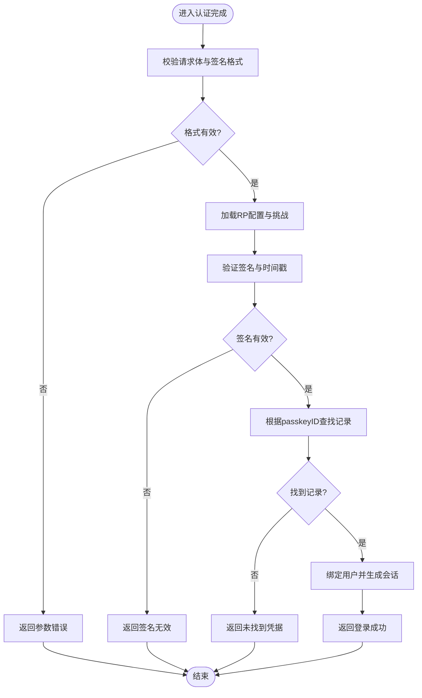
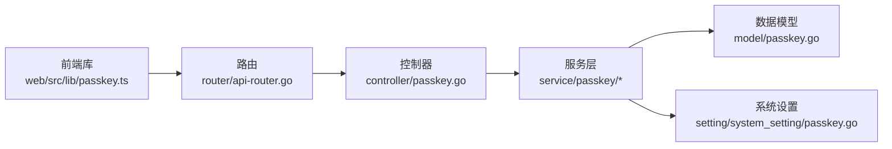

# Passkey支持

<cite>
**本文引用的文件**   
- [controller/passkey.go](file://controller/passkey.go)
- [model/passkey.go](file://model/passkey.go)
- [service/passkey/service.go](file://service/passkey/service.go)
- [service/passkey/session.go](file://service/passkey/session.go)
- [service/passkey/user.go](file://service/passkey/user.go)
- [setting/system_setting/passkey.go](file://setting/system_setting/passkey.go)
- [router/api-router.go](file://router/api-router.go)
- [web/src/lib/passkey.ts](file://web/src/lib/passkey.ts)
</cite>

## 目录
1. [简介](#简介)
2. [项目结构](#项目结构)
3. [核心组件](#核心组件)
4. [架构总览](#架构总览)
5. [详细组件分析](#详细组件分析)
6. [依赖关系分析](#依赖关系分析)
7. [性能考虑](#性能考虑)
8. [故障排查指南](#故障排查指南)
9. [结论](#结论)
10. [附录](#附录)

## 简介
本文件面向Passkey无密码认证系统的实现与使用，覆盖WebAuthn协议在系统中的落地方式、Passkey注册与认证流程、跨设备同步机制、配置项与浏览器/移动端兼容性要求，以及与传统密码认证的共存策略和安全优势。文档基于代码库中的控制器、服务层、数据模型、系统设置以及前端集成进行系统化说明，并提供流程图与时序图帮助理解关键路径。

## 项目结构
Passkey相关能力由后端控制器、服务层、数据模型、系统设置与前端库共同组成：
- 控制器层：提供HTTP接口，处理注册与认证请求的编排与校验。
- 服务层：封装WebAuthn会话管理、用户绑定与密钥操作逻辑。
- 数据模型：定义Passkey实体及其持久化字段。
- 系统设置：集中管理Passkey开关、RP标识、允许域名等配置。
- 前端库：调用WebAuthn API并与后端交互，完成注册与认证UI流程。

图表来源
- [router/api-router.go](file://router/api-router.go)
- [controller/passkey.go](file://controller/passkey.go)
- [service/passkey/service.go](file://service/passkey/service.go)
- [service/passkey/session.go](file://service/passkey/session.go)
- [service/passkey/user.go](file://service/passkey/user.go)
- [model/passkey.go](file://model/passkey.go)
- [setting/system_setting/passkey.go](file://setting/system_setting/passkey.go)
- [web/src/lib/passkey.ts](file://web/src/lib/passkey.ts)

章节来源
- [controller/passkey.go](file://controller/passkey.go)
- [model/passkey.go](file://model/passkey.go)
- [service/passkey/service.go](file://service/passkey/service.go)
- [service/passkey/session.go](file://service/passkey/session.go)
- [service/passkey/user.go](file://service/passkey/user.go)
- [setting/system_setting/passkey.go](file://setting/system_setting/passkey.go)
- [router/api-router.go](file://router/api-router.go)
- [web/src/lib/passkey.ts](file://web/src/lib/passkey.ts)

## 核心组件
- 控制器（passkey.go）：暴露注册、认证、列表、删除等REST接口；负责参数校验、会话上下文传递与响应组装。
- 服务层（service/passkey/*）：
  - service.go：协调WebAuthn挑战生成、凭据创建与验证、错误映射。
  - session.go：维护注册/认证过程中的临时状态（如challenge、userHandle、rpId）。
  - user.go：将Passkey与用户身份绑定、查询与清理。
- 数据模型（model/passkey.go）：存储Passkey ID、公钥、传输类型、用户关联等元数据。
- 系统设置（setting/system_setting/passkey.go）：控制是否启用Passkey、RP名称、RP ID、允许的origin/domain、超时策略等。
- 前端库（web/src/lib/passkey.ts）：封装navigator.credentials.*调用，发起注册与认证，并处理浏览器提示与结果回传。

章节来源
- [controller/passkey.go](file://controller/passkey.go)
- [service/passkey/service.go](file://service/passkey/service.go)
- [service/passkey/session.go](file://service/passkey/session.go)
- [service/passkey/user.go](file://service/passkey/user.go)
- [model/passkey.go](file://model/passkey.go)
- [setting/system_setting/passkey.go](file://setting/system_setting/passkey.go)
- [web/src/lib/passkey.ts](file://web/src/lib/passkey.ts)

## 架构总览
下图展示Passkey从前端到后端的端到端交互，包括注册与认证两条主路径。

图表来源
- [controller/passkey.go](file://controller/passkey.go)
- [service/passkey/service.go](file://service/passkey/service.go)
- [service/passkey/session.go](file://service/passkey/session.go)
- [service/passkey/user.go](file://service/passkey/user.go)
- [model/passkey.go](file://model/passkey.go)
- [setting/system_setting/passkey.go](file://setting/system_setting/passkey.go)
- [router/api-router.go](file://router/api-router.go)
- [web/src/lib/passkey.ts](file://web/src/lib/passkey.ts)

## 详细组件分析

### 控制器：Passkey接口编排
- 职责
  - 注册开始：生成挑战、构造WebAuthn选项、返回给前端。
  - 注册完成：接收凭据、校验格式、调用服务层保存。
  - 认证开始：生成挑战、返回allowList或空以触发自动选择。
  - 认证完成：接收签名、校验签名、定位用户、签发会话。
  - 列表与删除：列出用户已绑定的Passkey、按ID删除。
- 关键点
  - 严格校验请求体与上下文（用户身份、RP ID、Origin）。
  - 统一错误码与消息，便于前端提示。
  - 与中间件协作完成鉴权与审计。

章节来源
- [controller/passkey.go](file://controller/passkey.go)

### 服务层：WebAuthn会话与业务编排
- service.go
  - 组织挑战生成、凭据创建与验证的核心流程。
  - 根据系统设置注入RP ID、AllowedOrigins、超时等参数。
- session.go
  - 维护注册/认证阶段的临时状态，确保多步交互一致性。
  - 防止重放与状态错配（如challenge过期、userHandle不一致）。
- user.go
  - 将Passkey与用户绑定、解绑；查询用户已注册的Passkey列表。
  - 处理并发场景下的唯一性约束（同一用户下Passkey ID唯一）。

图表来源
- [service/passkey/service.go](file://service/passkey/service.go)
- [service/passkey/session.go](file://service/passkey/session.go)
- [service/passkey/user.go](file://service/passkey/user.go)

章节来源
- [service/passkey/service.go](file://service/passkey/service.go)
- [service/passkey/session.go](file://service/passkey/session.go)
- [service/passkey/user.go](file://service/passkey/user.go)

### 数据模型：Passkey实体
- 关键字段
  - 唯一标识：Passkey ID（Base64URL编码的PublicKeyCredential.id）
  - 用户关联：userID、userHandle
  - 公钥材料：publicKey（COSE或JWK形式）、transports（如internal、usb、ble、nfc）
  - 元数据：createdAt、updatedAt、status（启用/禁用）
- 约束与索引
  - (userID, passkeyID)唯一索引，避免重复绑定。
  - passkeyID唯一索引，用于快速查找。
  - status字段支持软删除与批量禁用。

章节来源
- [model/passkey.go](file://model/passkey.go)

### 系统设置：Passkey配置项
- 常见配置
  - 启用开关：是否允许Passkey认证。
  - RP标识：rpId、rpName、allowedOrigins/domains。
  - 超时与策略：挑战有效期、凭证创建超时、认证超时。
  - 传输限制：仅允许特定transports（如仅内部安全存储）。
  - 兼容模式：是否允许旧版浏览器降级为密码登录。
- 作用范围
  - 全局生效，影响所有用户的注册与认证行为。
  - 动态加载，支持运行时热更新。

章节来源
- [setting/system_setting/passkey.go](file://setting/system_setting/passkey.go)

### 前端集成：WebAuthn调用与UI
- 功能点
  - 注册：调用createPublicCredential，收集浏览器提示结果，提交后端。
  - 认证：调用getAssertion，携带allowList或空数组，提交后端。
  - 错误处理：区分用户取消、设备不支持、网络错误等。
  - UI集成：在登录页与账户设置中提供入口，显示已绑定Passkey列表。
- 兼容性
  - 检测navigator.credentials存在性与WebAuthn支持。
  - 对不支持的环境自动回退到密码登录。

章节来源
- [web/src/lib/passkey.ts](file://web/src/lib/passkey.ts)

### 注册流程时序

图表来源
- [controller/passkey.go](file://controller/passkey.go)
- [service/passkey/service.go](file://service/passkey/service.go)
- [setting/system_setting/passkey.go](file://setting/system_setting/passkey.go)
- [model/passkey.go](file://model/passkey.go)
- [web/src/lib/passkey.ts](file://web/src/lib/passkey.ts)

### 认证流程时序

图表来源
- [controller/passkey.go](file://controller/passkey.go)
- [service/passkey/service.go](file://service/passkey/service.go)
- [model/passkey.go](file://model/passkey.go)
- [web/src/lib/passkey.ts](file://web/src/lib/passkey.ts)

### 算法与校验流程（认证）

图表来源
- [controller/passkey.go](file://controller/passkey.go)
- [service/passkey/service.go](file://service/passkey/service.go)
- [model/passkey.go](file://model/passkey.go)

## 依赖关系分析
- 控制器依赖服务层，服务层依赖数据模型与系统设置。
- 前端通过标准WebAuthn API与后端REST接口交互。
- 路由层将HTTP请求分发至对应控制器方法。

图表来源
- [router/api-router.go](file://router/api-router.go)
- [controller/passkey.go](file://controller/passkey.go)
- [service/passkey/service.go](file://service/passkey/service.go)
- [service/passkey/session.go](file://service/passkey/session.go)
- [service/passkey/user.go](file://service/passkey/user.go)
- [model/passkey.go](file://model/passkey.go)
- [setting/system_setting/passkey.go](file://setting/system_setting/passkey.go)
- [web/src/lib/passkey.ts](file://web/src/lib/passkey.ts)

章节来源
- [router/api-router.go](file://router/api-router.go)
- [controller/passkey.go](file://controller/passkey.go)
- [service/passkey/service.go](file://service/passkey/service.go)
- [service/passkey/session.go](file://service/passkey/session.go)
- [service/passkey/user.go](file://service/passkey/user.go)
- [model/passkey.go](file://model/passkey.go)
- [setting/system_setting/passkey.go](file://setting/system_setting/passkey.go)
- [web/src/lib/passkey.ts](file://web/src/lib/passkey.ts)

## 性能考虑
- 挑战与签名计算开销较低，主要瓶颈在数据库I/O与并发锁。
- 建议优化点
  - 挑战缓存：短期缓存挑战以减少重复计算（注意安全性）。
  - 索引优化：为passkeyID与userID建立高效索引。
  - 连接池：合理配置数据库连接池大小与超时。
  - 限流：对注册与认证接口实施速率限制，防暴力攻击。
  - 异步任务：将非关键路径（如审计日志）异步化。

[本节为通用指导，不直接分析具体文件]

## 故障排查指南
- 常见问题
  - 浏览器不支持WebAuthn：检查navigator.credentials与WebAuthn可用性，回退到密码登录。
  - Origin/RP ID不匹配：确保后端RP配置与前端部署域名一致。
  - 挑战过期：前端需在有效期内完成注册/认证，必要时重新获取挑战。
  - 签名无效：检查客户端时间同步、私钥材料与服务器公钥一致性。
  - 重复绑定：确保同一用户下Passkey ID唯一，避免重复注册。
- 调试建议
  - 开启详细日志，记录挑战生成、凭据上传、签名验证过程。
  - 使用浏览器开发者工具查看WebAuthn调用栈与错误信息。
  - 校验系统设置中的AllowedOrigins与RP ID是否正确。

章节来源
- [controller/passkey.go](file://controller/passkey.go)
- [service/passkey/service.go](file://service/passkey/service.go)
- [setting/system_setting/passkey.go](file://setting/system_setting/passkey.go)
- [web/src/lib/passkey.ts](file://web/src/lib/passkey.ts)

## 结论
本系统通过控制器、服务层、数据模型与系统设置的协同，实现了完整的Passkey无密码认证能力。前端基于WebAuthn标准API与后端REST接口交互，支持注册、认证、列表与删除等完整生命周期。通过合理的配置与优化，可在保证安全性的同时提供良好的用户体验与性能表现。与传统密码认证并存，可平滑迁移并提升整体安全水位。

[本节为总结性内容，不直接分析具体文件]

## 附录
- 浏览器与移动端支持
  - 现代桌面与移动浏览器均支持WebAuthn，iOS Safari、Android Chrome/Edge等主流环境可用。
  - 对于不支持的环境，系统应自动回退到密码登录。
- 与传统密码认证共存
  - 用户可同时拥有密码与Passkey，登录时优先尝试Passkey，失败则回退密码。
  - 账户设置中提供切换与删除入口，便于用户管理。
- 启用、禁用与删除
  - 管理员可通过系统设置全局启用/禁用Passkey。
  - 用户可在账户设置中删除已绑定的Passkey，或禁用特定设备上的Passkey。
- 跨设备同步
  - Passkey由操作系统或硬件安全模块管理，支持云同步（如iCloud Keychain、Google Password Manager）。
  - 后端无需存储私钥，仅保存公钥与元数据，确保隐私与安全。

[本节为概念性说明，不直接分析具体文件]