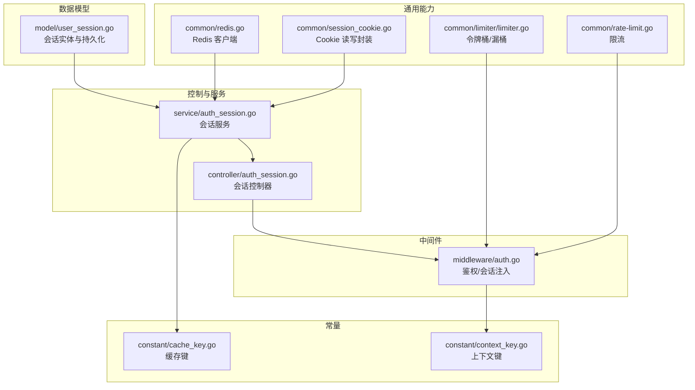
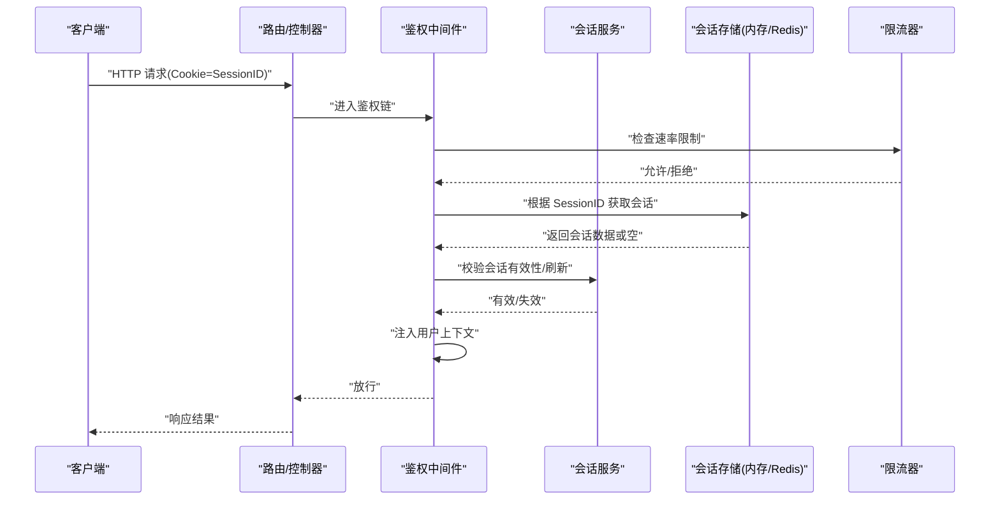
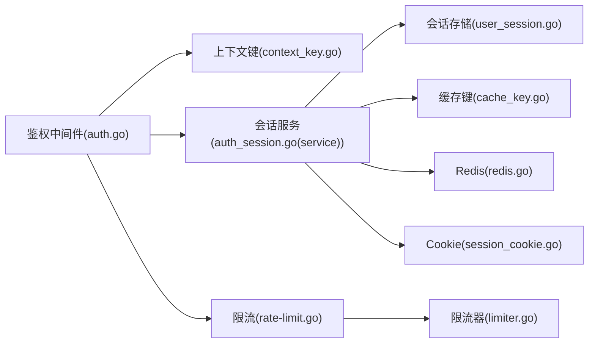

# 会话管理

<cite>
**本文引用的文件**   
- [session_cookie.go](file://common/session_cookie.go)
- [user_session.go](file://model/user_session.go)
- [auth_session.go](file://controller/auth_session.go)
- [auth_session.go](file://service/auth_session.go)
- [auth.go](file://middleware/auth.go)
- [redis.go](file://common/redis.go)
- [cache_key.go](file://constant/cache_key.go)
- [context_key.go](file://constant/context_key.go)
- [rate-limit.go](file://common/rate-limit.go)
- [limiter.go](file://common/limiter/limiter.go)
- [auth_flow_test.go](file://controller/auth_flow_test.go)
- [user_session_test.go](file://model/user_session_test.go)
- [auth_session_test.go](file://controller/auth_session_test.go)
</cite>

## 目录
1. [简介](#简介)
2. [项目结构](#项目结构)
3. [核心组件](#核心组件)
4. [架构总览](#架构总览)
5. [详细组件分析](#详细组件分析)
6. [依赖关系分析](#依赖关系分析)
7. [性能考量](#性能考量)
8. [故障排查指南](#故障排查指南)
9. [结论](#结论)
10. [附录](#附录)

## 简介
本文件面向会话管理系统，系统性阐述会话存储、Cookie 管理、会话安全与并发控制的实现细节。内容覆盖会话配置项、过期策略、清理机制、分布式支持（Redis），以及与认证流程、权限检查、多设备登录的关联关系。文档同时给出会话劫持防护、CSRF 保护与安全最佳实践建议，并附带来自实际代码库的路径引用，便于快速定位实现。

## 项目结构
会话相关能力横跨 common、model、controller、service、middleware、constant 等模块：
- common 层提供 Cookie 操作、限流器、Redis 客户端等通用工具
- model 层定义用户会话实体及持久化逻辑
- controller/service 层负责会话生命周期管理与业务编排
- middleware 层在请求链路中完成鉴权与会话上下文注入
- constant 层集中缓存键与上下文键常量

图表来源
- [session_cookie.go](file://common/session_cookie.go)
- [redis.go](file://common/redis.go)
- [rate-limit.go](file://common/rate-limit.go)
- [limiter.go](file://common/limiter/limiter.go)
- [user_session.go](file://model/user_session.go)
- [auth_session.go](file://service/auth_session.go)
- [auth_session.go](file://controller/auth_session.go)
- [auth.go](file://middleware/auth.go)
- [cache_key.go](file://constant/cache_key.go)
- [context_key.go](file://constant/context_key.go)

章节来源
- [session_cookie.go](file://common/session_cookie.go)
- [user_session.go](file://model/user_session.go)
- [auth_session.go](file://service/auth_session.go)
- [auth_session.go](file://controller/auth_session.go)
- [auth.go](file://middleware/auth.go)
- [redis.go](file://common/redis.go)
- [cache_key.go](file://constant/cache_key.go)
- [context_key.go](file://constant/context_key.go)

## 核心组件
- 会话 Cookie 管理：统一设置、读取、删除与属性配置（HttpOnly、SameSite、Secure、Domain、Path、MaxAge）
- 会话存储：本地内存或 Redis 后端，支持序列化与键命名空间隔离
- 会话服务：创建、刷新、校验、注销、查询、清理过期会话
- 鉴权中间件：从请求提取会话标识，加载用户上下文，执行权限校验
- 限流与并发控制：基于令牌桶/漏桶对敏感接口进行速率限制，防止暴力破解与会话枚举
- 常量与上下文：统一的缓存键与上下文键，避免硬编码冲突

章节来源
- [session_cookie.go](file://common/session_cookie.go)
- [user_session.go](file://model/user_session.go)
- [auth_session.go](file://service/auth_session.go)
- [auth_session.go](file://controller/auth_session.go)
- [auth.go](file://middleware/auth.go)
- [rate-limit.go](file://common/rate-limit.go)
- [limiter.go](file://common/limiter/limiter.go)
- [cache_key.go](file://constant/cache_key.go)
- [context_key.go](file://constant/context_key.go)

## 架构总览
下图展示一次受保护的 API 调用与会话管理的交互流程：中间件解析 Cookie，服务层校验会话并加载用户上下文，随后执行业务逻辑；必要时通过 Redis 做分布式一致性校验与限流。

图表来源
- [auth.go](file://middleware/auth.go)
- [auth_session.go](file://service/auth_session.go)
- [user_session.go](file://model/user_session.go)
- [redis.go](file://common/redis.go)
- [rate-limit.go](file://common/rate-limit.go)
- [limiter.go](file://common/limiter/limiter.go)

## 详细组件分析

### 会话 Cookie 管理
- 功能要点
  - 统一设置 Cookie 的属性：HttpOnly、SameSite、Secure、Domain、Path、MaxAge
  - 安全默认值：生产环境强制 Secure、HttpOnly，合理设置 SameSite 以缓解 CSRF
  - 支持按域与路径隔离，避免跨站点泄露
  - 提供删除 Cookie 的方法用于登出
- 关键实现位置
  - Cookie 封装与属性设置：[session_cookie.go](file://common/session_cookie.go)

章节来源
- [session_cookie.go](file://common/session_cookie.go)

### 会话存储与持久化
- 存储后端
  - 内存模式：进程内 Map，适合单机部署与开发调试
  - Redis 模式：分布式共享，支持 TTL、原子操作与高可用
- 数据结构
  - 会话实体包含：唯一标识、用户标识、元数据、过期时间、扩展字段
- 键命名与命名空间
  - 使用统一前缀与命名空间隔离不同环境/租户
- 关键实现位置
  - 会话实体与持久化：[user_session.go](file://model/user_session.go)
  - Redis 客户端封装：[redis.go](file://common/redis.go)
  - 缓存键常量：[cache_key.go](file://constant/cache_key.go)

章节来源
- [user_session.go](file://model/user_session.go)
- [redis.go](file://common/redis.go)
- [cache_key.go](file://constant/cache_key.go)

### 会话服务（创建、校验、刷新、注销、清理）
- 主要职责
  - 创建会话：生成唯一 ID，写入存储，设置 Cookie
  - 校验会话：检查存在性、有效期、绑定信息（如 IP/User-Agent）
  - 刷新会话：更新过期时间，延长活跃期
  - 注销会话：删除存储记录，清除 Cookie
  - 清理过期：定时任务扫描并删除过期会话
- 关键实现位置
  - 会话服务：[auth_session.go](file://service/auth_session.go)
  - 会话控制器：[auth_session.go](file://controller/auth_session.go)

章节来源
- [auth_session.go](file://service/auth_session.go)
- [auth_session.go](file://controller/auth_session.go)

### 鉴权中间件与会话注入
- 处理流程
  - 从请求头/Cookie 提取会话标识
  - 调用会话服务校验与会话加载
  - 将用户上下文注入到请求上下文
  - 结合权限系统执行访问控制
- 关键实现位置
  - 鉴权中间件：[auth.go](file://middleware/auth.go)
  - 上下文键常量：[context_key.go](file://constant/context_key.go)

章节来源
- [auth.go](file://middleware/auth.go)
- [context_key.go](file://constant/context_key.go)

### 并发控制与限流
- 目标
  - 防止暴力破解、会话枚举与资源耗尽
- 方案
  - 令牌桶/漏桶算法，按 IP/用户维度限流
  - 可配置窗口大小与速率阈值
- 关键实现位置
  - 通用限流：[rate-limit.go](file://common/rate-limit.go)
  - 限流器实现：[limiter.go](file://common/limiter/limiter.go)

章节来源
- [rate-limit.go](file://common/rate-limit.go)
- [limiter.go](file://common/limiter/limiter.go)

### 过期策略与清理机制
- 过期策略
  - 绝对过期：会话固定最大存活时间
  - 滑动过期：每次活跃刷新，延长有效期
  - 分级策略：管理员/普通用户不同过期时长
- 清理机制
  - 惰性清理：访问时检测并移除过期条目
  - 定时清理：后台任务周期性扫描并批量删除
- 关键实现位置
  - 会话实体与过期字段：[user_session.go](file://model/user_session.go)
  - 会话服务中的清理逻辑：[auth_session.go](file://service/auth_session.go)

章节来源
- [user_session.go](file://model/user_session.go)
- [auth_session.go](file://service/auth_session.go)

### 分布式支持与一致性
- 设计要点
  - 使用 Redis 作为共享存储，保证多实例一致
  - 键命名空间隔离，避免冲突
  - 原子操作保障并发安全（如 incr、setnx、expire）
- 关键实现位置
  - Redis 客户端：[redis.go](file://common/redis.go)
  - 缓存键常量：[cache_key.go](file://constant/cache_key.go)

章节来源
- [redis.go](file://common/redis.go)
- [cache_key.go](file://constant/cache_key.go)

### 与认证流程、权限检查、多设备登录的关系
- 认证流程
  - 登录成功后创建会话并下发 Cookie
  - 后续请求携带 Cookie，中间件自动恢复会话
- 权限检查
  - 会话中携带角色/权限信息，中间件或授权服务据此决策
- 多设备登录
  - 同一用户可拥有多个会话（不同设备/浏览器）
  - 支持按设备维度踢出或全局登出
- 关键实现位置
  - 会话控制器（登录/登出入口）：[auth_session.go](file://controller/auth_session.go)
  - 鉴权中间件（上下文注入与权限判断）：[auth.go](file://middleware/auth.go)

章节来源
- [auth_session.go](file://controller/auth_session.go)
- [auth.go](file://middleware/auth.go)

## 依赖关系分析
会话管理的关键依赖如下：
- 中间件依赖鉴权与上下文键
- 会话服务依赖存储（内存/Redis）与缓存键
- Cookie 管理为会话服务提供下发与读取能力
- 限流器保护敏感接口，降低攻击面

图表来源
- [auth.go](file://middleware/auth.go)
- [auth_session.go](file://service/auth_session.go)
- [user_session.go](file://model/user_session.go)
- [cache_key.go](file://constant/cache_key.go)
- [redis.go](file://common/redis.go)
- [session_cookie.go](file://common/session_cookie.go)
- [rate-limit.go](file://common/rate-limit.go)
- [limiter.go](file://common/limiter/limiter.go)

章节来源
- [auth.go](file://middleware/auth.go)
- [auth_session.go](file://service/auth_session.go)
- [user_session.go](file://model/user_session.go)
- [cache_key.go](file://constant/cache_key.go)
- [redis.go](file://common/redis.go)
- [session_cookie.go](file://common/session_cookie.go)
- [rate-limit.go](file://common/rate-limit.go)
- [limiter.go](file://common/limiter/limiter.go)

## 性能考量
- 存储选择
  - 单机低负载可使用内存存储，减少网络开销
  - 多实例/水平扩展必须使用 Redis，确保一致性
- 键设计与序列化
  - 精简会话载荷，避免大对象序列化
  - 合理命名空间与键长度，降低 Redis 内存占用
- 过期与清理
  - 优先惰性清理，配合定时清理兜底
  - 合理设置 TTL，避免频繁重建
- 限流与并发
  - 针对登录、验证码、重置密码等接口启用严格限流
  - 使用令牌桶平滑突发流量，避免雪崩

## 故障排查指南
- 常见问题
  - Cookie 未生效：检查 Secure/HttpOnly/SameSite/Domain/Path 配置
  - 会话丢失：确认 Redis 连接、键命名空间、TTL 设置
  - 鉴权失败：检查中间件顺序、上下文键是否被覆盖
  - 限流误伤：调整窗口大小与阈值，区分 IP/用户维度
- 定位方法
  - 查看鉴权中间件日志与会话加载结果
  - 检查 Redis 键是否存在与过期时间
  - 核对 Cookie 发送与接收情况
- 参考测试用例
  - 认证流程测试：[auth_flow_test.go](file://controller/auth_flow_test.go)
  - 会话模型测试：[user_session_test.go](file://model/user_session_test.go)
  - 会话控制器测试：[auth_session_test.go](file://controller/auth_session_test.go)

章节来源
- [auth_flow_test.go](file://controller/auth_flow_test.go)
- [user_session_test.go](file://model/user_session_test.go)
- [auth_session_test.go](file://controller/auth_session_test.go)

## 结论
本会话管理系统通过清晰的层次划分与模块化设计，实现了安全的 Cookie 管理、灵活的存储后端、完善的过期与清理策略、以及分布式一致性支持。鉴权中间件与会话服务协同工作，确保请求链路的安全与高效。配合限流与并发控制，系统在安全性与可用性之间取得良好平衡。建议在生产环境中启用 Redis、严格 Cookie 安全属性、合理的过期策略与严格的限流规则，并结合审计日志持续优化。

## 附录
- 安全最佳实践清单
  - 强制 HTTPS 与 Secure Cookie
  - 启用 HttpOnly 与合适的 SameSite
  - 会话绑定设备指纹（IP/User-Agent）并定期校验
  - 登录失败次数限制与账户锁定
  - 敏感操作二次验证（TOTP/短信/邮箱）
  - 最小权限原则与细粒度授权
  - 定期清理过期会话与审计日志归档
- 配置项建议
  - 会话超时：普通用户较短，管理员更长但需二次校验
  - 滑动过期：活跃刷新，非活跃尽快过期
  - 分布式：统一 Redis 集群与键命名空间
  - 限流：按 IP/用户维度，区分接口敏感度