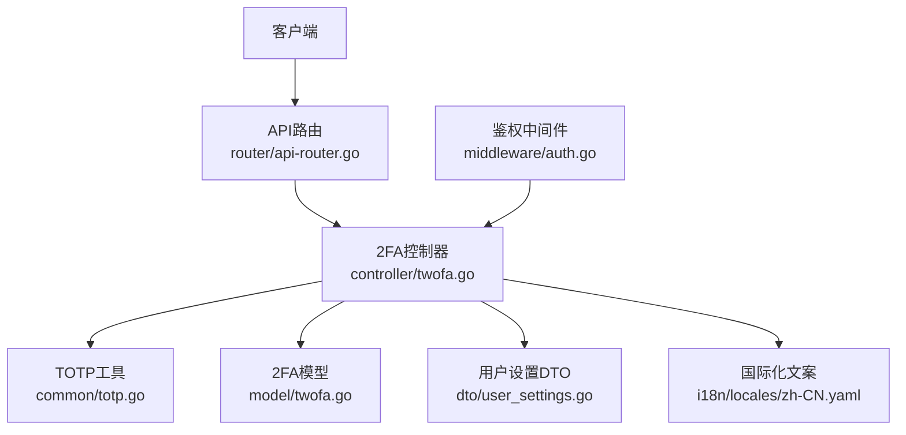
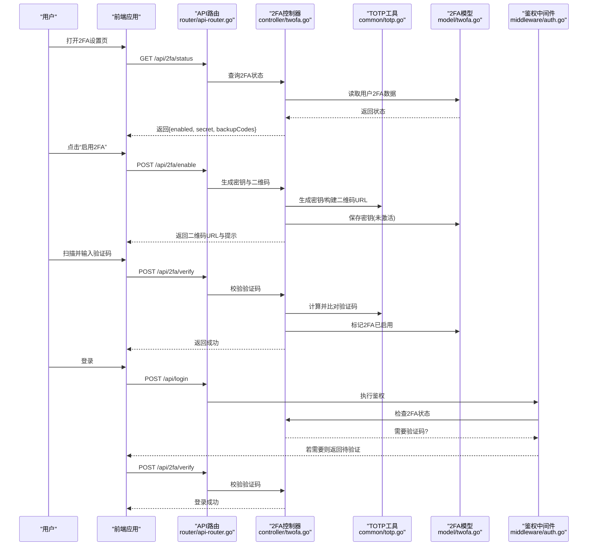
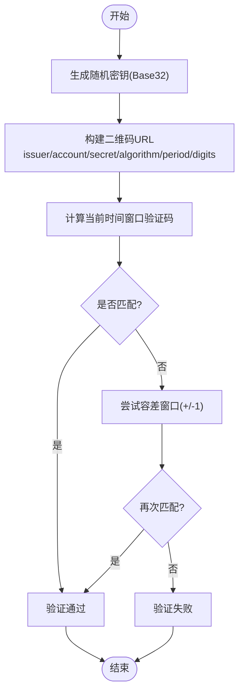
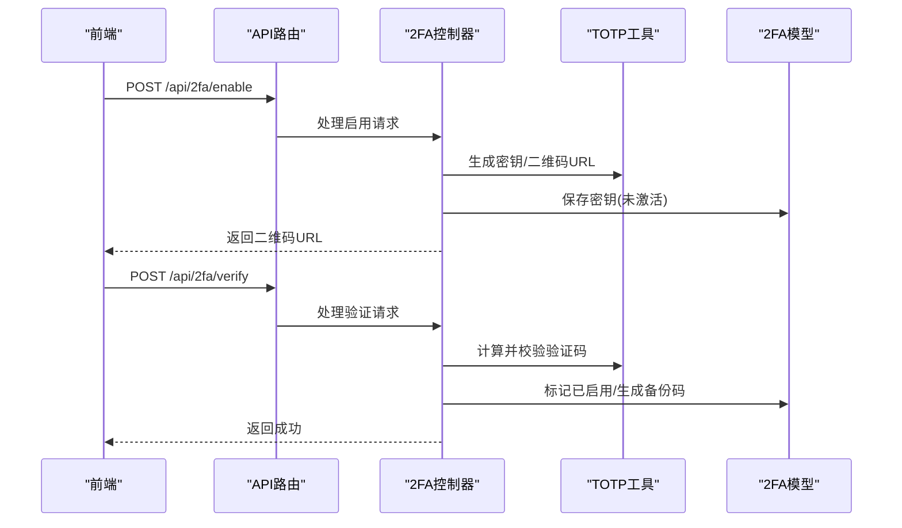
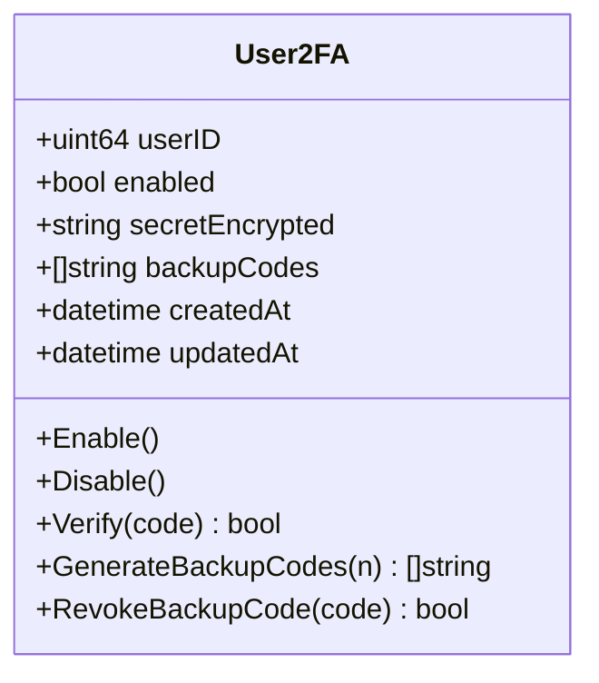
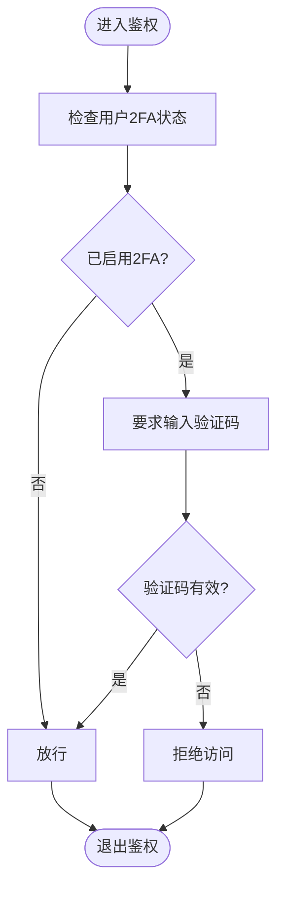
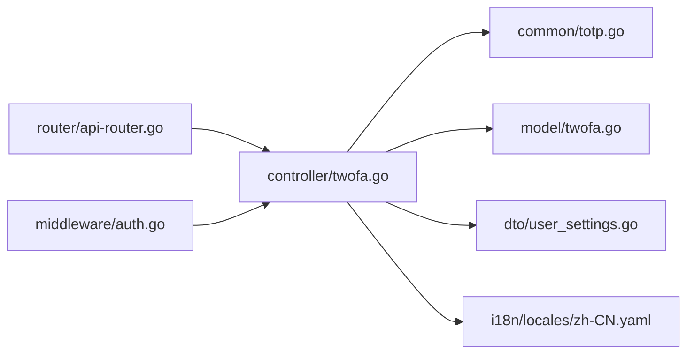

# 双因素认证

<cite>
**本文引用的文件**   
- [common/totp.go](file://common/totp.go)
- [controller/twofa.go](file://controller/twofa.go)
- [model/twofa.go](file://model/twofa.go)
- [router/api-router.go](file://router/api-router.go)
- [middleware/auth.go](file://middleware/auth.go)
- [dto/user_settings.go](file://dto/user_settings.go)
- [i18n/locales/zh-CN.yaml](file://i18n/locales/zh-CN.yaml)
</cite>

## 目录
1. [简介](#简介)
2. [项目结构](#项目结构)
3. [核心组件](#核心组件)
4. [架构总览](#架构总览)
5. [详细组件分析](#详细组件分析)
6. [依赖关系分析](#依赖关系分析)
7. [性能考虑](#性能考虑)
8. [故障排除指南](#故障排除指南)
9. [结论](#结论)
10. [附录](#附录)

## 简介
本文件面向双因素认证（2FA）子系统，聚焦于TOTP算法实现、二维码生成、验证码校验与备份码管理。文档基于代码库中的实际实现进行梳理，涵盖：
- TOTP密钥生成、二维码URL构建与验证流程
- 用户侧2FA配置流程、安全设置与恢复机制
- 登录流程中2FA的集成点与用户体验优化建议
- 时间同步问题定位与常见故障排查

## 项目结构
2FA相关能力分布在以下模块：
- common/totp.go：TOTP算法工具（密钥生成、二维码链接构造、验证码计算与校验）
- controller/twofa.go：2FA控制器（启用/禁用、绑定、校验、备份码管理）
- model/twofa.go：2FA数据模型（用户2FA状态、密钥、备份码等持久化）
- router/api-router.go：API路由注册（2FA相关接口）
- middleware/auth.go：鉴权中间件（2FA状态检查与拦截）
- dto/user_settings.go：用户设置DTO（2FA开关、备份码等字段）
- i18n/locales/zh-CN.yaml：国际化文案（错误提示、引导文案）

**图示来源** 
- [router/api-router.go](file://router/api-router.go)
- [controller/twofa.go](file://controller/twofa.go)
- [common/totp.go](file://common/totp.go)
- [model/twofa.go](file://model/twofa.go)
- [dto/user_settings.go](file://dto/user_settings.go)
- [middleware/auth.go](file://middleware/auth.go)
- [i18n/locales/zh-CN.yaml](file://i18n/locales/zh-CN.yaml)

**章节来源**
- [controller/twofa.go](file://controller/twofa.go)
- [common/totp.go](file://common/totp.go)
- [model/twofa.go](file://model/twofa.go)
- [router/api-router.go](file://router/api-router.go)
- [middleware/auth.go](file://middleware/auth.go)
- [dto/user_settings.go](file://dto/user_settings.go)
- [i18n/locales/zh-CN.yaml](file://i18n/locales/zh-CN.yaml)

## 核心组件
- TOTP工具（common/totp.go）
  - 负责生成随机密钥、构建TOTP二维码URL、计算并校验一次性验证码
  - 关键能力包括：密钥长度与编码、时间步长、哈希算法选择、容差窗口
- 2FA控制器（controller/twofa.go）
  - 提供启用/禁用2FA、绑定密钥、校验验证码、生成与下载备份码等接口
  - 与模型层交互完成持久化，返回前端所需的数据结构
- 2FA模型（model/twofa.go）
  - 定义用户2FA状态、密钥存储、备份码列表及元数据
  - 提供增删改查与一致性约束
- 鉴权中间件（middleware/auth.go）
  - 在登录或敏感操作前检查2FA状态，必要时要求输入验证码
- 用户设置DTO（dto/user_settings.go）
  - 承载2FA开关、备份码数量限制、二维码参数等前端展示与校验信息
- 国际化（i18n/locales/zh-CN.yaml）
  - 统一错误提示与引导文案，提升多语言体验

**章节来源**
- [common/totp.go](file://common/totp.go)
- [controller/twofa.go](file://controller/twofa.go)
- [model/twofa.go](file://model/twofa.go)
- [middleware/auth.go](file://middleware/auth.go)
- [dto/user_settings.go](file://dto/user_settings.go)
- [i18n/locales/zh-CN.yaml](file://i18n/locales/zh-CN.yaml)

## 架构总览
下图展示了从客户端到后端各层的调用关系，以及2FA在登录流程中的介入点。

**图示来源** 
- [router/api-router.go](file://router/api-router.go)
- [controller/twofa.go](file://controller/twofa.go)
- [common/totp.go](file://common/totp.go)
- [model/twofa.go](file://model/twofa.go)
- [middleware/auth.go](file://middleware/auth.go)

## 详细组件分析

### TOTP工具（common/totp.go）
- 职责
  - 生成符合RFC 6238的TOTP密钥（通常为Base32编码）
  - 构建标准TOTP二维码URL（包含issuer、account、secret、algorithm、period、digits等）
  - 计算当前时间窗口的验证码，并提供带容差的校验方法
- 关键点
  - 时间步长（默认30秒）与哈希算法（HMAC-SHA1）
  - 验证码位数（通常6位）
  - 容差窗口（允许前后一个时间片，缓解时间同步偏差）
  - 密钥安全性（随机源、长度、存储加密）

**图示来源** 
- [common/totp.go](file://common/totp.go)

**章节来源**
- [common/totp.go](file://common/totp.go)

### 2FA控制器（controller/twofa.go）
- 职责
  - 暴露REST接口：获取状态、启用、验证、禁用、备份码生成与下载
  - 协调TOTP工具与模型层，确保状态一致性与事务性
  - 返回前端所需的结构化响应（含二维码URL、提示信息）
- 典型流程
  - 启用2FA：生成密钥→保存临时密钥→返回二维码URL→等待用户验证
  - 验证验证码：校验输入→更新状态为已启用→生成备份码（可选）
  - 禁用2FA：清除密钥→重置状态
  - 备份码管理：批量生成、下载、失效策略

**图示来源** 
- [controller/twofa.go](file://controller/twofa.go)
- [common/totp.go](file://common/totp.go)
- [model/twofa.go](file://model/twofa.go)

**章节来源**
- [controller/twofa.go](file://controller/twofa.go)

### 2FA模型（model/twofa.go）
- 职责
  - 定义用户2FA实体：状态标志、密钥密文、备份码数组、创建/更新时间
  - 提供CRUD方法与约束（如唯一性、非空校验、备份码数量上限）
- 设计要点
  - 密钥存储需加密（结合系统加密工具）
  - 备份码应一次性使用且可审计
  - 状态变更需原子性，避免并发导致不一致

**图示来源** 
- [model/twofa.go](file://model/twofa.go)

**章节来源**
- [model/twofa.go](file://model/twofa.go)

### 鉴权中间件（middleware/auth.go）
- 职责
  - 在登录或敏感操作前检查用户2FA状态
  - 若已启用2FA，则要求输入验证码；否则放行
- 集成方式
  - 在认证流程中插入2FA检查节点
  - 根据状态返回不同响应（继续登录/要求验证码）

**图示来源** 
- [middleware/auth.go](file://middleware/auth.go)

**章节来源**
- [middleware/auth.go](file://middleware/auth.go)

### 用户设置DTO（dto/user_settings.go）
- 职责
  - 定义前端展示的2FA相关字段：开关、二维码参数、备份码数量限制
  - 用于请求体与响应体的序列化/反序列化
- 设计要点
  - 字段校验（如备份码数量范围）
  - 与国际化文案联动显示友好提示

**章节来源**
- [dto/user_settings.go](file://dto/user_settings.go)

### 国际化文案（i18n/locales/zh-CN.yaml）
- 职责
  - 提供2FA相关错误提示、引导文案（如“请扫描二维码”、“验证码无效”）
- 设计要点
  - 文案清晰、可操作，便于前端直接渲染

**章节来源**
- [i18n/locales/zh-CN.yaml](file://i18n/locales/zh-CN.yaml)

## 依赖关系分析
2FA子系统的依赖关系如下：
- 控制器依赖工具与模型
- 中间件依赖控制器提供的状态查询
- 路由将HTTP请求分发至控制器
- DTO与I18N作为横切关注点支撑前后端交互

**图示来源** 
- [router/api-router.go](file://router/api-router.go)
- [controller/twofa.go](file://controller/twofa.go)
- [common/totp.go](file://common/totp.go)
- [model/twofa.go](file://model/twofa.go)
- [dto/user_settings.go](file://dto/user_settings.go)
- [i18n/locales/zh-CN.yaml](file://i18n/locales/zh-CN.yaml)
- [middleware/auth.go](file://middleware/auth.go)

**章节来源**
- [router/api-router.go](file://router/api-router.go)
- [controller/twofa.go](file://controller/twofa.go)
- [common/totp.go](file://common/totp.go)
- [model/twofa.go](file://model/twofa.go)
- [dto/user_settings.go](file://dto/user_settings.go)
- [i18n/locales/zh-CN.yaml](file://i18n/locales/zh-CN.yaml)
- [middleware/auth.go](file://middleware/auth.go)

## 性能考虑
- TOTP计算开销低，但应避免在高并发路径上重复生成密钥或二维码
- 验证码校验建议使用短时缓存减少重复计算
- 备份码生成与下载应限制频率，防止滥用
- 数据库写入（启用/禁用）需加锁或事务保证一致性

[本节为通用指导，不直接分析具体文件]

## 故障排除指南
常见问题与解决思路：
- 验证码始终无效
  - 检查设备时间是否与服务器同步（误差超过时间步长会导致失败）
  - 确认TOTP算法、位数、时间步长配置一致
  - 查看容差窗口是否开启
- 无法生成二维码
  - 检查密钥生成逻辑与Base32编码
  - 确认二维码URL参数完整（issuer、account、secret等）
- 备份码无法使用
  - 确认备份码未被使用或过期
  - 检查备份码列表完整性与去重逻辑
- 登录流程卡在2FA验证
  - 检查中间件是否正确判断2FA状态
  - 确认前端正确传递验证码与用户会话

**章节来源**
- [common/totp.go](file://common/totp.go)
- [controller/twofa.go](file://controller/twofa.go)
- [middleware/auth.go](file://middleware/auth.go)

## 结论
本2FA子系统以TOTP为核心，结合控制器、模型与中间件实现了完整的启用、验证与恢复流程。通过清晰的依赖关系与可扩展的设计，能够稳定集成到现有登录流程中。建议在部署时重点关注时间同步、密钥安全与备份码管理，以提升用户体验与系统安全性。

[本节为总结性内容，不直接分析具体文件]

## 附录
- TOTP标准参考：RFC 6238
- 常见TOTP应用：Google Authenticator、Microsoft Authenticator、Authy等
- 最佳实践：
  - 强制时间同步（NTP）
  - 密钥加密存储
  - 备份码一次性使用与审计
  - 友好的错误提示与重试机制

[本节为补充信息，不直接分析具体文件]