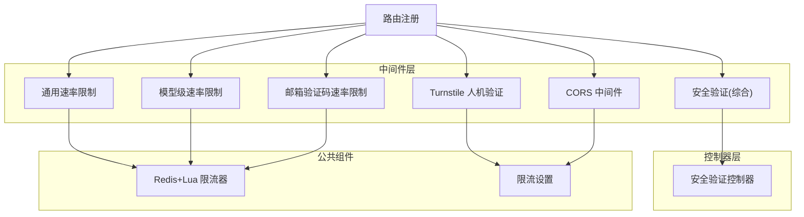
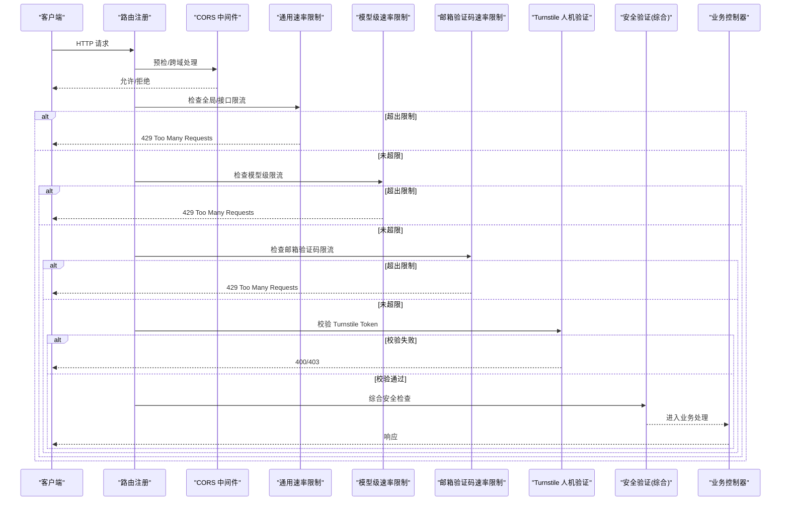
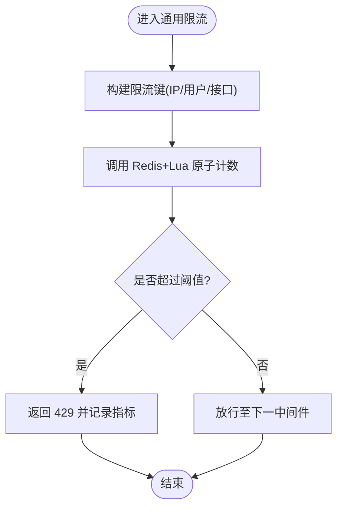
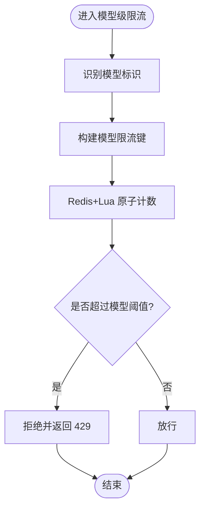
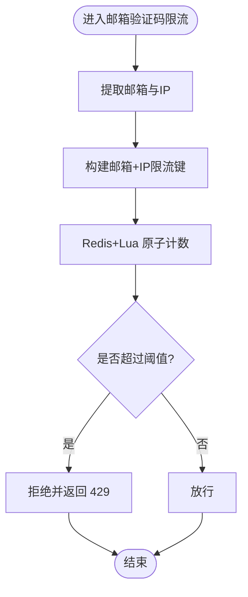
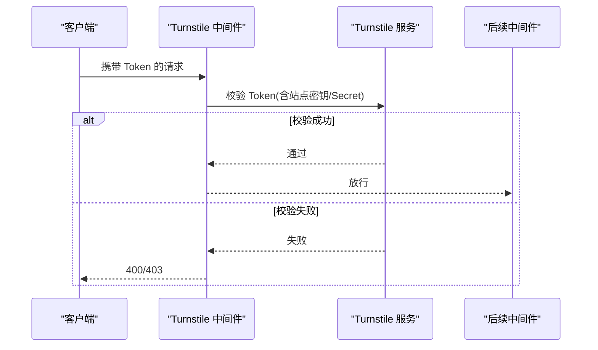
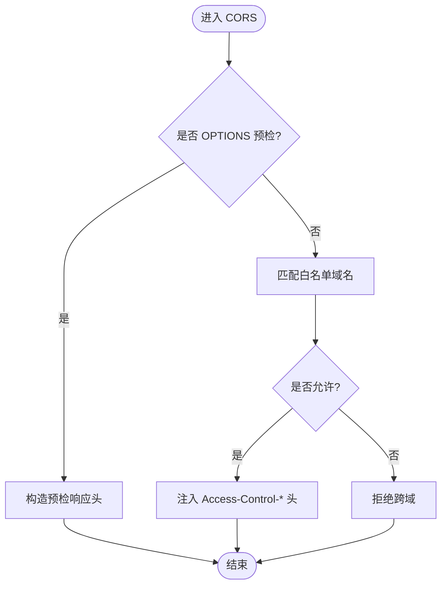
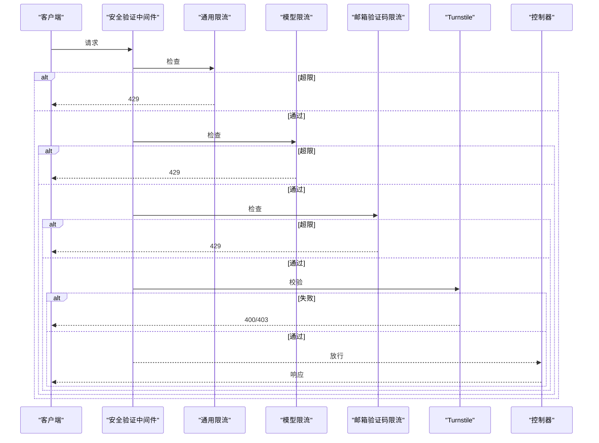
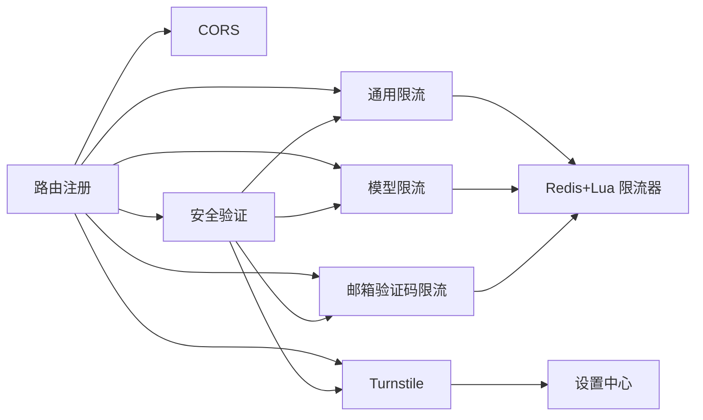

# 安全中间件

<cite>
**本文引用的文件**   
- [main.go](file://main.go)
- [middleware/secure_verification.go](file://middleware/secure_verification.go)
- [middleware/turnstile-check.go](file://middleware/turnstile-check.go)
- [middleware/rate-limit.go](file://middleware/rate-limit.go)
- [middleware/model-rate-limit.go](file://middleware/model-rate-limit.go)
- [middleware/email-verification-rate-limit.go](file://middleware/email-verification-rate-limit.go)
- [middleware/cors.go](file://middleware/cors.go)
- [common/limiter/limiter.go](file://common/limiter/limiter.go)
- [common/limiter/lua/rate_limit.lua](file://common/limiter/lua/rate_limit.lua)
- [setting/rate_limit.go](file://setting/rate_limit.go)
- [controller/secure_verification.go](file://controller/secure_verification.go)
- [router/main.go](file://router/main.go)
</cite>

## 目录
1. [简介](#简介)
2. [项目结构](#项目结构)
3. [核心组件](#核心组件)
4. [架构总览](#架构总览)
5. [详细组件分析](#详细组件分析)
6. [依赖关系分析](#依赖关系分析)
7. [性能考量](#性能考量)
8. [故障排查指南](#故障排查指南)
9. [结论](#结论)
10. [附录](#附录)

## 简介
本文件面向安全中间件系统，系统性阐述以下能力与实现细节：
- 安全验证（含人机验证 Turnstile 集成）
- 速率限制（全局、模型级、邮箱验证码等维度）
- 跨域请求处理（CORS）
- 执行顺序、错误处理、配置项与调试方法
- 防刷策略与安全监控

目标读者包括后端开发者、运维人员与安全审计人员。文档以仓库实际代码为依据，提供可追溯的源码路径与可视化图示，帮助快速定位问题与优化性能。

## 项目结构
安全相关能力主要分布在以下模块：
- 中间件层：统一拦截请求，执行鉴权、限流、人机验证、CORS 等横切逻辑
- 控制器层：提供人机验证结果校验接口
- 公共限流器：基于 Redis/Lua 的高并发限流实现
- 设置中心：集中管理限流策略、Turnstile 参数、CORS 白名单等
- 路由注册：将中间件按顺序挂载到不同路由组

**图表来源** 
- [router/main.go](file://router/main.go)
- [middleware/cors.go](file://middleware/cors.go)
- [middleware/rate-limit.go](file://middleware/rate-limit.go)
- [middleware/model-rate-limit.go](file://middleware/model-rate-limit.go)
- [middleware/email-verification-rate-limit.go](file://middleware/email-verification-rate-limit.go)
- [middleware/turnstile-check.go](file://middleware/turnstile-check.go)
- [middleware/secure_verification.go](file://middleware/secure_verification.go)
- [controller/secure_verification.go](file://controller/secure_verification.go)
- [common/limiter/limiter.go](file://common/limiter/limiter.go)
- [setting/rate_limit.go](file://setting/rate_limit.go)

**章节来源**
- [router/main.go](file://router/main.go)

## 核心组件
- 通用速率限制：基于 Redis + Lua 原子计数，支持按 IP、用户、接口等维度限流
- 模型级速率限制：针对具体模型/渠道进行更细粒度的流量控制
- 邮箱验证码速率限制：防止短信/邮件轰炸
- Turnstile 人机验证：服务端校验前端提交的 Turnstile Token，抵御自动化攻击
- CORS：按域名白名单与请求头策略放行跨域请求
- 安全验证：聚合上述能力，统一入口与错误码

**章节来源**
- [common/limiter/limiter.go](file://common/limiter/limiter.go)
- [common/limiter/lua/rate_limit.lua](file://common/limiter/lua/rate_limit.lua)
- [middleware/rate-limit.go](file://middleware/rate-limit.go)
- [middleware/model-rate-limit.go](file://middleware/model-rate-limit.go)
- [middleware/email-verification-rate-limit.go](file://middleware/email-verification-rate-limit.go)
- [middleware/turnstile-check.go](file://middleware/turnstile-check.go)
- [middleware/cors.go](file://middleware/cors.go)
- [middleware/secure_verification.go](file://middleware/secure_verification.go)

## 架构总览
下图展示一次典型请求在中间件链中的流转过程，以及各组件的职责边界与交互点。

**图表来源** 
- [router/main.go](file://router/main.go)
- [middleware/cors.go](file://middleware/cors.go)
- [middleware/rate-limit.go](file://middleware/rate-limit.go)
- [middleware/model-rate-limit.go](file://middleware/model-rate-limit.go)
- [middleware/email-verification-rate-limit.go](file://middleware/email-verification-rate-limit.go)
- [middleware/turnstile-check.go](file://middleware/turnstile-check.go)
- [middleware/secure_verification.go](file://middleware/secure_verification.go)

## 详细组件分析

### 通用速率限制（IP/接口/用户维度）
- 功能要点
  - 基于 Redis + Lua 原子操作，保证高并发下的计数准确性
  - 支持按 IP、用户标识、接口路径等多键组合限流
  - 可配置窗口大小、最大请求数、是否返回标准 429 响应
- 关键流程
  - 解析请求上下文，生成限流键
  - 调用公共限流器进行原子计数
  - 根据阈值决定是否放行或返回 429
- 配置项
  - 窗口时间、最大请求数、键前缀、Redis 连接信息
- 错误处理
  - Redis 不可用时的降级策略（默认放行或记录告警）
  - 标准化错误码与消息体

**图表来源** 
- [common/limiter/limiter.go](file://common/limiter/limiter.go)
- [common/limiter/lua/rate_limit.lua](file://common/limiter/lua/rate_limit.lua)
- [middleware/rate-limit.go](file://middleware/rate-limit.go)

**章节来源**
- [common/limiter/limiter.go](file://common/limiter/limiter.go)
- [common/limiter/lua/rate_limit.lua](file://common/limiter/lua/rate_limit.lua)
- [middleware/rate-limit.go](file://middleware/rate-limit.go)
- [setting/rate_limit.go](file://setting/rate_limit.go)

### 模型级速率限制
- 功能要点
  - 针对特定模型/渠道独立限流，避免热点模型打满整体配额
  - 可与通用限流叠加使用，形成“全局 + 局部”双重保护
- 关键流程
  - 从请求中识别模型标识
  - 使用模型键查询 Redis 计数
  - 达到阈值则拒绝请求并记录审计日志
- 配置项
  - 模型级阈值、滑动窗口、键空间隔离策略

**图表来源** 
- [middleware/model-rate-limit.go](file://middleware/model-rate-limit.go)
- [common/limiter/limiter.go](file://common/limiter/limiter.go)

**章节来源**
- [middleware/model-rate-limit.go](file://middleware/model-rate-limit.go)
- [setting/rate_limit.go](file://setting/rate_limit.go)

### 邮箱验证码速率限制
- 功能要点
  - 针对邮箱验证码接口进行严格限流，防止暴力破解与资源耗尽
  - 支持按邮箱地址与 IP 双维度限流
- 关键流程
  - 提取邮箱与 IP
  - 计算窗口内发送次数
  - 超过阈值直接拒绝，未超过则放行
- 配置项
  - 窗口时长、最大发送次数、键命名空间

**图表来源** 
- [middleware/email-verification-rate-limit.go](file://middleware/email-verification-rate-limit.go)
- [common/limiter/limiter.go](file://common/limiter/limiter.go)

**章节来源**
- [middleware/email-verification-rate-limit.go](file://middleware/email-verification-rate-limit.go)
- [setting/rate_limit.go](file://setting/rate_limit.go)

### Turnstile 人机验证
- 功能要点
  - 服务端校验前端提交的 Turnstile Token，结合站点密钥与客户端指纹
  - 支持自定义失败策略（直接拒绝或降级为软校验）
- 关键流程
  - 从请求头或表单获取 Token
  - 调用 Turnstile 服务端 API 校验
  - 根据结果决定放行或拒绝
- 配置项
  - 站点密钥、Secret Key、超时时间、信任代理、失败策略

**图表来源** 
- [middleware/turnstile-check.go](file://middleware/turnstile-check.go)

**章节来源**
- [middleware/turnstile-check.go](file://middleware/turnstile-check.go)
- [setting/rate_limit.go](file://setting/rate_limit.go)

### 跨域请求处理（CORS）
- 功能要点
  - 按白名单域名放行 Access-Control-* 头
  - 支持预检请求（OPTIONS）快速响应
  - 可配置允许的 Header、方法、凭据与缓存时长
- 关键流程
  - 判断是否为预检请求
  - 匹配白名单域名与请求头
  - 注入响应头并放行

**图表来源** 
- [middleware/cors.go](file://middleware/cors.go)

**章节来源**
- [middleware/cors.go](file://middleware/cors.go)
- [setting/rate_limit.go](file://setting/rate_limit.go)

### 安全验证（综合）
- 功能要点
  - 聚合通用限流、模型限流、邮箱验证码限流、Turnstile 校验
  - 统一错误码与审计日志，便于安全监控
- 关键流程
  - 依次执行各项安全检查
  - 任一失败即中断并返回标准错误
  - 成功后进入业务控制器

**图表来源** 
- [middleware/secure_verification.go](file://middleware/secure_verification.go)
- [controller/secure_verification.go](file://controller/secure_verification.go)

**章节来源**
- [middleware/secure_verification.go](file://middleware/secure_verification.go)
- [controller/secure_verification.go](file://controller/secure_verification.go)

## 依赖关系分析
- 中间件对公共限流器的强依赖：所有速率限制均通过 Redis + Lua 原子计数，确保一致性
- 设置中心集中化：限流阈值、Turnstile 密钥、CORS 白名单等均在设置模块统一管理
- 路由注册串联中间件：按顺序挂载，影响执行顺序与性能

**图表来源** 
- [router/main.go](file://router/main.go)
- [common/limiter/limiter.go](file://common/limiter/limiter.go)
- [setting/rate_limit.go](file://setting/rate_limit.go)

**章节来源**
- [router/main.go](file://router/main.go)
- [common/limiter/limiter.go](file://common/limiter/limiter.go)
- [setting/rate_limit.go](file://setting/rate_limit.go)

## 性能考量
- 限流器采用 Redis + Lua 原子脚本，减少网络往返与竞态条件
- 建议开启连接池与合理的超时配置，降低 Redis 压力
- 对于热点模型与高频接口，优先启用模型级限流，避免全局瓶颈
- Turnstile 校验存在外部网络开销，建议合理设置超时与重试策略
- CORS 预检请求应缓存响应头，减少重复校验

[本节为通用指导，不直接分析具体文件]

## 故障排查指南
- 常见错误码
  - 429：触发限流（检查限流阈值与键空间）
  - 400/403：Turnstile 校验失败（检查站点密钥、Token 有效性、客户端指纹）
  - 跨域被拒：检查白名单域名与请求头
- 诊断步骤
  - 查看中间件日志与审计记录，确认命中哪一层
  - 检查 Redis 连接状态与 Lua 脚本执行情况
  - 核对设置中心的阈值与白名单配置
  - 对 Turnstile 进行离线校验与模拟测试
- 调试技巧
  - 临时放宽阈值以复现问题
  - 增加请求 ID 追踪，关联上下游日志
  - 使用压测工具验证限流效果与延迟

**章节来源**
- [middleware/rate-limit.go](file://middleware/rate-limit.go)
- [middleware/model-rate-limit.go](file://middleware/model-rate-limit.go)
- [middleware/email-verification-rate-limit.go](file://middleware/email-verification-rate-limit.go)
- [middleware/turnstile-check.go](file://middleware/turnstile-check.go)
- [middleware/cors.go](file://middleware/cors.go)
- [middleware/secure_verification.go](file://middleware/secure_verification.go)

## 结论
本安全中间件体系通过分层限流、人机验证与跨域控制，构建了从入口到业务的完整防护链。借助 Redis + Lua 的高并发能力与集中式设置管理，系统在安全性与性能之间取得平衡。建议在生产环境持续监控限流命中率、Turnstile 失败率与跨域拒绝比例，并结合业务特征动态调整阈值与策略。

[本节为总结性内容，不直接分析具体文件]

## 附录
- 配置项速查
  - 通用限流：窗口时长、最大请求数、键前缀、Redis 连接
  - 模型限流：模型阈值、键空间隔离
  - 邮箱验证码限流：窗口时长、最大发送次数
  - Turnstile：站点密钥、Secret Key、超时、失败策略
  - CORS：白名单域名、允许头与方法、凭据、缓存时长
- 最佳实践
  - 热点接口优先启用模型级限流
  - Turnstile 失败时记录审计日志并告警
  - 定期审查 CORS 白名单，最小权限原则
  - 压测验证限流阈值与 Redis 负载

[本节为补充信息，不直接分析具体文件]