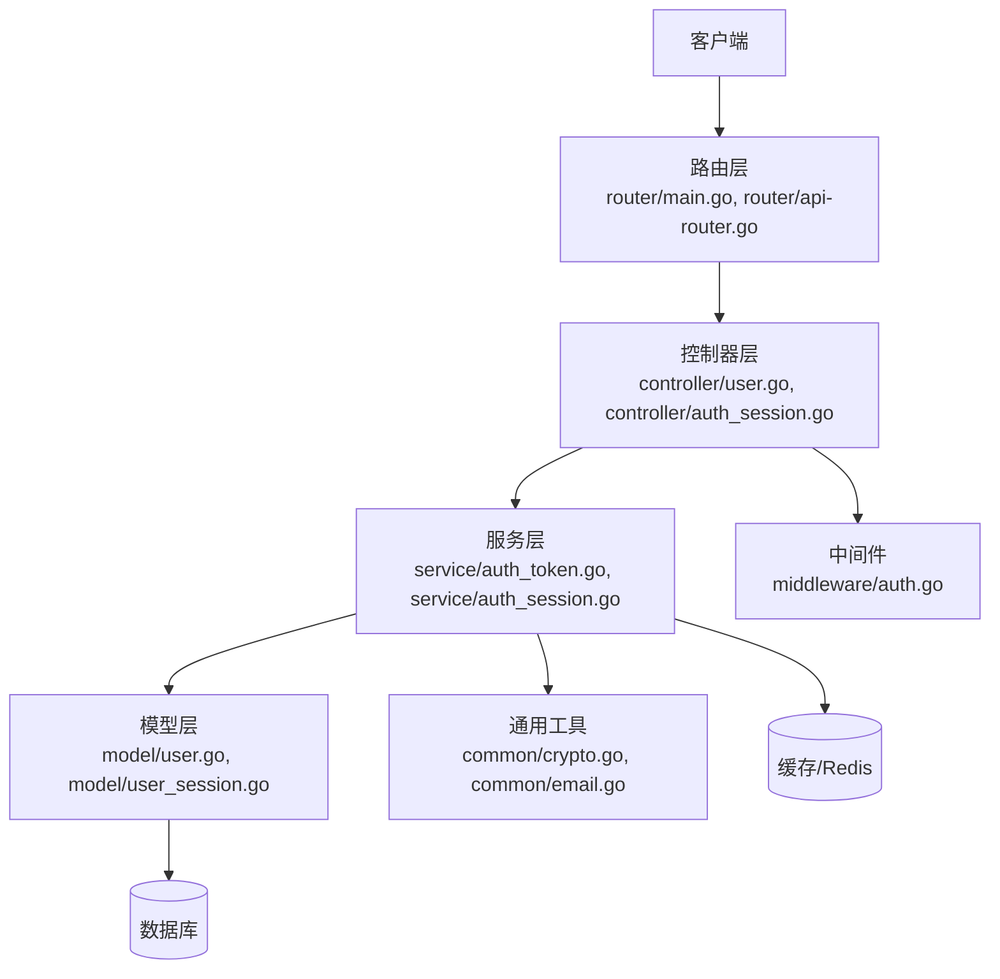
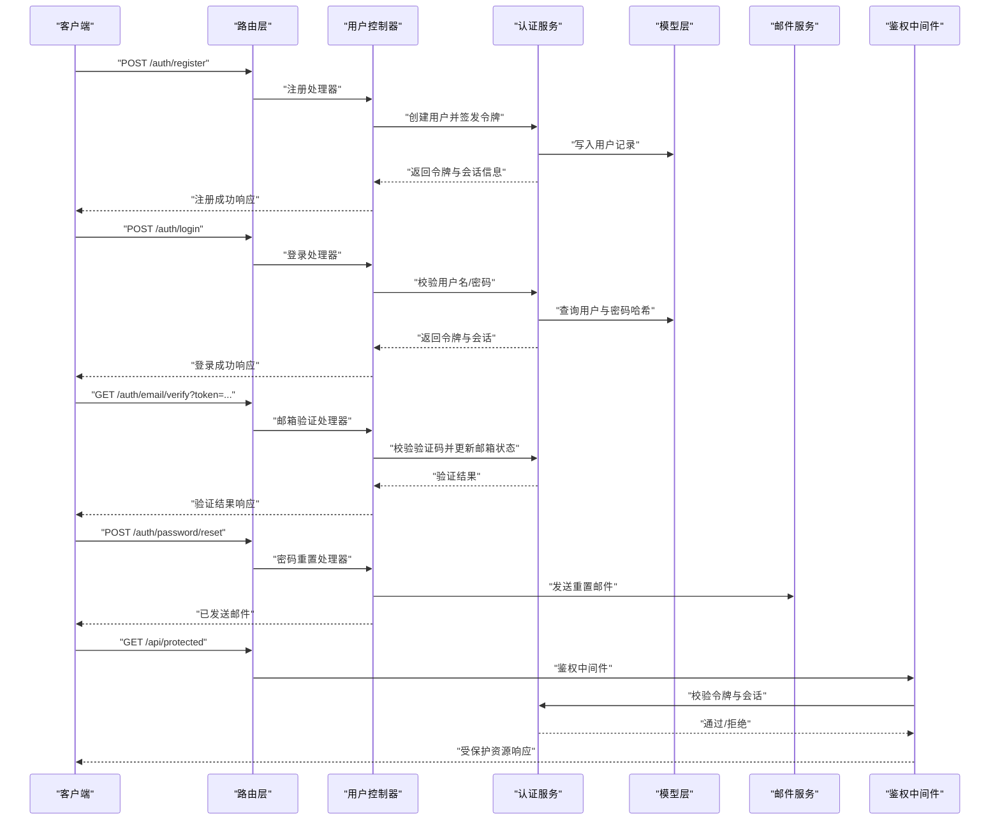
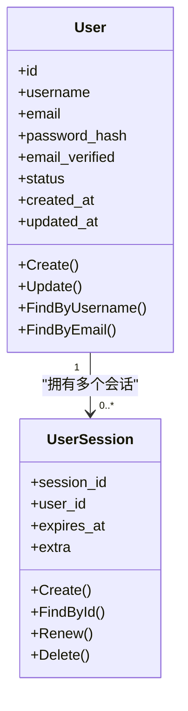
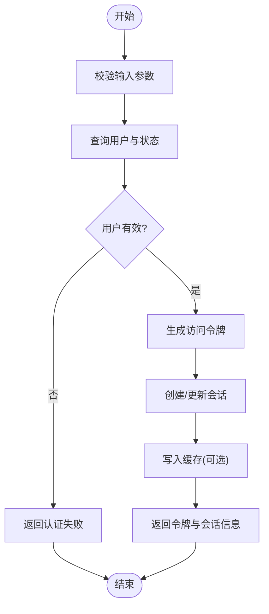
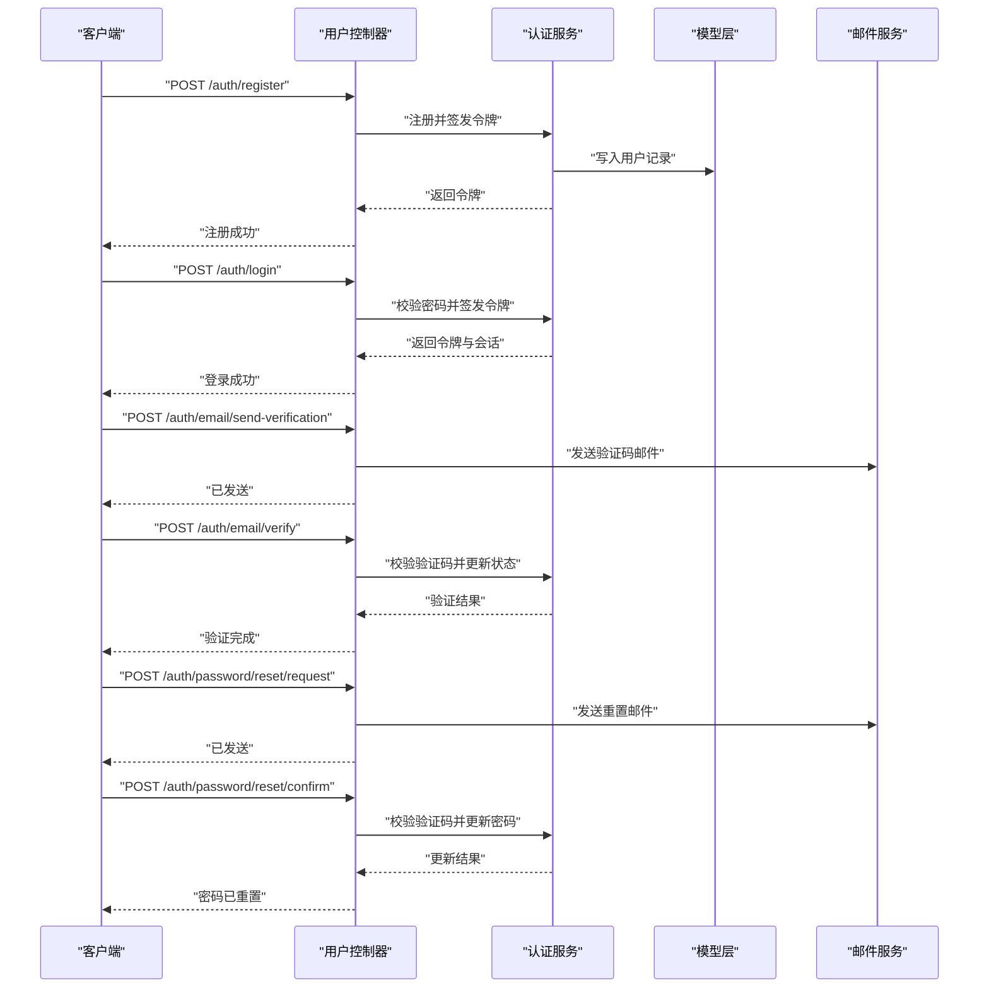
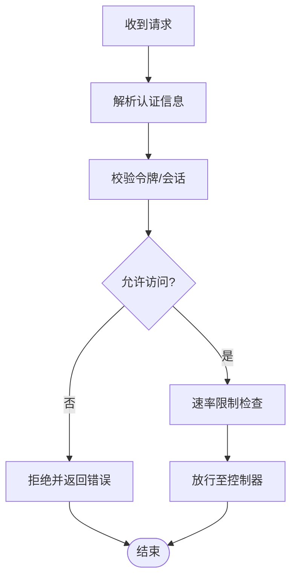
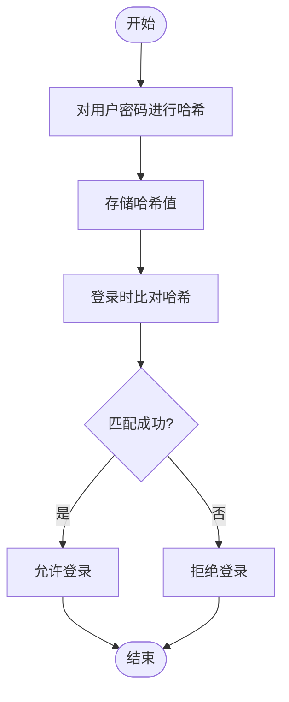
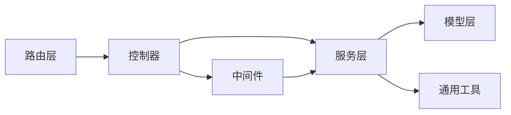

# 本地认证

<cite>
**本文引用的文件**   
- [controller/user.go](file://controller/user.go)
- [controller/auth_session.go](file://controller/auth_session.go)
- [middleware/auth.go](file://middleware/auth.go)
- [model/user.go](file://model/user.go)
- [model/user_session.go](file://model/user_session.go)
- [common/crypto.go](file://common/crypto.go)
- [common/email.go](file://common/email.go)
- [service/auth_token.go](file://service/auth_token.go)
- [service/auth_session.go](file://service/auth_session.go)
- [router/main.go](file://router/main.go)
- [router/api-router.go](file://router/api-router.go)
- [setting/operation_setting/general_setting.go](file://setting/operation_setting/general_setting.go)
</cite>

## 目录
1. [简介](#简介)
2. [项目结构](#项目结构)
3. [核心组件](#核心组件)
4. [架构总览](#架构总览)
5. [详细组件分析](#详细组件分析)
6. [依赖关系分析](#依赖关系分析)
7. [性能考量](#性能考量)
8. [故障排查指南](#故障排查指南)
9. [结论](#结论)
10. [附录：API 接口与使用示例](#附录api-接口与使用示例)

## 简介
本文件面向“本地认证系统”的开发者与使用者，系统性阐述用户名密码认证、邮箱验证、密码重置与账户管理的实现细节。内容覆盖认证流程、密码加密策略、会话管理、错误处理，以及与权限控制和安全组件的关系。文档基于仓库中的实际代码结构与实现进行归纳，并提供流程图与时序图帮助理解关键路径。

## 项目结构
本地认证相关能力分布在控制器（controller）、中间件（middleware）、模型（model）、服务（service）、通用工具（common）与路由（router）等模块中：
- 控制器层：用户注册、登录、邮箱验证、密码重置、账户管理等 HTTP 入口
- 中间件层：鉴权校验、请求来源校验、速率限制等安全拦截
- 模型层：用户实体、会话实体、缓存与迁移逻辑
- 服务层：令牌签发与校验、会话生命周期管理、业务编排
- 通用层：加密哈希、邮件发送、验证码生成、Cookie/Session 工具
- 路由层：API 路由注册与分组

图表来源
- [router/main.go](file://router/main.go)
- [router/api-router.go](file://router/api-router.go)
- [controller/user.go](file://controller/user.go)
- [controller/auth_session.go](file://controller/auth_session.go)
- [service/auth_token.go](file://service/auth_token.go)
- [service/auth_session.go](file://service/auth_session.go)
- [model/user.go](file://model/user.go)
- [model/user_session.go](file://model/user_session.go)
- [common/crypto.go](file://common/crypto.go)
- [common/email.go](file://common/email.go)

章节来源
- [router/main.go](file://router/main.go)
- [router/api-router.go](file://router/api-router.go)

## 核心组件
- 用户模型与会话模型：定义用户字段、状态、密码哈希存储与会话持久化结构
- 认证服务：负责令牌签发、刷新、校验与会话创建、续期、销毁
- 控制器：暴露注册、登录、邮箱验证、密码重置、账户修改等 API
- 中间件：统一鉴权、来源校验、限流与安全头设置
- 通用工具：密码哈希、随机码生成、邮件发送、Cookie/Session 操作

章节来源
- [model/user.go](file://model/user.go)
- [model/user_session.go](file://model/user_session.go)
- [service/auth_token.go](file://service/auth_token.go)
- [service/auth_session.go](file://service/auth_session.go)
- [controller/user.go](file://controller/user.go)
- [controller/auth_session.go](file://controller/auth_session.go)
- [middleware/auth.go](file://middleware/auth.go)
- [common/crypto.go](file://common/crypto.go)
- [common/email.go](file://common/email.go)

## 架构总览
下图展示从客户端到后端各层的调用关系与数据流向，突出认证关键路径：

图表来源
- [controller/user.go](file://controller/user.go)
- [controller/auth_session.go](file://controller/auth_session.go)
- [service/auth_token.go](file://service/auth_token.go)
- [service/auth_session.go](file://service/auth_session.go)
- [model/user.go](file://model/user.go)
- [model/user_session.go](file://model/user_session.go)
- [common/email.go](file://common/email.go)
- [middleware/auth.go](file://middleware/auth.go)

## 详细组件分析

### 用户模型与会话模型
- 用户模型包含用户名、邮箱、密码哈希、邮箱验证状态、账户状态、时间戳等字段；提供创建、更新、查询等方法
- 会话模型包含会话标识、用户关联、过期时间、扩展信息等；支持创建、查找、续期、清理等操作

图表来源
- [model/user.go](file://model/user.go)
- [model/user_session.go](file://model/user_session.go)

章节来源
- [model/user.go](file://model/user.go)
- [model/user_session.go](file://model/user_session.go)

### 认证服务（令牌与会话）
- 令牌签发：根据用户身份生成访问令牌，设置有效期与刷新机制
- 令牌校验：解析令牌、验签、检查过期与黑名单
- 会话管理：创建会话、续期、注销、清理过期会话
- 与缓存集成：将高频校验结果放入缓存以提升性能

图表来源
- [service/auth_token.go](file://service/auth_token.go)
- [service/auth_session.go](file://service/auth_session.go)

章节来源
- [service/auth_token.go](file://service/auth_token.go)
- [service/auth_session.go](file://service/auth_session.go)

### 控制器：注册、登录、邮箱验证、密码重置、账户管理
- 注册：接收用户名、邮箱、密码，校验唯一性与格式，创建用户并返回初始令牌
- 登录：校验用户名/密码，成功后签发令牌与会话
- 邮箱验证：接收验证码或链接 token，校验后标记邮箱已验证
- 密码重置：生成一次性验证码并发送邮件，提交新密码时校验验证码并更新
- 账户管理：修改个人资料、邮箱、密码等，需鉴权

图表来源
- [controller/user.go](file://controller/user.go)
- [controller/auth_session.go](file://controller/auth_session.go)
- [service/auth_token.go](file://service/auth_token.go)
- [service/auth_session.go](file://service/auth_session.go)
- [common/email.go](file://common/email.go)

章节来源
- [controller/user.go](file://controller/user.go)
- [controller/auth_session.go](file://controller/auth_session.go)

### 中间件：鉴权与安全检查
- 鉴权中间件：解析请求中的令牌或会话标识，校验有效性并注入上下文
- 来源校验：校验请求来源（如 Origin/Referer），防止跨域滥用
- 限流：对敏感接口（登录、注册、邮箱验证、密码重置）进行速率限制
- 安全头：设置必要的响应头（如 CSP、X-Frame-Options）

图表来源
- [middleware/auth.go](file://middleware/auth.go)

章节来源
- [middleware/auth.go](file://middleware/auth.go)

### 通用工具：密码加密与邮件发送
- 密码加密：采用安全的哈希算法（如 bcrypt/argon2）对用户密码进行不可逆加密存储
- 验证码生成：生成一次性、短时效的随机码用于邮箱验证与密码重置
- 邮件发送：封装 SMTP/第三方服务，支持模板化邮件内容与重试机制

图表来源
- [common/crypto.go](file://common/crypto.go)
- [common/email.go](file://common/email.go)

章节来源
- [common/crypto.go](file://common/crypto.go)
- [common/email.go](file://common/email.go)

### 配置项：认证与行为开关
- 是否启用本地认证、邮箱验证、密码重置、双因素认证等开关
- 令牌有效期、刷新策略、会话超时与清理策略
- 邮件服务配置（SMTP、发件人、模板）

章节来源
- [setting/operation_setting/general_setting.go](file://setting/operation_setting/general_setting.go)

## 依赖关系分析
- 控制器依赖服务层进行业务编排，服务层依赖模型层进行数据持久化
- 中间件在路由层之后、控制器之前执行，确保所有受保护接口均经过鉴权
- 通用工具被服务层与控制器广泛复用，保证一致的安全与通信行为

图表来源
- [router/main.go](file://router/main.go)
- [router/api-router.go](file://router/api-router.go)
- [controller/user.go](file://controller/user.go)
- [controller/auth_session.go](file://controller/auth_session.go)
- [service/auth_token.go](file://service/auth_token.go)
- [service/auth_session.go](file://service/auth_session.go)
- [model/user.go](file://model/user.go)
- [model/user_session.go](file://model/user_session.go)
- [common/crypto.go](file://common/crypto.go)
- [common/email.go](file://common/email.go)
- [middleware/auth.go](file://middleware/auth.go)

章节来源
- [router/main.go](file://router/main.go)
- [router/api-router.go](file://router/api-router.go)

## 性能考量
- 令牌校验与用户查询可引入缓存以减少数据库压力
- 会话续期与清理采用异步任务避免阻塞请求
- 邮件发送采用队列与重试机制提升可靠性
- 对敏感接口实施严格的速率限制，防止暴力破解

## 故障排查指南
- 登录失败：检查用户名/密码是否正确、账户状态是否可用、是否触发限流
- 邮箱验证失败：确认验证码未过期、邮件是否送达、验证码是否已被使用
- 密码重置失败：检查重置链接有效性、验证码匹配、密码强度规则
- 鉴权失败：检查令牌是否过期、签名是否合法、来源校验是否通过
- 常见问题定位：查看日志中的错误码与堆栈，核对配置项（邮件、令牌、会话）

章节来源
- [middleware/auth.go](file://middleware/auth.go)
- [controller/user.go](file://controller/user.go)
- [controller/auth_session.go](file://controller/auth_session.go)

## 结论
本地认证系统围绕用户模型与会话模型构建，通过服务层编排认证流程，结合中间件实现统一的鉴权与安全控制。密码加密、邮箱验证、密码重置与账户管理等功能完备，配合缓存与队列优化性能与可靠性。建议在生产环境严格配置安全选项，并持续监控与审计认证相关事件。

## 附录：API 接口与使用示例
以下为常用认证相关接口的说明与使用方法（以路径与职责为主，具体参数与响应格式请参考对应控制器与服务实现）：
- 用户注册
  - 路径：/auth/register
  - 方法：POST
  - 用途：创建新用户并返回访问令牌
  - 注意：用户名与邮箱唯一性校验、密码强度要求
- 用户登录
  - 路径：/auth/login
  - 方法：POST
  - 用途：校验用户名/密码并返回令牌与会话
  - 注意：失败次数限制、账户锁定策略
- 邮箱验证码发送
  - 路径：/auth/email/send-verification
  - 方法：POST
  - 用途：向用户邮箱发送验证码
  - 注意：频率限制、验证码有效期
- 邮箱验证
  - 路径：/auth/email/verify
  - 方法：POST 或 GET（取决于实现）
  - 用途：提交验证码完成邮箱验证
  - 注意：验证码一次有效、防重放
- 密码重置请求
  - 路径：/auth/password/reset/request
  - 方法：POST
  - 用途：发送密码重置邮件
  - 注意：频率限制、验证码有效期
- 密码重置确认
  - 路径：/auth/password/reset/confirm
  - 方法：POST
  - 用途：提交验证码与新密码完成重置
  - 注意：密码强度、验证码匹配
- 账户信息修改
  - 路径：/auth/profile/update
  - 方法：PUT/PATCH
  - 用途：修改个人资料、邮箱、密码等
  - 注意：需鉴权、变更历史审计

章节来源
- [controller/user.go](file://controller/user.go)
- [controller/auth_session.go](file://controller/auth_session.go)
- [router/api-router.go](file://router/api-router.go)