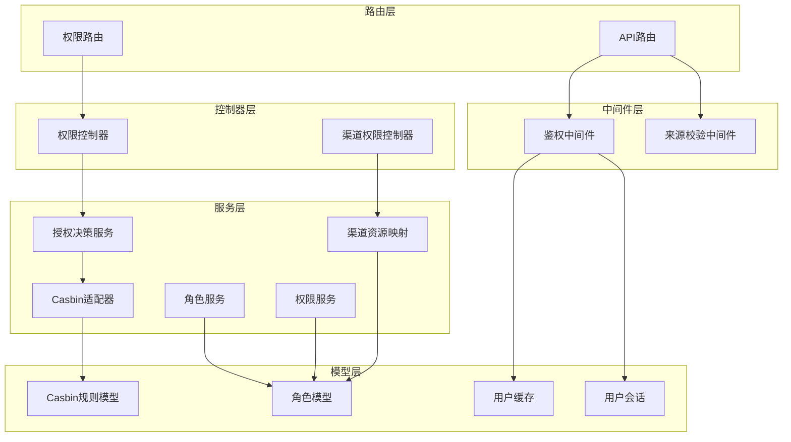
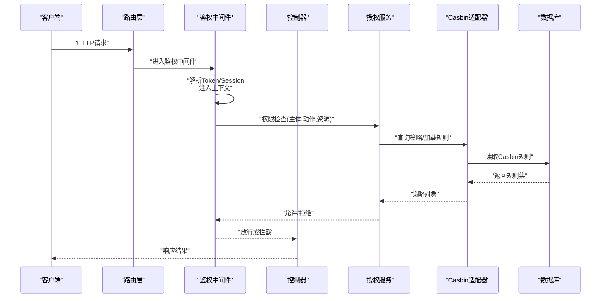
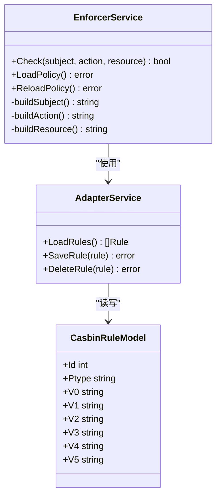
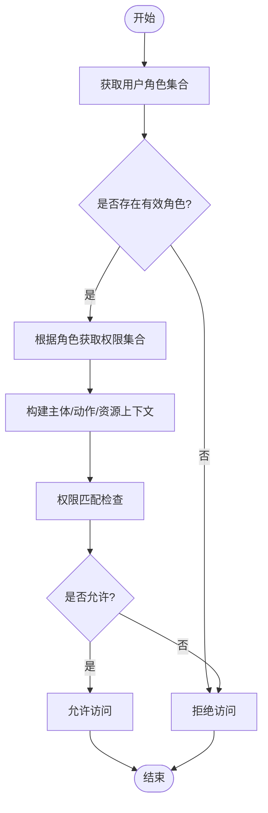
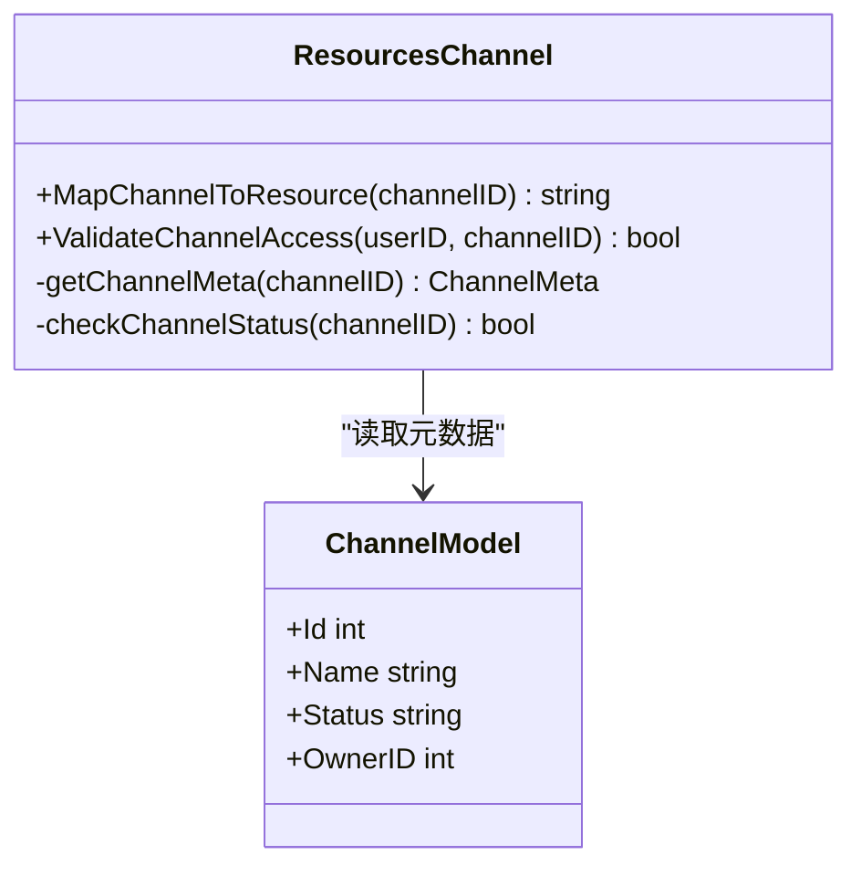
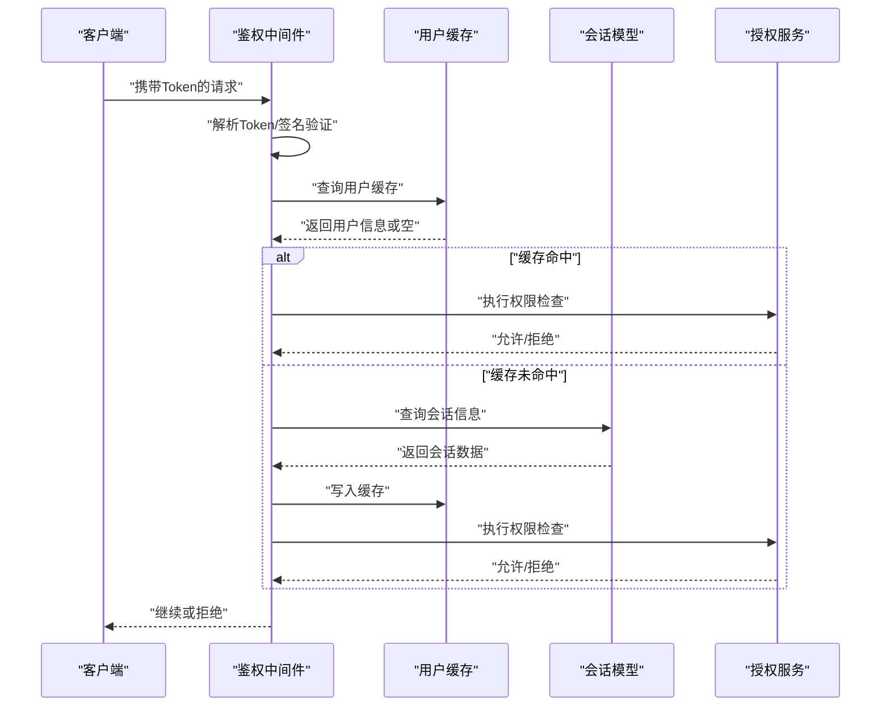

# 权限控制系统

<cite>
**本文引用的文件**   
- [authz.go](file://controller/authz.go)
- [channel_authz.go](file://controller/channel_authz.go)
- [auth.go](file://middleware/auth.go)
- [auth_origin.go](file://middleware/auth_origin.go)
- [enforcer.go](file://service/authz/enforcer.go)
- [adapter.go](file://service/authz/adapter.go)
- [assignment.go](file://service/authz/assignment.go)
- [permission.go](file://service/authz/permission.go)
- [role.go](file://service/authz/role.go)
- [resources_channel.go](file://service/authz/resources_channel.go)
- [casbin_rule.go](file://model/casbin_rule.go)
- [authz_role.go](file://model/authz_role.go)
- [cache_key.go](file://constant/cache_key.go)
- [context_key.go](file://constant/context_key.go)
- [api-router.go](file://router/api-router.go)
- [authz-router.go](file://router/authz-router.go)
- [channel_router_test.go](file://router/channel_router_test.go)
- [user_cache.go](file://model/user_cache.go)
- [user_session.go](file://model/user_session.go)
- [token.go](file://model/token.go)
</cite>

## 目录
1. [简介](#简介)
2. [项目结构](#项目结构)
3. [核心组件](#核心组件)
4. [架构总览](#架构总览)
5. [详细组件分析](#详细组件分析)
6. [依赖关系分析](#依赖关系分析)
7. [性能与缓存策略](#性能与缓存策略)
8. [故障排查指南](#故障排查指南)
9. [结论](#结论)
10. [附录](#附录)

## 简介
本文件面向权限控制系统的技术文档，围绕基于角色的访问控制（RBAC）、Casbin规则引擎、资源权限与动态授权进行系统化说明。内容涵盖角色定义、权限分配、资源保护、中间件集成、权限检查流程、缓存策略与性能优化，以及与用户管理、渠道访问控制和API权限的关系。所有实现细节均来源于仓库中的控制器、中间件、服务层与模型层代码。

## 项目结构
权限相关能力主要分布在以下层次：
- 路由层：注册受保护的API与权限管理接口
- 中间件层：鉴权、来源校验、请求上下文注入
- 控制器层：权限管理、渠道权限校验等
- 服务层：Casbin适配、角色与权限解析、资源映射、授权决策
- 模型层：Casbin规则持久化、角色实体、用户会话与缓存键

**图表来源** 
- [api-router.go](file://router/api-router.go)
- [authz-router.go](file://router/authz-router.go)
- [auth.go](file://middleware/auth.go)
- [auth_origin.go](file://middleware/auth_origin.go)
- [authz.go](file://controller/authz.go)
- [channel_authz.go](file://controller/channel_authz.go)
- [enforcer.go](file://service/authz/enforcer.go)
- [adapter.go](file://service/authz/adapter.go)
- [role.go](file://service/authz/role.go)
- [permission.go](file://service/authz/permission.go)
- [resources_channel.go](file://service/authz/resources_channel.go)
- [casbin_rule.go](file://model/casbin_rule.go)
- [authz_role.go](file://model/authz_role.go)
- [user_cache.go](file://model/user_cache.go)
- [user_session.go](file://model/user_session.go)

**章节来源**
- [api-router.go](file://router/api-router.go)
- [authz-router.go](file://router/authz-router.go)
- [auth.go](file://middleware/auth.go)
- [auth_origin.go](file://middleware/auth_origin.go)
- [authz.go](file://controller/authz.go)
- [channel_authz.go](file://controller/channel_authz.go)
- [enforcer.go](file://service/authz/enforcer.go)
- [adapter.go](file://service/authz/adapter.go)
- [role.go](file://service/authz/role.go)
- [permission.go](file://service/authz/permission.go)
- [resources_channel.go](file://service/authz/resources_channel.go)
- [casbin_rule.go](file://model/casbin_rule.go)
- [authz_role.go](file://model/authz_role.go)
- [user_cache.go](file://model/user_cache.go)
- [user_session.go](file://model/user_session.go)

## 核心组件
- 授权决策服务：封装Casbin调用，统一鉴权入口，支持策略加载、重载与结果缓存
- Casbin适配器：将策略读写映射到数据库表，保证规则持久化与一致性
- 角色服务：维护角色定义、角色-用户关联、角色-权限映射
- 权限服务：抽象权限操作，提供细粒度权限判定与批量授权能力
- 渠道资源映射：将业务资源（如渠道）映射为Casbin资源标识，支持动态授权
- 鉴权中间件：在请求进入时完成身份识别、上下文注入与基础权限校验
- 来源校验中间件：对请求来源进行校验，增强安全边界

**章节来源**
- [enforcer.go](file://service/authz/enforcer.go)
- [adapter.go](file://service/authz/adapter.go)
- [role.go](file://service/authz/role.go)
- [permission.go](file://service/authz/permission.go)
- [resources_channel.go](file://service/authz/resources_channel.go)
- [auth.go](file://middleware/auth.go)
- [auth_origin.go](file://middleware/auth_origin.go)

## 架构总览
系统采用分层架构：路由层暴露接口，中间件负责鉴权与安全校验，控制器处理业务逻辑，服务层实现授权决策与策略管理，模型层负责数据持久化。Casbin作为规则引擎，通过适配器与数据库交互，支持运行时策略更新与动态授权。

**图表来源** 
- [api-router.go](file://router/api-router.go)
- [auth.go](file://middleware/auth.go)
- [authz.go](file://controller/authz.go)
- [enforcer.go](file://service/authz/enforcer.go)
- [adapter.go](file://service/authz/adapter.go)
- [casbin_rule.go](file://model/casbin_rule.go)

**章节来源**
- [api-router.go](file://router/api-router.go)
- [auth.go](file://middleware/auth.go)
- [authz.go](file://controller/authz.go)
- [enforcer.go](file://service/authz/enforcer.go)
- [adapter.go](file://service/authz/adapter.go)
- [casbin_rule.go](file://model/casbin_rule.go)

## 详细组件分析

### 授权决策服务（Enforcer）
- 职责：封装Casbin的Enforcer实例，提供统一的权限判断接口；支持策略热加载、错误处理与结果缓存
- 关键行为：
  - 初始化并加载策略
  - 执行Allow/Deny决策
  - 根据上下文构建主体、动作、资源三元组
  - 与适配器协作读写策略
- 性能要点：避免重复加载策略，使用内存缓存减少数据库压力

**图表来源** 
- [enforcer.go](file://service/authz/enforcer.go)
- [adapter.go](file://service/authz/adapter.go)
- [casbin_rule.go](file://model/casbin_rule.go)

**章节来源**
- [enforcer.go](file://service/authz/enforcer.go)
- [adapter.go](file://service/authz/adapter.go)
- [casbin_rule.go](file://model/casbin_rule.go)

### 角色与权限服务（Role & Permission）
- 角色服务：维护角色定义、用户-角色绑定、角色-权限映射；支持批量分配与撤销
- 权限服务：抽象权限操作，提供细粒度权限判定；支持按资源类型与动作组合判断
- 典型流程：
  - 获取用户角色集合
  - 根据角色查找对应权限集合
  - 结合资源标识与动作进行最终判定

**图表来源** 
- [role.go](file://service/authz/role.go)
- [permission.go](file://service/authz/permission.go)
- [authz_role.go](file://model/authz_role.go)

**章节来源**
- [role.go](file://service/authz/role.go)
- [permission.go](file://service/authz/permission.go)
- [authz_role.go](file://model/authz_role.go)

### 渠道资源映射（Resources Channel）
- 职责：将渠道资源映射为Casbin可识别的资源标识，支持动态授权与渠道级权限控制
- 关键点：
  - 资源命名规范与层级
  - 渠道状态与可用性的影响
  - 与角色-权限映射联动

**图表来源** 
- [resources_channel.go](file://service/authz/resources_channel.go)
- [authz_role.go](file://model/authz_role.go)

**章节来源**
- [resources_channel.go](file://service/authz/resources_channel.go)
- [authz_role.go](file://model/authz_role.go)

### 鉴权中间件（Auth Middleware）
- 职责：解析请求中的认证信息（Token/Session），注入用户上下文，执行基础权限校验
- 关键点：
  - Token解析与会话验证
  - 上下文键值管理
  - 与权限服务的集成点

**图表来源** 
- [auth.go](file://middleware/auth.go)
- [user_cache.go](file://model/user_cache.go)
- [user_session.go](file://model/user_session.go)
- [enforcer.go](file://service/authz/enforcer.go)

**章节来源**
- [auth.go](file://middleware/auth.go)
- [user_cache.go](file://model/user_cache.go)
- [user_session.go](file://model/user_session.go)
- [enforcer.go](file://service/authz/enforcer.go)

### 来源校验中间件（Auth Origin）
- 职责：校验请求来源（如IP白名单、域名限制），增强安全边界
- 关键点：
  - 来源策略配置
  - 与鉴权中间件的协作顺序
  - 失败时的安全响应

**章节来源**
- [auth_origin.go](file://middleware/auth_origin.go)

### 控制器层（AuthZ & ChannelAuthZ）
- 权限控制器：提供角色管理、权限分配、策略查看与管理接口
- 渠道权限控制器：提供渠道级权限校验与动态授权接口

**章节来源**
- [authz.go](file://controller/authz.go)
- [channel_authz.go](file://controller/channel_authz.go)

## 依赖关系分析
- 路由层依赖中间件进行鉴权与安全校验
- 中间件依赖用户缓存与会话模型进行身份识别
- 控制器依赖服务层进行业务逻辑处理
- 服务层依赖适配器与模型层进行策略读写
- 模型层依赖数据库进行持久化

**图表来源** 
- [api-router.go](file://router/api-router.go)
- [authz-router.go](file://router/authz-router.go)
- [auth.go](file://middleware/auth.go)
- [authz.go](file://controller/authz.go)
- [enforcer.go](file://service/authz/enforcer.go)
- [adapter.go](file://service/authz/adapter.go)
- [casbin_rule.go](file://model/casbin_rule.go)

**章节来源**
- [api-router.go](file://router/api-router.go)
- [authz-router.go](file://router/authz-router.go)
- [auth.go](file://middleware/auth.go)
- [authz.go](file://controller/authz.go)
- [enforcer.go](file://service/authz/enforcer.go)
- [adapter.go](file://service/authz/adapter.go)
- [casbin_rule.go](file://model/casbin_rule.go)

## 性能与缓存策略
- 策略缓存：授权决策服务内部缓存策略对象，避免频繁加载
- 用户缓存：鉴权中间件使用用户缓存减少数据库查询
- 会话缓存：会话信息缓存提升鉴权速度
- 缓存键管理：集中化的缓存键定义确保一致性
- 性能监控：关键路径埋点与指标收集

**章节来源**
- [enforcer.go](file://service/authz/enforcer.go)
- [user_cache.go](file://model/user_cache.go)
- [user_session.go](file://model/user_session.go)
- [cache_key.go](file://constant/cache_key.go)

## 故障排查指南
- 权限检查失败：检查用户角色、权限映射与资源标识是否正确
- 策略加载异常：确认Casbin规则表结构与数据完整性
- 缓存失效：检查缓存键生成逻辑与过期策略
- 中间件拦截：验证Token解析与会话验证逻辑
- 渠道访问问题：确认渠道状态与资源映射关系

**章节来源**
- [authz.go](file://controller/authz.go)
- [channel_authz.go](file://controller/channel_authz.go)
- [enforcer.go](file://service/authz/enforcer.go)
- [adapter.go](file://service/authz/adapter.go)
- [auth.go](file://middleware/auth.go)

## 结论
本权限控制系统基于RBAC与Casbin规则引擎，实现了灵活的角色管理、细粒度的权限控制与动态授权能力。通过分层架构设计、中间件集成与缓存优化，系统在安全性、可扩展性与性能方面达到了良好平衡。建议在生产环境中持续监控权限检查性能与策略变更影响，确保系统稳定运行。

## 附录
- 最佳实践：
  - 定期审计角色与权限分配
  - 使用最小权限原则
  - 实施策略变更的版本控制
  - 建立权限检查的性能基线
- 扩展方向：
  - 支持更多资源类型映射
  - 实现更复杂的条件授权
  - 集成外部身份源
  - 增强审计与日志记录