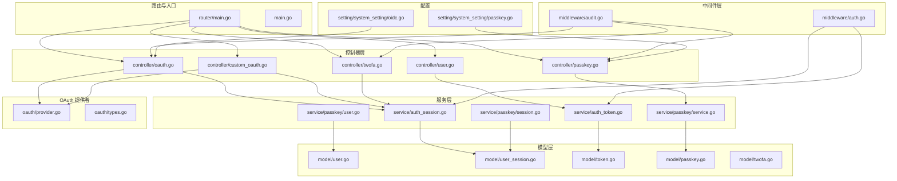
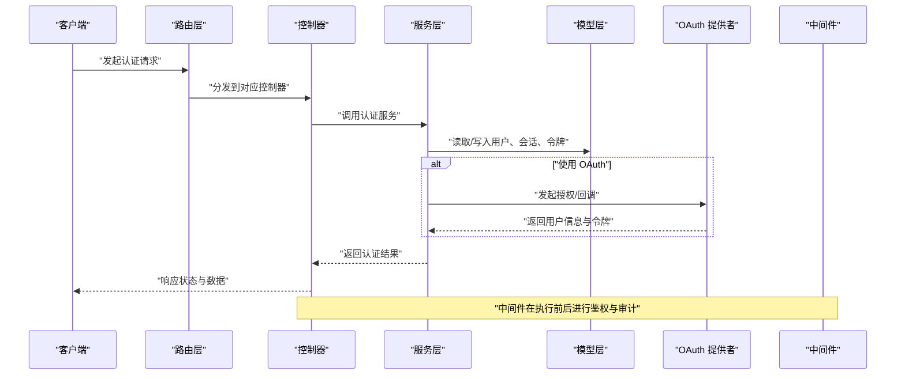
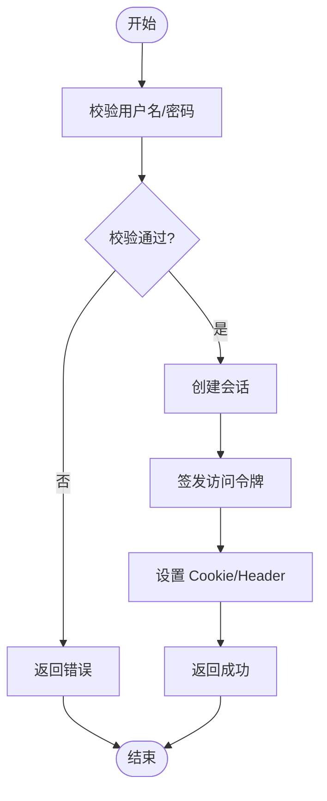
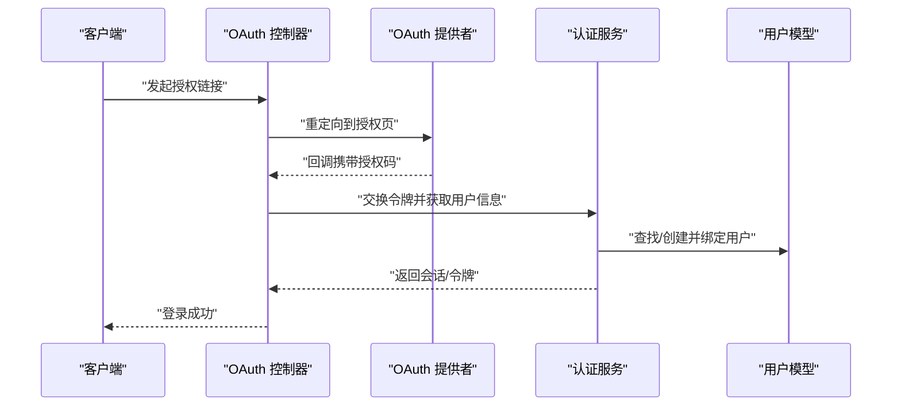
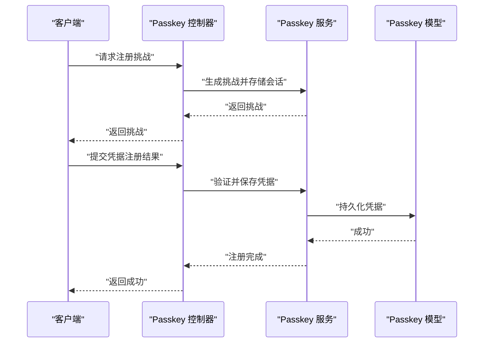
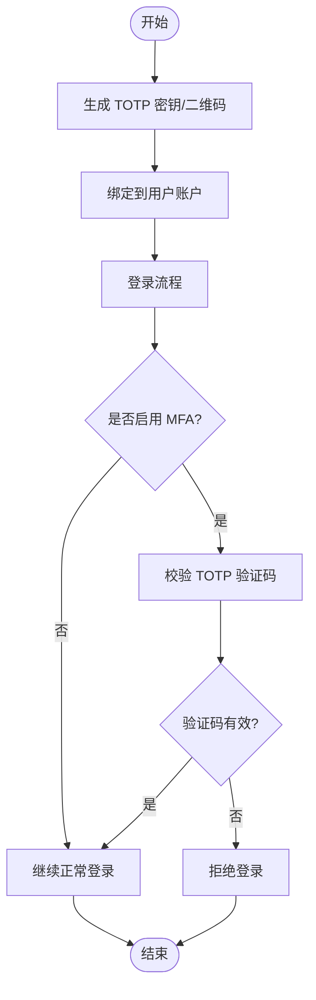
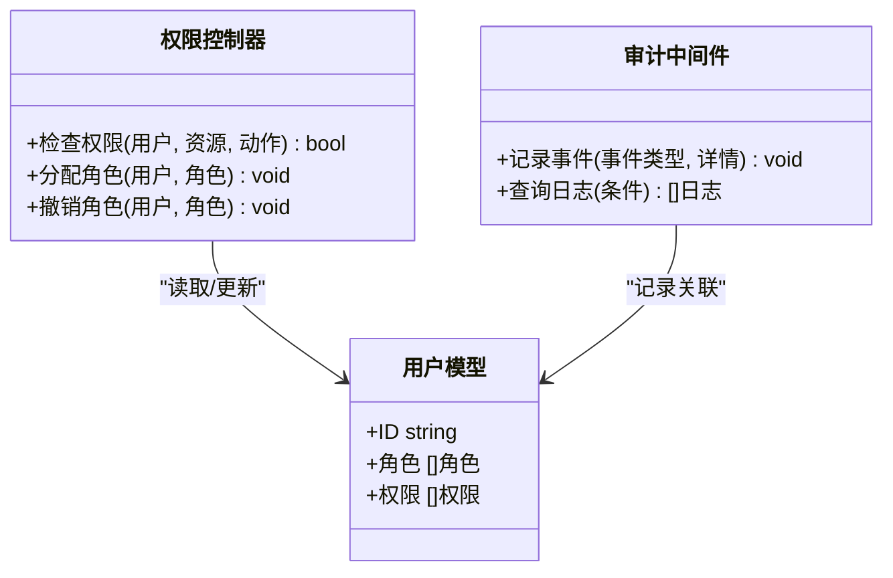
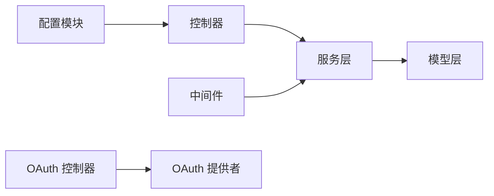

# 认证与安全

<cite>
**本文引用的文件**   
- [main.go](file://main.go)
- [router/main.go](file://router/main.go)
- [middleware/auth.go](file://middleware/auth.go)
- [middleware/audit.go](file://middleware/audit.go)
- [controller/oauth.go](file://controller/oauth.go)
- [controller/custom_oauth.go](file://controller/custom_oauth.go)
- [controller/passkey.go](file://controller/passkey.go)
- [controller/twofa.go](file://controller/twofa.go)
- [controller/user.go](file://controller/user.go)
- [service/auth_session.go](file://service/auth_session.go)
- [service/auth_token.go](file://service/auth_token.go)
- [service/passkey/service.go](file://service/passkey/service.go)
- [service/passkey/session.go](file://service/passkey/session.go)
- [service/passkey/user.go](file://service/passkey/user.go)
- [model/user.go](file://model/user.go)
- [model/user_session.go](file://model/user_session.go)
- [model/token.go](file://model/token.go)
- [model/passkey.go](file://model/passkey.go)
- [model/twofa.go](file://model/twofa.go)
- [common/totp.go](file://common/totp.go)
- [oauth/provider.go](file://oauth/provider.go)
- [oauth/types.go](file://oauth/types.go)
- [setting/system_setting/passkey.go](file://setting/system_setting/passkey.go)
- [setting/system_setting/oidc.go](file://setting/system_setting/oidc.go)
- [constant/context_key.go](file://constant/context_key.go)
</cite>

## 目录
1. [简介](#简介)
2. [项目结构](#项目结构)
3. [核心组件](#核心组件)
4. [架构总览](#架构总览)
5. [详细组件分析](#详细组件分析)
6. [依赖关系分析](#依赖关系分析)
7. [性能考量](#性能考量)
8. [故障排查指南](#故障排查指南)
9. [结论](#结论)
10. [附录](#附录)

## 简介
本文件面向认证与安全子系统，覆盖多因素认证（MFA）、OAuth 集成、Passkey（无密码）支持、权限控制与访问审计的实现细节。文档基于仓库中的控制器、中间件、服务层、模型与配置模块进行梳理，给出端到端流程、数据流、错误处理与最佳实践，帮助开发者快速理解并安全地扩展系统能力。

## 项目结构
认证与安全相关代码主要分布在以下层次：
- 路由与入口：负责注册认证相关路由与全局中间件
- 控制器层：实现登录、注册、OAuth 回调、Passkey 流程、TOTP/MFA 等接口
- 服务层：封装会话管理、令牌签发、Passkey 业务逻辑
- 模型层：用户、会话、令牌、Passkey、MFA 等数据模型
- 中间件层：鉴权、审计、限流、请求清理等横切关注点
- OAuth 提供者：统一抽象与注册机制
- 配置项：系统级 Passkey、OIDC 等开关与参数

图表来源
- [router/main.go:1-200](file://router/main.go#L1-L200)
- [main.go:1-120](file://main.go#L1-L120)
- [middleware/auth.go:1-200](file://middleware/auth.go#L1-L200)
- [middleware/audit.go:1-200](file://middleware/audit.go#L1-L200)
- [controller/oauth.go:1-300](file://controller/oauth.go#L1-L300)
- [controller/custom_oauth.go:1-200](file://controller/custom_oauth.go#L1-L200)
- [controller/passkey.go:1-300](file://controller/passkey.go#L1-L300)
- [controller/twofa.go:1-200](file://controller/twofa.go#L1-L200)
- [controller/user.go:1-200](file://controller/user.go#L1-L200)
- [service/auth_session.go:1-300](file://service/auth_session.go#L1-L300)
- [service/auth_token.go:1-200](file://service/auth_token.go#L1-L200)
- [service/passkey/service.go:1-200](file://service/passkey/service.go#L1-L200)
- [service/passkey/session.go:1-150](file://service/passkey/session.go#L1-L150)
- [service/passkey/user.go:1-150](file://service/passkey/user.go#L1-L150)
- [model/user.go:1-200](file://model/user.go#L1-L200)
- [model/user_session.go:1-200](file://model/user_session.go#L1-L200)
- [model/token.go:1-200](file://model/token.go#L1-L200)
- [model/passkey.go:1-200](file://model/passkey.go#L1-L200)
- [model/twofa.go:1-200](file://model/twofa.go#L1-L200)
- [oauth/provider.go:1-200](file://oauth/provider.go#L1-L200)
- [oauth/types.go:1-200](file://oauth/types.go#L1-L200)
- [setting/system_setting/passkey.go:1-200](file://setting/system_setting/passkey.go#L1-L200)
- [setting/system_setting/oidc.go:1-200](file://setting/system_setting/oidc.go#L1-L200)

章节来源
- [router/main.go:1-200](file://router/main.go#L1-L200)
- [main.go:1-120](file://main.go#L1-L120)

## 核心组件
- 认证中间件：统一校验会话/令牌，注入上下文用户信息，拦截未授权访问
- 会话管理：创建、刷新、撤销会话，持久化到数据库或缓存
- 令牌签发：生成短期访问令牌，支持刷新与吊销
- OAuth 集成：标准 OIDC/OAuth2 流程，支持自定义提供者
- Passkey：WebAuthn/FIDO2 无密码登录，包含凭据注册、断言、绑定用户
- TOTP/MFA：基于时间的一次性密码，用于二次验证
- 权限控制：基于角色的访问控制（RBAC），资源级授权
- 访问审计：记录关键操作日志，便于追踪与合规

章节来源
- [middleware/auth.go:1-200](file://middleware/auth.go#L1-L200)
- [service/auth_session.go:1-300](file://service/auth_session.go#L1-L300)
- [service/auth_token.go:1-200](file://service/auth_token.go#L1-L200)
- [controller/oauth.go:1-300](file://controller/oauth.go#L1-L300)
- [controller/custom_oauth.go:1-200](file://controller/custom_oauth.go#L1-L200)
- [controller/passkey.go:1-300](file://controller/passkey.go#L1-L300)
- [controller/twofa.go:1-200](file://controller/twofa.go#L1-L200)
- [model/user.go:1-200](file://model/user.go#L1-L200)
- [model/user_session.go:1-200](file://model/user_session.go#L1-L200)
- [model/token.go:1-200](file://model/token.go#L1-L200)
- [model/passkey.go:1-200](file://model/passkey.go#L1-L200)
- [model/twofa.go:1-200](file://model/twofa.go#L1-L200)
- [oauth/provider.go:1-200](file://oauth/provider.go#L1-L200)
- [oauth/types.go:1-200](file://oauth/types.go#L1-L200)
- [setting/system_setting/passkey.go:1-200](file://setting/system_setting/passkey.go#L1-L200)
- [setting/system_setting/oidc.go:1-200](file://setting/system_setting/oidc.go#L1-L200)

## 架构总览
认证与安全子系统采用分层设计：
- 路由层将认证相关请求分发至对应控制器
- 控制器调用服务层完成具体业务逻辑
- 服务层通过模型层读写持久化数据
- 中间件在请求进入时执行鉴权与审计
- OAuth 提供者通过统一接口接入第三方平台
- 配置模块集中管理 Passkey、OIDC 等开关与参数

图表来源
- [router/main.go:1-200](file://router/main.go#L1-L200)
- [controller/oauth.go:1-300](file://controller/oauth.go#L1-L300)
- [controller/custom_oauth.go:1-200](file://controller/custom_oauth.go#L1-L200)
- [controller/passkey.go:1-300](file://controller/passkey.go#L1-L300)
- [controller/twofa.go:1-200](file://controller/twofa.go#L1-L200)
- [service/auth_session.go:1-300](file://service/auth_session.go#L1-L300)
- [service/auth_token.go:1-200](file://service/auth_token.go#L1-L200)
- [service/passkey/service.go:1-200](file://service/passkey/service.go#L1-L200)
- [model/user.go:1-200](file://model/user.go#L1-L200)
- [model/user_session.go:1-200](file://model/user_session.go#L1-L200)
- [model/token.go:1-200](file://model/token.go#L1-L200)
- [model/passkey.go:1-200](file://model/passkey.go#L1-L200)
- [model/twofa.go:1-200](file://model/twofa.go#L1-L200)
- [oauth/provider.go:1-200](file://oauth/provider.go#L1-L200)
- [middleware/auth.go:1-200](file://middleware/auth.go#L1-L200)
- [middleware/audit.go:1-200](file://middleware/audit.go#L1-L200)

## 详细组件分析

### 本地认证与会话管理
- 登录流程：用户名/密码校验成功后创建会话，签发短期令牌，设置 Cookie/Header 传递
- 会话生命周期：支持刷新、过期策略、并发限制、注销撤销
- 上下文注入：中间件解析会话/令牌后注入当前用户信息到请求上下文

图表来源
- [controller/user.go:1-200](file://controller/user.go#L1-L200)
- [service/auth_session.go:1-300](file://service/auth_session.go#L1-L300)
- [service/auth_token.go:1-200](file://service/auth_token.go#L1-L200)
- [model/user_session.go:1-200](file://model/user_session.go#L1-L200)
- [model/token.go:1-200](file://model/token.go#L1-L200)
- [middleware/auth.go:1-200](file://middleware/auth.go#L1-L200)

章节来源
- [controller/user.go:1-200](file://controller/user.go#L1-L200)
- [service/auth_session.go:1-300](file://service/auth_session.go#L1-L300)
- [service/auth_token.go:1-200](file://service/auth_token.go#L1-L200)
- [model/user_session.go:1-200](file://model/user_session.go#L1-L200)
- [model/token.go:1-200](file://model/token.go#L1-L200)
- [middleware/auth.go:1-200](file://middleware/auth.go#L1-L200)

### OAuth 集成（含自定义提供者）
- 支持标准 OIDC/OAuth2 流程：授权码模式、回调处理、用户信息拉取
- 自定义提供者：通过统一接口注册新的 OAuth 提供方
- 绑定与合并：外部身份与本地用户账户关联

图表来源
- [controller/oauth.go:1-300](file://controller/oauth.go#L1-L300)
- [controller/custom_oauth.go:1-200](file://controller/custom_oauth.go#L1-L200)
- [oauth/provider.go:1-200](file://oauth/provider.go#L1-L200)
- [oauth/types.go:1-200](file://oauth/types.go#L1-L200)
- [service/auth_session.go:1-300](file://service/auth_session.go#L1-L300)
- [model/user.go:1-200](file://model/user.go#L1-L200)

章节来源
- [controller/oauth.go:1-300](file://controller/oauth.go#L1-L300)
- [controller/custom_oauth.go:1-200](file://controller/custom_oauth.go#L1-L200)
- [oauth/provider.go:1-200](file://oauth/provider.go#L1-L200)
- [oauth/types.go:1-200](file://oauth/types.go#L1-L200)
- [setting/system_setting/oidc.go:1-200](file://setting/system_setting/oidc.go#L1-L200)

### Passkey（无密码）支持
- 注册流程：生成挑战、浏览器端创建凭据、服务端保存公钥与元数据
- 登录流程：生成挑战、浏览器端签名、服务端验证断言并建立会话
- 用户绑定：将 WebAuthn 凭据与本地用户账户关联

图表来源
- [controller/passkey.go:1-300](file://controller/passkey.go#L1-L300)
- [service/passkey/service.go:1-200](file://service/passkey/service.go#L1-L200)
- [service/passkey/session.go:1-150](file://service/passkey/session.go#L1-L150)
- [service/passkey/user.go:1-150](file://service/passkey/user.go#L1-L150)
- [model/passkey.go:1-200](file://model/passkey.go#L1-L200)
- [setting/system_setting/passkey.go:1-200](file://setting/system_setting/passkey.go#L1-L200)

章节来源
- [controller/passkey.go:1-300](file://controller/passkey.go#L1-L300)
- [service/passkey/service.go:1-200](file://service/passkey/service.go#L1-L200)
- [service/passkey/session.go:1-150](file://service/passkey/session.go#L1-L150)
- [service/passkey/user.go:1-150](file://service/passkey/user.go#L1-L150)
- [model/passkey.go:1-200](file://model/passkey.go#L1-L200)
- [setting/system_setting/passkey.go:1-200](file://setting/system_setting/passkey.go#L1-L200)

### 多因素认证（TOTP/MFA）
- 启用 TOTP：生成密钥与二维码，用户绑定后开启二次验证
- 登录增强：首次登录或敏感操作要求输入 TOTP 验证码
- 校验逻辑：基于时间窗口与共享密钥验证一次性密码

图表来源
- [controller/twofa.go:1-200](file://controller/twofa.go#L1-L200)
- [common/totp.go:1-200](file://common/totp.go#L1-L200)
- [model/twofa.go:1-200](file://model/twofa.go#L1-L200)
- [service/auth_session.go:1-300](file://service/auth_session.go#L1-L300)

章节来源
- [controller/twofa.go:1-200](file://controller/twofa.go#L1-L200)
- [common/totp.go:1-200](file://common/totp.go#L1-L200)
- [model/twofa.go:1-200](file://model/twofa.go#L1-L200)
- [service/auth_session.go:1-300](file://service/auth_session.go#L1-L300)

### 权限控制与访问审计
- 权限模型：基于角色与资源的访问控制（RBAC），支持细粒度授权
- 审计日志：记录登录、授权、敏感操作等事件，便于追踪与合规
- 中间件集成：在鉴权通过后记录审计信息

图表来源
- [middleware/audit.go:1-200](file://middleware/audit.go#L1-L200)
- [model/user.go:1-200](file://model/user.go#L1-L200)

章节来源
- [middleware/audit.go:1-200](file://middleware/audit.go#L1-L200)
- [model/user.go:1-200](file://model/user.go#L1-L200)

## 依赖关系分析
- 控制器依赖服务层完成认证、会话、令牌、Passkey 等业务逻辑
- 服务层依赖模型层进行数据持久化
- 中间件依赖服务层进行鉴权与审计
- OAuth 控制器依赖统一的提供者接口以接入不同平台
- 配置模块为 Passkey、OIDC 提供运行时参数

图表来源
- [controller/oauth.go:1-300](file://controller/oauth.go#L1-L300)
- [controller/custom_oauth.go:1-200](file://controller/custom_oauth.go#L1-L200)
- [controller/passkey.go:1-300](file://controller/passkey.go#L1-L300)
- [controller/twofa.go:1-200](file://controller/twofa.go#L1-L200)
- [service/auth_session.go:1-300](file://service/auth_session.go#L1-L300)
- [service/auth_token.go:1-200](file://service/auth_token.go#L1-L200)
- [service/passkey/service.go:1-200](file://service/passkey/service.go#L1-L200)
- [model/user.go:1-200](file://model/user.go#L1-L200)
- [model/user_session.go:1-200](file://model/user_session.go#L1-L200)
- [model/token.go:1-200](file://model/token.go#L1-L200)
- [model/passkey.go:1-200](file://model/passkey.go#L1-L200)
- [model/twofa.go:1-200](file://model/twofa.go#L1-L200)
- [oauth/provider.go:1-200](file://oauth/provider.go#L1-L200)
- [setting/system_setting/passkey.go:1-200](file://setting/system_setting/passkey.go#L1-L200)
- [setting/system_setting/oidc.go:1-200](file://setting/system_setting/oidc.go#L1-L200)

章节来源
- [controller/oauth.go:1-300](file://controller/oauth.go#L1-L300)
- [controller/custom_oauth.go:1-200](file://controller/custom_oauth.go#L1-L200)
- [controller/passkey.go:1-300](file://controller/passkey.go#L1-L300)
- [controller/twofa.go:1-200](file://controller/twofa.go#L1-L200)
- [service/auth_session.go:1-300](file://service/auth_session.go#L1-L300)
- [service/auth_token.go:1-200](file://service/auth_token.go#L1-L200)
- [service/passkey/service.go:1-200](file://service/passkey/service.go#L1-L200)
- [model/user.go:1-200](file://model/user.go#L1-L200)
- [model/user_session.go:1-200](file://model/user_session.go#L1-L200)
- [model/token.go:1-200](file://model/token.go#L1-L200)
- [model/passkey.go:1-200](file://model/passkey.go#L1-L200)
- [model/twofa.go:1-200](file://model/twofa.go#L1-L200)
- [oauth/provider.go:1-200](file://oauth/provider.go#L1-L200)
- [setting/system_setting/passkey.go:1-200](file://setting/system_setting/passkey.go#L1-L200)
- [setting/system_setting/oidc.go:1-200](file://setting/system_setting/oidc.go#L1-L200)

## 性能考量
- 会话与令牌缓存：对高频鉴权路径引入缓存以减少数据库压力
- 短令牌+刷新机制：降低泄露风险并减少频繁登录
- 并发控制：限制同一用户会话数，防止滥用
- 审计异步化：避免同步写日志影响主链路性能
- 限流与防护：对登录、注册、TOTP 校验等接口实施速率限制

[本节为通用指导，不直接分析具体文件]

## 故障排查指南
- 登录失败：检查用户名/密码、MFA 配置、会话状态、令牌有效性
- OAuth 回调异常：核对回调地址、客户端密钥、作用域与用户映射
- Passkey 注册/登录失败：确认浏览器支持、挑战会话、凭据元数据完整性
- TOTP 校验失败：检查时间同步、密钥绑定、验证码有效期
- 权限不足：核查角色分配、资源权限、中间件拦截原因
- 审计缺失：确认审计中间件启用、日志写入权限、事件触发点

章节来源
- [middleware/auth.go:1-200](file://middleware/auth.go#L1-L200)
- [middleware/audit.go:1-200](file://middleware/audit.go#L1-L200)
- [controller/oauth.go:1-300](file://controller/oauth.go#L1-L300)
- [controller/passkey.go:1-300](file://controller/passkey.go#L1-L300)
- [controller/twofa.go:1-200](file://controller/twofa.go#L1-L200)
- [service/auth_session.go:1-300](file://service/auth_session.go#L1-L300)
- [service/auth_token.go:1-200](file://service/auth_token.go#L1-L200)

## 结论
本认证与安全子系统通过分层设计与模块化实现，提供了本地认证、OAuth、Passkey、TOTP/MFA 等多方式登录能力，并结合 RBAC 权限模型与访问审计保障系统安全与可追溯性。建议在生产环境启用强口令策略、强制 MFA、最小权限原则与完善的审计日志，同时结合限流与缓存优化性能。

[本节为总结性内容，不直接分析具体文件]

## 附录
- 支持的认证方式
  - 本地认证：用户名/密码、会话与令牌管理
  - OAuth：标准 OIDC/OAuth2，支持自定义提供者
  - Passkey：WebAuthn/FIDO2 无密码登录
  - TOTP/MFA：基于时间的一次性密码二次验证
- 配置选项（示例）
  - Passkey：启用开关、Relying Party 标识、超时与约束
  - OIDC：提供商元数据、客户端 ID/密钥、回调地址、作用域
- 返回值约定
  - 成功：返回会话/令牌或状态码
  - 失败：返回错误码与消息，便于前端提示与重试
- 与其他组件的关系
  - 路由层：注册认证路由与中间件
  - 服务层：封装认证、会话、令牌、Passkey 业务
  - 模型层：用户、会话、令牌、Passkey、MFA 数据模型
  - 中间件：鉴权、审计、限流、请求清理
  - OAuth 提供者：统一接口接入第三方平台
  - 配置模块：集中管理认证相关参数

[本节为补充说明，不直接分析具体文件]