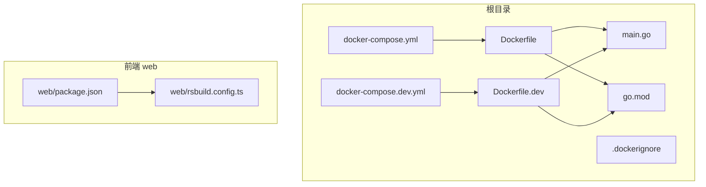
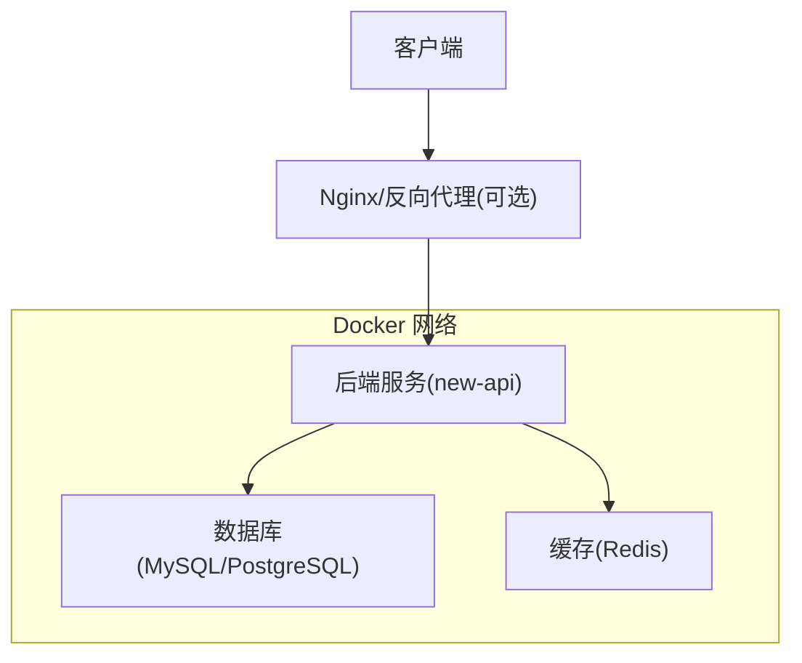
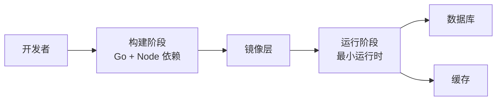

# Docker部署

<cite>
**本文引用的文件**   
- [Dockerfile](file://Dockerfile)
- [Dockerfile.dev](file://Dockerfile.dev)
- [docker-compose.yml](file://docker-compose.yml)
- [docker-compose.dev.yml](file://docker-compose.dev.yml)
- [.dockerignore](file://.dockerignore)
- [main.go](file://main.go)
- [go.mod](file://go.mod)
- [web/package.json](file://web/package.json)
- [web/rsbuild.config.ts](file://web/rsbuild.config.ts)
</cite>

## 目录
1. [简介](#简介)
2. [项目结构](#项目结构)
3. [核心组件](#核心组件)
4. [架构总览](#架构总览)
5. [详细组件分析](#详细组件分析)
6. [依赖关系分析](#依赖关系分析)
7. [性能与优化](#性能与优化)
8. [故障排查指南](#故障排查指南)
9. [结论](#结论)
10. [附录](#附录)

## 简介
本文件面向使用 Docker 部署该项目的工程师与运维人员，系统阐述镜像构建、容器化配置与 Docker Compose 编排的实现细节。内容涵盖多阶段构建策略、镜像分层优化、环境变量管理、依赖服务（如数据库/缓存）编排、网络与存储卷配置，以及开发环境与生产环境的完整部署方案。文档同时提供常见问题定位方法与最佳实践建议，帮助读者快速搭建稳定可靠的运行环境。

## 项目结构
本项目采用前后端分离架构：后端为 Go 语言应用，前端为基于现代工具链的 Web 应用。Docker 相关的关键文件包括：
- 生产镜像构建定义：Dockerfile
- 开发镜像构建定义：Dockerfile.dev
- 容器编排：docker-compose.yml（生产）、docker-compose.dev.yml（开发）
- 构建忽略规则：.dockerignore
- 后端入口：main.go
- 模块依赖：go.mod
- 前端构建配置：web/package.json、web/rsbuild.config.ts

图表来源 
- [Dockerfile](file://Dockerfile)
- [Dockerfile.dev](file://Dockerfile.dev)
- [docker-compose.yml](file://docker-compose.yml)
- [docker-compose.dev.yml](file://docker-compose.dev.yml)
- [.dockerignore](file://.dockerignore)
- [main.go](file://main.go)
- [go.mod](file://go.mod)
- [web/package.json](file://web/package.json)
- [web/rsbuild.config.ts](file://web/rsbuild.config.ts)

章节来源
- [Dockerfile](file://Dockerfile)
- [Dockerfile.dev](file://Dockerfile.dev)
- [docker-compose.yml](file://docker-compose.yml)
- [docker-compose.dev.yml](file://docker-compose.dev.yml)
- [.dockerignore](file://.dockerignore)
- [main.go](file://main.go)
- [go.mod](file://go.mod)
- [web/package.json](file://web/package.json)
- [web/rsbuild.config.ts](file://web/rsbuild.config.ts)

## 核心组件
- 镜像构建器
  - 生产镜像：通过多阶段构建将前端静态资源与后端二进制打包到最小运行时镜像中，减少镜像体积并提升启动速度。
  - 开发镜像：基于包含完整工具链的基础镜像，支持热重载与调试，便于本地迭代。
- 容器编排
  - docker-compose.yml：定义生产环境的服务拓扑、网络、卷挂载、环境变量与健康检查。
  - docker-compose.dev.yml：定义开发环境的服务拓扑，通常包含更宽松的端口映射、调试参数与开发依赖。
- 构建忽略
  - .dockerignore：排除不必要的构建上下文文件，加速构建并减小镜像体积。
- 应用入口与依赖
  - main.go：Go 应用主入口，负责初始化路由、中间件、配置加载与监听端口。
  - go.mod：声明 Go 模块与依赖版本，确保可重复构建。
- 前端构建
  - web/package.json：定义前端依赖与构建脚本。
  - web/rsbuild.config.ts：前端构建配置，控制产物输出路径与优化选项。

章节来源
- [Dockerfile](file://Dockerfile)
- [Dockerfile.dev](file://Dockerfile.dev)
- [docker-compose.yml](file://docker-compose.yml)
- [docker-compose.dev.yml](file://docker-compose.dev.yml)
- [.dockerignore](file://.dockerignore)
- [main.go](file://main.go)
- [go.mod](file://go.mod)
- [web/package.json](file://web/package.json)
- [web/rsbuild.config.ts](file://web/rsbuild.config.ts)

## 架构总览
下图展示生产环境容器化架构与服务间通信关系。后端服务暴露 HTTP API，前端静态资源由同一镜像或反向代理提供服务；数据库与缓存作为外部依赖通过 Docker 网络互联。

图表来源 
- [docker-compose.yml](file://docker-compose.yml)
- [main.go](file://main.go)

## 详细组件分析

### 生产镜像构建（Dockerfile）
- 多阶段构建
  - 构建阶段：安装 Go 依赖、编译后端二进制；同时构建前端静态资源（若在前端阶段）。
  - 运行阶段：仅包含运行时所需的最小基础镜像，复制编译产物与必要配置文件。
- 镜像分层策略
  - 将依赖下载与代码拷贝分阶段，利用 Docker 缓存层提高增量构建效率。
  - 将频繁变更的代码与稳定的依赖分层，避免全量重建。
- 安全与体积优化
  - 使用非 root 用户运行进程。
  - 移除构建期临时文件与调试符号。
  - 合并 RUN 指令减少层数。

章节来源
- [Dockerfile](file://Dockerfile)

### 开发镜像构建（Dockerfile.dev）
- 开发特性
  - 包含完整的 Go 工具链与前端开发依赖。
  - 启用热重载与调试端口，便于本地开发与联调。
- 构建上下文优化
  - 结合 .dockerignore 排除 node_modules、测试文件等，缩短构建时间。
- 典型命令
  - 构建开发镜像：docker build -f Dockerfile.dev -t new-api:dev .
  - 启动开发容器：docker run -p 端口映射 --env-file .env dev-image

章节来源
- [Dockerfile.dev](file://Dockerfile.dev)
- [.dockerignore](file://.dockerignore)

### 容器编排（docker-compose.yml）
- 服务定义
  - 后端服务：指定镜像、端口映射、环境变量、健康检查、重启策略与日志驱动。
  - 依赖服务：数据库与缓存服务，定义数据卷持久化与网络隔离。
- 网络配置
  - 默认桥接网络，服务间通过服务名解析访问。
  - 可通过自定义网络实现更严格的隔离。
- 环境变量与配置注入
  - 使用 env_file 或 inline 变量注入敏感信息（如数据库连接串、密钥）。
  - 推荐在生产环境使用 secrets 或外部配置中心。
- 健康检查与依赖启动顺序
  - 使用 healthcheck 确保依赖就绪后再启动业务服务。
  - 设置 depends_on 与条件启动逻辑。

章节来源
- [docker-compose.yml](file://docker-compose.yml)

### 开发编排（docker-compose.dev.yml）
- 开发增强
  - 开启调试端口、挂载源码目录以支持热更新。
  - 简化依赖服务配置，便于快速启动。
- 常用命令
  - 启动开发环境：docker compose -f docker-compose.dev.yml up --build
  - 停止并清理：docker compose -f docker-compose.dev.yml down -v

章节来源
- [docker-compose.dev.yml](file://docker-compose.dev.yml)

### 构建忽略（.dockerignore）
- 排除项示例
  - 版本控制元数据、IDE 配置、测试文件、node_modules、构建缓存等。
- 作用
  - 减少构建上下文大小，提升构建速度与镜像体积。

章节来源
- [.dockerignore](file://.dockerignore)

### 应用入口与依赖（main.go、go.mod）
- main.go
  - 初始化配置读取、路由注册、中间件链、监听端口与优雅关闭。
- go.mod
  - 声明模块路径与依赖版本，保证构建可重现。

章节来源
- [main.go](file://main.go)
- [go.mod](file://go.mod)

### 前端构建（web/package.json、web/rsbuild.config.ts）
- package.json
  - 定义依赖与构建脚本，如构建、预览、测试等。
- rsbuild.config.ts
  - 配置构建目标、输出目录、优化选项（如压缩、Tree Shaking）。
- 在 Docker 中的集成
  - 在多阶段构建中执行前端构建，并将产物复制到运行镜像。

章节来源
- [web/package.json](file://web/package.json)
- [web/rsbuild.config.ts](file://web/rsbuild.config.ts)

## 依赖关系分析
- 构建期依赖
  - Go 模块依赖：go.mod 声明的包与版本。
  - 前端依赖：package.json 管理的 Node.js 包。
- 运行期依赖
  - 数据库与缓存：通过 Docker 网络与容器名访问。
  - 环境变量：用于配置连接串、密钥、功能开关等。
- 服务间耦合
  - 后端对数据库与缓存的强依赖，需确保健康检查与重试机制。

图表来源 
- [go.mod](file://go.mod)
- [web/package.json](file://web/package.json)
- [docker-compose.yml](file://docker-compose.yml)

章节来源
- [go.mod](file://go.mod)
- [web/package.json](file://web/package.json)
- [docker-compose.yml](file://docker-compose.yml)

## 性能与优化
- 多阶段构建
  - 分离构建与运行阶段，显著减小镜像体积。
- 镜像分层与缓存
  - 将依赖安装与代码拷贝分层，充分利用 Docker 缓存。
  - 合并 RUN 指令减少层数。
- 网络与并发
  - 合理设置后端线程池与连接池参数。
  - 使用连接复用与超时控制降低延迟。
- 存储与持久化
  - 数据库与缓存数据使用命名卷或绑定挂载，确保数据持久化与备份。
- 资源限制
  - 为容器设置 CPU 与内存限制，防止资源争用。

[本节为通用指导，不直接分析具体文件]

## 故障排查指南
- 构建失败
  - 检查 .dockerignore 是否误排关键文件。
  - 确认 go.mod 与 package.json 依赖可用且网络可达。
  - 查看构建日志定位具体错误。
- 启动失败
  - 验证环境变量是否正确注入。
  - 检查依赖服务（数据库/缓存）是否健康。
  - 查看容器日志与端口冲突情况。
- 网络问题
  - 确认 Docker 网络配置与服务名解析。
  - 检查防火墙与安全组规则。
- 性能问题
  - 监控 CPU、内存与 IO 使用率。
  - 调整连接池与线程池参数。
  - 分析慢查询与热点接口。

章节来源
- [docker-compose.yml](file://docker-compose.yml)
- [Dockerfile](file://Dockerfile)
- [Dockerfile.dev](file://Dockerfile.dev)
- [.dockerignore](file://.dockerignore)

## 结论
通过多阶段构建、合理的镜像分层与环境变量管理，结合 Docker Compose 的编排能力，可以高效地搭建开发与生产环境。遵循本文的最佳实践与故障排查方法，能够显著提升部署稳定性与可维护性。建议在生产环境中引入镜像扫描、健康检查、日志集中与监控告警，进一步完善容器化体系。

[本节为总结性内容，不直接分析具体文件]

## 附录
- 常用命令
  - 构建生产镜像：docker build -t new-api:prod .
  - 构建开发镜像：docker build -f Dockerfile.dev -t new-api:dev .
  - 启动生产环境：docker compose -f docker-compose.yml up -d
  - 启动开发环境：docker compose -f docker-compose.dev.yml up --build
  - 查看日志：docker compose logs -f <service-name>
  - 进入容器：docker exec -it <container-id> /bin/sh
- 环境变量清单
  - 数据库连接串、缓存地址、密钥与功能开关等，建议在环境变量文件或外部配置中心管理。
- 健康检查示例
  - 为依赖服务添加健康检查，确保业务服务在依赖就绪后启动。

[本节为补充信息，不直接分析具体文件]