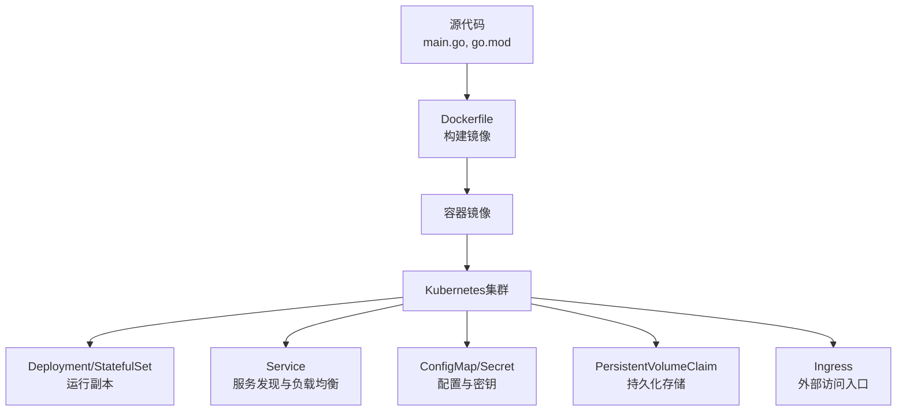
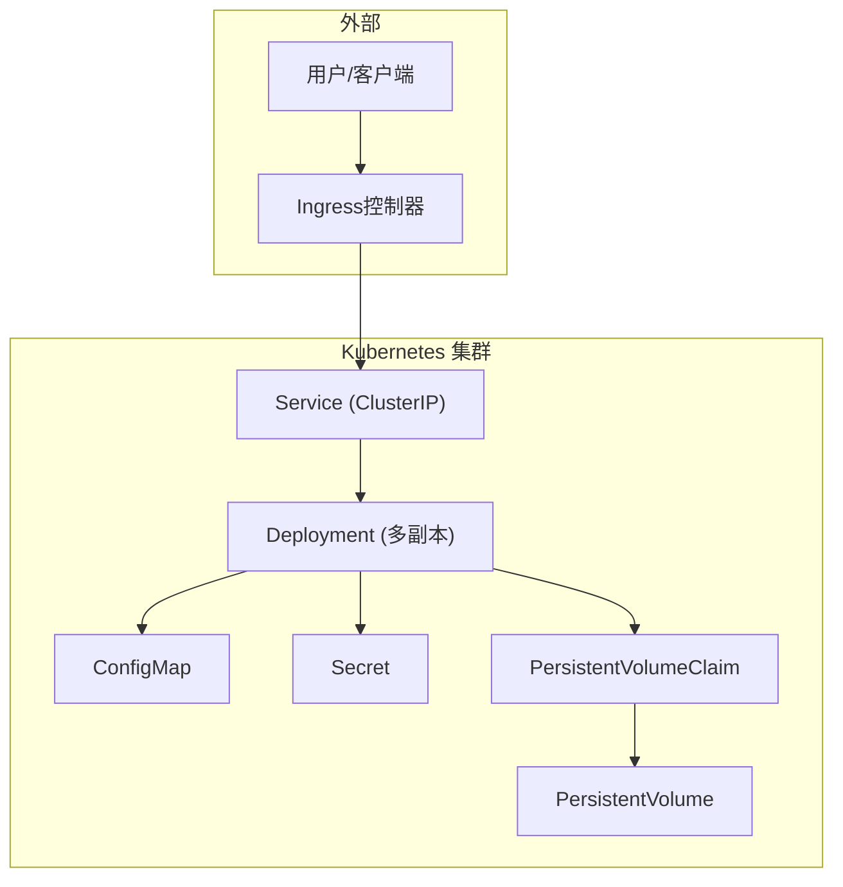
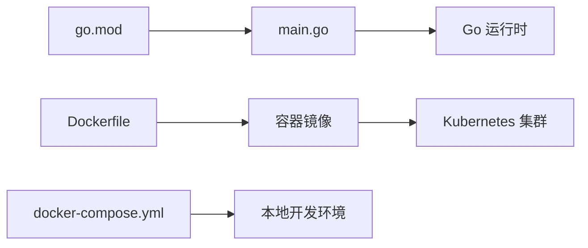

# Kubernetes部署

<cite>
**本文引用的文件**   
- [Dockerfile](file://Dockerfile)
- [docker-compose.yml](file://docker-compose.yml)
- [docker-compose.dev.yml](file://docker-compose.dev.yml)
- [main.go](file://main.go)
- [go.mod](file://go.mod)
- [README.md](file://README.md)
- [new-api.service](file://new-api.service)
</cite>

## 目录
1. [简介](#简介)
2. [项目结构](#项目结构)
3. [核心组件](#核心组件)
4. [架构总览](#架构总览)
5. [详细组件分析](#详细组件分析)
6. [依赖关系分析](#依赖关系分析)
7. [性能考虑](#性能考虑)
8. [故障排查指南](#故障排查指南)
9. [结论](#结论)
10. [附录](#附录)

## 简介
本文件面向在Kubernetes上部署该项目的运维与平台工程师，提供从容器镜像构建到K8s资源编排、服务发现与负载均衡、配置与密钥管理、持久化存储、Ingress暴露、Helm Chart使用、Pod调度策略、资源限制与健康检查、高可用与生产优化以及常见问题排查的系统性指导。文档内容基于仓库中的容器化与运行相关资产进行提炼，并结合Kubernetes最佳实践给出可操作的方案与示例说明（以路径引用为主，不直接粘贴代码）。

## 项目结构
本项目采用Go语言后端与Web前端分离的架构，通过Docker镜像打包应用，并提供docker-compose用于本地开发。仓库中包含：
- 应用入口与模块定义（Go）
- Docker构建脚本
- docker-compose编排（开发与测试）
- systemd服务单元（用于宿主机直跑）
- README等文档

图表来源
- [Dockerfile](file://Dockerfile)
- [main.go](file://main.go)
- [go.mod](file://go.mod)

章节来源
- [Dockerfile](file://Dockerfile)
- [docker-compose.yml](file://docker-compose.yml)
- [docker-compose.dev.yml](file://docker-compose.dev.yml)
- [main.go](file://main.go)
- [go.mod](file://go.mod)
- [README.md](file://README.md)

## 核心组件
- 应用进程：由Go程序启动，监听HTTP端口，对外提供API与Web界面。
- 容器镜像：通过Dockerfile构建，包含运行时依赖与编译产物。
- 编排资源：
  - Deployment：管理无状态副本，支持滚动更新与回滚。
  - Service：ClusterIP/NodePort/LoadBalancer，实现服务发现与负载均衡。
  - ConfigMap/Secret：注入环境变量或挂载为文件。
  - PersistentVolumeClaim：为有状态数据提供持久化。
  - Ingress：七层路由与TLS终止。
- 健康检查：Liveness/Readiness探针确保流量只进入健康Pod。
- 调度与资源：节点选择器、亲和性、污点容忍、资源请求与限制。

章节来源
- [Dockerfile](file://Dockerfile)
- [docker-compose.yml](file://docker-compose.yml)
- [docker-compose.dev.yml](file://docker-compose.dev.yml)
- [main.go](file://main.go)

## 架构总览
下图展示典型的生产级K8s部署拓扑：Ingress作为统一入口，Service对后端Pod进行负载均衡，ConfigMap/Secret注入配置，PVC提供持久化，Deployment保证副本与自愈。

图表来源
- [Dockerfile](file://Dockerfile)
- [main.go](file://main.go)

## 详细组件分析

### 容器镜像与运行时
- 构建阶段：Dockerfile定义基础镜像、依赖安装、源码编译与产物拷贝。
- 运行阶段：最小化镜像运行Go二进制，暴露HTTP端口，配合探针与优雅停机。
- 建议：
  - 使用多阶段构建减小镜像体积。
  - 固定基础镜像版本并启用SBOM与安全扫描。
  - 非root运行，设置只读根文件系统。

章节来源
- [Dockerfile](file://Dockerfile)

### Deployment（无状态副本）
- 目标：声明期望副本数、镜像、标签、更新策略、探针、环境变量、卷挂载等。
- 关键要点：
  - 使用滚动更新策略，保障零停机发布。
  - 设置合理的资源请求与限制，避免CPU/内存争用。
  - 配置Liveness/Readiness探针，结合Startup探针处理冷启动。
  - 使用PodDisruptionBudget提升可用性。
  - 使用TopologySpreadConstraints与PodAntiAffinity分散故障域。

章节来源
- [Dockerfile](file://Dockerfile)
- [main.go](file://main.go)

### Service（服务发现与负载均衡）
- 类型：
  - ClusterIP：集群内部访问。
  - NodePort：节点端口暴露（适合临时或调试）。
  - LoadBalancer：云厂商LB集成（生产常用）。
- 负载均衡算法：默认轮询，可通过注解或外部负载均衡器调整。
- 会话保持：根据业务需要开启Session Affinity。

章节来源
- [docker-compose.yml](file://docker-compose.yml)
- [docker-compose.dev.yml](file://docker-compose.dev.yml)

### ConfigMap与Secret（配置与密钥）
- ConfigMap：存放非敏感配置，如端口、日志级别、功能开关；支持环境变量与文件挂载两种模式。
- Secret：存放敏感信息，如数据库密码、第三方Key；支持base64编码或Opaque类型。
- 动态更新：ConfigMap支持热更新（需应用支持），Secret支持滚动更新。

章节来源
- [docker-compose.yml](file://docker-compose.yml)
- [docker-compose.dev.yml](file://docker-compose.dev.yml)

### 持久化存储（PVC/PV）
- 适用场景：日志落盘、缓存、用户上传文件、有状态中间件数据。
- 存储类：根据云厂商或自建CSI选择合适的StorageClass。
- 访问模式：ReadWriteOnce/ReadOnlyMany/ReadWriteMany按需选择。
- 备份与恢复：结合快照与对象存储归档。

章节来源
- [docker-compose.yml](file://docker-compose.yml)
- [docker-compose.dev.yml](file://docker-compose.dev.yml)

### Ingress（外部访问与TLS）
- 作用：将Service暴露给外部，支持域名路由、路径重写、TLS终止、限流与鉴权。
- 控制器：Nginx、Traefik、ALB/CLB等。
- 安全：强制HTTPS、证书自动续期、WAF与Bot防护。

章节来源
- [docker-compose.yml](file://docker-compose.yml)
- [docker-compose.dev.yml](file://docker-compose.dev.yml)

### Helm Chart（应用打包与版本管理）
- 用途：将Deployment、Service、ConfigMap、Secret、Ingress、PVC等资源模板化，便于环境差异管理与批量部署。
- 推荐做法：
  - values.yaml集中管理参数。
  - 使用命名空间隔离不同环境。
  - 引入外部值源（Vault、Sealed Secrets、SOPS）。
  - 使用Helm钩子执行迁移与初始化任务。

章节来源
- [docker-compose.yml](file://docker-compose.yml)
- [docker-compose.dev.yml](file://docker-compose.dev.yml)

### Pod调度策略与亲和性
- 节点选择：nodeSelector、nodeName。
- 亲和性：nodeAffinity/podAffinity/podAntiAffinity。
- 污点与容忍：taints/tolerations控制不可调度节点。
- 拓扑分布：topologySpreadConstraints降低单点风险。
- 资源约束：requests/limits保障QoS等级（Guaranteed/Burstable/BestEffort）。

章节来源
- [docker-compose.yml](file://docker-compose.yml)
- [docker-compose.dev.yml](file://docker-compose.dev.yml)

### 健康检查与弹性伸缩
- Liveness：检测进程是否存活，失败则重启。
- Readiness：检测是否可接收流量，失败则摘除端点。
- Startup：针对慢启动应用，避免过早探测失败。
- HPA：基于CPU/内存或自定义指标自动扩缩容。
- VPA：自动调整资源请求与限制。

章节来源
- [docker-compose.yml](file://docker-compose.yml)
- [docker-compose.dev.yml](file://docker-compose.dev.yml)

### 网络与DNS
- 服务发现：Service名称解析为ClusterIP，Pod内通过DNS访问。
- 跨命名空间访问：使用FQDN或CoreDNS配置。
- 网络策略：NetworkPolicy限制Pod间通信。

章节来源
- [docker-compose.yml](file://docker-compose.yml)
- [docker-compose.dev.yml](file://docker-compose.dev.yml)

### 日志与监控
- 日志采集：Sidecar或DaemonSet收集stdout/stderr与文件日志。
- 指标暴露：Prometheus抓取应用指标与K8s组件指标。
- 告警规则：基于阈值与异常模式触发告警。

章节来源
- [docker-compose.yml](file://docker-compose.yml)
- [docker-compose.dev.yml](file://docker-compose.dev.yml)

### 安全加固
- 镜像安全：漏洞扫描、签名校验、最小权限镜像。
- 运行时安全：PodSecurityAdmission、SELinux/AppArmor、只读根文件系统。
- 访问控制：RBAC、NetworkPolicy、OPA/Gatekeeper。
- 密钥管理：Sealed Secrets、External Secrets、Vault。

章节来源
- [docker-compose.yml](file://docker-compose.yml)
- [docker-compose.dev.yml](file://docker-compose.dev.yml)

### 高可用与灾备
- 多副本与多可用区部署。
- 多主控制面与etcd集群。
- 数据备份与异地容灾。
- 灰度发布与蓝绿/金丝雀发布。

章节来源
- [docker-compose.yml](file://docker-compose.yml)
- [docker-compose.dev.yml](file://docker-compose.dev.yml)

## 依赖关系分析
- 应用入口：main.go定义HTTP服务与路由。
- 构建依赖：go.mod声明Go模块与依赖版本。
- 容器化：Dockerfile定义镜像构建流程。
- 编排：docker-compose用于本地快速验证。

图表来源
- [main.go](file://main.go)
- [go.mod](file://go.mod)
- [Dockerfile](file://Dockerfile)
- [docker-compose.yml](file://docker-compose.yml)

章节来源
- [main.go](file://main.go)
- [go.mod](file://go.mod)
- [Dockerfile](file://Dockerfile)
- [docker-compose.yml](file://docker-compose.yml)
- [docker-compose.dev.yml](file://docker-compose.dev.yml)

## 性能考虑
- 镜像优化：多阶段构建、精简基础镜像、减少层数。
- 资源规划：合理设置requests/limits，避免过度预留或不足。
- 连接池：数据库/Redis连接池大小与超时调优。
- 缓存策略：本地缓存+分布式缓存分层。
- 水平扩展：HPA基于负载自动扩容。
- 网络优化：关闭不必要的代理、启用HTTP/2与Keep-Alive。
- 存储I/O：选择高性能存储类，合理分片与读写分离。

[本节为通用指导，不直接分析具体文件]

## 故障排查指南
- 镜像拉取失败：检查镜像仓库地址、凭据、网络连通性与镜像名/标签。
- Pod无法启动：查看Events与日志，确认探针、资源限制、卷挂载与配置项。
- 服务不可达：检查Service、Endpoints、Ingress与网络策略。
- 配置未生效：确认ConfigMap/Secret已挂载或注入，应用是否支持热更新。
- 性能抖动：分析CPU/内存使用、GC、锁竞争与外部依赖延迟。
- 磁盘写满：清理日志与临时文件，调整保留策略与滚动策略。
- 证书问题：检查Ingress TLS配置与证书有效期。

章节来源
- [docker-compose.yml](file://docker-compose.yml)
- [docker-compose.dev.yml](file://docker-compose.dev.yml)

## 结论
通过容器化与Kubernetes编排，可将应用以标准化方式交付至生产环境。结合合理的资源配置、健康检查、服务发现、负载均衡、持久化与Ingress暴露，可实现高可用、可扩展且易维护的部署体系。借助Helm统一管理版本与环境差异，辅以完善的监控、日志与安全策略，满足生产环境的稳定性与合规要求。

[本节为总结性内容，不直接分析具体文件]

## 附录

### 常见K8s资源清单（以路径引用为例）
- Deployment：参考仓库中编排与运行相关配置，按以下字段组织：
  - metadata.name、labels
  - spec.replicas、strategy
  - spec.selector.matchLabels
  - spec.template.spec.containers[*].image、ports、env、resources、liveness/readiness/startup probes、volumeMounts
- Service：metadata.name、spec.type（ClusterIP/NodePort/LoadBalancer）、spec.ports、spec.selector
- ConfigMap：metadata.name、data键值对
- Secret：metadata.name、type（Opaque）、data或stringData
- PVC：metadata.name、spec.storageClassName、accessModes、resources.requests.storage
- Ingress：metadata.name、spec.rules[*].host、http.paths[*].path、backend.service
- HPA：metadata.name、spec.scaleTargetRef、spec.metrics

章节来源
- [docker-compose.yml](file://docker-compose.yml)
- [docker-compose.dev.yml](file://docker-compose.dev.yml)

### 生产环境优化清单
- 多副本与多可用区部署
- 使用专用命名空间与RBAC最小权限
- 启用PodDisruptionBudget与HPA/VPA
- 配置日志轮转与集中采集
- 启用网络策略与镜像安全扫描
- 使用外部密钥管理服务
- 定期演练灾难恢复与回滚

[本节为通用指导，不直接分析具体文件]

### 与现有编排文件的关联
- 容器镜像构建：Dockerfile
- 本地开发编排：docker-compose.yml、docker-compose.dev.yml
- 应用入口与模块：main.go、go.mod
- 系统服务单元（宿主机直跑）：new-api.service

章节来源
- [Dockerfile](file://Dockerfile)
- [docker-compose.yml](file://docker-compose.yml)
- [docker-compose.dev.yml](file://docker-compose.dev.yml)
- [main.go](file://main.go)
- [go.mod](file://go.mod)
- [new-api.service](file://new-api.service)
- [README.md](file://README.md)