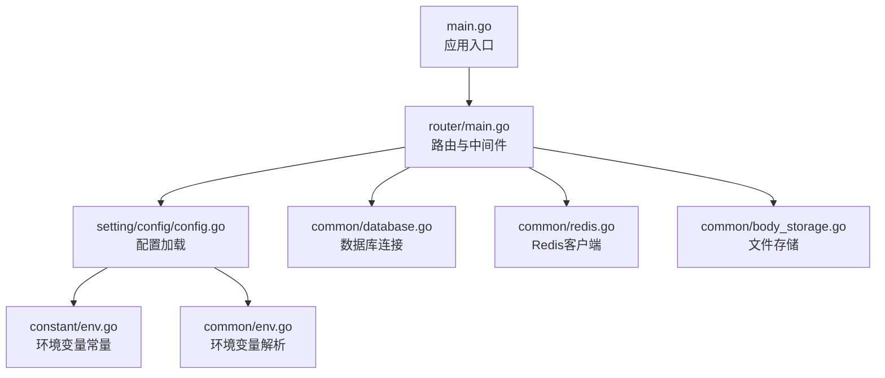
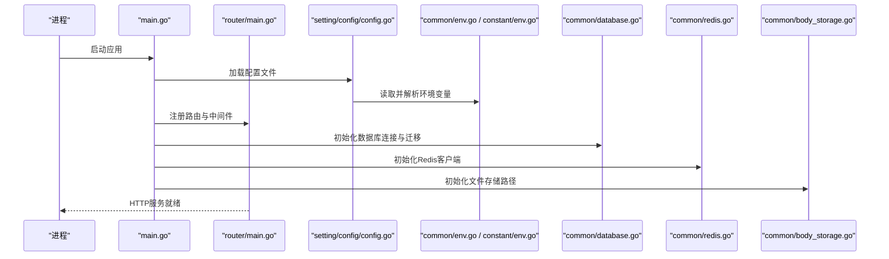
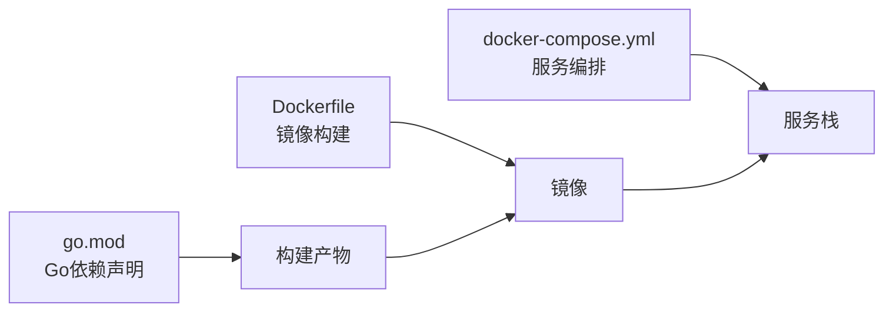

# 环境准备

<cite>
**本文引用的文件**   
- [README.zh_CN.md](file://README.zh_CN.md)
- [go.mod](file://go.mod)
- [Dockerfile](file://Dockerfile)
- [docker-compose.yml](file://docker-compose.yml)
- [main.go](file://main.go)
- [common/env.go](file://common/env.go)
- [constant/env.go](file://constant/env.go)
- [setting/config/config.go](file://setting/config/config.go)
- [common/database.go](file://common/database.go)
- [common/redis.go](file://common/redis.go)
- [common/body_storage.go](file://common/body_storage.go)
- [router/main.go](file://router/main.go)
- [bin/migration_v0.2-v0.3.sql](file://bin/migration_v0.2-v0.3.sql)
- [bin/migration_v0.3-v0.4.sql](file://bin/migration_v0.3-v0.4.sql)
</cite>

## 目录
1. [简介](#简介)
2. [项目结构](#项目结构)
3. [核心组件](#核心组件)
4. [架构总览](#架构总览)
5. [详细组件分析](#详细组件分析)
6. [依赖分析](#依赖分析)
7. [性能考虑](#性能考虑)
8. [故障排查指南](#故障排查指南)
9. [结论](#结论)
10. [附录](#附录)

## 简介
本文件面向首次部署与运维人员，提供完整的环境准备指南。内容涵盖系统要求、Go版本与依赖安装、环境变量配置、数据库初始化、Redis配置、文件存储设置、SSL证书配置、防火墙与安全组规则、常见问题与解决方案，以及跨平台的一键脚本与验证步骤。目标是帮助读者在最短的时间内完成稳定可用的生产或开发环境搭建。

## 项目结构
本项目采用分层模块化设计：
- 入口与路由：main.go 负责启动服务，router/* 定义HTTP路由与中间件挂载点
- 配置与环境：setting/config/* 与 constant/env.go、common/env.go 集中管理配置加载与环境变量解析
- 数据层：common/database.go、model/* 负责数据库连接与模型映射；common/redis.go 负责缓存与分布式锁
- 业务逻辑：service/*、controller/*、relay/* 等实现具体功能
- 运行与容器化：Dockerfile、docker-compose.yml、makefile 支持本地与容器化部署

图表来源 
- [main.go:1-200](file://main.go#L1-L200)
- [router/main.go:1-200](file://router/main.go#L1-L200)
- [setting/config/config.go:1-200](file://setting/config/config.go#L1-L200)
- [constant/env.go:1-200](file://constant/env.go#L1-L200)
- [common/env.go:1-200](file://common/env.go#L1-L200)
- [common/database.go:1-200](file://common/database.go#L1-L200)
- [common/redis.go:1-200](file://common/redis.go#L1-L200)
- [common/body_storage.go:1-200](file://common/body_storage.go#L1-L200)

章节来源
- [README.zh_CN.md](file://README.zh_CN.md)
- [go.mod:1-200](file://go.mod#L1-L200)

## 核心组件
- 配置与环境变量
  - 统一通过 setting/config/config.go 加载，结合 constant/env.go 与 common/env.go 解析环境变量，确保配置项可覆盖、可校验、可热更新（如适用）
- 数据库
  - 使用 common/database.go 建立连接池、执行迁移与基础健康检查
- Redis
  - 使用 common/redis.go 初始化连接、读写缓存、分布式锁与会话存储
- 文件存储
  - 使用 common/body_storage.go 管理上传附件、日志与静态资源路径

章节来源
- [setting/config/config.go:1-200](file://setting/config/config.go#L1-L200)
- [constant/env.go:1-200](file://constant/env.go#L1-L200)
- [common/env.go:1-200](file://common/env.go#L1-L200)
- [common/database.go:1-200](file://common/database.go#L1-L200)
- [common/redis.go:1-200](file://common/redis.go#L1-L200)
- [common/body_storage.go:1-200](file://common/body_storage.go#L1-L200)

## 架构总览
下图展示了从进程启动到外部依赖的交互关系，包括配置加载、数据库与Redis初始化、路由注册与请求处理流程。

图表来源 
- [main.go:1-200](file://main.go#L1-L200)
- [router/main.go:1-200](file://router/main.go#L1-L200)
- [setting/config/config.go:1-200](file://setting/config/config.go#L1-L200)
- [common/env.go:1-200](file://common/env.go#L1-L200)
- [constant/env.go:1-200](file://constant/env.go#L1-L200)
- [common/database.go:1-200](file://common/database.go#L1-L200)
- [common/redis.go:1-200](file://common/redis.go#L1-L200)
- [common/body_storage.go:1-200](file://common/body_storage.go#L1-L200)

## 详细组件分析

### 系统要求与兼容性
- 操作系统
  - Linux（推荐发行版：Ubuntu、Debian、CentOS/RHEL、Alpine）
  - macOS（开发为主）
  - Windows（开发/测试可用）
- Go版本
  - 以 go.mod 中声明的最小Go版本为准，建议使用最新稳定版以获得安全补丁与性能优化
- 第三方依赖
  - 数据库：MySQL/MariaDB（推荐InnoDB引擎）、PostgreSQL（可选）
  - 缓存：Redis（建议6.2+）
  - 对象存储：本地文件系统（默认）、S3兼容存储（可选）
- 端口与网络
  - 默认HTTP端口：80/443（可通过反向代理或环境变量调整）
  - 如需直连HTTPS，需提前准备SSL证书与私钥

章节来源
- [go.mod:1-200](file://go.mod#L1-L200)
- [README.zh_CN.md](file://README.zh_CN.md)

### 依赖安装与构建
- 源码构建
  - 拉取代码后，使用Go工具链编译二进制文件
  - 前端资源打包产物需随后端一起部署（或通过Nginx/Caddy托管）
- Docker镜像
  - 使用 Dockerfile 构建镜像，或使用 docker-compose.yml 一键拉起服务栈
- 包管理器
  - 可使用 makefile 提供的目标进行常用操作（构建、测试、打包等）

章节来源
- [go.mod:1-200](file://go.mod#L1-L200)
- [Dockerfile:1-200](file://Dockerfile#L1-L200)
- [docker-compose.yml:1-200](file://docker-compose.yml#L1-L200)
- [makefile:1-200](file://makefile#L1-L200)

### 环境变量配置
- 配置加载顺序
  - 默认配置 -> 配置文件 -> 环境变量（环境变量优先级最高）
- 关键环境变量类别
  - 数据库连接：主机、端口、用户名、密码、库名、字符集、连接池参数
  - Redis连接：主机、端口、密码、数据库索引、TLS开关
  - 文件存储：根路径、最大上传大小、访问URL前缀
  - 应用行为：监听地址与端口、日志级别、调试开关、限流策略
- 注意事项
  - 敏感信息务必通过环境变量注入，避免写入配置文件
  - 多环境（开发/测试/生产）通过不同环境变量区分

章节来源
- [setting/config/config.go:1-200](file://setting/config/config.go#L1-L200)
- [constant/env.go:1-200](file://constant/env.go#L1-L200)
- [common/env.go:1-200](file://common/env.go#L1-L200)

### 数据库初始化与迁移
- 初始化步骤
  - 创建数据库与用户，授予必要权限
  - 启动应用时自动执行表结构迁移（按版本号递增）
- 迁移脚本
  - bin 目录下包含历史迁移SQL，用于跨版本升级
- 常见错误
  - 权限不足、字符集不匹配、连接超时、迁移冲突

章节来源
- [common/database.go:1-200](file://common/database.go#L1-L200)
- [bin/migration_v0.2-v0.3.sql:1-200](file://bin/migration_v0.2-v0.3.sql#L1-L200)
- [bin/migration_v0.3-v0.4.sql:1-200](file://bin/migration_v0.3-v0.4.sql#L1-L200)

### Redis配置与使用
- 连接参数
  - 主机、端口、密码、数据库索引、TLS（可选）
- 用途
  - 会话缓存、分布式锁、限流计数、任务队列（视功能开启情况）
- 高可用建议
  - 主从复制、哨兵或集群模式；合理设置过期时间与重试策略

章节来源
- [common/redis.go:1-200](file://common/redis.go#L1-L200)

### 文件存储设置
- 本地存储
  - 指定根目录与访问URL前缀，确保Web服务器可读可写
- 云存储（可选）
  - 配置S3兼容端点、Bucket、密钥与区域
- 安全与容量
  - 限制单文件大小与并发上传数；定期清理临时文件

章节来源
- [common/body_storage.go:1-200](file://common/body_storage.go#L1-L200)

### SSL证书配置与HTTPS
- 自签证书
  - 适用于内网或测试环境，注意浏览器信任问题
- 权威CA证书
  - 推荐使用Let's Encrypt或云厂商证书
- 部署方式
  - 反向代理（Nginx/Caddy/Traefik）终止TLS，后端仅处理HTTP
  - 或直接由应用加载证书（需正确配置环境变量）

章节来源
- [setting/config/config.go:1-200](file://setting/config/config.go#L1-L200)
- [constant/env.go:1-200](file://constant/env.go#L1-L200)

### 防火墙与安全组
- 最小开放原则
  - 仅开放必要的入站端口（如80/443），数据库与Redis对公网不可见
- 白名单
  - 限制管理接口与内部服务的访问来源IP
- 出站规则
  - 允许访问上游API与对象存储端点

章节来源
- [README.zh_CN.md](file://README.zh_CN.md)

### 启动流程与路由注册
- 启动顺序
  - 加载配置 -> 初始化依赖（DB/Redis/存储）-> 注册路由与中间件 -> 启动HTTP服务
- 健康检查
  - 提供健康检查端点，便于负载均衡与健康探针

章节来源
- [main.go:1-200](file://main.go#L1-L200)
- [router/main.go:1-200](file://router/main.go#L1-L200)

## 依赖分析
- 语言与运行时
  - Go模块依赖由 go.mod 管理，确保构建一致性
- 容器化依赖
  - Dockerfile 定义基础镜像、依赖安装与构建步骤
  - docker-compose.yml 编排数据库、Redis与应用服务

图表来源 
- [go.mod:1-200](file://go.mod#L1-L200)
- [Dockerfile:1-200](file://Dockerfile#L1-L200)
- [docker-compose.yml:1-200](file://docker-compose.yml#L1-L200)

章节来源
- [go.mod:1-200](file://go.mod#L1-L200)
- [Dockerfile:1-200](file://Dockerfile#L1-L200)
- [docker-compose.yml:1-200](file://docker-compose.yml#L1-L200)

## 性能考虑
- 数据库
  - 合理设置连接池大小、查询超时与索引优化
- Redis
  - 启用持久化（AOF/RDB）与内存淘汰策略，监控命中率
- 文件存储
  - 大文件分块上传与断点续传；CDN加速静态资源
- 应用层
  - 启用Gzip压缩、缓存热点数据、限流与熔断

[本节为通用指导，无需特定文件引用]

## 故障排查指南
- 无法连接数据库
  - 检查主机、端口、用户名、密码、字符集与权限
  - 查看连接池与超时配置
- Redis连接失败
  - 核对认证信息与网络可达性，确认TLS配置一致
- 文件上传失败
  - 检查磁盘空间、目录权限与大小限制
- HTTPS握手失败
  - 校验证书链完整性与域名匹配，确认代理配置正确
- 启动即崩溃
  - 查看日志级别与输出位置，定位缺失环境变量或配置错误

章节来源
- [common/database.go:1-200](file://common/database.go#L1-L200)
- [common/redis.go:1-200](file://common/redis.go#L1-L200)
- [common/body_storage.go:1-200](file://common/body_storage.go#L1-L200)
- [setting/config/config.go:1-200](file://setting/config/config.go#L1-L200)

## 结论
通过遵循本指南的系统要求、依赖安装、环境变量与基础设施配置，您可以快速搭建稳定可靠的新API运行环境。建议在测试环境充分验证后再迁移至生产环境，并结合监控与告警保障长期稳定性。

[本节为总结性内容，无需特定文件引用]

## 附录

### 一键脚本与验证步骤（跨平台）
- Linux/macOS示例脚本要点
  - 安装Go与依赖
  - 克隆仓库并构建
  - 初始化数据库与Redis
  - 启动服务并检查端口
  - 验证健康检查与登录流程
- Windows示例脚本要点
  - 使用PowerShell或批处理脚本执行相同步骤
  - 注意路径分隔符与权限差异
- 验证清单
  - 数据库连通性与迁移成功
  - Redis读写正常
  - 文件上传下载成功
  - HTTPS证书生效
  - 基本业务接口可用

[本节为通用指导，无需特定文件引用]